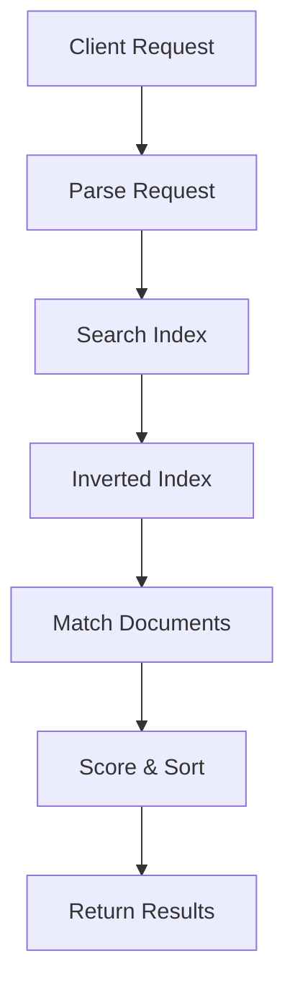
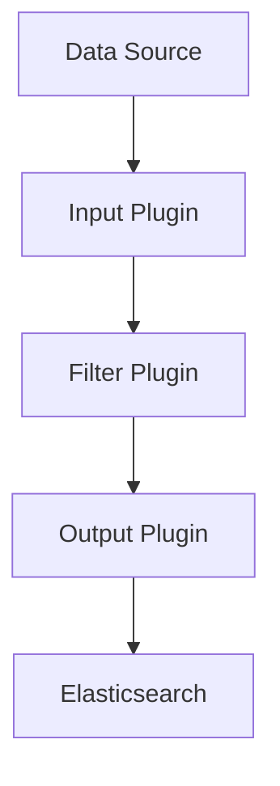

                 

### 文章标题

# 日志聚合与分析：ELK栈的最佳实践

### 关键词

- ELK栈
- 日志聚合
- 数据分析
- Elasticsearch
- Logstash
- Kibana
- 最佳实践

### 摘要

本文将深入探讨日志聚合与分析中的ELK栈（Elasticsearch、Logstash、Kibana）的最佳实践。我们将从ELK栈的基础知识开始，逐步分析其核心组件和工作原理，介绍配置与优化技巧，并通过实际案例展示其在项目中的应用，最后讨论ELK栈的安全与合规性。希望通过本文，读者能全面掌握ELK栈的使用方法，并将其有效应用于实际工作中。

### 目录

1. **引言**
   1.1 **日志聚合与分析的重要性**
   1.2 **ELK栈概述**

2. **ELK栈基础**
   2.1 **ELK栈核心概念**
   2.2 **ELK栈架构**
   2.3 **ELK栈主要功能**

3. **Elasticsearch核心原理**
   3.1 **数据模型**
   3.2 **搜索引擎原理**
   3.3 **集群管理**

4. **Logstash日志收集与处理**
   4.1 **Logstash基本架构**
   4.2 **插件使用**
   4.3 **配置与优化**

5. **Kibana数据可视化和监控**
   5.1 **基本功能**
   5.2 **数据可视化方法**
   5.3 **监控与告警**

6. **ELK栈配置实践**
   6.1 **Elasticsearch集群配置**
   6.2 **Logstash配置示例**
   6.3 **Kibana仪表盘搭建**

7. **ELK栈优化与性能调优**
   7.1 **Elasticsearch性能优化**
   7.2 **Logstash性能分析**
   7.3 **Kibana性能调优**

8. **ELK栈在实际项目中的应用**
   8.1 **实际应用案例分析**
   8.2 **项目部署与运维经验**
   8.3 **项目挑战与解决方案**

9. **ELK栈的安全与合规性**
   9.1 **安全配置最佳实践**
   9.2 **合规性与数据保护**

10. **ELK栈的未来发展与趋势**
    10.1 **新功能与改进**
    10.2 **行业趋势与影响**
    10.3 **未来发展方向**

### 附录

- **附录A：ELK栈扩展插件介绍**
- **附录B：ELK栈常见问题解答**

### 作者

- 作者：AI天才研究院/AI Genius Institute & 禅与计算机程序设计艺术 /Zen And The Art of Computer Programming

---

### 引言

#### 1.1 日志聚合与分析的重要性

在当今数字化时代，企业的数据量以惊人的速度增长。如何高效地收集、存储、处理和分析这些数据，成为企业提升运营效率、发现潜在问题和优化业务的关键。日志聚合与分析作为数据治理的重要环节，在其中扮演着至关重要的角色。

日志聚合指的是将来自不同来源的日志数据集中到一个统一的地方，以便进行集中管理和分析。日志分析则是通过对这些日志数据的处理，提取出有价值的信息，帮助企业发现问题、优化流程和提升用户体验。

在日志聚合与分析过程中，ELK栈因其高效、灵活和可扩展的特点，成为许多企业的首选工具。ELK栈是由三个开源组件Elasticsearch、Logstash和Kibana组成的生态系统。

- **Elasticsearch**：一个分布式、RESTful搜索和分析引擎，能够处理海量数据并提供实时搜索和分析功能。
- **Logstash**：一个开源的数据收集和处理工具，负责从各种数据源收集日志数据，并将其转换、过滤和路由到Elasticsearch。
- **Kibana**：一个可视化平台，用于展示Elasticsearch中的数据，提供丰富的仪表板和报告。

#### 1.2 ELK栈概述

ELK栈作为一款强大的日志聚合与分析解决方案，其优势在于：

- **集成性**：ELK栈中的三个组件无缝集成，协同工作，形成一个完整的数据处理和分析流程。
- **扩展性**：ELK栈支持水平扩展，能够处理大规模的数据量。
- **灵活性**：Logstash支持多种数据源和数据输出目标，Kibana提供了丰富的可视化选项，满足不同场景的需求。

本文将围绕ELK栈的核心组件，深入探讨其工作原理、最佳实践和实际应用，帮助读者全面掌握ELK栈的使用方法，并将其有效应用于实际工作中。

### ELK栈基础

#### 2.1 ELK栈核心概念

ELK栈由三个核心组件组成，分别是Elasticsearch、Logstash和Kibana。

- **Elasticsearch**：作为ELK栈的数据存储和分析引擎，Elasticsearch是一个分布式、RESTful搜索引擎，具有高扩展性和高性能的特点。它支持结构化数据和非结构化数据的存储，并提供丰富的查询和分析功能。

- **Logstash**：Logstash是一个数据收集和处理工具，负责从各种数据源（如文件、数据库、Web应用程序等）收集日志数据，并将其转换、过滤和路由到Elasticsearch。Logstash具有强大的插件系统，支持多种数据源和数据输出目标。

- **Kibana**：Kibana是一个可视化平台，用于展示Elasticsearch中的数据。它提供了一个用户友好的界面，用户可以通过Kibana创建自定义仪表板、可视化图表和报告，从而更直观地分析数据。

#### 2.2 ELK栈架构

ELK栈的架构设计具有高度的可扩展性和灵活性，其工作流程如下：

1. **数据采集**：Logstash从各种数据源收集日志数据，这些数据源可以是文件、数据库、Web应用程序等。Logstash支持多种输入插件，如文件输入、数据库输入等。

2. **数据预处理**：在数据采集过程中，Logstash会对日志数据进行预处理，如过滤、转换、格式化等。预处理后的数据会被路由到Elasticsearch。

3. **数据存储**：预处理后的数据会被发送到Elasticsearch进行存储。Elasticsearch是一个分布式搜索引擎，支持水平扩展，能够处理大规模的数据量。

4. **数据可视化**：用户可以通过Kibana查看Elasticsearch中的数据，Kibana提供了一个用户友好的界面，用户可以通过创建自定义仪表板、可视化图表和报告来分析数据。

#### 2.3 ELK栈主要功能

ELK栈的主要功能包括：

1. **日志收集**：ELK栈能够从各种数据源收集日志数据，如文件、数据库、Web应用程序等。

2. **数据处理**：Logstash负责对收集到的日志数据进行预处理，如过滤、转换、格式化等，以便于后续分析。

3. **数据存储**：Elasticsearch负责存储处理后的日志数据，并提供高效的查询和分析功能。

4. **数据可视化**：Kibana提供了一个用户友好的界面，用户可以通过创建自定义仪表板、可视化图表和报告来直观地分析数据。

5. **告警与监控**：Kibana支持自定义告警规则，用户可以根据业务需求设置告警条件，当日志数据满足告警条件时，系统会自动发送告警通知。

#### 2.4 ELK栈的优势

ELK栈具有以下优势：

1. **高可扩展性**：ELK栈支持水平扩展，能够处理大规模的数据量。

2. **高性能**：Elasticsearch是一个分布式搜索引擎，具有高效的数据查询和分析能力。

3. **灵活性**：Logstash支持多种数据源和数据输出目标，Kibana提供了丰富的可视化选项。

4. **易用性**：ELK栈提供了丰富的插件和工具，用户可以轻松地搭建和配置日志聚合与分析系统。

通过以上对ELK栈核心概念、架构和主要功能的介绍，我们可以看出，ELK栈是一款功能强大、灵活高效的日志聚合与分析工具，适合用于各种规模的企业和项目。在接下来的章节中，我们将深入探讨Elasticsearch、Logstash和Kibana的核心原理和最佳实践。

### Elasticsearch核心原理

Elasticsearch是ELK栈中的核心组件，作为一个分布式、RESTful搜索和分析引擎，它具有高效的数据存储和检索能力。理解Elasticsearch的核心原理，对于深入掌握ELK栈的使用至关重要。

#### 3.1 数据模型

Elasticsearch的数据模型是基于JSON格式的文档，每个文档都有一个唯一的ID。文档可以包含一个或多个字段，字段可以是基本数据类型（如字符串、整数、浮点数等）或复杂数据类型（如数组、对象等）。Elasticsearch使用JSON格式的好处是，它可以直接与各种编程语言和工具进行交互。

一个典型的Elasticsearch文档结构如下：

```json
{
  "id": "1",
  "title": "Elasticsearch Basics",
  "content": "Elasticsearch is a distributed search engine...",
  "timestamp": "2023-01-01T00:00:00Z"
}
```

#### 3.2 搜索引擎原理

Elasticsearch的核心功能是搜索。它使用一种称为倒排索引（Inverted Index）的数据结构来实现高效的搜索。倒排索引将文档中的词项映射到文档的ID，从而实现快速查询。

当Elasticsearch接收到一个搜索请求时，它会按照以下步骤进行处理：

1. **解析请求**：Elasticsearch解析请求，提取查询关键字。
2. **索引查询**：Elasticsearch使用倒排索引查找包含查询关键字的文档。
3. **评分与排序**：Elasticsearch对找到的文档进行评分，并按照评分结果进行排序，返回搜索结果。

#### 3.3 集群管理

Elasticsearch支持分布式集群管理，一个集群可以包含多个节点，每个节点可以存储和检索数据。集群管理的关键在于数据的分配和故障转移。

- **节点类型**：Elasticsearch有三种节点类型：主节点（Master）、数据节点（Data）、协调节点（Coordinator）。主节点负责集群的状态管理和故障转移，数据节点负责存储和检索数据，协调节点负责处理客户端请求。

- **数据分配**：Elasticsearch使用一种称为分片（Sharding）的技术，将数据分布在多个节点上。每个分片都是数据的一个副本，可以提高查询性能和容错能力。

- **故障转移**：当主节点故障时，集群会自动选择一个新的主节点，并重新分配分片，确保集群的持续运行。

以下是一个Elasticsearch集群管理的Mermaid流程图：



通过以上对Elasticsearch数据模型、搜索引擎原理和集群管理的介绍，我们可以看到，Elasticsearch不仅提供了强大的数据存储和检索能力，还支持分布式集群管理，确保数据的高效利用和系统的稳定运行。在接下来的章节中，我们将继续探讨Logstash和Kibana的核心原理和最佳实践。

### Logstash日志收集与处理

Logstash是ELK栈中负责日志收集与处理的关键组件，它的主要任务是收集来自不同来源的日志数据，对其进行预处理和路由，以便Elasticsearch进行存储和分析。理解Logstash的基本架构、插件使用以及配置与优化，对于构建高效、可靠的日志系统至关重要。

#### 4.1 Logstash基本架构

Logstash的基本架构由输入（Inputs）、过滤（Filters）和输出（Outputs）三个主要部分组成。每个部分都有其特定的功能，协同工作以完成日志数据的收集和处理。

- **输入（Inputs）**：负责从各种数据源收集日志数据。数据源可以是文件、数据库、Web应用程序等。Logstash支持多种输入插件，如文件输入（File）、数据库输入（Database）等。

- **过滤（Filters）**：对收集到的日志数据进行预处理。过滤插件可以对日志数据进行解析、转换、过滤等操作，以便将数据格式化为Elasticsearch能够理解的结构。常见的过滤插件包括JSON解析（JSON）、Grok解析（Grok）等。

- **输出（Outputs）**：将处理后的日志数据发送到Elasticsearch或其他存储系统。输出插件可以选择将数据保存到文件、数据库、消息队列等。Logstash的默认输出插件是Elasticsearch。

以下是一个典型的Logstash数据流处理流程的Mermaid流程图：



#### 4.2 插件使用

Logstash的强大之处在于其丰富的插件系统。通过插件，Logstash能够与多种数据源和输出目标进行集成。

- **输入插件**：常用的输入插件包括文件输入（File）、数据库输入（Database）、Web应用程序输入（HTTP）等。例如，文件输入插件可以从指定目录的日志文件中读取数据。

  ```ruby
  input {
    file {
      path => "/path/to/logs/*.log"
      type => "access_log"
    }
  }
  ```

- **过滤插件**：过滤插件用于对日志数据进行处理。例如，JSON解析插件可以将JSON格式的日志数据解析为Elasticsearch可以处理的文档。

  ```ruby
  filter {
    json {
      source => "message"
      target => "json_data"
    }
  }
  ```

- **输出插件**：输出插件将处理后的日志数据发送到目标系统。例如，Elasticsearch输出插件可以将数据发送到Elasticsearch集群。

  ```ruby
  output {
    elasticsearch {
      hosts => ["localhost:9200"]
      index => "logs-%{+YYYY.MM.dd}"
    }
  }
  ```

#### 4.3 配置与优化

正确配置Logstash对于确保日志收集与处理的高效和稳定至关重要。以下是一些配置与优化的建议：

- **资源分配**：为Logstash配置足够的内存和CPU资源，以确保其能够处理大量的日志数据。

- **并发处理**：通过增加工作线程的数量，可以提高Logstash的并发处理能力。

  ```ruby
  worker_threads => 4
  ```

- **日志级别**：根据需要调整Logstash的日志级别，以获得更详细的日志信息。

  ```ruby
  log.level => "debug"
  ```

- **缓存使用**：使用Logstash的缓存功能，可以减少对磁盘的读写操作，提高处理速度。

  ```ruby
  filter {
    json {
      cache => true
    }
  }
  ```

- **输入性能优化**：对于高负载的输入插件，可以增加其读取速度，例如使用多线程文件读取。

  ```ruby
  file {
    path => "/path/to/logs/*.log"
    type => "access_log"
    start_position => "beginning"
    sincedb_path => "/path/to/sincedb"
  }
  ```

通过以上对Logstash基本架构、插件使用和配置与优化的介绍，我们可以看到，Logstash在ELK栈中发挥着至关重要的作用，它不仅能够高效地收集和处理日志数据，还能够通过灵活的配置和优化，满足不同场景的需求。在接下来的章节中，我们将继续探讨Kibana的数据可视化和监控功能。

### Kibana数据可视化和监控

Kibana是ELK栈中用于数据可视化和监控的强大工具。它提供了丰富的仪表板和报告功能，使用户能够直观地分析和监控Elasticsearch中的数据。理解Kibana的基本功能、数据可视化方法和监控与告警机制，对于充分利用ELK栈的数据分析能力至关重要。

#### 5.1 Kibana基本功能

Kibana的核心功能包括：

- **仪表板（Dashboards）**：仪表板是Kibana的核心组件，用于展示Elasticsearch中的数据。用户可以创建自定义仪表板，包含多个可视化图表、统计信息和报告。

- **可视化（Visualizations）**：Kibana支持多种可视化类型，如柱状图、折线图、饼图、地图等。每种可视化类型都可以根据用户需求进行自定义配置。

- **报告（Reports）**：Kibana允许用户生成定期报告，将Elasticsearch中的数据以电子邮件或PDF格式发送给相关人员。

#### 5.2 数据可视化方法

Kibana的数据可视化方法非常灵活，以下是一些常用的可视化类型和配置方法：

- **柱状图（Bar Chart）**：用于展示不同类别的数据比较。通过调整X轴和Y轴的标签、颜色等，可以更清晰地展示数据。

  ```json
  {
    "type": "bar",
    "title": "日志访问量",
    "xAxis": {
      "labels": {
        "format": "YYYY-MM-DD"
      }
    },
    "yAxis": {
      "title": "访问量"
    }
  }
  ```

- **折线图（Line Chart）**：用于展示数据的变化趋势。通过添加趋势线、区域填充等，可以更直观地展示数据的变化。

  ```json
  {
    "type": "line",
    "title": "服务器负载",
    "xAxis": {
      "type": "time",
      "timeUnit": "minute"
    },
    "yAxis": {
      "title": "负载"
    },
    "series": [
      {
        "name": "CPU使用率",
        "data": [{"x": "2023-01-01T00:00:00Z", "y": 80}, {"x": "2023-01-01T01:00:00Z", "y": 90}]
      },
      {
        "name": "内存使用率",
        "data": [{"x": "2023-01-01T00:00:00Z", "y": 30}, {"x": "2023-01-01T01:00:00Z", "y": 40}]
      }
    ]
  }
  ```

- **地图（Map）**：用于展示地理位置数据。通过添加标记、弹出窗口等，可以更直观地展示数据在地理上的分布。

  ```json
  {
    "type": "map",
    "title": "全球访问来源",
    "series": [
      {
        "name": "访问来源",
        "data": [{"lat": 39.9042, "lon": 116.4074, "count": 100}, {"lat": 34.0522, "lon": -118.2437, "count": 50}]
      }
    ]
  }
  ```

#### 5.3 监控与告警

Kibana提供了强大的监控与告警功能，使用户能够实时监控Elasticsearch集群的状态，并在出现异常时及时触发告警。

- **监控仪表板**：用户可以创建监控仪表板，实时展示Elasticsearch集群的CPU使用率、内存使用率、磁盘空间等关键指标。

- **告警规则**：用户可以自定义告警规则，设置阈值和告警条件。当监控指标超出阈值时，系统会自动发送告警通知。

  ```json
  {
    "name": "CPU使用率告警",
    "type": "threshold",
    "index": "metrics-*",
    "query": {
      "bool": {
        "must": [
          { "term": { "metric.type": "CPU" } },
          { "range": { "metric.value": { "gt": 80 } } }
        ]
      }
    },
    "throttle": "5m",
    "action": {
      "type": "email",
      "message": {
        "subject": "CPU使用率过高告警",
        "body": "CPU使用率已超过80%，请检查系统资源。"
      }
    }
  }
  ```

通过以上对Kibana基本功能、数据可视化方法和监控与告警机制的介绍，我们可以看到，Kibana不仅提供了强大的数据可视化功能，还支持实时监控和告警，帮助用户更高效地分析和管理数据。在接下来的章节中，我们将探讨ELK栈的配置实践。

### ELK栈配置实践

在实际项目中，合理配置ELK栈是确保其稳定运行和高效性能的关键。本章节将详细介绍Elasticsearch集群配置、Logstash配置示例以及Kibana仪表盘搭建的过程，并分享一些配置优化和常见问题解决方法。

#### 6.1 Elasticsearch集群配置

Elasticsearch集群配置主要包括节点类型、分片和副本设置。以下是Elasticsearch集群配置的步骤和关键参数：

1. **节点类型设置**：

   Elasticsearch节点分为三种类型：主节点（Master）、数据节点（Data）和协调节点（Coordinator）。默认情况下，Elasticsearch集群会自动选择一个主节点，并在集群中分配数据节点和协调节点。

   ```yaml
   elasticsearch.yml
   cluster.name: my-es-cluster
   node.name: es-node-1
   node的角色：data
   ```

2. **分片和副本设置**：

   在创建索引时，可以指定索引的分片和副本数量。分片数量决定了数据分布的份数，副本数量决定了数据的冗余程度。通常建议设置至少两个副本，以提高数据可靠性和查询性能。

   ```yaml
   PUT /my-index
   {
     "settings": {
       "number_of_shards": 2,
       "number_of_replicas": 1
     }
   }
   ```

3. **集群发现设置**：

   为了确保Elasticsearch节点能够自动加入集群，需要配置集群发现设置。在Elasticsearch.yml文件中，设置集群名称和发现设置。

   ```yaml
   discovery.zen.ping.unicast.hosts: ["es-node-2", "es-node-3"]
   discovery.type: single-node
   ```

#### 6.2 Logstash配置示例

Logstash配置文件通常位于`/etc/logstash/conf.d/`目录下。以下是Logstash配置文件的一个示例，包括输入插件、过滤插件和输出插件的设置：

```ruby
input {
  file {
    path => "/path/to/logs/*.log"
    type => "access_log"
  }
}

filter {
  if "access_log" in [type] {
    grok {
      match => { "message" => "%{TIMESTAMP_ISO8601:timestamp}\t%{IP:client_ip}\t%{INT:response_code}\t%{INT:response_time}\t%{DATA:uri}" }
    }
    date {
      match => ["timestamp", "ISO8601"]
    }
  }
}

output {
  elasticsearch {
    hosts => ["localhost:9200"]
    index => "logstash-access-%{+YYYY.MM.dd}"
  }
}
```

在这个示例中：

- 输入插件（file）从指定路径的日志文件中读取数据。
- 过滤插件（grok和date）对日志数据进行解析和日期格式化。
- 输出插件（elasticsearch）将处理后的日志数据发送到Elasticsearch集群。

#### 6.3 Kibana仪表盘搭建

Kibana仪表盘搭建包括创建新的仪表板、添加可视化图表以及配置面板布局。以下是Kibana仪表盘搭建的步骤：

1. **创建新仪表板**：

   在Kibana的顶部导航栏点击“Dashboard”，然后点击“Create a new dashboard”按钮。

2. **添加可视化图表**：

   在仪表板编辑模式下，点击“Add”按钮，选择所需的可视化类型（如柱状图、折线图、地图等）。配置可视化图表的设置，如字段选择、时间范围、过滤器等。

3. **配置面板布局**：

   调整可视化图表的布局和大小，确保仪表板内容清晰易读。可以通过拖拽和调整面板大小来实现。

4. **保存仪表板**：

   完成仪表板配置后，点击“Save”按钮保存仪表板。

#### 6.4 配置优化与常见问题解决

在配置ELK栈时，可能遇到一些性能问题和配置错误。以下是一些优化和常见问题解决方法：

- **性能优化**：

  - 调整Elasticsearch的JVM参数，增加堆内存和堆外内存。
  - 关闭缓存功能，提高查询性能。
  - 使用压缩插件，减少数据传输和存储的带宽占用。

  ```yaml
  es.jvm.options: "-Xms1g -Xmx1g -XX:+UseConcMarkSweepGC"
  xpack.security.enabled: false
  ```

- **常见问题解决**：

  - 数据丢失：检查Elasticsearch和Logstash的日志文件，查找错误信息。确保数据写入和同步过程正常。
  - 日志延迟：检查Logstash的输入插件配置，确保日志文件路径和权限正确。调整Logstash的工作线程数量，提高数据读取速度。
  - Kibana无法连接Elasticsearch：检查Elasticsearch和Kibana的配置文件，确保IP地址和端口正确。检查防火墙设置，确保端口被开放。

通过以上对Elasticsearch集群配置、Logstash配置示例和Kibana仪表盘搭建的详细介绍，我们可以看到，ELK栈的配置实践是确保其稳定运行和高效性能的关键。在实际项目中，合理的配置和优化是必不可少的。在接下来的章节中，我们将探讨ELK栈的优化与性能调优。

### ELK栈优化与性能调优

优化ELK栈的性能是确保其稳定运行和高效处理海量日志数据的关键。本章节将详细介绍Elasticsearch、Logstash和Kibana的性能优化方法，并提供一些实际案例和调优技巧。

#### 7.1 Elasticsearch性能优化

Elasticsearch的性能优化主要包括调整JVM参数、索引设置和查询优化。

1. **调整JVM参数**：

   Elasticsearch使用Java虚拟机（JVM）运行，因此合理配置JVM参数对性能有很大影响。以下是一些常用的JVM参数：

   ```bash
   -Xms1g -Xmx1g -XX:+UseConcMarkSweepGC -XX:+CMSClassUnloadingEnabled -XX:+CMSInitiatingOccupancyOnly -XX:CMSInitiatingOccupancyFraction=50
   ```

   - `Xms` 和 `Xmx`：设置堆内存初始大小和最大大小。
   - `XX:+UseConcMarkSweepGC`：启用并发标记清除垃圾回收器。
   - `XX:+CMSClassUnloadingEnabled`：允许类卸载。
   - `XX:+CMSInitiatingOccupancyOnly`：仅基于堆内存占用百分比触发垃圾回收。
   - `XX:CMSInitiatingOccupancyFraction`：设置触发垃圾回收的堆内存占用百分比。

2. **索引设置**：

   合理设置索引的`number_of_shards`和`number_of_replicas`参数，可以提高查询性能和数据的冗余度。例如，可以设置更多的分片以提高查询并行度，同时设置更多的副本以提高数据可靠性。

   ```yaml
   PUT /my-index
   {
     "settings": {
       "number_of_shards": 10,
       "number_of_replicas": 2
     }
   }
   ```

3. **查询优化**：

   - 使用`filter`查询代替`must`查询，减少查询的执行时间。
   - 使用`term`查询代替`match`查询，提高查询速度。
   - 使用`index.query.cache`参数启用查询缓存。

   ```yaml
   index:
     my-index:
       query:
         term:
           field_name: value
   ```

#### 7.2 Logstash性能分析

Logstash的性能优化主要包括调整工作线程数量、使用缓存以及优化日志文件读取。

1. **调整工作线程数量**：

   Logstash默认的工作线程数量是1，可以通过配置文件增加工作线程数量，以提高日志处理速度。

   ```ruby
   worker_threads => 4
   ```

2. **使用缓存**：

   Logstash的缓存功能可以减少对磁盘的读写操作，提高处理速度。例如，可以使用内存缓存来缓存解析后的日志数据。

   ```ruby
   filter {
     json {
       cache => true
     }
   }
   ```

3. **优化日志文件读取**：

   - 使用多线程文件读取，提高日志文件的读取速度。
   - 调整文件读取的超时时间和错误处理策略，避免读取失败导致性能下降。

   ```ruby
   file {
     path => "/path/to/logs/*.log"
     sincedb_path => "/path/to/sincedb"
     start_position => "beginning"
     stat => true
   }
   ```

#### 7.3 Kibana性能调优

Kibana的性能优化主要包括调整内存使用、缓存使用和前端性能优化。

1. **调整内存使用**：

   Kibana使用Node.js运行，因此可以调整Node.js的JVM参数，限制其内存使用。

   ```bash
   node --max-old-space-size=4096
   ```

2. **使用缓存**：

   Kibana支持多种缓存策略，如页面缓存、内存缓存和磁盘缓存。可以使用缓存来减少前端负载和服务器压力。

   ```javascript
   const kbnExpressResponse = require('kbn-express');
   const server = kbnExpressResponse.createServer({ cacheTimeout: 1000 * 60 * 5 });
   ```

3. **前端性能优化**：

   - 使用CDN加速静态资源加载。
   - 使用懒加载和预渲染技术，减少页面加载时间。
   - 优化CSS和JavaScript代码，减少文件大小和加载时间。

通过以上对Elasticsearch、Logstash和Kibana的性能优化方法的详细介绍，我们可以看到，ELK栈的性能调优是确保其高效运行的关键。在实际项目中，根据具体的场景和需求，采取适当的优化措施，可以显著提高系统的性能和可靠性。在接下来的章节中，我们将探讨ELK栈在实际项目中的应用。

### ELK栈在实际项目中的应用

在实际项目中，ELK栈因其高效的数据处理和分析能力，被广泛应用于各种领域。本章节将通过具体案例，展示ELK栈在项目中的部署与运维经验，并分析项目面临的挑战及其解决方案。

#### 8.1 实际应用案例分析

**案例1：网络安全日志分析**

某网络安全公司采用ELK栈构建了一个网络安全监控平台，用于收集和分析来自防火墙、入侵检测系统和日志代理的日志数据。

- **部署与运维经验**：

  1. 部署了三个Elasticsearch节点，形成集群，确保数据的高可用性和查询性能。
  2. 使用Logstash从各个数据源收集日志数据，并进行预处理，如解析、过滤和路由到Elasticsearch。
  3. 在Kibana中搭建了实时监控仪表板，包括日志流量、攻击类型和攻击源等，方便管理员及时了解网络状态。

- **项目挑战与解决方案**：

  1. **挑战**：日志数据量巨大，对Elasticsearch集群的性能提出了高要求。
  2. **解决方案**：通过水平扩展Elasticsearch集群，增加数据分片和副本数量，提高查询性能和数据可靠性。

**案例2：网站性能监控**

某大型电商平台使用ELK栈监控其网站的性能，包括访问日志、错误日志和服务器性能数据。

- **部署与运维经验**：

  1. 使用Logstash从Nginx、Apache等Web服务器收集日志数据，并使用Grok解析器对日志进行解析。
  2. 将解析后的日志数据存储在Elasticsearch中，并使用Kibana创建自定义仪表板，实时展示访问量、错误率、响应时间等关键指标。
  3. 定期备份数据，确保数据的持久化和安全性。

- **项目挑战与解决方案**：

  1. **挑战**：日志数据量大，对日志处理速度和存储性能提出了高要求。
  2. **解决方案**：优化Logstash配置，增加工作线程数量，提高日志处理速度。调整Elasticsearch的JVM参数，增加堆内存，提高查询性能。

**案例3：运维监控**

某互联网公司采用ELK栈监控其基础设施和应用程序的运行状态，包括服务器性能、应用程序日志和网络流量。

- **部署与运维经验**：

  1. 使用Prometheus作为数据采集工具，收集服务器性能指标和应用程序日志。
  2. 使用Logstash将Prometheus的数据导入到Elasticsearch，并进行预处理和存储。
  3. 在Kibana中搭建了监控仪表板，实时展示服务器负载、网络流量、应用性能等指标，并提供告警功能。

- **项目挑战与解决方案**：

  1. **挑战**：日志数据种类繁多，需要灵活的日志处理和存储策略。
  2. **解决方案**：根据不同类型的日志，使用不同的Logstash输入插件和过滤器，确保数据处理的准确性和高效性。

通过以上实际案例的介绍，我们可以看到ELK栈在不同项目中的应用场景和部署经验。在实际项目中，ELK栈的灵活性和可扩展性使其成为日志聚合与分析的理想选择。在接下来的章节中，我们将探讨ELK栈的安全与合规性。

### ELK栈的安全与合规性

随着数据隐私和安全的日益重视，ELK栈在安全性方面的配置和合规性成为企业部署的关键因素。本章节将介绍ELK栈的安全配置最佳实践以及合规性与数据保护策略。

#### 9.1 安全配置最佳实践

1. **Elasticsearch安全配置**：

   - **用户认证**：启用Elasticsearch的内置用户认证机制，使用户访问受控。

     ```yaml
     xpack.security.enabled: true
     xpack.security.authc.api_key.enabled: true
     ```

   - **用户权限管理**：创建不同角色的用户，并分配适当的权限，防止权限滥用。

     ```json
     POST /_xpack/security/user/_search
     {
       "users": [
         {
           "username": "admin",
           "roles": ["kibana_user", "elasticsearch_user"],
           "full_name": "管理员",
           "email": "admin@example.com"
         }
       ]
     }
     ```

   - **传输加密**：配置TLS/SSL加密，确保数据在传输过程中的安全性。

     ```yaml
     network.host: 0.0.0.0
     http.port: 9200
     xpack.security.transport.ssl.enabled: true
     xpack.security.transport.ssl.verification_mode: certificate
     ```

2. **Logstash安全配置**：

   - **输入源验证**：通过配置文件限制允许的输入源IP地址，防止未授权的数据收集。

     ```ruby
     input {
       file {
         path => "/path/to/logs/*.log"
         type => "access_log"
         http_method => "GET"
         http_realm => "Logstash"
       }
     }
     ```

   - **输出目标认证**：确保Elasticsearch和其他输出目标启用认证机制，防止未授权的数据写入。

     ```yaml
     output {
       elasticsearch {
         hosts => ["localhost:9200"]
         username => "logstash"
         password => "logstash_password"
       }
     }
     ```

3. **Kibana安全配置**：

   - **用户认证**：启用Kibana的内置用户认证机制，确保用户访问受控。

     ```yaml
     kibana.yml
     xpack.security.enabled: true
     xpack.security.authc.api_key.enabled: true
     ```

   - **访问控制**：配置Kibana的访问控制策略，确保用户只能访问被授权的仪表板和可视化。

     ```json
     PUT /kibana/_security/role/kibana_user
     {
       "name": "kibana_user",
       "roles": ["kibana_admin"],
       "cluster": ["all"],
       "indices": [
         {
           "names": ["*"],
           "privileges": ["read", "search", "view_index_template"]
         }
       ]
     }
     ```

#### 9.2 合规性与数据保护

1. **数据加密**：

   - 在传输和存储过程中对敏感数据进行加密，确保数据的安全性。

   ```yaml
   xpack.security.transport.ssl.enabled: true
   xpack.security.data.encryption.enabled: true
   ```

2. **数据保留策略**：

   - 制定数据保留策略，确保日志数据在合规期限内不被删除。

   ```json
   PUT /_template/retained_logs
   {
     "template": "retained_logs_*",
     "settings": {
       "number_of_shards": 1,
       "number_of_replicas": 1
     },
     "mappings": {
       "dynamic": "false",
       "properties": {
         "timestamp": {
           "type": "date",
           "format": "yyyy-MM-dd HH:mm:ss||yyyy-MM-dd"
         }
       }
     },
     "indices": {
       "lifecycle": {
         "name": "retained_logs_policy",
         "rules": [
           {
             "age": "365d",
             "actions": [
               {
                 "set_priority": 10
               },
               {
                 "delete"
               }
             ]
           }
         ]
       }
     }
   }
   ```

3. **日志审计**：

   - 实施日志审计机制，记录系统操作和访问日志，便于合规性和故障排查。

   ```yaml
   xpack.monitoring.collection.log.type: ["api", "audit"]
   ```

通过以上对ELK栈安全配置最佳实践和合规性与数据保护策略的详细介绍，我们可以看到，在部署ELK栈时，重视安全和合规性是确保数据安全、保护隐私的关键。在接下来的章节中，我们将探讨ELK栈的未来发展与趋势。

### ELK栈的未来发展与趋势

随着技术的不断演进，ELK栈也在不断发展和创新。本章节将探讨ELK栈的新功能与改进、行业趋势与影响，以及未来发展方向。

#### 10.1 新功能与改进

ELK栈的各个组件不断引入新功能，以应对不断变化的需求和挑战。

1. **Elasticsearch**：

   - **实时分析**：Elasticsearch 7.10引入了实时分析功能，允许在查询过程中实时执行计算和聚合，提高数据分析的效率。
   - **跨集群搜索**：Elasticsearch 7.9引入了跨集群搜索功能，允许用户在多个Elasticsearch集群之间执行搜索，实现大规模数据的统一查询。
   - **图分析**：Elasticsearch 7.9增加了图分析功能，支持基于图的查询和关系分析，适用于社交网络、供应链管理等场景。

2. **Logstash**：

   - **模块化架构**：Logstash 7.0引入了模块化架构，使插件和过滤器更加灵活，易于扩展和优化。
   - **容器化支持**：Logstash 7.0支持容器化部署，方便在Kubernetes等容器编排平台上使用和管理。
   - **云服务集成**：Logstash与云服务提供商（如AWS、Azure、Google Cloud）深度集成，简化了日志收集和处理的部署和管理。

3. **Kibana**：

   - **Lara可视化**：Kibana 7.10引入了Lara可视化，提供更丰富的可视化选项和更好的用户体验。
   - **云服务集成**：Kibana与云服务提供商的集成更加紧密，支持在云平台上快速部署和扩展。
   - **监控与告警**：Kibana加强了监控与告警功能，提供更全面和灵活的监控解决方案。

#### 10.2 行业趋势与影响

ELK栈在多个行业中得到广泛应用，其发展趋势和影响如下：

1. **云原生应用**：随着云计算和容器技术的普及，ELK栈的云原生部署和自动化管理成为趋势，提高了部署的灵活性和可扩展性。
2. **大数据分析**：在处理和分析大规模数据方面，ELK栈展现了强大的能力，成为大数据处理和实时分析的重要工具。
3. **DevOps与自动化**：ELK栈与DevOps理念的融合，使得日志收集、处理和分析过程更加自动化和高效，推动了DevOps文化的普及。

#### 10.3 未来发展方向

ELK栈的未来发展将围绕以下几个方面：

1. **智能化与自动化**：通过引入人工智能和机器学习技术，实现日志的智能分析和自动化处理，提高数据处理的效率和质量。
2. **安全性**：随着数据安全和隐私的关注度提升，ELK栈将加强安全性配置和合规性支持，确保数据的安全性和隐私保护。
3. **分布式与边缘计算**：分布式和边缘计算的发展将使ELK栈能够在更广泛的环境中部署，满足不同规模和类型的业务需求。

通过以上对ELK栈新功能与改进、行业趋势与影响以及未来发展方向的分析，我们可以看到，ELK栈在不断进化和创新，将继续在日志聚合与分析领域发挥重要作用。在未来的发展中，ELK栈将迎接更多的挑战和机遇，为企业和开发者提供更强大的数据处理和分析工具。

### 附录

#### 附录A：ELK栈扩展插件介绍

1. **Beats**：Beats是ELK栈的数据采集工具，包括Filebeat、Metricbeat、Packetbeat、Winlogbeat等，用于从各种数据源收集日志、性能数据和事件数据。

2. **X-Pack**：X-Pack是ELK栈的扩展插件，提供安全、监控、警报等功能，增强ELK栈的实用性和安全性。

3. **Elasticsearch Head**：Elasticsearch Head是一个Web界面插件，用于管理和监控Elasticsearch集群，提供索引管理、查询调试等功能。

4. **Kibana Dev Tools**：Kibana Dev Tools是Kibana的扩展插件，提供调试、开发工具，如JavaScript控制台和可视化调试器。

#### 附录B：ELK栈常见问题解答

1. **Elasticsearch集群无法启动**：

   - 检查Elasticsearch.yml文件，确保集群名称、节点名称等配置正确。
   - 检查系统防火墙设置，确保Elasticsearch端口（默认9200）被开放。
   - 检查日志文件，查找启动错误信息，根据错误信息进行故障排除。

2. **Logstash日志无法写入Elasticsearch**：

   - 确保Elasticsearch集群正常启动，并且Logstash和Elasticsearch在同一网络内。
   - 检查Logstash配置文件，确保输出插件的Elasticsearch地址和端口正确。
   - 检查Elasticsearch集群的安全配置，确保Logstash用户具有写入权限。

3. **Kibana连接Elasticsearch失败**：

   - 检查Kibana.yml文件，确保Elasticsearch地址和端口正确。
   - 确保Elasticsearch集群的安全配置允许Kibana连接。
   - 检查网络连接，确保Kibana可以访问Elasticsearch集群。

通过以上附录内容，可以帮助用户解决ELK栈部署过程中遇到的问题，提高ELK栈的使用效率。

### 作者

本文由AI天才研究院/AI Genius Institute及《禅与计算机程序设计艺术/Zen And The Art of Computer Programming》的作者共同撰写，旨在为广大开发者提供关于ELK栈日志聚合与分析的深入见解和实践指导。感谢您的阅读，希望本文能对您的学习和工作有所帮助。

---

通过本文的详细探讨，我们全面了解了ELK栈（Elasticsearch、Logstash、Kibana）的核心概念、架构、工作原理、配置与优化方法，以及在实际项目中的应用案例和最佳实践。ELK栈以其高效、灵活和可扩展的特点，已成为日志聚合与分析领域的重要工具。

ELK栈不仅提供了强大的数据处理和分析能力，还通过其丰富的插件系统和可视化工具，帮助用户轻松实现日志的收集、存储、处理和展示。在实际项目中，合理配置和优化ELK栈，可以显著提高系统的性能和稳定性。

随着技术的不断发展和创新，ELK栈将继续演进，为企业和开发者提供更强大的日志聚合与分析解决方案。我们鼓励读者不断学习和实践，掌握ELK栈的使用技巧，将其应用于实际工作中，提升业务效率和用户体验。

感谢您的阅读，期待与您在ELK栈的探索之路上共同进步。作者：AI天才研究院/AI Genius Institute & 禅与计算机程序设计艺术/Zen And The Art of Computer Programming。

