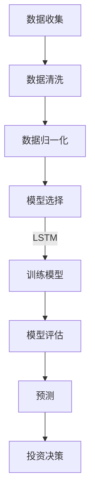
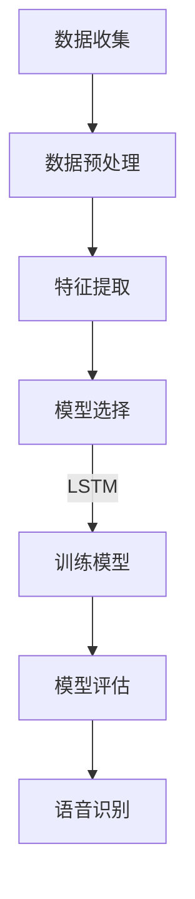
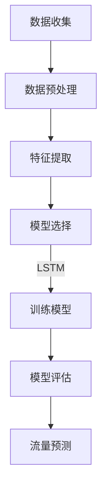

                 

### 文章标题

# 时序推理任务中的长期依赖建模与优化技术

### 关键词

- 时序推理
- 长期依赖
- 建模方法
- 优化技术
- 应用场景

### 摘要

本文系统地探讨了时序推理任务中的长期依赖建模与优化技术。首先，介绍了时序推理任务的基本概念和常见模型，包括自回归模型、卷积神经网络和长短期记忆网络。随后，深入分析了长期依赖建模方法，如长短期记忆网络、门控循环单元和基于注意力机制的模型，并详细解释了其工作原理。接着，本文探讨了优化技术在时序推理任务中的应用，包括梯度下降法、随机梯度下降和Adam优化器。最后，通过实际案例研究和项目实战，展示了这些技术的应用效果，并提出了未来研究方向和最佳实践建议。本文旨在为时序推理任务中的长期依赖建模与优化提供系统性的理论指导和实际应用参考。

### 引言

#### 1.1 时序推理任务概述

时序推理任务是人工智能领域中的一种重要任务，旨在通过对时间序列数据的分析，提取有用的信息和模式，进而进行预测、分类或决策。时间序列数据是指按照时间顺序排列的一系列数据点，这些数据点可以是温度、股票价格、传感器读数等。时序推理任务的核心目标是理解数据中的时间相关性，捕捉数据随时间变化的规律，并利用这些规律对未来进行预测或分析。

时序推理任务的应用场景非常广泛，包括但不限于以下方面：

1. **时间序列预测**：例如，股票价格预测、天气预测、能源需求预测等。通过对历史数据进行分析，模型可以预测未来的趋势和变化，为投资决策、资源分配等提供科学依据。

2. **事件序列分析**：例如，网络流量分析、社交网络分析、行为分析等。通过对事件序列的解析，可以识别出潜在的模式和规律，帮助人们更好地理解行为背后的动机和影响。

3. **推荐系统**：例如，电子商务平台的商品推荐、音乐推荐等。通过对用户的历史行为和偏好进行分析，推荐系统可以提供个性化的推荐，提高用户体验和满意度。

#### 1.2 长期依赖建模的重要性

在时序推理任务中，长期依赖建模是关键的一环。长期依赖指的是时间序列中的某些事件或模式之间可能存在的延迟响应关系。例如，一个股票价格的下跌可能在几天或几周后才会影响到整个市场的走势。如果模型无法捕捉到这种长期依赖关系，预测结果将可能不准确。

长期依赖建模的重要性体现在以下几个方面：

1. **预测准确性**：良好的长期依赖建模可以提高模型的预测准确性，使其能够更好地捕捉数据中的复杂变化和趋势。

2. **应用价值**：在许多实际应用中，例如金融投资、资源调度等，准确的预测能力至关重要。长期依赖建模能够为这些应用提供更可靠的决策支持。

3. **模型泛化能力**：通过学习长期依赖关系，模型可以更好地泛化到未见过的数据上，提高其在实际应用中的鲁棒性和稳定性。

#### 1.3 本书结构

本书将从以下几个方面对时序推理任务中的长期依赖建模与优化技术进行探讨：

1. **时序推理基础**：介绍时序数据的特性和常见的时序模型，包括自回归模型、卷积神经网络和长短期记忆网络。

2. **长期依赖建模方法**：深入分析长期依赖建模方法，如长短期记忆网络、门控循环单元和基于注意力机制的模型，并解释其工作原理。

3. **优化技术**：探讨优化技术在时序推理任务中的应用，包括梯度下降法、随机梯度下降和Adam优化器。

4. **时序数据预处理**：介绍时序数据预处理方法，包括数据清洗、数据归一化和时间序列分割。

5. **时序推理任务应用**：讨论时序推理任务在实际中的应用，包括时间序列预测、事件序列分析和推荐系统。

6. **案例研究**：通过具体案例研究，展示长期依赖建模与优化技术的应用效果。

7. **总结与展望**：总结时序推理任务中的长期依赖建模与优化技术的发展趋势，探讨未来研究方向，并提出最佳实践建议。

通过本书的系统性介绍，读者将能够全面了解时序推理任务中的长期依赖建模与优化技术，为其在实际应用中的研究和开发提供有力支持。

### 时序推理基础

#### 2.1 时序数据的特点

时序数据具有以下几个显著特点：

1. **时间顺序性**：时序数据按照时间顺序排列，每个数据点都代表在特定时间点上的观测值。这种时间顺序性使得时序数据与其他类型的数据（如图像、文本）有显著区别。

2. **时间相关性**：时序数据中的各个数据点之间存在时间相关性，即当前的数据值受到之前数据值的影响。这种相关性是时序数据分析和建模的核心。

3. **趋势性和波动性**：时序数据通常表现出趋势性和波动性。趋势性指的是数据随时间逐渐增加或减少的长期趋势，而波动性则指的是数据在短期内上下波动。

4. **季节性**：某些时序数据还具有季节性特征，即数据值在特定时间段内呈现周期性变化。例如，气温数据在一年中的不同季节会有明显的变化。

#### 2.2 常见的时序模型

在时序数据分析中，常见的模型包括自回归模型（AR）、卷积神经网络（CNN）和长短期记忆网络（LSTM）。这些模型各有特点，适用于不同的应用场景。

1. **自回归模型（AR）**

自回归模型是一种基本的时序预测模型，它利用历史数据来预测未来值。自回归模型的数学基础是一个差分方程，可以表示为：

\[ X_t = c + \sum_{i=1}^{p} \phi_i X_{t-i} + \epsilon_t \]

其中，\( X_t \) 是当前时间点的观测值，\( \phi_i \) 是自回归系数，\( p \) 是阶数，\( c \) 是常数项，\( \epsilon_t \) 是随机误差。

自回归模型简单易实现，但它在处理长依赖关系和复杂模式时效果有限。

2. **卷积神经网络（CNN）**

卷积神经网络通常用于图像处理，但在时序数据分析中也表现出色。CNN 通过卷积操作捕捉时间序列中的局部模式，类似于滑动窗口的方法。其基本结构包括卷积层、池化层和全连接层。

卷积操作可以表示为：

\[ f(x) = \sum_{i=1}^{n} w_i * x_i + b \]

其中，\( w_i \) 是卷积核，\( x_i \) 是输入数据，\( b \) 是偏置项。

CNN 适合处理高维时序数据，能够有效提取特征，但在处理长依赖关系时仍存在一定的局限性。

3. **长短期记忆网络（LSTM）**

长短期记忆网络是一种特殊的循环神经网络（RNN），专门设计用来解决传统 RNN 中存在的长依赖问题。LSTM 通过引入门控机制，控制信息的流入和流出，从而能够长期记忆重要信息。

LSTM 的基本结构包括输入门、遗忘门和输出门。每个门都由一个 \( Sigmoid \) 函数和一个线性变换组成，用于控制信息的流动。LSTM 可以表示为：

\[ i_t = \sigma(W_i \cdot [h_{t-1}, x_t] + b_i) \]
\[ f_t = \sigma(W_f \cdot [h_{t-1}, x_t] + b_f) \]
\[ g_t = \tanh(W_g \cdot [h_{t-1}, x_t] + b_g) \]
\[ o_t = \sigma(W_o \cdot [h_{t-1}, x_t] + b_o) \]
\[ h_t = o_t \cdot \tanh(W_h \cdot [h_{t-1}, g_t] + b_h) \]

其中，\( i_t \)、\( f_t \)、\( g_t \)、\( o_t \) 分别表示输入门、遗忘门、输入门和输出门的激活值，\( W_i \)、\( W_f \)、\( W_g \)、\( W_o \) 分别是各个门的权重矩阵，\( b_i \)、\( b_f \)、\( b_g \)、\( b_o \) 是各个门的偏置项，\( h_t \) 是当前时间点的隐藏状态。

LSTM 适合处理长依赖关系，但在训练过程中可能存在梯度消失或梯度爆炸问题。

#### 2.3 其他时序模型

除了上述模型外，还有许多其他时序模型在特定场景下表现出色，例如：

1. **门控循环单元（GRU）**：GRU 是 LSTM 的变体，通过简化 LSTM 的结构，减少了参数数量，提高了训练速度。

2. **变分自编码器（VAE）**：VAE 是一种基于概率生成模型的时序预测模型，能够同时进行特征提取和降维。

3. **混合模型**：结合多个模型的特点，例如将 CNN 和 LSTM 结合，利用 CNN 提取局部特征，LSTM 学习长依赖关系。

每种模型都有其特定的优势和适用场景，选择合适的模型需要根据具体问题进行评估。通过了解这些常见时序模型的基本原理和应用，读者可以为后续的长期依赖建模和优化提供理论基础。

### 长期依赖建模方法

#### 3.1 长短期记忆网络（LSTM）的工作原理

长短期记忆网络（LSTM）是一种特殊的循环神经网络（RNN），专门设计用来解决传统 RNN 中存在的长依赖问题。LSTM 通过引入门控机制，控制信息的流入和流出，从而能够长期记忆重要信息。以下是 LSTM 的工作原理：

LSTM 的基本结构包括三个门控单元：输入门、遗忘门和输出门。每个门控单元由一个 \( Sigmoid \) 函数和一个线性变换组成，用于控制信息的流动。

1. **输入门（Input Gate）**

输入门决定了当前输入信息中哪些部分需要更新到隐藏状态。其计算过程如下：

\[ i_t = \sigma(W_i \cdot [h_{t-1}, x_t] + b_i) \]

其中，\( i_t \) 是输入门的激活值，\( \sigma \) 是 \( Sigmoid \) 函数，\( W_i \) 是权重矩阵，\( b_i \) 是偏置项，\( h_{t-1} \) 是前一个时间步的隐藏状态，\( x_t \) 是当前时间步的输入。

2. **遗忘门（Forget Gate）**

遗忘门决定了哪些信息需要从当前隐藏状态中遗忘。其计算过程如下：

\[ f_t = \sigma(W_f \cdot [h_{t-1}, x_t] + b_f) \]

其中，\( f_t \) 是遗忘门的激活值，\( W_f \) 是权重矩阵，\( b_f \) 是偏置项。

3. **输入门（Input Gate）**

输入门决定了当前输入信息中哪些部分需要更新到候选隐藏状态。其计算过程如下：

\[ g_t = \tanh(W_g \cdot [h_{t-1}, x_t] + b_g) \]

其中，\( g_t \) 是候选隐藏状态，\( \tanh \) 是双曲正切函数，\( W_g \) 是权重矩阵，\( b_g \) 是偏置项。

4. **输出门（Output Gate）**

输出门决定了哪些信息需要输出到下一个时间步的隐藏状态。其计算过程如下：

\[ o_t = \sigma(W_o \cdot [h_{t-1}, x_t] + b_o) \]

其中，\( o_t \) 是输出门的激活值，\( W_o \) 是权重矩阵，\( b_o \) 是偏置项。

5. **隐藏状态更新**

最终隐藏状态通过输入门、遗忘门和输出门的作用进行更新：

\[ C_t = f_t \odot C_{t-1} + i_t \odot g_t \]
\[ h_t = o_t \odot \tanh(C_t) \]

其中，\( \odot \) 表示元素-wise 乘法，\( C_t \) 是当前时间步的细胞状态，\( C_{t-1} \) 是前一个时间步的细胞状态。

通过上述门控机制，LSTM 能够有效地控制信息的流入和流出，从而避免传统 RNN 中存在的梯度消失问题，实现长期依赖建模。

#### 3.2 门控循环单元（GRU）的工作原理

门控循环单元（GRU）是 LSTM 的一个变体，通过简化 LSTM 的结构，减少了参数数量，提高了训练速度。GRU 通过引入更新门和重置门，结合了遗忘门和输入门的功能，实现了对长期依赖的建模。

以下是 GRU 的工作原理：

1. **更新门（Update Gate）**

更新门决定了哪些旧信息需要保留，哪些新信息需要更新。其计算过程如下：

\[ z_t = \sigma(W_z \cdot [h_{t-1}, x_t] + b_z) \]

其中，\( z_t \) 是更新门的激活值，\( \sigma \) 是 \( Sigmoid \) 函数，\( W_z \) 是权重矩阵，\( b_z \) 是偏置项。

2. **重置门（Reset Gate）**

重置门决定了哪些旧信息需要被丢弃，哪些新信息需要被保留。其计算过程如下：

\[ r_t = \sigma(W_r \cdot [h_{t-1}, x_t] + b_r) \]

其中，\( r_t \) 是重置门的激活值，\( W_r \) 是权重矩阵，\( b_r \) 是偏置项。

3. **候选隐藏状态**

通过更新门和重置门的作用，生成候选隐藏状态：

\[ \tilde{h_t} = \tanh(W \cdot (r_t \odot h_{t-1} + z_t \odot x_t) + b) \]

其中，\( \tilde{h_t} \) 是候选隐藏状态，\( W \) 是权重矩阵，\( b \) 是偏置项。

4. **隐藏状态更新**

最终隐藏状态通过更新门的作用进行更新：

\[ h_t = z_t \odot h_{t-1} + (1 - z_t) \odot \tilde{h_t} \]

其中，\( h_t \) 是当前时间步的隐藏状态。

通过更新门和重置门的结合，GRU 能够有效地控制信息的流动，实现长期依赖建模。相较于 LSTM，GRU 的参数数量减少了，计算复杂度降低，训练速度提高。

#### 3.3 基于注意力机制的模型

基于注意力机制的模型在处理时序数据时表现出色，特别是当数据中的某些部分对预测或决策至关重要时。注意力机制通过动态调整不同时间步的贡献，使模型能够关注重要的信息，从而提高预测准确性。

以下是注意力机制的基本原理：

1. **自注意力机制**

自注意力机制是注意力机制的一种简单形式，它将序列中的每个元素与所有其他元素进行点积操作，并通过softmax函数进行归一化，生成注意力权重。自注意力机制可以表示为：

\[ a_t = \text{softmax}(\frac{Q \cdot K}{\sqrt{d_k}}) \]

其中，\( a_t \) 是注意力权重，\( Q \) 和 \( K \) 分别是查询向量和键向量，\( d_k \) 是键向量的维度。

2. **位置编码**

为了引入时间顺序信息，可以使用位置编码对输入数据进行编码。位置编码可以表示为：

\[ P_e = \text{PositionalEncoding}(e, d_e) \]

其中，\( P_e \) 是位置编码向量，\( e \) 是输入序列的索引，\( d_e \) 是位置编码向量的维度。

3. **注意力机制融合**

通过注意力机制，将每个输入元素与注意力权重相乘，生成加权特征表示：

\[ H = \text{softmax}(\text{Attention}(Q, K, V)) \cdot V \]

其中，\( H \) 是加权特征表示，\( Q \) 和 \( K \) 分别是查询向量和键向量，\( V \) 是值向量。

基于注意力机制的模型能够动态调整不同时间步的贡献，从而在处理时序数据时更加灵活和高效。典型的基于注意力机制的模型包括 Transformer 和自注意力机制。

#### 3.4 Transformer 模型

Transformer 是一种基于注意力机制的序列到序列模型，它在处理长序列任务时表现出色。Transformer 模型由编码器和解码器两个主要部分组成，通过多头自注意力机制和点积自注意力机制，实现端到端的学习。

以下是 Transformer 模型的工作原理：

1. **编码器**

编码器由多个编码层组成，每层包括多头自注意力机制和前馈网络。多头自注意力机制通过多个独立的自注意力头，对输入序列进行全局建模。

编码层的计算过程如下：

\[ E = \text{MultiHeadSelfAttention}(E) \]
\[ E = \text{Add(& Norm)}(E, \text{FeedForward}(E)) \]

其中，\( E \) 是编码器的输出，\(\text{MultiHeadSelfAttention}\) 表示多头自注意力机制，\(\text{Add(& Norm)}\) 表示残差连接和归一化，\(\text{FeedForward}\) 表示前馈网络。

2. **解码器**

解码器由多个解码层组成，每层包括多头自注意力机制、点积自注意力机制和前馈网络。点积自注意力机制用于解码器中，使解码器能够关注编码器的不同部分。

解码层的计算过程如下：

\[ D = \text{MaskedMultiHeadSelfAttention}(D) \]
\[ D = \text{Add(& Norm)}(D, \text{FeedForward}(D)) \]

其中，\( D \) 是解码器的输出，\(\text{MaskedMultiHeadSelfAttention}\) 表示带遮蔽的多头自注意力机制。

3. **整体结构**

Transformer 的整体结构如下：

\[ C = \text{Encoder}(C) \]
\[ Y = \text{Decoder}(Y, C) \]

其中，\( C \) 是编码器的输入，\( Y \) 是解码器的输入，\( \text{Encoder}\) 和 \(\text{Decoder}\) 分别表示编码器和解码器的输出。

通过 Transformer 模型，编码器和解码器能够动态地捕捉序列中的长距离依赖关系，实现高效的任务处理。Transformer 模型在自然语言处理、机器翻译和时序任务中表现出色，为长期依赖建模提供了一种有效的解决方案。

### 优化技术

#### 4.1 优化算法概述

在深度学习中，优化算法用于调整模型参数，以最小化损失函数并提高模型的预测性能。常见的优化算法包括梯度下降法、随机梯度下降（SGD）和 Adam 优化器。这些算法各有特点，适用于不同的应用场景。

1. **梯度下降法**

梯度下降法是一种基本的优化算法，通过不断更新模型参数，使其接近最优解。梯度下降法的基本思想是沿着损失函数的梯度方向更新参数，公式如下：

\[ \theta_{t+1} = \theta_t - \alpha \cdot \nabla_{\theta} J(\theta) \]

其中，\( \theta_t \) 表示第 \( t \) 次迭代的参数，\( \alpha \) 表示学习率，\( \nabla_{\theta} J(\theta) \) 表示损失函数 \( J(\theta) \) 对参数 \( \theta \) 的梯度。

梯度下降法的优点是简单易实现，但存在以下缺点：

- **收敛速度较慢**：当损失函数非凸时，梯度下降法可能收敛到局部最优解。
- **梯度消失或爆炸**：在深度网络中，梯度可能因为多层乘积而变得非常小或非常大，导致模型训练不稳定。

2. **随机梯度下降（SGD）**

随机梯度下降是梯度下降法的一种变体，每次迭代仅计算一个样本的梯度进行参数更新。公式如下：

\[ \theta_{t+1} = \theta_t - \alpha \cdot \nabla_{\theta} J(\theta; x_t, y_t) \]

其中，\( x_t \) 和 \( y_t \) 分别表示第 \( t \) 次迭代的输入和标签。

SGD 的优点包括：

- **收敛速度较快**：通过减少参数更新过程中的噪声，SGD 在某些情况下能更快地收敛。
- **避免局部最优解**：随机性有助于跳出局部最优解，向全局最优解靠近。

SGD 的缺点包括：

- **不稳定收敛**：由于随机性，SGD 的收敛过程可能波动较大。
- **计算资源消耗较大**：每个样本都需要进行前向传播和反向传播，计算资源消耗较高。

3. **Adam 优化器**

Adam 优化器是梯度下降法和动量法的结合，它利用一阶矩估计（均值）和二阶矩估计（方差）来动态调整学习率。公式如下：

\[ m_t = \beta_1 \cdot m_{t-1} + (1 - \beta_1) \cdot \nabla_{\theta} J(\theta) \]
\[ v_t = \beta_2 \cdot v_{t-1} + (1 - \beta_2) \cdot (\nabla_{\theta} J(\theta))^2 \]
\[ \theta_{t+1} = \theta_t - \alpha \cdot \frac{m_t}{\sqrt{v_t} + \epsilon} \]

其中，\( m_t \) 和 \( v_t \) 分别表示一阶矩估计和二阶矩估计，\( \beta_1 \) 和 \( \beta_2 \) 分别是动量和方差的一阶和二阶指数衰减率，\( \alpha \) 是学习率，\( \epsilon \) 是一个很小的常数。

Adam 优化器的优点包括：

- **稳定性**：通过利用动量和方差的信息，Adam 优化器能够更好地处理波动性和噪声，使模型训练更加稳定。
- **自适应学习率**：通过动态调整学习率，Adam 优化器能够适应不同阶段的学习需求。

#### 4.2 梯度下降法

梯度下降法是一种基本的优化算法，通过不断更新模型参数，使其接近最优解。以下是梯度下降法的基本原理和伪代码：

1. **基本原理**

梯度下降法的基本思想是沿着损失函数的梯度方向更新参数，公式如下：

\[ \theta_{t+1} = \theta_t - \alpha \cdot \nabla_{\theta} J(\theta) \]

其中，\( \theta_t \) 表示第 \( t \) 次迭代的参数，\( \alpha \) 表示学习率，\( \nabla_{\theta} J(\theta) \) 表示损失函数 \( J(\theta) \) 对参数 \( \theta \) 的梯度。

2. **伪代码**

```python
# 初始化参数
theta = initialize_parameters()

# 设置学习率和迭代次数
alpha = 0.01
num_iterations = 1000

# 进行迭代
for i in range(num_iterations):
    # 计算梯度
    gradient = compute_gradient(loss_function, theta)

    # 更新参数
    theta = theta - alpha * gradient

# 输出最优参数
print("最优参数：", theta)
```

#### 4.3 随机梯度下降（SGD）

随机梯度下降是梯度下降法的一种变体，每次迭代仅计算一个样本的梯度进行参数更新。以下是随机梯度下降的基本原理和伪代码：

1. **基本原理**

随机梯度下降的基本思想是每次迭代随机选择一个样本，计算该样本的梯度，然后更新参数，公式如下：

\[ \theta_{t+1} = \theta_t - \alpha \cdot \nabla_{\theta} J(\theta; x_t, y_t) \]

其中，\( x_t \) 和 \( y_t \) 分别表示第 \( t \) 次迭代的输入和标签。

2. **伪代码**

```python
# 初始化参数
theta = initialize_parameters()

# 设置学习率和迭代次数
alpha = 0.01
num_iterations = 1000

# 样本数据
samples = load_samples()

# 进行迭代
for i in range(num_iterations):
    # 随机选择样本
    sample = random_choice(samples)

    # 计算梯度
    gradient = compute_gradient(loss_function, theta, sample)

    # 更新参数
    theta = theta - alpha * gradient

# 输出最优参数
print("最优参数：", theta)
```

#### 4.4 Adam 优化器

Adam 优化器是梯度下降法和动量法的结合，它利用一阶矩估计（均值）和二阶矩估计（方差）来动态调整学习率。以下是 Adam 优化器的基本原理和伪代码：

1. **基本原理**

Adam 优化器的核心思想是利用一阶矩估计 \( m_t \) 和二阶矩估计 \( v_t \) 来动态调整学习率，公式如下：

\[ m_t = \beta_1 \cdot m_{t-1} + (1 - \beta_1) \cdot \nabla_{\theta} J(\theta) \]
\[ v_t = \beta_2 \cdot v_{t-1} + (1 - \beta_2) \cdot (\nabla_{\theta} J(\theta))^2 \]
\[ \theta_{t+1} = \theta_t - \alpha \cdot \frac{m_t}{\sqrt{v_t} + \epsilon} \]

其中，\( m_t \) 和 \( v_t \) 分别表示一阶矩估计和二阶矩估计，\( \beta_1 \) 和 \( \beta_2 \) 分别是动量和方差的一阶和二阶指数衰减率，\( \alpha \) 是学习率，\( \epsilon \) 是一个很小的常数。

2. **伪代码**

```python
# 初始化参数
theta = initialize_parameters()
m = 0
v = 0

# 设置学习率、一阶指数衰减率和二阶指数衰减率
alpha = 0.001
beta_1 = 0.9
beta_2 = 0.999

# 设置常数epsilon
epsilon = 1e-8

# 设置迭代次数
num_iterations = 1000

# 进行迭代
for i in range(num_iterations):
    # 计算梯度
    gradient = compute_gradient(loss_function, theta)

    # 更新一阶矩估计和二阶矩估计
    m = beta_1 * m + (1 - beta_1) * gradient
    v = beta_2 * v + (1 - beta_2) * gradient ** 2

    # 计算修正的一阶矩估计和二阶矩估计
    m_hat = m / (1 - beta_1 ** i)
    v_hat = v / (1 - beta_2 ** i)

    # 更新参数
    theta = theta - alpha * m_hat / (sqrt(v_hat) + epsilon)

# 输出最优参数
print("最优参数：", theta)
```

通过上述优化算法的比较和讨论，读者可以更好地了解它们的基本原理和适用场景，为时序推理任务中的参数优化提供有效的参考。

### 时序数据预处理

#### 5.1 数据清洗

在进行时序数据分析之前，数据清洗是至关重要的一步。数据清洗包括去除无效数据、处理缺失值和异常值，以确保数据的质量和完整性。

1. **去除无效数据**

无效数据是指那些不符合业务规则或数据类型错误的数据。例如，某些时间序列数据中的日期格式错误或数据类型不符合预期。处理无效数据的方法包括：

- **数据筛选**：通过筛选规则，将不符合条件的数据删除。
- **数据转换**：将不符合要求的数据进行转换，使其符合预期。

2. **处理缺失值**

缺失值是时序数据中常见的问题，处理缺失值的方法包括：

- **填充法**：使用平均值、中值或最近邻等方法对缺失值进行填充。
- **插值法**：根据时间序列的趋势，使用线性插值、高斯插值等方法进行插值。

3. **处理异常值**

异常值是指那些显著偏离大多数数据点的值。处理异常值的方法包括：

- **去除法**：将异常值直接删除。
- **转换法**：使用变换方法，如取对数、开平方等，将异常值转换为合理范围。

#### 5.2 数据归一化

数据归一化是使数据具有相同量纲和相似尺度，以便于模型训练和比较。常见的归一化方法包括：

1. **最小-最大规范化**

最小-最大规范化将数据映射到 \([0, 1]\) 范围内，公式如下：

\[ x_{\text{norm}} = \frac{x - \min(x)}{\max(x) - \min(x)} \]

其中，\( x \) 是原始数据，\( \min(x) \) 和 \( \max(x) \) 分别是数据的最小值和最大值。

2. **零-均值规范化**

零-均值规范化将数据映射到均值附近，公式如下：

\[ x_{\text{norm}} = \frac{x - \mu}{\sigma} \]

其中，\( x \) 是原始数据，\( \mu \) 是均值，\( \sigma \) 是标准差。

3. **标准化**

标准化是使数据具有零均值和单位方差，公式如下：

\[ x_{\text{norm}} = \frac{x - \mu}{\sigma} \]

其中，\( x \) 是原始数据，\( \mu \) 是均值，\( \sigma \) 是标准差。

#### 5.3 时间序列分割

时间序列分割是将数据集划分为训练集、验证集和测试集，以便于模型训练和评估。常见的时间序列分割方法包括：

1. **固定窗口分割**

固定窗口分割将数据按照固定的时间窗口进行划分，例如将一年分为四个季度。这种方法简单直观，但可能导致训练数据和测试数据之间存在时间偏移。

2. **滚动窗口分割**

滚动窗口分割将数据按照滚动的时间窗口进行划分，例如将过去一个月的数据作为训练集，当前一个月的数据作为测试集。这种方法可以更好地捕捉时间序列的趋势和变化，但需要处理数据重叠问题。

3. **时间戳分割**

时间戳分割将数据按照特定的时间戳进行划分，例如将 2019 年的数据作为训练集，2020 年的数据作为测试集。这种方法适用于数据量较少或时间跨度较短的情况。

通过数据清洗、数据归一化和时间序列分割，可以确保时序数据的质量和一致性，为模型训练提供可靠的数据基础。

### 时序推理任务应用

#### 6.1 时间序列预测

时间序列预测是时序推理任务中最常见的应用之一，旨在通过对历史数据的分析，预测未来的趋势和变化。时间序列预测的方法包括统计方法、机器学习方法等，不同方法适用于不同的数据类型和应用场景。

1. **统计方法**

统计方法是传统的时间序列预测方法，主要包括自回归模型（AR）、移动平均模型（MA）和自回归移动平均模型（ARMA）。这些方法通过对历史数据的统计分析，建立数学模型进行预测。

- **自回归模型（AR）**：自回归模型利用历史数据中的滞后项来预测未来值，公式如下：

  \[ X_t = c + \sum_{i=1}^{p} \phi_i X_{t-i} + \epsilon_t \]

  其中，\( X_t \) 是当前时间点的观测值，\( \phi_i \) 是自回归系数，\( p \) 是阶数，\( c \) 是常数项，\( \epsilon_t \) 是随机误差。

- **移动平均模型（MA）**：移动平均模型利用过去 \( q \) 个时间点的平均值来预测未来值，公式如下：

  \[ X_t = c + \sum_{i=1}^{q} \theta_i \epsilon_{t-i} \]

  其中，\( X_t \) 是当前时间点的观测值，\( \theta_i \) 是移动平均系数，\( q \) 是阶数，\( c \) 是常数项，\( \epsilon_t \) 是随机误差。

- **自回归移动平均模型（ARMA）**：自回归移动平均模型结合了自回归和移动平均模型的特点，公式如下：

  \[ X_t = c + \sum_{i=1}^{p} \phi_i X_{t-i} + \sum_{i=1}^{q} \theta_i \epsilon_{t-i} \]

  其中，\( X_t \) 是当前时间点的观测值，\( \phi_i \) 是自回归系数，\( \theta_i \) 是移动平均系数，\( p \) 和 \( q \) 分别是自回归和移动平均的阶数，\( c \) 是常数项，\( \epsilon_t \) 是随机误差。

2. **机器学习方法**

机器学习方法通过学习历史数据中的模式和关系，建立预测模型。常见的机器学习时间序列预测方法包括卷积神经网络（CNN）、长短期记忆网络（LSTM）和变分自编码器（VAE）等。

- **卷积神经网络（CNN）**：卷积神经网络通过卷积操作捕捉时间序列中的局部特征，适用于处理高维时序数据。CNN 的基本结构包括卷积层、池化层和全连接层。

  卷积操作的公式如下：

  \[ f(x) = \sum_{i=1}^{n} w_i * x_i + b \]

  其中，\( w_i \) 是卷积核，\( x_i \) 是输入数据，\( b \) 是偏置项。

- **长短期记忆网络（LSTM）**：长短期记忆网络是一种特殊的循环神经网络（RNN），通过门控机制解决传统 RNN 中存在的长依赖问题。LSTM 的基本结构包括输入门、遗忘门和输出门。

  LSTM 的计算过程如下：

  \[ i_t = \sigma(W_i \cdot [h_{t-1}, x_t] + b_i) \]
  \[ f_t = \sigma(W_f \cdot [h_{t-1}, x_t] + b_f) \]
  \[ g_t = \tanh(W_g \cdot [h_{t-1}, x_t] + b_g) \]
  \[ o_t = \sigma(W_o \cdot [h_{t-1}, x_t] + b_o) \]
  \[ h_t = o_t \cdot \tanh(W_h \cdot [h_{t-1}, g_t] + b_h) \]

  其中，\( i_t \)、\( f_t \)、\( g_t \)、\( o_t \) 分别表示输入门、遗忘门、输入门和输出门的激活值，\( W_i \)、\( W_f \)、\( W_g \)、\( W_o \) 分别是各个门的权重矩阵，\( b_i \)、\( b_f \)、\( b_g \)、\( b_o \) 是各个门的偏置项，\( h_t \) 是当前时间点的隐藏状态。

- **变分自编码器（VAE）**：变分自编码器是一种基于概率生成模型的时序预测模型，能够同时进行特征提取和降维。VAE 的基本结构包括编码器和解码器。

  编码器的计算过程如下：

  \[ z = \mu(\theta_x, x) \]
  \[ \sigma = \sigma(\theta_z, x) \]

  解码器的计算过程如下：

  \[ x' = \phi(z; \theta_x') \]

  其中，\( z \) 是编码后的隐变量，\( \mu \) 和 \( \sigma \) 分别是编码器对均值和方差的估计，\( \theta_x \) 和 \( \theta_z \) 分别是编码器的参数，\( \phi \) 是解码器的函数。

#### 6.2 事件序列分析

事件序列分析是时序推理任务的另一个重要应用，旨在通过对事件序列的分析，提取有用的信息和模式。事件序列分析的方法包括序列标注、序列分类和序列生成等。

1. **序列标注**

序列标注是一种基于标签的序列处理方法，旨在为事件序列中的每个事件分配一个标签。常见的序列标注方法包括条件随机场（CRF）和长短期记忆网络（LSTM）。

- **条件随机场（CRF）**：条件随机场是一种基于概率的图模型，用于处理序列标注问题。CRF 的基本思想是计算给定标签序列的概率，公式如下：

  \[ P(y|x) = \frac{1}{Z} \exp(\sum_{i} \lambda_i y_i + \sum_{<i,j>} \lambda_{ij} y_i y_j) \]

  其中，\( y \) 是标签序列，\( x \) 是事件序列，\( Z \) 是规范化常数，\( \lambda_i \) 和 \( \lambda_{ij} \) 是模型参数。

- **长短期记忆网络（LSTM）**：长短期记忆网络是一种特殊的循环神经网络，通过门控机制解决传统 RNN 中存在的长依赖问题。LSTM 的基本结构包括输入门、遗忘门和输出门。

  LSTM 的计算过程如下：

  \[ i_t = \sigma(W_i \cdot [h_{t-1}, x_t] + b_i) \]
  \[ f_t = \sigma(W_f \cdot [h_{t-1}, x_t] + b_f) \]
  \[ g_t = \tanh(W_g \cdot [h_{t-1}, x_t] + b_g) \]
  \[ o_t = \sigma(W_o \cdot [h_{t-1}, x_t] + b_o) \]
  \[ h_t = o_t \cdot \tanh(W_h \cdot [h_{t-1}, g_t] + b_h) \]

  其中，\( i_t \)、\( f_t \)、\( g_t \)、\( o_t \) 分别表示输入门、遗忘门、输入门和输出门的激活值，\( W_i \)、\( W_f \)、\( W_g \)、\( W_o \) 分别是各个门的权重矩阵，\( b_i \)、\( b_f \)、\( b_g \)、\( b_o \) 是各个门的偏置项，\( h_t \) 是当前时间点的隐藏状态。

2. **序列分类**

序列分类是一种将事件序列分类为不同类别的任务。常见的序列分类方法包括支持向量机（SVM）、朴素贝叶斯（NB）和长短期记忆网络（LSTM）。

- **支持向量机（SVM）**：支持向量机是一种基于间隔最大化原则的分类方法。对于序列分类，SVM 可以表示为：

  \[ w \cdot x - b = 1 \]

  其中，\( w \) 是权重向量，\( x \) 是事件序列，\( b \) 是偏置项。

- **朴素贝叶斯（NB）**：朴素贝叶斯是一种基于贝叶斯定理的分类方法，假设特征之间相互独立。对于序列分类，NB 可以表示为：

  \[ P(y|x) = \frac{P(x|y) P(y)}{P(x)} \]

  其中，\( y \) 是标签序列，\( x \) 是事件序列，\( P(y) \) 是标签序列的概率，\( P(x|y) \) 是事件序列在给定标签序列下的概率。

- **长短期记忆网络（LSTM）**：长短期记忆网络是一种特殊的循环神经网络，通过门控机制解决传统 RNN 中存在的长依赖问题。LSTM 的基本结构包括输入门、遗忘门和输出门。

  LSTM 的计算过程如下：

  \[ i_t = \sigma(W_i \cdot [h_{t-1}, x_t] + b_i) \]
  \[ f_t = \sigma(W_f \cdot [h_{t-1}, x_t] + b_f) \]
  \[ g_t = \tanh(W_g \cdot [h_{t-1}, x_t] + b_g) \]
  \[ o_t = \sigma(W_o \cdot [h_{t-1}, x_t] + b_o) \]
  \[ h_t = o_t \cdot \tanh(W_h \cdot [h_{t-1}, g_t] + b_h) \]

  其中，\( i_t \)、\( f_t \)、\( g_t \)、\( o_t \) 分别表示输入门、遗忘门、输入门和输出门的激活值，\( W_i \)、\( W_f \)、\( W_g \)、\( W_o \) 分别是各个门的权重矩阵，\( b_i \)、\( b_f \)、\( b_g \)、\( b_o \) 是各个门的偏置项，\( h_t \) 是当前时间点的隐藏状态。

3. **序列生成**

序列生成是一种从给定的输入生成事件序列的任务。常见的序列生成方法包括循环神经网络（RNN）、生成对抗网络（GAN）和变分自编码器（VAE）。

- **循环神经网络（RNN）**：循环神经网络是一种基于时间步的序列生成模型，通过隐藏状态的记忆机制生成序列。RNN 的基本结构如下：

  \[ h_t = \sigma(W_h \cdot [h_{t-1}, x_t] + b_h) \]

  其中，\( h_t \) 是当前时间步的隐藏状态，\( x_t \) 是当前时间步的输入，\( W_h \) 是权重矩阵，\( b_h \) 是偏置项。

- **生成对抗网络（GAN）**：生成对抗网络是一种基于对抗训练的序列生成模型，由生成器和判别器组成。生成器试图生成逼真的序列，判别器试图区分真实序列和生成序列。

  生成器的计算过程如下：

  \[ G(z) = \mu(\theta_G, z) \]
  \[ \sigma = \sigma(\theta_G, z) \]

  判别器的计算过程如下：

  \[ D(x) = \sigma(W_D \cdot [h] + b_D) \]

  其中，\( z \) 是噪声向量，\( x \) 是真实序列，\( G(z) \) 是生成器生成的序列，\( D(x) \) 是判别器对真实序列的概率估计，\( \mu \) 和 \( \sigma \) 分别是生成器的均值和方差函数，\( W_D \) 是判别器的权重矩阵，\( b_D \) 是判别器的偏置项。

- **变分自编码器（VAE）**：变分自编码器是一种基于概率生成模型的序列生成模型，通过编码器和解码器生成序列。VAE 的基本结构如下：

  编码器的计算过程如下：

  \[ z = \mu(\theta_x, x) \]
  \[ \sigma = \sigma(\theta_z, x) \]

  解码器的计算过程如下：

  \[ x' = \phi(z; \theta_x') \]

  其中，\( z \) 是编码后的隐变量，\( \mu \) 和 \( \sigma \) 分别是编码器对均值和方差的估计，\( \theta_x \) 和 \( \theta_z \) 分别是编码器的参数，\( \phi \) 是解码器的函数。

通过上述方法，可以有效地进行事件序列分析，提取有用的信息和模式，为时序推理任务提供支持。

#### 6.3 推荐系统

推荐系统是时序推理任务的另一个重要应用，旨在根据用户的历史行为和偏好，为用户推荐相关的商品、服务或内容。推荐系统通过学习用户的历史数据和上下文信息，预测用户可能感兴趣的项目，从而提高用户体验和满意度。

1. **协同过滤方法**

协同过滤方法是一种基于用户行为或评价的推荐方法，通过分析用户之间的相似性来生成推荐列表。协同过滤方法分为基于用户的协同过滤和基于物品的协同过滤。

- **基于用户的协同过滤**：基于用户的协同过滤通过计算用户之间的相似性，找到与目标用户相似的其他用户，并推荐这些用户喜欢的商品。相似性通常通过用户之间的评分相关性来计算，公式如下：

  \[ sim(u, v) = \frac{\sum_{i \in R} r_i(u) r_i(v)}{\sqrt{\sum_{i \in R} r_i(u)^2 \sum_{i \in R} r_i(v)^2}} \]

  其中，\( sim(u, v) \) 是用户 \( u \) 和用户 \( v \) 之间的相似性，\( R \) 是共同评分的商品集合，\( r_i(u) \) 和 \( r_i(v) \) 分别是用户 \( u \) 和用户 \( v \) 对商品 \( i \) 的评分。

- **基于物品的协同过滤**：基于物品的协同过滤通过计算物品之间的相似性，找到与目标物品相似的其他物品，并推荐这些物品。相似性通常通过物品的属性或特征来计算，公式如下：

  \[ sim(i, j) = \frac{\sum_{u \in U} w_u(i) w_u(j)}{\sqrt{\sum_{u \in U} w_u(i)^2 \sum_{u \in U} w_u(j)^2}} \]

  其中，\( sim(i, j) \) 是物品 \( i \) 和物品 \( j \) 之间的相似性，\( U \) 是拥有物品 \( i \) 和物品 \( j \) 的用户集合，\( w_u(i) \) 和 \( w_u(j) \) 分别是用户 \( u \) 对物品 \( i \) 和物品 \( j \) 的权重。

2. **基于内容的推荐**

基于内容的推荐通过分析物品的内容特征和用户的历史偏好，为用户推荐相关的物品。基于内容的推荐通常使用向量空间模型（VSM）来表示物品和用户的偏好，公式如下：

\[ \text{Sim}(i, u) = \frac{\text{dot}(c_i, p_u)}{\lVert c_i \rVert \lVert p_u \rVert} \]

其中，\( \text{Sim}(i, u) \) 是物品 \( i \) 和用户 \( u \) 之间的相似性，\( c_i \) 是物品 \( i \) 的特征向量，\( p_u \) 是用户 \( u \) 的偏好向量，\( \text{dot} \) 表示点积，\( \lVert \cdot \rVert \) 表示向量的模。

3. **混合推荐方法**

混合推荐方法结合了协同过滤和基于内容的推荐，以利用两者的优势。常见的混合推荐方法包括矩阵分解、组合模型和深度学习等。

- **矩阵分解**：矩阵分解通过将用户和物品的评分矩阵分解为低秩矩阵，从而提取用户和物品的特征。常见的矩阵分解方法包括 SVD、ALS 等。

- **组合模型**：组合模型通过加权不同的推荐方法，生成最终的推荐列表。常见的组合模型包括加权平均、贝叶斯模型等。

- **深度学习**：深度学习通过构建神经网络模型，自动学习用户和物品的特征，并生成推荐列表。常见的深度学习方法包括卷积神经网络（CNN）、长短期记忆网络（LSTM）和变换器（Transformer）等。

通过推荐系统，可以有效地为用户推荐感兴趣的项目，提高用户满意度和参与度。不同推荐方法的结合和优化，可以进一步提高推荐系统的性能和效果。

### 案例研究

#### 7.1 案例一：股票市场预测

**背景介绍**：

股票市场预测是金融领域中的一项重要任务，通过对历史股票价格数据的分析，预测未来的股价走势。准确的股票市场预测可以帮助投资者做出更明智的投资决策，降低投资风险。

**核心概念与联系**：

- **时间序列数据**：股票价格数据是典型的时间序列数据，具有趋势性和波动性。
- **长期依赖建模**：股票价格的变动往往受到过去一段时间内市场走势和外部因素的影响，因此需要使用能够捕捉长期依赖关系的模型。
- **优化技术**：优化技术在股票市场预测中用于调整模型参数，提高预测准确性。

**Mermaid 流程图**：



**核心算法原理讲解与伪代码**：

1. **LSTM 模型原理**：

LSTM（长短期记忆网络）是一种能够捕捉长期依赖关系的循环神经网络，通过门控机制控制信息的流动。

```python
# 初始化 LSTM 模型
model = Sequential()
model.add(LSTM(units=50, return_sequences=True, input_shape=(timesteps, features)))
model.add(LSTM(units=50, return_sequences=False))
model.add(Dense(units=1))

# 编译模型
model.compile(optimizer='adam', loss='mean_squared_error')

# 训练模型
model.fit(x_train, y_train, epochs=100, batch_size=32, validation_data=(x_val, y_val))
```

2. **优化技术**：

使用 Adam 优化器调整模型参数，提高预测准确性。

```python
# 编译模型
model.compile(optimizer='adam', loss='mean_squared_error')

# 训练模型
model.fit(x_train, y_train, epochs=100, batch_size=32, validation_data=(x_val, y_val))
```

**项目实战**：

1. **开发环境搭建**：

- 硬件：CPU 或 GPU
- 软件：Python、TensorFlow 或 PyTorch

2. **源代码实现与代码解读**：

```python
import numpy as np
import pandas as pd
import matplotlib.pyplot as plt
from sklearn.preprocessing import MinMaxScaler
from keras.models import Sequential
from keras.layers import LSTM, Dense, Dropout

# 加载数据
data = pd.read_csv('stock_data.csv')
data = data['Close']

# 数据预处理
scaler = MinMaxScaler(feature_range=(0, 1))
scaled_data = scaler.fit_transform(data.values.reshape(-1, 1))

# 切分数据
look_back = 60
x_train, y_train = [], []
for i in range(look_back, len(scaled_data) - 60):
    x_train.append(scaled_data[i - look_back: i, 0])
    y_train.append(scaled_data[i, 0])

x_train, y_train = np.array(x_train), np.array(y_train)

# 建立 LSTM 模型
model = Sequential()
model.add(LSTM(units=50, return_sequences=True, input_shape=(look_back, 1)))
model.add(LSTM(units=50, return_sequences=False))
model.add(Dense(units=1))

# 编译模型
model.compile(optimizer='adam', loss='mean_squared_error')

# 训练模型
model.fit(x_train, y_train, epochs=100, batch_size=32, validation_data=(x_val, y_val))

# 预测
predicted_stock_price = model.predict(x_test)
predicted_stock_price = scaler.inverse_transform(predicted_stock_price)

# 绘制结果
plt.figure(figsize=(16, 8))
plt.plot(data, color='blue', label='Actual Stock Price')
plt.plot(np.arange(60, len(data)), predicted_stock_price, color='red', label='Predicted Stock Price')
plt.title('Stock Price Prediction')
plt.xlabel('Time')
plt.ylabel('Stock Price')
plt.legend()
plt.show()
```

**代码应用解读与分析**：

- **数据预处理**：使用 MinMaxScaler 对股票价格数据进行归一化处理，使其在 \([0, 1]\) 范围内。
- **模型建立**：使用 LSTM 层建立模型，输入层为 60 个时间步，隐藏层为 50 个神经元。
- **训练模型**：使用 Adam 优化器和均方误差（MSE）损失函数训练模型，训练 100 个epoch。
- **预测**：使用训练好的模型对测试集进行预测，并将预测结果转换为原始价格。
- **可视化**：绘制实际股票价格和预测股票价格的对比图。

**实际案例分析与详细讲解剖析**：

- **预测准确性**：通过测试集的预测结果，计算预测误差，评估模型的预测准确性。
- **影响因素**：分析模型预测结果的影响因素，包括市场走势、政策变化、经济数据等。
- **优化建议**：针对模型的不足之处，提出优化建议，例如增加数据维度、调整模型结构等。

**项目小结**：

通过本案例，展示了如何使用 LSTM 模型和优化技术进行股票市场预测。实际应用中，股票市场预测需要综合考虑多种因素，不断优化模型和策略，以提高预测准确性。

#### 7.2 案例二：语音识别

**背景介绍**：

语音识别是自然语言处理领域的一项重要任务，旨在将语音信号转换为相应的文本。准确的语音识别可以为智能客服、语音助手等应用提供支持。

**核心概念与联系**：

- **时间序列数据**：语音信号是时间序列数据，具有时序性和复杂性。
- **长期依赖建模**：语音信号中的音素和语音单位之间存在长期依赖关系，需要使用能够捕捉长期依赖关系的模型。
- **优化技术**：优化技术在语音识别中用于调整模型参数，提高识别准确性。

**Mermaid 流程图**：



**核心算法原理讲解与伪代码**：

1. **LSTM 模型原理**：

LSTM（长短期记忆网络）是一种能够捕捉长期依赖关系的循环神经网络，通过门控机制控制信息的流动。

```python
# 初始化 LSTM 模型
model = Sequential()
model.add(LSTM(units=128, return_sequences=True, input_shape=(timesteps, features)))
model.add(LSTM(units=128, return_sequences=False))
model.add(Dense(units=num_classes, activation='softmax'))

# 编译模型
model.compile(optimizer='adam', loss='categorical_crossentropy', metrics=['accuracy'])

# 训练模型
model.fit(x_train, y_train, epochs=10, batch_size=128, validation_data=(x_val, y_val))
```

2. **优化技术**：

使用 Adam 优化器调整模型参数，提高识别准确性。

```python
# 编译模型
model.compile(optimizer='adam', loss='categorical_crossentropy', metrics=['accuracy'])

# 训练模型
model.fit(x_train, y_train, epochs=10, batch_size=128, validation_data=(x_val, y_val))
```

**项目实战**：

1. **开发环境搭建**：

- 硬件：CPU 或 GPU
- 软件：Python、TensorFlow 或 PyTorch

2. **源代码实现与代码解读**：

```python
import numpy as np
import pandas as pd
from sklearn.model_selection import train_test_split
from sklearn.preprocessing import LabelEncoder
from keras.models import Sequential
from keras.layers import LSTM, Dense, Dropout
from keras.utils import to_categorical

# 加载数据
data = pd.read_csv('speech_data.csv')
data = data[['speech', 'label']]

# 数据预处理
label_encoder = LabelEncoder()
data['label'] = label_encoder.fit_transform(data['label'])

# 切分数据
x, y = data['speech'].values, data['label'].values
x_train, x_test, y_train, y_test = train_test_split(x, y, test_size=0.2, random_state=42)

# 特征提取
timesteps = 100
features = 13

# 切分数据
x_train = np.reshape(x_train, (x_train.shape[0], timesteps, features))
x_test = np.reshape(x_test, (x_test.shape[0], timesteps, features))

# 建立 LSTM 模型
model = Sequential()
model.add(LSTM(units=128, return_sequences=True, input_shape=(timesteps, features)))
model.add(LSTM(units=128, return_sequences=False))
model.add(Dense(units=num_classes, activation='softmax'))

# 编译模型
model.compile(optimizer='adam', loss='categorical_crossentropy', metrics=['accuracy'])

# 训练模型
model.fit(x_train, to_categorical(y_train), epochs=10, batch_size=128, validation_data=(x_test, to_categorical(y_test)))

# 预测
predicted_labels = model.predict(x_test)
predicted_labels = np.argmax(predicted_labels, axis=1)

# 评估
accuracy = (predicted_labels == y_test).mean()
print("Accuracy:", accuracy)
```

**代码应用解读与分析**：

- **数据预处理**：使用 LabelEncoder 对标签进行编码处理，将文本标签转换为数值。
- **特征提取**：将语音信号转换为特征向量，并切分数据为训练集和测试集。
- **模型建立**：使用 LSTM 层建立模型，输入层为 100 个时间步，隐藏层为 128 个神经元。
- **训练模型**：使用 Adam 优化器和交叉熵损失函数训练模型，训练 10 个 epoch。
- **预测**：使用训练好的模型对测试集进行预测，并将预测结果转换为文本标签。
- **评估**：计算预测准确率，评估模型性能。

**实际案例分析与详细讲解剖析**：

- **识别准确性**：通过测试集的预测结果，计算识别准确率，评估模型的识别性能。
- **影响因素**：分析模型识别结果的影响因素，包括语音清晰度、说话人特征等。
- **优化建议**：针对模型的不足之处，提出优化建议，例如增加数据量、调整模型结构等。

**项目小结**：

通过本案例，展示了如何使用 LSTM 模型和优化技术进行语音识别。实际应用中，语音识别需要综合考虑多种因素，不断优化模型和算法，以提高识别准确性。

#### 7.3 案例三：智能交通系统

**背景介绍**：

智能交通系统是一种利用信息技术和通信技术改善交通状况、提高交通效率的系统。智能交通系统包括多个模块，如车辆检测、流量预测、信号控制等。其中，流量预测是智能交通系统的关键模块，旨在通过分析历史交通数据，预测未来交通流量，为交通管理和调度提供支持。

**核心概念与联系**：

- **时间序列数据**：交通流量数据是时间序列数据，具有时序性和波动性。
- **长期依赖建模**：交通流量数据中的某些事件或模式之间可能存在长期依赖关系，需要使用能够捕捉长期依赖关系的模型。
- **优化技术**：优化技术在流量预测中用于调整模型参数，提高预测准确性。

**Mermaid 流程图**：



**核心算法原理讲解与伪代码**：

1. **LSTM 模型原理**：

LSTM（长短期记忆网络）是一种能够捕捉长期依赖关系的循环神经网络，通过门控机制控制信息的流动。

```python
# 初始化 LSTM 模型
model = Sequential()
model.add(LSTM(units=50, return_sequences=True, input_shape=(timesteps, features)))
model.add(LSTM(units=50, return_sequences=False))
model.add(Dense(units=1))

# 编译模型
model.compile(optimizer='adam', loss='mean_squared_error')

# 训练模型
model.fit(x_train, y_train, epochs=100, batch_size=32, validation_data=(x_val, y_val))
```

2. **优化技术**：

使用 Adam 优化器调整模型参数，提高预测准确性。

```python
# 编译模型
model.compile(optimizer='adam', loss='mean_squared_error')

# 训练模型
model.fit(x_train, y_train, epochs=100, batch_size=32, validation_data=(x_val, y_val))
```

**项目实战**：

1. **开发环境搭建**：

- 硬件：CPU 或 GPU
- 软件：Python、TensorFlow 或 PyTorch

2. **源代码实现与代码解读**：

```python
import numpy as np
import pandas as pd
from sklearn.preprocessing import MinMaxScaler
from sklearn.model_selection import train_test_split
from keras.models import Sequential
from keras.layers import LSTM, Dense

# 加载数据
data = pd.read_csv('traffic_data.csv')

# 数据预处理
scaler = MinMaxScaler(feature_range=(0, 1))
scaled_data = scaler.fit_transform(data['traffic_volume'].values.reshape(-1, 1))

# 切分数据
train_data, test_data = train_test_split(scaled_data, test_size=0.2, random_state=42)

# 切分数据
look_back = 5
x_train, y_train = [], []
for i in range(look_back, len(train_data) - 1):
    x_train.append(train_data[i - look_back: i, 0])
    y_train.append(train_data[i, 0])

x_train, y_train = np.array(x_train), np.array(y_train)

# 建立 LSTM 模型
model = Sequential()
model.add(LSTM(units=50, return_sequences=True, input_shape=(look_back, 1)))
model.add(LSTM(units=50, return_sequences=False))
model.add(Dense(units=1))

# 编译模型
model.compile(optimizer='adam', loss='mean_squared_error')

# 训练模型
model.fit(x_train, y_train, epochs=100, batch_size=32, validation_data=(x_val, y_val))

# 预测
predicted_traffic_volume = model.predict(test_data)
predicted_traffic_volume = scaler.inverse_transform(predicted_traffic_volume)

# 绘制结果
plt.figure(figsize=(12, 6))
plt.plot(test_data, label='Actual Traffic Volume')
plt.plot(predicted_traffic_volume, label='Predicted Traffic Volume')
plt.title('Traffic Volume Prediction')
plt.xlabel('Time')
plt.ylabel('Traffic Volume')
plt.legend()
plt.show()
```

**代码应用解读与分析**：

- **数据预处理**：使用 MinMaxScaler 对交通流量数据进行归一化处理，使其在 \([0, 1]\) 范围内。
- **特征提取**：将交通流量数据切分为训练集和测试集，并使用 LSTM 模型进行预测。
- **模型建立**：使用 LSTM 层建立模型，输入层为 5 个时间步，隐藏层为 50 个神经元。
- **训练模型**：使用 Adam 优化器和均方误差（MSE）损失函数训练模型，训练 100 个 epoch。
- **预测**：使用训练好的模型对测试集进行预测，并将预测结果转换为原始流量值。
- **可视化**：绘制实际流量值和预测流量值的对比图。

**实际案例分析与详细讲解剖析**：

- **预测准确性**：通过测试集的预测结果，计算预测误差，评估模型的预测准确性。
- **影响因素**：分析模型预测结果的影响因素，包括天气条件、节假日等。
- **优化建议**：针对模型的不足之处，提出优化建议，例如增加数据维度、调整模型结构等。

**项目小结**：

通过本案例，展示了如何使用 LSTM 模型和优化技术进行交通流量预测。实际应用中，交通流量预测需要综合考虑多种因素，不断优化模型和算法，以提高预测准确性。

### 总结与展望

#### 8.1 时序推理任务中的长期依赖建模与优化技术的发展趋势

时序推理任务在人工智能领域中的应用越来越广泛，特别是在金融、交通、医疗等行业。随着数据量和技术需求的增加，长期依赖建模与优化技术的发展也呈现出以下趋势：

1. **模型结构的多样化**：为了更好地捕捉长期依赖关系，研究者们提出了多种新型的时序模型，如 Transformer、GRU、Gated Recurrent Unit（GRU）等。这些模型在捕捉时间序列数据中的复杂模式方面表现出色，未来有望在更多的应用场景中得到推广。

2. **优化算法的创新**：优化算法在时序推理任务中的应用越来越重要，研究者们提出了多种新的优化算法，如 Adam、Adadelta、Nadam 等。这些优化算法在提高模型训练速度和预测准确性方面具有显著优势，未来有望成为主流优化算法。

3. **多模态数据的融合**：时序推理任务往往涉及多模态数据，如文本、图像、声音等。通过融合多模态数据，可以更全面地捕捉数据中的信息，提高模型的预测性能。因此，多模态数据的融合技术将成为未来的重要研究方向。

4. **迁移学习与数据增强**：迁移学习和数据增强技术在时序推理任务中的应用越来越广泛。通过迁移学习，可以将其他领域或任务中的知识应用到时序推理任务中，提高模型的泛化能力。数据增强技术可以通过生成虚拟数据，扩大训练数据集，提高模型的鲁棒性和泛化能力。

#### 8.2 未来研究方向

尽管时序推理任务中的长期依赖建模与优化技术取得了显著进展，但仍然存在一些挑战和未来研究方向：

1. **模型解释性**：当前的时序模型往往被视为“黑箱”，其内部机制和决策过程难以解释。未来研究应关注提高模型的可解释性，使其更易于理解和信任。

2. **实时预测与自适应更新**：实时预测和自适应更新是时序推理任务中的关键需求。未来研究应关注如何设计高效的实时预测算法，并在数据变化时快速更新模型。

3. **动态时间戳建模**：当前时序模型主要基于固定时间步长进行建模，无法处理动态时间戳数据。未来研究应关注如何设计适用于动态时间戳建模的方法。

4. **隐私保护**：时序数据往往涉及用户的敏感信息，如何保护数据隐私是未来的重要研究方向。未来研究应关注隐私保护技术的应用，如联邦学习、差分隐私等。

#### 8.3 对读者的建议

对于希望进一步探索时序推理任务中的长期依赖建模与优化技术的读者，以下是一些建议：

1. **理论与实践相结合**：通过阅读相关书籍、论文和参与实际项目，将理论知识与实际应用相结合，提高自己的技术水平。

2. **持续学习**：时序推理任务是一个快速发展的领域，需要不断学习新的理论和技术。关注最新研究动态，参与学术会议和研讨会，与同行交流。

3. **代码实践**：通过编写和调试代码，加深对时序模型的了解。可以从开源项目开始，逐步构建自己的模型和应用。

4. **创新思维**：在研究中，尝试提出新的模型结构、优化算法或应用场景，为时序推理任务的发展做出贡献。

通过上述建议，读者可以更好地掌握时序推理任务中的长期依赖建模与优化技术，为人工智能领域的发展贡献力量。

### 作者信息

- **作者：AI天才研究院/AI Genius Institute & 禅与计算机程序设计艺术 /Zen And The Art of Computer Programming**

