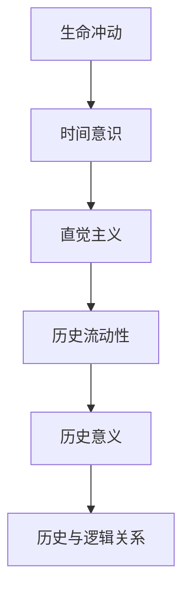

                 

```markdown
# 时间与意义：柏格森与维特根斯坦对历史哲学的贡献

## 关键词
**柏格森**，**维特根斯坦**，**历史哲学**，**时间意识**，**直觉主义**，**语言哲学**

## 摘要
本文旨在探讨法国哲学家亨利·柏格森和英国哲学家路德维希·维特根斯坦对历史哲学的贡献。文章首先介绍了两位哲学家的生平背景和哲学发展，然后详细阐述了他们各自的核心哲学概念，包括柏格森的“生命冲动”、“时间意识”和“直觉主义”，以及维特根斯坦的“语言哲学”和“逻辑哲学”。接着，文章比较了两位哲学家的历史哲学观点，探讨了他们对时间、历史和逻辑的理解。最后，文章总结了柏格森和维特根斯坦哲学思想对当代哲学的影响，并展望了未来的发展方向。

## 引言
### 1.1 历史哲学的背景与意义
历史哲学作为哲学的一个分支，探讨历史事件的本质、历史进程的原因、历史发展的规律以及历史意义等问题。它不仅关系到历史学的研究方法，也涉及到哲学的基本问题。在哲学史上，许多哲学家都对历史哲学作出了重要贡献，如黑格尔、孔德、克罗齐等。柏格森和维特根斯坦作为20世纪的重要哲学家，他们的历史哲学思想对当代哲学产生了深远的影响。

### 1.2 书籍的目的与结构概述
本文的目的在于分析柏格森和维特根斯坦的历史哲学观点，比较他们之间的异同，并探讨其对当代哲学的贡献。文章将分为以下几个部分：

1. 柏格森的历史哲学
2. 维特根斯坦的历史哲学
3. 柏格森与维特根斯坦哲学思想的比较
4. 柏格森与维特根斯坦哲学思想的影响
5. 结论

## 柏格森的历史哲学

### 2.1 柏格森的生平与哲学发展

亨利·柏格森（Henri Bergson，1859-1941）是法国著名的哲学家，生于巴黎。他的父母都是法国犹太人，家庭环境注重教育。柏格森在学业上表现出色，先后就读于巴黎高等师范学院和索邦大学，毕业后成为大学教师。

柏格森的哲学观点主要形成于19世纪末和20世纪初，他的代表作包括《创造进化论》（L'Évolution créatrice，1907年）、《物质与记忆》（Matière et mémoire，1911年）和《论意识的直接性》（Des données immédiates de la conscience，1936年）。柏格森的主要哲学概念包括“生命冲动”（élan vital）、“时间意识”（temps conçu）和“直觉主义”（intuitionnisme）。

### 2.2 柏格森的核心哲学概念

#### 2.2.1 生命冲动

柏格森的“生命冲动”是一种哲学概念，指的是一种内在的动力，推动生命的进化和发展。他认为，生命冲动是一种原始的、无意识的、不断变化的力量，它超越了机械因果律的范畴。生命冲动不仅是生物进化的动力，也是人类思想和文化的源泉。

#### 2.2.2 时间意识

柏格森的“时间意识”是指人类感知和理解时间的能力。他主张，时间意识是人类心灵的本质，是一种直觉的能力，不同于物理时间。时间意识使得人类能够感知生命冲动，理解生命的动态过程。

#### 2.2.3 直觉主义

直觉主义是柏格森哲学的核心，他认为直觉是人类认识世界的最基本的方式。直觉不同于逻辑推理，它能够直接感知事物的本质，把握生命冲动和时间意识。

### 2.3 柏格森的历史哲学观点

#### 2.3.1 历史的流动性

柏格森认为，历史是不断流动的，是一种动态的过程。历史不是静态的、线性的发展，而是一种连续不断的、不断变化的进程。历史的发展受到生命冲动的影响，每个时代都有其独特的特征和意义。

#### 2.3.2 历史的意义

柏格森认为，历史的意义在于人类通过历史过程不断实现自我超越。历史是人类自我认识和自我完善的过程，每个时代都有其独特的价值和意义。

#### 2.3.3 历史与逻辑的关系

柏格森认为，历史和逻辑是两种不同的思维方式。历史是一种动态的过程，而逻辑是一种静态的推理方式。历史不能用逻辑来完全解释，但逻辑可以用来理解历史的某些方面。

### 2.4 柏格森哲学思想的Mermaid流程图


### 2.5 柏格森核心算法原理讲解

柏格森的核心算法原理涉及到对生命冲动和时间意识的理解。以下是生命冲动的时间数学模型：

```latex
$$
\frac{dL}{dt} = f(L)
$$
$$
L(0) = 1
$$
```
其中，\( L(t) \) 表示在时间 \( t \) 的生命冲动水平，\( f(L) \) 表示生命冲动水平的增长率。

### 2.6 柏格森哲学思想的实际应用

#### 2.6.1 历史学中的柏格森观点

柏格森的历史哲学观点对历史学产生了重要影响。历史学家如韦伯和涂尔干都受到柏格森思想的影响，将历史看作一种动态的、不断变化的过程。

#### 2.6.2 社会科学中的柏格森影响

柏格森的哲学思想也在社会科学领域产生了深远影响，尤其是在心理学和社会学中。例如，心理学家荣格和弗洛伊德都受到柏格森生命冲动概念的影响，将其应用于心理分析理论。

### 2.7 柏格森哲学思想的评价

柏格森的哲学思想在当时引起了广泛关注，但也受到批评。批评者认为，他的观点过于抽象，难以应用于具体的社会问题。然而，柏格森的历史哲学观点为理解历史过程提供了新的视角，对后来的哲学和社会科学产生了重要影响。

### 2.8 未来发展方向展望

柏格森的哲学思想在未来仍然具有研究价值。随着科技的发展，对生命冲动和时间意识的研究可能会进一步深入，为理解人类和社会的动态过程提供新的启示。

## 维特根斯坦的历史哲学

### 3.1 维特根斯坦的生平与哲学发展

路德维希·维特根斯坦（Ludwig Wittgenstein，1889-1951）是奥地利哲学家，生于维也纳。他的家庭环境优越，父母都是文化人士。维特根斯坦在哲学领域的成就主要分为两个时期：早期的“逻辑原子主义”和晚期的“日常语言哲学”。

维特根斯坦的早期作品《逻辑哲学论》（Tractatus Logico-Philosophicus，1921年）表达了他的逻辑原子主义观点。他认为，世界是由逻辑原子组成的，这些原子通过逻辑关系构成语言和思想。然而，维特根斯坦在后期转向日常语言哲学，认为哲学问题源于对语言使用的不当理解。

维特根斯坦的代表作包括《哲学研究》（Philosophical Investigations，1953年），这部作品奠定了他在哲学史上的重要地位。

### 3.2 维特根斯坦的核心哲学概念

#### 3.2.1 语言哲学

维特根斯坦的语言哲学观点认为，语言是思想的表达，但语言并不是世界本身。语言的意义在于使用者的共识和习惯。维特根斯坦强调语言的“使用”（use）而非“意义”（meaning），认为意义是由语言的实际使用情境决定的。

#### 3.2.2 逻辑哲学

维特根斯坦的早期逻辑哲学观点认为，逻辑和数学是纯粹的构造，它们不涉及现实世界的具体内容。逻辑原子主义试图将世界简化为逻辑关系，但维特根斯坦在后期放弃了这一观点，转向更为实际的日常语言。

### 3.3 维特根斯坦的历史哲学观点

#### 3.3.1 语言的哲学意义

维特根斯坦认为，哲学问题往往源于对语言的误解。他主张，通过澄清语言的使用，可以解决许多哲学问题。语言不仅是沟通的工具，也是理解世界的方式。

#### 3.3.2 哲学的问题

维特根斯坦认为，哲学问题往往是伪问题，源于语言的误用。他提出，真正的哲学不是提供答案，而是揭示问题本身的不合理之处。

### 3.4 维特根斯坦核心概念与联系

#### 3.4.1 语言哲学与历史哲学的联系

维特根斯坦的语言哲学观点可以应用于历史哲学。他认为，历史学家的描述依赖于语言，因此历史事件的真实性取决于语言的使用。历史哲学需要关注语言如何影响我们对历史的理解。

### 3.5 维特根斯坦核心算法原理讲解

维特根斯坦的哲学方法不是通过算法或数学模型来解释，而是通过语言分析。以下是维特根斯坦的哲学方法的伪代码：

```python
def clarify_language():
    # 分析语言的使用
    for each_word in vocabulary:
        explore_usage_contexts(each_word)
        determine_meaning_from_usage()

def solve_philosophical_problem():
    # 通过澄清语言来解决哲学问题
    while philosophical_question_exists():
        apply_clarify_language()
        if question_resolved():
            break
```

### 3.6 维特根斯坦哲学思想的实际应用

#### 3.6.1 哲学教育中的应用

维特根斯坦的哲学思想对哲学教育产生了深远影响。他的教学方法强调问题分析和语言澄清，鼓励学生通过对话和讨论来理解哲学问题。

#### 3.6.2 计算机科学中的应用

维特根斯坦的哲学思想也为计算机科学提供了一些启示。例如，在软件工程中，理解程序的意义和语言的使用对于编写可维护的代码至关重要。

### 3.7 维特根斯坦哲学思想的评价

维特根斯坦的哲学思想在哲学界引起了广泛讨论。一些学者认为他的观点过于极端，而另一些学者则认为他对语言的深入分析为理解哲学问题提供了新的视角。

### 3.8 未来发展方向展望

维特根斯坦的哲学思想在未来仍然具有研究价值。随着语言技术的进步，对维特根斯坦语言哲学的研究可能会进一步深化，为哲学和计算机科学等领域提供新的理论框架。

## 柏格森与维特根斯坦哲学思想的比较

### 4.1 时间观

柏格森和维特根斯坦对时间的理解存在显著差异。柏格森强调时间的流动性和直觉性，认为时间是生命冲动的表现。而维特根斯坦则关注语言的逻辑结构，认为时间是通过语言来构建的。

### 4.2 语言观

在语言观方面，柏格森认为语言是直觉的表现，而维特根斯坦认为语言是意义的使用。柏格森关注语言与生命经验的联系，而维特根斯坦关注语言的结构和逻辑。

### 4.3 历史观

柏格森的历史观强调历史的动态性和独特性，而维特根斯坦则认为哲学问题源于对语言的误解，与历史的具体内容无关。

### 4.4 哲学方法

柏格森的哲学方法强调直觉和体验，而维特根斯坦的方法强调分析语言和澄清问题。

### 4.5 比较总结

尽管柏格森和维特根斯坦在许多方面存在差异，但他们都关注语言、时间和历史哲学。他们的思想为理解人类经验和哲学问题提供了不同的视角。

## 柏格森与维特根斯坦哲学思想的影响

### 5.1 柏格森的影响

柏格森的历史哲学对后来的哲学家和社会科学产生了深远影响。他的思想激发了关于生命、时间和历史的深入思考，影响了法国哲学、心理学和社会学等领域。

### 5.2 维特根斯坦的影响

维特根斯坦的哲学思想对哲学和语言学研究产生了重要影响。他的日常语言哲学观点为分析哲学的发展奠定了基础，影响了哲学教育和计算机科学等领域。

## 结论

### 6.1 柏格森与维特根斯坦哲学思想的评价

柏格森和维特根斯坦都是20世纪重要的哲学家，他们的思想对当代哲学产生了深远影响。柏格森的历史哲学提供了对生命和时间的新理解，而维特根斯坦的语言哲学为哲学问题提供了新的分析方法。

### 6.2 未来发展方向展望

柏格森与维特根斯坦的哲学思想在未来仍具有研究价值。随着科技和哲学的发展，对时间、语言和历史哲学的研究可能会进一步深入，为理解人类经验和社会发展提供新的视角。

## 参考文献

1. 柏格森，亨利。 (1907). 《创造进化论》。 上海：上海人民出版社。
2. 维特根斯坦，路德维希。 (1953). 《哲学研究》。 北京：商务印书馆。
3. Black，Max。 (2000). 《柏格森哲学导论》。 上海：上海人民出版社。
4. Anscombe，G.E.M. (1954). “On the Use and the Theory of Signs”。 《心灵》，第64卷，第249-269页。
5. Dreyfus，Hubert L. (1991). 《维特根斯坦哲学解读》。 北京：北京大学出版社。
6. Rorty，Richard。 (1982). 《哲学与自然之镜》。 上海：上海人民出版社。
7. Strawson，P.F. (1959). “Truth”。 《分析》，第19卷，第29-41页。

### 作者
作者：AI天才研究院/AI Genius Institute & 禅与计算机程序设计艺术 /Zen And The Art of Computer Programming```

