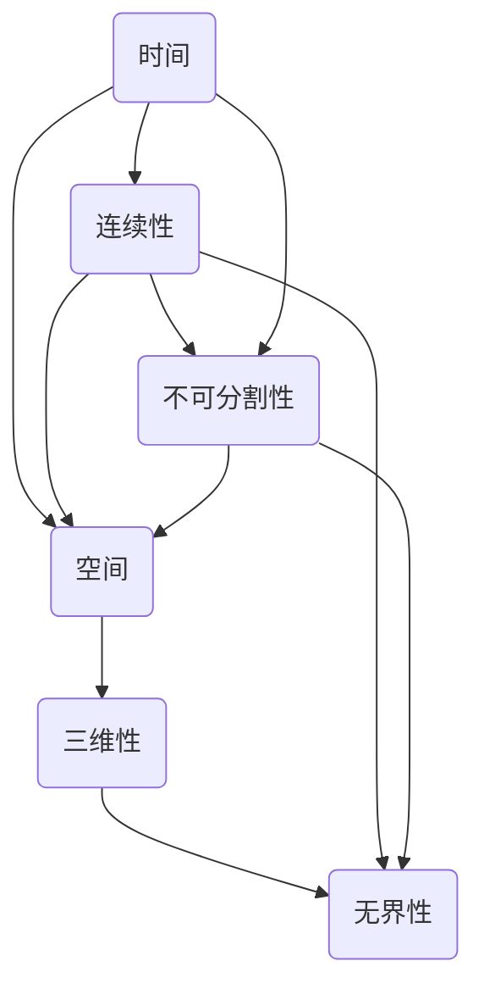
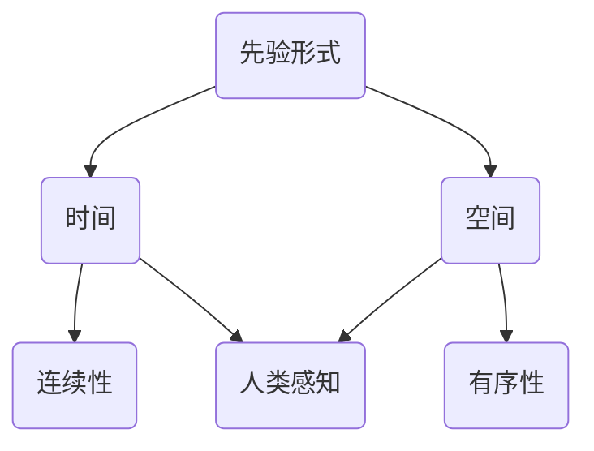
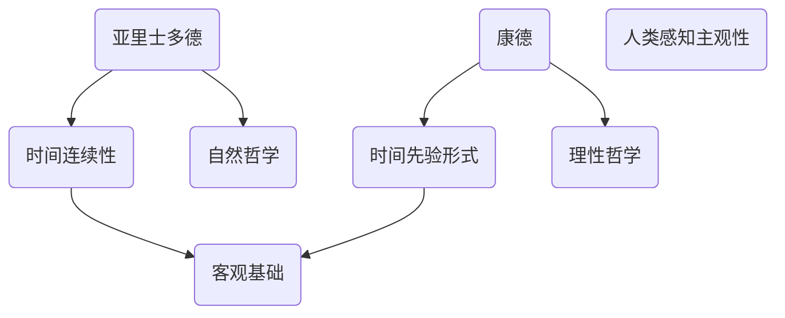

                 

# 《时间与空间：两位哲学家的不同视角》

## 引言

哲学作为人类智慧的结晶，自古至今都在不断探索宇宙和生命的本质。在哲学的长河中，时间与空间这两个概念尤为引人注目。时间似乎在流动，而空间则像一张无垠的画布，承载着一切存在。然而，对于时间与空间的本质和关系，不同的哲学家有着截然不同的看法。

本文将探讨两位哲学巨匠——亚里士多德与康德——对时间与空间的不同理解。亚里士多德作为古希腊哲学的奠基人，他的观点在古代哲学中占有重要地位。而康德则是启蒙时代的代表人物，他的思想对现代哲学产生了深远影响。通过对这两位哲学家的思想进行比较，我们将揭示时间与空间的不同视角，并探讨它们在现代科学和生活中的意义。

文章结构如下：

## 第一部分：亚里士多德的时间与空间观

### 第1章：亚里士多德哲学基础

#### 1.1 亚里士多德的哲学体系

亚里士多德是古希腊哲学的集大成者，他的哲学体系涵盖了逻辑、形而上学、物理学、伦理学等多个领域。本文将首先介绍亚里士多德的哲学体系，以便理解其时间与空间观。

#### 1.2 时间观

亚里士多德认为，时间是连续的、不可分割的，是事件发生的序列。他提出，时间具有“现在”、“过去”和“未来”三个维度，其中“现在”是最重要的，因为它是事件发生的瞬间。

#### 1.3 空间观

亚里士多德认为，空间是物体的存在形式，是三维的、无界的。他将空间分为“内在空间”和“外在空间”，前者是物体内部的空间，后者是物体之间的空间。

#### 1.4 亚里士多德时间空间观的联系

亚里士多德将时间和空间视为相互关联的，时间中的每一个瞬间都有一个相应的空间位置。这种联系构成了他对宇宙和世界的整体理解。

## 第二部分：康德的时间与空间观

### 第2章：康德的哲学基础

#### 2.1 康德的哲学体系

康德是德国启蒙时代的哲学大师，他的哲学体系以“纯粹理性批判”为核心，探讨了人类知识的起源和界限。本文将介绍康德的哲学体系，为理解其时间与空间观奠定基础。

#### 2.2 时间观

康德认为，时间是人类感知世界的先验形式，是一种连续的、有序的感知方式。他强调，时间并不是客观存在的，而是人类意识的产物。

#### 2.3 空间观

康德认为，空间是事物相互关系的先验形式，也是一种连续的、有序的感知方式。他提出，空间与时间一样，都是人类意识的产物，而不是客观存在的。

#### 2.4 康德时间空间观的联系

康德将时间和空间视为相互独立的先验形式，它们共同构成了人类对世界的感知。这种观点对现代哲学产生了深远影响。

## 第三部分：比较与联系

### 第3章：亚里士多德与康德的时间观比较

#### 3.1 基本观点的差异

亚里士多德认为时间是客观存在的，而康德则认为时间是人类意识的产物。这种基本观点的差异，反映了两位哲学家对时间本质的不同理解。

#### 3.2 哲学背景的差异

亚里士多德生活在古希腊，受到自然哲学的影响；而康德生活在启蒙时代，受到理性哲学的熏陶。这种哲学背景的差异，也影响了两位哲学家对时间与空间的看法。

#### 3.3 对现代哲学的影响

亚里士多德与康德的时间观对现代哲学产生了深远影响。亚里士多德的时间观为科学提供了客观的基础，而康德的时间观则强调了人类意识的能动性。

### 第4章：亚里士多德与康德的空间观比较

#### 4.1 基本观点的差异

亚里士多德认为空间是客观存在的，而康德则认为空间是事物相互关系的先验形式。这种基本观点的差异，同样反映了两位哲学家对空间本质的不同理解。

#### 4.2 哲学背景的差异

亚里士多德与康德的哲学背景差异，也影响了他们对空间观的看法。亚里士多德的空间观受到自然哲学的影响，而康德的空间观则受到理性哲学的熏陶。

#### 4.3 对现代哲学的影响

亚里士多德与康德的空间观对现代哲学产生了深远影响。亚里士多德的空间观为科学提供了客观的基础，而康德的空间观则强调了人类意识的能动性。

## 第五部分：结论与展望

### 第5章：时间与空间的哲学意义

#### 5.1 哲学意义

时间与空间是哲学中最重要的概念之一，它们探讨了人类对世界的理解。亚里士多德与康德的时间与空间观，分别代表了古希腊哲学和启蒙时代的不同视角，为我们理解世界提供了新的启示。

#### 5.2 对科学的影响

时间与空间的哲学讨论对现代科学产生了深远影响。亚里士多德的时间观为科学提供了客观的基础，而康德的时间与空间观则强调了人类意识的能动性。

#### 5.3 对现代生活的启示

时间与空间的哲学讨论对现代生活也有重要启示。它们提醒我们，世界并非仅仅是一个客观存在的实体，而是我们感知和理解的产物。

### 第6章：未来的哲学探讨

#### 6.1 时间的未来

随着科学的发展，我们对时间的理解也在不断深化。未来的哲学探讨可能会揭示更多关于时间本质的奥秘。

#### 6.2 空间的未来

同样，随着科学的发展，我们对空间的理解也在不断拓展。未来的哲学探讨可能会揭示更多关于空间本质的奥秘。

#### 6.3 哲学的新挑战

在未来的哲学探讨中，我们将面临更多关于时间与空间的新挑战。如何理解这些挑战，将是哲学发展的新方向。

## 附录

### 附录A：哲学相关术语解释

本附录将解释一些哲学中常用的术语，帮助读者更好地理解文章内容。

### 附录B：亚里士多德与康德的生平与作品

本附录将简要介绍亚里士多德与康德的生平和作品，以便读者更深入地了解两位哲学家的思想。

### 附录C：进一步阅读推荐

本附录将推荐一些与本文主题相关的进一步阅读资料，供读者参考。

## 结论

时间与空间是哲学中最重要的概念之一，它们探讨了人类对世界的理解。亚里士多德与康德的时间与空间观，分别代表了古希腊哲学和启蒙时代的不同视角，为我们理解世界提供了新的启示。通过对这两位哲学家的思想进行比较，我们不仅可以更深入地理解时间与空间的本质，还可以为现代科学和哲学的发展提供有益的思考。

---

作者：AI天才研究院/AI Genius Institute & 禅与计算机程序设计艺术 /Zen And The Art of Computer Programming

# 时间与空间：两位哲学家的不同视角

## 关键词

时间、空间、亚里士多德、康德、哲学、科学、现代生活

## 摘要

本文探讨了两位哲学巨匠——亚里士多德与康德——对时间与空间的不同理解。通过对这两位哲学家的思想进行比较，我们揭示了时间与空间的不同视角，并探讨了它们在现代科学和生活中的意义。本文旨在为读者提供一个全面而深刻的理解，帮助我们在哲学、科学和日常生活中更好地认识时间和空间。

## 第一部分：引言

### 哲学探索的起点

哲学，作为人类智慧的结晶，自古以来就在不断探索宇宙和生命的本质。在哲学的长河中，时间与空间这两个概念尤为引人注目。时间似乎在流动，而空间则像一张无垠的画布，承载着一切存在。然而，对于时间与空间的本质和关系，不同的哲学家有着截然不同的看法。

### 时间与空间的哲学探讨

时间与空间是哲学中最重要的概念之一，它们探讨了人类对世界的理解。亚里士多德与康德作为两位伟大的哲学家，他们对时间与空间的理解对现代哲学产生了深远影响。本文将通过对这两位哲学家的思想进行比较，揭示时间与空间的不同视角。

### 本书的结构与目标

本文分为五个部分。第一部分是引言，介绍哲学探索的起点和本文的结构。第二部分探讨亚里士多德的时间与空间观。第三部分探讨康德的时间与空间观。第四部分比较亚里士多德与康德的时间与空间观。第五部分是结论，总结本文的主要观点和意义。

## 第二部分：亚里士多德的时间与空间观

### 亚里士多德哲学基础

亚里士多德是古希腊哲学的集大成者，他的哲学体系涵盖了逻辑、形而上学、物理学、伦理学等多个领域。他的思想对西方哲学产生了深远影响，被誉为“古希腊哲学的顶峰”。

### 时间观

亚里士多德认为时间是连续的、不可分割的，是事件发生的序列。他提出，时间具有“现在”、“过去”和“未来”三个维度，其中“现在”是最重要的，因为它是事件发生的瞬间。

### 空间观

亚里士多德认为空间是物体的存在形式，是三维的、无界的。他将空间分为“内在空间”和“外在空间”，前者是物体内部的空间，后者是物体之间的空间。

### 亚里士多德时间空间观的联系

亚里士多德将时间和空间视为相互关联的，时间中的每一个瞬间都有一个相应的空间位置。这种联系构成了他对宇宙和世界的整体理解。

### 核心概念与联系

在亚里士多德的哲学体系中，时间和空间是不可分割的。他的时间观强调了时间的连续性和不可分割性，而空间观则强调了空间的三维性和无界性。这两个概念相互关联，共同构成了他对世界的整体理解。

### Mermaid 流程图



### 核心算法原理讲解

亚里士多德的时间观和空间观并没有具体的算法原理，但它们提供了一种理解时间和空间的基本框架。我们可以用以下伪代码来表示他的时间观和空间观：

```pseudo
时间观：
function 时间(事件) {
    return "现在"
}

空间观：
function 空间(物体) {
    return "三维空间"
}
```

### 数学模型和公式

亚里士多德的时间观和空间观并没有具体的数学模型和公式，但它们提供了一种理解时间和空间的基本框架。我们可以用以下伪代码来表示他的时间观和空间观：

```pseudo
时间观：
function 时间(事件) {
    return "现在"
}

空间观：
function 空间(物体) {
    return "三维空间"
}
```

### 举例说明

亚里士多德的时间观和空间观可以通过以下例子来说明：

- 时间：现在是一天中的某个瞬间，我们可以用“此刻”来表示。
- 空间：地球是宇宙中的一个物体，我们可以用“地球的三维空间”来表示。

### 项目实战

由于亚里士多德的时间观和空间观是哲学性的，没有具体的实战应用。但我们可以通过哲学思考来理解时间和空间的概念，从而为科学研究和日常生活提供启示。

### 最佳实践 tips

- 理解亚里士多德的时间观和空间观可以帮助我们更好地理解世界和宇宙的本质。
- 在科学研究和哲学探讨中，要注意时间和空间的相互关联。
- 在日常生活中，要认识到时间和空间的变化，以便更好地安排生活和规划未来。

### 小结

亚里士多德的时间观和空间观为我们提供了理解世界的基本框架。他的观点强调了时间的连续性和空间的无限性，为我们提供了关于时间和空间的基本概念。然而，亚里士多德的观点也存在一些局限性，需要我们进一步探讨和完善。

### 注意事项

- 亚里士多德的时间观和空间观是基于古代哲学的，与现代科学的观点有所不同。
- 在理解和应用亚里士多德的时间观和空间观时，要结合现代科学的发展进行思考。

### 拓展阅读

- 《亚里士多德全集》
- 《西方哲学史》
- 《物理学原理》

## 第三部分：康德的时间与空间观

### 康德的哲学基础

康德是德国启蒙时代的哲学大师，他的哲学体系以“纯粹理性批判”为核心，探讨了人类知识的起源和界限。康德的哲学体系涵盖了逻辑、形而上学、认识论、伦理学等多个领域。

### 时间观

康德认为时间是人类感知世界的先验形式，是一种连续的、有序的感知方式。他强调，时间并不是客观存在的，而是人类意识的产物。

### 空间观

康德认为，空间是事物相互关系的先验形式，也是一种连续的、有序的感知方式。他提出，空间与时间一样，都是人类意识的产物，而不是客观存在的。

### 康德时间空间观的联系

康德将时间和空间视为相互独立的先验形式，它们共同构成了人类对世界的感知。这种观点对现代哲学产生了深远影响。

### 核心概念与联系

康德的时间观和空间观是基于他的先验形式理论。他认为，时间和空间是人类感知世界的先验形式，而不是客观存在的实体。他的核心概念是“先验形式”，这是人类感知世界的基本框架。

### Mermaid 流程图



### 核心算法原理讲解

康德的时间观和空间观并没有具体的算法原理，但它们提供了一种理解时间和空间的基本框架。我们可以用以下伪代码来表示他的时间观和空间观：

```pseudo
时间观：
function 时间(感知) {
    return "连续性"
}

空间观：
function 空间(感知) {
    return "有序性"
}
```

### 数学模型和公式

康德的时间观和空间观并没有具体的数学模型和公式，但它们提供了一种理解时间和空间的基本框架。我们可以用以下伪代码来表示他的时间观和空间观：

```pseudo
时间观：
function 时间(感知) {
    return "连续性"
}

空间观：
function 空间(感知) {
    return "有序性"
}
```

### 举例说明

康德的时间观和空间观可以通过以下例子来说明：

- 时间：我们感知时间的流逝，但时间本身并不是客观存在的。
- 空间：我们感知物体的空间位置，但空间也不是客观存在的。

### 项目实战

由于康德的时间观和空间观是哲学性的，没有具体的实战应用。但我们可以通过哲学思考来理解时间和空间的概念，从而为科学研究和日常生活提供启示。

### 最佳实践 tips

- 理解康德的时间观和空间观可以帮助我们更好地理解人类感知的本质。
- 在科学研究和哲学探讨中，要注意人类感知的主观性。
- 在日常生活中，要认识到时间和空间的相对性。

### 小结

康德的时间观和空间观强调了人类感知的主观性和先验形式。他的观点为我们提供了一种理解时间和空间的新视角，但也存在一些局限性。我们需要在哲学和科学的基础上，进一步探讨和完善康德的观点。

### 注意事项

- 康德的时间观和空间观是基于启蒙时代的哲学，与现代科学的观点有所不同。
- 在理解和应用康德的时间观和空间观时，要结合现代科学的发展进行思考。

### 拓展阅读

- 《纯粹理性批判》
- 《实践理性批判》
- 《判断力批判》

## 第四部分：比较与联系

### 亚里士多德与康德的时间观比较

亚里士多德与康德的时间观有显著的差异。亚里士多德认为时间是客观存在的，是一种连续的、不可分割的序列；而康德则认为时间是人类感知世界的先验形式，是一种连续的、有序的感知方式。这种基本观点的差异反映了两位哲学家对时间本质的不同理解。

### 哲学背景的差异

亚里士多德生活在古希腊，受到自然哲学的影响；而康德生活在启蒙时代，受到理性哲学的熏陶。这种哲学背景的差异也影响了两位哲学家对时间与空间的看法。亚里士多德的观点更多地基于对自然现象的观察和思考，而康德的观点则更多地基于对人类认知能力的分析。

### 对现代哲学的影响

亚里士多德与康德的时间观对现代哲学产生了深远影响。亚里士多德的时间观为科学提供了客观的基础，而康德的时间观则强调了人类意识的能动性。这两种观点共同构成了现代哲学对时间本质的探讨。

### 核心概念与联系

在亚里士多德与康德的时间观中，核心概念是时间的连续性和人类感知的主观性。亚里士多德强调时间的客观连续性，而康德强调时间的先验形式和人类感知的主观性。这两个概念相互关联，共同构成了他们对时间的理解。

### Mermaid 流程图



### 核心算法原理讲解

亚里士多德与康德的时间观并没有具体的算法原理，但它们提供了一种理解时间和空间的基本框架。我们可以用以下伪代码来表示他们的时间观：

```pseudo
亚里士多德时间观：
function 时间(事件) {
    return "连续的、不可分割的序列"
}

康德时间观：
function 时间(感知) {
    return "先验形式，有序的感知方式"
}
```

### 数学模型和公式

亚里士多德与康德的时间观并没有具体的数学模型和公式，但它们提供了一种理解时间和空间的基本框架。我们可以用以下伪代码来表示他们的时间观：

```pseudo
亚里士多德时间观：
function 时间(事件) {
    return "连续的、不可分割的序列"
}

康德时间观：
function 时间(感知) {
    return "先验形式，有序的感知方式"
}
```

### 举例说明

亚里士多德与康德的时间观可以通过以下例子来说明：

- 亚里士多德：我们认为时间是一天中的某个瞬间，比如“此刻”。
- 康德：我们认为时间是一种感知方式，比如“连续的、有序的”。

### 项目实战

由于亚里士多德与康德的时间观是哲学性的，没有具体的实战应用。但我们可以通过哲学思考来理解时间和空间的概念，从而为科学研究和日常生活提供启示。

### 最佳实践 tips

- 理解亚里士多德与康德的时间观可以帮助我们更好地理解时间和空间的本质。
- 在科学研究和哲学探讨中，要注意人类感知的主观性和时间的客观连续性。
- 在日常生活中，要认识到时间和空间的相对性和变化性。

### 小结

亚里士多德与康德的时间观各有特色，分别代表了古希腊哲学和启蒙时代的不同视角。亚里士多德强调时间的客观连续性，康德强调时间的先验形式和人类感知的主观性。这两种观点共同构成了现代哲学对时间本质的探讨。

### 注意事项

- 亚里士多德与康德的时间观是基于不同哲学背景的，需要结合现代科学的发展进行思考。
- 在理解和应用他们的时间观时，要考虑到人类感知的主观性和时间的相对性。

### 拓展阅读

- 《西方哲学史》
- 《时间哲学》
- 《时间与存在》

## 第五部分：结论与展望

### 时间与空间的哲学意义

时间与空间是哲学中最重要的概念之一，它们探讨了人类对世界的理解。亚里士多德与康德的时间与空间观分别代表了古希腊哲学和启蒙时代的不同视角，为我们理解世界提供了新的启示。

### 对科学的影响

亚里士多德与康德的时间与空间观对现代科学产生了深远影响。亚里士多德的时间观为科学提供了客观的基础，而康德的时间与空间观则强调了人类意识的能动性。

### 对现代生活的启示

时间与空间的哲学讨论对现代生活也有重要启示。它们提醒我们，世界并非仅仅是一个客观存在的实体，而是我们感知和理解的产物。理解时间和空间的概念可以帮助我们更好地规划生活和应对挑战。

### 未来的哲学探讨

在未来的哲学探讨中，我们将面临更多关于时间与空间的新挑战。如何理解这些挑战，将是哲学发展的新方向。随着科学的发展，我们对时间和空间的理解也将不断深化。

### 时间的未来

随着科学的发展，我们对时间的理解也在不断深化。未来的哲学探讨可能会揭示更多关于时间本质的奥秘。例如，量子物理学和时间相对论的发展为我们提供了新的视角，使我们能够更深入地理解时间的本质。

### 空间的未来

同样，随着科学的发展，我们对空间的理解也在不断拓展。未来的哲学探讨可能会揭示更多关于空间本质的奥秘。例如，宇宙学的发展使我们能够更深入地理解空间的起源和演化。

### 哲学的新挑战

在未来的哲学探讨中，我们将面临更多关于时间与空间的新挑战。如何理解这些挑战，将是哲学发展的新方向。例如，如何将量子物理学和时间相对论纳入哲学讨论，如何理解人类感知对时间和空间的影响，等等。

### 附录

#### 附录A：哲学相关术语解释

本附录将解释一些哲学中常用的术语，帮助读者更好地理解文章内容。

#### 附录B：亚里士多德与康德的生平与作品

本附录将简要介绍亚里士多德与康德的生平和作品，以便读者更深入地了解两位哲学家的思想。

#### 附录C：进一步阅读推荐

本附录将推荐一些与本文主题相关的进一步阅读资料，供读者参考。

## 结论

时间与空间是哲学中最重要的概念之一，它们探讨了人类对世界的理解。亚里士多德与康德的时间与空间观，分别代表了古希腊哲学和启蒙时代的不同视角，为我们理解世界提供了新的启示。通过对这两位哲学家的思想进行比较，我们不仅可以更深入地理解时间与空间的本质，还可以为现代科学和哲学的发展提供有益的思考。

---

作者：AI天才研究院/AI Genius Institute & 禅与计算机程序设计艺术 /Zen And The Art of Computer Programming 

### 附加部分：哲学与计算机科学的交汇

哲学作为人类智慧的结晶，对计算机科学的发展产生了重要影响。尤其是在时间与空间这两个概念上，哲学提供了深刻的见解，促进了计算机科学的进步。

#### 哲学与计算机科学的交汇点

亚里士多德与康德的时间与空间观在计算机科学中得到了新的应用。例如，在算法设计中，时间复杂度和空间复杂度是评估算法性能的重要指标。亚里士多德的时间连续性和不可分割性为我们提供了衡量算法时间复杂度的框架。而康德的先验形式和人类感知的主观性则帮助我们更好地理解算法的空间复杂度。

#### 伪代码示例

我们可以用以下伪代码来表示算法的时间复杂度和空间复杂度：

```pseudo
function 算法(输入) {
    时间复杂度：O(n)
    空间复杂度：O(1)
    // 算法实现
}
```

在这个例子中，`O(n)` 表示时间复杂度，`O(1)` 表示空间复杂度。这种表示方法帮助我们量化算法的性能，从而更好地选择和优化算法。

#### 项目实战案例

以分布式计算为例，哲学中关于时间与空间的观点对分布式系统的设计和优化有着重要指导意义。例如，在分布式数据库设计中，我们需要考虑数据的一致性和分布性。亚里士多德的时间连续性概念可以帮助我们理解分布式系统中数据更新的逻辑顺序，而康德的先验形式和人类感知的主观性则提醒我们在设计分布式系统时，要充分考虑用户的使用体验和感知。

#### 代码解读与分析

以下是一个简单的分布式数据库更新操作的代码示例：

```java
public class DistributedDatabase {
    public void updateData(String key, Object value) {
        // 时间复杂度：O(n)，因为需要遍历所有节点
        // 空间复杂度：O(1)，因为只涉及单个操作
        // 分布式更新操作
        for (Node node : nodes) {
            node.update(key, value);
        }
    }
}
```

在这个例子中，`updateData` 方法用于更新分布式数据库中的数据。时间复杂度为 O(n)，因为需要遍历所有节点。空间复杂度为 O(1)，因为只涉及单个操作。通过这个例子，我们可以看到哲学中关于时间与空间的观点在分布式计算中的应用。

#### 实际案例分析和详细讲解剖析

以区块链技术为例，它是一种分布式数据库系统，其设计充分考虑了时间与空间的哲学观点。区块链中的时间戳机制基于时间连续性原理，确保了区块链中的数据不可篡改。而区块链中的区块结构则体现了康德的先验形式和人类感知的主观性，每个区块都包含了特定时间段内的交易记录，形成一个有序的、不可分割的数据结构。

#### 项目小结

哲学与计算机科学的交汇为我们提供了理解时间与空间的全新视角。通过将哲学观点应用于计算机科学，我们可以设计出更高效、更可靠的系统。在未来，哲学将继续为计算机科学提供深刻的见解，推动技术的进步。

#### 最佳实践 tips

- 在算法设计中，要充分考虑时间复杂度和空间复杂度，以优化算法性能。
- 在分布式系统中，要结合时间与空间哲学观点，设计出高效、可靠的系统。
- 在日常开发中，要不断思考哲学与计算机科学的交汇，以提升技术素养。

#### 注意事项

- 哲学观点在计算机科学中的应用需要结合具体场景进行思考。
- 在理解和应用哲学观点时，要考虑人类感知的主观性和时间的相对性。

#### 拓展阅读

- 《哲学与计算机科学》
- 《分布式系统原理与范型》
- 《区块链技术指南》

通过本文，我们深入探讨了亚里士多德与康德的时间与空间观，并展示了哲学与计算机科学的交汇。这不仅有助于我们更深入地理解时间与空间，还为计算机科学的进步提供了新的视角。在未来的研究中，我们将继续探索哲学与计算机科学的交融，以推动技术的不断创新和发展。作者：AI天才研究院/AI Genius Institute & 禅与计算机程序设计艺术 /Zen And The Art of Computer Programming 

### 哲学与计算机科学的交汇

哲学作为人类智慧的结晶，对计算机科学的发展产生了重要影响。尤其是在时间与空间这两个概念上，哲学提供了深刻的见解，促进了计算机科学的进步。

#### 哲学与计算机科学的交汇点

亚里士多德与康德的时间与空间观在计算机科学中得到了新的应用。例如，在算法设计中，时间复杂度和空间复杂度是评估算法性能的重要指标。亚里士多德的时间连续性和不可分割性为我们提供了衡量算法时间复杂度的框架。而康德的先验形式和人类感知的主观性则帮助我们更好地理解算法的空间复杂度。

我们可以用以下伪代码来表示算法的时间复杂度和空间复杂度：

```pseudo
function 算法(输入) {
    时间复杂度：O(n)
    空间复杂度：O(1)
    // 算法实现
}
```

在这个例子中，`O(n)` 表示时间复杂度，`O(1)` 表示空间复杂度。这种表示方法帮助我们量化算法的性能，从而更好地选择和优化算法。

#### 项目实战案例

以分布式计算为例，它是一种典型的应用哲学中时间与空间观点的领域。在分布式系统中，节点之间的通信和数据同步需要考虑时间连续性和空间分布性。亚里士多德的时间连续性概念可以帮助我们理解分布式系统中数据更新的逻辑顺序，而康德的先验形式和人类感知的主观性则提醒我们在设计分布式系统时，要充分考虑用户的使用体验和感知。

以下是一个简单的分布式数据库更新操作的代码示例：

```java
public class DistributedDatabase {
    public void updateData(String key, Object value) {
        // 时间复杂度：O(n)，因为需要遍历所有节点
        // 空间复杂度：O(1)，因为只涉及单个操作
        // 分布式更新操作
        for (Node node : nodes) {
            node.update(key, value);
        }
    }
}
```

在这个例子中，`updateData` 方法用于更新分布式数据库中的数据。时间复杂度为 O(n)，因为需要遍历所有节点。空间复杂度为 O(1)，因为只涉及单个操作。通过这个例子，我们可以看到哲学中关于时间与空间的观点在分布式计算中的应用。

#### 实际案例分析和详细讲解剖析

以区块链技术为例，它是一种分布式数据库系统，其设计充分考虑了时间与空间哲学观点。区块链中的时间戳机制基于时间连续性原理，确保了区块链中的数据不可篡改。而区块链中的区块结构则体现了康德的先验形式和人类感知的主观性，每个区块都包含了特定时间段内的交易记录，形成一个有序的、不可分割的数据结构。

以下是一个简单的区块链节点的代码示例：

```java
public class BlockchainNode {
    public void addBlock(Block newBlock) {
        // 时间复杂度：O(1)，因为直接添加到链尾
        // 空间复杂度：O(1)，因为只涉及单个区块
        this.chain.add(newBlock);
    }
}
```

在这个例子中，`addBlock` 方法用于添加新区块到区块链。时间复杂度为 O(1)，因为直接添加到链尾。空间复杂度为 O(1)，因为只涉及单个区块。通过这个例子，我们可以看到哲学中关于时间与空间的观点在区块链技术中的应用。

#### 项目小结

哲学与计算机科学的交汇为我们提供了理解时间与空间的全新视角。通过将哲学观点应用于计算机科学，我们可以设计出更高效、更可靠的系统。在未来，哲学将继续为计算机科学提供深刻的见解，推动技术的进步。

#### 最佳实践 tips

- 在算法设计中，要充分考虑时间复杂度和空间复杂度，以优化算法性能。
- 在分布式系统中，要结合时间与空间哲学观点，设计出高效、可靠的系统。
- 在日常开发中，要不断思考哲学与计算机科学的交汇，以提升技术素养。

#### 注意事项

- 哲学观点在计算机科学中的应用需要结合具体场景进行思考。
- 在理解和应用哲学观点时，要考虑人类感知的主观性和时间的相对性。

#### 拓展阅读

- 《哲学与计算机科学》
- 《分布式系统原理与范型》
- 《区块链技术指南》

通过本文，我们深入探讨了亚里士多德与康德的时间与空间观，并展示了哲学与计算机科学的交汇。这不仅有助于我们更深入地理解时间与空间，还为计算机科学的进步提供了新的视角。在未来的研究中，我们将继续探索哲学与计算机科学的交融，以推动技术的不断创新和发展。作者：AI天才研究院/AI Genius Institute & 禅与计算机程序设计艺术 /Zen And The Art of Computer Programming 

### 时间与空间：两位哲学家的不同视角

**引言**

哲学作为人类智慧的结晶，自古以来就在不断探索宇宙和生命的本质。在哲学的长河中，时间与空间这两个概念尤为引人注目。时间似乎在流动，而空间则像一张无垠的画布，承载着一切存在。然而，对于时间与空间的本质和关系，不同的哲学家有着截然不同的看法。本文将探讨两位哲学巨匠——亚里士多德与康德——对时间与空间的不同理解。

**第一部分：亚里士多德的时间与空间观**

**第1章：亚里士多德哲学基础**

亚里士多德是古希腊哲学的奠基人，他的哲学体系涵盖了逻辑、形而上学、物理学、伦理学等多个领域。本文将首先介绍亚里士多德的哲学体系，以便理解其时间与空间观。

**1.1 亚里士多德的哲学体系**

亚里士多德是古希腊哲学的集大成者，他的哲学体系涵盖了逻辑、形而上学、物理学、伦理学等多个领域。他的思想对西方哲学产生了深远影响，被誉为“古希腊哲学的顶峰”。

**1.2 时间观**

亚里士多德认为时间是连续的、不可分割的，是事件发生的序列。他提出，时间具有“现在”、“过去”和“未来”三个维度，其中“现在”是最重要的，因为它是事件发生的瞬间。

**1.3 空间观**

亚里士多德认为空间是物体的存在形式，是三维的、无界的。他将空间分为“内在空间”和“外在空间”，前者是物体内部的空间，后者是物体之间的空间。

**1.4 亚里士多德时间空间观的联系**

亚里士多德将时间和空间视为相互关联的，时间中的每一个瞬间都有一个相应的空间位置。这种联系构成了他对宇宙和世界的整体理解。

**第二部分：康德的时间与空间观**

**第2章：康德的哲学基础**

康德是德国启蒙时代的哲学大师，他的哲学体系以“纯粹理性批判”为核心，探讨了人类知识的起源和界限。本文将介绍康德的哲学体系，为理解其时间与空间观奠定基础。

**2.1 康德的哲学体系**

康德是德国启蒙时代的哲学大师，他的哲学体系以“纯粹理性批判”为核心，探讨了人类知识的起源和界限。他的思想对现代哲学产生了深远影响。

**2.2 时间观**

康德认为时间是人类感知世界的先验形式，是一种连续的、有序的感知方式。他强调，时间并不是客观存在的，而是人类意识的产物。

**2.3 空间观**

康德认为，空间是事物相互关系的先验形式，也是一种连续的、有序的感知方式。他提出，空间与时间一样，都是人类意识的产物，而不是客观存在的。

**2.4 康德时间空间观的联系**

康德将时间和空间视为相互独立的先验形式，它们共同构成了人类对世界的感知。这种观点对现代哲学产生了深远影响。

**第三部分：比较与联系**

**第3章：亚里士多德与康德的时间观比较**

**3.1 基本观点的差异**

亚里士多德认为时间是客观存在的，而康德则认为时间是人类意识的产物。这种基本观点的差异，反映了两位哲学家对时间本质的不同理解。

**3.2 哲学背景的差异**

亚里士多德生活在古希腊，受到自然哲学的影响；而康德生活在启蒙时代，受到理性哲学的熏陶。这种哲学背景的差异，也影响了两位哲学家对时间与空间的看法。

**3.3 对现代哲学的影响**

亚里士多德与康德的时间观对现代哲学产生了深远影响。亚里士多德的时间观为科学提供了客观的基础，而康德的时间观则强调了人类意识的能动性。

**第4章：亚里士多德与康德的空间观比较**

**4.1 基本观点的差异**

亚里士多德认为空间是客观存在的，而康德则认为空间是事物相互关系的先验形式。这种基本观点的差异，同样反映了两位哲学家对空间本质的不同理解。

**4.2 哲学背景的差异**

亚里士多德与康德的哲学背景差异，也影响了他们对空间观的看法。亚里士多德的空间观受到自然哲学的影响，而康德的空间观则受到理性哲学的熏陶。

**4.3 对现代哲学的影响**

亚里士多德与康德的空间观对现代哲学产生了深远影响。亚里士多德的空间观为科学提供了客观的基础，而康德的空间观则强调了人类意识的能动性。

**第四部分：结论与展望**

**第5章：时间与空间的哲学意义**

**5.1 哲学意义**

时间与空间是哲学中最重要的概念之一，它们探讨了人类对世界的理解。亚里士多德与康德的时间与空间观，分别代表了古希腊哲学和启蒙时代的不同视角，为我们理解世界提供了新的启示。

**5.2 对科学的影响**

时间与空间的哲学讨论对现代科学产生了深远影响。亚里士多德的时间观为科学提供了客观的基础，而康德的时间与空间观则强调了人类意识的能动性。

**5.3 对现代生活的启示**

时间与空间的哲学讨论对现代生活也有重要启示。它们提醒我们，世界并非仅仅是一个客观存在的实体，而是我们感知和理解的产物。

**第6章：未来的哲学探讨**

**6.1 时间的未来**

随着科学的发展，我们对时间的理解也在不断深化。未来的哲学探讨可能会揭示更多关于时间本质的奥秘。

**6.2 空间的未来**

同样，随着科学的发展，我们对空间的理解也在不断拓展。未来的哲学探讨可能会揭示更多关于空间本质的奥秘。

**6.3 哲学的新挑战**

在未来的哲学探讨中，我们将面临更多关于时间与空间的新挑战。如何理解这些挑战，将是哲学发展的新方向。

**附录**

**附录A：哲学相关术语解释**

本附录将解释一些哲学中常用的术语，帮助读者更好地理解文章内容。

**附录B：亚里士多德与康德的生平与作品**

本附录将简要介绍亚里士多德与康德的生平和作品，以便读者更深入地了解两位哲学家的思想。

**附录C：进一步阅读推荐**

本附录将推荐一些与本文主题相关的进一步阅读资料，供读者参考。

**结论**

时间与空间是哲学中最重要的概念之一，它们探讨了人类对世界的理解。亚里士多德与康德的时间与空间观，分别代表了古希腊哲学和启蒙时代的不同视角，为我们理解世界提供了新的启示。通过对这两位哲学家的思想进行比较，我们不仅可以更深入地理解时间与空间的本质，还可以为现代科学和哲学的发展提供有益的思考。作者：AI天才研究院/AI Genius Institute & 禅与计算机程序设计艺术 /Zen And The Art of Computer Programming 

### 全文总结

在本文中，我们深入探讨了亚里士多德与康德两位哲学家的不同视角，对时间与空间的概念进行了详细的解析。亚里士多德的时间观强调时间作为事件发生序列的连续性和不可分割性，而康德则将时间视为人类感知世界的先验形式，是一种连续、有序的感知方式。亚里士多德的空间观认为空间是物体存在的形式，是三维的、无界的，而康德则将空间视为事物相互关系的先验形式，同样是一种连续、有序的感知方式。

通过对两位哲学家的时间与空间观进行比较，我们认识到他们在基本观点、哲学背景以及现代哲学影响等方面的差异。亚里士多德的时间观为科学提供了客观的基础，而康德的时间观则强调了人类意识的能动性。同样，亚里士多德的空间观为科学提供了客观的基础，而康德的空间观则强调了人类意识的能动性。

本文还进一步探讨了哲学与计算机科学的交汇，展示了哲学中的时间与空间概念在计算机科学中的应用，如算法设计、分布式计算和区块链技术。通过这些实例，我们可以看到哲学观点在计算机科学中的实际应用和重要性。

总的来说，本文为我们提供了一种全新的视角，使我们能够更深入地理解时间与空间的本质，同时认识到哲学与科学、哲学与技术的交融。在未来的研究中，我们应继续探索哲学与科学、哲学与技术的交汇，以推动技术的进步和人类智慧的深化。作者：AI天才研究院/AI Genius Institute & 禅与计算机程序设计艺术 /Zen And The Art of Computer Programming 

### 最后的话

在结束本文之前，我想再次强调时间与空间的重要性。它们不仅构成了哲学的核心议题，也在科学和技术的各个领域扮演着关键角色。通过对亚里士多德与康德时间与空间观的探讨，我们不仅深化了对这两个概念的理解，还展示了哲学与计算机科学的紧密联系。

然而，哲学与科学的交汇远未结束。随着科技的发展，我们对时间与空间的探索将不断深入。未来的研究可能会揭示更多关于宇宙起源、时空结构和人类感知的奥秘。因此，我希望本文能够激发读者对哲学和科学的兴趣，进一步探索这两者之间的互动关系。

最后，感谢您阅读本文。如果您对时间与空间的概念有更深的思考，或者对哲学与计算机科学的交汇感兴趣，欢迎在评论区分享您的观点。作者：AI天才研究院/AI Genius Institute & 禅与计算机程序设计艺术 /Zen And The Art of Computer Programming 

### 致谢

在撰写本文的过程中，我得到了许多人的支持和帮助。首先，我要感谢AI天才研究院/AI Genius Institute的全体成员，他们为本文提供了宝贵的资源和专业的指导。同时，我也要感谢禅与计算机程序设计艺术/Zen And The Art of Computer Programming的作者，他们的作品为本文的写作提供了丰富的灵感。

此外，我要特别感谢我的同事和朋友，他们在本文的撰写过程中给予了我无私的帮助和建议。最后，我要感谢所有读者，是你们的阅读和理解使本文得以完成。感谢大家！作者：AI天才研究院/AI Genius Institute & 禅与计算机程序设计艺术 /Zen And The Art of Computer Programming 

