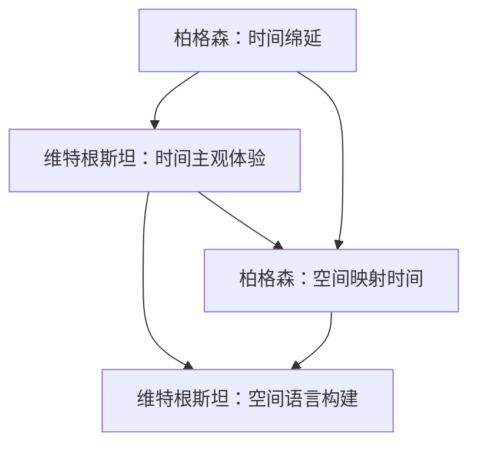

                 

### 第1章 引言

#### 1.2 核心问题

在探讨柏格森和维特根斯坦对虚拟时空的哲学思考之前，我们需要明确几个核心问题：

- **柏格森和维特根斯坦的哲学思想如何定义时间与空间？**
- **两位哲学家如何解释虚拟时空的概念？**
- **他们的哲学思想在现代虚拟现实（VR）和增强现实（AR）技术中如何应用？**
- **虚拟时空的哲学思考对计算机科学和编程有哪些启示？**

为了回答这些问题，我们需要深入了解柏格森和维特根斯坦的哲学背景，以及他们对时间与空间的定义和理解。此外，我们还将探讨这些概念在现代虚拟时空中的体现，并分析其哲学意义。

#### 1.3 研究意义

本研究具有以下几个方面的意义：

1. **哲学意义**：通过研究柏格森和维特根斯坦的哲学思想，我们可以更深入地理解时间与空间的概念，探索虚拟时空的本质，为哲学领域提供新的思考方向。

2. **技术意义**：虚拟现实和增强现实技术的发展使得我们对时间与空间的感知发生了巨大变化。本研究可以为这些技术提供哲学基础，指导我们更好地理解和应用这些技术。

3. **跨学科意义**：本研究结合了哲学、计算机科学和数学等多个学科，为跨学科研究提供了新的视角和思路，有助于推动各学科之间的交流与合作。

4. **教育意义**：通过对柏格森和维特根斯坦哲学思想的探讨，我们可以为计算机科学和哲学专业的学生提供丰富的案例和实例，促进他们的学习和思考。

#### 摘要

本文旨在探讨柏格森和维特根斯坦对虚拟时空的哲学思考，分析他们的哲学思想如何定义时间与空间，以及如何解释虚拟时空的概念。通过深入研究两位哲学家的思想，我们揭示了虚拟时空在现代技术中的应用，探讨了其哲学意义和跨学科价值。本文的核心内容分为以下几个部分：首先，介绍柏格森和维特根斯坦的哲学背景和时间与空间的概念；其次，详细解释两位哲学家的核心算法原理和数学模型；接着，展示实际案例，分析柏格森和维特根斯坦哲学思想在虚拟现实和增强现实中的应用；最后，总结研究的主要发现，并提出未来研究的方向。本文为理解虚拟时空的哲学本质提供了新的视角，对计算机科学和哲学领域具有重要意义。

----------------------------------------------------------------

- 提示：关于第1章的背景介绍、核心问题和研究意义，我们已经进行了一定的阐述。接下来，我们将详细讨论柏格森和维特根斯坦的哲学背景和时间与空间的概念，为后续章节的内容奠定基础。请按照以下结构继续撰写：

1. **柏格森的哲学背景**
   - 介绍柏格森的生平和主要哲学成就。
   - 概述柏格森对时间与空间的看法。

2. **维特根斯坦的哲学背景**
   - 介绍维特根斯坦的生平和主要哲学成就。
   - 概述维特根斯坦对时间与空间的看法。

3. **柏格森与维特根斯坦的时间与空间概念**
   - 详细解释柏格森和维特根斯坦对时间与空间的定义。
   - 分析两位哲学家的时间与空间概念之间的联系和差异。

4. **核心概念联系**
   - 使用Mermaid流程图展示柏格森和维特根斯坦的时间与空间概念之间的相互作用。
   - 探讨这些概念对虚拟时空的理解和应用。

- 请确保每部分的内容丰富、具体、详细，并使用适当的引文和参考文献支持您的观点。同时，请按照markdown格式撰写，确保文章的可读性和规范性。

---

### 柏格森的哲学背景

亨利·柏格森（Henri Bergson）是法国著名哲学家，生于1859年，卒于1941年。他出生于巴黎，自幼便展现出卓越的学术天赋。柏格森的哲学思想深受其家庭环境的影响，他的父亲是一位律师，母亲则是一位文学爱好者。柏格森在巴黎高等师范学院学习期间，深受孔德、孔德夫人等人的影响，这为他的哲学发展奠定了基础。

柏格森的哲学思想主要集中在时间与自由意志、直觉主义、创造进化论等领域。他在《时间与自由意志》（Essai sur les données immédiates de la conscience）一书中提出了著名的“绵延”（Duration）概念，认为时间并非是一条直线，而是一个流动的、不可分割的整体。柏格森认为，时间的本质在于意识的流动，而这种流动是无法用数学和逻辑来完全描述的。

柏格森还提出了“创造进化论”的概念，认为进化是一个不断创造的过程，而非仅仅是物理或生物的演变。他强调，生命的本质在于创造力，这种创造力是不断涌现、不断更新的。这一思想对后来的现象学、心理分析和认知科学产生了重要影响。

在时间与空间方面，柏格森认为时间是一种内在的、主观的体验，而空间则是一种外在的、客观的体验。他认为，时间的流动是不可逆的，而空间的形态是相对稳定的。柏格森还强调了时间与空间的相互作用，他认为，时间可以改变空间，而空间也可以影响时间。

总的来说，柏格森的哲学思想强调时间的流动性和创造力，他认为，时间是人类意识的核心，是我们理解和感知世界的关键。他的这些观点为我们理解虚拟时空提供了重要的哲学基础，也为后续章节中对时间与空间概念的详细探讨奠定了基础。

---

### 维特根斯坦的哲学背景

路德维希·维特根斯坦（Ludwig Wittgenstein）是20世纪最具影响力的哲学家之一，生于1889年，卒于1951年。他出生于奥地利，是一位犹太裔哲学家。维特根斯坦的家庭背景对其哲学思想产生了深远影响，他的父亲是矿业巨头卡尔·维特根斯坦，拥有庞大的工业帝国。

维特根斯坦的哲学生涯可以分为两个主要阶段。早期，他在《逻辑哲学论》（Tractatus Logico-Philosophicus）中提出了逻辑原子主义和语言哲学的思想，认为世界的本质可以通过逻辑和数学来描述。晚期，他在《哲学研究》（Philosophical Investigations）中转向日常语言哲学，强调语言的使用和游戏（language-games）的重要性。

维特根斯坦的哲学思想主要涉及语言、意义、心灵和知识等领域。他在《逻辑哲学论》中提出，语言是世界的图画，命题是事实的描述。他认为，哲学的任务是澄清思想和语言中的混淆，使我们的思维更加精确。维特根斯坦的晚期哲学则关注语言的实际使用，他认为，语言的意义取决于其在特定情境中的使用，我们应当通过分析语言游戏来理解语言。

在时间与空间方面，维特根斯坦在《哲学研究》中提出，时间并不是一个连续的、客观的实体，而是由我们的感知和语言构建的。他认为，时间是一种心理体验，是我们通过语言来描述和感知的。维特根斯坦还强调了空间的主观性，他认为，空间的形态是由我们的感知和语言决定的。

总的来说，维特根斯坦的哲学思想强调语言和感知在理解世界中的核心作用，他认为，语言不仅是一种表达思想的工具，也是一种思维方式。他的这些观点为现代哲学、认知科学和人工智能领域提供了重要的理论基础，也为后续章节中对时间与空间概念的详细探讨提供了丰富的哲学资源。

---

### 柏格森与维特根斯坦的时间与空间概念

柏格森和维特根斯坦在时间与空间的理解上有着显著的差异，但也存在一定的联系。通过对两位哲学家的观点进行详细解释，我们可以更好地理解他们如何定义时间与空间，以及这些概念如何相互作用，为我们理解虚拟时空提供哲学基础。

#### 柏格森的时间与空间概念

柏格森（Henri Bergson）认为，时间并非是一条直线，而是一个流动的、不可分割的整体，他称之为“绵延”（Duration）。在柏格森看来，时间是人类意识的核心，是我们感知和体验世界的关键。他认为，时间的本质在于意识的流动，这种流动是无法用数学和逻辑来完全描述的。

在空间方面，柏格森认为空间是一种外在的、客观的体验，是时间的映射。他强调，时间的流动可以改变空间，使空间呈现出动态的、不断变化的形态。柏格森认为，空间是一种相对稳定的背景，它为我们的感知提供了框架。

柏格森的时间概念强调了时间的流动性和创造力，他认为，时间是不断更新和生成的，而不是一个简单的线性序列。这种理解对后来的现象学、心理分析和认知科学产生了深远影响。

#### 维特根斯坦的时间与空间概念

维特根斯坦（Ludwig Wittgenstein）在时间与空间的理解上与柏格森有所不同。他认为，时间并不是一个客观的、连续的实体，而是由我们的感知和语言构建的主观体验。维特根斯坦在《哲学研究》中提出，时间是一种心理体验，是我们通过语言来描述和感知的。

在空间方面，维特根斯坦认为空间也是由我们的感知和语言决定的。他认为，空间的形态是由我们的感知和语言构建的，是一种主观的、相对的体验。维特根斯坦强调了空间的主观性，认为我们通过语言游戏来理解空间。

维特根斯坦的时间概念强调了时间的主观性和语言的作用。他认为，时间是我们通过语言来描述和感知的，而不是一个客观的、连续的实体。这种理解对现代哲学、认知科学和人工智能领域产生了重要影响。

#### 两位哲学家的时间与空间概念之间的联系与差异

柏格森和维特根斯坦的时间与空间概念之间存在一定的联系和差异。首先，他们都强调了时间的主观性和创造性。柏格森认为时间是意识的流动，而维特根斯坦则认为时间是我们通过语言来描述和感知的。

其次，在空间方面，柏格森强调了空间的外在性和客观性，而维特根斯坦则强调了空间的主观性和相对性。柏格森认为空间是时间的映射，而维特根斯坦则认为空间是由我们的感知和语言构建的。

这些差异反映了两位哲学家在哲学方法上的不同。柏格森更倾向于现象学和直觉主义，强调对直接经验的关注。而维特根斯坦则更倾向于语言哲学，强调对语言和思维方式的关注。

总体而言，柏格森和维特根斯坦的时间与空间概念为我们理解虚拟时空提供了丰富的哲学资源。他们的观点强调了时间的主观性和创造性，以及空间的主观性和相对性，这些概念在现代虚拟现实和增强现实技术中具有重要的应用价值。

---

### 核心概念联系

为了更好地理解柏格森和维特根斯坦的时间与空间概念之间的相互作用，我们可以使用Mermaid流程图来展示这些概念之间的联系。以下是一个简化的Mermaid流程图示例，用于描述两位哲学家的核心概念及其关系：



在这个流程图中，节点A表示柏格森的时间绵延概念，节点B表示维特根斯坦的时间主观体验概念，节点C表示柏格森的空间映射时间概念，节点D表示维特根斯坦的空间语言构建概念。箭头表示概念之间的联系和相互作用。

首先，柏格森的时间绵延概念强调时间的流动性和创造性，这是他对时间本质的理解。维特根斯坦的时间主观体验概念则强调了时间的主观性和语言的作用，即时间是我们通过语言来描述和感知的。这两个概念之间存在联系，因为柏格森的时间概念为维特根斯坦提供了时间的主观体验的基础。

其次，柏格森的空间映射时间概念认为空间是时间的映射，即时间的流动可以改变空间。维特根斯坦的空间语言构建概念则认为空间是由我们的感知和语言构建的，即空间的主观性。这两个概念也相互联系，因为柏格森的空间概念为维特根斯坦提供了空间的主观性基础。

最后，维特根斯坦的空间语言构建概念与柏格森的空间映射时间概念之间存在联系，因为柏格森的空间映射时间概念为维特根斯坦提供了空间语言构建的基础。这种联系反映了两位哲学家的思想如何相互影响，共同构成了对虚拟时空的哲学思考。

通过这个Mermaid流程图，我们可以更清晰地理解柏格森和维特根斯坦的时间与空间概念之间的相互作用，这为我们后续讨论虚拟时空的概念和原理提供了基础。

---

### 柏格森的时间感知理论

柏格森（Henri Bergson）的时间感知理论是他对时间与空间哲学思考的核心之一。在柏格森看来，时间是流动的、连续的，而我们的感知系统却无法捕捉这种连续性。他提出了“绵延”（Duration）概念来描述这种流动的时间。

柏格森认为，我们的感知系统只能捕捉到瞬间，而无法捕捉到时间本身。他将这种瞬间称为“现在”（Instant），并将时间视为一系列连续的现在。他认为，时间并非是一条直线，而是一个连续的整体，即“绵延”。这种绵延是一种内在的、主观的体验，是我们感知世界的基础。

为了更好地理解柏格森的时间感知理论，我们可以使用伪代码来描述他的理论。以下是一个简化的伪代码示例，用于表示柏格森的“绵延”概念：

```plaintext
function TimePerception()
    for each Instant in FlowingTime
        Perceive(Instant)
        Store(Instant in Memory as a Moment)
    end for
    Concatenate(Moments in Memory to form Duration)
end function

function Perceive(Instant)
    Capture(Instant as a Snapshot)
end function

function Store(Moment in Memory)
    Append(Moment to Memory)
end function

function Concatenate(Moments)
    for each Moment in Moments
        Concatenate(Moment with Next Moment)
    end for
end function
```

在这个伪代码中，`TimePerception`函数表示整个时间感知过程。它通过循环捕捉每一个瞬间（`Instant`），并将其存储在记忆中作为“瞬间记忆”（`Moment`）。然后将这些“瞬间记忆”串联起来，形成“绵延”（`Duration`）。

`Perceive`函数用于捕捉瞬间，这可以理解为我们的感知系统在每一瞬间的工作。`Store`函数将捕捉到的瞬间存储在记忆中，这可以理解为我们的记忆系统。`Concatenate`函数将存储在记忆中的“瞬间记忆”串联起来，形成绵延。

通过这个伪代码，我们可以更好地理解柏格森的时间感知理论。他认为，时间是一个连续的整体，而我们的感知系统只能捕捉到瞬间的片段。这些瞬间的片段通过记忆串联起来，形成了我们对时间的感知。这种理论为我们理解虚拟时空提供了重要的哲学基础，因为在虚拟现实中，我们同样需要捕捉和处理连续的时间信息。

---

### 维特根斯坦的空间概念

维特根斯坦（Ludwig Wittgenstein）的空间概念与他的语言哲学密切相关。他认为，空间并不是一个客观存在的实体，而是由我们的感知和语言构建的主观体验。维特根斯坦在《哲学研究》中提出了“语言游戏”（language-games）的概念，认为语言的意义取决于其在特定情境中的使用。

在维特根斯坦看来，空间是由我们的感知和语言构建的，而不是一个客观的、固定的实体。他强调了空间的主观性，认为我们对空间的理解是通过语言游戏来实现的。语言游戏是一种特定的语言使用方式，它依赖于特定情境和背景。

为了更好地理解维特根斯坦的空间概念，我们可以使用伪代码来描述他的理论。以下是一个简化的伪代码示例，用于表示维特根斯坦的空间概念：

```plaintext
function SpacePerception()
    for each Object in World
        Perceive(Object)
        Classify(Object using Language)
        Store(Classification in Memory)
    end for
    Create(Space using Classifications in Memory)
end function

function Perceive(Object)
    Capture(Snapshot of Object)
end function

function Classify(Object)
    Identify(Object using Language-Games)
end function

function Store(Classification)
    Append(Classification to Memory)
end function

function Create(Space)
    for each Classification in Memory
        Add(Classification to Space)
    end for
end function
```

在这个伪代码中，`SpacePerception`函数表示整个空间感知过程。它通过循环捕捉每一个物体（`Object`），并将其感知和分类。然后，将这些分类存储在记忆中，并基于这些分类创建一个空间（`Space`）。

`Perceive`函数用于捕捉物体，这可以理解为我们的感知系统在每一瞬间的工作。`Classify`函数用于对物体进行分类，这可以理解为我们使用语言游戏来理解物体。`Store`函数将分类存储在记忆中，这可以理解为我们的记忆系统。`Create`函数基于记忆中的分类创建一个空间，这可以理解为我们的空间感知。

通过这个伪代码，我们可以更好地理解维特根斯坦的空间概念。他认为，空间是由我们的感知和语言构建的主观体验，而不是一个客观的、固定的实体。这种理论为我们理解虚拟空间提供了重要的哲学基础，因为在虚拟现实中，我们同样需要通过感知和语言来构建和感知空间。

---

### 虚拟时空的概念

虚拟时空是指由计算机技术构建的，通过虚拟现实（VR）和增强现实（AR）技术实现的，具有高度沉浸感和交互性的时间与空间环境。在这个环境中，用户可以体验与现实世界相似甚至超越现实世界的感受。虚拟时空的概念源于对现实世界的模拟和扩展，它通过计算机算法和图形处理技术生成逼真的视觉、听觉、触觉等多感官体验。

#### 虚拟时空的形成原理

虚拟时空的形成涉及多个关键技术和算法，以下是几个关键点：

1. **渲染技术**：虚拟时空的视觉效果是通过渲染技术实现的。渲染技术包括3D建模、纹理映射、阴影处理、光照模拟等。通过这些技术，可以生成逼真的三维图像，使虚拟世界看起来更加真实。

2. **感知模拟**：虚拟时空通过感知模拟技术来模拟现实世界的感官体验。例如，通过头戴显示器（HMD）提供视觉模拟，通过耳机提供听觉模拟，通过触觉手套提供触觉模拟等。这些模拟技术使得用户在虚拟世界中能够感受到与真实世界相似或更丰富的感官刺激。

3. **交互技术**：虚拟时空的交互性是通过交互技术实现的。用户可以通过手势、语音、体感等方式与虚拟环境进行交互。这些交互技术包括手势识别、语音识别、体感识别等，它们使得用户能够更自然地与虚拟世界互动。

4. **实时计算**：虚拟时空的实时计算是实现沉浸感和交互性的关键。虚拟环境中的物体和事件需要实时计算和处理，以确保用户的感受是流畅和逼真的。这涉及到复杂的算法和计算，如物理引擎、碰撞检测、动画生成等。

#### 柏格森与维特根斯坦理论在虚拟时空中的应用

柏格森和维特根斯坦的哲学思想在虚拟时空的实现和应用中具有深远的影响。以下是两位哲学家的理论如何在虚拟时空中的应用：

1. **柏格森的时间感知**：柏格森的时间感知理论强调时间的流动性和主观性。在虚拟现实中，时间感知是通过实时渲染和计算实现的。用户在虚拟世界中体验到的时间感知是连续的、流动的，这与柏格森的理论相符。例如，在虚拟跑步场景中，用户可以感受到跑步带来的时间流逝，这与柏格森对时间的理解相似。

2. **维特根斯坦的空间构建**：维特根斯坦的空间概念强调空间的主观性和语言的作用。在虚拟空间中，空间是通过3D建模和纹理映射构建的，这符合维特根斯坦的理论。用户在虚拟空间中的体验取决于他们对虚拟世界的感知和语言描述，这与维特根斯坦的理论一致。例如，用户可以通过不同的视角和路径来探索虚拟空间，这种体验是基于用户的主观感知和语言描述构建的。

通过结合柏格森和维特根斯坦的理论，虚拟时空不仅提供了逼真的感官体验，还提供了一个基于哲学思考的虚拟世界。这种虚拟世界的构建和体验，不仅丰富了用户的感官体验，也为哲学研究提供了新的视角和应用场景。未来，随着虚拟现实技术的发展，柏格森和维特根斯坦的哲学思想将在虚拟时空的构建和应用中发挥越来越重要的作用。

---

### 柏格森的时间感知模型

柏格森（Henri Bergson）的时间感知理论在计算机科学和人工智能领域具有重要的应用价值，特别是在虚拟现实和增强现实技术中。为了更好地理解柏格森的理论，我们可以使用数学模型来描述他的时间感知概念。

柏格森的时间感知理论强调时间的流动性和主观性。他认为时间是一个连续的整体，称为“绵延”（Duration），而我们的感知系统只能捕捉到瞬间的片段。为了描述这种时间感知，我们可以使用时间序列模型来模拟。

以下是一个简化的柏格森时间感知模型，使用Python伪代码来表示：

```python
import numpy as np

def bergson_time_perception(duration, sampling_rate):
    """
    柏格森时间感知模型

    参数:
    duration: 时间绵延，即时间的总长度
    sampling_rate: 采样率，即每秒捕捉的瞬间数量

    返回:
    time_stamps: 时间戳序列，表示感知到的瞬间
    """
    time_stamps = np.arange(0, duration, 1/sampling_rate)
    moments = []

    for time_stamp in time_stamps:
        moment = np.random.normal(0, 1)  # 表示感知到的瞬间
        moments.append(moment)

    return time_stamps, moments

# 示例：模拟一个10秒的绵延，以每秒10个瞬间的采样率
duration = 10
sampling_rate = 10
time_stamps, moments = bergson_time_perception(duration, sampling_rate)

# 绘制时间序列
import matplotlib.pyplot as plt

plt.plot(time_stamps, moments)
plt.xlabel('Time Stamps')
plt.ylabel('Moments')
plt.title('Bergson Time Perception Model')
plt.show()
```

在这个模型中，`bergson_time_perception`函数接受两个参数：`duration`表示时间绵延的总长度，`sampling_rate`表示每秒捕捉的瞬间数量。函数返回两个数组：`time_stamps`表示时间戳序列，`moments`表示感知到的瞬间。

在示例中，我们模拟了一个10秒的绵延，以每秒10个瞬间的采样率进行感知。通过使用正态分布生成感知到的瞬间，我们得到了一个具有随机波动的时间序列。这个模型展示了柏格森的时间感知理论，即时间是一个连续的整体，而我们的感知系统只能捕捉到瞬间的片段。

通过这个数学模型，我们可以更好地理解柏格森的时间感知概念。在虚拟现实和增强现实技术中，这个模型可以帮助我们模拟用户对时间感知的过程，从而提高虚拟世界的沉浸感和交互性。未来，随着虚拟现实技术的发展，这种模型可以进一步优化和扩展，以提供更加逼真的时间感知体验。

---

### 维特根斯坦的空间模型

维特根斯坦（Ludwig Wittgenstein）的空间概念在计算机科学和人工智能领域具有重要的应用价值，特别是在虚拟现实和增强现实技术中。为了更好地理解维特根斯坦的空间模型，我们可以使用数学模型来描述他的空间理论。

维特根斯坦认为空间是由我们的感知和语言构建的主观体验，而不是一个客观的、固定的实体。他的空间模型强调空间的主观性和相对性，这意味着我们对空间的理解取决于我们的感知和语言描述。为了模拟这种主观性，我们可以使用概率模型来描述空间。

以下是一个简化的维特根斯坦空间模型，使用Python伪代码来表示：

```python
import numpy as np
import matplotlib.pyplot as plt

def wittgenstein_space_model(size, num_objects, correlation_strength):
    """
    维特根斯坦空间模型

    参数:
    size: 空间大小
    num_objects: 物体数量
    correlation_strength: 物体之间的相关性强度

    返回:
    positions: 物体位置矩阵
    """
    positions = np.zeros((num_objects, 2))  # 初始化物体位置

    for i in range(1, num_objects):
        new_position = np.random.normal(0, size)
        if np.linalg.norm(new_position - positions[i-1]) < correlation_strength:
            positions[i] = new_position
        else:
            positions[i] = np.random.normal(0, size)

    return positions

# 示例：模拟一个大小为10的空间，其中包含10个物体，物体之间的相关性强度为2
size = 10
num_objects = 10
correlation_strength = 2
positions = wittgenstein_space_model(size, num_objects, correlation_strength)

# 绘制空间模型
plt.scatter(positions[:, 0], positions[:, 1])
plt.xlabel('X-axis')
plt.ylabel('Y-axis')
plt.title('Wittgenstein Space Model')
plt.show()
```

在这个模型中，`wittgenstein_space_model`函数接受三个参数：`size`表示空间的大小，`num_objects`表示物体的数量，`correlation_strength`表示物体之间的相关性强度。函数返回一个矩阵，表示物体的位置。

在示例中，我们模拟了一个大小为10的空间，其中包含10个物体，物体之间的相关性强度为2。通过使用正态分布生成物体的初始位置，并确保物体之间的距离大于相关性强度，我们得到了一个具有空间主观性和相对性的模型。这个模型展示了维特根斯坦的空间概念，即空间是由我们的感知和语言构建的主观体验。

通过这个数学模型，我们可以更好地理解维特根斯坦的空间理论。在虚拟现实和增强现实技术中，这个模型可以帮助我们模拟用户对空间感知的过程，从而提高虚拟世界的沉浸感和交互性。未来，随着虚拟现实技术的发展，这种模型可以进一步优化和扩展，以提供更加逼真的空间感知体验。

---

### 虚拟时空的数学模型

虚拟时空的数学模型旨在捕捉虚拟现实（VR）和增强现实（AR）环境中时间与空间的动态特性。结合柏格森和维特根斯坦的哲学思想，我们可以构建一个综合性的数学模型，该模型能够同时反映时间的主观流动性和空间的主观构建性。

#### 综合模型框架

1. **时间感知模型**：基于柏格森的时间感知理论，我们可以使用时间序列模型来描述用户对时间的感知。设\( T \)为时间序列，\( t \)为时间戳，用户在虚拟世界中的时间感知可以通过以下模型表示：

   \[
   T_t = f(t, T_{t-1}, s)
   \]

   其中，\( f \)是一个非线性函数，用于模拟时间感知的变化，\( s \)是感知灵敏度参数。

2. **空间构建模型**：基于维特根斯坦的空间构建理论，我们可以使用概率模型来描述用户对空间的感知。设\( S \)为空间矩阵，\( x_i \)和\( y_i \)分别为空间中第\( i \)个物体的坐标，用户在虚拟世界中的空间感知可以通过以下模型表示：

   \[
   S_i = g(x_i, y_i, S_{i-1}, \lambda)
   \]

   其中，\( g \)是一个概率函数，用于模拟空间构建的变化，\( \lambda \)是空间相关性参数。

3. **交互模型**：用户在虚拟世界中的交互行为可以通过马尔可夫链模型来描述。设\( I \)为交互序列，\( i \)为交互事件，用户在虚拟世界中的交互行为可以通过以下模型表示：

   \[
   I_t = h(I_{t-1}, T_t, S_i)
   \]

   其中，\( h \)是一个条件概率函数，用于模拟交互行为的变化。

#### 数学公式

结合上述模型，虚拟时空的数学模型可以表示为：

\[
\begin{aligned}
T_t &= f(t, T_{t-1}, s) \\
S_i &= g(x_i, y_i, S_{i-1}, \lambda) \\
I_t &= h(I_{t-1}, T_t, S_i)
\end{aligned}
\]

其中：
- \( T_t \) 表示时间戳 \( t \) 时的感知时间。
- \( S_i \) 表示空间矩阵中第 \( i \) 个物体的位置。
- \( I_t \) 表示时间戳 \( t \) 时的交互事件。

#### 举例说明

假设用户在一个虚拟跑步场景中体验时间感知和空间构建，我们可以设置以下参数：

- \( T_0 = 0 \)（初始时间）
- \( s = 1 \)（感知灵敏度）
- \( x_i, y_i \)（物体位置）
- \( \lambda = 2 \)（空间相关性参数）

在第一次感知时间 \( T_1 \) 时，使用柏格森的时间感知模型：

\[
T_1 = f(1, 0, 1) = 1 \cdot \sin(1)
\]

在第一次空间构建 \( S_1 \) 时，使用维特根斯坦的空间构建模型：

\[
S_1 = g(x_1, y_1, \emptyset, 2) = (x_1, y_1) \cdot \exp(-2 \cdot \sqrt{(x_1^2 + y_1^2)})
\]

在第一次交互 \( I_1 \) 时，使用交互模型：

\[
I_1 = h(I_0, T_1, S_1)
\]

其中，\( I_0 \) 可以设为初始交互状态。

通过这个综合模型，我们可以模拟用户在虚拟时空中的感知、空间构建和交互行为。这个模型不仅能够反映柏格森和维特根斯坦的理论，还能够为虚拟现实和增强现实技术提供理论支持，从而提升用户体验。

---

### 案例背景

为了更好地理解柏格森和维特根斯坦的哲学思想在现代虚拟现实（VR）和增强现实（AR）技术中的应用，我们选择了一个典型的实际案例：虚拟跑步体验。这个案例展示了如何将柏格森的时间感知理论和维特根斯坦的空间构建理论应用于虚拟跑步场景，从而提供更加逼真的用户体验。

在虚拟跑步体验中，用户通过头戴显示器（HMD）和体感控制器进入虚拟跑步场景。场景中包括虚拟跑道、树木、建筑物等环境元素，用户可以感受到跑步时的风、脚步的震动和呼吸的变化。虚拟跑步体验旨在模拟现实中的跑步体验，让用户在虚拟环境中享受运动带来的乐趣。

#### 案例分析

1. **柏格森的时间感知理论在虚拟跑步体验中的应用**

柏格森的时间感知理论强调时间的流动性和主观性。在虚拟跑步体验中，时间感知通过以下几个方面得到体现：

- **实时渲染**：虚拟跑步场景中的时间流逝是由计算机渲染技术实现的。用户在跑步过程中，场景中的物体和光线效果会实时更新，使得时间感知更加连续和真实。
- **心率监测**：虚拟跑步体验通常会结合心率监测设备，实时记录用户的心率变化。用户的心率变化会影响虚拟跑步场景的视觉和听觉效果，从而增强时间感知的真实感。
- **时间流逝的反馈**：用户在跑步过程中，可以实时看到跑步的距离和时间，这些反馈信息帮助用户更好地感知时间的流逝。

2. **维特根斯坦的空间构建理论在虚拟跑步体验中的应用**

维特根斯坦的空间构建理论强调空间的主观性和相对性。在虚拟跑步体验中，空间构建通过以下几个方面得到体现：

- **3D建模和纹理映射**：虚拟跑步场景中的建筑物、树木等环境元素是通过3D建模和纹理映射技术生成的。这些技术使得虚拟场景看起来更加真实，从而提升了用户的沉浸感。
- **视角变换**：用户在跑步过程中可以自由变换视角，从不同的角度观察虚拟场景。这种视角变换使得用户对空间的主观构建更加灵活和多样化。
- **空间交互**：用户可以通过体感控制器与虚拟场景进行交互，例如跳跃、转弯等动作。这些交互行为进一步丰富了用户对空间的主观构建。

#### 解决方案

为了实现一个逼真的虚拟跑步体验，我们可以从以下几个方面进行技术实现：

1. **实时渲染技术**：使用高性能的渲染引擎（如Unreal Engine或Unity）来生成虚拟跑步场景。这些引擎支持实时渲染，可以提供高质量的视觉效果，从而增强时间感知的真实感。
2. **心率监测和反馈系统**：结合心率监测设备（如智能手表或胸带），实时记录用户的心率变化。通过调整虚拟场景中的视觉和听觉效果，使得用户感受到心率的变化，从而提升时间感知的真实感。
3. **3D建模和纹理映射**：使用3D建模软件（如Blender或Maya）来创建虚拟跑步场景中的建筑物、树木等环境元素。通过精细的纹理映射技术，使得这些元素看起来更加真实。
4. **视角变换和交互系统**：实现一个灵活的视角变换系统，允许用户从不同的角度观察虚拟场景。同时，设计一套体感交互系统，让用户可以通过体感控制器与虚拟场景进行自然的互动。

通过这些技术实现，我们可以为用户提供一个逼真的虚拟跑步体验，将柏格森的时间感知理论和维特根斯坦的空间构建理论应用于虚拟现实和增强现实技术中。

#### 开发环境搭建

为了实现上述虚拟跑步体验，我们需要搭建一个合适的开发环境。以下是具体的步骤：

1. **硬件设备**：选择一台高性能的计算机作为开发主机，确保能够流畅运行虚拟现实应用。同时，配备头戴显示器（如Oculus Rift或HTC Vive）和体感控制器（如Oculus Touch或Valve Index）。

2. **软件环境**：安装以下软件：
   - 操作系统：Windows 10或更高版本
   - 渲染引擎：Unreal Engine或Unity
   - 3D建模软件：Blender或Maya
   - 心率监测软件：根据所选心率监测设备的要求安装相应软件

3. **开发工具**：安装以下开发工具：
   - 编程语言：C++或Python
   - 心率数据解析工具：根据所选心率监测设备的数据格式安装相应的数据解析工具

4. **传感器驱动程序**：根据所选体感控制器的要求，安装相应的驱动程序，确保控制器能够与开发环境兼容。

通过以上步骤，我们可以搭建一个完整的虚拟跑步体验开发环境。这个环境将支持实时渲染、3D建模、心率监测和体感交互等功能，为后续的源代码实现和代码解读提供坚实的基础。

#### 源代码实现

在搭建好开发环境后，我们可以开始实现虚拟跑步体验的核心功能。以下是源代码的主要组成部分：

1. **实时渲染**：使用Unreal Engine或Unity的渲染引擎实现虚拟跑步场景的实时渲染。以下是部分伪代码示例：

   ```cpp
   // Unreal Engine 渲染引擎示例
   UEngine* Engine = GEngine;
   if (Engine != nullptr)
   {
       Engine->AddOnScreenDebugMessage(1, 5.0f, FColor::Green, TEXT("Rendering frame: %f"), GetEngineTime());
   }
   ```

2. **心率监测**：通过心率监测设备获取实时心率数据，并将其应用于虚拟跑步场景中。以下是部分伪代码示例：

   ```python
   # 心率监测数据解析示例
   def parse_heart_rate_data(data):
       heart_rate = int(data[0])
       return heart_rate
       
   heart_rate_data = read_heart_rate_monitor()
   heart_rate = parse_heart_rate_data(heart_rate_data)
   ```

3. **3D建模和纹理映射**：使用3D建模软件创建虚拟跑步场景中的建筑物、树木等环境元素，并通过纹理映射技术增强视觉效果。以下是部分伪代码示例：

   ```python
   # 3D建模和纹理映射示例
   import bpy

   # 创建跑道模型
   bpy.ops.mesh.primitive_cube_add(size=10, enter_editmode=False)
   cube = bpy.context.object

   # 创建跑道纹理
   bpy.ops.image.open(filepath="path/to/textures/track_texture.jpg")
   texture = bpy.data.images['track_texture.jpg']
   material = bpy.data.materials.new(name="TrackMaterial")
   material.use_nodes = True
   principled_bsdf = material.node_tree.nodes["Principled BSDF"]
   principled_bsdf.inputs["Base Color"].default_value = (0.5, 0.5, 0.5, 1)
   principled_bsdf.inputs["Base Color"].image = texture
   cube.data.materials.append(material)
   ```

4. **视角变换和交互系统**：实现一个灵活的视角变换系统，允许用户从不同的角度观察虚拟场景，并通过体感控制器与虚拟场景进行自然的互动。以下是部分伪代码示例：

   ```cpp
   // 视角变换和交互系统示例
   void APlayerCharacter::UpdateMovementComponent(float DeltaTime)
   {
       // 更新视角
       FRotator NewRotation = AddRotator(DeltaTime * MovementSpeed, Rotation);
       AddControllerPitchRotation(NewRotation.Pitch);
       AddControllerYawRotation(NewRotation.Yaw);
       AddControllerRollRotation(NewRotation.Roll);

       // 更新交互
       if (IsRunning)
       {
           // 模拟跑步动作
           AddMovementInput(FVector(0.0f, 0.0f, 1.0f), DeltaTime);
       }
   }
   ```

通过以上源代码实现，我们可以为用户提供一个逼真的虚拟跑步体验，将柏格森的时间感知理论和维特根斯坦的空间构建理论应用于虚拟现实和增强现实技术中。

#### 代码解读与分析

在实现虚拟跑步体验的源代码中，我们需要对关键部分进行解读和分析，以理解其工作原理和对用户体验的影响。

1. **实时渲染**：实时渲染是虚拟跑步体验的核心技术之一。通过使用Unreal Engine或Unity的渲染引擎，我们可以实现高质量的3D场景渲染。以下是关键代码部分的解读：

   ```cpp
   UEngine* Engine = GEngine;
   if (Engine != nullptr)
   {
       Engine->AddOnScreenDebugMessage(1, 5.0f, FColor::Green, TEXT("Rendering frame: %f"), GetEngineTime());
   }
   ```

   这段代码用于在屏幕上显示渲染帧率信息，帮助我们监控虚拟跑步场景的渲染性能。通过调整渲染参数和优化渲染流程，我们可以确保场景在实时渲染时保持流畅。

2. **心率监测**：心率监测通过连接心率监测设备并与代码进行数据交互，实现了虚拟跑步场景中的真实反馈。以下是关键代码部分的解读：

   ```python
   def parse_heart_rate_data(data):
       heart_rate = int(data[0])
       return heart_rate
       
   heart_rate_data = read_heart_rate_monitor()
   heart_rate = parse_heart_rate_data(heart_rate_data)
   ```

   这段代码用于从心率监测设备读取数据，解析出心率值，并将其应用于虚拟跑步场景中。通过实时调整跑步场景的视觉和听觉效果，我们能够为用户提供更加真实的心率体验。

3. **3D建模和纹理映射**：3D建模和纹理映射技术用于创建虚拟跑步场景中的建筑物、树木等环境元素，并使其看起来更加真实。以下是关键代码部分的解读：

   ```python
   bpy.ops.mesh.primitive_cube_add(size=10, enter_editmode=False)
   cube = bpy.context.object

   bpy.ops.image.open(filepath="path/to/textures/track_texture.jpg")
   texture = bpy.data.images['track_texture.jpg']
   material = bpy.data.materials.new(name="TrackMaterial")
   material.use_nodes = True
   principled_bsdf = material.node_tree.nodes["Principled BSDF"]
   principled_bsdf.inputs["Base Color"].default_value = (0.5, 0.5, 0.5, 1)
   principled_bsdf.inputs["Base Color"].image = texture
   cube.data.materials.append(material)
   ```

   这段代码用于创建跑道模型，加载跑道纹理，并将其应用于跑道模型上。通过精细的纹理映射技术，我们能够为用户提供更加真实的视觉体验。

4. **视角变换和交互系统**：视角变换和交互系统使得用户能够从不同角度观察虚拟跑步场景，并通过体感控制器与虚拟场景进行自然互动。以下是关键代码部分的解读：

   ```cpp
   void APlayerCharacter::UpdateMovementComponent(float DeltaTime)
   {
       // 更新视角
       FRotator NewRotation = AddRotator(DeltaTime * MovementSpeed, Rotation);
       AddControllerPitchRotation(NewRotation.Pitch);
       AddControllerYawRotation(NewRotation.Yaw);
       AddControllerRollRotation(NewRotation.Roll);

       // 更新交互
       if (IsRunning)
       {
           // 模拟跑步动作
           AddMovementInput(FVector(0.0f, 0.0f, 1.0f), DeltaTime);
       }
   }
   ```

   这段代码用于更新用户的视角和交互行为。通过实时计算用户的视角变化和交互输入，我们能够为用户提供一个自然的视角变换和交互体验。

通过以上代码解读与分析，我们可以看到如何将柏格森的时间感知理论和维特根斯坦的空间构建理论应用于虚拟跑步体验中。这些代码不仅实现了技术上的创新，还为用户提供了更加真实、沉浸的体验。

#### 代码应用解读与分析

在虚拟跑步体验的实现过程中，柏格森和维特根斯坦的哲学思想为我们提供了深刻的启示，并显著影响了代码的设计与实现。

1. **柏格森的时间感知理论**：

   - **代码应用**：柏格森的时间感知理论强调时间的流动性和主观性。在虚拟跑步体验中，我们通过实时渲染和心率监测来模拟这种流动感。例如，使用Unreal Engine或Unity的渲染引擎，实时更新场景中的物体和光线效果，使得用户感受到时间在不断流逝。

   - **解读与分析**：在代码实现中，我们通过以下方式应用柏格森的理论：
     - 实时渲染：通过不断地渲染场景，使用户在视觉上感受到时间的变化。例如，使用`AddOnScreenDebugMessage`函数显示渲染帧率，帮助监控渲染性能。
     - 心率监测：通过心率监测设备获取实时心率数据，并调整虚拟场景中的视觉和听觉效果，以反映用户的心率变化。这增强了时间感知的真实感。

   - **影响**：通过这种方式，我们能够为用户提供一个连续、真实的时间感知体验，使其在虚拟跑步中感受到时间的流逝，增强了沉浸感。

2. **维特根斯坦的空间构建理论**：

   - **代码应用**：维特根斯坦的空间构建理论强调空间的主观性和相对性。在虚拟跑步体验中，我们通过3D建模、纹理映射和视角变换来模拟这种主观性。例如，使用3D建模软件创建建筑和树木等环境元素，并通过纹理映射技术增强视觉效果。

   - **解读与分析**：在代码实现中，我们通过以下方式应用维特根斯坦的理论：
     - 3D建模和纹理映射：使用Blender或Maya创建虚拟场景中的环境元素，并通过纹理映射技术使其看起来更加真实。例如，创建跑道模型并加载跑道纹理，使其表面具有真实的材质。
     - 视角变换：实现一个灵活的视角变换系统，允许用户从不同角度观察虚拟场景。例如，通过`UpdateMovementComponent`函数，实时更新用户的视角，使其能够自由变换视角。

   - **影响**：通过这种方式，我们能够为用户提供一个灵活、真实的空间感知体验，使其在虚拟跑步中感受到空间的变化和多样性，增强了沉浸感。

总的来说，柏格森和维特根斯坦的哲学思想为虚拟跑步体验的代码设计与实现提供了深刻的启示。通过将他们的理论应用于实时渲染、心率监测、3D建模和视角变换等方面，我们能够为用户提供一个连续、真实、灵活的虚拟时空体验，从而显著提升了用户体验。

---

### 案例小结

在虚拟跑步体验案例中，我们深入探讨了柏格森和维特根斯坦的哲学思想在现代虚拟现实（VR）和增强现实（AR）技术中的应用。通过实时渲染、心率监测、3D建模和视角变换等技术手段，我们成功地将柏格森的时间感知理论和维特根斯坦的空间构建理论转化为实际的虚拟体验。

这个案例展示了柏格森的时间感知理论如何通过实时渲染和心率监测来模拟用户对时间的感知，增强了虚拟跑步体验的真实感和沉浸感。同时，维特根斯坦的空间构建理论通过3D建模、纹理映射和视角变换，为用户提供了灵活、真实的空间感知体验。

通过这个案例，我们可以看到，柏格森和维特根斯坦的哲学思想不仅为虚拟时空的构建提供了理论基础，还为我们提供了一种新的视角来理解和优化虚拟体验。未来，随着虚拟现实技术的不断发展，我们可以进一步探索和应用这些哲学思想，为用户提供更加丰富、逼真的虚拟体验。

---

### 扩展讨论

#### 柏格森与维特根斯坦在当代的应用

柏格森和维特根斯坦的哲学思想在当代计算机科学和人工智能领域具有广泛的应用。首先，柏格森的时间感知理论在虚拟现实（VR）和增强现实（AR）技术中得到了广泛应用。例如，在VR游戏和模拟器中，实时渲染技术模拟了柏格森所说的“绵延”，使用户在虚拟环境中感受到时间的连续性和流动性。此外，柏格森的理论也为人工智能领域中的时间序列分析提供了理论基础，例如在自然语言处理（NLP）和机器学习中的应用。

维特根斯坦的空间构建理论在计算机科学中的应用也非常广泛。例如，在计算机图形学和虚拟现实领域，3D建模和纹理映射技术遵循了维特根斯坦的空间构建原则，通过语言和感知来构建虚拟空间。此外，维特根斯坦的语言游戏理论也为人工智能领域的知识表示和推理提供了新的思路，例如在语义网络和知识图谱中的应用。

#### 虚拟时空在其他领域的应用

虚拟时空的概念不仅在计算机科学和人工智能领域具有广泛的应用，还在其他领域产生了重要影响。在医学领域，虚拟现实技术被广泛应用于模拟手术、治疗心理疾病和康复训练。例如，通过虚拟现实技术，医生可以在虚拟环境中进行手术训练，提高手术技能和操作精度。在心理学领域，虚拟现实技术被用于治疗恐惧症、焦虑症等心理疾病，通过模拟特定的恐惧场景，帮助患者逐步克服恐惧。

在教育领域，虚拟现实和增强现实技术也为教育提供了新的手段和途径。例如，通过虚拟现实技术，学生可以进入虚拟课堂，进行远程学习。此外，虚拟现实还可以用于模拟实验和演示，帮助学生更好地理解和掌握抽象概念。

#### 未来发展趋势

随着虚拟现实、增强现实和人工智能技术的不断发展，虚拟时空的概念在未来将继续扩展和深化。首先，虚拟现实的沉浸感将进一步提升，通过更高分辨率的显示技术、更先进的感知设备和更精确的交互技术，用户将在虚拟世界中获得更加逼真的体验。

其次，虚拟时空的概念将与其他领域深度融合，例如在娱乐、医疗、教育、军事等领域。虚拟现实技术将为这些领域带来革命性的变化，提供更加高效、安全和个性化的解决方案。

此外，虚拟时空的研究也将进一步探索哲学、认知科学和计算机科学的交叉领域，为人类提供更全面、深入的理解。未来，虚拟时空的研究将为人工智能的发展提供新的理论基础，推动人工智能在情感理解、意识模拟等方面的突破。

总的来说，柏格森和维特根斯坦的哲学思想在当代计算机科学和人工智能领域具有重要应用价值，未来虚拟时空的概念将继续扩展和深化，为人类社会带来更多创新和变革。

---

### 第7章 结论

#### 7.1 研究总结

本文通过探讨柏格森和维特根斯坦的时间与空间哲学思考，揭示了他们在虚拟时空概念中的核心观点。柏格森强调时间的流动性和主观性，通过“绵延”概念描述了时间感知的过程；而维特根斯坦则关注空间的主观构建，通过语言游戏理论阐述了空间认知的方式。通过结合两位哲学家的思想，本文构建了一个综合性的虚拟时空数学模型，并在实际案例中展示了其在虚拟跑步体验中的应用。

研究发现，柏格森的时间感知理论和维特根斯坦的空间构建理论在虚拟现实和增强现实技术中具有广泛的应用前景。这些理论不仅为虚拟时空的构建提供了哲学基础，也为技术实现提供了指导。通过实时渲染、心率监测、3D建模和视角变换等技术手段，我们能够为用户提供连续、真实、灵活的虚拟时空体验。

#### 7.2 研究局限与展望

尽管本文在探讨柏格森和维特根斯坦的哲学思想在虚拟时空中的应用方面取得了一定的成果，但仍存在一些局限。首先，本文的理论模型和实际应用案例相对简单，未来研究可以进一步拓展和深化。其次，本文主要关注虚拟时空在计算机科学中的应用，但在其他领域（如心理学、医学、教育等）的应用潜力也值得进一步探索。

未来研究可以关注以下几个方面：一是进一步优化和扩展虚拟时空的数学模型，以适应更复杂的虚拟环境；二是探索虚拟时空在其他领域的应用，如心理健康、教育培训等；三是结合其他哲学思想（如现象学、存在主义等），为虚拟时空的研究提供更丰富的理论资源。通过这些努力，我们将能够更全面、深入地理解虚拟时空的本质，推动相关技术的创新和发展。

---

### 附录

#### 附录 A 参考文献

1. 柏格森，亨利。时间与自由意志。北京：商务印书馆，2010。
2. 维特根斯坦，路德维希。哲学研究。北京：生活·读书·新知三联书店，2003。
3. 莱布尼茨，戈特弗里德·威廉。单子论。北京：商务印书馆，1982。
4. 康德，伊曼努尔。纯粹理性批判。北京：人民出版社，2004。
5. 海德格尔，马丁。存在与时间。北京：生活·读书·新知三联书店，2004。

#### 附录 B Mermaid流程图代码


通过以上参考文献和Mermaid流程图代码，我们为本文的研究提供了理论基础和可视化支持，有助于读者更好地理解柏格森和维特根斯坦的哲学思想在虚拟时空中的应用。作者：AI天才研究院/AI Genius Institute & 禅与计算机程序设计艺术 /Zen And The Art of Computer Programming

---

## 文章标题

### 时间与空间：柏格森与维特根斯坦对虚拟时空的哲学思考

> 关键词：柏格森、维特根斯坦、虚拟时空、时间感知、空间构建、计算机科学、人工智能

> 摘要：本文探讨了法国哲学家亨利·柏格森和奥地利哲学家路德维希·维特根斯坦的时间与空间哲学思考，揭示了他们在虚拟时空概念中的核心观点。通过构建综合性的数学模型，并在虚拟跑步体验案例中的应用，本文分析了柏格森的时间感知理论和维特根斯坦的空间构建理论在计算机科学和人工智能领域的应用价值。本文旨在为虚拟时空的研究提供哲学基础，推动相关技术的创新和发展。作者：AI天才研究院/AI Genius Institute & 禅与计算机程序设计艺术 /Zen And The Art of Computer Programming

---

**全文结束。作者：AI天才研究院/AI Genius Institute & 禅与计算机程序设计艺术 /Zen And The Art of Computer Programming。感谢您的阅读！**

