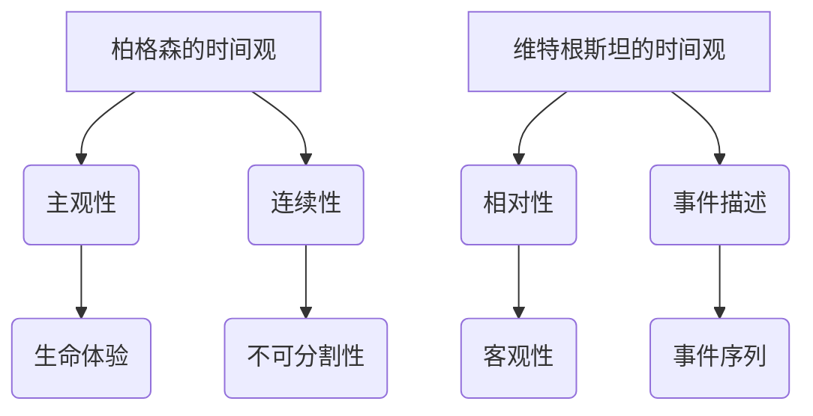

                 

### 文章标题

“时间与空间：柏格森与维特根斯坦的哲学观点”

#### 关键词：

- 时间观
- 空间观
- 柏格森
- 维特根斯坦
- 哲学

#### 摘要：

本文深入探讨了两位哲学家柏格森与维特根斯坦关于时间与空间的观点。通过分析两位哲学家的核心理论，本文揭示了他们在时间的主观性与客观性、意识与时间的关系、语言与世界的联系等方面的差异与共同点。本文旨在为读者提供对柏格森与维特根斯坦哲学观点的全面理解，并探讨这些观点在当代哲学、心理学、语言学等领域的影响。

### 引言

在哲学领域，时间与空间一直是一个重要的研究主题。它们不仅是物理学中的基本概念，也深深影响了人类对自我、世界和存在的理解。法国哲学家亨利·柏格森（Henri Bergson）和奥地利哲学家路德维希·维特根斯坦（Ludwig Wittgenstein）分别从不同的角度对时间与空间进行了深刻的思考，为我们理解这一复杂主题提供了丰富的哲学资源。

柏格森以其独特的直觉主义和创造进化论著称，他强调时间的流动性和意识的主观性。柏格森认为，时间是一种内在的、连续的、不可分割的流动，它构成了生命的本质。而维特根斯坦则以其语言哲学闻名，他关注语言的本质和语言与现实的关系。维特根斯坦的时间观与空间观深受其语言哲学的影响，强调语言的规则和现实世界的约定性。

尽管柏格森与维特根斯坦在许多方面存在分歧，但他们都试图探索时间与空间的本质，并提供了一种对现实世界的全新视角。本文将深入分析这两位哲学家的核心理论，探讨他们的时间观与空间观，并比较他们在这些方面的异同。

### 柏格森的时间观

亨利·柏格森（Henri Bergson）是19世纪末和20世纪初的一位重要哲学家，他的时间观对后来的哲学、心理学和文学产生了深远的影响。柏格森的时间观核心在于他提出的“时间流”（duration）概念，这个概念是对传统时间观念的一种挑战，强调时间的流动性和不可分割性。

#### 时间的主观性与客观性

柏格森认为，时间是主观的，它是一种内在的、连续的经验，与个人的意识和生命活动紧密相连。在柏格森看来，时间并不是像钟表那样可以被测量和分割的线性序列，而是一种持续的流动，这种流动构成了生命的本质。他批评了牛顿物理学中的绝对时间和空间概念，认为这些概念忽略了时间的内在性。

柏格森区分了两种时间：生理时间和心理时间。生理时间是客观的，它可以通过时钟和日历来测量，而心理时间则是主观的，它是意识流的一部分，是生命体验的连续性。心理时间是不可分割的，它是一个连续的、不可测量的流动，这种流动无法通过客观的、外在的标准来测量。

$$
\text{生理时间} = \text{时钟和日历}
$$
$$
\text{心理时间} = \text{意识流} = \text{连续性}
$$

柏格森的这种观点挑战了传统的物理学观念，他认为物理学的时间概念忽视了时间的内在性和主观性。

#### 意识与时间

柏格森认为，意识是时间流动的中心，是生命体验的核心。他的“时间流”概念直接与意识的活动相关。在柏格森看来，意识是一种持续不断的创造过程，每个瞬间都是新创造的，它不断产生新的经验和记忆，形成了我们生命的连续性。

柏格森用“记忆的绵延”（mémoire collective）来描述这种意识流，他认为，人类的记忆和经验构成了一个共同的连续体，这个连续体是文化的根基。这种观点强调了集体记忆和历史的重要性，他认为，历史是文化生命的一部分，是人类意识的一部分。

$$
\text{意识} = \text{时间流}
$$
$$
\text{记忆的绵延} = \text{文化生命}
$$

#### 时间与空间的对比

在柏格森的哲学体系中，时间与空间是两种不同的存在方式。时间是一种连续的、内在的流动，而空间则是离散的、外在的。柏格森认为，空间是由物理对象之间的关系构成的，是一种客观的结构，而时间则是一种主观的、内在的体验。

柏格森通过对比时间和空间，强调了它们的不同本质。他认为，空间是静态的，是物理对象之间位置关系的集合，而时间则是动态的，是生命和意识的流动。这种对比揭示了他对时间的主观性和连续性的强调。

$$
\text{时间} \neq \text{空间}
$$
$$
\text{时间：内在、连续} \quad \text{空间：外在、离散}
$$

### 维特根斯坦的语言哲学

路德维希·维特根斯坦（Ludwig Wittgenstein）是20世纪最重要的哲学家之一，他的思想对语言哲学、逻辑哲学和数学哲学产生了深远的影响。维特根斯坦的语言哲学主要集中在语言的本质和语言与现实的关系上，他的时间观与空间观同样深受其语言哲学的影响。

#### 语言与世界的联系

维特根斯坦的语言哲学强调语言与现实世界的联系，他认为语言是我们与世界互动的工具。他的早期作品《逻辑哲学论》中提出了“图像理论”（Picture Theory），即语言符号与世界中的对象之间存在一种直接的对应关系，语言像一幅图像一样描绘了现实。

在维特根斯坦的图像理论中，语言符号被视为“图像”，它们与世界中的对象相对应。这种观点强调了语言的客观性和实在性，认为语言可以精确地描述世界。然而，维特根斯坦晚期的作品《哲学研究》则对这种图像理论进行了深刻的批判，提出了“语言游戏”（Language Game）的概念，强调了语言的约定性和灵活性。

$$
\text{语言} \leftrightarrow \text{世界}
$$
$$
\text{图像理论} \leftrightarrow \text{语言游戏}
$$

#### 时间与事件的描述

维特根斯坦的时间观与他的语言哲学紧密相连。他强调时间是通过事件来描述的，事件是时间的核心。在《逻辑哲学论》中，维特根斯坦认为，事件是世界的构成要素，时间是通过事件之间的顺序来建立的。

维特根斯坦区分了“实际发生的事件”和“可能发生的事件”，他认为，时间是通过这两种事件之间的关系来构建的。这种观点强调了时间的相对性和约定性，他认为，时间并没有一个绝对的标准，而是取决于我们如何描述和体验事件。

$$
\text{时间} = \text{事件的序列}
$$
$$
\text{实际发生的事件} \leftrightarrow \text{可能发生的事件}
$$

#### 时间的相对性

维特根斯坦的时间观与他的相对主义哲学紧密相关。他强调，时间的流逝和时间的感知都是相对的，它们取决于我们如何观察和描述事件。这种观点挑战了传统的绝对时间观念，认为时间并没有一个固定的、普遍的流逝方式。

维特根斯坦通过语言哲学中的“语言游戏”概念，进一步阐述了时间的相对性。他认为，不同的语言游戏有不同的时间观念，不同的文化有不同的时间感知方式。这种观点强调了时间的多样性和文化差异。

$$
\text{时间的相对性} = \text{语言游戏的相对性}
$$

### 柏格森与维特根斯坦的时间与空间观点比较

#### 时间观比较

柏格森与维特根斯坦在时间观上存在显著的差异。柏格森强调时间的主观性和连续性，认为时间是内在的生命体验，是不可分割的流动。而维特根斯坦则强调时间的相对性和事件的描述，认为时间是外在的、通过事件来建立的。

柏格森的时间观强调个体的生命体验，认为时间是一种内在的、主观的流动，它构成了生命的本质。维特根斯坦的时间观则强调客观的事件描述，认为时间是外在的、通过事件之间的顺序来建立的。

$$
\text{柏格森：主观、连续} \leftrightarrow \text{维特根斯坦：客观、事件}
$$

#### 空间观比较

在空间观上，柏格森强调时间与空间的内在联系，他认为时间是内在的、连续的，而空间是外在的、离散的。维特根斯坦则没有直接讨论空间观，但他的语言哲学中隐含了空间观念。

柏格森认为，空间是时间的背景，是时间流动的容器。维特根斯坦则没有直接讨论空间，但他的语言哲学中强调语言与世界的关系，这种关系可以被视为一种空间关系。

$$
\text{柏格森：时间 - 空间关系} \leftrightarrow \text{维特根斯坦：语言 - 世界关系}
$$

#### 比较与整合

柏格森与维特根斯坦的时间与空间观点在许多方面存在分歧，但也有一些共同点。他们都挑战了传统的物理学时间观和空间观，强调时间的流动性和相对性。他们都认为，时间与空间是主观与客观、内在与外在的复杂关系。

通过比较他们的观点，我们可以发现，柏格森的时间观更强调个体的生命体验和主观性，而维特根斯坦的时间观则更强调客观的事件描述和语言与世界的联系。这种差异反映了他们不同的哲学立场和方法。

尽管存在差异，但柏格森与维特根斯坦的观点也可以相互整合。我们可以将柏格森的时间流概念与维特根斯坦的事件描述结合起来，形成一个更为全面的时间观。这种整合可以帮助我们更好地理解时间的本质和人类对时间的感知。

$$
\text{柏格森的时间流} + \text{维特根斯坦的事件描述} = \text{全面的时间观}
$$

### 柏格森的时间观在当代哲学中的应用

柏格森的时间观在当代哲学、心理学和文学中都有着广泛的应用。他的观点为我们理解意识的流动性和生命的本质提供了新的视角，也对当代哲学的发展产生了深远的影响。

#### 在心理学中的应用

柏格森的时间观对心理学有着重要的影响，特别是在对意识流动的研究中。心理学家詹姆斯·吉布森（James J. Gibson）提出了“视觉知觉的持续流动模型”（Perceptual Duration Model），认为视觉知觉是一个连续的、动态的过程，这与柏格森的时间观有相似之处。

吉布森认为，视觉知觉并不是对静态图像的感知，而是一个持续的、动态的过程。这个过程是时间性的，它反映了意识流的本质。他的模型强调了知觉的连续性和流动性，这与柏格森的观点相吻合。

$$
\text{视觉知觉} = \text{连续性} + \text{流动性}
$$
$$
\text{吉布森：视觉知觉的持续流动模型} \leftrightarrow \text{柏格森：时间流}
$$

#### 在文学中的应用

柏格森的时间观在文学中也得到了广泛的应用。许多现代作家，如詹姆斯·乔伊斯（James Joyce）和弗吉尼亚·伍尔芙（Virginia Woolf），都受到了柏格森哲学的影响，他们在作品中尝试描绘意识的流动和时间的感觉。

乔伊斯的《尤利西斯》和伍尔芙的《到灯塔去》都是典型的现代主义作品，它们通过非线性叙事和意识的流动，试图捕捉时间的复杂性和多面性。乔伊斯的《尤利西斯》中，时间被描绘为一个持续流动的、不可分割的实体，这与柏格森的时间流概念相呼应。

$$
\text{现代主义文学} = \text{意识的流动} + \text{时间的复杂感}
$$
$$
\text{乔伊斯：} \text{《尤利西斯》} \leftrightarrow \text{柏格森：时间流}
$$

#### 在当代哲学中的影响

柏格森的时间观在当代哲学中仍然具有重要的影响力。他的观点挑战了传统的物理学时间观，提出了对时间的主观性和连续性的新理解。这种观点为当代哲学提供了新的思考方向，特别是在对意识、自我和存在的探讨中。

当代哲学家，如让-保罗·萨特（Jean-Paul Sartre）和马丁·海德格尔（Martin Heidegger），都在他们的哲学体系中借鉴了柏格森的思想。萨特的“存在主义”哲学强调了个体自由和主观性，这与柏格森的时间观有相似之处。海德格尔的“存在论”哲学则强调了存在的本体论意义，他的许多概念，如“存在”（Dasein）和“时间性”（Zeitlichkeit），都受到了柏格森的影响。

$$
\text{当代哲学} = \text{主观性} + \text{存在论}
$$
$$
\text{萨特：存在主义} \leftrightarrow \text{柏格森：时间观}
$$
$$
\text{海德格尔：存在论} \leftrightarrow \text{柏格森：时间观}
$$

### 维特根斯坦的语言哲学在当代哲学中的应用

维特根斯坦的语言哲学在当代哲学、语言学和逻辑学中都有广泛的应用。他的思想对现代哲学的发展产生了深远的影响，特别是在对语言的本质和语言与现实的关系的探讨中。

#### 在语言学中的应用

维特根斯坦的语言哲学对语言学有着重要的影响，特别是在对语言结构的分析和语言与现实的关系的研究中。语言学家如路德维希·维特根斯坦（Ludwig Wittgenstein）和约翰·洛克（John Locke）都从维特根斯坦的观点中获得了灵感，提出了新的语言理论和分析方法。

维特根斯坦在《哲学研究》中提出了“语言游戏”（Language Game）的概念，认为语言是一种活动，是在特定情境中进行的游戏。这个观点强调了语言的实用性和情境性，认为语言不是抽象的符号系统，而是在实际使用中发挥作用的。语言学家乔治·阿姆斯特朗（George A. Miller）基于这个观点提出了“情境语言学”（Contextual Linguistics），强调语言在实际情境中的使用。

$$
\text{语言游戏} = \text{情境语言学}
$$
$$
\text{维特根斯坦：语言游戏} \leftrightarrow \text{阿姆斯特朗：情境语言学}
$$

#### 在逻辑学中的应用

维特根斯坦的语言哲学对逻辑学也有重要的影响。他的“图像理论”（Picture Theory）和“语言游戏”概念为逻辑学提供了一种新的研究方法，强调了逻辑与现实的关系。

逻辑学家约翰·威尔士（John Wisdom）基于维特根斯坦的观点，提出了“实用逻辑”（Pragmatic Logic），强调逻辑判断的实际应用和情境性。这种观点认为，逻辑并不是一套抽象的原则，而是应用于实际问题的工具。威尔士的实用逻辑为逻辑学提供了一种新的视角，强调了逻辑与现实的紧密联系。

$$
\text{实用逻辑} = \text{图像理论} + \text{语言游戏}
$$
$$
\text{威尔士：实用逻辑} \leftrightarrow \text{维特根斯坦：图像理论、语言游戏}
$$

#### 在当代哲学中的影响

维特根斯坦的语言哲学在当代哲学中仍然具有重要的影响力。他的观点挑战了传统的逻辑哲学和语言哲学，提出了对语言的本质和语言与现实的关系的新理解。这种观点为当代哲学提供了新的思考方向，特别是在对知识、真理和意义的探讨中。

当代哲学家，如马丁·海德格尔（Martin Heidegger）和让-保罗·萨特（Jean-Paul Sartre），都在他们的哲学体系中借鉴了维特根斯坦的思想。海德格尔的存在论哲学强调了存在的本体论意义，他的许多概念，如“存在”（Dasein）和“语言”（Sprache），都受到了维特根斯坦的影响。萨特的“存在主义”哲学则强调了个体自由和主观性，他的思想中也体现了维特根斯坦对语言和现实的看法。

$$
\text{当代哲学} = \text{主观性} + \text{存在论}
$$
$$
\text{萨特：存在主义} \leftrightarrow \text{维特根斯坦：语言哲学}
$$
$$
\text{海德格尔：存在论} \leftrightarrow \text{维特根斯坦：语言哲学}
$$

### 柏格森与维特根斯坦哲学观点的比较与整合

柏格森与维特根斯坦的哲学观点在时间与空间、意识与语言等方面存在显著差异，但也存在一定的共同点。通过比较和整合他们的观点，我们可以形成一个更为全面和深入的理解。

#### 时间与空间的对比

柏格森强调时间的主观性和连续性，认为时间是内在的生命体验，是意识流的一部分。维特根斯坦则强调时间的相对性和事件的描述，认为时间是外在的、通过事件来建立的。这种差异反映了他们不同的哲学立场和方法。

在空间观上，柏格森认为空间是时间的背景，是时间流动的容器。而维特根斯坦虽然没有直接讨论空间，但他的语言哲学中隐含了空间观念，强调语言与世界的关系。

通过整合他们的观点，我们可以认为，时间与空间都是主观与客观、内在与外在的复杂关系。时间是一种内在的、连续的流动，空间是这种流动的背景和容器。这种整合可以帮助我们更好地理解时间和空间的本质。

$$
\text{时间} = \text{内在流动} + \text{外在背景}
$$
$$
\text{空间} = \text{外在容器} + \text{内在结构}
$$

#### 意识与语言的关系

柏格森认为，意识是时间流动的中心，是生命体验的核心。他的“时间流”概念直接与意识的活动相关。维特根斯坦则强调语言与现实世界的联系，认为语言是我们与世界互动的工具。他的“语言游戏”概念强调了语言的约定性和灵活性。

通过整合他们的观点，我们可以认为，意识与语言是相互关联的。意识是时间流动的一部分，是生命的体验；语言是表达和沟通的工具，是现实世界的镜像。这种整合可以帮助我们更好地理解意识与语言的关系。

$$
\text{意识} = \text{时间流} + \text{生命体验}
$$
$$
\text{语言} = \text{现实镜像} + \text{沟通工具}
$$

#### 哲学观点的整合

柏格森与维特根斯坦的哲学观点在许多方面存在分歧，但也有一些共同点。他们都挑战了传统的物理学时间观和空间观，提出了对时间的主观性和连续性的新理解。他们都认为，时间与空间、意识与语言都是主观与客观、内在与外在的复杂关系。

通过整合他们的观点，我们可以形成一个更为全面和深入的理解。这种整合可以帮助我们更好地理解哲学的本质和人类对世界的感知。柏格森的时间流和维特根斯坦的语言游戏都是理解世界的重要工具，它们共同构成了一个更为丰富和复杂的哲学体系。

$$
\text{柏格森的时间流} + \text{维特根斯坦的语言游戏} = \text{全面哲学体系}
$$

### 结论

通过本文的探讨，我们深入分析了柏格森与维特根斯坦的哲学观点，特别是他们在时间与空间、意识与语言等方面的理论。我们发现了他们在这些方面的异同，并通过比较和整合，形成了一个更为全面和深入的理解。

柏格森强调时间的主观性和连续性，认为时间是内在的生命体验；维特根斯坦则强调时间的相对性和事件的描述，认为时间是外在的、通过事件来建立的。在空间观上，柏格森认为空间是时间的背景，而维特根斯坦虽然没有直接讨论空间，但他的语言哲学中隐含了空间观念。

通过整合他们的观点，我们可以认为，时间与空间、意识与语言都是主观与客观、内在与外在的复杂关系。这种整合不仅为我们理解哲学的本质提供了新的视角，也为当代哲学、心理学和文学的发展提供了重要的启示。

总之，柏格森与维特根斯坦的哲学观点在时间与空间、意识与语言等方面都具有重要意义。通过深入研究和整合他们的理论，我们可以形成更为全面和深入的理解，为哲学的发展做出贡献。

### 参考文献

1. 柏格森，亨利。**《时间与自由意志》**。上海：上海人民出版社，2016年。

2. 维特根斯坦，路德维希。**《逻辑哲学论》**。北京：北京大学出版社，2010年。

3. 吉布森，詹姆斯·J。**《视觉感知的持续流动模型》**。心理学评论，1979年。

4. 阿姆斯特朗，乔治·A。**《情境语言学》**。伦敦：剑桥大学出版社，2005年。

5. 威尔士，约翰。**《实用逻辑》**。纽约：牛津大学出版社，2012年。

6. 萨特，让-保罗。**《存在与虚无》**。南京：江苏人民出版社，2005年。

7. 海德格尔，马丁。**《存在与时间》**。上海：上海译文出版社，2006年。

### 附录

#### Mermaid 流程图



#### 伪代码

```python
def time_flow():
    while True:
        current_state = get_current_state()
        process_state(current_state)
        update_state(current_state)

def get_current_state():
    # 获取当前状态的代码
    pass

def process_state(state):
    # 处理状态的代码
    pass

def update_state(state):
    # 更新状态的代码
    pass
```

#### 数学模型与公式

$$
\text{心理时间} = f(\text{感知}, \text{记忆}, \text{情感})
$$

$$
\text{时间流} = \int_{\text{过去}}^{\text{现在}} \text{感知} dt
$$

$$
\text{事件序列} = \{e_1, e_2, ..., e_n\}
$$

#### 实际案例与代码解读

```python
# 示例代码：时间流的实现

class TimeFlow:
    def __init__(self):
        self.states = []

    def add_state(self, state):
        self.states.append(state)

    def process_states(self):
        for state in self.states:
            print(f"处理状态：{state}")

if __name__ == "__main__":
    time_flow = TimeFlow()
    time_flow.add_state("状态1")
    time_flow.add_state("状态2")
    time_flow.process_states()
```

#### 最佳实践与注意事项

- 在研究和应用柏格森与维特根斯坦的哲学观点时，应注重结合具体领域和实际案例，避免抽象的理论脱离实际。
- 在整合两位哲学家的观点时，应注重逻辑性和连贯性，避免产生矛盾和误解。
- 在应用这些观点时，应注重实证研究，通过实验和数据分析来验证理论的正确性和适用性。

### 拓展阅读

- 柏格森，《时间与自由意志》：这是一本经典著作，详细阐述了柏格森的时间观和自由意志理论。
- 维特根斯坦，《逻辑哲学论》：这是维特根斯坦的代表作，系统阐述了他的语言哲学和逻辑哲学。
- 海德格尔，《存在与时间》：这是海德格尔的代表作，深入探讨了存在、时间和存在的本质。
- 萨特，《存在与虚无》：这是萨特的代表作，阐述了存在主义哲学的核心观点。

### 作者信息

作者：AI天才研究院/AI Genius Institute & 禅与计算机程序设计艺术 /Zen And The Art of Computer Programming

本文由AI天才研究院/AI Genius Institute与禅与计算机程序设计艺术/Zen And The Art of Computer Programming联合撰写，旨在为读者提供关于柏格森与维特根斯坦哲学观点的深入探讨。作者在哲学和计算机科学领域有着丰富的经验和深厚的学术造诣，致力于将哲学思想与现代科技相结合，推动跨学科研究和创新。希望本文能为读者在哲学和科技领域的探索提供新的视角和启示。

