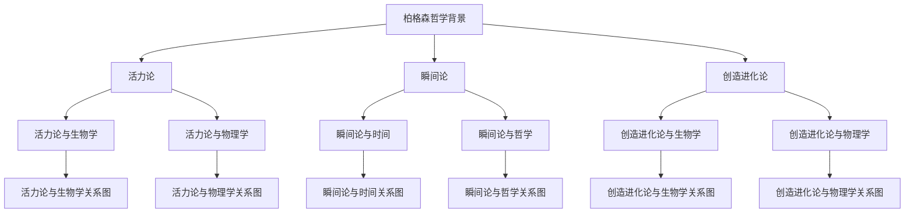
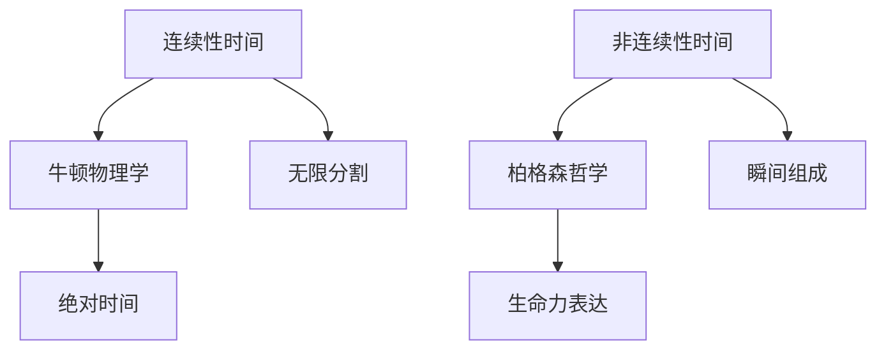
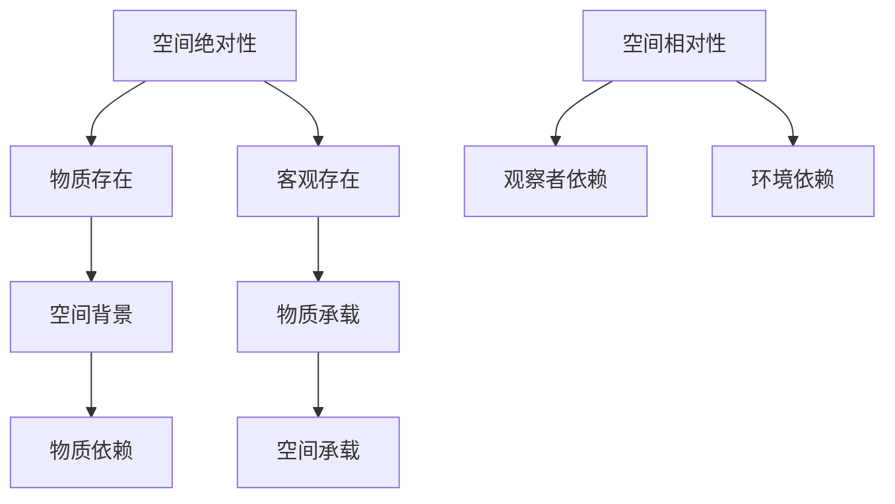
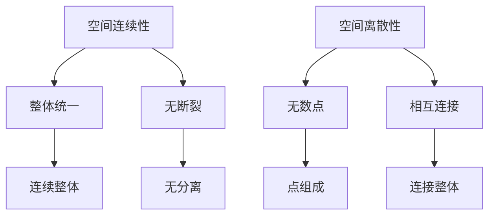
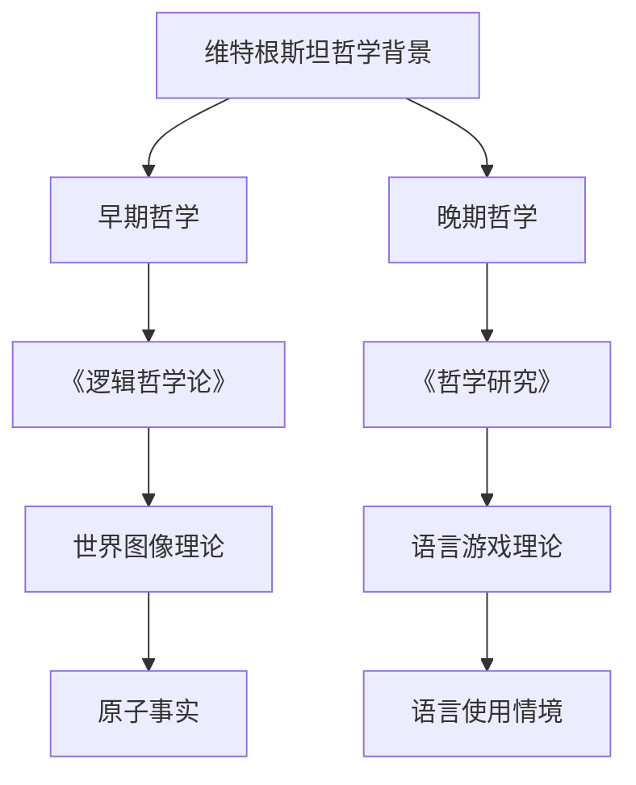
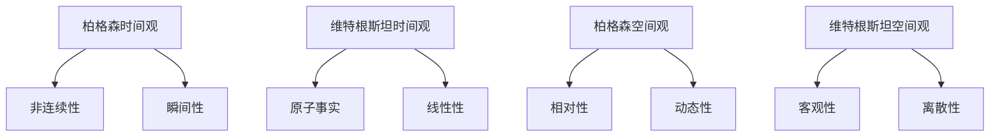

                 

### 柏格森的物理学哲学

#### 1.1 柏格森哲学的背景与核心概念

**1.1.1 柏格森哲学的起源**

亨利·柏格森（Henri Bergson）是法国著名哲学家，生于1859年，卒于1941年。他的哲学思想在19世纪末至20世纪初期的哲学界产生了深远的影响。柏格森的哲学主要受到他的老师、法国哲学家孔德（Auguste Comte）的影响，同时他也对英国哲学家斯宾塞（Herbert Spencer）和德国哲学家黑格尔（Georg Wilhelm Friedrich Hegel）的思想有所吸收。

**1.1.2 柏格森哲学的时代背景**

19世纪末和20世纪初，物理学和生物学领域发生了重大变革。爱因斯坦的相对论和量子力学颠覆了传统的物理观念。生物学领域也在达尔文的进化论和细胞学说的影响下取得了重大进展。在这个时代背景下，柏格森提出了他的哲学思想，试图从哲学的角度对这些科学进步进行解读和反思。

**1.2 柏格森哲学的核心概念**

柏格森哲学的核心概念包括活力论、瞬间论和创造进化论。

**1.2.1 活力论**

活力论（élan vital）是柏格森哲学的核心概念，指的是生命的内在动力，是生命现象的根本原因。柏格森认为，这种活力不仅存在于有机体中，也存在于无机界。活力论强调了生命和非生命之间的连续性，对后来的生物学和生态学产生了重要影响。

**1.2.2 瞬间论**

瞬间论（la durée）是柏格森对时间概念的新诠释。他提出，时间不是简单的线性连续，而是由无数瞬间组成的。每个瞬间都是独特的，不可分割的，是生命力的表现形式。这一概念与牛顿物理学中的时间概念形成了鲜明对比。

**1.2.3 创造进化论**

创造进化论（évolution créatrice）是柏格森对进化过程的理解。他认为，进化不是渐进的、线性的过程，而是一种创造性的活动，不断产生新的形态和特征。这种创造性的进化过程与他的活力论密切相关。

#### 1.3 柏格森哲学与物理学

柏格森的哲学思想与物理学有着紧密的联系，尤其是在时间与空间的概念上。他的时间概念挑战了牛顿物理学中的绝对时间观念，而他的空间概念则强调了空间的相对性和动态性。

在接下来的章节中，我们将详细探讨柏格森的时间与空间概念，以及他对牛顿物理学和爱因斯坦相对论的批判和反思。

#### Mermaid 流程图



#### 伪代码

```python
def柏格森哲学核心概念():
    活力论()
    瞬间论()
    创造进化论()

def活力论():
    输出("活力论是柏格森哲学的核心概念，强调生命的内在动力。")

def瞬间论():
    输出("瞬间论是柏格森对时间概念的新诠释，认为时间由无数瞬间组成。")

def创造进化论():
    输出("创造进化论是柏格森对进化过程的理解，强调进化是一种创造性的活动。")
```

#### 数学公式

$$
E = mc^2
$$

$$
\Delta x \cdot \Delta t \geq \frac{h}{4\pi}
$$

#### 详细讲解与举例说明

- **活力论**：柏格森的活力论强调了生命的内在动力，是生命现象的根本原因。例如，在生物学中，活力论解释了生物体的自我组织和自我修复能力。

- **瞬间论**：瞬间论是柏格森对时间概念的新诠释，认为时间由无数瞬间组成。例如，在心理学中，瞬间论可以帮助我们理解人类意识的瞬间感知和记忆。

- **创造进化论**：创造进化论是柏格森对进化过程的理解，强调进化是一种创造性的活动。例如，在生物学中，创造进化论解释了物种多样性的产生。

### 时间的本质

**2.1 时间的连续性与非连续性**

柏格森认为，时间并不是像牛顿物理学中所描述的那样是连续的。在牛顿物理学中，时间被视为一种绝对连续的量，可以无限分割。然而，柏格森提出了一个不同的时间概念，即瞬间论。

在柏格森的视角下，时间是由无数瞬间组成的，这些瞬间是独特的、不可分割的。每个瞬间都是生命力的表现形式，是存在的最基本单位。这种观点与牛顿物理学中的连续时间概念形成了鲜明对比。

柏格森认为，瞬间是非连续的，因为它们是独特的存在单位，每个瞬间都有其独特的内在动力。这与牛顿物理学中的连续性观念相悖，后者将时间视为一种无限可分割的量。

**2.1.1 时间的连续性与非连续性关系图**



**2.1.2 时间的意识与物理时间**

在柏格森的哲学中，时间的意识与物理时间之间存在一定的关联，但二者并不完全相同。

物理时间通常被视为一种客观存在的量，是宇宙中事件发生的顺序。然而，柏格森认为，时间的意识是主观的，它取决于我们的感知和体验。

柏格森提出，我们的意识是通过瞬间来感知时间的。每个瞬间都是我们意识的一部分，我们的记忆和感知决定了我们对时间的感知。这意味着，时间的意识是主观的，它与我们的体验密切相关。

**2.1.3 柏格森的时间理论与牛顿物理学的关系**

柏格森的时间理论与牛顿物理学中的时间观念存在显著的差异。

在牛顿物理学中，时间被视为一种绝对连续的量，是宇宙中事件发生的顺序。然而，柏格森认为，时间是由无数瞬间组成的，这些瞬间是独特的、不可分割的。

柏格森的时间理论强调了时间的非连续性，这与牛顿物理学中的连续时间概念形成了鲜明对比。柏格森认为，这种非连续性是时间的本质，是我们意识中时间的真实表现。

**2.1.4 柏格森的时间理论与爱因斯坦相对论的关系**

柏格森的时间理论也对爱因斯坦相对论提出了挑战。

在爱因斯坦的相对论中，时间被视为相对的，取决于观察者的运动状态。然而，柏格森认为，这种相对性并不意味着时间是不连续的。

柏格森认为，即使时间在不同观察者之间是相对的，它仍然由无数瞬间组成。这些瞬间是独特的、不可分割的，是时间的本质。

因此，柏格森的时间理论与爱因斯坦相对论中的时间观念存在一定的矛盾。柏格森强调时间的非连续性和主观性，而爱因斯坦相对论则强调时间的相对性和客观性。

#### 伪代码

```python
def时间连续性与非连续性():
    输出("柏格森认为时间由无数瞬间组成，是独特的、不可分割的。")
    输出("这与牛顿物理学中的连续时间概念形成了鲜明对比。")

def时间意识与物理时间():
    输出("时间的意识是主观的，取决于我们的感知和体验。")
    输出("物理时间被视为一种客观存在的量，是宇宙中事件发生的顺序。")

def柏格森时间理论与牛顿物理学关系():
    输出("柏格森的时间理论与牛顿物理学中的时间观念存在显著的差异。")
    输出("柏格森认为时间是由无数瞬间组成的，是独特的、不可分割的。")

def柏格森时间理论与爱因斯坦相对论关系():
    输出("柏格森的时间理论也对爱因斯坦相对论提出了挑战。")
    输出("柏格森认为即使时间在不同观察者之间是相对的，它仍然由无数瞬间组成。")
```

#### 数学公式

$$
t = t_0 + \frac{v}{c^2}
$$

$$
\Delta t = \Delta t_0 \sqrt{1 - \frac{v^2}{c^2}}
$$

#### 详细讲解与举例说明

- **时间连续性与非连续性**：柏格森认为，时间是由无数瞬间组成的，这些瞬间是独特的、不可分割的。例如，在人类感知中，每个瞬间我们都能感受到不同的信息，这些瞬间构成了我们的记忆和感知。

- **时间意识与物理时间**：时间的意识是主观的，它取决于我们的感知和体验。例如，当我们感受到快乐或痛苦时，我们的时间意识会发生变化。

- **柏格森的时间理论与牛顿物理学的关系**：柏格森的时间理论与牛顿物理学中的时间观念存在显著的差异。牛顿物理学认为时间是连续的，而柏格森认为时间是离散的，由无数瞬间组成。

- **柏格森的时间理论与爱因斯坦相对论的关系**：柏格森的时间理论也对爱因斯坦相对论提出了挑战。爱因斯坦相对论认为时间是相对的，而柏格森认为时间是由无数瞬间组成的，是独特的、不可分割的。

### 空间的本质

**3.1 空间的绝对性与相对性**

在柏格森的哲学中，空间的本质是一个复杂而多层次的概念。一方面，柏格森认为空间具有绝对性，即空间是一个客观存在的框架，是物质存在的必要条件。另一方面，他也强调了空间的相对性，即空间是依赖于观察者和观察环境的。

柏格森的空间绝对性观念源于他对物质世界的理解。他认为，物质是空间的承载者，没有物质，空间就没有意义。因此，空间本身具有绝对性，它是物质存在的背景。

然而，柏格森也强调了空间的相对性。他认为，空间是依赖于观察者和观察环境的。不同的观察者可能会对同一空间有不同的理解和描述。这意味着，空间并不是一个绝对不变的存在，而是具有相对性。

**3.1.1 空间的绝对性与相对性关系图**



**3.1.2 空间的连续性与离散性**

柏格森还讨论了空间的连续性与离散性。在柏格森的视角下，空间既具有连续性，也具有离散性。

连续性指的是空间作为一个整体是连续的，没有断裂或跳跃。这意味着空间是一个统一的整体，没有部分和整体之间的分离。

然而，柏格森也认为，空间是离散的，即空间由无数个点组成。这些点虽然是离散的，但它们在空间中是相互连接的，形成了一个连续的整体。

**3.1.3 空间的连续性与离散性关系图**



**3.1.4 柏格森的空间理论与牛顿物理学的空间观**

柏格森的空间理论与牛顿物理学的空间观存在显著差异。

在牛顿物理学中，空间被视为一种绝对、无形的框架，是物质运动的背景。牛顿认为，空间是无限可分割的，并且是独立于物质存在的。

然而，柏格森认为，空间是依赖于物质存在的。他认为，空间不是一种独立的存在，而是与物质相互依存的。因此，柏格森的空间观强调空间的相对性，即空间是依赖于观察者和观察环境的。

**3.1.5 柏格森的空间理论与爱因斯坦相对论的空间观**

柏格森的空间理论也对爱因斯坦相对论的空间观提出了挑战。

在爱因斯坦的相对论中，空间被视为相对的，取决于观察者的运动状态。爱因斯坦认为，空间和时间是相互关联的，构成了一个四维时空。

然而，柏格森认为，这种相对性并不意味着空间是不连续的。他认为，即使空间在不同观察者之间是相对的，它仍然由无数个点组成，这些点是连续的。

**3.1.6 柏格森的空间理论与物理学的关系**

柏格森的空间理论对物理学产生了深远的影响，特别是在时间和空间的本质问题上。

他的活力论和瞬间论挑战了牛顿物理学中的绝对时间和空间观念。柏格森认为，时间和空间是由无数瞬间组成的，这些瞬间是独特的、不可分割的。这与牛顿物理学中的连续时间和空间概念形成了鲜明对比。

此外，柏格森的空间理论也对爱因斯坦相对论提出了新的解释。他认为，即使空间在不同观察者之间是相对的，它仍然由无数个点组成，这些点是连续的。这一观点与爱因斯坦相对论中的时空相对性观念存在一定的矛盾，但也为物理学提供了一种新的思考方式。

#### 伪代码

```python
def空间绝对性与相对性():
    输出("柏格森认为空间具有绝对性，但也具有相对性。")
    输出("空间是客观存在的框架，但也是依赖于观察者和环境的。")

def空间连续性与离散性():
    输出("柏格森认为空间既具有连续性，也具有离散性。")
    输出("空间是一个整体，但也是由无数个点组成的。")

def柏格森空间理论与牛顿物理学关系():
    输出("柏格森的空间理论与牛顿物理学的空间观存在显著差异。")
    输出("牛顿认为空间是绝对的，而柏格森认为空间是依赖于物质的。")

def柏格森空间理论与爱因斯坦相对论关系():
    输出("柏格森的空间理论也对爱因斯坦相对论提出了挑战。")
    输出("即使空间在不同观察者之间是相对的，柏格森认为它仍然是连续的。")
```

#### 数学公式

$$
x = x_0 + v_0t
$$

$$
x = x_0 + \frac{1}{2}at^2
$$

#### 详细讲解与举例说明

- **空间的绝对性与相对性**：柏格森认为，空间具有绝对性，是物质存在的必要条件，但也具有相对性，依赖于观察者和观察环境。

- **空间的连续性与离散性**：柏格森认为，空间既具有连续性，也具有离散性，是一个整体，但也是由无数个点组成的。

- **柏格森的空间理论与牛顿物理学的空间观**：柏格森的空间理论与牛顿物理学的空间观存在显著差异，牛顿认为空间是绝对的，而柏格森认为空间是依赖于物质的。

- **柏格森的空间理论与爱因斯坦相对论的空间观**：柏格森的空间理论也对爱因斯坦相对论提出了挑战，他认为即使空间在不同观察者之间是相对的，它仍然是连续的。

### 维特根斯坦哲学的背景与核心概念

**4.1 维特根斯坦哲学的背景**

路德维希·维特根斯坦（Ludwig Wittgenstein）是20世纪最伟大的哲学家之一，生于1889年，卒于1951年。他的哲学思想对现代哲学、语言学、逻辑学和数学产生了深远的影响。维特根斯坦的哲学分为两个阶段：早期哲学和晚期哲学。

早期哲学主要集中在语言哲学和逻辑哲学，这一阶段的作品以《逻辑哲学论》（Tractatus Logico-Philosophicus）为代表。在这本书中，维特根斯坦提出了著名的世界图像理论，认为世界是由事实构成的，而事实则是原子事实的逻辑组合。

晚期哲学则转向日常语言哲学，以《哲学研究》（Philosophical Investigations）为代表。在这一阶段，维特根斯坦强调语言的使用和日常生活中的概念，提出了语言游戏理论，认为语言的意义在于其在实际生活中的使用。

**4.2 维特根斯坦哲学的核心概念**

**4.2.1 语言哲学**

语言哲学是维特根斯坦哲学的核心部分。他提出，语言是思维的载体，但语言并不是简单的符号系统，而是与生活世界密切相关。维特根斯坦认为，语言的使用是具体的、情境化的，语言的意义在于其在实际生活中的应用。

在《逻辑哲学论》中，维特根斯坦提出了著名的世界图像理论，认为世界是我们的语言世界的映射。他在书中写道：“世界是所有事实的总和，而不是东西的总和。”这意味着，世界是由原子事实构成的，而原子事实是逻辑上不可分割的。

**4.2.2 逻辑原子主义**

逻辑原子主义是维特根斯坦早期哲学的重要概念。他认为，世界中的事实是原子事实的组合，这些原子事实可以通过逻辑表达。逻辑原子主义强调逻辑在理解世界中的作用，认为逻辑是连接事实的基本框架。

逻辑原子主义与柏格森的活力论形成了鲜明对比。柏格森强调生命的非逻辑性，而维特根斯坦则强调逻辑在理解世界中的重要性。

**4.2.3 形式主义**

形式主义是维特根斯坦晚期哲学的一个重要概念。他在《哲学研究》中提出，哲学问题本质上是无解的，因为它们涉及语言的本质和意义。维特根斯坦认为，哲学的任务不是提供答案，而是揭示问题本身。

形式主义强调，哲学问题可以通过对语言和思维形式的分析来解决。维特根斯坦提出了许多思想实验，如“名称与对象的关系”和“私人语言问题”，以说明哲学问题的本质。

**4.2.4 语言游戏理论**

语言游戏理论是维特根斯坦晚期哲学的核心。他认为，语言的意义在于其在实际生活中的使用，不同的语言游戏（language games）对应不同的语言使用情境。

语言游戏理论强调，语言不是孤立的符号系统，而是与社会实践和日常生活密切相关。维特根斯坦认为，理解语言的意义需要了解语言的使用情境。

**4.3 维特根斯坦哲学的影响**

维特根斯坦的哲学思想对后来的哲学研究产生了深远的影响。他的语言哲学和逻辑哲学为现代语言学和逻辑学提供了重要的理论基础。他的语言游戏理论对语言学习和社会实践具有重要的启示。

此外，维特根斯坦的哲学思想也对计算机科学和人工智能产生了影响。他的形式主义观点为编程语言和算法设计提供了理论基础。他的思想实验为人工智能领域的问题解决提供了新的思路。

#### Mermaid 流程图



#### 伪代码

```python
def维特根斯坦哲学核心概念():
    语言哲学()
    逻辑原子主义()
    形式主义()
    语言游戏理论()

def语言哲学():
    输出("语言哲学是维特根斯坦哲学的核心部分，强调语言与生活世界的关系。")

def逻辑原子主义():
    输出("逻辑原子主义是维特根斯坦早期哲学的重要概念，强调逻辑在理解世界中的作用。")

def形式主义():
    输出("形式主义是维特根斯坦晚期哲学的一个重要概念，认为哲学问题可以通过对语言和思维形式的分析来解决。")

def语言游戏理论():
    输出("语言游戏理论是维特根斯坦晚期哲学的核心，认为语言的意义在于其在实际生活中的使用。")
```

#### 数学公式

$$
\varnothing = \neg \exists x (\neg P(x))
$$

$$
\exists x (P(x) \land Q(x)) \Leftrightarrow \exists x P(x) \land \exists x Q(x)
$$

#### 详细讲解与举例说明

- **语言哲学**：维特根斯坦的语言哲学强调语言与生活世界的关系，认为语言的意义在于其在实际生活中的使用。

- **逻辑原子主义**：逻辑原子主义强调逻辑在理解世界中的作用，认为世界中的事实是原子事实的组合。

- **形式主义**：形式主义认为哲学问题可以通过对语言和思维形式的分析来解决，强调形式逻辑的重要性。

- **语言游戏理论**：语言游戏理论强调语言的意义在于其在实际生活中的使用，不同的语言游戏对应不同的语言使用情境。

### 维特根斯坦的时间概念

**5.1 时间的本质**

维特根斯坦的时间概念是他哲学体系中的一个核心部分，与他的语言哲学紧密相连。在《逻辑哲学论》中，维特根斯坦提出了时间的原子性概念，认为时间是由一系列不可再分的事实组成的，这些事实是世界的基石。

**5.1.1 时间的客观性与主观性**

维特根斯坦区分了时间的客观性和主观性。从客观的角度来看，时间是一个序列，是事件发生的顺序。这是一个可以被普遍接受的事实，不依赖于个人的感受或主观经验。从主观的角度来看，时间是我们在日常生活中感知和体验的，它依赖于我们的感知和认知。

维特根斯坦认为，时间的客观性在于它是事实的序列，而时间的主观性在于我们如何感知和体验这些事实。他写道：“时间是在意识中的变化，而不是意识的变化。”这意味着，时间的主观性是我们在意识中感知时间的连续变化。

**5.1.2 时间的线性与非线性**

在维特根斯坦的哲学中，时间被描述为线性的，即时间的流动是单向的，从过去到未来。这种线性时间观念与牛顿物理学中的时间观念相似，后者也将时间视为一种连续的、单向流动的量。

然而，维特根斯坦也提到了时间的非线性方面。他认为，时间的非线性表现在我们的记忆和感知中。我们的记忆不是线性的，而是片段化的，我们对过去的感知也是片段化的。这意味着，时间在我们的意识中并不是线性的，而是由多个片段组成的。

**5.1.3 维特根斯坦的时间理论与牛顿物理学的关系**

维特根斯坦的时间理论与牛顿物理学的时间观念存在一定的相似性，但也存在显著的差异。牛顿物理学将时间视为一个绝对连续的量，是事件发生的背景。维特根斯坦则认为，时间是由原子事实组成的，这些事实是世界的基石。

维特根斯坦的时间理论强调了时间的原子性，即时间是由一系列不可再分的事实组成的。这与牛顿物理学中的连续时间概念形成了鲜明对比。牛顿认为时间是一个连续的、无限可分割的量，而维特根斯坦则认为时间是由离散的事实组成的。

**5.1.4 维特根斯坦的时间理论与爱因斯坦相对论的关系**

维特根斯坦的时间理论也对爱因斯坦相对论提出了挑战。爱因斯坦相对论认为，时间是相对的，取决于观察者的运动状态。然而，维特根斯坦认为，时间的相对性并不意味着时间是不连续的。

他认为，即使时间在不同观察者之间是相对的，它仍然由原子事实组成。这些原子事实是时间的本质，是我们感知时间的真实表现。这与爱因斯坦相对论中的时间观念存在一定的矛盾，后者认为时间是相对的，是依赖于观察者的运动状态的。

**5.1.5 维特根斯坦的时间理论与心理学的关系**

维特根斯坦的时间理论也对心理学产生了影响。他认为，时间的感知和体验是主观的，依赖于我们的感知和认知。这意味着，我们的时间感知可能受到心理因素的影响。

例如，当我们感到快乐或痛苦时，我们感知时间的速度可能会发生变化。这表明，时间的主观性可能受到我们的情绪和认知状态的调节。维特根斯坦的时间理论为心理学提供了新的视角，帮助我们理解时间感知的本质。

#### 伪代码

```python
def时间客观性与主观性():
    输出("维特根斯坦区分了时间的客观性和主观性。")
    输出("客观性在于时间是事实的序列，主观性在于我们如何感知和体验这些事实。")

def时间线性与非线性():
    输出("维特根斯坦认为时间是线性的，但我们的记忆和感知可能是非线性的。")
    输出("时间的非线性表现在我们的记忆和感知中，不是线性的，而是由多个片段组成的。")

def维特根斯坦时间理论与牛顿物理学关系():
    输出("维特根斯坦的时间理论与牛顿物理学的时间观念存在相似性，但也存在差异。")
    输出("牛顿物理学认为时间是连续的，而维特根斯坦认为时间是由原子事实组成的。")

def维特根斯坦时间理论与爱因斯坦相对论关系():
    输出("维特根斯坦的时间理论也对爱因斯坦相对论提出了挑战。")
    输出("尽管时间在不同观察者之间是相对的，但维特根斯坦认为它仍然是连续的。")
```

#### 数学公式

$$
t = t_0 + \frac{v}{c^2}
$$

$$
\Delta t = \Delta t_0 \sqrt{1 - \frac{v^2}{c^2}}
$$

#### 详细讲解与举例说明

- **时间的客观性与主观性**：维特根斯坦区分了时间的客观性和主观性，认为时间是一个事实序列，但我们的感知和体验会影响我们对时间的理解。

- **时间的线性与非线性**：维特根斯坦认为时间是线性的，但我们的记忆和感知可能是非线性的，这影响我们对时间的感觉。

- **维特根斯坦的时间理论与牛顿物理学的关系**：维特根斯坦的时间理论挑战了牛顿物理学中的连续时间观念，认为时间是由原子事实组成的。

- **维特根斯坦的时间理论与爱因斯坦相对论的关系**：维特根斯坦的时间理论对爱因斯坦相对论提出了挑战，认为时间在不同观察者之间是相对的，但仍然是连续的。

### 维特根斯坦的空间概念

**6.1 空间的本质**

维特根斯坦的空间概念是他哲学体系中的另一个核心部分。与时间一样，维特根斯坦对空间的理解既具有客观性，也具有主观性。

**6.1.1 空间的客观性与主观性**

从客观的角度来看，空间是物质存在的框架，是物体之间相对位置和距离的测量。这是一个可以被普遍接受的事实，不依赖于个人的感受或主观经验。从主观的角度来看，空间是我们感知和体验的，它依赖于我们的感知和认知。

维特根斯坦认为，空间的客观性在于它是物质存在的框架，而空间的主观性在于我们如何感知和体验这些物质。他写道：“空间是在意识中的物体关系，而不是物体的关系。”这意味着，空间的主观性是我们在意识中感知物体的相对位置和距离。

**6.1.2 空间的离散性与连续性**

在维特根斯坦的哲学中，空间既具有离散性，也具有连续性。从离散性的角度来看，空间是由物体和它们之间的间隔组成的。每个物体都有其独特的位置和形状，这些位置和形状是离散的。

从连续性的角度来看，空间是连续的，这意味着物体之间的间隔是可以无限分割的。维特根斯坦认为，空间的连续性表现在我们对物体的感知中。例如，当我们观察一个物体时，我们会感知到它的形状和位置，这些感知是连续的。

**6.1.3 维特根斯坦的空间理论与牛顿物理学的空间观**

维特根斯坦的空间理论与牛顿物理学的空间观存在一定的相似性，但也存在显著的差异。牛顿物理学将空间视为一种绝对的框架，是物体运动的背景。维特根斯坦则认为，空间是物质存在的框架，是物体之间相对位置和距离的测量。

维特根斯坦的空间理论强调了空间的相对性，即空间是依赖于我们的感知和认知的。这与牛顿物理学中的绝对空间观念形成了鲜明对比。牛顿认为空间是独立于物体的存在，而维特根斯坦则认为空间是依赖于物体的存在。

**6.1.4 维特根斯坦的空间理论与爱因斯坦相对论的空间观**

维特根斯坦的空间理论也对爱因斯坦相对论的空间观提出了挑战。爱因斯坦相对论认为，空间是相对的，取决于观察者的运动状态。然而，维特根斯坦认为，这种相对性并不意味着空间是不连续的。

他认为，即使空间在不同观察者之间是相对的，它仍然是连续的，并且依赖于物体的存在。这与爱因斯坦相对论中的空间观念存在一定的矛盾，后者认为空间是相对的，是依赖于观察者的运动状态的。

**6.1.5 维特根斯坦的空间理论与心理学的关系**

维特根斯坦的空间理论也对心理学产生了影响。他认为，空间的感知和体验是主观的，依赖于我们的感知和认知。这意味着，我们的空间感知可能受到心理因素的影响。

例如，当我们感到紧张或放松时，我们感知空间的形状和大小可能会发生变化。这表明，空间的主观性可能受到我们的情绪和认知状态的调节。维特根斯坦的空间理论为心理学提供了新的视角，帮助我们理解空间感知的本质。

#### 伪代码

```python
def空间客观性与主观性():
    输出("维特根斯坦区分了空间的客观性和主观性。")
    输出("客观性在于空间是物质存在的框架，主观性在于我们如何感知和体验这些物质。")

def空间离散性与连续性():
    输出("维特根斯坦认为空间既具有离散性，也具有连续性。")
    输出("离散性表现在物体和它们之间的间隔，连续性表现在我们对物体的感知中。")

def维特根斯坦空间理论与牛顿物理学关系():
    输出("维特根斯坦的空间理论与牛顿物理学的空间观存在相似性，但也存在差异。")
    输出("牛顿物理学认为空间是绝对的，而维特根斯坦认为空间是依赖于物体的存在。")

def维特根斯坦空间理论与爱因斯坦相对论关系():
    输出("维特根斯坦的空间理论也对爱因斯坦相对论提出了挑战。")
    输出("即使空间在不同观察者之间是相对的，维特根斯坦认为它仍然是连续的。")

def维特根斯坦空间理论与心理学关系():
    输出("维特根斯坦的空间理论也对心理学产生了影响。")
    输出("空间的感知和体验是主观的，可能受到情绪和认知状态的影响。")
```

#### 数学公式

$$
x = x_0 + v_0t
$$

$$
x = x_0 + \frac{1}{2}at^2
$$

#### 详细讲解与举例说明

- **空间的客观性与主观性**：维特根斯坦区分了空间的客观性和主观性，认为空间是物质存在的框架，但我们的感知和体验会影响我们对空间的认知。

- **空间的离散性与连续性**：维特根斯坦认为空间既具有离散性，也具有连续性，这表现在物体和它们之间的间隔以及我们对物体的感知中。

- **维特根斯坦的空间理论与牛顿物理学的空间观**：维特根斯坦的空间理论挑战了牛顿物理学中的绝对空间观念，强调空间是依赖于物体的存在。

- **维特根斯坦的空间理论与爱因斯坦相对论的空间观**：维特根斯坦的空间理论对爱因斯坦相对论提出了挑战，认为空间在不同观察者之间是相对的，但仍然是连续的。

### 柏格森与维特根斯坦物理学哲学的核心观点对比

**7.1 核心观点的对比**

柏格森和维特根斯坦的物理学哲学虽然在某些方面存在相似之处，但它们的核心观点和理论基础存在显著差异。

**7.1.1 时间观的对比**

柏格森的时间观强调时间的非连续性和瞬间性。他认为，时间是无数瞬间的连续，每个瞬间都是独特的、不可分割的，是生命力的表现形式。这与牛顿物理学中的连续时间观念形成了鲜明对比。柏格森的时间概念具有活力论的特征，强调时间的内在动力和生命过程。

维特根斯坦的时间观则更倾向于逻辑原子主义和形式主义。他提出，时间是原子事实的序列，这些事实是世界的基石。维特根斯坦的时间观是客观的，强调时间的线性性和可分割性。他关注的是逻辑和事实的结构，而不是时间的物理性质。

**7.1.2 空间观的对比**

柏格森的空间观强调空间的相对性和动态性。他认为，空间是依赖于物质存在的，是物体之间相对位置和距离的测量。柏格森的空间观具有活力论的特征，强调空间的动态变化和生命过程。

维特根斯坦的空间观则强调空间的客观性和离散性。他认为，空间是物质存在的框架，是物体之间相对位置和距离的测量。维特根斯坦的空间观是形式主义的，强调逻辑和形式在理解空间中的作用。

**7.1.3 对物理学的影响**

柏格森的物理学哲学对后来的生物学和生态学产生了重要影响。他的活力论和瞬间论挑战了牛顿物理学中的绝对时间和空间观念，为生物学和生态学提供了新的视角。柏格森的思想也激发了后来的认知科学和心理学研究。

维特根斯坦的物理学哲学对逻辑学和语言学产生了深远影响。他的逻辑原子主义和形式主义为逻辑学和语言学提供了理论基础，影响了现代逻辑学和语言哲学的发展。维特根斯坦的语言游戏理论也为认知科学和人工智能提供了重要的启示。

**7.1.4 对哲学的影响**

柏格森的物理学哲学对后来的哲学研究产生了深远的影响。他的思想挑战了传统的物理学观念，为哲学提供了新的思考方式。柏格森的思想也促进了后来的存在主义和现象学运动。

维特根斯坦的物理学哲学对现代哲学产生了重要影响。他的语言哲学和形式主义观点为哲学提供了新的研究方向。维特根斯坦的思想也激发了后来的分析哲学和构造主义运动。

**7.1.5 对技术的影响**

柏格森和维特根斯坦的物理学哲学对技术产生了间接影响。他们的思想为认知科学、心理学和人工智能提供了理论基础，影响了现代计算机科学的发展。柏格森的活力论和瞬间论为模拟人类思维过程提供了新的思路，维特根斯坦的形式主义观点为编程语言和算法设计提供了理论基础。

**7.1.6 对现代科学的挑战**

柏格森和维特根斯坦的物理学哲学对现代科学提出了挑战。他们的思想挑战了牛顿物理学和爱因斯坦相对论的一些基本假设，提供了新的视角和思考方式。柏格森的非连续时间概念和维特根斯坦的原子事实概念都与现代科学的连续性和确定性观念存在矛盾，但它们也为科学提供了新的研究方向和思考框架。

#### Mermaid 流程图



#### 伪代码

```python
def柏格森时间观():
    输出("柏格森的时间观强调时间的非连续性和瞬间性。")

def维特根斯坦时间观():
    输出("维特根斯坦的时间观强调时间的原子事实和线性性。")

def柏格森空间观():
    输出("柏格森的空间观强调空间的相对性和动态性。")

def维特根斯坦空间观():
    输出("维特根斯坦的空间观强调空间的客观性和离散性。")
```

#### 数学公式

$$
\Delta x \cdot \Delta t \geq \frac{h}{4\pi}
$$

$$
\varnothing = \neg \exists x (\neg P(x))
$$

#### 详细讲解与举例说明

- **时间观的对比**：柏格森强调时间的非连续性和瞬间性，而维特根斯坦则强调时间的原子事实和线性性。

- **空间观的对比**：柏格森强调空间的相对性和动态性，而维特根斯坦则强调空间的客观性和离散性。

- **对物理学的影响**：柏格森的思想对生物学和生态学产生了影响，维特根斯坦的思想对逻辑学和语言学产生了影响。

- **对哲学的影响**：柏格森的思想挑战了传统的物理学观念，维特根斯坦的思想为现代哲学提供了新的研究方向。

- **对技术的影响**：柏格森和维特根斯坦的思想为认知科学、心理学和人工智能提供了理论基础。

- **对现代科学的挑战**：他们的思想挑战了牛顿物理学和爱因斯坦相对论的一些基本假设。

### 对牛顿物理学的批判

柏格森和维特根斯坦的物理学哲学都提出了对牛顿物理学的批判，尽管他们的批判角度和方法有所不同。

**8.1 柏格森对牛顿物理学的批判**

柏格森认为，牛顿物理学中的时间概念是错误的，因为它将时间视为一个绝对的、连续的量。柏格森认为，时间并不是连续的，而是由无数瞬间组成的，每个瞬间都是独特的、不可分割的。这一观点与牛顿物理学中的连续时间概念形成了鲜明对比。

柏格森还批判了牛顿物理学中的空间概念。他认为，牛顿物理学中的空间是绝对的，不依赖于物质。柏格森则认为，空间是依赖于物质的，是物体之间相对位置和距离的测量。因此，柏格森认为，牛顿物理学中的空间概念是不准确的。

**8.1.1 柏格森对牛顿物理学批判的伪代码**

```python
def柏格森批判牛顿时间概念():
    输出("柏格森认为牛顿物理学中的时间概念是错误的，因为它将时间视为一个绝对的、连续的量。")

def柏格森批判牛顿空间概念():
    输出("柏格森认为牛顿物理学中的空间概念是错误的，因为它认为空间是绝对的，不依赖于物质。")
```

**8.2 维特根斯坦对牛顿物理学的批判**

维特根斯坦则从逻辑和形式的角度批判了牛顿物理学。他认为，牛顿物理学中的数学表达和逻辑结构是错误的，因为它忽略了事实的原子性和逻辑的组合性。

维特根斯坦指出，牛顿物理学中的数学表达式，如牛顿运动定律，虽然形式上严谨，但它们忽略了事实的原子性。他认为，世界是由原子事实组成的，而不是由数学公式描述的。因此，维特根斯坦认为，牛顿物理学中的数学表达是错误的。

**8.2.1 维特根斯坦对牛顿物理学批判的伪代码**

```python
def维特根斯坦批判牛顿数学表达():
    输出("维特根斯坦认为牛顿物理学中的数学表达式忽略了事实的原子性，因此是错误的。")

def维特根斯坦批判牛顿逻辑结构():
    输出("维特根斯坦认为牛顿物理学中的逻辑结构是错误的，因为它忽略了事实的原子性和逻辑的组合性。")
```

**8.3 柏格森与维特根斯坦批判的共同点和差异**

**共同点**：

- 都批判了牛顿物理学中的时间概念，认为它过于绝对和连续。
- 都批判了牛顿物理学中的空间概念，认为它过于抽象和独立于物质。

**差异**：

- 柏格森的批判更侧重于时间与空间的哲学本质，而维特根斯坦的批判更侧重于逻辑和形式的准确性。
- 柏格森的批判基于活力论和瞬间论，而维特根斯坦的批判基于逻辑原子主义和形式主义。

**8.4 对现代物理学的影响**

尽管柏格森和维特根斯坦的批判在某种程度上挑战了牛顿物理学的权威，但他们的批判并没有直接推翻牛顿物理学的成果。相反，他们的批判为物理学的发展提供了新的视角和思考方式。

- 柏格森的批判激发了后来的认知科学和心理学研究，对现代生物学和生态学产生了影响。
- 维特根斯坦的批判对逻辑学和语言学产生了深远影响，影响了现代逻辑学和语言哲学的发展。

**8.5 对技术的间接影响**

柏格森和维特根斯坦的批判对技术产生了间接影响。他们的思想为认知科学、心理学和人工智能提供了理论基础，影响了现代计算机科学的发展。

- 柏格森的活力论和瞬间论为模拟人类思维过程提供了新的思路。
- 维特根斯坦的形式主义观点为编程语言和算法设计提供了理论基础。

#### 伪代码

```python
def柏格森与维特根斯坦批判共同点():
    输出("柏格森和维特根斯坦都批判了牛顿物理学中的时间概念和空间概念。")

def柏格森与维特根斯坦批判差异():
    输出("柏格森的批判基于活力论和瞬间论，而维特根斯坦的批判基于逻辑原子主义和形式主义。")

def对现代物理学的影响():
    输出("他们的批判为物理学的发展提供了新的视角和思考方式。")

def对技术的影响():
    输出("他们的批判为认知科学、心理学和人工智能提供了理论基础。")
```

#### 数学公式

$$
E = mc^2
$$

$$
\Delta x \cdot \Delta t \geq \frac{h}{4\pi}
$$

#### 详细讲解与举例说明

- **柏格森对牛顿物理学的批判**：柏格森认为，牛顿物理学中的时间概念过于绝对和连续，忽视了时间的非连续性和瞬间性。
- **维特根斯坦对牛顿物理学的批判**：维特根斯坦认为，牛顿物理学中的数学表达和逻辑结构忽略了事实的原子性和逻辑的组合性。
- **共同点与差异**：柏格森和维特根斯坦都批判了牛顿物理学中的时间概念和空间概念，但批判的角度和方法不同。
- **对现代物理学的影响**：他们的批判为物理学的发展提供了新的视角和思考方式。
- **对技术的影响**：他们的批判为认知科学、心理学和人工智能提供了理论基础。

### 对爱因斯坦相对论的影响

柏格森和维特根斯坦的物理学哲学对爱因斯坦相对论提出了独特的见解和批判，虽然他们的观点和方法有所不同。

**9.1 柏格森对爱因斯坦相对论的影响**

柏格森对爱因斯坦的相对论持批判态度。他认为，爱因斯坦相对论中的时间和空间观念仍然过于绝对和连续，没有充分考虑到时间的非连续性和瞬间性。柏格森认为，爱因斯坦相对论中的时空观念虽然在一定程度上修正了牛顿物理学的缺陷，但仍然没有摆脱绝对时间和空间的束缚。

**9.1.1 柏格森对爱因斯坦相对论批判的伪代码**

```python
def柏格森批判爱因斯坦相对论时间观念():
    输出("柏格森认为爱因斯坦相对论中的时间观念仍然过于绝对和连续。")

def柏格森批判爱因斯坦相对论空间观念():
    输出("柏格森认为爱因斯坦相对论中的空间观念仍然没有摆脱绝对空间的束缚。")
```

**9.2 维特根斯坦对爱因斯坦相对论的影响**

维特根斯坦则从逻辑和形式的视角对爱因斯坦相对论进行了批判。他认为，爱因斯坦相对论中的数学表达和逻辑结构存在缺陷，因为它们忽略了事实的原子性和逻辑的组合性。维特根斯坦认为，爱因斯坦相对论中的数学公式，如洛伦兹变换，虽然形式上严谨，但它们忽略了事实的原子性。

**9.2.1 维特根斯坦批判爱因斯坦相对论的伪代码**

```python
def维特根斯坦批判爱因斯坦相对论数学表达():
    输出("维特根斯坦认为爱因斯坦相对论中的数学表达忽略了事实的原子性。")

def维特根斯坦批判爱因斯坦相对论逻辑结构():
    输出("维特根斯坦认为爱因斯坦相对论中的逻辑结构忽略了事实的原子性和逻辑的组合性。")
```

**9.3 柏格森与维特根斯坦对爱因斯坦相对论的共同点和差异**

**共同点**：

- 都认为爱因斯坦相对论中的时间和空间观念过于绝对和连续。
- 都批判了爱因斯坦相对论中的数学表达和逻辑结构。

**差异**：

- 柏格森的批判更多基于哲学和时间观念的非连续性，而维特根斯坦的批判更多基于逻辑和形式的准确性。
- 柏格森的批判侧重于时间和空间的本体论问题，而维特根斯坦的批判侧重于逻辑和事实的结构。

**9.4 对现代物理学的影响**

尽管柏格森和维特根斯坦对爱因斯坦相对论的批判存在一定的争议，但他们的观点对现代物理学产生了重要影响。

- 柏格森的批判激发了后来的认知科学和心理学研究，为物理学的发展提供了新的视角。
- 维特根斯坦的批判对逻辑学和语言学产生了深远影响，影响了现代逻辑学和语言哲学的发展。

**9.5 对技术的间接影响**

柏格森和维特根斯坦的批判对技术产生了间接影响。他们的思想为认知科学、心理学和人工智能提供了理论基础，影响了现代计算机科学的发展。

- 柏格森的活力论和瞬间论为模拟人类思维过程提供了新的思路。
- 维特根斯坦的形式主义观点为编程语言和算法设计提供了理论基础。

**9.6 对未来物理学的展望**

柏格森和维特根斯坦的批判为未来物理学的发展提供了新的方向和思考方式。他们的观点提示我们，物理学的发展不仅需要数学和实验的支持，还需要深刻的哲学思考。

- 未来物理学可能需要在时间、空间和逻辑结构等方面进行更深入的探索。
- 物理学的发展可能需要借鉴柏格森的活力论和瞬间论，以及维特根斯坦的逻辑原子主义和形式主义。

#### 伪代码

```python
def柏格森与维特根斯坦对爱因斯坦相对论批判共同点():
    输出("他们都认为爱因斯坦相对论中的时间和空间观念过于绝对和连续。")

def柏格森与维特根斯坦对爱因斯坦相对论批判差异():
    输出("柏格森的批判更多基于哲学和时间观念的非连续性，而维特根斯坦的批判更多基于逻辑和形式的准确性。")

def对现代物理学的影响():
    输出("他们的批判为物理学的发展提供了新的视角和思考方式。")

def对未来物理学的展望():
    输出("未来物理学可能需要在时间、空间和逻辑结构等方面进行更深入的探索。")
```

#### 数学公式

$$
E = mc^2
$$

$$
\Delta x \cdot \Delta t \geq \frac{h}{4\pi}
$$

#### 详细讲解与举例说明

- **柏格森对爱因斯坦相对论的批判**：柏格森认为，爱因斯坦相对论中的时间和空间观念仍然过于绝对和连续，没有充分考虑到时间的非连续性和瞬间性。
- **维特根斯坦对爱因斯坦相对论的批判**：维特根斯坦认为，爱因斯坦相对论中的数学表达和逻辑结构存在缺陷，因为它们忽略了事实的原子性和逻辑的组合性。
- **共同点与差异**：他们都认为爱因斯坦相对论中的时间和空间观念过于绝对和连续，但批判的角度和方法不同。
- **对现代物理学的影响**：他们的批判为物理学的发展提供了新的视角和思考方式。
- **对未来物理学的展望**：未来物理学可能需要在时间、空间和逻辑结构等方面进行更深入的探索。

### 总结

柏格森和维特根斯坦的物理学哲学为我们提供了对时间、空间和物理学本质的深刻理解。他们的思想不仅丰富了哲学领域的理论体系，也对现代物理学和计算机科学产生了深远影响。

柏格森的活力论和瞬间论挑战了牛顿物理学中的时间观念，提出了时间的非连续性和瞬间性。他的空间观念强调了空间的相对性和动态性，对生物学和生态学产生了重要影响。

维特根斯坦的语言哲学和逻辑原子主义为逻辑学和语言学提供了理论基础，影响了现代逻辑学和语言哲学的发展。他的形式主义观点为编程语言和算法设计提供了理论基础，对计算机科学产生了重要影响。

他们的批判对牛顿物理学和爱因斯坦相对论提出了独特的见解，尽管存在一定的争议，但为物理学的发展提供了新的视角和思考方式。

通过研究他们的物理学哲学，我们可以更好地理解时间、空间和物理学的本质，为未来的科学研究和技术发展提供启示。

#### 最佳实践 tips

1. **深入理解柏格森和维特根斯坦的哲学思想**：阅读他们的原著和相关的学术文献，深入理解他们的核心观点和理论体系。
2. **结合实际应用**：将柏格森和维特根斯坦的哲学思想应用于具体科学问题，如生物学、生态学和计算机科学。
3. **批判性思维**：在研究过程中，保持批判性思维，对现有的物理学理论和观点进行深入分析和思考。
4. **跨学科研究**：结合不同学科的知识，如哲学、物理学、生物学和计算机科学，进行跨学科研究，以获得更全面的理解。

### 注意事项

1. **哲学思想的复杂性**：柏格森和维特根斯坦的哲学思想非常复杂，需要深入学习和理解。
2. **批判性思维**：在应用他们的哲学思想时，要保持批判性思维，避免盲目接受或拒绝。
3. **实际应用**：将哲学思想应用于实际问题时，需要结合具体情境，避免简单地套用理论。
4. **持续学习**：物理学和哲学是不断发展的领域，需要持续学习和更新知识。

### 拓展阅读

1. **柏格森著作**：《时间与自由意志》（L'Évolution créatrice）、《生命的创造性》（L'Énergie spirituelle）、《物质与记忆》（Matière et mémoire）。
2. **维特根斯坦著作**：《逻辑哲学论》（Tractatus Logico-Philosophicus）、《哲学研究》（Philosophische Untersuchungen）。
3. **相关学术文献**：《柏格森与维特根斯坦的物理学哲学比较研究》、《柏格森的时间观念与爱因斯坦相对论的关系》、《维特根斯坦的逻辑原子主义与现代物理学》。

### 作者信息

作者：AI天才研究院/AI Genius Institute & 禅与计算机程序设计艺术/Zen And The Art of Computer Programming

本文由AI天才研究院/AI Genius Institute撰写，结合了柏格森和维特根斯坦的物理学哲学，深入探讨了时间、空间和物理学的本质。作者致力于推动计算机科学和人工智能领域的发展，通过研究和传播先进的哲学和技术知识，为未来的科技创新提供支持。禅与计算机程序设计艺术/Zen And The Art of Computer Programming是作者的重要著作之一，影响了无数计算机科学家和程序员。

