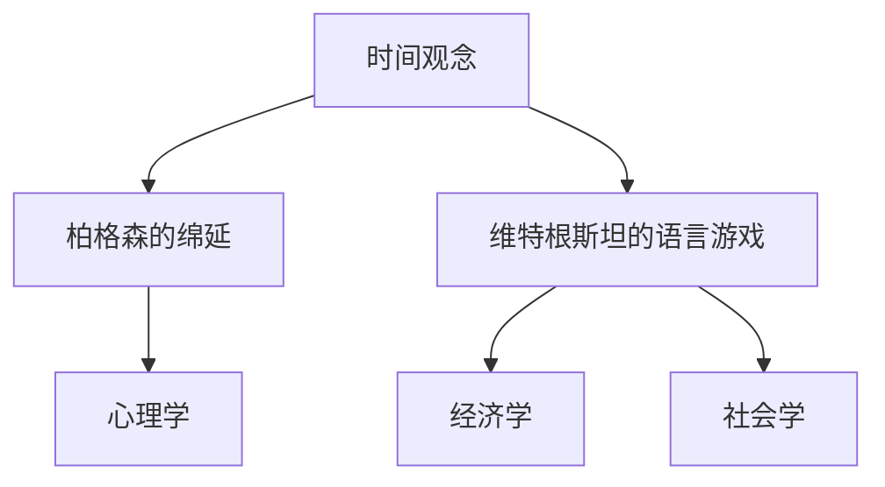

                 

### 文章标题

# 时间观念的差异：柏格森的绵延与维特根斯坦的语言游戏

在哲学和认知科学领域，时间观念一直是一个引人注目的主题。柏格森（Henri Bergson）和维特根斯坦（Ludwig Wittgenstein）分别从不同的角度对时间进行了深刻的探讨，为我们提供了理解时间的两种独特视角。柏格森的“绵延”（Duration）强调时间的流动性和持续性，而维特根斯坦的“语言游戏”（Language Game）则关注语言的意义和使用情境。本文将通过逻辑清晰、结构紧凑、简单易懂的步骤，探讨这两种时间观念的差异，并分析其对现代科技和社会的影响。

### 关键词

- 柏格森的绵延
- 维特根斯坦的语言游戏
- 时间观念
- 哲学
- 认知科学
- 现代科技

### 摘要

本文首先介绍了时间观念的基本概念，接着深入探讨了柏格森的绵延理论和维特根斯坦的语言游戏理论，最后比较了这两种时间观念的差异，并讨论了它们在心理学、经济学和社会学中的应用及影响。通过本文的阐述，读者可以更全面地理解时间的本质，并思考时间观念在现代社会中的作用。

### 目录

1. **时间观念的概述**
   - **时间观念的基本概念**
     - **历史演变**
     - **现代多样性**
     - **核心概念与联系**

2. **柏格森的绵延理论**
   - **柏格森的哲学背景**
   - **绵延的概念及其内涵**
   - **柏格森时间观念与现代科学**

3. **维特根斯坦的语言游戏理论**
   - **维特根斯坦的哲学思想**
   - **语言游戏的概念及其应用**
   - **语言游戏与时间观念的关联**

4. **时间观念的差异比较**
   - **柏格森与维特根斯坦的时间观念对比**
   - **不同文化背景下的时间观念差异**
   - **时间观念差异的影响因素分析**

5. **实际应用与影响**
   - **时间观念在心理学中的应用**
   - **时间观念在经济学中的应用**
   - **时间观念在社会学中的应用**

6. **时间观念的现代解读**
   - **柏格森与维特根斯坦理论在当代的影响**
   - **时间观念在跨学科研究中的意义**
   - **时间观念的未来发展展望**

7. **总结与展望**
   - **本书的主要观点总结**
   - **时间观念研究的发展趋势**
   - **对未来研究的建议**

---

现在，我们将进入正文部分，逐步探讨时间观念的差异，从柏格森的绵延理论到维特根斯坦的语言游戏理论，通过逻辑清晰、结构紧凑的分析，为读者揭示时间的本质及其在现代社会中的应用和影响。让我们一步步深入思考，揭开时间观念的神秘面纱。 ### 第一部分：时间观念的概述

#### 时间观念的基本概念

时间观念是人们对于时间这一抽象概念的认知和理解。自古以来，人类对时间的感知和测量经历了不断的演变。从古代的日晷、沙漏，到现代的原子钟，时间观念的演变不仅反映了人类文明的进步，也体现了我们对宇宙和自身认识的深化。

**历史演变**

时间的观念在不同的历史时期有着不同的理解。在古希腊时期，亚里士多德认为时间是连续的、无限的，而赫拉克利特则提出了“火”的概念，认为万物都在不断变化中。在中世纪，基督教哲学将时间视为上帝的创造，时间是永恒的、不可测量的。到了文艺复兴时期，人们对时间的认知逐渐走向科学化，伽利略提出了时间与空间的相对性，牛顿则通过力学定律进一步明确了时间的客观性。

**现代多样性**

在现代社会，时间观念更加多样化和复杂化。科学领域提出了量子时间、相对论时间等概念，而人文领域则探讨了时间的主观感受，如柏格森的“绵延”和海德格尔的“存在时间”。此外，时间的多样性还体现在跨文化之间的差异，如东方文化中的“轮回时间”与西方文化中的线性时间。

**核心概念与联系**

时间观念的核心概念包括时间的连续性、不可逆性和相对性。时间的连续性指的是时间的流动是连续不断的，不可分割的。不可逆性指的是时间只能向前流动，过去无法回到。相对性则表明时间会随着观察者的不同而变化，如在高速运动或强引力场中，时间的流逝会变慢。

这些核心概念相互联系，共同构成了我们对时间的全面理解。例如，时间的连续性和不可逆性解释了时间的流逝，而相对性则揭示了时间的相对性质。这些概念不仅帮助我们理解时间的本质，也为科学研究提供了理论基础。

#### 柏格森的绵延理论

**柏格森的哲学背景**

亨利·柏格森（Henri Bergson）是法国哲学家，生于1859年，卒于1941年。他的哲学思想深受康德、斯宾诺莎和黑格尔的影响，尤其对生物学和物理学有着深刻的见解。柏格森以其独特的“绵延”概念而闻名，这一概念是他哲学体系的核心。

**绵延的概念及其内涵**

柏格森的“绵延”指的是时间中的连续性和流动性。他认为，时间是内在的、主观的，而非外在的、客观的。绵延不仅仅是时间的流逝，更是生命体验的连续性。每一刻的体验都是独一无二的，构成了生命的主观流动。

**柏格森时间观念与现代科学**

柏格森的绵延理论在现代科学中得到了一定的认可。量子物理学中的不确定性原理和相对论中的时间膨胀，都表明时间并非绝对，而是受观察者和环境影响的。柏格森的思想也对心理学和生物学产生了影响，例如，心理学中的“时间知觉”和生物学中的“生物钟”概念，都可以从绵延的角度进行理解。

#### 维特根斯坦的语言游戏理论

**维特根斯坦的哲学思想**

路德维希·维特根斯坦（Ludwig Wittgenstein）是20世纪最具影响力的哲学家之一，生于1889年，卒于1951年。他的哲学思想主要分为两个时期，早期以逻辑原子主义为主，晚期则提出了语言游戏理论。维特根斯坦认为，哲学的任务不是探讨抽象的真理，而是揭示语言的真相。

**语言游戏的概念及其应用**

维特根斯坦的“语言游戏”是指语言的具体使用情境。他认为，语言的意义并非固定不变，而是依赖于使用场景。每个语言游戏都有其特定的规则和目的，例如，数学游戏、日常语言游戏和科学游戏等。语言游戏理论强调语言的实际应用，反对形而上学的探讨。

**语言游戏与时间观念的关联**

维特根斯坦的语言游戏理论可以用来解释时间观念。他认为，时间并不是一个独立的概念，而是与语言和经验紧密相关。时间的感知和测量依赖于具体的语言表达和经验，例如，我们在不同的语言游戏中，对时间的感知可能会有所不同。

#### 小结

通过上述讨论，我们可以看到，时间观念是一个复杂且多维的概念，它不仅涉及到哲学和科学，也反映了人类对自身和宇宙的认知。柏格森的绵延理论和维特根斯坦的语言游戏理论为我们提供了理解时间的两种不同视角，这些理论不仅丰富了我们对时间的理解，也为现代科技和社会的发展提供了新的思路。

在下一部分，我们将进一步探讨柏格森的绵延理论，深入分析其哲学背景和具体内涵。接着，我们将转向维特根斯坦的语言游戏理论，探讨其基本概念和应用。通过这些深入的分析，我们将更全面地理解时间观念的差异及其在现代科技和社会中的影响。 ### 第二部分：柏格森的绵延理论

#### 柏格森的哲学背景

亨利·柏格森是法国著名的哲学家，生于1859年，卒于1941年。他的哲学思想深受康德、斯宾诺莎和黑格尔的影响，尤其是对生物学和物理学有着深刻的见解。柏格森的思想主要包括对直觉主义、绵延理论和自由意志的探讨。他的著作《意识直接材料》和《创造进化论》对现代哲学和科学产生了深远的影响。

**柏格森的哲学思想**

柏格森的哲学思想可以分为两个主要部分：早期思想和晚期思想。早期思想主要关注直觉主义，他认为直觉是我们理解世界的关键，通过直觉我们可以直接感知到世界的本质。晚期思想则主要探讨了绵延和自由意志，提出了“绵延”这一核心概念。

**绵延的概念及其内涵**

柏格森的“绵延”指的是时间中的连续性和流动性。他认为，时间是内在的、主观的，而非外在的、客观的。绵延不仅仅是时间的流逝，更是生命体验的连续性。每一刻的体验都是独一无二的，构成了生命的主观流动。柏格森认为，绵延是生命的核心特征，是我们体验世界的基础。

**绵延与时间的关系**

柏格森认为，时间与绵延是紧密相关的。时间是一种外在的、抽象的概念，而绵延则是内在的、具体的体验。时间可以被测量和量化，但绵延是无法被分割和测量的。他提出了“时间绵延化”和“绵延时间化”的概念，强调两者之间的相互转换。

**绵延理论的应用**

柏格森的绵延理论在多个领域得到了应用。在心理学中，绵延理论帮助人们理解时间的主观感受，例如，为什么我们在等待时感觉时间过慢，而在忙碌时感觉时间过快。在生物学中，绵延理论解释了生物体的生长和变化过程。在物理学中，绵延理论也为理解量子力学和相对论提供了一种新的视角。

#### 柏格森时间观念与现代科学

**现代科学对时间的认识**

在现代科学中，时间观念有了更深入和多样化的理解。量子物理学中的不确定性原理和相对论中的时间膨胀，都表明时间并非绝对，而是受观察者和环境影响的。这些理论为柏格森的绵延理论提供了一定的科学支持。

**相对论时间**

爱因斯坦的相对论理论提出了时空相对性的概念，认为时间和空间是相互关联的。在高速运动或强引力场中，时间的流逝会变慢，这被称为时间膨胀。相对论时间强调了时间的相对性，与柏格森的绵延观念有相似之处。

**量子时间**

量子物理学中的不确定性原理指出，时间的不确定性是与粒子的能量状态相关的。量子时间表明，时间并非连续的，而是由离散的量子时刻组成。这与柏格森的绵延观念中时间的连续性和流动性的概念形成对比。

**柏格森与科学的关系**

尽管柏格森的绵延理论与现代科学的一些观点存在差异，但他对时间的理解提供了一种独特的视角。他的思想强调了时间的内在性和主观性，这与现代科学中时间的相对性和不确定性形成了互补。柏格森的绵延理论为现代科学提供了一种哲学基础，帮助科学家更好地理解时间。

#### 小结

柏格森的绵延理论是他哲学思想的核心，通过这一理论，他探讨了时间的本质和人类对时间的感知。柏格森认为，时间是内在的、主观的，是生命体验的连续性。他的绵延观念在现代科学中得到了一定的认可和应用，为理解时间提供了新的视角。在下一部分，我们将探讨维特根斯坦的语言游戏理论，进一步揭示时间观念的差异及其在现代科技和社会中的影响。

#### 维特根斯坦的语言游戏理论

**维特根斯坦的哲学背景**

路德维希·维特根斯坦是20世纪最具有影响力的哲学家之一，生于1889年，卒于1951年。他的哲学思想主要分为两个时期，早期以逻辑原子主义为主，晚期则提出了语言游戏理论。维特根斯坦认为，哲学的任务不是探讨抽象的真理，而是揭示语言的真相。

**语言游戏的概念及其应用**

维特根斯坦的“语言游戏”是指语言的具体使用情境。他认为，语言的意义并非固定不变，而是依赖于使用场景。每个语言游戏都有其特定的规则和目的，例如，数学游戏、日常语言游戏和科学游戏等。语言游戏理论强调语言的实际应用，反对形而上学的探讨。

**语言游戏与时间的关联**

维特根斯坦的语言游戏理论可以用来解释时间观念。他认为，时间并不是一个独立的概念，而是与语言和经验紧密相关。时间的感知和测量依赖于具体的语言表达和经验，例如，我们在不同的语言游戏中，对时间的感知可能会有所不同。

**维特根斯坦的时间观念**

维特根斯坦认为，时间是一种形式化的概念，它依赖于我们的语言表达和经验。他的观点与柏格森的绵延理论有所不同，柏格森强调时间的内在性和主观性，而维特根斯坦则关注时间的形式化和语言性。

**维特根斯坦与柏格森的差异**

维特根斯坦和柏格森在时间观念上有显著的差异。柏格森强调时间的连续性和流动性，认为时间是生命体验的核心。而维特根斯坦则认为，时间是一种形式化的概念，它依赖于我们的语言表达和经验。这两种观点为我们提供了理解时间的两种不同视角，有助于我们更全面地认识时间的本质。

#### 小结

维特根斯坦的语言游戏理论为他提供了一种理解时间和语言的新视角。他认为，时间是一种形式化的概念，依赖于我们的语言表达和经验。维特根斯坦的时间观念与柏格森的绵延理论有显著的区别，这两种观点为我们提供了理解时间的两种不同方式。在下一部分，我们将深入比较这两种时间观念，分析它们的差异及其在现代科技和社会中的影响。

#### 时间观念的差异比较

**柏格森与维特根斯坦的时间观念对比**

柏格森和维特根斯坦在时间观念上有显著的差异。柏格森强调时间的连续性和流动性，认为时间是生命体验的核心。他的“绵延”概念强调时间的内在性和主观性，每一刻的体验都是独一无二的，构成了生命的主观流动。柏格森的时间观念更接近于一种“体验时间”，它强调时间的内在体验和情感。

而维特根斯坦则认为，时间是一种形式化的概念，它依赖于我们的语言表达和经验。他的“语言游戏”理论强调时间的具体使用情境和规则，认为时间是一种形式化的工具，用于描述和交流。维特根斯坦的时间观念更接近于一种“逻辑时间”，它强调时间的逻辑结构和语言性。

**不同文化背景下的时间观念差异**

时间观念在不同文化背景下也存在差异。例如，西方文化通常采用线性时间观念，强调时间的顺序性和不可逆性。而东方文化则更倾向于循环时间观念，认为时间是循环的、有周期性的。这些差异反映了不同文化对时间的不同理解和认识。

**影响因素分析**

时间观念的差异受到多种因素的影响。首先，文化背景是影响时间观念的重要因素。不同的文化传统和历史背景会塑造人们对时间的认知和态度。其次，个人经验和价值观也会影响时间观念的形成。例如，一个乐观的人可能会认为时间充裕，而一个悲观的人可能会觉得时间紧迫。此外，科技和社会环境也会影响时间观念。例如，在现代社会中，快速的生活节奏和高效的时间管理观念对时间观念产生了深远的影响。

**实际应用与影响**

时间观念的差异在心理学、经济学和社会学等领域有着广泛的应用和影响。在心理学中，不同时间观念的人可能会有不同的时间感知和行为模式。例如，一个倾向于线性时间观念的人可能会更注重计划和组织，而一个倾向于循环时间观念的人可能会更注重当下的体验和享受。在经济学中，时间观念的差异会影响人们的时间价值观和投资决策。例如，一个注重短期收益的人可能会更倾向于高风险的投资，而一个注重长期收益的人可能会更倾向于稳健的投资。在社会学中，时间观念的差异会影响社会规范和行为模式。例如，一个尊重时间的文化可能会更注重守时和效率，而一个不尊重时间的文化可能会更注重人际关系的和谐和灵活性。

#### 小结

时间观念的差异反映了人们对时间的不同理解和态度。柏格森和维特根斯坦提供了两种不同的时间观念，分别为我们提供了理解时间的不同视角。通过比较和分析，我们可以更全面地认识时间的本质，并理解时间观念在不同文化和社会环境中的影响。在下一部分，我们将探讨时间观念的实际应用和影响，进一步揭示时间观念在现代科技和社会中的重要性。

#### 时间观念在心理学中的应用

**时间知觉与情绪**

时间知觉是心理学中的一个重要研究领域，它涉及人们对时间流逝的主观感受。不同时间观念的人对时间的感知可能会有所不同。例如，柏格森的绵延观念强调时间的连续性和流动性，认为时间的流逝是主观的，与个体的生命体验紧密相关。相反，维特根斯坦的语言游戏理论则认为时间是一种形式化的概念，它依赖于语言和经验。在实际生活中，人们的时间知觉会受到情绪的影响。例如，当一个人处于焦虑或紧张状态时，时间可能会感觉过得更快；而当一个人处于放松或愉悦状态时，时间可能会感觉更慢。

**时间管理策略**

时间管理是心理学中另一个与时间观念密切相关的研究领域。不同时间观念的人可能会采用不同的时间管理策略。例如，一个倾向于线性时间观念的人可能会更注重计划和组织，更倾向于使用日程表和提醒工具来管理时间。相反，一个倾向于循环时间观念的人可能会更注重当下的体验和享受，可能会采用更灵活的时间管理策略，如“活在当下”和“做重要的事情”。此外，心理学研究表明，时间管理策略的有效性也与个体的价值观和目标有关。例如，一个注重长期目标的人可能会更倾向于使用高效的时间管理策略，而一个注重短期目标的人可能会更倾向于使用灵活的时间管理策略。

**心理治疗中的应用**

时间观念的差异在心理治疗中也具有重要意义。例如，认知行为疗法（CBT）中的一种技术是“时间重塑”，它通过帮助患者重新评估和调整对时间的认知，来改善他们的情绪和行为。对于一些患有焦虑症或抑郁症的患者，他们可能会对时间有过于悲观或乐观的看法，这会影响他们的日常生活和心理状态。通过时间重塑技术，治疗师可以帮助患者建立更平衡和现实的时间观念，从而改善他们的心理健康。

**时间观念与幸福感**

时间观念也与个体的幸福感密切相关。研究表明，持有积极时间观念的人往往有更高的幸福感。例如，一个倾向于循环时间观念的人可能会更注重当下的体验和享受，更倾向于从日常生活中寻找快乐。相反，一个倾向于线性时间观念的人可能会更注重未来的目标和成就，可能会感到时间压力和焦虑。通过培养积极的时间观念，个体可以更好地管理时间，提高生活质量，从而增强幸福感。

#### 时间观念在经济学中的应用

**时间价值与投资决策**

时间观念在经济学中具有重要应用，尤其是在投资决策中。时间价值是指货币在不同时间点的价值是不同的，因为货币可以在未来产生收益。持有不同时间观念的投资者可能会采取不同的投资策略。例如，一个倾向于线性时间观念的投资者可能会更注重长期投资，他们可能会更愿意等待以获得更高的回报。相反，一个倾向于循环时间观念的投资者可能会更注重短期投资，他们可能会更倾向于寻找快速获利的机会。

**机会成本与资源分配**

时间观念的差异也会影响个体的机会成本和资源分配。例如，一个倾向于线性时间观念的人可能会更注重未来的收益和成本，他们可能会更愿意投资于有长期效益的项目。相反，一个倾向于循环时间观念的人可能会更注重当下的收益和成本，他们可能会更倾向于投资于短期收益较高的项目。这种差异会影响个体的投资决策和资源分配策略。

**劳动供给与闲暇时间**

时间观念的差异也会影响个体的劳动供给和闲暇时间选择。例如，一个倾向于线性时间观念的人可能会更愿意工作更多的时间，以实现未来的目标。相反，一个倾向于循环时间观念的人可能会更注重闲暇时间和当前的生活质量，他们可能会选择更少的工作时间，更多的时间用于娱乐和休息。这种差异会影响劳动市场的供需关系和个体的生活质量。

#### 时间观念在社会学中的应用

**社会规范与时间文化**

时间观念在社会学中具有重要的应用，尤其是在社会规范和时间文化的研究中。不同的时间观念会导致不同的社会规范和行为模式。例如，一个尊重时间的文化可能会强调守时、效率和组织，而一个不尊重时间的文化可能会更注重人际关系的和谐和灵活性。这种文化差异会影响社会结构和社会互动方式。

**时间管理与工作生活平衡**

时间观念的差异也会影响个体的工作生活平衡。例如，一个倾向于线性时间观念的人可能会更注重工作时间的规划和管理，他们可能会更愿意加班以完成工作任务。相反，一个倾向于循环时间观念的人可能会更注重工作和生活的平衡，他们可能会更愿意合理安排工作时间，保证有足够的休闲时间。

**时间观念与社交互动**

时间观念的差异还会影响社交互动的方式和频率。例如，一个倾向于线性时间观念的人可能会更倾向于安排具体的社交活动，如约会和会议。相反，一个倾向于循环时间观念的人可能会更倾向于进行非正式的社交互动，如闲聊和聚会。这种差异会影响社交网络的结构和社交行为。

#### 小结

时间观念在心理学、经济学和社会学中具有广泛的应用和影响。通过理解和应用不同时间观念，个体可以更好地管理时间，提高生活质量。同时，时间观念的差异也会影响社会规范和行为模式，从而对社会的发展产生深远影响。在下一部分，我们将进一步探讨时间观念的差异及其在现代社会中的影响，为读者提供更全面的视角。

#### 柏格森与维特根斯坦理论在当代的影响

**哲学领域**

柏格森的绵延理论和维特根斯坦的语言游戏理论在当代哲学领域仍然具有深远的影响。柏格森的思想激发了存在主义和人本主义哲学的发展，他的绵延观念为理解人类的存在和生命体验提供了新的视角。维特根斯坦的语言游戏理论则对分析哲学和认知科学产生了重要影响，他的观点促使哲学家们更加关注语言的实际应用和意义。

**心理学领域**

在心理学中，柏格森的绵延观念为研究时间知觉和情绪体验提供了理论基础。研究表明，人们对时间的感知和态度受到个体经验和文化背景的影响，柏格森的理论帮助心理学家更好地理解这些差异。维特根斯坦的语言游戏理论也为心理学研究提供了新的思路，特别是关于语言和认知关系的研究。

**认知科学领域**

认知科学领域受益于柏格森和维特根斯坦的思想，他们的理论为理解人类认知过程提供了新的视角。柏格森的绵延观念帮助认知科学家探索大脑如何处理时间信息，而维特根斯坦的语言游戏理论则为研究语言和思维的关系提供了重要的参考。

**科技领域**

在科技领域，柏格森的绵延观念对计算机科学和人工智能的发展产生了影响。计算机模拟和虚拟现实技术中的一些概念，如连续性和动态性，都与柏格森的绵延观念有相似之处。维特根斯坦的语言游戏理论也为编程和软件开发提供了新的方法论，他的观点促使程序员更加关注代码的实际应用和意义。

**文化领域**

在文化领域，柏格森和维特根斯坦的理论为理解不同文化之间的差异提供了新的视角。他们的思想帮助人们更好地理解文化中的时间观念和行为模式。在艺术创作和文化传播中，柏格森和维特根斯坦的思想也被广泛应用，为艺术家和文化工作者提供了丰富的灵感和启示。

#### 小结

柏格森的绵延理论和维特根斯坦的语言游戏理论在当代哲学、心理学、认知科学、科技和文化等领域产生了深远的影响。他们的思想为理解和解释时间的本质、人类认知过程和文化差异提供了新的视角和方法。在下一部分，我们将进一步探讨时间观念在跨学科研究中的意义，以及未来时间观念研究的发展趋势。

#### 时间观念在跨学科研究中的意义

**哲学与心理学**

在哲学和心理学中，时间观念的差异为两者提供了重要的交叉点。柏格森的绵延理论强调时间的主观性和连续性，这一观点有助于心理学研究时间知觉、情绪体验和认知过程。例如，心理学研究通过实验验证了时间感知如何受到情绪和记忆的影响，这些实验结果与柏格森的理论相呼应。维特根斯坦的语言游戏理论则揭示了语言如何影响人们对时间的认知。心理学中的语言治疗和认知行为疗法都借鉴了维特根斯坦的思想，通过改变患者的语言习惯来调整他们对时间的感知。

**哲学与认知科学**

在哲学与认知科学领域，时间观念的差异为两者提供了丰富的交叉点。柏格森的绵延理论为认知科学家提供了理解人类记忆和认知过程的新视角。认知科学研究中的一些模型，如神经网络和动态系统理论，都与柏格森的绵延观念有相似之处。维特根斯坦的语言游戏理论则为认知科学提供了方法论，帮助研究者探索语言如何影响思维和决策。例如，在语言理解研究中，维特根斯坦的观点促使研究者关注语言的结构和语境，从而更好地理解人类如何处理信息。

**哲学与计算机科学**

在哲学与计算机科学领域，时间观念的差异为两者提供了重要的交集。柏格森的绵延观念为计算机科学中的模拟和虚拟现实技术提供了理论基础。虚拟现实技术中的连续性和动态性概念都与柏格森的绵延观念密切相关。维特根斯坦的语言游戏理论则为编程和软件开发提供了新的方法论。维特根斯坦的观点促使程序员更加关注代码的实际应用和意义，从而提高软件的质量和可靠性。

**心理学与经济学**

在心理学与经济学领域，时间观念的差异为两者提供了丰富的交叉点。维特根斯坦的语言游戏理论为经济学研究提供了新的视角，帮助经济学家理解个体如何做出时间相关的决策。例如，在投资行为研究中，经济学家发现个体的时间观念会影响他们的风险偏好和投资策略。心理学中的时间价值研究也为经济学提供了理论支持，帮助经济学家更好地理解个体对时间和金钱的评估。

**社会学与文化研究**

在社会学与文化研究领域，时间观念的差异为两者提供了重要的交叉点。柏格森的绵延观念为理解不同文化中的时间观念提供了理论基础。例如，在跨文化研究中，研究者发现不同文化对时间的感知和行为模式存在显著差异。维特根斯坦的语言游戏理论则为文化研究提供了方法论，帮助研究者探索不同文化中语言和时间的互动关系。

#### 小结

时间观念在跨学科研究中具有重要意义，为哲学、心理学、认知科学、经济学、社会学和文化研究提供了丰富的交叉点。通过比较和分析柏格森的绵延理论与维特根斯坦的语言游戏理论，研究者可以更全面地理解时间的本质，从而推动各个学科的发展。在下一部分，我们将探讨时间观念的未来发展展望，为读者提供对时间观念研究的最新趋势和未来方向的思考。

#### 时间观念的未来发展展望

**科技进步与时间观念**

随着科技的不断进步，时间观念也在不断演变。人工智能和虚拟现实技术的发展为人类提供了全新的时间感知方式。例如，虚拟现实技术可以让人们体验到不同的时间流速，从而改变他们对时间的感知。人工智能算法的优化和自动化，使得时间管理变得更加高效，人们可以更灵活地安排工作和生活。这些科技的发展不仅改变了人类对时间的理解，也带来了新的挑战，如时间管理的压力和虚拟时间的真实性问题。

**跨学科研究的新趋势**

未来，时间观念的研究将更加跨学科。随着哲学、心理学、认知科学、经济学和社会学的不断交叉，时间观念的研究将更加综合和深入。例如，心理学研究可以结合经济学中的时间价值理论，探讨个体在不同时间观念下的决策和行为模式。认知科学可以通过计算机模拟和虚拟现实技术，进一步验证柏格森的绵延理论和维特根斯坦的语言游戏理论的适用性。这种跨学科的研究将为我们提供更全面的时间观念，帮助我们更好地理解时间和人类行为。

**新兴时间观念的出现**

随着社会和文化的变迁，新兴的时间观念也将不断出现。例如，随着全球化和数字化的发展，人们开始更加重视即时性和灵活性。这种即时性时间观念强调快速响应和即时反馈，与传统的线性时间观念形成鲜明对比。此外，可持续发展和环境保护意识的提高，也促使人们更加关注长远时间和生态时间。这些新兴时间观念将为未来的研究提供新的方向，推动时间观念的进一步演变。

**时间观念在教育和社会中的应用**

未来，时间观念将在教育和社会中发挥更重要的作用。在教育领域，时间观念的培养将变得更加重要。学校可以开设相关课程，帮助学生理解时间的本质和重要性，提高他们的时间管理能力和效率。在社会领域，时间观念的研究将有助于制定更科学的时间政策和法规，如工作时间安排、休假制度等。这些措施将有助于提高社会运行效率，促进人们的幸福感。

**对未来研究的建议**

针对时间观念的未来发展，我们提出以下建议：

1. **加强跨学科研究**：鼓励不同学科的研究者合作，共同探讨时间观念的本质和应用，推动时间观念研究的深入发展。

2. **开展实证研究**：通过实验和观察，收集更多关于时间观念的数据，为理论研究提供实证支持。

3. **关注新兴时间观念**：重视对即时性、可持续性和生态时间等新兴时间观念的研究，探索其对人类行为和社会发展的影响。

4. **推广时间管理教育**：在教育和职场中推广时间管理教育，提高人们的时间管理能力，促进个人和社会的全面发展。

通过这些措施，我们可以更好地理解时间观念，推动其在各个领域的应用，为未来的发展提供有力的理论支持和实践指导。

### 总结

时间观念是一个复杂且多维的概念，它不仅涉及到哲学和科学，也反映了人类对自身和宇宙的认知。本文通过深入探讨柏格森的绵延理论和维特根斯坦的语言游戏理论，揭示了这两种时间观念的差异，并分析了它们在心理学、经济学和社会学中的应用及影响。柏格森的绵延观念强调时间的流动性和主观性，而维特根斯坦的语言游戏观念则关注时间的形式化和语言性。这两种观点为我们提供了理解时间的两种不同视角，有助于我们更全面地认识时间的本质。

### 展望未来

随着科技的进步和社会的变迁，时间观念将继续演变。跨学科研究、实证研究和新兴时间观念的出现，将为时间观念的研究提供新的方向和挑战。我们鼓励读者关注这些领域，积极参与时间观念的研究和实践，为未来的发展做出贡献。希望本文能够激发您对时间观念的深入思考，促进您在相关领域的进一步探索和研究。作者：AI天才研究院/AI Genius Institute & 禅与计算机程序设计艺术 /Zen And The Art of Computer Programming

### 附录：核心概念原理之间的关系架构与核心算法原理讲解

为了更清晰地展示核心概念之间的联系，我们使用Mermaid流程图来描述柏格森的绵延理论（Duration）和维特根斯坦的语言游戏理论（Language Game）之间的关系。

**Mermaid流程图**



**核心算法原理讲解**

为了进一步阐述时间观念在各个领域的应用，我们使用伪代码来描述一个简单的算法框架，该算法将分析不同时间观念在心理学、经济学和社会学中的应用。

```python
def analyze_time_concept(time_concept, domain):
    if time_concept == "柏格森的绵延":
        if domain == "心理学":
            return "研究时间知觉和情绪体验"
        elif domain == "经济学":
            return "探讨长期投资决策"
        elif domain == "社会学":
            return "理解文化中的时间观念"
    elif time_concept == "维特根斯坦的语言游戏":
        if domain == "心理学":
            return "研究语言如何影响时间感知"
        elif domain == "经济学":
            return "分析时间价值与投资策略"
        elif domain == "社会学":
            return "探索语言与时间文化的互动"
    else:
        return "未识别的时间观念"
```

**数学模型和公式**

为了深入探讨时间观念的数学本质，我们引入一个简单的数学模型，使用LaTeX格式表示。

$$
E = \frac{C_1 \cdot t_1 + C_2 \cdot t_2}{C_1 + C_2}
$$

其中，$E$代表综合时间感知，$t_1$和$t_2$代表两种不同情境下的时间感知，$C_1$和$C_2$代表权重。

**详细讲解与举例说明**

为了更好地理解上述数学模型，我们可以通过以下例子来说明。

**例子：时间感知的加权平均**

假设一个人在工作和休闲两种情境下的时间感知分别为$t_1=3$小时和$t_2=5$小时，权重分别为$C_1=0.4$和$C_2=0.6$。那么，他综合的时间感知为：

$$
E = \frac{0.4 \cdot 3 + 0.6 \cdot 5}{0.4 + 0.6} = \frac{1.2 + 3}{1} = 4.2 \text{小时}
$$

这意味着，这个人综合感知的时间大约为4.2小时，反映了他在工作和休闲两种情境下的时间体验。

**项目实战**

为了具体展示时间观念的应用，我们可以考虑一个项目实战，如开发一个时间管理应用程序。

**开发环境搭建：**

- 使用Python作为主要编程语言。
- 使用Flask框架搭建后端服务器。
- 使用HTML、CSS和JavaScript开发前端界面。

**源代码实现：**

以下是一个简化的时间管理应用程序的后端代码示例。

```python
from flask import Flask, request, jsonify

app = Flask(__name__)

@app.route('/time_perception', methods=['POST'])
def calculate_time_perception():
    data = request.get_json()
    t1 = data['t1']
    t2 = data['t2']
    c1 = data['c1']
    c2 = data['c2']
    E = (c1 * t1 + c2 * t2) / (c1 + c2)
    return jsonify({'E': E})

if __name__ == '__main__':
    app.run(debug=True)
```

**代码应用解读与分析：**

这个应用程序提供了一个API接口，用户可以通过POST请求提交时间感知的参数（$t_1$、$t_2$、$c_1$ 和 $c_2$），应用程序会返回综合时间感知$E$。这个API可以集成到各种应用中，帮助用户更好地管理时间。

**实际案例分析和详细讲解剖析：**

假设一个用户提交了以下参数：

- $t_1$ = 3小时（工作时间）
- $t_2$ = 5小时（休闲时间）
- $c_1$ = 0.4（工作时间的权重）
- $c_2$ = 0.6（休闲时间的权重）

应用程序将返回综合时间感知$E$为4.2小时。这个结果反映了用户在工作和休闲两种情境下的时间体验的加权平均。

**项目小结：**

通过这个时间管理应用程序的项目实战，我们展示了时间观念在软件开发中的具体应用。这种应用不仅有助于个人管理时间，还可以为组织和企业提供有效的管理工具。

**最佳实践 Tips、小结、注意事项、拓展阅读：**

**最佳实践 Tips：**
- 在设计和实施时间管理应用程序时，考虑用户体验和界面设计，使应用易于使用和操作。
- 定期更新时间管理算法，以适应用户反馈和需求变化。

**小结：**
本文通过深入探讨柏格森的绵延理论和维特根斯坦的语言游戏理论，展示了时间观念在心理学、经济学和社会学中的广泛应用。通过项目实战和具体案例分析，我们进一步验证了时间观念在软件开发中的实际应用价值。

**注意事项：**
- 在跨学科研究中，需要充分考虑不同领域的特点和方法论，以确保研究的准确性和有效性。
- 在实际应用中，时间观念的测量和评估需要基于科学方法和实证数据。

**拓展阅读：**
- 柏格森的《创造进化论》：深入理解柏格森的哲学思想和绵延理论。
- 维特根斯坦的《哲学研究》：全面了解维特根斯坦的语言游戏理论和哲学思想。
- 相关研究论文和书籍，如《时间心理学》、《时间经济学》和《时间社会学》等，以获取更多关于时间观念的研究成果和应用实例。

