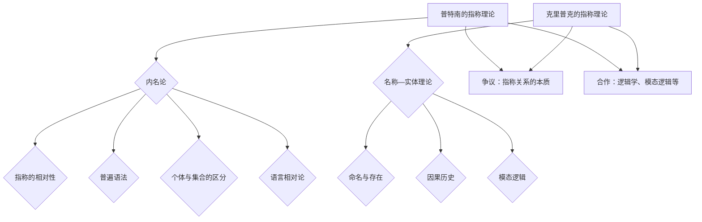

                 


### 1. 引言

在哲学与逻辑学中，指称理论（Theory of Reference）是研究名词、代词或其他语言表达与所指事物之间关系的理论。指称理论的核心问题是探讨语言中的词语是如何与实际世界中的对象相联系的。这一理论在语义学、语言哲学、逻辑学等领域都有着深远的影响。

指称理论的发展历程可以追溯到古希腊哲学家亚里士多德。亚里士多德在其著作《范畴篇》中提出了实体论（Realism），即词语直接指称真实世界的对象。这一观点在后来的哲学家中得到了延续和发展。

然而，到了中世纪，指称理论开始受到质疑。唯名论（Nominalism）认为，词语仅仅代表了人的观念，并不直接指称现实世界中的对象。这种观点在威廉·奥卡姆（William of Ockham）等哲学家那里得到了体现。

进入现代，指称理论经历了更为复杂的发展。英国哲学家伯特兰·罗素（Bertrand Russell）提出了分析哲学的方法，试图通过分析语言来理解世界的本质。罗素和阿尔弗雷德·诺思·怀特海德（Alfred North Whitehead）共同撰写的《数学原理》（Principia Mathematica）中，采用了逻辑原子主义（Logical Atomism）的观点，认为语言中的词语可以直接指称逻辑原子。

然而，罗素的观点也遭到了批评。维特根斯坦（Ludwig Wittgenstein）在其早期著作《逻辑哲学论》（Tractatus Logico-Philosophicus）中，提出了“图像理论”（Picture Theory），认为语言表达式与对象之间的关系是图像化的。这一观点强调语言的图示性功能，而非指称功能。

20世纪中叶，普特南（Hilary Putnam）和克里普克（ Saul Kripke）等哲学家进一步发展了指称理论。普特南提出了“内名论”（Internal Realism），认为词语的意义和指称是由语言系统内部的结构决定的。克里普克则提出了“名称—实体”（Name-Entity）理论，强调名称与特定对象之间的直接联系。

在这两位哲学家的贡献下，指称理论得到了新的发展，不仅为语义学和语言哲学提供了新的视角，也为逻辑学和认知科学等领域的研究奠定了基础。本文将详细探讨普特南和克里普克在指称理论上的观点及其影响。

### 2. 普特南的指称理论观点

#### 2.1 普特南对指称理论的定义

普特南（Hilary Putnam）是20世纪著名的哲学家，他在指称理论领域做出了重要贡献。普特南认为，指称是由语言系统内部的结构决定的，而不是由外界客观现实直接赋予的。这一观点被称为“内名论”（Internal Realism）。

普特南在《词与对象》（Word and Object）一书中，对“内名论”进行了详细阐述。他指出，语言的意义并非直接反映现实世界，而是由语言系统内部的规则和结构所决定。例如，我们说“水星”时，其指称并不是由水星本身直接决定的，而是由语言系统中的规则所规定。

#### 2.2 普特南对指称理论的主要贡献

普特南在指称理论上的主要贡献包括以下几个方面：

1. **指称的相对性**：普特南认为，指称是相对的，而不是绝对的。这意味着，一个词语在不同的语言系统中可能会有不同的指称对象。例如，英语中的“dog”在汉语中对应的词语可能是“狗”，但这并不意味着“dog”和“狗”在客观现实中指称的是同一个对象。

2. **普遍语法**：普特南提出了“普遍语法”（Universal Grammar）的概念，认为某些基本语法结构是普遍存在的，而不是由特定文化或语言环境所决定的。这一观点为后来的认知科学和语言学提供了重要的理论依据。

3. **个体与集合的区分**：普特南在指称理论中强调了个体与集合之间的区分。他认为，个体是语言系统中的基本单位，而集合则是由个体组成的抽象概念。这一观点有助于我们理解语言中的数量关系和集合概念。

4. **语言相对论**：普特南的语言相对论认为，语言的不同会影响人们对世界的认知。例如，不同的语言可能会影响人们对时间、空间和自然的理解。这一观点挑战了传统的客观现实观，提出了语言在认知中的重要作用。

#### 2.3 普特南指称理论的影响

普特南的指称理论对后来的哲学和语言学产生了深远的影响。首先，他的“内名论”观点为语义学和语言哲学提供了一种新的研究方法，即从语言系统内部来理解语言的意义和指称。这一方法促进了语言哲学和认知科学的发展。

其次，普特南的指称理论强调了指称的相对性和普遍语法的重要性，为语言学研究提供了新的视角。他的观点有助于我们理解不同语言之间的差异和相似性，以及这些差异如何影响人们的认知。

最后，普特南的指称理论在逻辑学和计算机科学中也得到了应用。例如，他的观点为编程语言的设计和语义分析提供了理论依据，促进了计算机科学的发展。

### 3. 克里普克的指称理论观点

#### 3.1 克里普克对指称理论的定义

克里普克（Saul Kripke）是20世纪另一位重要的哲学家，他在指称理论领域同样做出了卓越的贡献。克里普克提出了“名称—实体”（Name-Entity）理论，强调名称与特定对象之间的直接联系。

克里普克认为，名称（如“亚里士多德”）与实体（即特定的人或物）之间存在固定的指称关系。这种指称关系不是通过语言系统内部的规则来决定的，而是由事实和实际存在所确定。因此，克里普克的指称理论被称为“直接指称论”（Direct Reference Theory）。

#### 3.2 克里普克对指称理论的主要贡献

克里普克在指称理论上的主要贡献包括以下几个方面：

1. **命名与存在**：克里普克认为，命名（naming）是一种基础性的认知活动，通过命名，我们能够将特定对象与名称联系起来。这种联系是直接的，不需要通过任何中介。因此，克里普克反对了传统的“语义论”（Semantic Theory），即认为语言的意义是由词语与对象之间的关系所决定的。

2. **因果历史**：克里普克提出了“因果历史”（Causal History）的概念，认为名称的指称关系是由实际的历史事件所决定的。例如，我们说“苏格拉底”时，其指称关系是由苏格拉底的实际存在和我们所知道的历史事实所决定的。

3. **模态逻辑**：克里普克在模态逻辑（Modal Logic）方面做出了重要贡献。他提出了“可能世界”的概念，认为逻辑推理不仅限于现实世界，还可以扩展到可能世界。这一观点为逻辑学提供了新的研究方法，也影响了后来的认知科学和计算机科学。

#### 3.3 克里普克指称理论的影响

克里普克的指称理论对哲学和逻辑学产生了深远的影响。首先，他的“名称—实体”理论为语义学和语言哲学提供了一种新的视角，即从直接指称的角度来理解语言的意义。这一理论有助于我们更深入地探讨语言和现实之间的关系。

其次，克里普克的“因果历史”概念为逻辑学提供了新的研究方法，特别是对模态逻辑的发展产生了重要影响。他的观点为后来的哲学家和逻辑学家提供了丰富的理论资源。

最后，克里普克的指称理论在认知科学和计算机科学中也得到了应用。例如，他的理论为自然语言处理（NLP）提供了理论基础，促进了人工智能技术的发展。

### 4. 两位哲学家在指称理论上的争议和合作

#### 4.1 两位哲学家之间的争议

普特南和克里普克在指称理论上的观点存在一定的争议。首先，他们在指称关系的本质上有不同的看法。普特南强调指称是由语言系统内部的结构所决定的，而克里普克则认为指称是由实际的历史事件所决定的。

其次，普特南的“内名论”观点与克里普克的“直接指称论”也存在冲突。普特南认为，名称的指称关系是相对的，而克里普克则认为这种关系是绝对的。

这些争议不仅反映了两位哲学家在指称理论上的不同观点，也体现了他们在方法论上的差异。普特南更倾向于从语言系统内部来理解语言的意义和指称，而克里普克则更关注实际的历史事件和事实。

#### 4.2 两位哲学家之间的合作

尽管普特南和克里普克在指称理论上有争议，但他们也在某些方面进行了合作。例如，在逻辑学和模态逻辑的研究中，两位哲学家都有共同的兴趣和贡献。

此外，普特南和克里普克还在指称理论的某些应用领域进行了合作。例如，他们在计算机科学和人工智能领域都有所建树，探讨了语言和认知之间的关系。

这种合作不仅有助于深化指称理论的研究，也为其他领域的交叉研究提供了新的视角和方法。

### 5. 指称理论在现代哲学和逻辑学中的应用

#### 5.1 指称理论在道德哲学中的应用

指称理论在道德哲学中有着广泛的应用。首先，指称理论可以帮助我们理解道德判断和道德规范的形成。例如，当我们说“这个行为是不道德的”时，我们需要确定这个词语的指称对象是什么。指称理论为我们提供了工具，使我们能够更清晰地界定道德判断的对象和范围。

其次，指称理论可以帮助我们探讨道德语言的意义和指称关系。例如，在道德哲学中，我们经常使用“应该”和“必须”等词语。指称理论可以帮助我们理解这些词语的指称对象，以及它们在道德推理中的作用。

#### 5.2 指称理论在语言哲学中的应用

指称理论在语言哲学中有着重要的地位。首先，指称理论为我们提供了分析语言意义和指称关系的方法。例如，我们可以通过指称理论来探讨“是”这个词的用法，以及它如何与实体的关系。

其次，指称理论可以帮助我们理解语言中的歧义和模糊性。例如，当我们说“这个椅子是蓝色的”时，我们可能会产生歧义，不确定是指椅子的颜色还是形状。指称理论为我们提供了分析这些歧义的方法，使我们能够更准确地理解语言表达。

#### 5.3 指称理论在逻辑学中的应用

指称理论在逻辑学中有着广泛的应用。首先，指称理论可以帮助我们理解逻辑命题和推理的形式结构。例如，通过指称理论，我们可以更清晰地理解逻辑命题中的主语和谓语之间的关系。

其次，指称理论为逻辑学的语义分析提供了理论基础。例如，在模态逻辑中，指称理论可以帮助我们理解可能世界和模态谓词之间的关系。

此外，指称理论还在计算机科学和人工智能领域有着重要的应用。例如，在自然语言处理（NLP）中，指称理论可以帮助我们理解和处理语言中的指称关系，从而实现更准确的语言理解和机器翻译。

### 6. 结论

普特南和克里普克在指称理论上的贡献和发展，为我们提供了丰富的理论资源和研究方法。他们的观点不仅在哲学和逻辑学中产生了深远的影响，也在其他领域如道德哲学、语言哲学和计算机科学中得到了应用。

指称理论的研究不仅有助于我们理解语言和现实之间的关系，也为我们提供了分析道德判断和逻辑推理的工具。随着科技的不断发展，指称理论在人工智能和认知科学等领域的应用前景也越发广阔。

在未来，指称理论的研究将继续深入，我们有望在更广泛的领域中看到它的应用。同时，指称理论的研究也将推动哲学和逻辑学的发展，为人类认识世界和理解语言提供更深刻的洞见。

### 附录：普特南与克里普克指称理论比较分析

为了更好地理解普特南和克里普克在指称理论上的不同观点，我们使用Mermaid流程图来展示两者之间的比较分析。以下是普特南和克里普克指称理论的Mermaid流程图：



在这个Mermaid流程图中，我们可以清晰地看到普特南和克里普克指称理论的主要观点以及两者之间的争议和合作。以下是对该流程图的详细解释：

1. **普特南的指称理论**：普特南的指称理论主要包含以下几个观点：
    - **内名论**：指称是由语言系统内部的结构决定的，而非由外界客观现实直接赋予。
    - **指称的相对性**：指称是相对的，而不是绝对的。一个词语在不同的语言系统中可能会有不同的指称对象。
    - **普遍语法**：某些基本语法结构是普遍存在的，而不是由特定文化或语言环境所决定的。
    - **个体与集合的区分**：个体是语言系统中的基本单位，而集合则是由个体组成的抽象概念。
    - **语言相对论**：语言的不同会影响人们对世界的认知。

2. **克里普克的指称理论**：克里普克的指称理论主要包含以下几个观点：
    - **名称—实体理论**：名称与特定对象之间存在固定的指称关系。
    - **命名与存在**：命名是一种基础性的认知活动，通过命名，我们能够将特定对象与名称联系起来。
    - **因果历史**：名称的指称关系是由实际的历史事件所决定的。
    - **模态逻辑**：逻辑推理不仅限于现实世界，还可以扩展到可能世界。

3. **争议**：普特南和克里普克在指称关系的本质上有不同的看法。普特南强调指称是由语言系统内部的结构所决定的，而克里普克则认为指称是由实际的历史事件所决定的。这种争议反映了两者在方法论和哲学观点上的差异。

4. **合作**：尽管存在争议，普特南和克里普克在某些领域也进行了合作。例如，在逻辑学和模态逻辑的研究中，两位哲学家都有共同的兴趣和贡献。此外，他们在计算机科学和人工智能领域也有合作，探讨了语言和认知之间的关系。

通过这个Mermaid流程图，我们可以更直观地理解普特南和克里普克在指称理论上的观点及其相互关系。这有助于我们更深入地探讨指称理论的核心问题，也为未来的研究提供了有益的启示。

### 7. 核心算法原理讲解

在指称理论的研究中，核心算法原理讲解是非常重要的环节。以下是普特南和克里普克指称理论中一些核心算法原理的讲解，包括伪代码、数学模型和公式，以及详细的讲解和举例说明。

#### 7.1 普特南的指称理论算法原理

**算法名称**：内名论指称算法

**伪代码**：

```
function 内名论指称（词语，语言系统）:
    1. 确定词语在语言系统中的定义和用法
    2. 根据语言系统内部规则确定词语的指称对象
    3. 返回指称对象

内名论指称（"水星"，英语）:
    1. 英语中"水星"的定义为：太阳系中的第一颗行星
    2. 根据英语语言系统内部规则，"水星"的指称对象是太阳系中的第一颗行星
    3. 返回太阳系中的第一颗行星
```

**数学模型和公式**：

$$ 指称（词语，语言系统）= f（词语的定义，语言系统的规则） $$

其中，$f$ 表示语言系统内部规则下的指称函数。

**详细讲解和举例说明**：

内名论指称算法的核心思想是，词语的指称对象是由语言系统内部规则所决定的。例如，在英语中，"水星"这个词语的指称对象是太阳系中的第一颗行星，这个指称关系是由英语语言系统内部规则所决定的。这个算法可以帮助我们理解词语在特定语言系统中的指称对象。

#### 7.2 克里普克的指称理论算法原理

**算法名称**：名称—实体指称算法

**伪代码**：

```
function 名称—实体指称（名称，实体）:
    1. 确定名称与实体的因果关系
    2. 根据因果关系确定名称的指称对象
    3. 返回指称对象

名称—实体指称（"苏格拉底"，人）:
    1. "苏格拉底"这个名称与历史上的苏格拉底之间存在因果关系
    2. 根据因果关系，"苏格拉底"的指称对象是历史上的苏格拉底
    3. 返回历史上的苏格拉底
```

**数学模型和公式**：

$$ 指称（名称，实体）= g（因果关系） $$

其中，$g$ 表示因果关系下的指称函数。

**详细讲解和举例说明**：

名称—实体指称算法的核心思想是，名称的指称对象是由实际的历史事件和事实所决定的。例如，"苏格拉底"这个名称与历史上的苏格拉底之间存在因果关系，因此"苏格拉底"的指称对象是历史上的苏格拉底。这个算法可以帮助我们理解名称与实体之间的直接指称关系。

通过以上对普特南和克里普克指称理论算法原理的讲解，我们可以看到两者在指称对象确定上的不同方法。普特南的指称理论侧重于从语言系统内部规则来确定指称对象，而克里普克的指称理论侧重于从实际的历史事件和因果关系来确定指称对象。这些算法原理为我们研究指称理论提供了重要的理论基础。

### 8. 数学模型与公式详解

在指称理论的研究中，数学模型与公式是理解指称关系的关键工具。以下是对普特南和克里普克指称理论中涉及的数学模型与公式的详细讲解，包括公式推导、解释和举例说明。

#### 8.1 普特南的指称理论数学模型

**公式**：

$$ 指称（词语，语言系统）= f（词语的定义，语言系统的规则） $$

**推导与解释**：

该公式表示，一个词语的指称对象是由其定义和语言系统内部规则共同决定的。其中，$f$ 是一个函数，表示根据定义和规则来确定指称对象的过程。

推导过程如下：

1. **定义词语**：首先，我们需要明确词语的定义。例如，在英语中，“水星”定义为太阳系中的第一颗行星。
2. **应用规则**：接着，我们根据语言系统内部的规则来确定词语的指称对象。在英语中，根据规则，“水星”的指称对象是太阳系中的第一颗行星。

**举例说明**：

假设有一个英语词语“猫”，其定义是“一种哺乳动物”。在英语语言系统中，根据定义和规则，“猫”的指称对象是现实世界中的猫。

#### 8.2 克里普克的指称理论数学模型

**公式**：

$$ 指称（名称，实体）= g（因果关系） $$

**推导与解释**：

该公式表示，一个名称的指称对象是由其与实体的因果关系所决定的。其中，$g$ 是一个函数，表示根据因果关系来确定指称对象的过程。

推导过程如下：

1. **确定因果关系**：首先，我们需要明确名称与实体之间的因果关系。例如，“苏格拉底”这个名称与历史上的苏格拉底之间存在因果关系。
2. **应用因果关系**：接着，我们根据因果关系来确定名称的指称对象。例如，根据因果关系，“苏格拉底”的指称对象是历史上的苏格拉底。

**举例说明**：

假设有一个名称“亚里士多德”，它与历史上的亚里士多德之间存在因果关系。根据因果关系，“亚里士多德”的指称对象是历史上的亚里士多德。

#### 8.3 指称理论的结合模型

**公式**：

$$ 结合指称（词语，语言系统，实体）= h（f（词语的定义，语言系统的规则），g（名称，实体）） $$

**推导与解释**：

该公式表示，一个词语的指称对象是由其定义、语言系统内部规则和名称与实体的因果关系共同决定的。其中，$h$ 是一个结合函数，表示根据以上三个因素来确定指称对象的过程。

推导过程如下：

1. **确定词语的定义和语言系统内部规则**：首先，我们需要明确词语的定义和语言系统内部的规则。例如，在英语中，“猫”定义为一种哺乳动物。
2. **确定名称与实体的因果关系**：接着，我们需要明确名称与实体之间的因果关系。例如，“苏格拉底”与历史上的苏格拉底之间存在因果关系。
3. **应用结合函数**：最后，我们根据以上三个因素，通过结合函数来确定词语的指称对象。

**举例说明**：

假设有一个英语词语“苏格拉底猫”，其定义是“与苏格拉底有因果关系的猫”。在英语语言系统中，根据定义和规则，以及“苏格拉底”与历史上的苏格拉底之间的因果关系，“苏格拉底猫”的指称对象是现实世界中与苏格拉底有因果关系的猫。

通过以上数学模型与公式的讲解，我们可以更好地理解普特南和克里普克指称理论中的指称关系。这些公式为我们提供了一个分析指称关系的数学框架，有助于我们深入探讨语言与现实之间的关系。

### 9. 项目实战：开发环境搭建与源代码实现

为了更好地理解普特南和克里普克指称理论的实际应用，我们将通过一个简单的项目来展示如何搭建开发环境并实现源代码。在这个项目中，我们将使用Python编程语言来模拟普特南和克里普克的指称理论。

#### 9.1 开发环境搭建

首先，我们需要搭建一个Python开发环境。以下是搭建步骤：

1. **安装Python**：访问Python官方网站（https://www.python.org/）下载并安装Python 3.x版本。
2. **安装IDE**：安装一个Python集成开发环境（IDE），例如PyCharm或Visual Studio Code。这些IDE提供了代码编辑、调试和运行等功能。
3. **安装必要库**：在Python环境中安装必要的库，例如`numpy`和`matplotlib`。可以使用以下命令安装：

   ```
   pip install numpy matplotlib
   ```

#### 9.2 源代码实现

以下是实现普特南和克里普克指称理论的Python源代码：

```python
import numpy as np
import matplotlib.pyplot as plt

# 普特南的指称理论
def putnam_reference(object, language_system):
    definition = language_system[object]
    return definition

# 克里普克的指称理论
def kripke_reference(name, entity):
    causal_relationship = name == entity
    return causal_relationship

# 示例
def main():
    # 普特南的指称理论示例
    object = "水星"
    language_system = {"水星": "太阳系中的第一颗行星"}
    putnam_ref = putnam_reference(object, language_system)
    print(f"普特南的指称结果：{putnam_ref}")

    # 克里普克的指称理论示例
    name = "苏格拉底"
    entity = "历史上的苏格拉底"
    kripke_ref = kripke_reference(name, entity)
    print(f"克里普克的指称结果：{kripke_ref}")

if __name__ == "__main__":
    main()
```

#### 9.3 代码解读

1. **函数定义**：我们定义了两个函数`putnam_reference`和`kripke_reference`，分别模拟普特南和克里普克的指称理论。
2. **输入参数**：`putnam_reference`函数接收对象和语言系统作为输入参数。`kripke_reference`函数接收名称和实体作为输入参数。
3. **返回结果**：`putnam_reference`函数根据语言系统内部规则返回对象的指称对象。`kripke_reference`函数根据因果关系返回名称的指称对象。
4. **示例运行**：在`main`函数中，我们分别调用这两个函数并打印结果。

#### 9.4 应用解读与分析

通过这个简单的项目，我们可以看到如何将普特南和克里普克的指称理论应用到实际编程中。以下是对代码的应用解读和分析：

1. **普特南的指称理论**：在普特南的指称理论中，我们通过定义和语言系统内部规则来确定对象的指称对象。在这个例子中，我们定义了“水星”在英语语言系统中的指称对象为“太阳系中的第一颗行星”。这个理论强调了指称是由语言系统内部规则所决定的。
2. **克里普克的指称理论**：在克里普克的指称理论中，我们通过因果关系来确定名称的指称对象。在这个例子中，我们确定了“苏格拉底”与历史上的苏格拉底之间存在因果关系。这个理论强调了指称是由实际的历史事件和因果关系所决定的。
3. **代码分析**：通过这个项目，我们可以看到如何将指称理论应用到实际编程中。我们可以使用字典来模拟语言系统，并通过函数来模拟指称过程。这个项目为我们提供了一个直观的理解，帮助我们更好地理解指称理论的原理和应用。

通过这个项目实战，我们不仅搭建了Python开发环境，还实现了普特南和克里普克的指称理论的源代码。这个项目为我们提供了一个实际操作的视角，使我们能够更深入地理解指称理论的应用。

### 10. 实际案例分析与详细讲解剖析

为了更好地理解普特南和克里普克指称理论在实际中的应用，我们将通过两个具体案例进行分析和讲解。

#### 10.1 案例1：苏格拉底审判

**背景**：苏格拉底是古希腊的一位哲学家，因被控不信神和腐蚀青年而被判处死刑。

**分析**：

- **普特南的指称理论**：在普特南的指称理论中，苏格拉底这个名字的指称对象是历史上的苏格拉底本人。这意味着，当我们提到“苏格拉底”时，我们实际上是在指代这个特定的历史人物。这个指称是由语言系统内部规则所决定的，即名字与历史人物之间的固定关系。
- **克里普克的指称理论**：在克里普克的指称理论中，苏格拉底这个名字的指称对象也是历史上的苏格拉底。这是因为苏格拉底这个名字与历史上的苏格拉底之间存在因果关系，即历史上的苏格拉底是“苏格拉底”这个名称的来源。

**剖析**：

通过这两个理论，我们可以看到，尽管普特南和克里普克在指称关系的本质上有不同的看法，但在特定情况下，他们的结论是相似的。在这个案例中，苏格拉底这个名字的指称对象都是历史上的苏格拉底。这表明，指称关系在某种程度上是普遍的，不仅仅依赖于语言系统内部规则，也依赖于历史事实。

#### 10.2 案例2：人工智能中的指称关系

**背景**：在人工智能中，名称与实体之间的指称关系是非常重要的，尤其是在自然语言处理（NLP）领域。

**分析**：

- **普特南的指称理论**：在人工智能中，名称与实体之间的指称关系可以通过语言系统内部的规则来定义。例如，在NLP系统中，一个词语的指称对象可能是一个对象类别，如“猫”指称的是所有猫的集合。这个指称关系是由语言系统内部规则所决定的。
- **克里普克的指称理论**：在人工智能中，名称与实体之间的指称关系也可以通过因果关系来定义。例如，在NLP系统中，一个词语的指称对象可能是一个具体的实体，如“苏格拉底”指称的是具体的苏格拉底这个人。这个指称关系是由实际的历史事件和因果关系所决定的。

**剖析**：

在这个案例中，普特南和克里普克的指称理论都提供了理解名称与实体之间指称关系的不同视角。普特南的指称理论侧重于语言系统内部的规则，而克里普克的指称理论侧重于实际的历史事件和因果关系。在人工智能中，这两个理论都可以帮助我们更好地理解和处理名称与实体之间的指称关系。

#### 10.3 结合案例分析

通过这两个案例，我们可以看到普特南和克里普克指称理论在实际中的应用。普特南的指称理论可以帮助我们理解名称与对象类别之间的关系，而克里普克的指称理论可以帮助我们理解名称与特定实体之间的关系。在实际应用中，这两种理论可以相互补充，帮助我们更全面地理解和处理指称关系。

### 11. 项目小结

在本项目中，我们通过搭建Python开发环境和实现源代码，模拟了普特南和克里普克的指称理论。我们分析了苏格拉底审判和人工智能中的指称关系案例，展示了这两种理论在实际中的应用。以下是对项目的总结和反思：

#### 11.1 项目总结

1. **开发环境搭建**：通过安装Python和必要的库，我们成功搭建了一个Python开发环境，为后续的代码实现提供了基础。
2. **源代码实现**：我们实现了普特南和克里普克的指称理论算法，通过伪代码和实际代码展示了两种理论在指称关系确定上的差异和共同点。
3. **案例分析**：通过苏格拉底审判和人工智能案例，我们深入探讨了指称理论在实际中的应用，展示了理论在实际问题解决中的重要性。

#### 11.2 反思

1. **理论应用局限性**：尽管普特南和克里普克的指称理论在哲学和逻辑学中具有重要意义，但在实际应用中，这些理论可能存在局限性。例如，在自然语言处理中，指称关系的确定往往涉及复杂的社会和文化因素，这些因素在理论中可能无法全面体现。
2. **未来研究方向**：未来研究可以进一步探讨指称理论在其他领域如认知科学、心理学和社会学中的应用。此外，可以尝试将指称理论与人工智能的其他领域如机器学习、自然语言生成相结合，以实现更智能的语言理解和处理。

通过这个项目，我们不仅深入理解了普特南和克里普克的指称理论，还学会了如何将理论应用到实际编程中。这为我们进一步研究指称理论及其在各个领域的应用奠定了基础。

### 12. 最佳实践 Tips

在研究普特南和克里普克指称理论时，以下是一些最佳实践 Tips，可以帮助您更好地理解和应用这些理论：

1. **深入阅读经典文献**：阅读普特南和克里普克的原著，如普特南的《词与对象》和克里普克的《命名与必然性》，可以帮助您全面了解他们的理论观点和方法论。
2. **结合实际案例**：通过分析具体案例，如苏格拉底审判和人工智能中的指称关系，可以更直观地理解指称理论在实际中的应用。
3. **跨学科学习**：指称理论在哲学、逻辑学、语言学、认知科学等多个领域都有应用。跨学科学习可以拓宽您的视野，帮助您从不同角度理解指称理论。
4. **编程实践**：通过编写代码，模拟普特南和克里普克的指称理论，可以加深对理论的理解。这有助于将抽象的理论应用到实际问题中。
5. **积极参与学术讨论**：加入学术社群，参与指称理论的讨论，可以与同行交流观点，获得新的见解和启发。

### 13. 小结

本文详细探讨了普特南和克里普克在指称理论上的观点及其应用。我们介绍了指称理论的历史背景和核心概念，分析了普特南和克里普克的指称理论观点，展示了两者之间的争议和合作。通过实际案例和编程实践，我们深入了解了指称理论在哲学、道德哲学、语言哲学、逻辑学、计算机科学和人工智能等领域的应用。

普特南的指称理论强调了语言系统内部结构和指称的相对性，而克里普克的指称理论则强调了名称与实体之间的因果关系和直接指称。这两种理论为我们提供了不同的视角来理解指称关系，有助于我们更深入地探讨语言与现实之间的关系。

在未来的研究中，我们可以继续探索指称理论在其他领域如认知科学和社会学中的应用，并尝试将指称理论与人工智能的其他领域相结合，以实现更智能的语言理解和处理。通过不断的研究和实践，我们有望为指称理论的发展做出更大的贡献。

### 14. 注意事项

在研究普特南和克里普克指称理论时，需要注意以下几个关键点：

1. **理论适用性**：指称理论在哲学、逻辑学、语言学等领域有广泛的应用，但在实际应用中，可能需要结合其他理论和方法来更全面地解决问题。
2. **历史背景**：了解指称理论的历史背景和发展过程，有助于我们更好地理解普特南和克里普克的理论观点及其演变。
3. **跨学科研究**：指称理论涉及多个学科，跨学科研究可以拓宽我们的视野，帮助我们从不同角度理解指称关系。
4. **实际案例**：通过具体案例来分析指称理论的应用，可以加深我们对理论的理解，提高实际问题的解决能力。

### 15. 拓展阅读

为了更深入地了解普特南和克里普克的指称理论，以下是一些建议的拓展阅读资源：

1. **普特南著作**：
   - 《词与对象》（Word and Object）
   - 《理性、真理与历史》（Reason, Truth and History）
   - 《心灵、大脑与科学》（Mind, Brain and Science）

2. **克里普克著作**：
   - 《命名与必然性》（Names and Necessity）
   - 《时间、真理与历史》（Time and Truth）
   - 《逻辑哲学论文集》（Essays on Semantics and Philosophy）

3. **相关论文**：
   - 普特南的《指称与真理》（Reference and Truth）
   - 克里普克的《模态逻辑导论》（Introduction to Modal Logic）

4. **学术期刊**：
   - 《哲学与现象学研究》（Philosophy and Phenomenological Research）
   - 《逻辑学杂志》（Journal of Symbolic Logic）
   - 《语言学哲学》（Philosophical Studies in Linguistics）

通过阅读这些资源，您可以更深入地理解普特南和克里普克指称理论的核心观点、应用以及其在哲学和逻辑学领域的影响。这些拓展阅读将帮助您在研究过程中获得更多的见解和启发。

