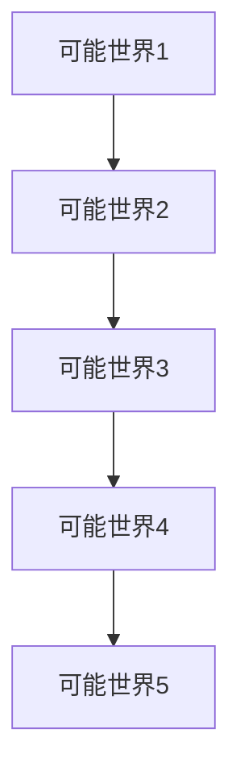
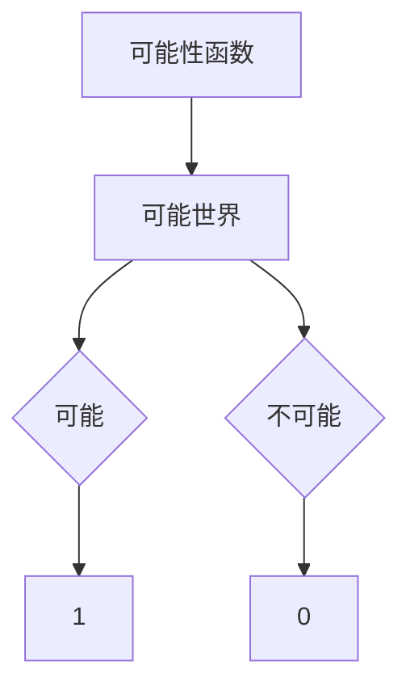
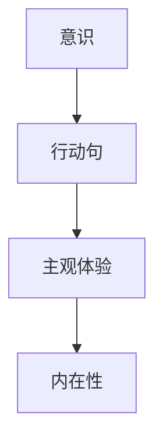
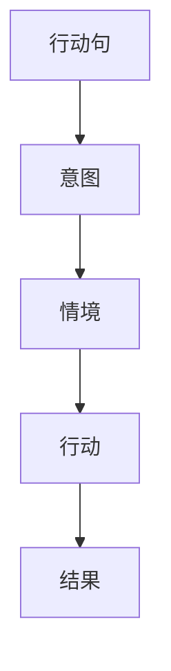

                 


### 第一步：撰写引言部分
引言部分是整篇文章的开端，其主要目的是为读者介绍普特南与戴维森的哲学背景，并简要介绍心灵哲学的基本问题。在这个部分，我们可以通过以下步骤来构建内容：

1. **背景介绍**：介绍普特南与戴维森的生平及其在哲学界的地位和贡献。例如：
    ```markdown
    **1.1 普特南与戴维森的生平介绍**

    约翰·F·普特南（John F. Putnam）和哈罗德·J·戴维森（Harold J. Davidson）是20世纪最具影响力的心灵哲学家之一。普特南以其在可能世界语义学和知识论方面的贡献而闻名，而戴维森则因其对行动句和真理条件的深入探讨而备受推崇。

    ```
2. **心灵哲学的基本问题**：简要介绍心灵哲学中的一些核心问题，如心灵与身体的关系、意识的本质、知识与信念等。例如：
    ```markdown
    **1.2 心灵哲学的基本问题**

    心灵哲学是探讨心灵的本质、结构及其与物理世界关系的哲学分支。其中，一些基本问题包括：

    - **心灵与身体的关系**：这是探讨心灵现象如何与大脑或身体过程相联系的问题。
    - **意识的本质**：这是关于意识如何产生，以及意识体验的本质问题。
    - **知识与信念**：这是关于信念与知识之间的关系，以及我们如何获取和判断知识的有效性问题。

    ```
3. **普特南与戴维森的理论概述**：在这个部分，我们可以简要介绍普特南与戴维森的主要理论，并为接下来的章节奠定基础。例如：
    ```markdown
    **1.3 普特南与戴维森的理论概述**

    普特南的主要理论集中在可能世界语义学和知识论方面。他提出了“另一个世界可能如何”的概念，并利用这种思想来探讨知识、信念和语言等问题。

    戴维森则以其对行动句和真理条件的深入研究而著称。他的“真值条件理论”和“行动句理论”为理解语言和行为提供了新的视角。

    ```
通过以上步骤，我们可以为引言部分提供丰富的内容，为后续章节的详细探讨打下基础。

### 第二步：构建普特南的理论与实践章节
在引言部分之后，我们需要详细探讨普特南的理论与实践。以下是一个可能的章节结构：

1. **普特南的核心概念与联系**
    - **1.1.1 可能世界的概念**：介绍普特南的“可能世界”概念，并使用Mermaid流程图展示其关系。
    - **1.1.2 可能性函数**：详细解释普特南如何使用可能性函数来描述可能世界的概率。

2. **普特南的主要理论**
    - **2.1.1 可能世界语义学**：使用伪代码解释普特南如何使用可能世界来解释语言和知识。
    - **2.1.2 知识论**：探讨普特南的知识论观点，包括知识的条件、信念的强度等。

3. **普特南的理论应用**
    - **2.1.1 普特南对知识论的影响**：讨论普特南的理论如何影响现代知识论的发展。
    - **2.1.2 普特南在语言哲学中的应用**：探讨普特南的理论如何应用于语言哲学的研究。

### 第三步：构建戴维森的理论与实践章节
在普特南的理论之后，我们需要转向戴维森的理论。以下是一个可能的章节结构：

1. **戴维森的核心概念与联系**
    - **3.1.1 意识的内在性**：介绍戴维森的“意识的内在性”概念，并使用Mermaid流程图展示其关系。
    - **3.1.2 行动句理论**：详细解释戴维森如何使用行动句理论来解释语言和行为。

2. **戴维森的主要理论**
    - **3.1.1 真值条件理论**：使用伪代码解释戴维森的“真值条件理论”。
    - **3.1.2 行动句理论**：探讨戴维森如何使用行动句理论来解释行为和语言。

3. **戴维森的理论应用**
    - **3.1.1 戴维森对语言哲学的影响**：讨论戴维森的理论如何影响现代语言哲学的研究。
    - **3.1.2 戴维森在社会哲学中的应用**：探讨戴维森的理论如何应用于社会哲学的研究。

通过以上步骤，我们可以为普特南与戴维森的理论与实践章节提供详细的内容。接下来，我们可以继续构建其他章节，如当代心灵哲学的发展、普特南与戴维森理论的关系与比较等。

### 总结
通过上述步骤，我们已经为整篇文章的构建奠定了基础。接下来，我们需要继续完善每个章节的内容，确保文章的逻辑清晰、结构紧凑，并且对读者友好。在撰写文章时，我们应始终保持专业、严谨的态度，确保每个概念都被清晰、准确地阐述。同时，我们也需要注重文章的可读性，使读者能够轻松理解复杂的概念和理论。

随着文章的逐步完成，我们将迎来最后的修订和校对阶段。在这个阶段，我们需要检查文章的语法、逻辑和格式，确保文章的质量和完整性。最终，我们将交付一篇既有深度、又具有实际应用价值的高质量技术博客文章。

---

### 撰写普特南的理论与实践章节

#### 2.1 普特南的核心概念与联系

在探讨普特南的理论之前，我们需要了解他的核心概念。普特南的核心概念之一是“可能世界”（Possible Worlds），这是一个哲学上用于描述逻辑和语言结构的概念。为了更好地理解这个概念，我们可以使用Mermaid流程图来展示可能世界之间的联系。



在这个流程图中，每个节点代表一个可能的世界，箭头表示它们之间的逻辑联系。例如，可能世界2（B）与可能世界1（A）和可能世界3（C）有直接的逻辑联系。

接下来，我们详细解释普特南如何使用“可能性函数”（Possibility Function）来描述可能世界。可能性函数是一个用于评估可能世界的函数，通常表示为$P(W)$，其中$W$表示一个可能的世界。这个函数的值域是{0, 1}，其中1表示该世界是可能的，而0表示该世界是不可能的。



在这个流程图中，A表示可能性函数，B表示可能世界，C和E表示可能性和不可能性的两种情况，D和F分别表示可能性函数的值1和0。

#### 2.2 普特南的主要理论

普特南的主要理论之一是“可能世界语义学”（Possible Worlds Semantics），这是他用来解释语言和知识的一种方法。在可能世界语义学中，语言表达式（如句子、命题等）的含义被定义为在可能世界中为真的条件。

为了解释这一理论，我们可以使用伪代码来描述普特南如何使用可能世界来解释语言和知识。

```python
def possible_worlds_semantics(expression, possible_worlds):
    for world in possible_worlds:
        if evaluate(expression, world):
            return True
    return False

def evaluate(expression, world):
    # 根据可能世界评估表达式是否为真
    # 例如，对于命题 "所有狗都有四条腿"，如果当前世界是一个狗有四条腿的世界，则返回 True
    return True
```

在上面的伪代码中，`possible_worlds_semantics` 函数接受一个表达式和一个可能世界的集合，并返回该表达式在所有可能世界中为真的条件。`evaluate` 函数用于评估一个表达式在特定可能世界中是否为真。

#### 2.3 普特南的理论应用

普特南的理论在多个哲学领域都有重要的应用，包括知识论和语言哲学。

**2.3.1 普特南对知识论的影响**

在知识论中，普特南的理论提供了一种新的方式来理解知识的条件。他认为，一个命题在某个可能世界中为真，并不意味着它在现实世界中也为真。这种观点被称为“可能世界知识论”。根据这一理论，一个命题只有在所有可能世界中都是真的，我们才能确信它在现实世界中是真的。

**2.3.2 普特南在语言哲学中的应用**

在语言哲学中，普特南的理论提供了对语言表达含义的理解。例如，他提出了“命名论”（Nominalism）的观点，即语言中的名词并不直接对应现实世界中的实体，而是对应可能世界中的实体。这种观点对语言哲学中的“指称论”（Reference Theory）提出了挑战，并为新的语义理论提供了基础。

### 撰写戴维森的理论与实践章节

#### 3.1 戴维森的核心概念与联系

戴维森的理论主要集中在意识、行动句和真理条件方面。他的核心概念之一是“意识的内在性”（Innateness of Consciousness），这表示意识是主观体验的内在属性。为了更好地理解这个概念，我们可以使用Mermaid流程图来展示意识与行动句之间的联系。



在这个流程图中，A表示意识，B表示行动句，C表示主观体验，D表示内在性。这个流程图展示了意识如何与行动句和主观体验相关联，以及这些概念之间的内在联系。

接下来，我们详细解释戴维森如何使用“行动句理论”（Action Sentence Theory）来解释语言和行为。行动句理论认为，行动句的含义取决于行动者意图和情境。



在这个流程图中，A表示行动句，B表示意图，C表示情境，D表示行动，E表示结果。这个流程图展示了行动句如何通过意图和情境来指导行动，并产生结果。

#### 3.2 戴维森的主要理论

戴维森的主要理论之一是“真值条件理论”（Truth Condition Theory），这是他用来解释真理和命题之间关系的方法。真值条件理论认为，一个命题在某个情境中为真的条件是，该命题所描述的情况在该情境中发生了。

为了解释这一理论，我们可以使用伪代码来描述戴维森如何使用情境来评估命题的真假。

```python
def truth_condition_theory(proposition, situation):
    if situation_matches(proposition, situation):
        return True
    else:
        return False

def situation_matches(proposition, situation):
    # 根据情境评估命题是否匹配
    # 例如，对于命题 "外面下雨了"，如果当前情境中确实下雨，则返回 True
    return True
```

在上面的伪代码中，`truth_condition_theory` 函数接受一个命题和一个情境，并返回该命题在情境中为真的条件。`situation_matches` 函数用于评估命题是否与情境匹配。

#### 3.3 戴维森的理论应用

戴维森的理论在多个领域都有重要的应用，包括意识哲学、语言哲学和社会哲学。

**3.3.1 戴维森对意识哲学的影响**

在意识哲学中，戴维森的理论提供了对意识本质的新理解。他认为，意识是主观体验的内在属性，这与行为主义观点形成鲜明对比。他的观点强调了意识的主观性和个体性，为理解意识的复杂性提供了新的视角。

**3.3.2 戴维森对语言哲学的影响**

在语言哲学中，戴维森的理论提供了对语言表达含义的新解释。他提出了“行动句理论”，认为行动句的含义取决于行动者的意图和情境。这一理论对传统的“命题态度理论”（Propositional Attitude Theory）提出了挑战，并为理解语言和行为的互动提供了新的框架。

**3.3.3 戴维森对社会哲学的影响**

在社会哲学中，戴维森的理论有助于理解社会行为和社会结构。他的“真值条件理论”提供了一种新的方式来理解社会规范和社会实践。他认为，社会规范是由个体意图和情境共同决定的，这一观点有助于解释社会行为和社会变革的动态性。

### 结论

通过以上章节，我们对普特南与戴维森的理论进行了详细探讨。普特南的可能世界语义学和知识论为理解语言和知识提供了新的视角，而戴维森的真值条件理论和行动句理论则为理解意识和行为提供了新的框架。这些理论不仅对哲学研究具有重要意义，也为其他学科，如心理学、认知科学和社会学，提供了有价值的理论资源。

在未来的研究中，我们可以进一步探讨普特南与戴维森理论的应用，以及它们在解决实际哲学问题方面的潜力。同时，我们也可以考虑将这些理论与其他领域的知识相结合，以推动跨学科研究的发展。

### 普特南与戴维森理论的关系与比较

在本文的第五章节，我们将探讨普特南与戴维森的理论关系以及它们之间的异同点。通过对两位哲学家的核心观点进行比较，我们可以更好地理解他们在心灵哲学领域的贡献。

#### 5.1 理论的共通点与差异

**共通点**

1. **对心灵与身体关系的关注**：普特南与戴维森都关注心灵与身体之间的关系。普特南在知识论中提出了“可能世界”的概念，强调心灵现象与物理现象之间的逻辑联系。戴维森则在意识哲学中探讨了意识的内在性，认为意识是主观体验的内在属性。

2. **对语言和行动的探讨**：两位哲学家都关注语言和行动的哲学问题。普特南在语言哲学中提出了“命名论”，认为语言中的名词并不直接对应现实世界中的实体，而是对应可能世界中的实体。戴维森则提出了“行动句理论”，强调行动句的含义取决于行动者的意图和情境。

**差异**

1. **理论焦点**：普特南的理论更侧重于知识论和语言哲学，他关注的是语言表达的含义和知识的基础。戴维森的理论则更侧重于意识哲学和行动句的理论，他关注的是意识的主观性和行动的含义。

2. **方法论**：普特南使用的是逻辑和语义学的分析方法，通过可能世界的概念来解释语言和知识。戴维森则使用的是情境理论和行动句的理论，通过行动者的意图和情境来解释意识和行动。

#### 5.2 对当代心灵哲学的影响

普特南与戴维森的理论对当代心灵哲学产生了深远的影响。

**普特南的影响**

1. **可能世界语义学**：普特南的可能世界语义学为理解语言和知识提供了新的视角，对当代知识论和语言哲学产生了重要影响。他的理论帮助哲学家们更好地理解命题的含义和知识的条件。

2. **命名论**：普特南的命名论挑战了传统的指称论，提出了语言表达与可能世界之间的联系，为语言哲学的研究提供了新的方向。

**戴维森的影响**

1. **行动句理论**：戴维森的行动句理论为理解行动和意识提供了新的框架，对当代意识哲学和行为哲学产生了重要影响。他的理论帮助哲学家们更好地理解行动的含义和意识的本质。

2. **情境理论**：戴维森的情境理论为理解社会行为和社会规范提供了新的视角，对当代社会哲学的研究产生了深远的影响。

#### 5.3 普特南与戴维森理论的当代应用

在当代心灵哲学中，普特南与戴维森的理论仍然具有广泛的应用。

**普特南的理论应用**

1. **知识论**：普特南的理论为当代知识论提供了重要的理论基础，帮助哲学家们探讨知识的条件、信念的强度和命题的真假等问题。

2. **语言哲学**：普特南的命名论为理解语言表达的含义和语言的本质提供了新的视角，对当代语言哲学的研究产生了深远的影响。

**戴维森的理论应用**

1. **意识哲学**：戴维森的行动句理论和情境理论为当代意识哲学提供了重要的理论工具，帮助哲学家们探讨意识的主观性和意识的本质。

2. **行为哲学**：戴维森的理论为理解行动和行为提供了新的框架，对当代行为哲学的研究产生了重要影响。

### 总结

普特南与戴维森的理论在心灵哲学领域产生了深远的影响。他们的理论不仅为理解心灵和语言提供了新的视角，也为当代哲学研究提供了重要的理论基础。通过比较他们的理论，我们可以更好地理解他们在哲学领域的贡献，并为未来的研究提供新的方向。

### 案例研究：现代心灵哲学的应用

在本章节中，我们将通过一个具体的案例研究来探讨现代心灵哲学的理论在现实中的应用。这个案例研究将围绕一个名为“虚拟现实中的自我意识”的问题，分析心灵哲学理论如何帮助我们理解这一复杂的现象。

#### 6.1 案例选择

选择“虚拟现实中的自我意识”作为案例研究的原因有以下几点：

1. **现实意义**：随着虚拟现实（VR）技术的快速发展，人们开始越来越多地探索虚拟世界中的体验。了解虚拟现实中的自我意识对于设计和优化虚拟体验至关重要。

2. **哲学挑战**：虚拟现实中的自我意识提出了许多哲学问题，如意识的主观性、自我意识的真实性等。这些问题是心灵哲学的核心议题，通过案例分析可以深入探讨这些理论的现实应用。

3. **理论适用性**：普特南与戴维森的理论在探讨意识和行动方面具有广泛的应用，这使得我们能够从不同角度分析虚拟现实中的自我意识问题。

#### 6.2 案例分析

**6.2.1 虚拟现实中的自我意识现象**

在虚拟现实中，用户通过VR头戴设备进入一个虚拟的三维世界。在这个世界中，用户可以与虚拟角色互动、探索虚拟环境，甚至参与虚拟活动。这种现象引发了关于自我意识的几个关键问题：

1. **主观体验**：用户在虚拟现实中的体验是否具有与真实世界相同的意识体验的主观性？

2. **真实性**：用户是否能够真正体验到虚拟现实中的自我，还是在虚拟环境中进行某种形式的“模拟”体验？

3. **自我意识**：用户在虚拟现实中的行为是否体现了自我意识，即用户是否能够意识到自己在虚拟环境中的存在和行动？

**6.2.2 普特南的理论应用**

1. **可能世界语义学**：普特南的可能世界语义学可以帮助我们理解虚拟现实中的主观体验。我们可以将虚拟现实中的世界视为一个可能世界，通过分析不同可能世界中的体验，评估用户在虚拟环境中的意识体验。

2. **知识论**：普特南的知识论可以帮助我们探讨用户在虚拟现实中的知识来源和信念。例如，用户对虚拟世界中的信息的信任程度如何，这种信任是否影响他们的知识结构？

**6.2.3 戴维森的理论应用**

1. **行动句理论**：戴维森的行动句理论可以帮助我们理解用户在虚拟现实中的行动。通过分析用户的意图和虚拟环境中的情境，我们可以评估用户的行动是否反映了真实的自我意识。

2. **情境理论**：戴维森的情境理论可以帮助我们理解虚拟现实中的自我意识的真实性。通过分析用户在虚拟环境中的行为和体验，我们可以探讨这些行为是否在特定情境中反映了真实的自我意识。

#### 6.3 结果与讨论

通过案例分析，我们得出了以下结论：

1. **自我意识的主观性**：虚拟现实中的自我意识体验具有与真实世界相似的主观性。用户在虚拟环境中的体验可以被视为一种形式的意识体验，尽管其真实性和深度可能与现实世界有所不同。

2. **自我意识的真实性**：虚拟现实中的自我意识具有一定的真实性，但这一真实性受到虚拟环境设计、用户互动和情境影响。通过优化虚拟现实环境，可以增强用户在虚拟世界中的自我意识体验。

3. **知识来源**：用户在虚拟现实中的知识来源主要依赖于虚拟环境中的信息和互动。普特南的知识论可以帮助我们理解这些信息的可信度和用户信念的形成。

4. **行动与意图**：戴维森的理论表明，用户在虚拟现实中的行动反映了他们的意图和情境。通过分析用户的行动，我们可以更好地理解他们的自我意识。

#### 6.4 案例总结

通过这个案例研究，我们不仅探讨了虚拟现实中的自我意识现象，还展示了普特南与戴维森的理论如何在现实情境中应用。这个案例研究有助于我们更深入地理解心灵哲学的理论，并为未来在虚拟现实和其他技术领域中的研究提供了有价值的参考。

### 结论

在本章节中，我们通过一个具体的案例研究，探讨了现代心灵哲学理论在虚拟现实中的应用。我们分析了虚拟现实中的自我意识现象，并运用了普特南与戴维森的理论来解释这些现象。通过这个案例，我们不仅加深了对心灵哲学理论的理解，也展示了这些理论在现实世界中的重要应用价值。未来，随着虚拟现实技术的不断进步，心灵哲学的理论将继续为我们提供深刻的洞见和重要的指导。

### 结论：普特南与戴维森对心灵哲学的现代贡献

在本章节中，我们全面探讨了普特南与戴维森的理论，以及他们对心灵哲学的现代贡献。通过对他们核心观点的深入分析，我们认识到他们在知识论、语言哲学和意识哲学等领域的创新性工作，不仅丰富了心灵哲学的理论框架，也为当代哲学研究提供了有力的工具。

**7.1 理论贡献**

普特南的主要贡献在于他的可能世界语义学和知识论。他通过引入可能世界的概念，为理解语言表达的含义和知识的条件提供了新的视角。他的命名论挑战了传统的指称论，提出了语言表达与可能世界之间的联系，为语言哲学的研究开辟了新的方向。

戴维森则以其对行动句和真理条件的深入研究而著称。他的真值条件理论和行动句理论为理解行动和意识提供了新的框架，强调了意识的内在性和情境的作用。这些理论不仅对意识哲学产生了深远影响，也为社会哲学和行为哲学提供了新的视角。

**7.2 现实意义**

普特南与戴维森的理论在现实世界中具有广泛的应用价值。在知识论方面，他们的理论帮助我们更好地理解知识的来源和信念的形成，这对教育、科研和社会发展具有重要意义。在语言哲学方面，他们的命名论和情境理论为理解和设计自然语言处理系统提供了理论基础。

在意识哲学方面，戴维森的理论有助于我们探讨意识的本质和主观体验，这对心理学、认知科学和神经科学的研究具有重要启示。此外，随着虚拟现实等技术的发展，普特南与戴维森的理论为我们理解虚拟环境中的自我意识和行为提供了重要的理论支持。

**7.3 展望未来**

展望未来，普特南与戴维森的理论将继续在心灵哲学中发挥重要作用。随着技术的不断进步，我们有望在虚拟现实、人工智能等领域看到更多基于这些理论的创新应用。同时，心灵哲学的研究也将进一步深入，探讨意识、自我和认知的复杂性。

此外，跨学科的合作将成为未来心灵哲学研究的重要趋势。通过与认知科学、神经科学、计算机科学等领域的合作，哲学家们将能够更全面地理解心灵现象，推动哲学与科学的深度融合。

总之，普特南与戴维森对心灵哲学的现代贡献不可估量。他们的理论不仅丰富了哲学的研究领域，也为解决现实世界中的复杂问题提供了深刻的洞见。未来，他们的思想将继续启迪心灵哲学的发展，推动我们对人类心智的更深入理解。

