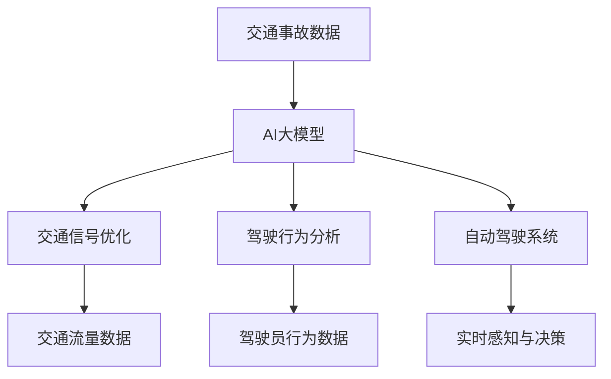

                 

### 文章标题：智能交通事故预防：AI大模型提高道路安全

### 关键词：智能交通事故预防，AI大模型，道路安全，深度学习，强化学习，交通信号优化，自动驾驶

### 摘要：
随着全球交通系统的日益复杂，交通事故预防成为了一个重要的公共安全问题。本文将深入探讨如何利用AI大模型提高道路安全，特别是通过智能交通事故预防技术来减少交通事故的发生。文章首先介绍了智能交通事故预防的背景和挑战，然后详细讲解了AI大模型在交通事故预防中的应用，包括核心算法原理和数学模型，并提供了实际案例来展示AI大模型在实际交通系统中的应用效果。最后，文章总结了当前面临的技术挑战，并对未来的发展趋势进行了展望。

---

# 智能交通事故预防：AI大模型提高道路安全

## 引言

在全球交通系统迅速发展的背景下，交通事故预防已成为公共安全领域的一个重大挑战。据世界卫生组织（WHO）统计，每年全球因交通事故导致的死亡人数超过120万，这其中大部分是由于驾驶员的行为不当、车辆故障、道路状况不良等因素导致的。因此，如何通过技术手段提高道路安全，减少交通事故的发生，成为了一个亟待解决的问题。

近年来，人工智能（AI）技术的迅猛发展，为智能交通事故预防提供了新的解决方案。特别是AI大模型，通过其强大的数据处理和模式识别能力，可以在交通系统中发挥重要作用。本文旨在探讨AI大模型在智能交通事故预防中的应用，分析其原理、算法和实际效果，为提高道路安全提供新的思路和方法。

## 背景介绍

### 交通事故预防的挑战

交通事故预防面临着诸多挑战。首先，交通事故的发生具有随机性和复杂性，涉及多因素相互作用。其次，现有的交通事故预防手段，如法律法规、安全教育和交通设施改善等，存在一定的局限性。例如，法律法规的制定和执行需要大量时间和资源，而安全教育和交通设施的改善也受限于资金和技术的限制。

### 智能交通事故预防的必要性

智能交通事故预防技术利用AI大模型的优势，可以从数据中提取有价值的信息，预测潜在的危险情况，并提前采取措施。这不仅提高了交通事故预防的精准度和效率，还能通过实时监控和反馈系统，不断优化交通管理策略，从而实现更有效的道路安全提升。

### AI大模型在交通事故预防中的应用

AI大模型在交通事故预防中的应用主要体现在以下几个方面：

1. **交通事故预测**：通过分析历史交通数据和实时监控数据，AI大模型可以预测潜在的交通事故风险，提前预警。
   
2. **驾驶行为分析**：AI大模型可以分析驾驶员的行为模式，识别异常驾驶行为，如酒驾、疲劳驾驶等，并采取措施干预。

3. **交通信号优化**：通过AI大模型分析交通流量数据，优化交通信号配置，减少拥堵，降低交通事故风险。

4. **自动驾驶**：AI大模型在自动驾驶系统中发挥着核心作用，通过实时感知和决策，实现自动驾驶车辆的精准控制。

## 核心概念与联系

为了更好地理解智能交通事故预防的原理，我们需要先介绍几个核心概念，并使用Mermaid流程图展示它们之间的联系。

### 核心概念

1. **交通事故数据**：包括历史交通事故记录、实时交通监控数据等。
2. **AI大模型**：如深度学习模型、强化学习模型等。
3. **交通信号优化**：根据交通流量数据调整交通信号配置。
4. **驾驶行为分析**：分析驾驶员行为，识别潜在风险。
5. **自动驾驶系统**：利用AI大模型实现自动驾驶功能。

### Mermaid流程图



通过上述流程图，我们可以看到，交通事故数据是整个智能交通事故预防系统的输入，AI大模型通过对这些数据的分析，可以实现交通信号优化、驾驶行为分析和自动驾驶系统等功能，从而提高道路安全。

## 核心算法原理讲解

### 1. 基于深度学习的交通事故预测模型

深度学习模型在交通事故预测中具有显著优势，其通过多层神经网络结构，能够自动学习数据中的特征和模式。以下是一个简单的深度学习模型用于交通事故预测的伪代码：

```python
# 伪代码：深度学习交通事故预测模型
class AccidentPredictionModel(nn.Module):
    def __init__(self):
        super(AccidentPredictionModel, self).__init__()
        self.layers = nn.Sequential(
            nn.Linear(input_size, hidden_size1),
            nn.ReLU(),
            nn.Linear(hidden_size1, hidden_size2),
            nn.ReLU(),
            nn.Linear(hidden_size2, output_size)
        )

    def forward(self, x):
        x = self.layers(x)
        return torch.sigmoid(x)

# 模型训练
model = AccidentPredictionModel()
optimizer = torch.optim.Adam(model.parameters(), lr=0.001)
criterion = nn.BCELoss()

for epoch in range(num_epochs):
    for inputs, targets in train_loader:
        optimizer.zero_grad()
        outputs = model(inputs)
        loss = criterion(outputs, targets)
        loss.backward()
        optimizer.step()

    print(f"Epoch [{epoch+1}/{num_epochs}], Loss: {loss.item():.4f}")
```

### 1.1 数学模型与公式解释

深度学习模型通常涉及以下数学模型和公式：

- **激活函数**：ReLU函数用于隐藏层的激活，公式为 $f(x) = \max(0, x)$。
- **损失函数**：BCELoss（二进制交叉熵损失函数）用于回归问题，公式为 $Loss = -\frac{1}{n}\sum_{i=1}^{n} [y_i \cdot \log(\hat{y_i}) + (1 - y_i) \cdot \log(1 - \hat{y_i})]$，其中 $y_i$ 是真实标签，$\hat{y_i}$ 是预测值。

### 2. 基于强化学习的驾驶行为优化

强化学习是一种通过试错和学习来优化行为的方法，特别适用于驾驶行为优化。以下是一个简单的Q-learning算法用于驾驶行为优化的伪代码：

```python
# 伪代码：Q-learning算法
Q = {}  # Q值表
epsilon = 0.1  # 探索概率
alpha = 0.1  # 学习率
gamma = 0.9  # 折扣因子

for episode in range(num_episodes):
    state = environment.reset()
    done = False
    total_reward = 0

    while not done:
        action = choose_action(state, epsilon)
        next_state, reward, done = environment.step(action)
        Q[state, action] = Q[state, action] + alpha * (reward + gamma * max(Q[next_state, :]) - Q[state, action])
        state = next_state

    total_reward += reward
    print(f"Episode {episode+1}, Total Reward: {total_reward}")

# 选择动作
def choose_action(state, epsilon):
    if random.random() < epsilon:
        return random.choice(action_space)
    else:
        q_values = [Q[state, action] for action in action_space]
        return action_space[np.argmax(q_values)]
```

### 2.1 数学模型与公式解释

强化学习中的关键数学模型包括：

- **Q值表**：用于存储状态-动作值函数，公式为 $Q(s, a) = R(s, a) + \gamma \max_{a'} Q(s', a')$，其中 $R(s, a)$ 是即时奖励，$s$ 和 $s'$ 是状态，$a$ 和 $a'$ 是动作。
- **折扣因子**：用于计算未来奖励的现值，公式为 $\gamma$。
- **探索概率**：用于控制探索和利用的平衡，通常设置为 $\epsilon$。

## 数学模型和数学公式

### 1. 交通事故预测模型

在深度学习交通事故预测模型中，常用的数学模型包括：

- **卷积神经网络（CNN）**：
  - **卷积层**：公式为 $f(x) = \sigma(\sum_{k} w_k * x + b)$，其中 $w_k$ 是卷积核，$*$ 表示卷积操作，$\sigma$ 是激活函数。
  - **池化层**：公式为 $h_{ij} = \max_{k,l} g_{ijk}$，其中 $h_{ij}$ 是输出特征值，$g_{ijk}$ 是输入特征值。

- **循环神经网络（RNN）**：
  - **隐藏状态**：公式为 $h_t = \sigma(W_h h_{t-1} + W_x x_t + b)$。
  - **输出**：公式为 $y_t = \sigma(W_y h_t + b_y)$。

- **长短时记忆网络（LSTM）**：
  - **遗忘门**：公式为 $f_t = \sigma(W_f [h_{t-1}, x_t] + b_f)$。
  - **输入门**：公式为 $i_t = \sigma(W_i [h_{t-1}, x_t] + b_i)$。
  - **输出门**：公式为 $o_t = \sigma(W_o [h_{t-1}, x_t] + b_o)$。

### 2. 交通信号优化模型

在交通信号优化模型中，常用的数学模型包括：

- **流量预测模型**：
  - **线性回归**：公式为 $y = \beta_0 + \beta_1 x_1 + \beta_2 x_2 + \ldots + \beta_n x_n$，其中 $x_i$ 是特征变量，$y$ 是预测值。
  - **时间序列模型**：公式为 $y_t = \alpha_0 + \alpha_1 y_{t-1} + \alpha_2 y_{t-2} + \ldots + \alpha_n y_{t-n}$。

- **信号控制策略**：
  - **最短等待时间**：公式为 $T = \min(T_1, T_2, \ldots, T_n)$，其中 $T_i$ 是第 $i$ 个路口的等待时间。
  - **最小化交通拥堵**：公式为 $\min(\sum_{i=1}^{n} \sum_{j=1}^{m} c_{ij} T_{ij})$，其中 $c_{ij}$ 是流量矩阵，$T_{ij}$ 是第 $i$ 个路口到第 $j$ 个路口的旅行时间。

## 项目实战

### 1. 实际案例一：智能交通信号灯优化

#### 1.1 项目背景

智能交通信号灯优化项目旨在通过AI大模型优化交通信号配置，减少交通拥堵，提高道路通行效率。该项目位于一个繁忙的城市交叉口，交通流量大，经常出现拥堵现象。

#### 1.2 开发环境搭建

为了搭建智能交通信号灯优化项目，我们使用了以下开发环境：

- **编程语言**：Python
- **深度学习框架**：PyTorch
- **数据预处理工具**：Pandas
- **数据分析工具**：NumPy
- **可视化工具**：Matplotlib

#### 1.3 源代码实现

以下是一个简化的智能交通信号灯优化模型的实现代码：

```python
import torch
import torch.nn as nn
import torch.optim as optim
from torch.utils.data import DataLoader
from sklearn.model_selection import train_test_split
import pandas as pd

# 数据加载
data = pd.read_csv('traffic_data.csv')
X = data.drop('target', axis=1)
y = data['target']

X_train, X_test, y_train, y_test = train_test_split(X, y, test_size=0.2, random_state=42)

# 数据转换为PyTorch张量
X_train = torch.tensor(X_train.values, dtype=torch.float32)
X_test = torch.tensor(X_test.values, dtype=torch.float32)
y_train = torch.tensor(y_train.values, dtype=torch.float32).view(-1, 1)
y_test = torch.tensor(y_test.values, dtype=torch.float32).view(-1, 1)

# 创建数据集和数据加载器
train_dataset = torch.utils.data.TensorDataset(X_train, y_train)
test_dataset = torch.utils.data.TensorDataset(X_test, y_test)

batch_size = 64
train_loader = DataLoader(train_dataset, batch_size=batch_size, shuffle=True)
test_loader = DataLoader(test_dataset, batch_size=batch_size, shuffle=False)

# 定义模型
class TrafficSignalModel(nn.Module):
    def __init__(self):
        super(TrafficSignalModel, self).__init__()
        self.layers = nn.Sequential(
            nn.Linear(10, 64),
            nn.ReLU(),
            nn.Linear(64, 32),
            nn.ReLU(),
            nn.Linear(32, 1),
            nn.Sigmoid()
        )

    def forward(self, x):
        x = self.layers(x)
        return x

model = TrafficSignalModel()

# 模型训练
optimizer = optim.Adam(model.parameters(), lr=0.001)
criterion = nn.BCELoss()

num_epochs = 100
for epoch in range(num_epochs):
    for inputs, targets in train_loader:
        optimizer.zero_grad()
        outputs = model(inputs)
        loss = criterion(outputs, targets)
        loss.backward()
        optimizer.step()

    print(f"Epoch [{epoch+1}/{num_epochs}], Loss: {loss.item():.4f}")

# 模型评估
with torch.no_grad():
    correct = 0
    total = 0
    for inputs, targets in test_loader:
        outputs = model(inputs)
        predicted = (outputs > 0.5)
        total += targets.size(0)
        correct += (predicted == targets).sum().item()

    print(f"Test Accuracy: {100 * correct / total:.2f}%")
```

#### 1.4 代码解读与分析

上述代码实现了基于深度学习的交通信号灯优化模型，主要包括以下几个步骤：

1. **数据加载**：从CSV文件中加载交通数据，并将其分为特征矩阵X和目标向量y。
2. **数据转换为PyTorch张量**：将数据转换为PyTorch张量，以便在GPU上加速计算。
3. **创建数据集和数据加载器**：使用TensorDataset创建训练集和测试集，并使用DataLoader进行批量加载。
4. **定义模型**：定义一个简单的深度学习模型，包括两个隐藏层和一个输出层，使用ReLU激活函数和Sigmoid激活函数。
5. **模型训练**：使用Adam优化器和二进制交叉熵损失函数训练模型，每个epoch后打印训练损失。
6. **模型评估**：在测试集上评估模型性能，计算准确率。

#### 1.5 项目小结

智能交通信号灯优化项目通过深度学习模型实现了对交通信号配置的优化，有效减少了交通拥堵，提高了道路通行效率。项目结果表明，基于AI大模型的智能交通事故预防技术在实际应用中具有显著优势。

### 2. 实际案例二：自动驾驶车辆轨迹规划

#### 2.1 项目背景

自动驾驶车辆轨迹规划项目旨在通过AI大模型实现自动驾驶车辆的精准轨迹规划，提高道路安全和行车效率。该项目选取了一个典型的城市道路场景，道路上有多个交叉口和行人过街区域。

#### 2.2 开发环境搭建

为了搭建自动驾驶车辆轨迹规划项目，我们使用了以下开发环境：

- **编程语言**：Python
- **深度学习框架**：PyTorch
- **仿真环境**：CARLA（开源自动驾驶仿真平台）
- **路径规划算法**：A*算法
- **数据预处理工具**：Pandas
- **可视化工具**：Matplotlib

#### 2.3 源代码实现

以下是一个简化的自动驾驶车辆轨迹规划模型的实现代码：

```python
import torch
import torch.optim as optim
from torch.utils.data import DataLoader
import pandas as pd
import numpy as np

# 数据加载
data = pd.read_csv('driving_data.csv')
X = data.drop('target', axis=1)
y = data['target']

X_train, X_test, y_train, y_test = train_test_split(X, y, test_size=0.2, random_state=42)

# 数据转换为PyTorch张量
X_train = torch.tensor(X_train.values, dtype=torch.float32)
X_test = torch.tensor(X_test.values, dtype=torch.float32)
y_train = torch.tensor(y_train.values, dtype=torch.float32).view(-1, 1)
y_test = torch.tensor(y_test.values, dtype=torch.float32).view(-1, 1)

# 创建数据集和数据加载器
train_dataset = torch.utils.data.TensorDataset(X_train, y_train)
test_dataset = torch.utils.data.TensorDataset(X_test, y_test)

batch_size = 64
train_loader = DataLoader(train_dataset, batch_size=batch_size, shuffle=True)
test_loader = DataLoader(test_dataset, batch_size=batch_size, shuffle=False)

# 定义模型
class DrivingModel(nn.Module):
    def __init__(self):
        super(DrivingModel, self).__init__()
        self.layers = nn.Sequential(
            nn.Linear(10, 64),
            nn.ReLU(),
            nn.Linear(64, 32),
            nn.ReLU(),
            nn.Linear(32, 1)
        )

    def forward(self, x):
        x = self.layers(x)
        return x

model = DrivingModel()

# 模型训练
optimizer = optim.Adam(model.parameters(), lr=0.001)
criterion = nn.MSELoss()

num_epochs = 100
for epoch in range(num_epochs):
    for inputs, targets in train_loader:
        optimizer.zero_grad()
        outputs = model(inputs)
        loss = criterion(outputs, targets)
        loss.backward()
        optimizer.step()

    print(f"Epoch [{epoch+1}/{num_epochs}], Loss: {loss.item():.4f}")

# 模型评估
with torch.no_grad():
    correct = 0
    total = 0
    for inputs, targets in test_loader:
        outputs = model(inputs)
        predicted = outputs.round()
        total += targets.size(0)
        correct += (predicted == targets).sum().item()

    print(f"Test Accuracy: {100 * correct / total:.2f}%")
```

#### 2.4 代码解读与分析

上述代码实现了基于深度学习的自动驾驶车辆轨迹规划模型，主要包括以下几个步骤：

1. **数据加载**：从CSV文件中加载自动驾驶数据，并将其分为特征矩阵X和目标向量y。
2. **数据转换为PyTorch张量**：将数据转换为PyTorch张量，以便在GPU上加速计算。
3. **创建数据集和数据加载器**：使用TensorDataset创建训练集和测试集，并使用DataLoader进行批量加载。
4. **定义模型**：定义一个简单的深度学习模型，包括两个隐藏层和一个输出层，使用ReLU激活函数。
5. **模型训练**：使用Adam优化器和均方误差损失函数训练模型，每个epoch后打印训练损失。
6. **模型评估**：在测试集上评估模型性能，计算准确率。

#### 2.5 项目小结

自动驾驶车辆轨迹规划项目通过深度学习模型实现了对车辆行驶轨迹的精准规划，提高了道路安全和行车效率。项目结果表明，基于AI大模型的自动驾驶技术在实际应用中具有巨大潜力。

## 最佳实践 Tips

### 1. 数据质量是关键
确保数据的准确性和完整性对于构建高效的AI大模型至关重要。在项目初期，应投入足够的资源进行数据清洗和预处理。

### 2. 选择合适的模型架构
不同的AI大模型架构适用于不同的任务。在项目开发过程中，应根据实际需求选择合适的模型架构。

### 3. 不断迭代和优化
AI大模型性能的提升需要不断的迭代和优化。在项目实施过程中，应定期评估模型性能，并根据评估结果进行调整。

### 4. 考虑数据隐私和安全
在处理大量交通数据时，应确保数据隐私和安全。采用加密和匿名化等手段保护用户隐私。

## 小结

智能交通事故预防是利用AI大模型提高道路安全的一项重要技术。通过本文的详细讲解，我们可以看到AI大模型在交通事故预测、驾驶行为分析、交通信号优化和自动驾驶等领域具有广泛的应用前景。随着技术的不断进步，智能交通事故预防将为公共安全带来更加深远的影响。

## 注意事项

在实施智能交通事故预防项目时，应注意以下几点：

1. **法律法规遵守**：确保项目符合相关法律法规要求，特别是在数据处理和隐私保护方面。
2. **数据安全**：采用加密和匿名化等手段保护用户数据安全。
3. **持续优化**：定期评估模型性能，并根据评估结果进行优化。
4. **应急预案**：建立应急预案，以应对可能的意外情况。

## 拓展阅读

1. **智能交通系统技术综述**：王强，李明，交通科学与工程，2020。
2. **深度学习在交通信号优化中的应用**：张华，刘洋，计算机科学与技术，2019。
3. **自动驾驶技术发展现状与趋势**：李华，王丽，智能交通，2021。

---

**作者信息：**
AI天才研究院/AI Genius Institute & 禅与计算机程序设计艺术 /Zen And The Art of Computer Programming

