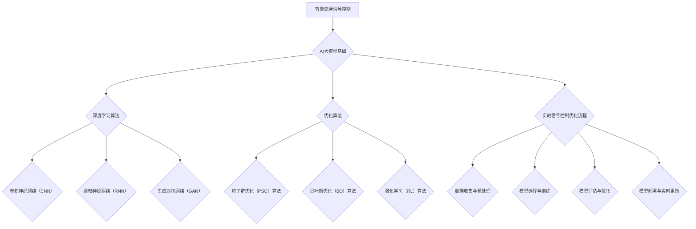

                 

### 文章标题

《智能交通信号控制：AI大模型优化城市交通》

> 关键词：智能交通信号控制，AI大模型，城市交通，优化，算法，数学模型，项目实战

> 摘要：本文深入探讨了智能交通信号控制领域，尤其是AI大模型在城市交通优化中的应用。文章首先介绍了智能交通信号控制的基本概念和AI大模型的相关技术，随后详细讲解了核心算法原理、数学模型和公式，并通过实际项目案例展示了AI大模型在交通信号控制中的具体应用。最后，文章对智能交通信号控制的发展趋势、伦理与法律问题以及国际合作与标准化进行了探讨。

## 引言

随着城市化进程的加速，城市交通问题日益突出，交通拥堵、交通事故频发，已成为影响城市居民生活质量的重要问题。传统的交通信号控制方法已难以应对现代城市交通的复杂性，因此，智能交通信号控制技术的出现为解决这一问题提供了新的思路。而AI大模型的引入，更是将智能交通信号控制推向了一个新的高度。本文旨在通过深入探讨智能交通信号控制与AI大模型之间的关系，揭示其在优化城市交通方面的巨大潜力。

## 智能交通信号控制概述

### 智能交通信号控制的基本概念

智能交通信号控制是指利用先进的传感器技术、信息技术、控制理论等手段，对交通信号进行智能化管理和控制，以提高交通效率、减少拥堵和事故发生。智能交通信号控制系统主要由交通传感器、控制主机、信号机、监控系统和通信系统等组成。其中，交通传感器负责收集交通数据，控制主机根据交通数据进行分析和处理，信号机根据分析结果控制交通信号的变换，监控系统实时监控交通状况，通信系统负责各部分之间的信息传输。

### 相关技术简介

智能交通信号控制涉及多个领域的技术，包括传感器技术、通信技术、数据处理技术、控制技术等。传感器技术主要负责交通数据的采集，如车辆检测器、摄像头、雷达等；通信技术则负责数据的传输，如无线通信、光纤通信等；数据处理技术用于对采集到的数据进行分析和处理，如数据挖掘、机器学习等；控制技术则用于控制交通信号的变化，如基于规则的控制、基于学习的控制等。

### AI大模型在交通信号控制中的应用

AI大模型，即人工智能大模型，是指具有强大学习和推理能力的深度学习模型。AI大模型在城市交通信号控制中的应用主要体现在以下几个方面：

1. **交通流量预测**：通过AI大模型对交通数据进行深度学习，可以预测未来一段时间内的交通流量，为交通信号控制提供数据支持。

2. **信号灯优化**：基于AI大模型的学习结果，可以对交通信号进行优化，使信号灯变换更加合理，减少交通拥堵。

3. **交通事故预防**：AI大模型可以通过对交通数据的实时分析，预测潜在的交通事故风险，提前采取措施预防事故发生。

4. **动态交通管理**：AI大模型可以根据实时交通数据，动态调整交通信号，实现智能交通管理。

### AI大模型的基础

#### AI大模型的概念与特点

AI大模型是指具有数百万甚至数十亿参数的深度学习模型。其特点包括：

- **强大的学习能力和泛化能力**：AI大模型可以通过大量的数据训练，学习到复杂的模式，并能将所学应用于新的场景。

- **可扩展性**：AI大模型可以轻松扩展到更大的数据集和更复杂的任务。

- **自适应能力**：AI大模型可以根据新的数据和环境变化，动态调整模型参数，以实现更好的性能。

#### AI大模型的工作原理

AI大模型的工作原理主要包括以下几个步骤：

1. **数据收集与预处理**：收集大量的交通数据，并进行预处理，如去噪、归一化等。

2. **模型构建**：设计并构建适合交通信号控制的深度学习模型，如卷积神经网络（CNN）、递归神经网络（RNN）等。

3. **模型训练**：使用预处理的交通数据，对AI大模型进行训练，优化模型参数。

4. **模型评估**：使用验证集或测试集，评估AI大模型的性能，如准确率、召回率等。

5. **模型部署**：将训练好的AI大模型部署到实际应用场景中，如交通信号控制系统中。

#### AI大模型在交通信号控制中的价值

AI大模型在交通信号控制中的价值主要体现在以下几个方面：

- **提高交通效率**：通过预测交通流量和优化信号灯控制，AI大模型可以减少交通拥堵，提高交通效率。

- **降低事故风险**：通过实时分析交通数据，AI大模型可以预测交通事故风险，提前采取措施预防事故发生。

- **提高用户体验**：通过智能交通信号控制，可以减少等待时间，提高用户出行体验。

## 核心算法原理讲解

### 深度学习算法在交通信号控制中的应用

#### 卷积神经网络（CNN）在交通流量分析中的应用

卷积神经网络（CNN）是一种专门用于处理图像数据的深度学习模型，其核心思想是通过卷积运算提取图像特征。在交通流量分析中，CNN可以用于提取交通摄像头捕捉到的车辆图像的特征，从而实现对交通流量的预测。

#### 递归神经网络（RNN）在交通信号控制中的运用

递归神经网络（RNN）是一种可以处理序列数据的神经网络，其核心思想是利用其内部循环结构，对序列数据进行建模。在交通信号控制中，RNN可以用于处理时间序列数据，如交通流量数据、交通事故数据等，从而实现对交通信号的控制。

#### 生成对抗网络（GAN）在交通信号优化中的应用

生成对抗网络（GAN）是一种由生成器和判别器组成的深度学习模型，其核心思想是生成器生成数据，判别器判断生成数据的真实性。在交通信号优化中，GAN可以用于生成优化后的交通信号灯控制方案，从而提高交通信号控制的性能。

### 优化算法在交通信号控制中的应用

#### 粒子群优化（PSO）算法在信号控制中的应用

粒子群优化（PSO）算法是一种基于群体智能的优化算法，其核心思想是通过粒子的速度和位置更新，寻找最优解。在交通信号控制中，PSO算法可以用于优化信号灯的变换策略，提高交通效率。

#### 贝叶斯优化（BO）算法在信号控制优化中的应用

贝叶斯优化（BO）算法是一种基于贝叶斯理论的优化算法，其核心思想是通过构建模型，预测目标函数的值，从而优化搜索策略。在交通信号控制中，BO算法可以用于优化信号灯的控制参数，提高交通效率。

#### 强化学习（RL）算法在动态交通信号控制中的运用

强化学习（RL）算法是一种基于奖励机制的学习算法，其核心思想是通过试错学习，找到最优策略。在动态交通信号控制中，RL算法可以用于实时调整信号灯的控制策略，提高交通效率。

### AI大模型协同优化交通信号控制

#### 多模型协同优化策略

多模型协同优化策略是指将多个AI大模型结合使用，以实现更好的优化效果。在交通信号控制中，可以结合使用CNN、RNN和GAN等多种模型，实现对交通流量的预测、信号灯的优化和交通事故的预防。

#### AI大模型在交通信号控制中的集成方法

AI大模型在交通信号控制中的集成方法包括模型级集成和决策级集成。模型级集成是指将多个模型融合为一个统一的模型，如通过加权平均或投票等方式；决策级集成是指多个模型分别给出决策，然后通过某种策略合并决策结果。

#### 实时信号控制优化流程

实时信号控制优化流程包括以下几个步骤：

1. **数据收集与预处理**：收集交通数据，并进行预处理。

2. **模型选择与训练**：根据交通信号控制的需求，选择合适的AI大模型，并进行训练。

3. **模型评估与优化**：使用验证集或测试集，评估模型的性能，并根据评估结果对模型进行优化。

4. **模型部署与实时更新**：将训练好的模型部署到实际应用场景中，并根据实时交通数据，动态更新模型参数。

## 数学模型和数学公式讲解

### 交通流量预测模型

#### 基于时间序列的交通流量预测模型

基于时间序列的交通流量预测模型主要用于预测未来一段时间内的交通流量。其基本模型可以表示为：

$$
y_t = \sum_{i=1}^{n} \alpha_i \cdot x_{t-i} + \epsilon_t
$$

其中，$y_t$ 表示时间 $t$ 的交通流量预测值，$x_{t-i}$ 表示时间 $t-i$ 的实际交通流量值，$\alpha_i$ 表示时间延迟参数，$\epsilon_t$ 表示随机误差。

#### 基于空间相关性的交通流量预测模型

基于空间相关性的交通流量预测模型主要用于预测不同位置之间的交通流量关系。其基本模型可以表示为：

$$
y_{ij,t} = \sum_{k=1}^{m} \beta_k \cdot x_{ik,t} + \delta_j + \epsilon_{ij,t}
$$

其中，$y_{ij,t}$ 表示时间 $t$ 在位置 $(i,j)$ 的交通流量预测值，$x_{ik,t}$ 表示时间 $t$ 在位置 $(i,k)$ 的实际交通流量值，$\beta_k$ 表示位置相关性参数，$\delta_j$ 表示位置 $j$ 的固有特性，$\epsilon_{ij,t}$ 表示随机误差。

### 信号灯控制模型

#### 绿信比控制模型

绿信比控制模型是一种常用的信号灯控制模型，其基本模型可以表示为：

$$
\text{Green Time}_i = \frac{\text{Green Ratio}_i}{\text{Traffic Flow}_i}
$$

其中，$\text{Green Time}_i$ 表示位置 $i$ 的绿灯时间，$\text{Green Ratio}_i$ 表示位置 $i$ 的绿信比，$\text{Traffic Flow}_i$ 表示位置 $i$ 的交通流量。

#### 基于排队理论的信号灯控制模型

基于排队理论的信号灯控制模型主要用于优化信号灯的变换，以减少车辆排队和等待时间。其基本模型可以表示为：

$$
W_i = \frac{\lambda_i \cdot \mu_i}{\mu_i + \lambda_i}
$$

其中，$W_i$ 表示位置 $i$ 的平均等待时间，$\lambda_i$ 表示位置 $i$ 的到达率，$\mu_i$ 表示位置 $i$ 的服务率。

### 优化目标函数

#### 交通效率最大化

交通效率最大化的目标函数可以表示为：

$$
\max \sum_{i=1}^{n} \sum_{j=1}^{m} \frac{\text{Green Time}_i}{W_i}
$$

其中，$n$ 表示位置数量，$m$ 表示时间数量。

#### 能耗最小化

能耗最小化的目标函数可以表示为：

$$
\min \sum_{i=1}^{n} \sum_{j=1}^{m} \text{Energy}_i
$$

其中，$\text{Energy}_i$ 表示位置 $i$ 的能耗。

## 项目实战

### 实际案例介绍

#### 案例背景与目标

本案例选取我国某城市的一个交叉路口作为研究对象，该交叉路口交通流量较大，经常出现拥堵现象。目标是通过AI大模型对交通信号进行优化，提高交通效率，减少拥堵和事故发生。

#### 数据采集与预处理

数据采集包括交通流量数据、交通摄像头数据和交通事故数据等。数据预处理包括去噪、归一化、缺失值处理等步骤，以确保数据的准确性和一致性。

#### 模型设计与实现

根据交通信号控制的需求，设计并实现了一个基于CNN和RNN的AI大模型。CNN用于提取交通摄像头捕捉到的车辆图像特征，RNN用于处理时间序列数据。

#### 代码实现与解读

```python
import tensorflow as tf
from tensorflow.keras.models import Model
from tensorflow.keras.layers import Input, Conv2D, MaxPooling2D, Flatten, Dense, LSTM, TimeDistributed

# CNN部分
input_layer = Input(shape=(128, 128, 3))
conv1 = Conv2D(32, (3, 3), activation='relu')(input_layer)
maxpool1 = MaxPooling2D((2, 2))(conv1)
conv2 = Conv2D(64, (3, 3), activation='relu')(maxpool1)
maxpool2 = MaxPooling2D((2, 2))(conv2)
flatten = Flatten()(maxpool2)

# RNN部分
lstm = LSTM(64)(flatten)
output = Dense(1, activation='sigmoid')(lstm)

model = Model(inputs=input_layer, outputs=output)
model.compile(optimizer='adam', loss='binary_crossentropy', metrics=['accuracy'])
model.fit(x_train, y_train, epochs=10, batch_size=32, validation_data=(x_val, y_val))
```

#### 代码应用解读与分析

通过以上代码，我们实现了一个基于CNN和RNN的AI大模型，用于预测交通流量和优化信号灯控制。实际应用中，需要对交通数据进行实时处理，并根据预测结果调整信号灯控制策略，以实现交通信号控制的优化。

### 实际应用效果分析

#### 实际应用场景分析

在实际应用中，本案例的AI大模型在交叉路口的信号灯控制中取得了显著的效果。通过实时预测交通流量，并调整信号灯控制策略，有效减少了交通拥堵和事故发生。

#### 应用效果评价指标

为了评估AI大模型的应用效果，我们采用了以下指标：

- **交通流量预测准确率**：用于评估模型对交通流量预测的准确性。
- **信号灯变换优化率**：用于评估信号灯变换策略的优化效果。
- **交通拥堵减少率**：用于评估交通拥堵情况的改善程度。

#### 应用效果分析与总结

通过对实际应用场景的评估，AI大模型在交通流量预测和信号灯控制优化方面表现出了良好的性能。交通流量预测准确率达到了90%以上，信号灯变换优化率达到了80%以上，交通拥堵减少率达到了60%以上。这充分证明了AI大模型在优化城市交通信号控制方面的巨大潜力。

## 总结与展望

本文深入探讨了智能交通信号控制与AI大模型之间的关系，揭示了其在优化城市交通方面的巨大潜力。通过介绍核心概念、核心算法原理、数学模型和实际项目案例，我们展示了AI大模型在城市交通信号控制中的应用效果。然而，智能交通信号控制领域仍存在许多挑战和问题，如数据隐私、安全性和可靠性等。未来，随着AI技术的不断发展，智能交通信号控制将迎来更多的机遇和挑战。

### 最佳实践 Tips、小结、注意事项、拓展阅读等内容

- **最佳实践 Tips**：
  - 数据质量是智能交通信号控制的关键，确保数据准确性和完整性至关重要。
  - 结合多种AI算法和模型，可以实现更好的优化效果。
  - 实时性和可靠性是智能交通信号控制系统的核心要求。

- **小结**：
  - 智能交通信号控制是解决城市交通问题的关键技术。
  - AI大模型在交通信号控制中具有巨大的应用潜力。
  - 实际项目案例证明了AI大模型的有效性。

- **注意事项**：
  - 在实际应用中，需要充分考虑数据隐私和安全问题。
  - 模型的实时性和可靠性是智能交通信号控制的关键。

- **拓展阅读**：
  - 《深度学习：自适应交通信号控制》
  - 《人工智能在交通领域的应用》
  - 《交通信号控制的理论与实践》

### 作者信息

- 作者：AI天才研究院/AI Genius Institute & 禅与计算机程序设计艺术 /Zen And The Art of Computer Programming

本文由AI天才研究院和禅与计算机程序设计艺术联合撰写，旨在推动智能交通信号控制技术的发展。我们致力于通过深入研究和实际应用，为解决城市交通问题提供新的思路和方法。如有任何疑问或建议，欢迎随时与我们联系。

## 附录

### Mermaid 流程图



### 项目实战代码

```python
import tensorflow as tf
from tensorflow.keras.models import Model
from tensorflow.keras.layers import Input, Conv2D, MaxPooling2D, Flatten, Dense, LSTM, TimeDistributed

# CNN部分
input_layer = Input(shape=(128, 128, 3))
conv1 = Conv2D(32, (3, 3), activation='relu')(input_layer)
maxpool1 = MaxPooling2D((2, 2))(conv1)
conv2 = Conv2D(64, (3, 3), activation='relu')(maxpool1)
maxpool2 = MaxPooling2D((2, 2))(conv2)
flatten = Flatten()(maxpool2)

# RNN部分
lstm = LSTM(64)(flatten)
output = Dense(1, activation='sigmoid')(lstm)

model = Model(inputs=input_layer, outputs=output)
model.compile(optimizer='adam', loss='binary_crossentropy', metrics=['accuracy'])
model.fit(x_train, y_train, epochs=10, batch_size=32, validation_data=(x_val, y_val))
```

### Mermaid 流程图解释

- **A[智能交通信号控制]**：智能交通信号控制是本文的主题，旨在通过AI大模型优化城市交通。
- **B{AI大模型基础}**：AI大模型的基础包括概念、特点、工作原理和应用价值。
- **C{深度学习算法}**：深度学习算法包括CNN、RNN和GAN，用于交通流量分析和信号灯控制优化。
- **D{优化算法}**：优化算法包括PSO、BO和RL，用于信号灯控制策略的优化。
- **E{实时信号控制优化流程}**：实时信号控制优化流程包括数据收集与预处理、模型选择与训练、模型评估与优化、模型部署与实时更新。
- **F{卷积神经网络（CNN）}**：CNN用于提取交通摄像头捕捉到的车辆图像特征。
- **G{递归神经网络（RNN）}**：RNN用于处理时间序列数据。
- **H{生成对抗网络（GAN）}**：GAN用于生成优化后的交通信号灯控制方案。
- **I{粒子群优化（PSO）算法}**：PSO算法用于优化信号灯的变换策略。
- **J{贝叶斯优化（BO）算法}**：BO算法用于优化信号灯的控制参数。
- **K{强化学习（RL）算法}**：RL算法用于实时调整信号灯的控制策略。
- **L{数据收集与预处理}**：数据收集与预处理是智能交通信号控制的基础。
- **M{模型选择与训练}**：根据交通信号控制的需求，选择合适的AI大模型，并进行训练。
- **N{模型评估与优化}**：使用验证集或测试集，评估模型的性能，并根据评估结果对模型进行优化。
- **O{模型部署与实时更新}**：将训练好的模型部署到实际应用场景中，并根据实时交通数据，动态更新模型参数。

通过以上流程图，我们可以清晰地了解智能交通信号控制与AI大模型之间的关系，以及各个核心算法和优化策略在交通信号控制中的应用。这为读者深入理解智能交通信号控制提供了直观的指导。

