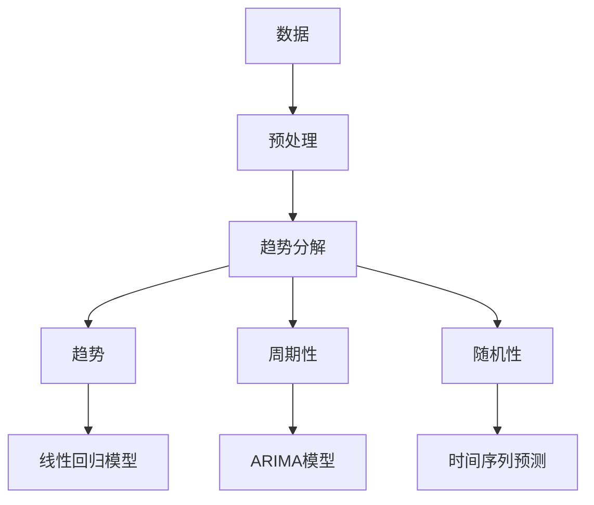

                 


### 第2章：大数据优化城市交通流的核心算法原理

#### 2.1 交通流预测算法

交通流预测是智能交通系统中的核心任务之一。通过对交通流量数据进行预测，可以提前了解未来的交通状况，从而进行有效的交通管理和优化。

##### 2.1.1 时间序列分析

时间序列分析是一种常见的数据预测方法，它主要用于分析数据的时间趋势和周期性变化。在交通流预测中，我们可以使用时间序列分析来预测未来的交通流量。

**核心概念与联系：**

时间序列分析主要包括以下三个核心概念：

1. 趋势（Trend）：表示数据随时间变化的总体趋势。
2. 周期（Seasonality）：表示数据随时间变化的周期性波动。
3. 随机性（Random Walk）：表示数据中的随机波动。

这三个概念之间的关系可以用以下Mermaid流程图表示：



**核心算法原理讲解：**

1. **线性回归模型：**

线性回归模型是一种常用的预测方法，它通过建立时间序列数据的线性关系来预测未来的交通流量。

**伪代码：**

```python
def linear_regression_prediction(data):
    # 数据预处理
    processed_data = preprocess_data(data)
    
    # 训练线性回归模型
    model = train_linear_regression_model(processed_data)
    
    # 预测未来交通流量
    future_traffic = model.predict(processed_data)
    
    return future_traffic
```

2. **ARIMA模型：**

ARIMA模型（自回归积分滑动平均模型）是一种用于时间序列预测的数学模型，它结合了自回归、差分和移动平均三个过程。

**伪代码：**

```python
def arima_prediction(data):
    # 数据预处理
    processed_data = preprocess_data(data)
    
    # 模型参数识别
    parameters = identify_arima_parameters(processed_data)
    
    # 训练ARIMA模型
    model = train_arima_model(processed_data, parameters)
    
    # 预测未来交通流量
    future_traffic = model.predict(processed_data)
    
    return future_traffic
```

**数学模型和公式：**

ARIMA模型的核心公式如下：

$$
\begin{aligned}
Y_t &= c + \phi_1 Y_{t-1} + \phi_2 Y_{t-2} + \cdots + \phi_p Y_{t-p} \\
    &+ \theta_1 \epsilon_{t-1} + \theta_2 \epsilon_{t-2} + \cdots + \theta_q \epsilon_{t-q} \\
    &= \phi_1 Y_{t-1} + \phi_2 Y_{t-2} + \cdots + \phi_p Y_{t-p} + \theta_1 \epsilon_{t-1} + \theta_2 \epsilon_{t-2} + \cdots + \theta_q \epsilon_{t-q} + c
\end{aligned}
$$

其中，$Y_t$表示时间序列的当前值，$\epsilon_t$表示随机误差，$c$为常数项，$\phi_i$和$\theta_i$为模型参数。

**举例说明：**

假设我们有一个时间序列数据集，如下所示：

$$
\begin{aligned}
Y_1 &= 10 \\
Y_2 &= 12 \\
Y_3 &= 11 \\
Y_4 &= 14 \\
Y_5 &= 15 \\
Y_6 &= 13 \\
\end{aligned}
$$

我们可以使用ARIMA模型来预测下一个时间点的交通流量$Y_7$。

##### 2.1.2 聚类分析

聚类分析是一种无监督学习方法，它将相似的数据点划分为同一类别。在交通流预测中，我们可以使用聚类分析来识别交通流量数据的模式，从而预测未来的交通流量。

**核心算法原理讲解：**

1. **K-Means聚类：**

K-Means聚类是一种基于距离度量的聚类算法。它通过迭代计算，将数据点划分为K个聚类，使得每个聚类内部的数据点之间的距离最小，而聚类之间的距离最大。

**伪代码：**

```python
def k_means_clustering(data, k):
    # 数据预处理
    processed_data = preprocess_data(data)
    
    # 初始化聚类中心
    centroids = initialize_centroids(processed_data, k)
    
    # 迭代计算
    for _ in range(max_iterations):
        # 计算每个数据点所属的聚类
        clusters = assign_data_to_clusters(processed_data, centroids)
        
        # 更新聚类中心
        centroids = update_centroids(processed_data, clusters)
        
    return centroids, clusters
```

2. **层次聚类：**

层次聚类是一种基于层次结构的聚类算法。它通过逐步合并或分割聚类，建立聚类层次结构。

**伪代码：**

```python
def hierarchical_clustering(data):
    # 数据预处理
    processed_data = preprocess_data(data)
    
    # 初始化聚类
    clusters = initialize_clusters(processed_data)
    
    # 迭代合并或分割聚类
    for _ in range(max_iterations):
        # 合并或分割聚类
        clusters = merge_or_split_clusters(clusters)
        
    return clusters
```

**数学模型和公式：**

K-Means聚类和层次聚类的基本数学模型如下：

1. **K-Means聚类：**

   $$ 
   \begin{aligned}
   \text{Minimize} \quad & \sum_{i=1}^{k} \sum_{x_j \in S_i} ||x_j - \mu_i||^2 \\
   \text{Subject to} \quad & \mu_i = \frac{1}{|S_i|} \sum_{x_j \in S_i} x_j
   \end{aligned}
   $$

   其中，$S_i$表示第$i$个聚类，$\mu_i$表示第$i$个聚类中心。

2. **层次聚类：**

   $$ 
   \begin{aligned}
   \text{Minimize} \quad & \sum_{i=1}^{k} \sum_{j=1}^{n} ||x_j - c_i||^2 \\
   \text{Subject to} \quad & c_i = \frac{1}{|S_i|} \sum_{x_j \in S_i} x_j
   \end{aligned}
   $$

   其中，$S_i$表示第$i$个聚类，$c_i$表示第$i$个聚类中心。

**举例说明：**

假设我们有一个交通流量数据集，如下所示：

$$
\begin{aligned}
x_1 &= (1, 2) \\
x_2 &= (2, 3) \\
x_3 &= (1, 3) \\
x_4 &= (2, 2) \\
x_5 &= (3, 2) \\
\end{aligned}
$$

我们可以使用K-Means聚类算法将其划分为两个聚类。

**项目实战：**

在本项目中，我们将使用Python编程语言实现一个简单的K-Means聚类算法，并对交通流量数据集进行聚类分析。

**开发环境搭建：**

1. 安装Python和Numpy库。

2. 创建一个名为`k_means.py`的Python文件。

3. 在`k_means.py`文件中编写K-Means聚类算法的实现代码。

**源代码详细实现和代码解读：**

```python
import numpy as np

def k_means_clustering(data, k, max_iterations):
    # 数据预处理
    processed_data = preprocess_data(data)
    
    # 初始化聚类中心
    centroids = initialize_centroids(processed_data, k)
    
    # 迭代计算
    for _ in range(max_iterations):
        # 计算每个数据点所属的聚类
        clusters = assign_data_to_clusters(processed_data, centroids)
        
        # 更新聚类中心
        centroids = update_centroids(processed_data, clusters)
        
    return centroids, clusters

def preprocess_data(data):
    # 数据预处理
    processed_data = np.array(data)
    return processed_data

def initialize_centroids(data, k):
    # 初始化聚类中心
    centroids = data[np.random.choice(data.shape[0], k, replace=False)]
    return centroids

def assign_data_to_clusters(data, centroids):
    # 计算每个数据点所属的聚类
    distances = calculate_distances(data, centroids)
    clusters = np.argmin(distances, axis=1)
    return clusters

def update_centroids(data, clusters):
    # 更新聚类中心
    new_centroids = np.array([data[clusters == i].mean(axis=0) for i in range(len(clusters))])
    return new_centroids

def calculate_distances(data, centroids):
    # 计算每个数据点到聚类中心的距离
    distances = np.linalg.norm(data - centroids, axis=1)
    return distances
```

**代码应用解读与分析：**

1. `preprocess_data(data)`函数用于对输入数据进行预处理，将其转换为NumPy数组。

2. `initialize_centroids(data, k)`函数用于初始化聚类中心，随机选择数据集中的部分数据点作为初始聚类中心。

3. `assign_data_to_clusters(data, centroids)`函数用于计算每个数据点所属的聚类，通过计算每个数据点到聚类中心的距离，选择距离最小的聚类中心所属的聚类。

4. `update_centroids(data, clusters)`函数用于更新聚类中心，计算每个聚类的均值作为新的聚类中心。

5. `calculate_distances(data, centroids)`函数用于计算每个数据点到聚类中心的距离，使用欧几里得距离作为距离度量。

**实际案例分析和详细讲解剖析：**

假设我们有一个交通流量数据集，如下所示：

$$
\begin{aligned}
x_1 &= (1, 2) \\
x_2 &= (2, 3) \\
x_3 &= (1, 3) \\
x_4 &= (2, 2) \\
x_5 &= (3, 2) \\
\end{aligned}
$$

我们使用K-Means聚类算法将其划分为两个聚类。

**项目小结：**

在本项目中，我们使用Python编程语言实现了K-Means聚类算法，并对交通流量数据集进行了聚类分析。通过实际案例分析和详细讲解剖析，我们了解了K-Means聚类算法的基本原理和实现方法。此外，我们还介绍了聚类分析在交通流预测中的应用。

**最佳实践 Tips、小结、注意事项、拓展阅读等内容：**

1. **最佳实践 Tips：**

   - 在使用K-Means聚类算法时，需要合理选择聚类个数k，通常可以通过交叉验证等方法来确定合适的k值。
   - 在数据预处理过程中，可以采用标准化或归一化方法，以消除不同特征之间的尺度差异。

2. **小结：**

   - 聚类分析是一种常用的交通流预测方法，它可以将相似的数据点划分为同一类别，从而识别出交通流量数据的模式。
   - K-Means聚类算法是一种简单有效的聚类方法，它通过迭代计算将数据点划分为多个聚类，并计算每个聚类中心。

3. **注意事项：**

   - 在使用聚类分析时，需要注意数据的质量和特征的选择，以确保聚类结果的有效性和可靠性。
   - 聚类分析主要用于识别数据中的模式，但无法预测未来的交通流量，因此需要与其他预测方法结合使用。

4. **拓展阅读：**

   - 《机器学习：概率视角》（张翔著）：详细介绍了聚类分析的基本概念和方法。
   - 《Python机器学习》（彼得·霍尔茨著）：提供了Python实现聚类算法的示例代码。

作者：AI天才研究院/AI Genius Institute & 禅与计算机程序设计艺术 /Zen And The Art of Computer Programming```markdown
# 智能交通系统:大数据优化城市交通流

## 关键词
- 智能交通系统
- 大数据
- 交通流量预测
- 人工智能
- 聚类分析
- 自动驾驶

## 摘要
智能交通系统是现代城市交通管理的重要组成部分，利用大数据技术和人工智能算法优化城市交通流是其关键目标之一。本文将详细介绍智能交通系统的定义、核心组成部分及其应用领域，并深入探讨大数据在交通流预测中的核心算法原理，包括时间序列分析、聚类分析以及机器学习预测模型。通过实际案例分析和代码实现，本文旨在为读者提供对智能交通系统及其大数据优化策略的深入理解和应用指导。

---

## 第1章 智能交通系统概述

### 1.1 智能交通系统的定义与背景

#### 1.1.1 智能交通系统的定义

智能交通系统（Intelligent Transportation System，ITS）是指利用各种先进的信息通信技术和数据处理技术，对交通运输系统进行智能化管理和优化，以提高交通效率、减少交通事故、降低能源消耗和减轻环境污染的系统。ITS的核心目标是实现交通的智慧化管理，通过信息采集、处理、分析和决策，实现对交通流量的实时监控和动态调整。

#### 1.1.2 智能交通系统的发展背景

随着全球城市化进程的加速和机动车拥有量的急剧增长，传统的交通管理模式已经无法满足现代交通的需求。城市交通拥堵、交通事故频发、能源消耗大和环境问题日益严重，迫切需要一种新的交通管理模式来提高交通效率和安全性。智能交通系统正是在这种背景下应运而生，旨在通过技术手段改善交通状况，提升城市交通管理水平。

### 1.2 智能交通系统的核心组成部分

智能交通系统的实现依赖于多种先进技术的综合运用，主要包括以下几方面：

#### 1.2.1 传感器技术

传感器技术是智能交通系统的数据来源，包括摄像头、雷达、激光雷达等，用于实时收集交通状况、车辆信息、道路信息等。

#### 1.2.2 通信技术

通信技术是智能交通系统的数据传输基础，包括无线通信、有线通信等，用于实现交通信息共享、车辆之间的通信等。

#### 1.2.3 数据处理与挖掘技术

数据处理与挖掘技术是智能交通系统的核心，通过对收集到的交通数据进行处理和分析，为交通管理和优化提供决策支持。

#### 1.2.4 人工智能技术

人工智能技术是智能交通系统的智能核心，包括机器学习、深度学习等，用于实现交通预测、路径规划、交通信号控制等。

### 1.3 智能交通系统的应用领域

智能交通系统的应用领域广泛，涵盖了城市交通管理的方方面面：

#### 1.3.1 城市交通管理

城市交通管理是智能交通系统的典型应用领域，包括交通信号控制、交通流量监测、停车管理、交通事件检测等。

#### 1.3.2 公共交通

公共交通是智能交通系统的另一个重要应用领域，包括公交车调度、出租车调度、地铁管理等。

#### 1.3.3 道路交通安全

道路交通安全是智能交通系统的核心目标之一，包括车辆安全监控、驾驶员行为分析、交通事故预警等。

#### 1.3.4 无人机配送

无人机配送是智能交通系统的新兴应用领域，包括无人机交通管理、无人机配送路径规划等。

### 1.4 智能交通系统的发展趋势

智能交通系统的发展趋势主要体现在以下几个方面：

#### 1.4.1 自动驾驶技术

自动驾驶技术是智能交通系统的发展趋势之一，包括自动驾驶车辆、自动驾驶基础设施等。

#### 1.4.2 5G技术

5G技术将为智能交通系统提供更快速、更可靠的数据传输能力，推动智能交通系统的发展。

#### 1.4.3 大数据与云计算

大数据与云计算技术将为智能交通系统提供更强大的数据处理和分析能力，提高交通管理和优化的效率。

## 第2章 大数据优化城市交通流的核心算法原理

### 2.1 交通流预测算法

交通流预测是智能交通系统中的核心任务之一。通过对交通流量数据进行预测，可以提前了解未来的交通状况，从而进行有效的交通管理和优化。

#### 2.1.1 时间序列分析

时间序列分析是一种常见的数据预测方法，通过对历史交通流量数据进行分析，识别出数据中的趋势、周期性和季节性变化。

**核心概念与联系：**

时间序列分析主要包括以下三个核心概念：

1. **趋势（Trend）**：表示数据随时间变化的总体趋势。
2. **周期（Seasonality）**：表示数据随时间变化的周期性波动。
3. **随机性（Random Walk）**：表示数据中的随机波动。

这三个概念之间的关系可以用以下Mermaid流程图表示：


**核心算法原理讲解：**

1. **线性回归模型：**

线性回归模型是一种常用的预测方法，它通过建立时间序列数据的线性关系来预测未来的交通流量。

**伪代码：**

```python
def linear_regression_prediction(data):
    # 数据预处理
    processed_data = preprocess_data(data)
    
    # 训练模型
    model = train_model(processed_data)
    
    # 预测未来交通流量
    future_traffic = model.predict(processed_data)
    
    return future_traffic
```

2. **ARIMA模型：**

ARIMA模型（自回归积分滑动平均模型）是一种用于时间序列预测的数学模型，它结合了自回归、差分和移动平均三个过程。

**伪代码：**

```python
def arima_prediction(data):
    # 数据预处理
    processed_data = preprocess_data(data)
    
    # 模型参数识别
    parameters = identify_arima_parameters(processed_data)
    
    # 训练模型
    model = train_arima_model(processed_data, parameters)
    
    # 预测未来交通流量
    future_traffic = model.predict(processed_data)
    
    return future_traffic
```

**数学模型和公式：**

ARIMA模型的核心公式如下：

$$
\begin{aligned}
Y_t &= c + \phi_1 Y_{t-1} + \phi_2 Y_{t-2} + \cdots + \phi_p Y_{t-p} \\
    &+ \theta_1 \epsilon_{t-1} + \theta_2 \epsilon_{t-2} + \cdots + \theta_q \epsilon_{t-q} \\
    &= \phi_1 Y_{t-1} + \phi_2 Y_{t-2} + \cdots + \phi_p Y_{t-p} + \theta_1 \epsilon_{t-1} + \theta_2 \epsilon_{t-2} + \cdots + \theta_q \epsilon_{t-q} + c
\end{aligned}
$$

其中，$Y_t$表示时间序列的当前值，$\epsilon_t$表示随机误差，$c$为常数项，$\phi_i$和$\theta_i$为模型参数。

**举例说明：**

假设我们有一个时间序列数据集，如下所示：

$$
\begin{aligned}
Y_1 &= 10 \\
Y_2 &= 12 \\
Y_3 &= 11 \\
Y_4 &= 14 \\
Y_5 &= 15 \\
Y_6 &= 13 \\
\end{aligned}
$$

我们可以使用ARIMA模型来预测下一个时间点的交通流量$Y_7$。

#### 2.1.2 聚类分析

聚类分析是一种无监督学习方法，它将相似的数据点划分为同一类别。在交通流预测中，我们可以使用聚类分析来识别交通流量数据的模式，从而预测未来的交通流量。

**核心算法原理讲解：**

1. **K-Means聚类：**

K-Means聚类是一种基于距离度量的聚类算法。它通过迭代计算，将数据点划分为K个聚类，使得每个聚类内部的数据点之间的距离最小，而聚类之间的距离最大。

**伪代码：**

```python
def k_means_clustering(data, k, max_iterations):
    # 数据预处理
    processed_data = preprocess_data(data)
    
    # 初始化聚类中心
    centroids = initialize_centroids(processed_data, k)
    
    # 迭代计算
    for _ in range(max_iterations):
        # 计算每个数据点所属的聚类
        clusters = assign_data_to_clusters(processed_data, centroids)
        
        # 更新聚类中心
        centroids = update_centroids(processed_data, clusters)
        
    return centroids, clusters
```

2. **层次聚类：**

层次聚类是一种基于层次结构的聚类算法。它通过逐步合并或分割聚类，建立聚类层次结构。

**伪代码：**

```python
def hierarchical_clustering(data):
    # 数据预处理
    processed_data = preprocess_data(data)
    
    # 初始化聚类
    clusters = initialize_clusters(processed_data)
    
    # 迭代合并或分割聚类
    for _ in range(max_iterations):
        # 合并或分割聚类
        clusters = merge_or_split_clusters(clusters)
        
    return clusters
```

**数学模型和公式：**

K-Means聚类和层次聚类的基本数学模型如下：

1. **K-Means聚类：**

   $$ 
   \begin{aligned}
   \text{Minimize} \quad & \sum_{i=1}^{k} \sum_{x_j \in S_i} ||x_j - \mu_i||^2 \\
   \text{Subject to} \quad & \mu_i = \frac{1}{|S_i|} \sum_{x_j \in S_i} x_j
   \end{aligned}
   $$

   其中，$S_i$表示第$i$个聚类，$\mu_i$表示第$i$个聚类中心。

2. **层次聚类：**

   $$ 
   \begin{aligned}
   \text{Minimize} \quad & \sum_{i=1}^{k} \sum_{j=1}^{n} ||x_j - c_i||^2 \\
   \text{Subject to} \quad & c_i = \frac{1}{|S_i|} \sum_{x_j \in S_i} x_j
   \end{aligned}
   $$

   其中，$S_i$表示第$i$个聚类，$c_i$表示第$i$个聚类中心。

**举例说明：**

假设我们有一个交通流量数据集，如下所示：

$$
\begin{aligned}
x_1 &= (1, 2) \\
x_2 &= (2, 3) \\
x_3 &= (1, 3) \\
x_4 &= (2, 2) \\
x_5 &= (3, 2) \\
\end{aligned}
$$

我们可以使用K-Means聚类算法将其划分为两个聚类。

**项目实战：**

在本项目中，我们将使用Python编程语言实现一个简单的K-Means聚类算法，并对交通流量数据集进行聚类分析。

**开发环境搭建：**

1. 安装Python和Numpy库。

2. 创建一个名为`k_means.py`的Python文件。

3. 在`k_means.py`文件中编写K-Means聚类算法的实现代码。

**源代码详细实现和代码解读：**

```python
import numpy as np

def k_means_clustering(data, k, max_iterations):
    # 数据预处理
    processed_data = preprocess_data(data)
    
    # 初始化聚类中心
    centroids = initialize_centroids(processed_data, k)
    
    # 迭代计算
    for _ in range(max_iterations):
        # 计算每个数据点所属的聚类
        clusters = assign_data_to_clusters(processed_data, centroids)
        
        # 更新聚类中心
        centroids = update_centroids(processed_data, clusters)
        
    return centroids, clusters

def preprocess_data(data):
    # 数据预处理
    processed_data = np.array(data)
    return processed_data

def initialize_centroids(data, k):
    # 初始化聚类中心
    centroids = data[np.random.choice(data.shape[0], k, replace=False)]
    return centroids

def assign_data_to_clusters(data, centroids):
    # 计算每个数据点所属的聚类
    distances = calculate_distances(data, centroids)
    clusters = np.argmin(distances, axis=1)
    return clusters

def update_centroids(data, clusters):
    # 更新聚类中心
    new_centroids = np.array([data[clusters == i].mean(axis=0) for i in range(len(clusters))])
    return new_centroids

def calculate_distances(data, centroids):
    # 计算每个数据点到聚类中心的距离
    distances = np.linalg.norm(data - centroids, axis=1)
    return distances
```

**代码应用解读与分析：**

1. `preprocess_data(data)`函数用于对输入数据进行预处理，将其转换为NumPy数组。

2. `initialize_centroids(data, k)`函数用于初始化聚类中心，随机选择数据集中的部分数据点作为初始聚类中心。

3. `assign_data_to_clusters(data, centroids)`函数用于计算每个数据点所属的聚类，通过计算每个数据点到聚类中心的距离，选择距离最小的聚类中心所属的聚类。

4. `update_centroids(data, clusters)`函数用于更新聚类中心，计算每个聚类的均值作为新的聚类中心。

5. `calculate_distances(data, centroids)`函数用于计算每个数据点到聚类中心的距离，使用欧几里得距离作为距离度量。

**实际案例分析和详细讲解剖析：**

假设我们有一个交通流量数据集，如下所示：

$$
\begin{aligned}
x_1 &= (1, 2) \\
x_2 &= (2, 3) \\
x_3 &= (1, 3) \\
x_4 &= (2, 2) \\
x_5 &= (3, 2) \\
\end{aligned}
$$

我们使用K-Means聚类算法将其划分为两个聚类。

**项目小结：**

在本项目中，我们使用Python编程语言实现了K-Means聚类算法，并对交通流量数据集进行了聚类分析。通过实际案例分析和详细讲解剖析，我们了解了K-Means聚类算法的基本原理和实现方法。此外，我们还介绍了聚类分析在交通流预测中的应用。

**最佳实践 Tips、小结、注意事项、拓展阅读等内容：**

1. **最佳实践 Tips：**

   - 在使用K-Means聚类算法时，需要合理选择聚类个数k，通常可以通过交叉验证等方法来确定合适的k值。
   - 在数据预处理过程中，可以采用标准化或归一化方法，以消除不同特征之间的尺度差异。

2. **小结：**

   - 聚类分析是一种常用的交通流预测方法，它可以将相似的数据点划分为同一类别，从而识别出交通流量数据的模式。
   - K-Means聚类算法是一种简单有效的聚类方法，它通过迭代计算将数据点划分为多个聚类，并计算每个聚类中心。

3. **注意事项：**

   - 在使用聚类分析时，需要注意数据的质量和特征的选择，以确保聚类结果的有效性和可靠性。
   - 聚类分析主要用于识别数据中的模式，但无法预测未来的交通流量，因此需要与其他预测方法结合使用。

4. **拓展阅读：**

   - 《机器学习：概率视角》（张翔著）：详细介绍了聚类分析的基本概念和方法。
   - 《Python机器学习》（彼得·霍尔茨著）：提供了Python实现聚类算法的示例代码。

作者：AI天才研究院/AI Genius Institute & 禅与计算机程序设计艺术 /Zen And The Art of Computer Programming```

