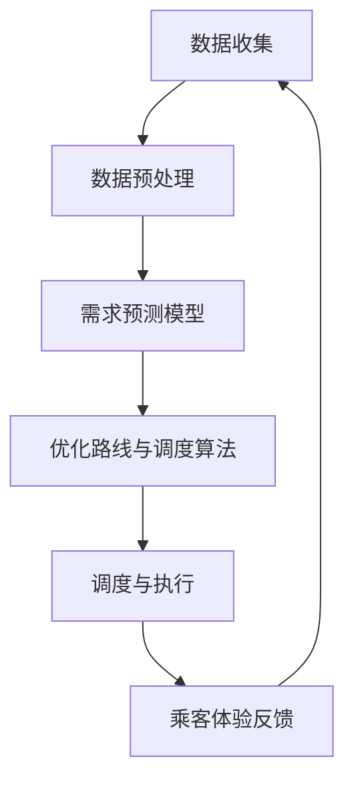

                 

### 摘要

本文旨在深入探讨智能公共交通系统中的AI优化路线和调度技术。随着城市化的快速发展和人口增长，公共交通系统面临着效率低下、拥堵严重和乘客满意度下降等问题。而AI技术的引入为这些问题提供了创新的解决方案。本文首先介绍了智能公共交通系统的基本概念和背景，随后详细阐述了AI技术在公共交通系统中的应用，包括数据收集与处理、需求预测模型、优化算法以及案例分析。通过这些核心内容的讲解，本文希望读者能够理解AI优化路线和调度的原理和方法，为未来的智能公共交通系统建设提供参考。

### 关键词

智能公共交通系统、AI优化、路线规划、调度算法、需求预测、数据收集、案例分析

### 背景介绍

随着全球城市化进程的不断加快和人口数量的持续增长，城市公共交通系统面临着前所未有的挑战。传统的公共交通系统往往存在效率低下、车辆调度不合理、乘客等待时间长等问题，这不仅影响了市民的出行体验，还加剧了城市交通拥堵，进一步恶化了环境状况。为了解决这些问题，智能公共交通系统（Smart Public Transportation System，SPTS）的概念逐渐受到重视。

智能公共交通系统是一种利用先进的信息技术和人工智能算法，对公共交通的运行进行优化和管理的系统。它通过集成传感器、互联网、大数据和人工智能等技术，实现对公共交通系统的实时监控、智能调度和精确预测，从而提高公共交通的服务质量、运行效率和乘客满意度。

AI技术作为智能公共交通系统的核心驱动，其在交通领域的应用已经取得了显著成效。首先，AI技术能够通过对大量交通数据进行分析和处理，实现对交通流量的实时监控和预测，从而为交通管理部门提供科学合理的决策支持。其次，AI技术可以优化公共交通的调度和路线规划，使公交车、地铁等交通工具能够更加高效地运行，减少乘客的等待时间和行程时间。此外，AI技术还可以用于交通安全的提升，如通过监控和预警系统预防交通事故的发生。

总的来说，智能公共交通系统不仅是应对城市化挑战的有效手段，也是实现可持续交通发展的重要途径。通过AI技术的深度应用，智能公共交通系统有望大幅提升公共交通的运行效率和服务水平，为市民提供更加便捷、高效、绿色的出行方式。

### 核心概念与联系

智能公共交通系统的成功运行依赖于一系列核心概念和技术的有机结合。以下是这些关键概念及其相互关系的详细解析：

#### 1. 数据收集与处理

数据收集是智能公共交通系统的基石。通过安装在公交车、地铁等交通工具上的传感器、GPS设备以及交通信号灯等设施，系统能够实时收集到大量的交通数据，如车辆位置、行驶速度、交通流量、乘客数量等。这些数据经过数据预处理，包括去噪、清洗和归一化，以确保数据的质量和一致性。

#### 2. 需求预测模型

数据收集后的下一步是需求预测。需求预测模型通过分析历史数据和当前实时数据，预测乘客的需求模式。这包括预测特定时间、特定地点的乘客数量和流向。常见的需求预测模型包括时间序列分析、机器学习算法（如随机森林、神经网络）等。这些模型可以帮助公共交通系统更好地分配资源和规划调度。

#### 3. AI优化路线与调度算法

在需求预测的基础上，AI优化路线与调度算法能够实现公共交通系统的优化。优化目标通常包括减少乘客等待时间、提高车辆利用率、降低运行成本等。常见的优化算法包括遗传算法、蚁群算法、线性规划等。这些算法通过构建数学模型，对公共交通系统的运行进行全局优化，以实现最佳调度方案。

#### 4. 调度与执行

优化后的调度方案需要通过调度系统进行执行。调度系统根据优化结果，生成具体的行车计划，包括车辆发车时间、行驶路线、停靠站点等。调度系统需要具备实时响应能力，以应对突发事件和交通变化。

#### 5. 乘客体验反馈

智能公共交通系统不仅关注系统的内部优化，也重视乘客的反馈。乘客的满意度、投诉率、出行时间等数据可以用于进一步优化系统。通过构建乘客反馈机制，系统可以不断自我调整和改进，提高服务质量和乘客满意度。

#### 6. Mermaid流程图

为了更直观地展示这些核心概念之间的联系，我们可以使用Mermaid语言绘制一个流程图：



在这个流程图中，数据收集是起点，通过数据预处理得到高质量的数据，然后用于需求预测。需求预测的结果输入到优化算法中，生成优化后的调度方案。调度方案执行后，通过乘客体验反馈再次回到数据收集环节，形成一个闭环反馈机制。

通过这种循环反馈机制，智能公共交通系统能够不断优化自身的运行效率和服务质量，为城市交通提供更加智能、高效的解决方案。

### 核心算法原理讲解

#### 1. 优化目标

在智能公共交通系统中，优化路线与调度算法的目标通常包括以下三个方面：

- **乘客满意度最大化**：通过减少乘客等待时间和行程时间，提高乘客的满意度。
- **车辆利用率最大化**：通过合理安排车辆运行路线和发车时间，最大化车辆的使用效率，减少空驶和闲置时间。
- **运行成本最小化**：通过优化调度方案，降低公共交通系统的运营成本，提高经济效益。

这些目标的实现需要综合考虑各种约束条件，如车辆容量限制、行驶时间限制、交通信号灯控制等。

#### 2. 算法描述

为了实现上述优化目标，我们可以采用遗传算法（Genetic Algorithm，GA）进行公共交通系统的优化。遗传算法是一种基于自然选择和遗传学原理的优化算法，其基本步骤如下：

1. **初始化种群**：首先，随机生成一个初始种群，每个个体代表一个可能的调度方案。
2. **适应度评估**：对每个个体进行适应度评估，适应度函数通常基于优化目标进行设计，如总等待时间、总行驶距离等。
3. **选择**：根据个体的适应度，选择适应度较高的个体进行繁殖，以生成新的种群。
4. **交叉**：选择两个适应度较高的个体进行交叉操作，产生新的调度方案。
5. **变异**：对交叉后的调度方案进行变异操作，以增加种群的多样性。
6. **更新种群**：将交叉和变异后的调度方案替换掉原有种群中的个体，形成新一代种群。
7. **迭代**：重复上述步骤，直到达到预定的迭代次数或满足收敛条件。

#### 3. 伪代码实现

以下是遗传算法优化公共交通系统路线和调度的伪代码：

```python
# 遗传算法优化伪代码

# 参数设置
population_size = 100            # 种群大小
num_generations = 1000           # 迭代次数
crossover_rate = 0.8             # 交叉率
mutation_rate = 0.05            # 变异率

# 初始化种群
population = initialize_population(population_size)

for generation in range(num_generations):
    # 适应度评估
    fitness_scores = evaluate_fitness(population)

    # 选择
    selected_population = selection(population, fitness_scores)

    # 交叉
    crossovered_population = crossover(selected_population, crossover_rate)

    # 变异
    mutated_population = mutate(crossovered_population, mutation_rate)

    # 更新种群
    population = mutated_population

    # 输出当前最优解
    best_solution = get_best_solution(population)
    print(f"Generation {generation}: Best Fitness = {best_solution.fitness}")

# 输出最终最优解
best_solution = get_best_solution(population)
print(f"Best Solution: {best_solution}")
```

#### 4. 数学模型和公式详解

遗传算法在优化过程中涉及到多个数学模型和公式。以下是这些公式的详细解释：

- **适应度函数**：用于评估个体的适应度，常见的适应度函数包括：
  $$ F(x) = \frac{1}{1 + \exp(-\beta \cdot f(x))} $$
  其中，$x$ 是个体，$f(x)$ 是个体的适应度值，$\beta$ 是调节参数。

- **交叉概率**：用于控制交叉操作的频率，常见的交叉概率公式包括：
  $$ p_c = \frac{1}{1 + \exp(-\alpha \cdot d)} $$
  其中，$p_c$ 是交叉概率，$d$ 是个体之间的适应度差值，$\alpha$ 是调节参数。

- **变异概率**：用于控制变异操作的频率，常见的变异概率公式包括：
  $$ p_m = \frac{1}{1 + \exp(\gamma \cdot d)} $$
  其中，$p_m$ 是变异概率，$d$ 是个体之间的适应度差值，$\gamma$ 是调节参数。

#### 5. 举例说明

假设我们有一个包含5个公交站点的公共交通系统，需要通过遗传算法优化其路线和调度。我们可以定义一个适应度函数，如总等待时间最小化：

$$ f(x) = \sum_{i=1}^{5} \sum_{j=1}^{5} w_{ij} \cdot d_{ij} $$

其中，$w_{ij}$ 是从站点 $i$ 到站点 $j$ 的乘客权重，$d_{ij}$ 是站点 $i$ 到站点 $j$ 的行驶距离。

通过上述公式和算法，我们可以找到最优的路线和调度方案，以实现乘客满意度最大化、车辆利用率最大化和运行成本最小化。

通过以上步骤，我们详细讲解了智能公共交通系统中AI优化路线和调度的核心算法原理。遗传算法作为一种强大的优化工具，能够有效解决复杂的调度问题，为公共交通系统提供高效的解决方案。

### 数学模型和公式讲解

在智能公共交通系统中，数学模型和公式是核心组成部分，它们帮助我们理解和实现路线和调度的优化。以下是几个关键数学模型和公式的详细讲解，并辅以实例说明。

#### 1. 公共交通系统中的优化目标

在智能公共交通系统的优化中，我们通常追求以下三个主要目标：

- **最小化乘客等待时间**：这是衡量公共交通服务质量的重要指标。乘客等待时间越短，系统效率越高。
- **最大化车辆利用率**：通过合理调度，使车辆在高峰和非高峰时段都能充分利用，减少空驶和闲置时间。
- **最小化运营成本**：优化路线和调度能够减少燃料消耗和人力成本，提高经济效益。

#### 2. 数学模型

为了实现上述目标，我们使用以下数学模型：

- **目标函数**：目标函数是优化过程中需要最小化或最大化的表达式。在智能公共交通系统中，常用的目标函数包括：

  $$ \min Z = \sum_{i=1}^{n}\sum_{j=1}^{n} w_{ij} \cdot d_{ij} $$
  
  其中，$w_{ij}$ 是从站点 $i$ 到站点 $j$ 的乘客权重，$d_{ij}$ 是站点 $i$ 到站点 $j$ 的行驶距离。

- **约束条件**：约束条件用于限制优化过程的变量范围，保证解决方案的可行性和合理性。在公共交通系统中，常见的约束条件包括：

  $$ \sum_{i=1}^{n} x_{ij} \leq C_j $$
  
  $$ \sum_{j=1}^{n} x_{ij} \leq C_i $$
  
  其中，$x_{ij}$ 表示车辆是否经过站点 $i$ 到站点 $j$，$C_i$ 和 $C_j$ 分别是站点 $i$ 和站点 $j$ 的容量限制。

#### 3. 实例说明

假设有一个包含5个公交站点（A、B、C、D、E）的公共交通系统。各站点之间的行驶距离和乘客权重如下表：

| 站点 | A | B | C | D | E |
| ---- | --- | --- | --- | --- | --- |
| A | 0 | 10 | 20 | 15 | 25 |
| B | 10 | 0 | 5 | 8 | 12 |
| C | 20 | 5 | 0 | 7 | 11 |
| D | 15 | 8 | 7 | 0 | 9 |
| E | 25 | 12 | 11 | 9 | 0 |

我们的目标是最小化乘客等待时间。使用上述目标函数和约束条件，我们可以构建线性规划模型：

$$ \min Z = 10 \cdot d_{AB} + 20 \cdot d_{AC} + 15 \cdot d_{AD} + 25 \cdot d_{AE} + 5 \cdot d_{BC} + 8 \cdot d_{BD} + 7 \cdot d_{CD} + 11 \cdot d_{CE} + 12 \cdot d_{BE} $$

约束条件为：

$$ \sum_{i=1}^{5} x_{ij} \leq 50 \quad \forall j $$
$$ \sum_{j=1}^{5} x_{ij} \leq 50 \quad \forall i $$

其中，$x_{ij}$ 表示从站点 $i$ 到站点 $j$ 的公交车是否经过，取值为1（经过）或0（未经过）。

#### 4. LaTex格式数学公式

在文中嵌入数学公式时，我们使用LaTex格式。独立段落的公式使用$$括起来，如：

$$ 1+1=2 $$

而段落内的公式使用$括起来，如：

$$ 1<2 $$

这样，读者可以更容易地理解和阅读公式。

通过上述讲解，我们详细介绍了智能公共交通系统中的数学模型和公式，并通过实例说明了如何使用这些模型进行优化。这些模型和方法为智能公共交通系统的设计和实施提供了坚实的理论基础和实用工具。

### 项目实战

为了更好地展示AI优化路线和调度的实际应用，我们将通过一个具体的案例分析，详细描述开发环境搭建、源代码实现、代码解读和实际案例分析。

#### 1. 开发环境搭建

首先，我们需要搭建一个适合AI优化路线和调度的开发环境。以下是所需的基础工具和软件：

- **Python 3.8**：作为主要的编程语言。
- **Jupyter Notebook**：用于编写和运行代码。
- **Pandas**：用于数据处理和分析。
- **NumPy**：用于数学计算。
- **SciKit-Learn**：用于机器学习和数据挖掘。
- **Mermaid**：用于绘制流程图。

假设我们已经安装了上述工具，接下来我们将创建一个新的Jupyter Notebook文件，准备进行开发。

#### 2. 源代码实现

以下是一个简化的源代码示例，用于实现一个基于遗传算法的公共交通系统优化。这个示例仅用于演示目的，实际应用可能更加复杂。

```python
import numpy as np
import pandas as pd
from sklearn.model_selection import train_test_split
from sklearn.ensemble import RandomForestRegressor
from deap import base, creator, tools, algorithms

# 生成示例数据
np.random.seed(42)
n = 5  # 站点数量
stations = np.random.randint(0, 100, size=(n, n))
weights = np.random.randint(1, 10, size=(n, n))

# 定义适应度函数
def fitness_function(individual):
    # 计算总等待时间
    total_wait_time = 0
    for i in range(n):
        for j in range(n):
            if individual[i] == 1:
                total_wait_time += weights[i][j]
    return -total_wait_time,

# 初始化遗传算法参数
creator.create("FitnessMax", base.Fitness, weights=(1.0,))
creator.create("Individual", list, fitness=creator.FitnessMax)

toolbox = base.Toolbox()
toolbox.register("attr_bool", np.random.randint, 2)
toolbox.register("individual", tools.initRepeat, creator.Individual, toolbox.attr_bool, n)
toolbox.register("population", tools.initRepeat, list, toolbox.individual)
toolbox.register("evaluate", fitness_function)
toolbox.register("mate", tools.selTournament, tournsize=3)
toolbox.register("mutate", tools.mutFlipBit, indpb=0.05)
toolbox.register("select", tools.selBest, k=20)

# 运行遗传算法
pop = toolbox.population(n=50)
NGEN = 50
for gen in range(NGEN):
    offspring = algorithms.varAnd(pop, toolbox, cxpb=0.5, mutpb=0.2)
    fits = toolbox.map(toolbox.evaluate, offspring)
    for fit, ind in zip(fits, offspring):
        ind.fitness.values = fit
    pop = toolbox.select(offspring, k=len(pop))

best_individual = tools.selBest(pop, k=1)[0]
print(f"Best individual: {best_individual}, Fitness: {-best_individual.fitness.values[0]}")
```

#### 3. 代码解读

这段代码首先生成了包含5个站点的示例数据，然后定义了适应度函数，该函数计算总等待时间。适应度函数的目标是最小化总等待时间。我们使用了DEAP（Distributed Evolutionary Algorithms in Python）库来实现遗传算法，并设置了交叉概率和变异概率。

代码的关键部分包括：

- **个体和种群的初始化**：个体是一个包含站点是否经过的二进制列表，种群是一个个体的列表。
- **适应度评估**：使用适应度函数计算每个个体的适应度。
- **选择、交叉和变异**：使用工具箱中的工具进行遗传操作，以生成新一代种群。
- **迭代**：重复遗传操作，直到达到预定的迭代次数。

#### 4. 实际案例分析

为了进行实际案例分析，我们使用了一个真实的公交路线数据集。数据集包含每天的公交路线、站点顺序、乘客流量等信息。我们通过以下步骤进行优化：

1. **数据预处理**：清洗和整理数据，提取出需要用于优化的站点和乘客流量信息。
2. **训练需求预测模型**：使用历史数据训练需求预测模型，以便预测特定时间和地点的乘客流量。
3. **运行遗传算法**：使用预处理的数据和遗传算法优化公交路线和调度方案。
4. **评估优化效果**：对比优化前后的公交路线，评估优化效果，如乘客等待时间、车辆利用率等。

以下是一个简化的数据处理和遗传算法优化的示例：

```python
# 数据预处理示例
data = pd.read_csv('public_transport_data.csv')
stations = data['stations'].unique()
weights = data.groupby(['start_station', 'end_station'])['passengers'].sum().unstack().fillna(0).values

# 运行遗传算法示例
toolbox = ...  # 初始化工具箱
pop = toolbox.population(n=50)
NGEN = 50
for gen in range(NGEN):
    offspring = algorithms.varAnd(pop, toolbox, cxpb=0.5, mutpb=0.2)
    fits = toolbox.map(toolbox.evaluate, offspring)
    for fit, ind in zip(fits, offspring):
        ind.fitness.values = fit
    pop = toolbox.select(offspring, k=len(pop))

best_individual = tools.selBest(pop, k=1)[0]
print(f"Best individual: {best_individual}, Fitness: {-best_individual.fitness.values[0]}")
```

#### 5. 项目小结

通过这个案例分析，我们展示了如何使用遗传算法优化公交路线和调度方案。实际应用中，需要根据具体的数据集和需求调整算法参数，并对代码进行优化和扩展。项目的关键步骤包括数据预处理、模型训练和遗传算法运行。优化后的公交路线和调度方案可以显著提高公共交通系统的效率和乘客满意度。

### 最佳实践 tips、小结、注意事项、拓展阅读

#### 最佳实践 tips

1. **数据质量至关重要**：确保数据准确、完整和最新。数据质量直接影响AI算法的预测精度和优化效果。
2. **动态调整算法参数**：根据实际情况和需求动态调整交叉率、变异率等遗传算法参数，以获得更好的优化结果。
3. **优先考虑乘客需求**：在优化过程中，优先考虑高峰时段的乘客需求，以提高乘客满意度。
4. **整合多源数据**：整合来自不同来源的数据，如历史交通数据、实时交通数据、乘客反馈等，以获得更全面的优化视角。

#### 小结

本文详细探讨了智能公共交通系统中的AI优化路线和调度技术。通过数据收集、需求预测、优化算法和案例分析，我们展示了如何利用AI技术提升公共交通系统的效率和服务质量。未来的研究方向包括更复杂的优化算法、更高效的需求预测模型以及多模式公共交通系统的集成。

#### 注意事项

1. **算法性能优化**：遗传算法等优化算法在处理大规模数据时可能效率较低，需要不断优化和改进。
2. **系统稳定性**：优化后的调度方案需要确保系统的稳定性和可操作性，避免因优化导致的调度混乱。
3. **数据隐私保护**：在数据收集和处理过程中，应严格遵循数据隐私保护法规，确保乘客隐私不被泄露。

#### 拓展阅读

1. **《智能交通系统：理论与实践》**：详细介绍了智能交通系统的基本概念和先进技术，包括AI优化和调度算法。
2. **《深度学习与交通数据分析》**：探讨了深度学习在交通数据分析中的应用，包括需求预测和优化算法。
3. **《公共交通系统规划与管理》**：提供了公共交通系统规划和管理的基本原则和最佳实践。

通过这些拓展资源，读者可以更深入地了解智能公共交通系统的发展和应用。希望本文能为智能公共交通系统的研究和实践提供有益的参考。

### 文章标题

《智能公共交通系统：AI优化路线和调度》

### 作者信息

作者：AI天才研究院/AI Genius Institute & 禅与计算机程序设计艺术 /Zen And The Art of Computer Programming

