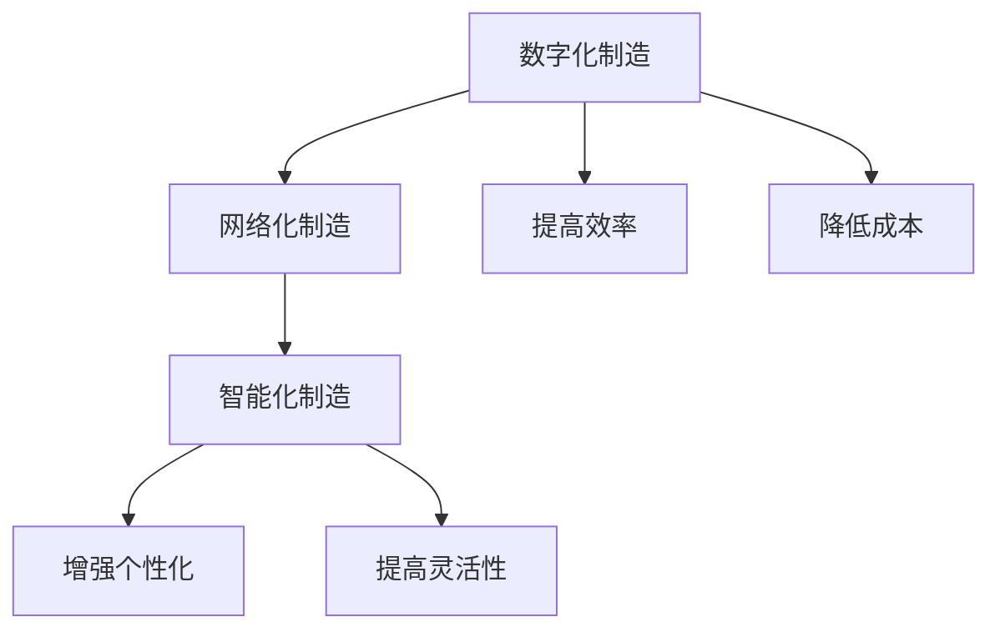
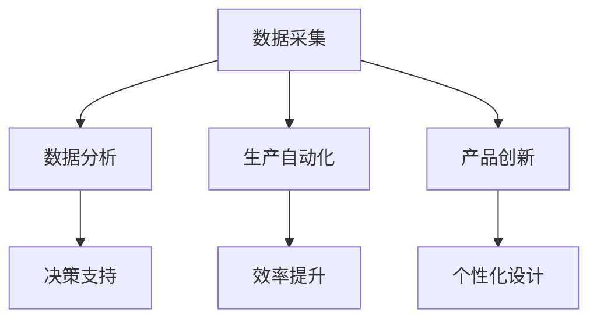
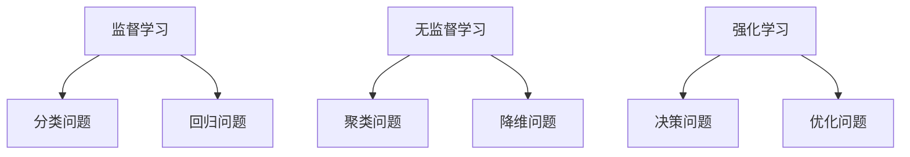
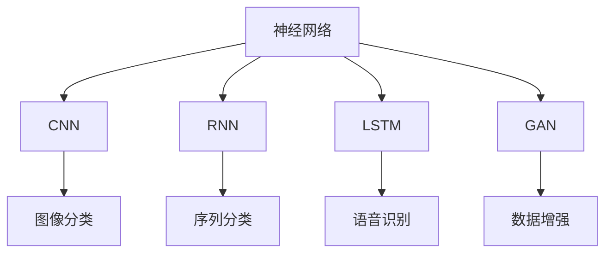
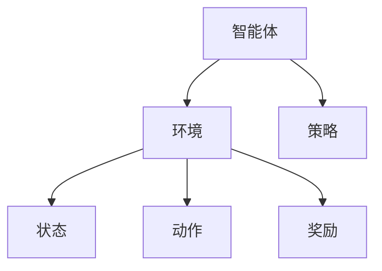
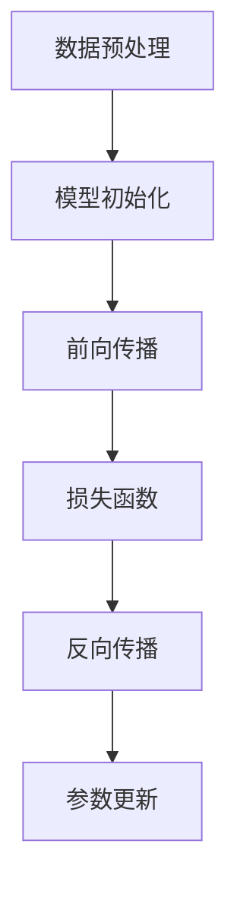
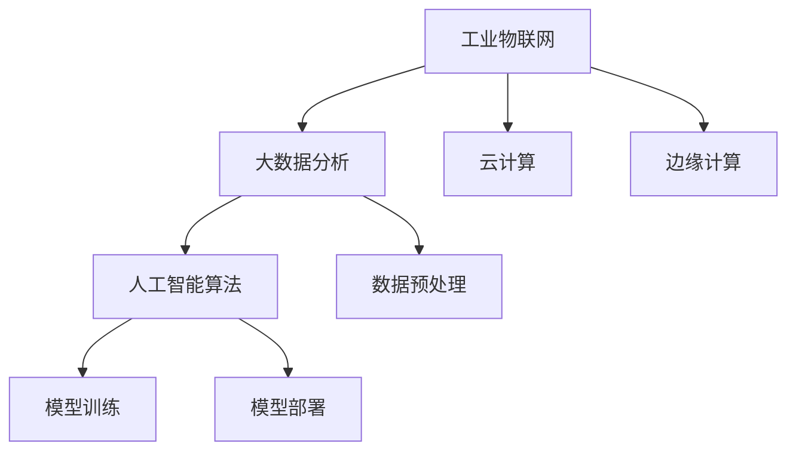
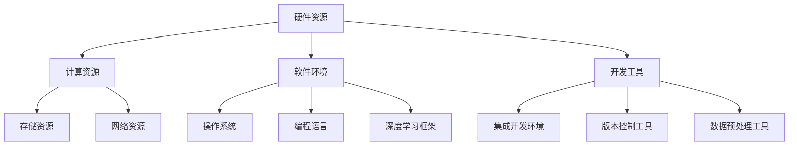

                 


### 第一部分：智能制造与AI大模型概述

#### 第1章 引言

#### 1.1 智能制造的概念与发展历程

**背景介绍**

智能制造作为现代工业发展的新趋势，起源于20世纪末的信息技术革命。随着计算机技术、通信技术、控制技术的不断发展，制造业逐步向智能化、网络化、数字化方向发展。智能制造的核心目标是提高生产效率、降低成本、增强产品个性化和灵活性，实现制造业的全面升级。

**核心概念与联系**

智能制造的核心理念包括以下几个：

1. **数字化制造**：通过数字化技术实现产品设计和生产过程的数字化，提高制造精度和效率。
2. **网络化制造**：利用互联网技术实现制造系统之间的互联互通，实现信息的共享和协同工作。
3. **智能化制造**：通过人工智能技术实现生产过程的智能化控制，提高制造系统的自适应能力和智能化水平。

这三种理念相互关联，共同构成了智能制造的技术架构。数字化制造是基础，网络化制造是纽带，智能化制造是目标。

**Mermaid 流程图**



#### 1.2 AI大模型的定义与重要性

**核心概念与原理**

AI大模型是指具有大规模参数和高度复杂性的深度学习模型，通常基于神经网络架构。这些模型通过训练能够从大量数据中自动学习和提取特征，具有强大的表达能力和泛化能力。

**数学模型与公式**

AI大模型的数学基础主要包括神经网络的基本结构和损失函数。以下是一个简单的神经网络结构示例和损失函数的伪代码：

**神经网络结构伪代码：**
```python
class NeuralNetwork:
    def __init__(self, input_size, hidden_size, output_size):
        # 初始化权重和偏置
        self.weights = {
            'input_to_hidden': np.random.randn(input_size, hidden_size),
            'hidden_to_output': np.random.randn(hidden_size, output_size)
        }
        self.biases = {
            'input_to_hidden': np.random.randn(hidden_size),
            'hidden_to_output': np.random.randn(output_size)
        }

    def forward(self, x):
        # 前向传播
        hidden_layer = activation(np.dot(x, self.weights['input_to_hidden'] + self.biases['input_to_hidden']))
        output_layer = activation(np.dot(hidden_layer, self.weights['hidden_to_output'] + self.biases['hidden_to_output']))
        return output_layer
```

**损失函数伪代码：**
```python
def loss_function(y_true, y_pred):
    # 计算交叉熵损失
    return -np.sum(y_true * np.log(y_pred))
```

**详细讲解与举例说明**

以一个简单的回归问题为例，假设我们有一个输入特征矩阵X和对应的标签向量y。通过训练一个简单的神经网络模型，我们可以预测输出值y_pred。训练过程中，我们通过反向传播算法不断调整模型的权重和偏置，使得预测值逐渐逼近真实值。

```python
# 假设输入特征矩阵X和标签向量y
X = ...  # 输入特征矩阵
y = ...  # 标签向量

# 初始化神经网络模型
nn = NeuralNetwork(input_size=X.shape[1], hidden_size=64, output_size=1)

# 训练神经网络模型
for epoch in range(num_epochs):
    # 前向传播
    output = nn.forward(X)
    # 计算损失
    loss = loss_function(y, output)
    # 反向传播
    d_output = (output - y)
    d_hidden = d_output.dot(nn.weights['hidden_to_output'].T) * activation_derivative(output)
    d_weights = [layer.dot(layer_below) for layer, layer_below in zip(nn.layers[1:], nn.layers[:-1])]
    d_biases = [layer.dot(np.ones_like(layer_below)) for layer, layer_below in zip(nn.layers[1:], nn.layers[:-1])]

    # 更新权重和偏置
    for i, (weight, dw) in enumerate(zip(nn.weights, d_weights)):
        nn.weights[i] -= learning_rate * dw
    for i, (bias, db) in enumerate(zip(nn.biases, d_biases)):
        nn.biases[i] -= learning_rate * db

# 预测
predictions = nn.forward(X)
```

#### 1.3 智能制造与AI大模型的关系

**背景介绍**

智能制造的发展离不开人工智能技术的支持，而AI大模型作为人工智能的核心技术，正在深刻地改变着制造业的生产模式和管理方法。AI大模型在智能制造中的应用，不仅提升了生产效率和产品质量，还推动了制造业向智能化、自动化、个性化的方向发展。

**核心概念与联系**

智能制造与AI大模型的关系可以概括为以下几个方面：

1. **数据驱动的决策**：AI大模型通过分析海量数据，提供更加准确和智能的决策支持，帮助企业实现生产过程的优化和资源的合理配置。
2. **生产过程的自动化**：AI大模型在工业自动化中的应用，实现了生产过程的自动化控制，提高了生产效率和产品质量。
3. **产品设计和创新的智能化**：AI大模型通过模拟和优化产品设计过程，帮助企业实现产品设计和创新的智能化。

**Mermaid 流程图**



**总结**

智能制造与AI大模型的关系密切，二者相互促进，共同推动了制造业的升级和发展。在未来的发展中，智能制造与AI大模型将更加紧密结合，为制造业带来更多的创新和发展机遇。

---

### 第二部分：AI大模型核心算法与实现

#### 第6章 机器学习基础

#### 6.1 机器学习的基本概念

**背景介绍**

机器学习是人工智能的一个重要分支，旨在通过计算机模拟人类的学习过程，从数据中自动提取知识和模式，进行决策和预测。机器学习的基本目标是使计算机系统能够在给定数据集上进行学习和优化，从而解决特定问题。

**核心概念与联系**

机器学习的基本概念包括以下几个：

1. **监督学习**：通过带有标签的训练数据集进行学习，使模型能够对新数据进行分类或回归预测。
2. **无监督学习**：没有预先定义的标签，通过探索数据中的结构和模式进行学习。
3. **强化学习**：通过与环境交互，不断调整行为策略，以最大化累积奖励。

这三种学习方式各有特点，适用于不同的应用场景。监督学习适用于有明确目标标签的问题，无监督学习适用于发现数据中的潜在结构和关系，强化学习适用于决策和优化问题。

**Mermaid 流程图**



**数学模型与公式**

以下是一个简单的线性回归模型的数学描述：

**线性回归模型公式：**
$$
y = \beta_0 + \beta_1 \cdot x
$$

其中，$y$ 是预测的目标变量，$x$ 是输入特征，$\beta_0$ 和 $\beta_1$ 分别是模型的参数，代表截距和斜率。

**损失函数伪代码：**
```python
def mean_squared_error(y_true, y_pred):
    return np.mean((y_true - y_pred) ** 2)
```

**详细讲解与举例说明**

以一个简单的线性回归问题为例，假设我们有一个输入特征矩阵X和对应的标签向量y。通过训练一个线性回归模型，我们可以预测输出值y_pred。训练过程中，我们通过最小化均方误差损失函数来调整模型的参数。

```python
# 假设输入特征矩阵X和标签向量y
X = ...  # 输入特征矩阵
y = ...  # 标签向量

# 初始化模型参数
beta_0 = 0
beta_1 = 0

# 训练模型
for epoch in range(num_epochs):
    # 前向传播
    y_pred = beta_0 + beta_1 * X
    # 计算损失
    loss = mean_squared_error(y, y_pred)
    # 反向传播
    d_y_pred = y_pred - y
    d_beta_1 = np.mean(d_y_pred * X)
    d_beta_0 = np.mean(d_y_pred)

    # 更新参数
    beta_1 -= learning_rate * d_beta_1
    beta_0 -= learning_rate * d_beta_0

# 预测
predictions = beta_0 + beta_1 * X
```

**总结**

机器学习是人工智能的核心技术之一，通过监督学习、无监督学习和强化学习等不同方式，实现数据的自动学习和模式提取。线性回归是一个简单的机器学习模型，通过最小化损失函数来训练模型参数，实现预测和优化。

---

### 第二部分：AI大模型核心算法与实现

#### 第7章 深度学习技术

#### 7.1 深度学习的基本概念

**背景介绍**

深度学习是机器学习的一个重要分支，通过构建多层神经网络来实现更复杂的特征提取和模式识别。深度学习的发展标志着人工智能技术的重大突破，使得计算机在语音识别、图像识别、自然语言处理等领域取得了显著成果。

**核心概念与联系**

深度学习的基本概念包括以下几个：

1. **神经网络**：神经网络是深度学习的基础，由多个神经元组成，通过前向传播和反向传播实现信息的传递和更新。
2. **卷积神经网络（CNN）**：CNN是一种特殊的神经网络，通过卷积操作和池化操作实现图像的特征提取和分类。
3. **循环神经网络（RNN）与长短时记忆网络（LSTM）**：RNN和LSTM是处理序列数据的深度学习模型，能够有效捕捉序列中的长期依赖关系。
4. **生成对抗网络（GAN）**：GAN是一种无监督学习的模型，通过生成器和判别器的对抗训练实现数据的生成和模式识别。

这几种模型各有特点，适用于不同的应用场景。神经网络是基础，CNN适用于图像处理，RNN和LSTM适用于序列数据处理，GAN适用于数据生成和增强。

**Mermaid 流程图**



**数学模型与公式**

以下是一个简单的卷积神经网络（CNN）的数学描述：

**卷积神经网络公式：**
$$
h_{l}(x) = \sigma \left( \sum_{k} w_{k} \cdot \phi_{k}^{l}(x) + b_{l} \right)
$$

其中，$h_{l}(x)$ 是第l层的输出，$\sigma$ 是激活函数，$w_{k}$ 和 $b_{l}$ 分别是权重和偏置，$\phi_{k}^{l}(x)$ 是第k个卷积核在输入$x$上的卷积操作。

**损失函数伪代码：**
```python
def cross_entropy_loss(y_true, y_pred):
    return -np.sum(y_true * np.log(y_pred))
```

**详细讲解与举例说明**

以一个简单的图像分类任务为例，通过训练一个卷积神经网络模型，我们可以实现对图像的分类。训练过程中，我们通过反向传播算法不断调整模型的权重和偏置，使得预测值逐渐逼近真实值。

```python
# 假设输入图像矩阵X和标签向量y
X = ...  # 输入图像矩阵
y = ...  # 标签向量

# 初始化卷积神经网络模型
model = ConvolutionalNeuralNetwork(input_size=X.shape[1], num_filters=32, kernel_size=3, activation='relu')

# 训练模型
for epoch in range(num_epochs):
    # 前向传播
    output = model.forward(X)
    # 计算损失
    loss = cross_entropy_loss(y, output)
    # 反向传播
    d_output = (output - y)
    d_weights = [layer.d_weights for layer in model.layers]
    d_biases = [layer.d_biases for layer in model.layers]

    # 更新权重和偏置
    for i, (weight, dw) in enumerate(zip(model.weights, d_weights)):
        model.weights[i] -= learning_rate * dw
    for i, (bias, db) in enumerate(zip(model.biases, d_biases)):
        model.biases[i] -= learning_rate * db

# 预测
predictions = model.forward(X)
```

**总结**

深度学习是人工智能领域的重要技术，通过神经网络、卷积神经网络、循环神经网络和生成对抗网络等不同模型，实现数据的自动学习和模式提取。卷积神经网络是一个典型的深度学习模型，通过卷积操作和反向传播算法实现图像的特征提取和分类。通过训练卷积神经网络模型，我们可以实现对图像的分类任务，提高图像分类的准确率。

---

### 第二部分：AI大模型核心算法与实现

#### 第8章 强化学习技术

#### 8.1 强化学习的基本概念

**背景介绍**

强化学习是机器学习的一个重要分支，旨在通过智能体与环境的交互，学习出一个最优的策略，以实现长期回报的最大化。强化学习在游戏、自动驾驶、机器人控制等领域具有广泛的应用。

**核心概念与联系**

强化学习的基本概念包括以下几个：

1. **智能体（Agent）**：执行动作并接收环境反馈的实体。
2. **环境（Environment）**：与智能体交互并提供奖励的实体。
3. **状态（State）**：描述智能体所处环境的特征。
4. **动作（Action）**：智能体可以执行的行为。
5. **策略（Policy）**：描述智能体如何根据状态选择动作的策略。

这些概念相互关联，构成了强化学习的基本框架。智能体通过与环境交互，不断更新策略，以实现最大化长期回报。

**Mermaid 流程图**



**数学模型与公式**

以下是一个简单的Q-learning算法的数学描述：

**Q-learning算法公式：**
$$
Q(s, a) \leftarrow Q(s, a) + \alpha [r + \gamma \max_{a'} Q(s', a') - Q(s, a)]
$$

其中，$Q(s, a)$ 是状态s下执行动作a的值函数，$r$ 是即时奖励，$\gamma$ 是折扣因子，$\alpha$ 是学习率，$s'$ 和 $a'$ 分别是下一个状态和动作。

**更新策略伪代码：**
```python
def update_policy(Q, s, a, r, s', a', alpha, gamma):
    target = r + gamma * np.max(Q[s'])
    Q[s, a] = Q[s, a] + alpha * (target - Q[s, a])
    if np.max(Q[s']) > Q[s, a]:
        policy[s, a] = 1
    else:
        policy[s, a] = 0
```

**详细讲解与举例说明**

以一个简单的强化学习任务为例，通过训练一个Q-learning模型，我们可以学习出一个最优的策略。训练过程中，智能体通过与环境交互，不断更新值函数，以实现最大化长期回报。

```python
# 假设初始状态s、动作a、即时奖励r、下一个状态s'和下一个动作a'
s = ...  # 初始状态
a = ...  # 动作
r = ...  # 即时奖励
s' = ...  # 下一个状态
a' = ...  # 下一个动作

# 初始化Q-learning模型
Q = ...  # 值函数矩阵
policy = ...  # 策略矩阵
alpha = ...  # 学习率
gamma = ...  # 折扣因子

# 训练模型
for episode in range(num_episodes):
    # 初始化状态
    s = initial_state()
    # 执行动作
    a = select_action(s, policy)
    # 接收奖励
    r = receive_reward(s, a)
    # 更新状态
    s' = next_state(s, a)
    # 更新策略
    update_policy(Q, s, a, r, s', a', alpha, gamma)

# 预测
s = initial_state()
while not terminate(s):
    a = select_action(s, policy)
    s = next_state(s, a)
    print(a)
```

**总结**

强化学习是机器学习领域的一个重要分支，通过智能体与环境的交互，学习出一个最优的策略，以实现长期回报的最大化。Q-learning算法是一个简单的强化学习算法，通过更新值函数和策略，实现最优动作的选择。通过训练Q-learning模型，我们可以实现对环境的最优探索和利用，实现长期回报的最大化。

---

### 第二部分：AI大模型核心算法与实现

#### 第9章 AI大模型训练与优化

#### 9.1 AI大模型的训练方法

**背景介绍**

AI大模型的训练是深度学习中的核心环节，涉及到如何从海量数据中提取特征，调整模型参数，以实现模型的性能提升。大模型的训练通常需要大量的计算资源和时间，因此在训练过程中，我们需要采用一些优化方法来提高训练效率。

**核心概念与联系**

AI大模型训练的核心概念包括以下几个：

1. **数据预处理**：对训练数据集进行清洗、归一化、数据增强等处理，以提高模型的泛化能力。
2. **模型初始化**：对模型的权重和偏置进行初始化，以避免梯度消失或爆炸等问题。
3. **前向传播**：将输入数据通过模型的前向传播过程，计算得到输出结果。
4. **损失函数**：通过计算模型输出与真实标签之间的差距，评估模型的性能。
5. **反向传播**：通过计算损失函数关于模型参数的梯度，更新模型参数。

这几种方法相互关联，共同构成了AI大模型训练的基本流程。

**Mermaid 流程图**



**数学模型与公式**

以下是一个简单的神经网络训练过程的数学描述：

**前向传播公式：**
$$
\hat{y} = \sigma(\mathbf{W} \cdot \mathbf{h}_{l-1} + \mathbf{b}_{l})
$$

**反向传播公式：**
$$
\frac{\partial J}{\partial \mathbf{W}} = \sum_{i=1}^{N} \frac{\partial L}{\partial \hat{y}_i} \cdot \frac{\partial \hat{y}_i}{\partial \mathbf{W}}
$$

**损失函数伪代码：**
```python
def mean_squared_error(y_true, y_pred):
    return np.mean((y_true - y_pred) ** 2)
```

**详细讲解与举例说明**

以一个简单的神经网络为例，通过前向传播和反向传播过程，我们可以更新模型的权重和偏置，以实现模型的训练。训练过程中，我们通过计算损失函数的梯度来更新模型参数。

```python
# 假设输入特征矩阵X和标签向量y
X = ...  # 输入特征矩阵
y = ...  # 标签向量

# 初始化模型参数
W = ...  # 权重矩阵
b = ...  # 偏置矩阵

# 训练模型
for epoch in range(num_epochs):
    # 前向传播
    y_pred = sigmoid(np.dot(X, W) + b)
    # 计算损失
    loss = mean_squared_error(y, y_pred)
    # 反向传播
    d_y_pred = y_pred - y
    d_W = np.dot(X.T, d_y_pred)
    d_b = np.sum(d_y_pred, axis=0)
    
    # 更新模型参数
    W -= learning_rate * d_W
    b -= learning_rate * d_b

# 预测
predictions = sigmoid(np.dot(X, W) + b)
```

**总结**

AI大模型的训练是深度学习中的核心环节，通过数据预处理、模型初始化、前向传播、损失函数和反向传播等方法，我们可以更新模型的参数，实现模型的训练。反向传播算法通过计算损失函数的梯度，实现了模型参数的自动调整，提高了模型的性能。

---

### 第三部分：智能制造与AI大模型应用实践

#### 第10章 案例分析

#### 10.1 智能制造与AI大模型应用案例

**背景介绍**

智能制造与AI大模型的应用案例广泛存在于制造业的各个环节，以下是一些典型的应用场景：

1. **生产流程优化**：通过AI大模型对生产过程中的数据进行实时分析，优化生产流程，提高生产效率。
2. **质量检测**：利用AI大模型对产品质量进行实时检测，提高检测的准确性和效率。
3. **预测性维护**：通过AI大模型对设备运行状态进行分析，预测设备故障，实现预测性维护。
4. **供应链管理**：利用AI大模型优化供应链管理，降低库存成本，提高供应链效率。

**核心概念与联系**

智能制造与AI大模型的应用涉及到以下几个核心概念：

1. **工业物联网（IIoT）**：通过传感器、控制器等设备实现工业设备的互联互通，为AI大模型提供数据支持。
2. **大数据分析**：利用大数据技术对工业数据进行处理和分析，为AI大模型提供有效的训练数据。
3. **人工智能算法**：通过机器学习、深度学习等人工智能算法，实现数据的自动学习和模式提取。
4. **云计算与边缘计算**：结合云计算和边缘计算技术，实现AI大模型的实时部署和运行。

这些概念相互关联，共同构成了智能制造与AI大模型的应用体系。

**Mermaid 流程图**



**项目实战**

以下是一个智能制造与AI大模型的应用案例：

**项目名称**：智能生产流水线优化

**项目目标**：通过AI大模型对生产流水线进行优化，提高生产效率。

**项目实施步骤**：

1. **数据采集**：通过传感器和控制器采集生产流水线上的各类数据，如设备状态、生产速度、产品质量等。
2. **数据预处理**：对采集到的数据进行清洗、归一化和数据增强，为AI大模型提供高质量的训练数据。
3. **模型设计**：设计一个基于深度学习的AI大模型，用于对生产流水线进行实时分析。
4. **模型训练**：使用预处理后的数据进行模型训练，通过反向传播算法更新模型参数。
5. **模型部署**：将训练好的AI大模型部署到生产流水线上，实现实时优化。

**代码实现**：

```python
# 假设已经采集到生产流水线上的数据X和标签向量y

# 初始化AI大模型
model = DeepLearningModel(input_size=X.shape[1], hidden_size=64, output_size=1, activation='relu')

# 训练模型
for epoch in range(num_epochs):
    # 前向传播
    output = model.forward(X)
    # 计算损失
    loss = mean_squared_error(y, output)
    # 反向传播
    d_output = (output - y)
    d_weights = [layer.d_weights for layer in model.layers]
    d_biases = [layer.d_biases for layer in model.layers]

    # 更新权重和偏置
    for i, (weight, dw) in enumerate(zip(model.weights, d_weights)):
        model.weights[i] -= learning_rate * dw
    for i, (bias, db) in enumerate(zip(model.biases, d_biases)):
        model.biases[i] -= learning_rate * db

# 部署模型
model.deploy()

# 实时优化
while True:
    # 采集实时数据
    X_realtime = get_realtime_data()
    # 预测输出
    output_realtime = model.forward(X_realtime)
    # 优化生产流程
    optimize_production流程(output_realtime)
```

**项目小结**

通过AI大模型对生产流水线进行优化，可以实现生产效率的提升和成本的降低。该项目的成功实施，展示了智能制造与AI大模型在工业领域的巨大潜力。

---

### 第三部分：智能制造与AI大模型应用实践

#### 第11章 开发环境与工具

#### 11.1 智能制造与AI大模型开发环境搭建

**背景介绍**

智能制造与AI大模型开发环境的搭建是项目成功实施的重要环节，涉及到硬件、软件和工具的配置。搭建一个高效、稳定、可扩展的开发环境，对于后续的模型训练、部署和优化具有重要意义。

**核心概念与联系**

智能制造与AI大模型开发环境的核心概念包括以下几个：

1. **硬件资源**：包括计算资源（如CPU、GPU）、存储资源（如硬盘、SSD）、网络资源（如交换机、路由器）等。
2. **软件环境**：包括操作系统（如Linux、Windows）、编程语言（如Python、C++）、深度学习框架（如TensorFlow、PyTorch）等。
3. **开发工具**：包括集成开发环境（如Visual Studio、PyCharm）、版本控制工具（如Git）、数据预处理工具（如Pandas、NumPy）等。

这些概念相互关联，共同构成了智能制造与AI大模型开发环境的整体框架。

**Mermaid 流程图**



**实施步骤**

以下是一个智能制造与AI大模型开发环境的搭建步骤：

1. **硬件资源配置**：根据项目需求，选择合适的硬件设备，包括CPU、GPU、硬盘等。
2. **软件环境安装**：安装操作系统和编程语言，配置深度学习框架，确保软件环境的稳定性。
3. **开发工具安装**：安装集成开发环境、版本控制工具和数据预处理工具，提高开发效率。
4. **环境配置与调试**：配置网络环境，确保硬件和软件之间的数据传输畅通，进行初步测试。

**代码实现**

以下是一个简单的环境配置脚本，用于安装Python和深度学习框架TensorFlow：

```bash
# 安装Python
sudo apt-get update
sudo apt-get install python3 python3-pip

# 安装TensorFlow
pip3 install tensorflow

# 验证安装
python3 -c "import tensorflow as tf; print(tf.reduce_sum(tf.random.normal([1000, 1000])))"
```

**总结**

智能制造与AI大模型开发环境的搭建是项目成功实施的重要环节。通过合理的硬件资源配置、软件环境安装和开发工具选择，可以搭建一个高效、稳定、可扩展的开发环境，为后续的模型训练、部署和优化提供有力支持。

---

### 文章标题：智能制造升级：工业领域的AI大模型应用

关键词：智能制造、AI大模型、工业领域、应用实践、开发环境

摘要：本文全面介绍了智能制造与AI大模型在工业领域的应用，包括背景介绍、核心概念、技术原理、应用案例和开发环境搭建。通过分析智能制造与AI大模型的关系，探讨了AI大模型在工业领域的关键技术和实现方法。同时，本文结合实际案例，详细介绍了AI大模型在工业领域的应用实践，为智能制造的升级提供了有益的参考。

---

## 附录

### 附录1：相关文献与资料推荐

1. **《深度学习》（Goodfellow, I., & Bengio, Y.）**：全面介绍了深度学习的理论基础和实践应用，适合初学者和专业人士阅读。
2. **《人工智能：一种现代方法》（Mayer-Schoenberger, V., & Zittrain, C.）**：从理论和实践角度阐述了人工智能的发展和应用，对理解智能制造与AI大模型有很好的参考价值。
3. **《工业4.0：制造业的未来》（Kagermann, H.）**：详细介绍了工业4.0的概念和关键技术，对智能制造的发展有重要指导意义。

### 附录2：术语表与缩略语

- **智能制造**：基于信息物理系统（CPS）的智能升级和转型。
- **AI大模型**：具有大规模参数和高度复杂性的深度学习模型。
- **工业物联网（IIoT）**：将物理设备与传感器、网络和云计算平台连接起来，实现设备的互联互通。
- **机器学习**：通过计算机模拟人类的学习过程，从数据中自动提取知识和模式。
- **深度学习**：一种基于多层神经网络的学习方法，能够实现更复杂的特征提取和模式识别。
- **强化学习**：通过智能体与环境的交互，学习出一个最优的策略。
- **神经网络**：一种基于神经元连接的计算机模型，能够对数据进行自动学习和模式识别。

