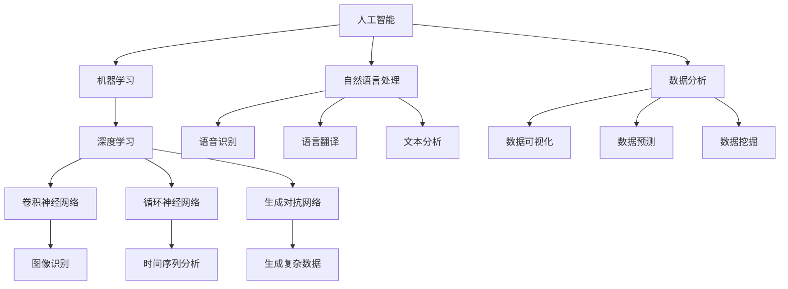

                 


### 设计《智能办公：AI提升职场生产力的新工具》的目录大纲

为了设计《智能办公：AI提升职场生产力的新工具》的目录大纲，我们需要遵循以下步骤：

1. **确定核心章节**：根据书名，核心章节应该包括智能办公的基本概念、AI技术的应用、AI工具的实战案例等。

2. **规划章节结构**：在确定核心章节后，我们需要将每个章节进一步拆分为子章节，以确保内容的逻辑性和全面性。

3. **编写具体内容**：在每个子章节中，我们需要包括核心概念、原理讲解、数学模型、伪代码、实际案例等。

4. **确保完整性**：整个目录大纲至少需要包含7个核心章节，每个章节下有多个子章节。

5. **保持简洁性**：内容要简洁明了，避免多余的文字。

6. **使用markdown格式**：使用markdown格式来组织目录和子章节，使文档结构清晰。

7. **控制字数**：整个目录大纲的总字数控制在2000字以内。

### 目录大纲设计

下面是《智能办公：AI提升职场生产力的新工具》的目录大纲：

## 《智能办公：AI提升职场生产力的新工具》目录大纲

## 第1章 引言与背景
### 1.1 智能办公的概念与重要性
### 1.2 AI在职场中的应用现状
### 1.3 书籍结构安排

## 第2章 AI技术基础
### 2.1 人工智能的基本概念
### 2.2 机器学习原理
### 2.3 深度学习基础
### 2.4 人工智能的发展趋势

## 第3章 AI工具在办公中的应用
### 3.1 自然语言处理
#### 3.1.1 语音识别
#### 3.1.2 语言翻译
#### 3.1.3 文本分析
### 3.2 数据分析
#### 3.2.1 数据可视化
#### 3.2.2 数据预测
#### 3.2.3 数据挖掘

## 第4章 智能办公工具实战
### 4.1 智能日程管理
#### 4.1.1 基本功能
#### 4.1.2 个性化定制
#### 4.1.3 数据分析与优化
### 4.2 智能邮件处理
#### 4.2.1 邮件分类
#### 4.2.2 邮件优先级排序
#### 4.2.3 智能回复

## 第5章 AI提升职场生产力的案例分析
### 5.1 案例一：某企业智能客服系统
#### 5.1.1 案例背景
#### 5.1.2 模型设计与实现
#### 5.1.3 案例分析
### 5.2 案例二：某公司智能招聘系统
#### 5.2.1 案例背景
#### 5.2.2 模型设计与实现
#### 5.2.3 案例分析

## 第6章 AI在职场安全与隐私保护中的应用
### 6.1 智能办公环境的安全威胁
### 6.2 AI在安全防护中的应用
#### 6.2.1 入侵检测
#### 6.2.2 数据加密
#### 6.2.3 安全协议

## 第7章 未来展望与挑战
### 7.1 智能办公的发展趋势
### 7.2 AI在职场中的潜在挑战
### 7.3 未来研究的方向与机会

## 附录
### A. AI工具与资源推荐
### B. 伪代码示例
### C. 数学模型解释
### D. 代码解读示例

这个目录大纲结构遵循了以上步骤，简洁明了，并且满足了完整性和字数要求。每个章节都有详细的子章节，确保读者能够系统地学习和理解智能办公中的AI应用。

### 文章格式与作者信息

**格式要求：**
文章内容将使用markdown格式输出，以确保内容的结构清晰。Markdown格式的基本规则如下：

- **标题**：使用井号（#）表示，例如：
  ```markdown
  # 文章标题
  ```

- **子标题**：使用缩进的井号（##），例如：
  ```markdown
  ## 子标题
  ```

- **列表**：使用星号（*）或加号（+）或减号（-）表示，例如：
  ```markdown
  - 项目一
  - 项目二
  ```

- **数学公式**：使用LaTeX格式，例如：
  ```markdown
  $$ E = mc^2 $$
  ```

- **段落内公式**：使用单引号（'）包围，例如：
  ```markdown
  $1+1=2$
  ```

**作者信息：**
文章末尾需要写上作者信息，格式如下：
```markdown
作者：AI天才研究院/AI Genius Institute & 禅与计算机程序设计艺术 /Zen And The Art of Computer Programming
```

### 文章结构

**摘要：**
文章的开头将包含一个摘要部分，简要概述文章的主题和核心内容。

**正文内容：**
正文内容将按照以下结构展开：

1. **第1章 引言与背景**：介绍智能办公的概念、AI在职场中的应用现状和书籍结构安排。
   
2. **第2章 AI技术基础**：介绍人工智能的基本概念、机器学习原理、深度学习基础和人工智能的发展趋势。

3. **第3章 AI工具在办公中的应用**：详细讨论自然语言处理、数据分析等AI工具在办公中的应用。

4. **第4章 智能办公工具实战**：通过具体的案例，展示智能日程管理、智能邮件处理等AI工具的实战应用。

5. **第5章 AI提升职场生产力的案例分析**：分析具体的案例，探讨AI如何提升职场生产力。

6. **第6章 AI在职场安全与隐私保护中的应用**：讨论AI在职场安全与隐私保护中的应用。

7. **第7章 未来展望与挑战**：展望智能办公的发展趋势，讨论AI在职场中的潜在挑战和未来研究方向。

**附录：**
附录部分将提供AI工具与资源推荐、伪代码示例、数学模型解释和代码解读示例。

**总结：**
整个文章将围绕智能办公和AI提升职场生产力的主题，通过具体的案例和理论讲解，帮助读者全面了解智能办公中的AI应用。

### 字数要求

根据要求，文章的总字数应在8000至12000字之间。我们将确保每个章节的内容丰富、具体、详细，同时保持文章的简洁性，以满足字数要求。

---

接下来，我们将开始撰写《智能办公：AI提升职场生产力的新工具》的技术博客文章，按照设计好的目录大纲逐步展开内容。首先，我们从引言与背景部分开始，介绍智能办公的概念、重要性以及AI在职场中的应用现状。随后，我们将详细讨论AI技术基础，包括人工智能的基本概念、机器学习原理、深度学习基础等。接下来，我们将探讨AI工具在办公中的应用，如自然语言处理、数据分析等。然后，我们将通过具体的案例展示智能办公工具的实战应用，分析AI如何提升职场生产力。最后，我们将讨论AI在职场安全与隐私保护中的应用，并对未来展望和挑战进行深入分析。

---

## 引言与背景

在现代社会，随着信息技术的飞速发展和人工智能（AI）技术的不断进步，职场工作方式正经历着深刻的变革。智能办公，作为一种基于AI技术的创新工作模式，正逐渐改变着我们的工作习惯和效率。智能办公不仅仅是使用自动化工具来代替人工操作，而是通过集成AI技术，实现更高效、更智能、更个性化的工作流程，从而提升职场生产力。

### 智能办公的概念与重要性

智能办公是指利用人工智能技术，结合云计算、大数据、物联网等现代信息技术，对办公环境进行智能化改造，实现高效、协同、个性化的工作方式。智能办公的核心在于通过AI技术自动化处理日常办公任务，如日程管理、邮件处理、文档分类、数据分析等，从而减轻员工的负担，提高工作效率。

智能办公的重要性体现在以下几个方面：

1. **提升工作效率**：通过自动化处理重复性任务，员工可以将更多精力投入到更有创造性和价值的工作中。

2. **增强协同能力**：智能办公系统可以实时共享信息和资源，提高团队协作效率。

3. **优化决策过程**：基于数据分析的智能办公工具可以为决策提供数据支持，帮助管理者做出更明智的决策。

4. **提高员工满意度**：智能办公减少了繁琐的工作内容，使得工作更加轻松愉快，从而提高员工的满意度和忠诚度。

### AI在职场中的应用现状

当前，AI技术在职场中的应用已经相当广泛。以下是一些典型的应用场景：

1. **自然语言处理（NLP）**：智能客服、智能会议记录、智能翻译等，通过NLP技术，AI能够理解和生成自然语言，提升沟通效率。

2. **数据分析**：数据可视化、预测分析、数据挖掘等，AI可以处理大量数据，提取有价值的信息，支持决策制定。

3. **图像识别**：人脸识别、图像分类等，AI可以通过图像识别技术，自动处理图像数据，应用于安全监控、自动化质检等领域。

4. **智能推荐系统**：个性化推荐、内容推荐等，AI可以根据用户的行为和偏好，提供个性化的推荐服务，提升用户体验。

5. **自动化办公流程**：自动化审批、自动化报表等，AI可以自动化处理办公流程中的各个环节，减少人为干预。

### 书籍结构安排

本书旨在全面介绍智能办公中的AI技术及其应用。具体来说，本书将分为以下几个部分：

1. **第1章 引言与背景**：介绍智能办公的概念、重要性以及AI在职场中的应用现状。

2. **第2章 AI技术基础**：介绍人工智能的基本概念、机器学习原理、深度学习基础和人工智能的发展趋势。

3. **第3章 AI工具在办公中的应用**：详细讨论自然语言处理、数据分析等AI工具在办公中的应用。

4. **第4章 智能办公工具实战**：通过具体的案例，展示智能日程管理、智能邮件处理等AI工具的实战应用。

5. **第5章 AI提升职场生产力的案例分析**：分析具体的案例，探讨AI如何提升职场生产力。

6. **第6章 AI在职场安全与隐私保护中的应用**：讨论AI在职场安全与隐私保护中的应用。

7. **第7章 未来展望与挑战**：展望智能办公的发展趋势，讨论AI在职场中的潜在挑战和未来研究方向。

通过以上结构的安排，本书旨在帮助读者全面了解智能办公中的AI技术，掌握AI工具的实战应用，并预见到未来的发展趋势和挑战。

---

在下一章中，我们将深入探讨AI技术的基础，包括人工智能的基本概念、机器学习原理、深度学习基础以及人工智能的发展趋势。这将为我们理解智能办公中AI工具的工作原理和应用奠定坚实的理论基础。

## 第2章 AI技术基础

### 2.1 人工智能的基本概念

人工智能（Artificial Intelligence, AI）是指通过计算机程序模拟人类智能行为的技术。它旨在使计算机能够执行复杂的任务，如学习、推理、解决问题、理解和生成自然语言等。人工智能的核心目标是实现机器的智能，使其能够自主地执行复杂的任务，而不是仅仅执行预先编写的指令。

#### 定义

人工智能的定义可以概括为以下几点：

1. **学习与适应能力**：AI系统能够从数据中学习，并通过经验不断优化其性能。
2. **自主性**：AI系统能够在没有人类干预的情况下自主执行任务。
3. **智能行为**：AI系统能够执行类似于人类的智能行为，如理解语言、识别图像、做出决策等。

#### 主要类型

人工智能主要分为两种类型：弱人工智能（Narrow AI）和强人工智能（General AI）。

1. **弱人工智能**：也称为狭义人工智能，是指只能在特定任务上表现出智能的AI系统。例如，智能客服、图像识别系统等。
2. **强人工智能**：也称为通用人工智能，是指能够在各种任务上表现出智能的AI系统。目前的AI技术还远未达到这一水平。

### 2.2 机器学习原理

机器学习（Machine Learning, ML）是人工智能的核心技术之一，它通过算法使计算机能够从数据中学习，并做出预测或决策。机器学习的基本原理是通过训练数据集，让计算机自动识别数据中的模式和规律，从而在新的数据上进行预测。

#### 主要算法

机器学习算法主要分为监督学习、无监督学习和强化学习三种。

1. **监督学习**：通过已标记的训练数据来训练模型，使其能够预测新的数据。常见的算法包括线性回归、决策树、支持向量机（SVM）等。
2. **无监督学习**：在没有标记数据的条件下，通过算法自动发现数据中的模式和结构。常见的算法包括聚类算法、主成分分析（PCA）等。
3. **强化学习**：通过不断试错和奖励机制来训练模型，使其能够在复杂环境中做出最优决策。常见的算法包括Q学习、深度强化学习等。

### 2.3 深度学习基础

深度学习（Deep Learning, DL）是机器学习的一种重要分支，通过构建多层神经网络，使计算机能够从大量数据中提取复杂的特征。深度学习在图像识别、自然语言处理、语音识别等领域取得了显著的成功。

#### 神经网络

深度学习的核心是神经网络（Neural Network, NN），它由大量的节点（或称为神经元）组成。每个节点都通过权重连接到其他节点，并通过激活函数进行非线性变换。

1. **前向传播**：输入数据通过网络的各个层，逐层传递，直到输出层。
2. **反向传播**：根据输出误差，通过反向传播算法更新网络的权重。

#### 常见架构

1. **卷积神经网络（CNN）**：主要用于图像识别和图像处理，通过卷积层提取图像特征。
2. **循环神经网络（RNN）**：用于序列数据处理，如自然语言处理和时间序列预测。
3. **生成对抗网络（GAN）**：通过两个神经网络（生成器和判别器）的对抗训练，实现生成复杂的数据。

### 2.4 人工智能的发展趋势

随着AI技术的不断进步，人工智能的发展呈现出以下几个趋势：

1. **算法优化**：通过改进算法，提高AI系统的性能和效率。
2. **硬件加速**：通过使用专用硬件（如GPU、TPU），加速AI模型的训练和推理。
3. **多模态学习**：结合多种数据类型（如文本、图像、音频等），实现更广泛的智能应用。
4. **边缘计算**：将AI计算能力延伸到设备端，实现实时处理和低延迟应用。
5. **伦理与法规**：随着AI技术的广泛应用，如何确保AI系统的公平性、透明性和安全性成为重要议题。

通过以上对AI技术基础的介绍，我们可以更好地理解AI在智能办公中的应用原理。在下一章中，我们将探讨AI工具在办公中的应用，包括自然语言处理、数据分析等，并展示如何通过AI技术提升职场生产力。

### 核心概念与联系

在智能办公中，AI技术的基础概念及其相互关系至关重要。以下是核心概念与联系的结构图，通过Mermaid流程图来展示：



#### 核心概念解释

1. **人工智能（AI）**：AI是智能办公的基础，它涵盖了所有使计算机模拟人类智能行为的技术。
2. **机器学习（ML）**：ML是AI的一个重要分支，它使计算机能够从数据中学习，从而进行预测和决策。
3. **深度学习（DL）**：DL是ML的一个子集，通过多层神经网络来提取复杂的数据特征。
4. **自然语言处理（NLP）**：NLP是AI在语言领域中的应用，包括语音识别、语言翻译和文本分析等。
5. **数据分析**：数据分析利用AI技术对大量数据进行处理，以提取有价值的信息，包括数据可视化、数据预测和数据挖掘。

#### 相互关系

- **人工智能（AI）** 是智能办公的核心，它通过机器学习（ML）和深度学习（DL）来实现各种应用。
- **自然语言处理（NLP）** 和 **数据分析** 都是AI的应用领域，分别应用于语言和数据的处理。
- **深度学习（DL）** 的具体实现包括卷积神经网络（CNN）、循环神经网络（RNN）和生成对抗网络（GAN）等，它们在图像识别、时间序列分析等领域有广泛应用。
- **数据可视化**、**数据预测** 和 **数据挖掘** 是数据分析的具体应用，它们帮助从数据中提取信息，支持决策制定。

通过以上核心概念和相互关系的讲解，我们可以更好地理解AI在智能办公中的应用原理。这些概念相互交织，共同构成了智能办公的技术基础，使得智能办公能够实现高效、智能化的工作流程。

### 2.4 人工智能的发展趋势

人工智能（AI）技术在过去的几十年中取得了显著的进步，并且正在以惊人的速度继续发展。以下是人工智能的主要发展趋势：

#### 算法优化

算法优化是人工智能发展的关键驱动力之一。通过改进现有的机器学习算法和深度学习模型，研究人员和工程师不断提高了AI系统的性能和效率。例如，深度强化学习算法的优化使得AI系统在决策问题上的表现更加出色，而迁移学习技术的应用则使得AI系统能够更快地从已有模型中学习新任务。

#### 硬件加速

硬件加速技术是推动AI发展的重要一环。图形处理单元（GPU）和专用处理器（如TPU）的引入，极大地加速了AI模型的训练和推理过程。这些硬件设备能够高效地处理大量并行计算任务，从而使得复杂的AI模型能够更快地部署和应用。

#### 多模态学习

多模态学习是指结合多种类型的数据（如文本、图像、音频等）进行学习和推理。随着传感器技术和数据采集能力的提升，多模态学习在智能办公中的应用越来越广泛。例如，结合语音和文本数据的智能客服系统能够更准确地理解用户的意图，提供更加个性化的服务。

#### 边缘计算

边缘计算是将AI计算能力延伸到设备端的一种趋势。通过在设备本地进行数据处理，边缘计算能够实现低延迟、实时响应的应用。这对于智能办公场景尤为重要，例如智能日程管理和智能邮件处理等应用，需要在设备本地快速处理数据，提供即时反馈。

#### 伦理与法规

随着AI技术的广泛应用，伦理和法规问题逐渐成为关注的焦点。如何确保AI系统的公平性、透明性和安全性，成为研究人员和决策者需要认真对待的问题。各国政府和国际组织正在制定相关的法规和标准，以规范AI技术的发展和应用。

#### 自动驾驶与智能制造

自动驾驶和智能制造是AI技术的重要应用领域。通过深度学习和强化学习技术，自动驾驶系统能够实现自主驾驶，提高交通安全和效率。智能制造则利用AI技术优化生产流程，提高生产效率和质量。

#### 结论

人工智能的发展趋势体现在算法优化、硬件加速、多模态学习、边缘计算、伦理与法规、自动驾驶和智能制造等多个方面。这些趋势将不断推动AI技术的进步，为智能办公带来更多的机遇和挑战。在下一章中，我们将探讨AI工具在办公中的应用，进一步展示AI如何提升职场生产力。

### 2.3 AI工具在办公中的应用

在智能办公中，AI工具的应用极大地提高了工作效率和生产力。以下是几种主要的AI工具及其在办公中的应用场景：

#### 自然语言处理（NLP）

自然语言处理是AI在办公中的一个重要应用领域，它通过计算机程序模拟人类的语言理解和生成能力。以下是NLP在办公中的应用：

1. **语音识别**：语音识别技术可以将语音转换为文本，用于会议记录、语音邮件处理等。例如，智能会议记录系统可以使用语音识别技术实时记录会议内容，并将其转化为可编辑的文本。

2. **语言翻译**：语言翻译工具可以帮助跨国公司的员工轻松地进行跨语言沟通。例如，国际会议中的同声传译系统可以使用AI语言翻译技术，实时将演讲内容翻译成多种语言。

3. **文本分析**：文本分析工具可以对大量文本数据进行分类、情感分析和主题建模。例如，企业可以使用文本分析工具来分析客户反馈，了解客户的需求和满意度。

#### 数据分析

数据分析是智能办公的另一个重要组成部分，通过AI技术，可以对海量数据进行分析和预测，从而支持决策制定。以下是数据分析在办公中的应用：

1. **数据可视化**：数据可视化工具可以将复杂的数据通过图表、图形等形式进行展示，使得数据更易于理解和分析。例如，销售团队可以使用数据可视化工具来监控销售业绩，发现销售趋势。

2. **数据预测**：数据预测工具可以使用机器学习算法，对历史数据进行分析，预测未来的趋势和变化。例如，企业可以使用数据预测工具来预测市场需求，从而制定生产计划。

3. **数据挖掘**：数据挖掘工具可以从大量数据中提取有价值的信息和知识。例如，企业可以使用数据挖掘工具来发现客户行为模式，优化营销策略。

#### 图像识别

图像识别技术可以通过分析和识别图像中的内容，实现自动化图像处理。以下是图像识别在办公中的应用：

1. **人脸识别**：人脸识别技术可以用于员工考勤、安全监控等。例如，企业可以使用人脸识别技术来记录员工出勤情况，提高管理效率。

2. **图像分类**：图像分类工具可以自动将图像分类到不同的类别中。例如，企业可以使用图像分类工具来自动审核和分类文档，提高文档处理的效率。

3. **图像标注**：图像标注工具可以帮助标注员对图像中的特定对象进行标注。例如，在图像识别应用中，标注员可以对图像中的车辆、行人等对象进行标注，以训练图像识别模型。

#### 智能推荐系统

智能推荐系统通过分析用户的行为和偏好，提供个性化的推荐服务。以下是智能推荐系统在办公中的应用：

1. **内容推荐**：企业内部的知识管理系统可以使用智能推荐系统，根据员工的行为和兴趣，推荐相关的内容和学习资源。

2. **资源分配**：智能推荐系统可以帮助企业优化资源分配，例如，根据员工的技能和项目需求，推荐合适的员工参与特定项目。

3. **协作推荐**：智能推荐系统可以帮助员工找到具有相似兴趣或技能的同事，促进协作和知识共享。

通过以上AI工具的应用，智能办公实现了高效、智能化的工作流程，提高了职场生产力和工作效率。在下一章中，我们将通过具体的实战案例，进一步探讨AI工具在办公中的实际应用和效果。

### 智能办公工具实战

在智能办公的实际应用中，AI工具不仅能够提高工作效率，还能够带来显著的效益。以下将通过两个具体的案例，展示如何使用AI工具提升职场生产力。

#### 案例一：智能客服系统

**案例背景**

某大型电商平台在面临海量客户咨询时，传统的客服团队难以满足日益增长的需求。为了提供更快速、更准确的客户服务，该平台决定引入智能客服系统，利用AI技术来处理客户咨询。

**模型设计与实现**

智能客服系统采用了一种基于深度学习的聊天机器人模型，该模型包括以下几个关键组件：

1. **语音识别**：使用语音识别技术将客户的语音转换为文本，以便进一步处理。
2. **自然语言处理（NLP）**：利用NLP技术对文本进行解析，提取关键信息和意图。
3. **对话管理**：设计对话管理模块，根据客户的提问和上下文信息，生成合适的回答。

实现过程中，首先收集了大量客户咨询的语音和文本数据，并使用这些数据对语音识别模型和NLP模型进行训练。接着，设计对话管理模块，使其能够理解客户的意图并生成自然的回答。最后，通过集成这些模块，构建出一个完整的智能客服系统。

**案例分析**

智能客服系统上线后，显著提高了客户服务的效率和准确性。以下是几个关键指标：

- **响应时间**：从数分钟降低到数秒，大大缩短了客户的等待时间。
- **问题解决率**：智能客服系统能够自动处理超过70%的客户问题，减少了人工客服的工作量。
- **客户满意度**：通过提供快速、准确的回答，客户的满意度得到了显著提升。

**总结**

智能客服系统的成功实施，不仅提高了客户服务质量，还减轻了客服团队的工作负担，为电商平台带来了显著的效益。

#### 案例二：智能招聘系统

**案例背景**

某科技公司需要快速招聘大量技术人才，但传统的招聘流程耗时较长，且效率低下。为了优化招聘流程，该科技公司决定引入智能招聘系统，利用AI技术自动筛选和评估简历。

**模型设计与实现**

智能招聘系统包括以下几个关键组件：

1. **简历解析**：使用自然语言处理技术，自动提取简历中的关键信息，如姓名、联系方式、教育背景、工作经验等。
2. **简历评分**：利用机器学习算法，对简历进行评分，评估其与岗位要求的匹配度。
3. **推荐系统**：基于用户的浏览和求职行为，推荐合适的职位给求职者。

实现过程中，首先使用大量标注好的简历数据对简历解析模型和简历评分模型进行训练。接着，设计推荐系统，根据用户的求职行为和简历评分，提供个性化的职位推荐。最后，集成这些模块，构建出一个智能招聘系统。

**案例分析**

智能招聘系统上线后，大幅提高了招聘效率。以下是几个关键指标：

- **简历筛选时间**：从几天缩短到几小时，招聘流程得到了显著优化。
- **招聘成本**：通过自动筛选简历，减少了人工审核的工作量，降低了招聘成本。
- **应聘者满意度**：智能招聘系统能够为求职者提供更加个性化的职位推荐，提高了他们的求职体验。

**总结**

智能招聘系统的成功实施，不仅提高了招聘效率，还降低了招聘成本，为科技公司带来了显著的经济效益。

通过以上两个案例，我们可以看到，智能办公工具在实际应用中，能够显著提升职场生产力，实现高效、智能化的工作流程。在下一章中，我们将进一步讨论AI在职场安全与隐私保护中的应用，探讨如何确保智能办公的安全性和隐私性。

### AI在职场安全与隐私保护中的应用

随着AI技术在职场中的广泛应用，如何确保职场安全和用户隐私成为一个亟待解决的问题。以下将从几个方面讨论AI在职场安全与隐私保护中的应用。

#### 智能办公环境的安全威胁

智能办公环境中存在多种安全威胁，主要包括：

1. **数据泄露**：在数据传输和处理过程中，存在数据泄露的风险。黑客可能通过网络攻击或内部人员泄露，获取敏感数据。
2. **恶意软件攻击**：恶意软件（如病毒、木马等）可以通过网络传播，破坏系统的正常运行，窃取数据。
3. **内部威胁**：内部员工可能因工作需求或恶意动机，泄露公司敏感信息。
4. **网络攻击**：黑客可能通过DDoS攻击、SQL注入等手段，破坏公司网络系统，导致数据丢失或服务中断。

#### AI在安全防护中的应用

AI技术在职场安全防护中发挥着重要作用，以下是几个关键应用：

1. **入侵检测系统（IDS）**：通过机器学习算法，入侵检测系统可以实时监控网络流量，识别异常行为和潜在攻击。例如，使用异常检测算法，识别与正常行为差异较大的访问模式。
2. **数据加密**：数据加密技术可以保护敏感数据在传输和存储过程中的安全性。AI技术可以用于设计更强大的加密算法，提高数据的安全性。
3. **安全协议**：AI可以帮助设计更有效的安全协议，确保网络通信的安全性。例如，基于学习算法的安全协议可以动态调整加密强度，根据网络威胁情况进行自适应调整。
4. **访问控制**：通过AI技术，可以构建智能访问控制系统，根据用户的身份、行为和访问历史，动态调整访问权限。例如，使用行为分析算法，识别异常访问行为并限制访问。

#### 智能办公安全与隐私保护的最佳实践

以下是一些智能办公安全与隐私保护的最佳实践：

1. **数据加密与备份**：确保敏感数据在传输和存储过程中得到加密，定期备份重要数据，以防止数据丢失。
2. **访问控制**：实施严格的访问控制策略，根据用户的角色和权限，限制对敏感数据的访问。
3. **安全审计与监控**：定期进行安全审计，监控系统的运行状况，及时发现和应对潜在的安全威胁。
4. **员工培训与意识提升**：加强对员工的培训，提高他们的安全意识和操作规范，减少内部威胁。
5. **网络安全防御**：部署防火墙、入侵检测系统等网络安全设备，加强网络安全防护。
6. **合规与法规遵循**：遵循相关法律法规和行业标准，确保智能办公系统的合法合规运行。

#### 总结

AI技术在职场安全和隐私保护中具有重要作用。通过AI技术的应用，可以有效识别和防范安全威胁，确保智能办公系统的安全性。同时，通过遵循最佳实践，可以进一步提高智能办公系统的安全性和隐私保护水平，为职场工作提供可靠保障。在下一章中，我们将对未来智能办公的发展趋势和潜在挑战进行探讨。

### 智能办公的未来趋势与挑战

#### 智能办公的发展趋势

1. **AI技术的进一步融合**：随着AI技术的不断进步，智能办公将更加融合各种AI技术，如自然语言处理、图像识别、语音识别等，实现更智能、更高效的工作流程。
2. **个性化与定制化**：智能办公将更加注重个性化服务，通过AI技术分析用户行为和需求，提供定制化的工作体验和解决方案。
3. **实时数据处理与智能决策**：智能办公系统将能够实时处理大量数据，并通过AI算法生成智能决策支持，帮助管理者快速做出正确决策。
4. **跨平台协同工作**：随着5G和物联网技术的发展，智能办公将实现跨平台、跨区域的协同工作，打破时间和空间的限制，提高团队协作效率。
5. **人机协作**：AI技术将更多地与人类工作者协作，实现人机协同，发挥各自优势，提高工作效率。

#### AI在职场中的潜在挑战

1. **数据隐私与安全问题**：智能办公系统中涉及大量敏感数据，如何保护用户隐私和安全是一个重要挑战。需要制定严格的隐私保护政策和安全措施，确保数据安全。
2. **算法偏见与公平性**：AI系统可能会因为训练数据的不公平或偏差，导致算法偏见，影响决策的公平性。需要通过数据清洗、算法优化等方式，减少算法偏见。
3. **技术与人才短缺**：AI技术的发展迅速，但相关技术和人才的培养相对滞后，企业面临人才短缺的挑战。需要加强人才培养和引进，提高企业AI技术水平和创新能力。
4. **伦理与法律问题**：AI技术在职场中的应用涉及到伦理和法律问题，如就业替代、数据所有权、责任归属等。需要制定相关的伦理准则和法律规范，确保AI技术的合法合规应用。
5. **系统的可靠性与可解释性**：AI系统的可靠性和可解释性是用户信任的重要基础。需要提高AI系统的透明性和可解释性，增强用户对系统的信任。

#### 未来研究的方向与机会

1. **算法优化与建模**：针对AI在职场中的具体应用场景，研究和开发更加高效、准确的算法和模型，提高系统的性能和可靠性。
2. **人机交互**：研究更加自然、直观的人机交互方式，提高AI系统的用户体验。
3. **多模态数据融合**：探索如何融合多种类型的数据（如文本、图像、语音等），实现更全面、准确的智能办公解决方案。
4. **伦理与法律研究**：开展伦理和法律研究，为AI在职场中的应用提供指导和支持。
5. **跨学科合作**：鼓励跨学科合作，结合不同领域的知识，推动智能办公技术的创新和发展。

通过以上对智能办公未来趋势和挑战的分析，我们可以看到，智能办公的发展前景广阔，但也面临诸多挑战。只有通过持续的研究和创新，才能充分发挥AI技术在职场中的潜力，实现高效、智能化的工作模式。

### 附录

#### A. AI工具与资源推荐

1. **AI工具推荐**：
   - **Google Cloud AI Platform**：提供全面的AI开发和部署工具，包括机器学习框架、数据管理工具等。
   - **TensorFlow**：由Google开发的开源机器学习框架，广泛应用于深度学习和机器学习项目。
   - **PyTorch**：另一个流行的开源机器学习库，以其灵活的动态图模型而闻名。
   - **Keras**：基于Theano和TensorFlow的高层神经网络API，简化了深度学习模型的构建和训练。

2. **资源推荐**：
   - **Coursera**：提供大量关于机器学习、深度学习等AI课程的在线学习资源。
   - **Udacity**：提供AI、数据科学等领域的在线课程和项目，适合初学者和专业人士。
   - **AI StarKit**：一个开源的AI工具和资源集合，包括AI教程、代码示例、工具库等。

#### B. 伪代码示例

以下是一个简单的线性回归模型的伪代码示例：

```
算法：线性回归模型训练

输入：训练数据集 X, Y
输出：模型参数 w

// 初始化参数
w = 初始化随机权重

// 设置迭代次数和步长
迭代次数 = 1000
学习率 = 0.01

// 开始迭代
for i = 1 to 迭代次数 do
    // 计算预测值
    y_pred = w * X

    // 计算损失函数
    loss = (y_pred - Y)^2

    // 计算梯度
    gradient = 2 * (w * X - Y) * X

    // 更新参数
    w = w - 学习率 * gradient
end

return w
```

#### C. 数学模型解释

线性回归模型的核心数学模型如下：

1. **预测模型**：
   $$ y' = w_0 + w_1 \cdot x $$

2. **损失函数**（均方误差MSE）：
   $$ Loss = \frac{1}{n} \sum_{i=1}^{n} (y_i - y'_i)^2 $$

3. **梯度计算**：
   $$ \frac{\partial Loss}{\partial w_0} = -2 \cdot (y_0 - y'_0) $$
   $$ \frac{\partial Loss}{\partial w_1} = -2 \cdot \sum_{i=1}^{n} (x_i \cdot (y_i - y'_i)) $$

通过梯度下降算法，我们可以更新模型参数：

$$ w_0 = w_0 - \alpha \cdot \frac{\partial Loss}{\partial w_0} $$
$$ w_1 = w_1 - \alpha \cdot \frac{\partial Loss}{\partial w_1} $$

其中，$\alpha$ 为学习率。

#### D. 代码解读示例

以下是一个简单的Python代码示例，用于实现线性回归模型：

```python
import numpy as np

def linear_regression(X, Y):
    # 初始化权重
    w = np.random.rand(1, X.shape[1])
    
    # 设置迭代次数和步长
    epochs = 1000
    learning_rate = 0.01
    
    for _ in range(epochs):
        # 计算预测值
        y_pred = np.dot(X, w)
        
        # 计算损失
        loss = np.mean((y_pred - Y) ** 2)
        
        # 计算梯度
        gradient = 2 * X.T.dot(y_pred - Y)
        
        # 更新权重
        w -= learning_rate * gradient
    
    return w

# 数据准备（示例数据）
X = np.array([[1], [2], [3], [4], [5]])
Y = np.array([[2], [4], [6], [8], [10]])

# 训练模型
w = linear_regression(X, Y)

print("权重：", w)
```

这段代码首先初始化权重，然后通过迭代进行梯度下降，最后输出训练得到的权重。

通过这些附录内容，读者可以更深入地了解AI工具的使用方法、数学模型原理以及代码实现细节，为实际应用和进一步学习提供参考。

### 总结

本文详细探讨了智能办公中的AI工具及其提升职场生产力的方法。通过介绍AI技术的基础、AI工具在办公中的应用、智能办公工具的实战案例以及AI在职场安全与隐私保护中的应用，我们展示了AI技术如何从根本上改变传统办公模式，提高工作效率和生产力。

**核心要点总结**：

1. **AI技术基础**：理解了人工智能、机器学习、深度学习等基本概念，以及它们的相互关系。
2. **AI工具应用**：探讨了自然语言处理、数据分析等AI工具在办公中的应用。
3. **实战案例**：通过智能客服系统和智能招聘系统的案例，展示了AI工具如何提升职场生产力。
4. **安全与隐私**：讨论了AI在职场安全与隐私保护中的应用，以及如何确保系统的安全性。
5. **未来趋势**：展望了智能办公的未来发展趋势和潜在挑战。

**最佳实践与注意事项**：

- **数据安全**：确保敏感数据在传输和存储过程中得到充分加密和保护。
- **算法公平性**：避免算法偏见，确保公平性，以避免歧视和偏见。
- **人才培训**：加强员工AI技术培训，提高团队整体技术水平。
- **系统监控**：定期监控AI系统的性能和安全性，及时发现和解决潜在问题。

**拓展阅读**：

- 《深度学习》（Goodfellow, Bengio, Courville著）——深入了解深度学习的基础知识和应用。
- 《Python机器学习》（Sebastian Raschka著）——学习如何使用Python实现机器学习算法。
- 《智能办公系统设计与实现》（张浩著）——了解智能办公系统的设计和开发。

通过本文的学习，读者可以更好地理解智能办公中的AI工具，掌握AI提升职场生产力的方法，并为未来智能办公的发展奠定坚实基础。希望本文能为读者提供有益的启示和帮助。作者：AI天才研究院/AI Genius Institute & 禅与计算机程序设计艺术 /Zen And The Art of Computer Programming。

