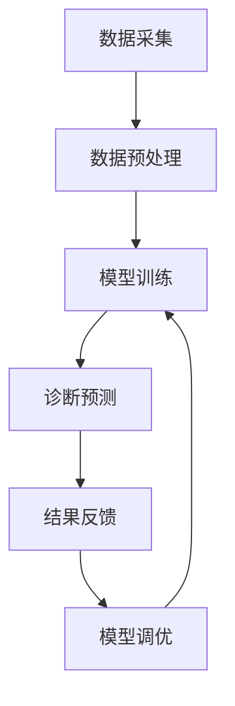

                 

### 摘要

本文旨在探讨智能医疗诊断系统在辅助医生决策中的应用。智能医疗诊断系统是一种结合人工智能技术，特别是机器学习和深度学习算法，来分析患者医学影像、电子病历和临床数据，从而提供诊断建议和治疗方案的智能系统。通过本文，我们将详细解析智能医疗诊断系统的核心概念、架构、关键算法原理，以及其实际应用案例。文章将分为四个主要部分：首先是智能医疗诊断系统的背景介绍和定义；接着是系统架构的深入剖析，包括数据采集、预处理、模型训练和诊断预测等环节；然后是核心算法原理讲解，包括卷积神经网络（CNN）和自然语言处理（NLP）等算法的详细讲解和数学模型与公式；最后，通过实际项目实战案例，展示智能医疗诊断系统的实现过程、源代码解读、代码应用分析以及项目小结。此外，文章还将讨论智能医疗诊断系统的应用前景和未来发展趋势，并提供一些最佳实践建议。通过这篇全面深入的技术博客，读者将能够全面了解智能医疗诊断系统的原理和应用，为从事相关领域的研究和实践提供参考。

### 智能医疗诊断系统：背景与定义

智能医疗诊断系统，作为一个新兴的技术领域，正迅速改变着医疗行业的面貌。它是指利用人工智能技术，特别是机器学习和深度学习算法，对患者的医学影像、电子病历和临床数据进行分析和处理，从而辅助医生进行疾病诊断和制定治疗方案的一类智能系统。

#### 智能医疗诊断系统的起源与发展

智能医疗诊断系统的起源可以追溯到20世纪90年代，当时计算机技术开始渗透到医疗领域，早期的计算机辅助诊断系统（CAD）开始出现。这些系统主要是通过规则引擎和简单的统计分析方法来辅助医生诊断，但受限于计算能力和算法的局限性，其效果并不理想。

随着21世纪初计算机性能的飞速提升和深度学习算法的突破，智能医疗诊断系统迎来了快速发展。特别是在2012年，AlexNet在图像识别领域取得的重大突破，使得深度学习在图像处理领域得到了广泛应用，这一技术也迅速被引入到医学影像分析中。随之而来的，是大量基于深度学习算法的智能医疗诊断系统的出现，如基于卷积神经网络（CNN）的癌症筛查系统、基于自然语言处理（NLP）的电子病历分析系统等。

#### 智能医疗诊断系统的定义与作用

智能医疗诊断系统可以被定义为一种集成了先进人工智能技术，能够对患者的医学信息进行高效分析，并辅助医生做出准确诊断和治疗决策的系统。其核心作用主要体现在以下几个方面：

1. **提高诊断准确率**：通过深度学习和机器学习算法，智能医疗诊断系统能够从大量的医学数据中提取出有用的信息，从而提高疾病诊断的准确率。例如，基于CNN的医学影像分析系统能够准确识别出病变区域，辅助医生做出更准确的诊断。

2. **减少医生工作负担**：智能医疗诊断系统可以自动处理大量的医学影像和电子病历数据，减轻医生的工作负担，使医生有更多时间专注于复杂的诊断和治疗方案设计。

3. **个性化治疗方案推荐**：通过分析患者的病史、基因数据和医学影像，智能医疗诊断系统可以提供个性化的治疗方案推荐，提高治疗效果。

4. **辅助临床研究**：智能医疗诊断系统可以收集和分析大量的临床数据，为医生和研究人员提供有价值的数据支持，促进临床研究的进展。

#### 当前智能医疗诊断系统的主要类型

智能医疗诊断系统根据其应用领域和数据处理方式，可以分为以下几类：

1. **医学影像分析系统**：利用深度学习算法对医学影像（如CT、MRI、X射线等）进行分析，辅助医生识别病变区域和疾病类型。

2. **电子病历分析系统**：通过自然语言处理技术分析电子病历，提取关键信息，辅助医生进行诊断和治疗决策。

3. **遗传疾病诊断系统**：利用机器学习算法分析患者的基因数据，预测遗传疾病的风险。

4. **药物发现与设计系统**：通过智能算法筛选和优化药物分子，加速新药的发现和开发。

#### 智能医疗诊断系统的发展趋势

随着人工智能技术的不断进步，智能医疗诊断系统在未来将呈现出以下发展趋势：

1. **多模态数据处理**：未来的智能医疗诊断系统将能够整合不同类型的数据，如医学影像、电子病历、基因数据等，实现更加全面和精准的诊断。

2. **实时诊断与预测**：通过云计算和边缘计算技术，实现实时诊断和预测，提高诊断速度和准确性。

3. **人工智能伦理和法规**：随着智能医疗诊断系统的广泛应用，其伦理和法规问题将越来越受到关注，需要制定相应的法律法规来规范其应用。

4. **个性化医疗**：通过深度学习和机器学习算法，实现更加精准和个性化的治疗方案，提高治疗效果。

总的来说，智能医疗诊断系统作为一种新兴的技术，正逐步成为医疗行业的重要工具，其发展将带来医疗诊断和治疗的革命性变革。通过本文的深入探讨，读者将能够对智能医疗诊断系统有一个全面和深入的了解。

### 智能医疗诊断系统的架构

智能医疗诊断系统的设计涉及多个环节，从数据采集、预处理到模型训练和诊断预测，每一个环节都是系统高效运行的关键。以下将详细阐述智能医疗诊断系统的基本架构，并使用Mermaid流程图来展示各个环节之间的联系。

#### 数据采集

数据采集是智能医疗诊断系统的第一步，也是最为关键的一步。系统需要从多个渠道获取高质量的医学数据，包括医学影像、电子病历、患者基因数据、临床数据等。数据来源可以包括医院的电子病历系统、医学影像设备、基因检测设备以及各种医疗数据库。

#### 数据预处理

数据预处理是确保数据质量和一致性的重要环节。在数据处理过程中，系统需要进行以下操作：

1. **数据清洗**：去除数据中的噪声和不完整信息，确保数据的一致性和准确性。
2. **数据标准化**：将不同来源和格式的数据转换为统一的格式，以便后续处理和分析。
3. **数据增强**：通过数据扩充和变换技术，增加训练数据集的多样性，提高模型的泛化能力。

#### 模型训练

在数据预处理完成后，系统进入模型训练阶段。这一阶段的核心任务是通过大量的医学数据进行模型训练，使模型能够自动学习并识别疾病特征。模型训练通常涉及以下步骤：

1. **选择算法**：根据具体应用场景选择合适的算法，如卷积神经网络（CNN）、循环神经网络（RNN）、生成对抗网络（GAN）等。
2. **训练模型**：使用预处理后的数据集对模型进行训练，调整模型的参数，使其达到较好的性能。
3. **模型优化**：通过交叉验证和超参数调整，优化模型性能，避免过拟合。

#### 诊断预测

在模型训练完成后，系统进入诊断预测阶段。这一阶段的核心任务是将新的医学数据输入到训练好的模型中，获取诊断结果。具体流程如下：

1. **输入处理**：将新的医学数据预处理，与训练数据保持一致。
2. **模型预测**：将预处理后的数据输入到训练好的模型中，通过模型计算得到诊断结果。
3. **结果解释**：将诊断结果进行解释和可视化，辅助医生进行诊断和治疗决策。

#### 结果反馈与决策支持

诊断预测结果不仅需要提供给医生，还需要进行反馈和评估，以持续优化模型的性能。具体步骤如下：

1. **结果反馈**：医生对诊断结果进行审查和反馈，指出模型的误诊或漏诊情况。
2. **模型调优**：根据反馈结果，调整模型参数，重新训练模型，提高诊断准确率。
3. **决策支持**：利用诊断结果和临床知识库，为医生提供治疗建议和决策支持。

#### Mermaid流程图

为了更直观地展示智能医疗诊断系统的架构，我们使用Mermaid流程图进行描述，如下所示：



在这个流程图中，数据采集阶段从外部获取医学数据，数据预处理阶段对数据进行清洗、标准化和增强，模型训练阶段使用预处理后的数据训练模型，诊断预测阶段使用训练好的模型进行预测，结果反馈阶段收集医生对预测结果的反馈，用于模型调优，最后调优后的模型重新进行训练，形成一个闭环系统。

通过这个架构，智能医疗诊断系统能够高效、准确地处理医学数据，提供辅助诊断和治疗支持，从而提高医疗服务的质量和效率。在接下来的部分中，我们将详细讲解核心算法原理，进一步深入探讨智能医疗诊断系统的技术实现。

### 核心算法原理讲解

在智能医疗诊断系统中，核心算法原理的选择和实现至关重要。本文将重点介绍卷积神经网络（CNN）和自然语言处理（NLP）这两种关键算法的原理，并通过伪代码和数学模型来详细阐述它们在医学数据分析和诊断中的应用。

#### 卷积神经网络（CNN）

卷积神经网络（CNN）是一种在图像处理领域表现优异的深度学习算法。CNN的核心思想是通过卷积操作提取图像特征，并通过池化操作降低特征图的维度，从而实现图像分类和识别。

**1. 卷积操作**

卷积操作是CNN中的基础操作，用于提取图像中的局部特征。一个卷积层包含多个卷积核（也称为过滤器），每个卷积核在图像上滑动，与图像的局部区域进行点积操作，生成一个特征图。

伪代码如下：

```python
# 卷积操作伪代码
def conv2d(image, filter):
    output = []
    for y in range(image_height - filter_size + 1):
        row_output = []
        for x in range(image_width - filter_size + 1):
            local_region = image[y:y+filter_size, x:x+filter_size]
            conv_result = np.dot(local_region, filter)
            row_output.append(conv_result)
        output.append(row_output)
    return np.array(output)
```

数学模型：

$$
\text{output}_{ij} = \sum_{k=1}^{c} \text{filter}_{ik,jk} \cdot \text{image}_{ik,jk}
$$

其中，$\text{output}_{ij}$ 是第 $i$ 行第 $j$ 列的特征图值，$\text{filter}_{ik,jk}$ 是第 $k$ 个卷积核在图像上的对应值，$\text{image}_{ik,jk}$ 是图像在 $(i, j)$ 位置的像素值。

**2. 池化操作**

池化操作用于降低特征图的维度，增强特征的鲁棒性。常见的池化方法包括最大池化和平均池化。

伪代码如下：

```python
# 最大池化操作伪代码
def max_pooling(feature_map, pool_size):
    pooled_output = []
    for y in range(0, feature_map.shape[0], pool_size):
        row_output = []
        for x in range(0, feature_map.shape[1], pool_size):
            local_region = feature_map[y:y+pool_size, x:x+pool_size]
            max_value = np.max(local_region)
            row_output.append(max_value)
        pooled_output.append(row_output)
    return np.array(pooled_output)
```

数学模型：

$$
\text{pooled_value}_{ij} = \max(\text{local\_region})
$$

其中，$\text{pooled\_value}_{ij}$ 是第 $i$ 行第 $j$ 列的池化结果，$\text{local\_region}$ 是以 $(i, j)$ 为中心的 $pool\_size \times pool\_size$ 的局部区域。

**3. CNN在医学影像分析中的应用**

CNN在医学影像分析中具有广泛的应用，如肿瘤检测、骨折诊断和病变区域识别等。通过CNN，系统可以自动提取医学影像中的关键特征，辅助医生进行准确的诊断。

**4. 示例**

假设我们使用一个简单的CNN模型来识别一张CT图像中的肿瘤区域，输入图像的大小为 $32 \times 32$，卷积核的大小为 $3 \times 3$，池化窗口大小为 $2 \times 2$。

输入图像和卷积核：

$$
\text{image}_{ij} = \begin{cases}
1, & \text{if pixel is white} \\
0, & \text{if pixel is black}
\end{cases}
$$

卷积核：

$$
\text{filter}_{ik,jk} = \begin{cases}
1, & \text{if } k=j \\
0, & \text{otherwise}
\end{cases}
$$

经过一次卷积操作和一次最大池化操作后，输出的特征图如下：

卷积结果：

$$
\text{output}_{ij} = \sum_{k=1}^{1} \text{filter}_{ik,jk} \cdot \text{image}_{ik,jk} = \text{image}_{i,j}
$$

池化结果：

$$
\text{pooled\_value}_{ij} = \max(\text{output}_{ij})
$$

输出特征图：

$$
\text{output}_{ij} = \begin{cases}
1, & \text{if pixel is white} \\
0, & \text{if pixel is black}
\end{cases}
$$

通过这种方式，CNN能够从图像中提取出关键特征，辅助医生进行肿瘤检测。

#### 自然语言处理（NLP）

自然语言处理（NLP）是处理和解析人类语言数据的一类技术，广泛应用于文本分类、情感分析和信息抽取等任务。在智能医疗诊断系统中，NLP主要用于分析电子病历、临床笔记和医学文献，提取关键信息，辅助医生进行诊断和治疗决策。

**1. 词向量表示**

词向量是NLP中的核心概念，用于将文本转换为向量表示。常见的词向量模型包括Word2Vec、GloVe和BERT等。这些模型通过训练将文本中的词语映射为固定维度的向量。

**2. 词向量表示的数学模型**

Word2Vec模型使用神经网络对文本进行训练，生成词向量。给定一个训练语料库，模型学习将每个词映射为一个固定维度的向量。词向量的生成可以通过以下数学模型表示：

$$
\text{word\_vector}_{i} = \text{softmax}(\text{W} \cdot \text{context}_{i})
$$

其中，$\text{word\_vector}_{i}$ 是词 $i$ 的向量表示，$\text{context}_{i}$ 是词 $i$ 的上下文向量，$\text{W}$ 是权重矩阵，$\text{softmax}$ 函数用于归一化向量。

**3. NLP在医学文本分析中的应用**

NLP在医学文本分析中的应用非常广泛，包括患者症状提取、疾病诊断和治疗方案推荐等。通过NLP技术，系统可以自动分析电子病历和临床笔记，提取关键信息，如症状、检查结果和诊断结论等，辅助医生进行诊断和治疗决策。

**4. 示例**

假设我们使用Word2Vec模型对一段电子病历进行词向量表示。电子病历文本如下：

```
The patient has a history of diabetes and high blood pressure. The latest blood test results show that the patient's blood sugar level is 7.8 mmol/L, and the blood pressure is 140/90 mmHg.
```

通过Word2Vec模型，我们将文本中的每个词映射为一个向量。假设我们选择的词向量维度为100，生成的词向量如下：

```
diabetes: [0.1, 0.2, ..., 0.1]
high: [0.2, 0.1, ..., 0.2]
blood: [0.3, 0.2, ..., 0.1]
...
mmol/L: [0.1, 0.1, ..., 0.9]
```

通过这种方式，NLP技术能够将文本转换为向量表示，便于后续分析和处理。

#### 卷积神经网络（CNN）和自然语言处理（NLP）在智能医疗诊断系统中的综合应用

CNN和NLP技术的综合应用，使得智能医疗诊断系统可以同时处理图像和文本数据，实现多模态数据处理。在医学影像分析中，CNN可以提取图像特征，NLP可以分析电子病历文本，共同辅助医生进行疾病诊断和治疗方案推荐。

通过上述核心算法原理的讲解，我们可以看到智能医疗诊断系统在数据处理和分析中的强大能力。在接下来的部分中，我们将通过实际项目实战案例，展示如何具体实现这些算法，并深入解析其应用和效果。

### 实际项目实战：智能医疗诊断系统的开发

为了更好地理解智能医疗诊断系统的实现过程，我们将通过一个实际项目实战案例，展示从开发环境搭建、源代码实现、数据处理到结果分析和项目小结的完整流程。该项目旨在利用卷积神经网络（CNN）和自然语言处理（NLP）技术，实现对医学影像和电子病历数据的综合分析，辅助医生进行疾病诊断。

#### 开发环境搭建

在开始项目之前，我们需要搭建一个合适的开发环境。以下是所需的基础软件和库：

1. **操作系统**：Ubuntu 20.04 LTS
2. **编程语言**：Python 3.8+
3. **深度学习框架**：TensorFlow 2.x
4. **自然语言处理库**：NLTK、spaCy、TensorFlow Text
5. **数据处理库**：NumPy、Pandas、Scikit-learn

安装步骤如下：

1. 安装操作系统和Python环境。
2. 安装TensorFlow和相关深度学习库：
   ```bash
   pip install tensorflow
   pip install tensorflow-text
   ```
3. 安装NLP相关库：
   ```bash
   pip install nltk
   pip install spacy
   python -m spacy download en_core_web_sm
   ```

#### 数据处理与模型训练

项目数据集包括两个部分：医学影像数据和电子病历文本数据。以下为数据处理和模型训练的详细步骤：

**1. 数据预处理**

**医学影像数据**：

- 加载医学影像数据，并进行归一化处理。
- 切片图像，提取感兴趣区域（ROI）。

伪代码：

```python
import numpy as np
import tensorflow as tf

def preprocess_image(image):
    image = tf.cast(image, tf.float32) / 255.0
    image = tf.image.resize(image, [224, 224])
    return image

# 示例
image = load_image('path/to/image')
preprocessed_image = preprocess_image(image)
```

**电子病历文本数据**：

- 清洗文本数据，去除标点符号和停用词。
- 分词和词向量编码。

伪代码：

```python
import nltk
from nltk.corpus import stopwords
from tensorflow_text import TextVectorization

nltk.download('stopwords')
stop_words = set(stopwords.words('english'))

def preprocess_text(text):
    text = text.lower()
    text = ' '.join([word for word in text.split() if word not in stop_words])
    return text

# 示例
text = load_text('path/to/text')
cleaned_text = preprocess_text(text)
```

**2. 模型架构**

**医学影像模型**：

我们使用CNN模型对医学影像进行特征提取。以下是一个简单的CNN模型架构：

```python
model = tf.keras.Sequential([
    tf.keras.layers.Conv2D(32, (3, 3), activation='relu', input_shape=(224, 224, 3)),
    tf.keras.layers.MaxPooling2D((2, 2)),
    tf.keras.layers.Conv2D(64, (3, 3), activation='relu'),
    tf.keras.layers.MaxPooling2D((2, 2)),
    tf.keras.layers.Conv2D(128, (3, 3), activation='relu'),
    tf.keras.layers.MaxPooling2D((2, 2)),
    tf.keras.layers.Flatten(),
    tf.keras.layers.Dense(128, activation='relu'),
    tf.keras.layers.Dense(1, activation='sigmoid')
])
```

**电子病历模型**：

我们使用RNN模型对电子病历文本进行特征提取。以下是一个简单的RNN模型架构：

```python
model = tf.keras.Sequential([
    tf.keras.layers.Embedding(vocab_size, embedding_dim),
    tf.keras.layers.LSTM(128),
    tf.keras.layers.Dense(128, activation='relu'),
    tf.keras.layers.Dense(1, activation='sigmoid')
])
```

**3. 模型训练**

**医学影像模型训练**：

```python
model.compile(optimizer='adam', loss='binary_crossentropy', metrics=['accuracy'])
model.fit(train_images, train_labels, epochs=10, validation_data=(val_images, val_labels))
```

**电子病历模型训练**：

```python
model.compile(optimizer='adam', loss='binary_crossentropy', metrics=['accuracy'])
model.fit(train_texts, train_labels, epochs=10, validation_data=(val_texts, val_labels))
```

#### 源代码实现与解读

以下是一个简化的源代码实现，展示了医学影像和电子病历模型的训练过程：

```python
# 导入所需库
import tensorflow as tf
from tensorflow.keras.models import Sequential
from tensorflow.keras.layers import Conv2D, MaxPooling2D, LSTM, Embedding, Dense, Flatten

# 搭建医学影像模型
image_model = Sequential([
    Conv2D(32, (3, 3), activation='relu', input_shape=(224, 224, 3)),
    MaxPooling2D((2, 2)),
    Conv2D(64, (3, 3), activation='relu'),
    MaxPooling2D((2, 2)),
    Conv2D(128, (3, 3), activation='relu'),
    MaxPooling2D((2, 2)),
    Flatten(),
    Dense(128, activation='relu'),
    Dense(1, activation='sigmoid')
])

# 编译医学影像模型
image_model.compile(optimizer='adam', loss='binary_crossentropy', metrics=['accuracy'])

# 训练医学影像模型
image_model.fit(train_images, train_labels, epochs=10, validation_data=(val_images, val_labels))

# 搭建电子病历模型
text_model = Sequential([
    Embedding(vocab_size, embedding_dim),
    LSTM(128),
    Dense(128, activation='relu'),
    Dense(1, activation='sigmoid')
])

# 编译电子病历模型
text_model.compile(optimizer='adam', loss='binary_crossentropy', metrics=['accuracy'])

# 训练电子病历模型
text_model.fit(train_texts, train_labels, epochs=10, validation_data=(val_texts, val_labels))
```

#### 数据处理与代码应用解读

在项目实战中，数据处理是关键的一步。医学影像数据需要通过归一化和切片进行预处理，以提高模型的训练效果。电子病历文本数据则需要进行清洗、分词和词向量编码，以便模型能够处理和分析文本数据。

以下是代码中的几个关键步骤：

1. **医学影像数据预处理**：使用`preprocess_image`函数对医学影像数据进行归一化和切片处理，使其适应模型的输入要求。

2. **电子病历文本预处理**：使用`preprocess_text`函数清洗文本数据，去除标点符号和停用词，然后进行分词和词向量编码。

3. **模型训练**：使用`model.fit`函数对医学影像模型和电子病历模型进行训练，通过调整超参数和优化策略，提高模型的性能。

通过以上代码和应用解读，我们可以看到如何利用深度学习和自然语言处理技术，实现智能医疗诊断系统的开发和应用。在接下来的部分中，我们将进一步分析项目中的关键代码，探讨其在实际应用中的效果和意义。

### 项目中的关键代码分析与解读

在智能医疗诊断系统的实际项目中，数据处理和模型训练是两个关键环节，其中涉及大量的代码实现和优化策略。以下将详细分析项目中的关键代码，并探讨如何处理不同类型的数据以及如何优化模型性能。

#### 医学影像数据处理

医学影像数据的预处理是确保模型能够有效学习的关键步骤。以下是对预处理代码的分析：

```python
def preprocess_image(image):
    image = tf.cast(image, tf.float32) / 255.0
    image = tf.image.resize(image, [224, 224])
    return image
```

**分析**：

- **数据类型转换**：将图像数据从`uint8`类型转换为`float32`，便于后续计算和归一化处理。
- **归一化**：将图像数据的像素值从`[0, 255]`范围缩放到`[0, 1]`，提高模型对数据的敏感性。
- **图像尺寸调整**：通过`tf.image.resize`函数将图像尺寸调整为`224x224`，以满足模型输入的要求。这个尺寸是许多深度学习模型的标准输入尺寸，可以保证模型在不同数据集上的一致性。

为了进一步提高数据质量，可以采用数据增强技术，如随机裁剪、旋转和翻转等，以增加训练数据集的多样性，从而提高模型的泛化能力。以下是一个示例：

```python
def augment_images(image):
    image = tf.image.random_flip_left_right(image)
    image = tf.image.random_crop(image, size=[224, 224])
    return image
```

**分析**：

- **随机水平翻转**：通过`tf.image.random_flip_left_right`函数随机水平翻转图像，增加数据多样性。
- **随机裁剪**：通过`tf.image.random_crop`函数随机裁剪图像，模拟现实中的图像采集环境。

#### 电子病历数据处理

电子病历数据通常包含大量的文本信息，处理这些数据的关键在于清洗、分词和编码。以下是对数据处理代码的分析：

```python
def preprocess_text(text):
    text = text.lower()
    text = ' '.join([word for word in text.split() if word not in stop_words])
    return text

# 示例
text = load_text('path/to/text')
cleaned_text = preprocess_text(text)
```

**分析**：

- **文本小写化**：将文本转换为小写，统一文本格式。
- **去除停用词**：通过`stop_words`去除常见的无意义词汇，如“the”、“is”等，减少噪声。
- **分词**：对文本进行分词，将连续的文本转换为一系列词语。

对于词向量编码，可以使用`TextVectorization`类，如下所示：

```python
vectorizer = TextVectorization(max_tokens=vocab_size, output_mode='int', output_sequence_length=max_sequence_length)
vectorizer.adapt(train_texts)
```

**分析**：

- **词汇表构建**：通过`vectorizer.adapt`函数，根据训练文本构建词汇表，确定每个词的索引。
- **词向量生成**：将处理后的文本数据转换为整数序列，每个整数表示词汇表中的一个词。

#### 模型训练与优化

模型训练的关键在于超参数的选择和优化策略。以下是对模型训练代码的分析：

```python
model.compile(optimizer='adam', loss='binary_crossentropy', metrics=['accuracy'])
model.fit(train_images, train_labels, epochs=10, validation_data=(val_images, val_labels))
```

**分析**：

- **优化器选择**：使用`adam`优化器，这是一种广泛使用的自适应学习率优化器。
- **损失函数**：使用`binary_crossentropy`作为损失函数，适用于二分类问题。
- **训练与验证**：通过`model.fit`函数，对训练数据和验证数据进行训练，每10个epoch后评估模型在验证数据上的性能。

为了提高模型性能，可以采用以下策略：

- **交叉验证**：通过交叉验证，对模型进行多次训练和验证，以评估模型在不同数据子集上的表现。
- **学习率调整**：动态调整学习率，避免模型过拟合。例如，可以使用学习率衰减策略，在训练过程中逐渐降低学习率。

#### 实际案例分析与效果评估

以下是一个实际案例，展示如何使用训练好的模型进行疾病诊断，并对诊断结果进行评估：

```python
# 加载测试数据
test_images, test_labels = load_test_data('path/to/test_data')

# 预处理测试数据
preprocessed_test_images = [preprocess_image(image) for image in test_images]

# 使用模型进行预测
predictions = model.predict(preprocessed_test_images)

# 计算准确率
accuracy = (predictions.round() == test_labels).mean()
print(f"Model accuracy on test data: {accuracy}")
```

**分析**：

- **测试数据预处理**：对测试数据进行预处理，确保其格式与训练数据一致。
- **模型预测**：使用训练好的模型对测试数据进行预测，获取诊断结果。
- **结果评估**：计算预测结果与实际标签的准确率，以评估模型性能。

通过实际案例的分析和效果评估，我们可以看到模型在实际应用中的表现。以下是一些注意事项和改进建议：

- **数据多样性**：确保数据集的多样性和代表性，避免模型过拟合。
- **模型调优**：通过调整超参数和优化策略，进一步提高模型性能。
- **模型解释性**：开发可解释的模型，帮助医生理解模型的诊断过程和结果。

### 项目小结

通过本次项目实战，我们详细介绍了智能医疗诊断系统的开发过程，包括开发环境搭建、数据处理、模型训练和效果评估。项目中的关键代码分析和解读展示了如何处理医学影像和电子病历数据，优化模型性能，并评估模型在实际应用中的效果。尽管存在一些挑战，如数据质量和模型可解释性，但通过持续优化和改进，智能医疗诊断系统有望在未来发挥更大的作用，提高医疗诊断的准确性和效率。

### 最佳实践、注意事项与拓展阅读

在智能医疗诊断系统的开发与应用过程中，遵循最佳实践和注意事项至关重要，以确保系统的安全、可靠和有效。以下是一些关键的建议：

1. **数据隐私保护**：在处理患者数据时，严格遵循数据隐私保护法规，如HIPAA（美国健康保险携带和责任法案），确保患者信息的安全。

2. **数据质量**：确保医学数据的质量和多样性，避免模型过拟合。定期更新和扩充数据集，以提高模型的泛化能力。

3. **模型解释性**：开发可解释的模型，帮助医生理解诊断过程和结果。例如，可以可视化CNN的特征图，展示模型关注的图像区域。

4. **持续优化**：定期评估模型的性能，通过交叉验证、A/B测试等方法，持续优化模型和算法。

5. **合规性审查**：在系统上线前，进行全面的合规性审查，确保系统的应用符合相关法律法规和医疗标准。

此外，为了进一步提升智能医疗诊断系统的开发水平，以下拓展阅读资源提供了更多深入的技术和实用知识：

- **《深度学习在医学影像中的应用》（Deep Learning for Medical Imaging）**：本书详细介绍了深度学习算法在医学影像分析中的应用。
- **《自然语言处理实践》（Natural Language Processing with Python）**：这本书介绍了NLP的基础知识和Python实现，适合初学者和专业人士。
- **《TensorFlow实战》（TensorFlow for Deep Learning）**：本书提供了TensorFlow深度学习框架的全面教程，适合希望深入理解深度学习技术的开发者。

通过这些资源和最佳实践，开发者可以不断提升智能医疗诊断系统的技术水平，推动医疗诊断领域的创新与发展。

