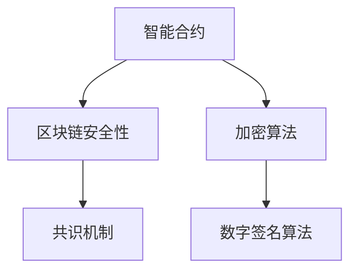

                 

## 文章标题

智能合约安全：区块链应用的安全开发实践

## 关键词

智能合约，区块链，安全开发，加密算法，智能合约攻击，安全编码准则

## 摘要

本文旨在深入探讨智能合约的安全性，从背景介绍到核心概念，再到具体的安全开发实践，全面解析区块链应用中智能合约的安全问题。通过详细的算法原理讲解、数学模型展示和项目实战案例分析，本文帮助开发者理解智能合约的安全机制，掌握安全编码的最佳实践，从而确保区块链应用的安全性。

## 目录

### 背景介绍

- 区块链技术概述
- 智能合约的起源与发展
- 智能合约在区块链应用中的重要性

### 核心概念与联系

- 智能合约的定义与工作原理
- 区块链的安全性
- 智能合约安全开发实践

#### 核心概念原理之间的关系架构 Mermaid 流程图



### 核心算法原理讲解

- 椭圆曲线加密算法（ECC）
- 数字签名算法（RSA）
- 哈希函数原理讲解

#### 椭圆曲线加密算法（ECC）伪代码

```plaintext
// ECC 加密算法伪代码
function ECEncrypt(message, publicKey):
    // 选择椭圆曲线和基点
    curve = selectEllipticCurve()
    basePoint = curve.getBasePoint()

    // 计算加密消息
    encryptedMessage = curve.multiply(basePoint, publicKey)

    return encryptedMessage
```

#### 数字签名算法（RSA）伪代码

```plaintext
// RSA 签名算法伪代码
function RSASign(message, privateKey):
    // 选择模数和私钥指数
    modulus = privateKey.modulus
    exponent = privateKey.exponent

    // 计算签名
    signature = modularExponentiation(message, exponent, modulus)

    return signature
```

### 数学模型和公式讲解

- 哈希函数的数学模型
- 零知识证明的数学模型

#### 哈希函数的数学模型

$$
H(\text{m}) = \text{hash}(\text{m})
$$

其中，\( H \) 表示哈希函数，\( \text{m} \) 表示消息，\( \text{hash} \) 表示将消息映射到一个固定长度的字符串。

#### 零知识证明的数学模型

$$
\begin{aligned}
P &= \{ (s, c, e) | s \in S, c \in C, e \in E \} \\
S &= \{ s | s = g^x \mod n \} \\
C &= \{ c | c = g^r \mod n \} \\
E &= \{ e | e = h(s, c) \mod n \} \\
\end{aligned}
$$`

其中，\( P \) 表示证明集合，\( S \) 表示主语言集合，\( C \) 表示承诺集合，\( E \) 表示证据集合，\( g \) 是生成元，\( h \) 是验证函数，\( n \) 是模数。

### 项目实战

- 开发环境搭建
- 智能合约源代码详细实现
- 代码解读与分析
- 实际案例分析与详细讲解

#### 安全交易智能合约

```solidity
pragma solidity ^0.8.0;

contract SafeTransaction {
    address public owner;
    mapping(address => uint256) public balances;

    constructor() {
        owner = msg.sender;
    }

    function deposit() public payable {
        require(msg.value > 0, "Invalid deposit amount");
        balances[msg.sender] += msg.value;
    }

    function withdraw(uint256 amount) public {
        require(amount <= balances[msg.sender], "Insufficient balance");
        balances[msg.sender] -= amount;
        payable(msg.sender).transfer(amount);
    }

    function getBalance() public view returns (uint256) {
        return balances[msg.sender];
    }
}
```

#### 代码应用解读与分析

- `deposit()` 函数用于存款，`withdraw()` 函数用于取款。
- `getBalance()` 函数用于获取账户余额。
- 使用 `require()` 函数确保交易的合法性。

#### 实际案例分析与详细讲解

- 案例一：一个用户通过智能合约存款 100 个币。
- 案例二：同一个用户尝试从账户中提取超过其账户余额的金额。

### 最佳实践 tips

- 使用最新的编程语言和框架，确保智能合约的安全性。
- 定期进行代码审计和安全测试，及时发现并修复漏洞。
- 实施严格的访问控制和权限管理，防止未经授权的访问。

### 小结

智能合约的安全性是区块链应用能否成功的关键。本文从核心概念、算法原理到项目实战，全面阐述了智能合约的安全开发实践。通过遵循最佳实践，开发者可以构建出更加安全可靠的智能合约，为区块链应用的未来发展奠定坚实基础。

### 注意事项

- 在开发智能合约时，务必仔细审查代码，避免常见的安全漏洞。
- 了解并掌握各种加密算法和数学模型，确保智能合约的安全性和可靠性。

### 拓展阅读

- 《智能合约安全最佳实践指南》
- 《区块链技术与应用》
- 《加密算法原理与应用》

### 作者信息

作者：AI天才研究院/AI Genius Institute & 禅与计算机程序设计艺术 /Zen And The Art of Computer Programming

