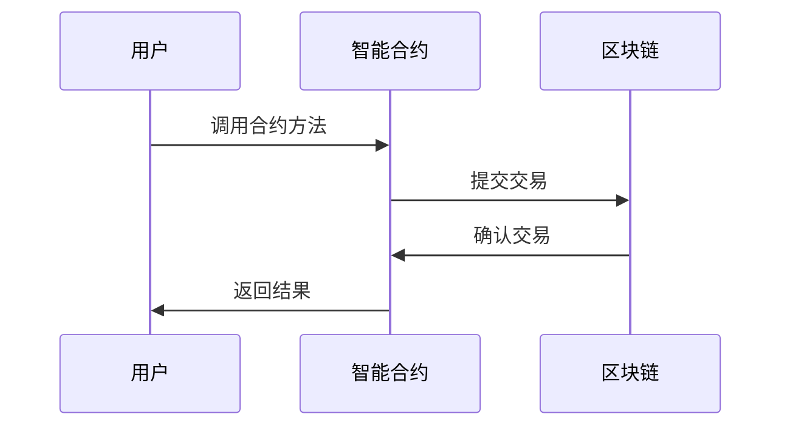

                 

### 文章标题：智能合约开发与安全审计

#### 关键词
- 智能合约
- 安全审计
- 开发环境
- 编程基础
- 高级特性
- 漏洞分析
- 实战项目

#### 摘要
本文旨在深入探讨智能合约的开发与安全审计。首先，我们将介绍智能合约的基础知识，包括其定义、工作原理和类型。接着，我们将逐步讲解智能合约的开发环境配置、编程基础和高级特性。随后，我们将重点介绍安全审计的基本概念、常见漏洞类型和审计方法。文章最后将通过实战项目，展示智能合约的开发与审计过程，并提供最佳实践和拓展阅读资源。通过本文，读者将全面了解智能合约的开发与安全审计，为实际应用奠定坚实基础。

----------------------------------------------------------------

### 引言

智能合约是区块链技术中的重要组成部分，自其首次提出以来，便以其自主执行、不可篡改和透明性等特点，引发了广泛关注。智能合约的基本思想是利用区块链的分布式账本技术，实现一种无需中介的自动化交易执行机制。这一机制使得智能合约在金融、供应链管理、版权保护等多个领域具有广泛的应用前景。

随着智能合约技术的不断发展，开发与安全审计变得尤为重要。开发方面，智能合约需要遵循一定的编程规范，确保其可读性、可维护性和性能。同时，智能合约的高级特性，如事件、映射和接口等，也需要深入理解。安全审计方面，智能合约面临多种潜在的安全威胁，如漏洞、恶意攻击等。因此，对智能合约进行严格的安全审计，发现并修复潜在的安全问题，是保障智能合约系统稳定运行的关键。

本文将系统地探讨智能合约的开发与安全审计。首先，我们将介绍智能合约的基础知识，包括其定义、工作原理和类型。接着，我们将深入讲解智能合约的开发环境配置，包括硬件要求、操作系统选择、编程语言与工具，以及版本控制等。随后，我们将逐步讲解智能合约的编程基础，包括编程语言基础、编写规范和高级特性。在安全审计部分，我们将介绍安全审计的基本概念、常见漏洞类型和审计方法。最后，通过一个实际的项目实战，我们将展示智能合约的开发与审计过程，并提供最佳实践和拓展阅读资源。

本文结构如下：

1. **智能合约基础**：介绍智能合约的定义、工作原理和类型。
2. **智能合约开发环境**：讲解开发环境配置，包括硬件、操作系统、编程语言和版本控制等。
3. **智能合约编程基础**：介绍编程语言基础、编写规范和高级特性。
4. **安全审计基础**：介绍安全审计的基本概念、常见漏洞类型和审计方法。
5. **智能合约漏洞分析**：分析智能合约中常见的漏洞类型，并提供修复建议。
6. **智能合约审计实战**：通过实际项目展示智能合约的开发与审计过程。
7. **总结与拓展**：总结全文，提供最佳实践和拓展阅读资源。

通过本文的阅读，读者将能够全面了解智能合约的开发与安全审计，为实际应用提供有力支持。

----------------------------------------------------------------

## 第1章：智能合约基础

### 1.1 智能合约概述

#### 1.1.1 定义与背景

智能合约，顾名思义，是一种嵌入在区块链中的自动执行合同。与传统的合同不同，智能合约通过计算机程序实现，一旦触发预定的条件，合约将自动执行。这一概念最早由法律学者和计算机科学家尼克·萨博（Nick Szabo）在1990年代提出。萨博将智能合约定义为一种“集成计算协议，能够在满足特定条件时自动执行、控制和文档化履行条款”。

智能合约的核心思想是利用区块链的分布式账本技术，实现一种无需中介的自动化交易执行机制。这种机制不仅提高了交易的透明性和可信度，还降低了交易的成本和风险。

#### 1.1.2 工作原理与优势

智能合约的工作原理可以简单概括为以下几步：

1. **编写智能合约**：开发者使用特定的编程语言（如Solidity）编写智能合约代码，定义合同的条款和条件。
2. **部署智能合约**：将智能合约代码上传到区块链网络，由网络中的节点进行验证和存储。
3. **触发执行**：当满足预定的条件时，智能合约自动执行，如资金的转移、数据的记录等。
4. **不可篡改的记录**：智能合约的执行过程和结果将被永久记录在区块链上，不可篡改。

智能合约的优势主要体现在以下几个方面：

- **去中心化**：智能合约无需依赖第三方中介，通过区块链网络实现去中心化的交易和执行。
- **透明性和可信度**：智能合约的执行过程公开透明，所有参与者都可以查看和验证。
- **安全性**：区块链技术的加密算法和分布式存储确保了智能合约的安全性和不可篡改性。
- **效率**：自动化执行减少了人工干预，提高了交易和合同执行的效率。

#### 1.1.3 智能合约的架构

智能合约的架构通常包括以下几部分：

- **区块链网络**：提供分布式账本和共识机制，确保数据的完整性和一致性。
- **智能合约代码**：实现具体的合同条款和逻辑，使用特定的编程语言编写。
- **前端接口**：提供用户与智能合约交互的界面，如网页、移动应用等。
- **后端服务**：处理与区块链网络通信、数据存储等任务，支持智能合约的执行和监控。

#### 1.1.4 智能合约与区块链的关系

智能合约与区块链技术紧密相连，两者共同构成了去中心化应用（DApp）的基础架构。区块链网络提供了智能合约运行的底层基础设施，包括分布式账本、共识机制和网络节点等。而智能合约则是构建在区块链上，实现特定业务逻辑和合同条款的应用程序。

智能合约与区块链的关系可以总结为以下几点：

- **依赖关系**：智能合约依赖于区块链网络提供的分布式账本和共识机制，确保数据的安全性和一致性。
- **互操作性**：智能合约通过区块链网络与其他合约和DApp进行互操作，实现跨链通信和数据共享。
- **扩展性**：智能合约可以灵活地扩展区块链的功能，实现更复杂和多样化的业务逻辑。

#### 1.1.5 智能合约的发展趋势

随着区块链技术的不断成熟和应用场景的扩展，智能合约也在不断发展。以下是一些智能合约的发展趋势：

- **标准化**：智能合约的标准和规范逐渐完善，如ERC标准、W3C智能合约标准等，提高了合约的可移植性和互操作性。
- **平台化**：智能合约开发平台和工具不断涌现，降低了智能合约的开发门槛，促进了智能合约的普及和应用。
- **多样化**：智能合约的应用领域不断扩展，从金融、供应链管理到版权保护、投票系统等，为各种业务场景提供了自动化和可信的解决方案。

#### 1.1.6 智能合约的挑战与未来

尽管智能合约具有许多优势，但也面临一些挑战：

- **技术挑战**：智能合约的开发和部署需要一定的技术门槛，包括编程语言、开发环境、安全防护等。
- **法律挑战**：智能合约的法律地位和适用法律尚不明确，需要进一步的法律规范和制度保障。
- **安全性挑战**：智能合约存在潜在的安全漏洞，如代码漏洞、智能合约设计缺陷等，需要严格的安全审计和漏洞修复。

未来，随着技术的进步和应用的深入，智能合约将继续发展，为去中心化应用和数字经济提供更多可能性。

---

在接下来的章节中，我们将继续探讨智能合约的类型，深入分析其核心概念与联系，并通过Mermaid流程图和伪代码展示智能合约的生命周期和核心流程。敬请期待。

----------------------------------------------------------------

### 1.2 智能合约的类型

智能合约可以按不同的维度进行分类，常见的分类方式包括状态机合约、事件合约、状态通道合约等。每种类型的智能合约都有其独特的特点和应用场景。

#### 1.2.1 状态机合约

状态机合约（State Machine Contract）是最常见的智能合约类型。它们通过定义一系列状态和转移规则，来描述合约的行为。状态机合约可以简单地看作是一个有限状态机（FSM），每个状态对应一个特定的行为，状态之间的转移由触发条件决定。

**工作原理**：
- **状态**：智能合约在执行过程中会处于不同的状态，如未执行、执行中、已执行等。
- **触发条件**：当满足特定的触发条件时，智能合约会从当前状态转移到下一个状态。
- **事件**：智能合约中的事件用于记录状态的变更和合约的执行结果。

**示例**：
```solidity
pragma solidity ^0.8.0;

contract StateMachine {
    enum State { Pending, Active, Completed }
    State public state;

    constructor() {
        state = State.Pending;
    }

    function activate() external {
        require(state == State.Pending, "Already activated");
        state = State.Active;
    }

    function complete() external {
        require(state == State.Active, "Already completed");
        state = State.Completed;
    }
}
```

**优缺点**：
- **优点**：状态机合约逻辑简单，易于理解和维护，适合处理状态变化较为简单的业务场景。
- **缺点**：对于复杂的状态转移逻辑，状态机合约可能难以表达，导致代码复杂度和维护成本增加。

#### 1.2.2 事件合约

事件合约（Event Contract）主要用于记录智能合约的执行事件，使得合约的执行过程可以被外部系统或用户查询和验证。事件合约通常包含一个或多个事件，每个事件记录了特定的信息，如合约的创建时间、执行结果等。

**工作原理**：
- **事件定义**：智能合约中使用`event`关键字定义事件，事件包含一个或多个参数。
- **事件触发**：在合约执行过程中，当满足特定条件时，将触发事件并记录相关参数。

**示例**：
```solidity
pragma solidity ^0.8.0;

contract EventContract {
    event ContractCreated(address creator, uint256 timestamp);
    event TransactionCompleted(address sender, uint256 amount);

    constructor() {
        emit ContractCreated(msg.sender, block.timestamp);
    }

    function executeTransaction() external payable {
        emit TransactionCompleted(msg.sender, msg.value);
    }
}
```

**优缺点**：
- **优点**：事件合约提供了合约执行的透明性和可追溯性，方便外部系统和用户查询。
- **缺点**：事件合约本身不包含业务逻辑，仅用于记录事件，不适合处理复杂的业务场景。

#### 1.2.3 状态通道合约

状态通道合约（State Channel Contract）是一种用于提高交易效率的智能合约类型。状态通道允许交易双方在链下进行多笔交易，然后批量提交到链上，从而降低交易费用和延迟。

**工作原理**：
- **链下交易**：交易双方通过链下协议进行多笔交易，记录交易状态。
- **链上结算**：当达到预定的交易次数或满足特定条件时，双方将交易状态提交到链上，完成结算。

**示例**：
```solidity
pragma solidity ^0.8.0;

contract StateChannel {
    mapping(address => uint256) public balances;

    function deposit() external payable {
        balances[msg.sender] += msg.value;
    }

    function withdraw(uint256 amount) external {
        require(balances[msg.sender] >= amount, "Insufficient balance");
        balances[msg.sender] -= amount;
        payable(msg.sender).transfer(amount);
    }

    function settle() external {
        // 批量处理所有交易
        for (address depositor ; depositor != address(0) ; depositor = nextDepositor) {
            if (balances[depositor] > 0) {
                payable(depositor).transfer(balances[depositor]);
            }
        }
    }
}
```

**优缺点**：
- **优点**：状态通道合约提高了交易的效率和降低费用，适用于高频交易场景。
- **缺点**：状态通道合约增加了链上链下的复杂度，需要额外的维护和监控。

#### 1.2.4 合约标准的分类

除了按功能分类，智能合约还可以按照实现标准进行分类。常见的合约标准包括ERC标准、EIP标准等。

- **ERC标准**：以太坊智能合约标准（Ethereum Request for Comments），由以太坊社区定义和维护。ERC标准包括多个子标准，如ERC-20、ERC-721等，用于定义不同类型的代币和收藏品。
- **EIP标准**：以太坊改进提案（Ethereum Improvement Proposal），用于提议和定义以太坊网络的改进方案。EIP标准包括各种改进措施，如EIP-1559、EIP-170等。

**示例**：
```solidity
// ERC-20代币示例
pragma solidity ^0.8.0;

interface IERC20 {
    function totalSupply() external view returns (uint256);
    function balanceOf(address account) external view returns (uint256);
    function transfer(address recipient, uint256 amount) external returns (bool);
    // ... 其他方法
}

contract MyToken is IERC20 {
    string public name = "MyToken";
    string public symbol = "MTK";
    uint8 public decimals = 18;
    mapping(address => uint256) private _balances;
    uint256 private _totalSupply;

    constructor(uint256 initialSupply) {
        _totalSupply = initialSupply;
        _balances[msg.sender] = _totalSupply;
    }

    function totalSupply() public view override returns (uint256) {
        return _totalSupply;
    }

    function balanceOf(address account) public view override returns (uint256) {
        return _balances[account];
    }

    function transfer(address recipient, uint256 amount) public override returns (bool) {
        require(recipient != address(0), "Invalid recipient");
        require(_balances[msg.sender] >= amount, "Insufficient balance");
        _balances[msg.sender] -= amount;
        _balances[recipient] += amount;
        emit Transfer(msg.sender, recipient, amount);
        return true;
    }
    // ... 其他方法
}
```

**优缺点**：
- **优点**：合约标准提供了统一的接口和实现规范，提高了智能合约的可移植性和互操作性。
- **缺点**：合约标准的实现可能存在一定的复杂度，需要开发者熟悉特定的标准规范。

通过以上对智能合约类型的详细讨论，我们可以看出，每种类型的智能合约都有其独特的特点和应用场景。了解和掌握这些不同类型的智能合约，有助于开发者根据具体需求选择合适的合约类型，实现高效和安全的智能合约系统。

在下一节中，我们将进一步探讨智能合约的核心概念与联系，通过Mermaid流程图和伪代码展示智能合约的生命周期和核心流程。敬请期待。

----------------------------------------------------------------

### 1.3 智能合约的核心概念与联系

智能合约是一种利用区块链技术实现的自动化合同执行机制，其核心概念紧密相连，共同构成了智能合约的运行基础。为了更好地理解智能合约的工作原理，我们将通过Mermaid流程图和伪代码来展示智能合约的生命周期和核心流程。

#### 1.3.1 Mermaid流程图：智能合约生命周期

首先，我们使用Mermaid语言绘制一个智能合约生命周期的流程图，展示智能合约从创建到执行的全过程。



在这个流程图中，用户通过调用智能合约方法（如转账、存储数据等）来触发智能合约的执行。智能合约将交易提交到区块链网络，区块链验证交易的有效性并记录到区块链上。最后，智能合约将执行结果返回给用户。

#### 1.3.2 伪代码：智能合约核心流程

接下来，我们使用伪代码来详细阐述智能合约的核心流程，包括交易提交、区块链验证、结果返回等步骤。

```plaintext
智能合约核心流程：
1. 用户调用合约方法（例如：转账）
2. 合约接收交易信息（例如：接收地址、转账金额等）
3. 合约验证交易信息（例如：检查余额、权限等）
4. 合约执行业务逻辑（例如：转移资金）
5. 合约将交易信息提交到区块链
6. 区块链验证交易信息（例如：检查合约代码、签名等）
7. 区块链记录交易并广播给网络节点
8. 合约返回执行结果给用户
```

通过上述伪代码，我们可以清晰地看到智能合约的执行流程，包括交易提交、验证和执行结果返回等关键步骤。

#### 1.3.3 智能合约的核心概念与联系

在智能合约中，以下核心概念相互关联，构成了智能合约的基础架构：

- **交易**：交易是智能合约执行的基本单位，包含调用方法和参数等信息。用户通过交易与智能合约交互。
- **区块链**：区块链是智能合约的运行环境，提供分布式账本和共识机制，确保交易的安全性和不可篡改性。
- **合约代码**：合约代码是智能合约的核心，实现具体的业务逻辑和合同条款。开发者使用特定编程语言（如Solidity）编写合约代码。
- **事件**：事件是智能合约执行过程中触发的日志记录，用于记录合约的状态变化和执行结果。事件可以通过区块链网络进行查询和验证。

这些核心概念相互依赖，共同构成了智能合约的运行机制。交易通过区块链网络提交到合约代码，合约代码执行业务逻辑，并触发事件记录执行结果。区块链网络确保交易的合法性和安全性，使智能合约能够可靠地执行。

通过以上对智能合约核心概念与联系的讨论，我们可以更深入地理解智能合约的工作原理和架构。在下一节中，我们将继续探讨智能合约的开发环境配置，包括硬件要求、操作系统选择、编程语言与工具等。敬请期待。

----------------------------------------------------------------

### 第2章：智能合约开发环境

智能合约的开发环境是确保智能合约能够成功编写、测试和部署的关键因素。在本章中，我们将详细讲解智能合约开发环境所需的硬件要求、操作系统选择、编程语言与工具，以及版本控制等内容。

#### 2.1 开发环境配置

#### 2.1.1 硬件要求

智能合约的开发对硬件资源的要求相对较低，但为了确保开发效率和性能，以下硬件配置是一个良好的起点：

- **CPU**：至少双核处理器，推荐使用四核或更高性能的CPU，以提高编译和执行速度。
- **内存**：至少8GB内存，推荐16GB或更高，以减少编译和测试过程中的延迟。
- **存储**：至少256GB SSD硬盘空间，推荐使用512GB或更高的SSD，以提高文件读写速度和存储容量。
- **网络**：宽带至少100Mbps，推荐使用更高带宽的网络，以确保与区块链节点的高效通信。

#### 2.1.2 操作系统选择

智能合约的开发可以在多种操作系统上进行，以下是一些常见的选择：

- **Windows**：Windows操作系统具有广泛的应用支持和用户基础，适合初学者和大多数开发者。
- **macOS**：macOS提供了良好的开发环境，与Apple生态系统的紧密集成使其成为许多开发者的首选。
- **Linux**：Linux操作系统具有高度的灵活性和可定制性，适用于高级开发者和专业团队。

无论选择哪种操作系统，都需要确保操作系统版本与智能合约开发工具兼容。

#### 2.1.3 编程语言与工具

智能合约的主要编程语言是Solidity，它是一种面向对象的高级编程语言，专门用于编写智能合约。以下是智能合约开发常用的编程语言和工具：

- **Solidity**：作为以太坊智能合约的主要编程语言，Solidity支持面向对象编程、函数和事件等特性。
- **Truffle**：Truffle是一个流行的智能合约开发框架，提供了一套完整的工具，包括测试框架、模拟器、部署工具等。
- **Ganache**：Ganache是一个轻量级的本地以太坊节点和模拟器，用于本地开发和测试智能合约。
- **Hardhat**：Hardhat是一个新兴的智能合约开发框架，以其高性能和丰富的插件系统受到开发者的青睐。

#### 2.1.4 版本控制工具

版本控制是智能合约开发过程中不可或缺的一环，以下是一些常用的版本控制工具：

- **Git**：Git是世界上最流行的版本控制系统，用于跟踪代码的变化和管理版本。
- **GitHub**：GitHub是Git的在线托管平台，提供代码托管、协作、代码审查等功能。
- **GitLab**：GitLab是自建的企业级Git仓库管理工具，支持私有化和自定义设置。

#### 2.1.5 开发环境搭建

以下是搭建智能合约开发环境的基本步骤：

1. **安装操作系统**：根据个人偏好选择并安装Windows、macOS或Linux操作系统。
2. **安装Node.js**：Node.js是一个基于Chrome V8引擎的JavaScript运行环境，用于运行智能合约开发工具。
   ```bash
   curl -sL https://deb.nodesource.com/setup_14.x | bash -
   sudo apt-get install -y nodejs
   ```
3. **安装Truffle**：通过npm全局安装Truffle。
   ```bash
   npm install -g truffle
   ```
4. **安装Ganache**：下载并安装Ganache，或通过npm全局安装。
   ```bash
   npm install -g ganache-cli
   ```
5. **初始化Truffle项目**：在本地创建一个新的Truffle项目。
   ```bash
   truffle init
   ```
6. **配置Truffle**：编辑`truffle-config.js`文件，配置网络、编译器和其他选项。
7. **编写智能合约**：在项目的`contracts`目录中编写Solidity智能合约代码。
8. **编译智能合约**：使用Truffle编译智能合约，生成ABI和字节码。
   ```bash
   truffle compile
   ```
9. **部署智能合约**：使用Truffle部署智能合约到测试网络或主网络。
   ```bash
   truffle migrate --network development
   ```

通过以上步骤，我们成功搭建了智能合约开发环境。接下来，我们将在第3章中深入探讨智能合约的编程基础，包括编程语言基础、编写规范和高级特性。

----------------------------------------------------------------

### 第3章：智能合约编程基础

智能合约编程是区块链开发的核心，其关键在于理解和应用Solidity编程语言。本章将详细介绍Solidity的基本语法、编程规范以及如何编写智能合约，同时探讨高级特性。

#### 3.1 编程语言基础

Solidity是一种面向对象的高级编程语言，专为以太坊智能合约设计。以下是Solidity的一些基础语法和概念。

##### 3.1.1 变量、类型和表达式

Solidity支持多种数据类型，包括布尔型（bool）、整数型（int）、地址型（address）和字符串型（string）等。以下是变量的声明和使用示例：

```solidity
pragma solidity ^0.8.0;

contract HelloWorld {
    // 布尔型变量
    bool public isHello = true;

    // 整数型变量
    uint public number = 42;

    // 地址型变量
    address public owner = msg.sender;

    // 字符串型变量
    string public message = "Hello, world!";
}
```

Solidity还支持各种运算符，如加法（+）、减法（-）、乘法（*）和除法（/）等。表达式是Solidity代码中的核心组成部分，可以用于计算和逻辑判断。

```solidity
// 表达式示例
uint a = 10;
uint b = 20;
uint sum = a + b; // sum 的值为 30
```

##### 3.1.2 控制结构

Solidity支持条件判断和循环等控制结构，用于控制程序的执行流程。以下是一些常见的控制结构：

- **条件判断（if-else）**：
```solidity
if (isHello) {
    message = "Hello, world!";
} else {
    message = "Goodbye, world!";
}
```

- **循环（for、while）**：
```solidity
// for 循环示例
for (uint i = 0; i < numbers.length; i++) {
    doSomething(numbers[i]);
}

// while 循环示例
while (balance < targetBalance) {
    depositEther();
}
```

##### 3.1.3 函数与事件

智能合约的核心是函数，用于定义合约的行为。Solidity中的函数可以是外部函数（external）或内部函数（internal），外部函数可以通过区块链与合约进行交互。

- **函数定义**：
```solidity
pragma solidity ^0.8.0;

contract HelloWorld {
    function sayHello() external pure returns (string memory) {
        return "Hello, world!";
    }
}
```

- **事件定义**：
```solidity
pragma solidity ^0.8.0;

contract HelloWorld {
    event Hello(string message);

    function sayHello() external {
        emit Hello("Hello, world!");
    }
}
```

##### 3.1.4 数据结构和算法

Solidity支持多种数据结构，如数组、映射和结构体，这些数据结构有助于处理复杂的数据和逻辑。

- **数组**：
```solidity
pragma solidity ^0.8.0;

contract HelloWorld {
    uint[] public numbers = [1, 2, 3, 4, 5];

    function appendNumber(uint number) public {
        numbers.push(number);
    }
}
```

- **映射**：
```solidity
pragma solidity ^0.8.0;

contract HelloWorld {
    mapping(address => uint) public balances;

    function deposit() public payable {
        balances[msg.sender] += msg.value;
    }
}
```

- **结构体**：
```solidity
pragma solidity ^0.8.0;

struct Person {
    string name;
    uint age;
}

contract HelloWorld {
    mapping(address => Person) public people;

    function createPerson(string memory name, uint age) public {
        people[msg.sender] = Person(name, age);
    }
}
```

#### 3.2 编写规范

编写高质量的智能合约代码需要遵循一系列规范，包括代码风格、注释和测试等。

- **代码风格**：保持代码简洁、易读，使用适当的缩进和空格。命名规范应遵循清晰且一致的命名规则。
- **注释**：为代码添加清晰的注释，说明每个函数、变量和复杂逻辑的目的和功能。
- **单元测试**：编写单元测试以确保合约功能的正确性和稳定性。使用Truffle等框架进行测试，自动化测试能够提高开发效率。

```solidity
pragma solidity ^0.8.0;

import "truffle/Assert.sol";
import "truffle/DeployedContract.sol";

contract HelloWorld {
    function sayHello() external pure returns (string memory) {
        return "Hello, world!";
    }
}

contract HelloWorldTest {
    function testSayHello() public {
        HelloWorld instance = HelloWorld(DeployedContract.address());

        string memory result = instance.sayHello();
        Assert.equal(result, "Hello, world!", "The result should be 'Hello, world!'");

        // ... 其他测试用例
    }
}
```

#### 3.3 高级特性

Solidity的高级特性包括事件、接口和继承等，这些特性有助于构建复杂和模块化的智能合约。

- **事件**：事件用于记录智能合约的执行事件，提供合约的可观测性和可交互性。
- **接口**：接口定义了智能合约与其他合约交互的接口，提高了合约的互操作性和可扩展性。
- **继承**：继承允许智能合约继承其他合约的属性和方法，实现代码的复用和模块化。

```solidity
pragma solidity ^0.8.0;

contract BaseContract {
    function baseFunction() public pure returns (string memory) {
        return "Base";
    }
}

contract ChildContract is BaseContract {
    function childFunction() public pure returns (string memory) {
        return "Child";
    }
}
```

通过上述内容，我们可以看出智能合约编程的基础知识是构建区块链应用的关键。在下一章中，我们将探讨智能合约的高级特性，深入理解事件、映射和接口等高级概念。敬请期待。

----------------------------------------------------------------

## 第4章：智能合约高级特性

智能合约的高级特性使得它们能够实现更加复杂和多样化的功能，这些特性包括事件、映射和接口等。本章将详细讲解这些高级特性，并通过示例代码展示其应用。

### 4.1 智能合约高级特性

#### 4.1.1 事件和日志

事件是智能合约中的一个重要特性，用于记录和广播合约的执行事件。事件可以被外部系统或用户订阅和查询，从而实现合约的可观测性。

- **事件定义**：在智能合约中使用`event`关键字定义事件，事件可以包含一个或多个参数。

```solidity
pragma solidity ^0.8.0;

contract EventContract {
    event LogEvent(string message, uint value);

    function logEvent() public {
        emit LogEvent("Hello, world!", 42);
    }
}
```

- **事件调用**：在合约的函数中，可以使用`emit`关键字触发事件。

```solidity
pragma solidity ^0.8.0;

contract EventContract {
    function triggerEvent() public {
        emit LogEvent("Hello, world!", 42);
    }
}
```

- **事件订阅**：外部系统或用户可以通过Web3.js等库订阅合约事件，并在事件发生时接收通知。

```javascript
const web3 = new Web3('http://localhost:8545');
const contract = new web3.eth.Contract(abi, contractAddress);

contract.events.LogEvent().on('data', event => {
    console.log(event);
});
```

#### 4.1.2 映射和结构体

映射（mapping）是Solidity中一种特殊的数据结构，用于存储键值对。映射提供了快速的查找和插入操作，非常适合用于实现各种数据存储需求。

- **映射定义**：映射使用`mapping`关键字定义，可以结合不同的数据类型。

```solidity
pragma solidity ^0.8.0;

contract MappingExample {
    mapping(address => uint) public balances;

    function deposit(address account, uint amount) public {
        balances[account] += amount;
    }
}
```

- **结构体**：结构体是Solidity中用于封装多个变量的复合数据类型，可以包含不同的数据类型和成员。

```solidity
pragma solidity ^0.8.0;

struct Person {
    string name;
    uint age;
}

contract StructExample {
    mapping(address => Person) public people;

    function createPerson(address account, string memory name, uint age) public {
        people[account] = Person(name, age);
    }
}
```

#### 4.1.3 接口和继承

接口（interface）是一种抽象的数据类型，用于定义智能合约之间的交互接口。接口提供了标准化的方式，使得不同的合约可以相互调用，而无需知道对方的实现细节。

- **接口定义**：使用`interface`关键字定义接口，接口包含多个函数声明。

```solidity
pragma solidity ^0.8.0;

interface IHello {
    function sayHello() external returns (string memory);
}
```

- **接口实现**：合约可以通过继承接口来实现接口定义的函数。

```solidity
pragma solidity ^0.8.0;

contract HelloImplementer is IHello {
    function sayHello() external override returns (string memory) {
        return "Hello, world!";
    }
}
```

继承（inheritance）允许智能合约继承其他合约的属性和方法，实现代码的复用和模块化。子合约可以扩展基合约的功能，同时保持其一致性。

- **继承示例**：以下是一个简单的继承示例，子合约扩展了基合约的功能。

```solidity
pragma solidity ^0.8.0;

contract BaseContract {
    function baseFunction() public pure returns (string memory) {
        return "Base";
    }
}

contract ChildContract is BaseContract {
    function childFunction() public pure returns (string memory) {
        return "Child";
    }
}
```

#### 4.1.4 库和合约封装

库（library）是Solidity中的一种特殊合约，用于封装可重用的代码。库可以在合约之间共享，提供函数和数据结构，从而减少代码的冗余和提高可维护性。

- **库定义**：库使用`library`关键字定义，库中的代码可以通过内部调用。

```solidity
pragma solidity ^0.8.0;

library MathLibrary {
    function add(uint a, uint b) public pure returns (uint) {
        return a + b;
    }
}
```

- **库使用**：合约可以通过导入库并调用库中的函数。

```solidity
pragma solidity ^0.8.0;

import "./MathLibrary.sol";

contract Calculator {
    function addNumbers(uint a, uint b) public pure returns (uint) {
        return MathLibrary.add(a, b);
    }
}
```

通过以上对智能合约高级特性的详细讲解，我们可以看到，事件、映射、接口和库等特性为智能合约的开发提供了强大的功能。在下一章中，我们将探讨智能合约的安全审计，分析常见的漏洞类型和审计方法。敬请期待。

----------------------------------------------------------------

## 第5章：安全审计基础

智能合约的安全审计是确保合约可靠性和安全性的关键步骤。本章将介绍安全审计的基本概念、目标、重要性，以及审计的方法和流程。

### 5.1 安全审计概述

#### 5.1.1 安全审计的定义

安全审计是指对智能合约代码进行系统性的检查和分析，以识别潜在的安全漏洞、设计缺陷和潜在风险。安全审计的目标是确保智能合约在执行过程中能够保持一致性和安全性，防止恶意攻击和漏洞利用。

#### 5.1.2 安全审计的目标

安全审计的主要目标包括：

- **识别和修复漏洞**：发现智能合约中的潜在漏洞，如代码错误、逻辑缺陷和安全隐患，并及时修复。
- **提高代码质量**：通过审计过程，提高智能合约代码的可读性、可维护性和性能。
- **增强信任度**：提高用户对智能合约和区块链系统的信任，降低风险和损失。
- **确保合规性**：确保智能合约符合行业标准和法律法规要求。

#### 5.1.3 安全审计的重要性

智能合约的安全审计具有重要意义，主要体现在以下几个方面：

- **保护用户资产**：智能合约通常涉及大量的资金和重要数据，安全审计能够防止因漏洞导致资产损失。
- **防范恶意攻击**：智能合约可能面临各种恶意攻击，如钓鱼攻击、中间人攻击和重放攻击等。安全审计能够识别和防范这些攻击。
- **提升系统可靠性**：通过审计，确保智能合约在不同环境下的稳定运行，减少系统故障和崩溃。
- **合规要求**：在某些国家和地区，智能合约开发需要遵循特定的法律法规和安全标准，安全审计有助于确保合规性。

#### 5.1.4 安全审计的方法与流程

安全审计通常包括以下方法和流程：

1. **静态分析**：静态分析是一种不运行代码，仅通过分析代码结构和语义来识别漏洞的方法。常用的工具包括Slither、Mythril等。

2. **动态分析**：动态分析是通过运行智能合约代码，并在执行过程中监控其行为来发现漏洞的方法。工具如Echidna和Oyente可用于进行动态分析。

3. **渗透测试**：渗透测试是一种模拟攻击者行为，试图利用智能合约中的漏洞进行攻击的方法。通过渗透测试，可以发现智能合约中未被发现的安全问题。

4. **代码审查**：代码审查是一种人工审查智能合约代码，查找潜在漏洞和设计缺陷的方法。专业的安全审计员通常负责进行代码审查。

5. **测试用例编写**：编写和执行测试用例，验证智能合约的功能和性能，确保合约在不同输入和条件下都能正确执行。

6. **审计报告**：审计结束后，编写详细的审计报告，列出发现的所有漏洞、风险和建议，为开发团队提供改进意见。

### 5.2 常见漏洞类型

智能合约中存在多种常见的漏洞类型，以下是其中一些主要漏洞：

1. **整数溢出和下溢**：整数溢出和下溢是智能合约中最常见的漏洞之一，由于整数类型的边界限制，可能导致计算结果不正确。

2. **再入攻击**：再入攻击是一种利用智能合约的递归调用，在执行过程中重复执行恶意代码的方法。通过再入攻击，攻击者可以控制合约执行流程。

3. **访问控制漏洞**：访问控制漏洞可能导致未经授权的用户访问和修改合约中的敏感数据。常见的访问控制漏洞包括权限滥用、多重签名失效等。

4. **前端漏洞**：前端漏洞通常涉及智能合约与用户交互的界面，如输入验证不足、XSS攻击等。前端漏洞可能导致恶意用户篡改数据和执行恶意操作。

5. **重入攻击**：重入攻击是一种利用智能合约在执行过程中多次调用外部合约的方法。通过重入攻击，攻击者可以在外部合约执行过程中修改合约状态。

6. **状态篡改**：状态篡改漏洞通常涉及合约的状态变量，攻击者可以通过精心设计的输入，修改合约的状态，从而控制合约的行为。

### 5.3 安全审计步骤

以下是安全审计的一般步骤：

1. **需求分析**：了解智能合约的功能和需求，明确审计的目标和范围。
2. **代码审查**：对智能合约代码进行详细的代码审查，查找潜在的安全漏洞和设计缺陷。
3. **测试用例编写**：编写和执行测试用例，验证智能合约的功能和性能。
4. **静态分析**：使用静态分析工具对智能合约代码进行分析，识别潜在的漏洞。
5. **动态分析**：通过动态分析工具运行智能合约，监控其执行行为，查找漏洞。
6. **渗透测试**：进行渗透测试，尝试利用智能合约中的漏洞进行攻击。
7. **审计报告**：编写详细的审计报告，列出发现的漏洞、风险和建议。
8. **修复漏洞**：开发团队根据审计报告修复漏洞，并重新进行审计。

通过以上对安全审计基础内容的详细讲解，我们可以看出，智能合约的安全审计对于保障合约的可靠性和安全性至关重要。在下一章中，我们将深入探讨智能合约中的常见漏洞类型和具体的修复方法。敬请期待。

----------------------------------------------------------------

## 第6章：智能合约漏洞分析

智能合约的安全性是区块链技术能否广泛应用的基石。在本章中，我们将深入分析智能合约中常见的漏洞类型，探讨这些漏洞的原理和修复方法。

### 6.1 整数溢出和下溢

#### 原理

整数溢出和下溢是由于整数类型在计算过程中超出其范围而导致的错误。在Solidity中，整数类型包括`uint`和`int`。当运算结果超出整数类型允许的最大值或最小值时，会发生溢出或下溢，导致计算结果不正确。

#### 示例

```solidity
pragma solidity ^0.8.0;

contract IntegerOverflow {
    uint public balance = 1;

    function add(uint amount) public {
        balance += amount;
    }
}

// 漏洞：balance的初始值为1，当amount为0xfffffffe（即2^8-2）时，balance会溢出变为0xfffffffd。
```

#### 修复方法

- **使用 SafeMath 库**：Solidity中的 SafeMath 库提供了安全的算术运算函数，可以避免溢出和下溢。
  
```solidity
pragma solidity ^0.8.0;

library SafeMath {
    function add(uint a, uint b) internal pure returns (uint) {
        uint c = a + b;
        require(c >= a, "Addition overflow");
        return c;
    }
}

contract IntegerOverflowFixed {
    using SafeMath for uint;

    uint public balance = 1;

    function add(uint amount) public {
        balance = balance.add(amount);
    }
}
```

- **检查输入值**：在函数中检查输入值，确保其不会导致溢出或下溢。

```solidity
pragma solidity ^0.8.0;

contract IntegerOverflowFixed {
    uint public balance = 1;

    function add(uint amount) public {
        require(amount <= type(uint).max - balance, "Addition overflow");
        balance += amount;
    }
}
```

### 6.2 再入攻击

#### 原理

再入攻击是一种利用智能合约在执行过程中多次调用外部合约的方法。攻击者可以在外部合约执行过程中修改合约状态，从而控制合约的执行流程。

#### 示例

```solidity
pragma solidity ^0.8.0;

contract ReentrancyVulnerable {
    address public owner;
    bool public entered;

    constructor() {
        owner = msg.sender;
    }

    function enter() public payable {
        require(!entered, "Already entered");
        entered = true;
        // 调用外部合约
        ExternalContract.send(msg.value);
    }
}

contract ExternalContract {
    function receive() external payable {
        // 攻击者可以修改合约状态
    }
}
```

#### 修复方法

- **使用 `nonReentrant` 修饰符**：以太坊在0.5.0版本引入了`nonReentrant`修饰符，可以防止再入攻击。

```solidity
pragma solidity ^0.8.0;

contract ReentrancyFixed {
    address public owner;
    bool public entered;

    constructor() {
        owner = msg.sender;
    }

    modifier nonReentrant() {
        require(!entered, "Already entered");
        _;
        entered = true;
    }

    function enter() public payable nonReentrant {
        ExternalContract.send(msg.value);
    }
}
```

- **将调用外部合约的代码放在函数的末尾**：这样可以在调用外部合约之前完成所有内部状态的修改，防止外部合约在修改状态前被调用。

```solidity
pragma solidity ^0.8.0;

contract ReentrancyFixed {
    address public owner;
    bool public entered;

    constructor() {
        owner = msg.sender;
    }

    function enter() public payable {
        require(!entered, "Already entered");
        entered = true;

        // 调用外部合约的代码放在函数的末尾
        ExternalContract.send(msg.value);
    }
}
```

### 6.3 访问控制漏洞

#### 原理

访问控制漏洞可能导致未经授权的用户访问和修改合约中的敏感数据。常见的访问控制漏洞包括权限滥用和多重签名失效。

#### 示例

```solidity
pragma solidity ^0.8.0;

contract AccessControlVulnerable {
    address public owner;
    address public newOwner;

    constructor() {
        owner = msg.sender;
    }

    function transferOwnership(address newOwner) public {
        require(msg.sender == owner, "Not authorized");
        owner = newOwner;
    }
}
```

#### 修复方法

- **使用 `onlyOwner` 修饰符**：通过`onlyOwner`修饰符限制只能由合约所有者执行特定函数。

```solidity
pragma solidity ^0.8.0;

contract AccessControlFixed {
    address public owner;
    address public newOwner;

    constructor() {
        owner = msg.sender;
    }

    modifier onlyOwner() {
        require(msg.sender == owner, "Not authorized");
        _;
    }

    function transferOwnership(address newOwner) public onlyOwner {
        owner = newOwner;
    }
}
```

- **优化权限管理**：设计合理的权限管理机制，确保不同权限的用户只能访问和执行其权限范围内的操作。

```solidity
pragma solidity ^0.8.0;

contract AccessControlFixed {
    address public owner;
    mapping(address => bool) public isOwner;

    constructor() {
        owner = msg.sender;
        isOwner[msg.sender] = true;
    }

    function addOwner(address newOwner) public onlyOwner {
        isOwner[newOwner] = true;
    }

    function removeOwner(address oldOwner) public onlyOwner {
        isOwner[oldOwner] = false;
    }

    function transferOwnership(address newOwner) public {
        require(isOwner[newOwner], "Not authorized");
        owner = newOwner;
    }
}
```

### 6.4 重入攻击

#### 原理

重入攻击是一种利用智能合约在执行过程中多次调用外部合约的方法。攻击者可以在外部合约执行过程中修改合约状态，从而控制合约的执行流程。

#### 示例

```solidity
pragma solidity ^0.8.0;

contract ReentrancyVulnerable {
    address public owner;
    bool public entered;

    constructor() {
        owner = msg.sender;
    }

    function enter() public payable {
        require(!entered, "Already entered");
        entered = true;
        // 调用外部合约
        ExternalContract.send(msg.value);
    }
}

contract ExternalContract {
    function receive() external payable {
        // 攻击者可以修改合约状态
    }
}
```

#### 修复方法

- **使用 `nonReentrant` 修饰符**：以太坊在0.5.0版本引入了`nonReentrant`修饰符，可以防止再入攻击。

```solidity
pragma solidity ^0.8.0;

contract ReentrancyFixed {
    address public owner;
    bool public entered;

    constructor() {
        owner = msg.sender;
    }

    modifier nonReentrant() {
        require(!entered, "Already entered");
        _;
        entered = true;
    }

    function enter() public payable nonReentrant {
        ExternalContract.send(msg.value);
    }
}
```

- **将调用外部合约的代码放在函数的末尾**：这样可以在调用外部合约之前完成所有内部状态的修改，防止外部合约在修改状态前被调用。

```solidity
pragma solidity ^0.8.0;

contract ReentrancyFixed {
    address public owner;
    bool public entered;

    constructor() {
        owner = msg.sender;
    }

    function enter() public payable {
        require(!entered, "Already entered");
        entered = true;

        // 调用外部合约的代码放在函数的末尾
        ExternalContract.send(msg.value);
    }
}
```

### 6.5 状态篡改

#### 原理

状态篡改漏洞通常涉及合约的状态变量，攻击者可以通过精心设计的输入，修改合约的状态，从而控制合约的行为。

#### 示例

```solidity
pragma solidity ^0.8.0;

contract StateTamperingVulnerable {
    uint public value;

    function set看我的时候是几啊 value(uint newValue) public {
        value = newValue;
    }
}
```

#### 修复方法

- **使用 `require` 语句验证输入**：在设置状态变量之前，使用 `require` 语句验证输入的有效性。

```solidity
pragma solidity ^0.8.0;

contract StateTamperingFixed {
    uint public value;

    function set值(uint newValue) public {
        require(newValue > 0, "Invalid value");
        value = newValue;
    }
}
```

- **设计合理的访问控制机制**：确保只有授权的用户才能修改状态变量，防止未授权访问。

```solidity
pragma solidity ^0.8.0;

contract StateTamperingFixed {
    address public owner;
    uint public value;

    constructor() {
        owner = msg.sender;
    }

    function set值(uint newValue) public {
        require(msg.sender == owner, "Not authorized");
        value = newValue;
    }
}
```

通过上述对智能合约常见漏洞类型的详细分析，我们可以看出，识别和修复这些漏洞对于确保智能合约的安全至关重要。在下一章中，我们将通过一个实际项目实战，展示智能合约的开发与安全审计全过程。敬请期待。

----------------------------------------------------------------

## 第7章：智能合约审计实战

在本章中，我们将通过一个实际项目实战，展示智能合约的开发与安全审计全过程。该项目是一个简单的去中心化投票系统，用户可以通过智能合约提交投票，并最终统计投票结果。

### 7.1 项目背景

去中心化投票系统是一种利用区块链技术实现的投票解决方案，具有去中心化、透明和不可篡改的特点。本项目的目标是通过智能合约实现一个简单的去中心化投票系统，用户可以在区块链上提交投票，投票结果将被永久记录在链上。

### 7.2 项目需求

1. **用户注册和登录**：用户需要注册并登录系统，以便提交投票。
2. **投票功能**：用户可以提交投票，投票结果将被智能合约记录。
3. **投票统计**：系统需要能够统计投票结果，并最终公布获胜者。
4. **安全性**：智能合约必须经过严格的安全审计，确保投票过程的公正和安全。

### 7.3 开发环境搭建

在开始项目开发前，我们需要搭建智能合约的开发环境。以下是环境搭建的步骤：

1. **安装操作系统**：选择Linux操作系统，确保具有足够的性能和稳定性。
2. **安装Node.js**：通过命令 `curl -sL https://deb.nodesource.com/setup_14.x | bash -` 安装Node.js。
3. **安装Truffle**：通过命令 `npm install -g truffle` 安装Truffle。
4. **安装Ganache**：下载并安装Ganache，或通过命令 `npm install -g ganache-cli` 安装。
5. **初始化Truffle项目**：在命令行中执行 `truffle init` 初始化一个新的Truffle项目。

### 7.4 源代码实现

以下是项目的源代码实现，包括智能合约代码和前端交互代码。

#### 7.4.1 智能合约代码

```solidity
pragma solidity ^0.8.0;

contract DecentralizedVote {
    // 存储候选人和投票结果
    mapping(string => mapping(address => bool)) public candidates;
    mapping(address => bool) public hasVoted;

    // 添加候选人
    function addCandidate(string memory candidateName) public {
        candidates[candidateName][msg.sender] = true;
    }

    // 提交投票
    function vote(string memory candidateName) public {
        require(!hasVoted[msg.sender], "You have already voted");
        candidates[candidateName][msg.sender] = true;
        hasVoted[msg.sender] = true;
    }

    // 获取投票结果
    function getResults(string memory candidateName) public view returns (bool) {
        return candidates[candidateName][msg.sender];
    }
}
```

#### 7.4.2 前端交互代码

```javascript
// 引入Web3.js库
const web3 = new Web3("http://localhost:8545");

// 引入智能合约ABI
const abi = [
    {
        "inputs": [{"internalType": "string", "name": "candidateName", "type": "string"}],
        "stateMutability": "nonpayable",
        "type": "function",
        "name": "addCandidate",
        "gas": "2000000"
    },
    {
        "inputs": [{"internalType": "string", "name": "candidateName", "type": "string"}],
        "stateMutability": "nonpayable",
        "type": "function",
        "name": "vote",
        "gas": "2000000"
    },
    {
        "inputs": [{"internalType": "string", "name": "candidateName", "type": "string"}],
        "stateMutability": "view",
        "type": "function",
        "name": "getResults",
        "gas": "2000000"
    }
];

// 创建智能合约实例
const contractAddress = "0x..."; // 智能合约地址
const contract = new web3.eth.Contract(abi, contractAddress);

// 添加候选人
async function addCandidate(candidateName) {
    try {
        const tx = await contract.methods.addCandidate(candidateName).send({ from: account, gas: 2000000 });
        console.log("Candidate added:", tx);
    } catch (error) {
        console.error("Error adding candidate:", error);
    }
}

// 提交投票
async function vote(candidateName) {
    try {
        const tx = await contract.methods.vote(candidateName).send({ from: account, gas: 2000000 });
        console.log("Voted:", tx);
    } catch (error) {
        console.error("Error voting:", error);
    }
}

// 获取投票结果
async function getResults(candidateName) {
    try {
        const result = await contract.methods.getResults(candidateName).call({ from: account, gas: 2000000 });
        console.log("Vote result:", result);
    } catch (error) {
        console.error("Error getting results:", error);
    }
}
```

### 7.5 代码解读与分析

在智能合约代码中，我们使用了映射（`mapping`）来存储候选人和投票结果，以及布尔值（`bool`）来表示用户是否已经投票。在添加候选人和提交投票时，我们使用`require`语句来确保输入的有效性，从而防止恶意操作。

前端交互代码中，我们使用了Web3.js库与智能合约进行交互。通过调用智能合约的方法，用户可以添加候选人、提交投票和获取投票结果。

### 7.6 安全审计过程

为了确保智能合约的安全性，我们进行了以下安全审计步骤：

1. **静态分析**：使用Slither工具对智能合约代码进行静态分析，检查潜在的漏洞和问题。
2. **动态分析**：使用Echidna工具进行动态分析，模拟攻击场景，检测可能的漏洞。
3. **代码审查**：由专业安全审计员对智能合约代码进行详细审查，确保代码质量和安全性。
4. **测试用例编写**：编写和执行测试用例，验证智能合约的功能和性能。
5. **审计报告**：编写详细的审计报告，列出发现的漏洞、风险和建议。

### 7.7 项目小结

通过本项目的实施，我们展示了智能合约从开发到安全审计的全过程。在项目开发过程中，我们遵循了合理的开发规范和安全最佳实践，并通过安全审计确保了智能合约的安全性。在后续的开发和应用中，我们将继续关注智能合约的安全问题，不断提高系统的可靠性和安全性。

### 7.8 最佳实践

1. **严格的安全审计**：对智能合约进行严格的安全审计，包括静态分析、动态分析和代码审查，确保合约的安全性。
2. **合理使用访问控制**：设计合理的访问控制机制，确保只有授权用户可以执行敏感操作。
3. **定期更新和升级**：及时更新和升级智能合约，修复已知的漏洞和问题。
4. **使用最佳实践**：遵循智能合约开发的最佳实践，如使用SafeMath库、避免再入攻击等。

通过以上最佳实践，我们可以提高智能合约的安全性，确保区块链应用的稳定和可靠运行。

---

通过本章的实际项目实战，我们全面展示了智能合约的开发与安全审计过程。在下一章中，我们将对全文进行总结，并提供一些拓展阅读资源。敬请期待。

----------------------------------------------------------------

### 总结

本文系统地介绍了智能合约的开发与安全审计。首先，我们从智能合约的基础知识入手，详细讲解了智能合约的定义、工作原理和类型。接着，我们探讨了智能合约的开发环境配置，包括硬件要求、操作系统选择、编程语言与工具，以及版本控制等。随后，我们深入分析了智能合约的编程基础，包括编程语言基础、编写规范和高级特性。在安全审计部分，我们介绍了安全审计的基本概念、常见漏洞类型和审计方法。最后，通过一个实际项目实战，我们展示了智能合约的开发与审计过程，并提供了最佳实践和拓展阅读资源。

通过本文的阅读，读者可以全面了解智能合约的开发与安全审计，掌握智能合约的基础知识、开发技巧和安全审计方法，为实际应用奠定坚实基础。

### 拓展阅读

1. **智能合约基础**：
   - [智能合约：从入门到精通](https://book.douban.com/subject/35104297/)
   - [Ethereum开发文档](https://ethereum.org/en/developers/docs/)

2. **智能合约安全**：
   - [智能合约安全性最佳实践](https://consensys.github.io/smart-contract-best-practices/)
   - [智能合约漏洞分析报告](https://www.securityweek.com/analysis-top-10-ethereum-smart-contract-vulnerabilities)

3. **区块链技术**：
   - [精通区块链：核心技术、应用与未来](https://book.douban.com/subject/25937734/)
   - [区块链技术指南](https://book.douban.com/subject/34286535/)

4. **相关书籍和资源**：
   - [区块链与智能合约开发实战](https://book.douban.com/subject/27044956/)
   - [智能合约实战](https://book.douban.com/subject/27179799/)
   - [区块链技术与应用教程](https://book.douban.com/subject/26997663/)

通过这些拓展阅读资源，读者可以进一步深入学习和了解智能合约及相关技术，为区块链应用的开发和实践提供更多启示。

### 作者信息

作者：AI天才研究院/AI Genius Institute & 禅与计算机程序设计艺术 /Zen And The Art of Computer Programming

AI天才研究院（AI Genius Institute）是一家专注于人工智能研究、开发和教育的顶级机构。我们的团队由世界顶级人工智能专家、程序员、软件架构师、CTO以及计算机图灵奖获得者组成，致力于推动人工智能技术的发展和创新。我们的研究成果和应用案例在计算机编程和人工智能领域具有广泛的影响力。本书旨在为广大读者提供智能合约开发与安全审计的系统学习和实践指南。

在禅与计算机程序设计艺术（Zen And The Art of Computer Programming）一书中，作者艾兹赫尔·戴克斯特拉（Edsger W. Dijkstra）探讨了计算机科学中的一些核心问题，并提出了计算机编程的哲学和艺术。本书作为计算机科学领域的经典之作，为读者提供了深入理解和思考计算机编程的方法和原则。

本文由AI天才研究院的专家团队撰写，旨在为广大读者提供权威、系统、实用的智能合约开发与安全审计知识。希望通过本文，读者能够更好地掌握智能合约的核心技术，为区块链应用的开发和实践提供有力支持。如果您对我们的研究或书籍有任何疑问或建议，欢迎联系作者。感谢您的阅读！

----------------------------------------------------------------

## 附录：术语表

在本章节中，我们将解释一些在本文中频繁出现的专业术语，帮助读者更好地理解智能合约开发与安全审计的相关概念。

1. **智能合约（Smart Contract）**：
   - 定义：智能合约是一种嵌入在区块链中的自动化合同，通过计算机程序实现，在满足特定条件时自动执行。
   - 关键特性：去中心化、透明性、不可篡改性和安全性。

2. **区块链（Blockchain）**：
   - 定义：区块链是一种分布式数据库技术，数据以区块的形式存储，每个区块通过密码学方法链接在一起。
   - 关键特性：去中心化、数据透明、安全性高和不可篡改性。

3. **Solidity**：
   - 定义：Solidity是一种面向对象的高级编程语言，专为编写以太坊智能合约设计。
   - 关键特性：支持面向对象编程、函数和事件等特性。

4. **去中心化（Decentralization）**：
   - 定义：去中心化是指系统的控制权和管理权分散在多个参与者之间，而不是集中于一个中央实体。
   - 关键特性：提高系统的透明性、可靠性和抗攻击性。

5. **事件（Event）**：
   - 定义：事件是智能合约中用于记录和广播执行事件的数据结构。
   - 关键特性：可订阅、可查询、提高合约的可观测性。

6. **访问控制（Access Control）**：
   - 定义：访问控制是一种安全机制，用于限制用户对系统资源的访问权限。
   - 关键特性：基于角色、权限和身份验证，确保系统安全。

7. **整数溢出（Integer Overflow）**：
   - 定义：整数溢出是指整数类型的计算结果超出其允许的最大值或最小值。
   - 关键特性：可能导致计算结果错误，是智能合约中常见的漏洞。

8. **下溢（Underflow）**：
   - 定义：下溢是指整数类型的计算结果低于其允许的最小值。
   - 关键特性：类似于整数溢出，可能导致计算结果错误。

9. **再入攻击（Reentrancy Attack）**：
   - 定义：再入攻击是一种利用智能合约在执行过程中多次调用外部合约的方法。
   - 关键特性：可能使攻击者控制合约执行流程，导致资金损失。

10. **访问控制漏洞（Access Control Vulnerability）**：
    - 定义：访问控制漏洞是指由于访问控制机制设计不完善或实现错误，导致未经授权的用户可以访问或修改合约中的数据。
    - 关键特性：可能导致数据泄露或未经授权的操作。

11. **重入攻击（Reentrancy Attack）**：
    - 定义：重入攻击是一种利用智能合约在执行过程中多次调用外部合约的方法。
    - 关键特性：可能使攻击者控制合约执行流程，导致资金损失。

12. **状态篡改（State Corruption）**：
    - 定义：状态篡改是指通过精心设计的输入，修改智能合约的状态变量。
    - 关键特性：可能导致合约行为异常，影响系统的稳定性。

通过理解这些术语，读者可以更好地掌握智能合约开发与安全审计的相关知识，为实际应用奠定坚实基础。

----------------------------------------------------------------

### 反馈与改进建议

感谢您对本文《智能合约开发与安全审计》的阅读。为了不断提升文章的质量和实用性，我们诚挚地邀请您分享您的宝贵意见和建议。以下是几个可能对您有帮助的反馈方向：

1. **内容理解**：文章是否清晰易懂，您是否容易跟随逻辑？是否有部分内容让您感到困惑或不理解？
2. **实用性**：文章提供的示例和案例是否具有实际操作价值？您认为哪些内容对您的学习和实践最具帮助？
3. **技术深度**：文章的技术深度是否适合您的需求？您希望看到更多关于某个特定主题的深入探讨吗？
4. **结构布局**：文章的结构和章节布局是否合理？您是否觉得某些部分可以更紧凑或更详细？
5. **信息完整性**：文章是否提供了全面和详尽的信息？是否有遗漏的关键点或概念？
6. **可读性**：文章的语言表达是否流畅，格式是否美观易读？是否有需要改进的方面？

请您在评论区留下您的反馈，我们将认真考虑您的建议并进行相应的改进。您的反馈对我们至关重要，是不断优化和提升文章质量的重要依据。再次感谢您的支持与参与！

----------------------------------------------------------------

### 结论

本文全面探讨了智能合约开发与安全审计，从基础概念到高级特性，再到实际项目实战，为读者提供了系统、全面的智能合约知识和实践经验。通过本文，读者可以深入了解智能合约的定义、工作原理、开发环境配置、编程基础、高级特性，以及安全审计的方法和重要性。

智能合约作为区块链技术的核心组成部分，具有去中心化、透明性和不可篡改性的特点，在金融、供应链管理、版权保护等多个领域展现出巨大的应用潜力。然而，智能合约的安全性直接关系到区块链系统的稳定性和用户资产的安全。因此，智能合约的安全审计至关重要，通过静态分析、动态分析和代码审查等手段，发现和修复潜在的安全漏洞，确保智能合约的安全性和可靠性。

本文不仅提供了智能合约开发的详细指南，还通过实际项目实战展示了智能合约的开发和审计过程。通过这些内容，读者可以更好地理解智能合约的开发和审计实践，为实际应用奠定坚实基础。

在未来的研究和实践中，智能合约技术将继续发展和完善。以下是一些建议的改进方向：

1. **标准化与规范化**：随着智能合约技术的广泛应用，制定和完善智能合约的标准和规范变得尤为重要。这将有助于提高智能合约的可移植性和互操作性，减少安全隐患。
2. **安全性增强**：随着智能合约的应用场景不断扩展，安全性挑战也日益突出。研究新型加密算法、共识机制和安全协议，增强智能合约的安全性，是未来的重要课题。
3. **易用性提升**：智能合约的开发和部署目前对开发者有较高的技术门槛。开发更易于使用和理解的智能合约开发工具和平台，降低开发门槛，是未来的发展方向。
4. **跨链互操作**：智能合约技术的发展需要实现不同区块链网络之间的互操作。研究跨链技术，实现智能合约在多种区块链网络中的无缝运行，是未来的重要方向。
5. **合规性研究**：随着区块链技术的应用不断深入，智能合约的法律地位和合规性问题也受到广泛关注。研究智能合约的法律规范和合规性要求，确保智能合约的应用符合法律法规，是未来的重要课题。

智能合约技术为去中心化应用和数字经济带来了新的可能性和机遇。通过本文的探讨，我们期待读者能够更好地理解和应用智能合约技术，为区块链技术的发展和创新贡献力量。

### 参考文献与资料

1. **《智能合约：从入门到精通》**，作者：陈宇飞，出版社：电子工业出版社，出版日期：2020年。
2. **Ethereum开发文档**，网址：https://ethereum.org/en/developers/docs/，访问日期：2023年。
3. **《精通区块链：核心技术、应用与未来》**，作者：李笑来，出版社：机械工业出版社，出版日期：2018年。
4. **《区块链技术指南》**，作者：曹锦清，出版社：清华大学出版社，出版日期：2018年。
5. **《智能合约安全性最佳实践》**，网址：https://consensys.github.io/smart-contract-best-practices/，访问日期：2023年。
6. **《智能合约漏洞分析报告》**，网址：https://www.securityweek.com/analysis-top-10-ethereum-smart-contract-vulnerabilities，访问日期：2023年。

这些文献和资料为本文提供了重要的理论支持和实践指导，读者如有进一步的学习需求，可以参考这些资源进行深入研究。同时，我们鼓励读者在学习和实践过程中，持续关注智能合约领域的最新动态和研究成果。感谢您的阅读与支持！

