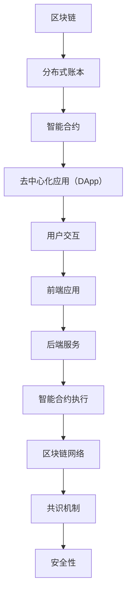

                 

### 文章标题：智能合约开发：区块链应用的核心

#### 关键词：
区块链、智能合约、DApp、Solidity、安全性、应用案例

#### 摘要：
本文旨在深入探讨智能合约的开发及其在区块链应用中的核心地位。我们将从基础概念开始，逐步解析智能合约的工作原理、开发流程、安全性问题，并通过实际案例展示其广泛应用。读者将了解智能合约如何改变传统业务模式，以及其在未来发展的挑战与机遇。

---

## 引言

区块链技术的兴起，为传统金融、供应链管理、版权保护等多个领域带来了革命性的变化。其中，智能合约作为区块链技术的核心组成部分，扮演着至关重要的角色。智能合约是一种自动执行合同条款的程序代码，能够在无需中介的情况下，确保交易的安全性和效率。本文将系统地介绍智能合约的基础知识、开发流程、安全性分析以及其在不同领域的应用，帮助读者全面了解智能合约的开发与应用。

## 第一部分：智能合约基础

### 第1章：区块链概述

#### 1.1 区块链的基本概念

区块链是一种分布式数据库技术，通过多个参与者共同维护和更新数据记录，形成一条不可篡改的链条。区块链的核心特点是去中心化、透明性和安全性。

#### 1.2 区块链的核心技术

区块链的核心技术包括哈希算法、加密技术和共识算法。哈希算法确保数据的一致性和唯一性；加密技术保障数据的隐私和安全；共识算法则确保所有参与者在更新数据时保持一致。

#### 1.3 区块链的应用场景

区块链技术可以应用于多个领域，如金融、供应链管理、版权保护、身份验证等。其去中心化和不可篡改的特性，使得区块链在这些领域具有显著的优势。

### 第2章：智能合约概述

#### 2.1 智能合约的定义与原理

智能合约是基于区块链技术的一种自动执行合同条款的程序代码。当满足合同条件时，智能合约会自动执行相应的操作，如转账、锁定资金等。

#### 2.2 智能合约的特点与优势

智能合约具有自动化、去中心化、不可篡改等特点。与传统合同相比，智能合约能够显著降低交易成本，提高交易效率。

#### 2.3 智能合约的发展历史

智能合约的概念最早由尼克·萨博（Nick Szabo）提出，2009年，中本聪（Satoshi Nakamoto）在比特币中首次实现了智能合约。

---

## 第二部分：智能合约编程

### 第3章：智能合约编程语言

#### 3.1 Solidity语言基础

Solidity是智能合约的主要编程语言，具有易学易用、功能丰富的特点。本章将介绍Solidity的基本语法和常用数据类型。

#### 3.2 Solidity函数、变量与数据类型

Solidity中的函数用于定义智能合约的行为，变量用于存储数据。本章将详细介绍函数的定义、调用方式，以及变量的声明和赋值。

#### 3.3 Solidity条件语句与循环语句

条件语句和循环语句是智能合约编程的基础，本章将讲解如何使用if、else、for、while等语句进行逻辑控制。

### 第4章：智能合约开发流程

#### 4.1 智能合约的开发环境搭建

本章将介绍如何搭建智能合约的开发环境，包括安装Node.js、Truffle等开发工具。

#### 4.2 智能合约的设计与实现

智能合约的设计与实现是开发过程的核心。本章将详细讲解如何设计智能合约，以及如何使用Solidity编写智能合约代码。

#### 4.3 智能合约的部署与测试

智能合约的部署是将代码上传到区块链的过程。本章将介绍如何使用Truffle等工具部署智能合约，并进行单元测试和集成测试。

### 第5章：智能合约与前端应用

#### 5.1 DApp的基本概念与开发流程

DApp（去中心化应用）是智能合约与前端应用的结合。本章将介绍DApp的基本概念，以及如何使用React等框架开发DApp。

#### 5.2 前端与智能合约的交互

前端与智能合约的交互是DApp开发的关键。本章将讲解如何使用Web3.js等库与智能合约进行交互，实现用户与区块链的互动。

#### 5.3 DApp的部署与运行

本章将介绍如何将DApp部署到区块链上，以及如何保证其稳定运行。同时，还将介绍DApp的监控与维护方法。

---

## 第三部分：智能合约安全

### 第6章：智能合约的安全性分析

#### 6.1 智能合约的安全隐患

智能合约存在多种安全隐患，如代码漏洞、攻击手段等。本章将分析智能合约常见的安全问题。

#### 6.2 常见的智能合约攻击手段

本章将介绍常见的智能合约攻击手段，如重入攻击（Reentrancy Attack）、整数溢出攻击等，并给出相应的防范措施。

#### 6.3 安全编码实践

本章将介绍如何编写安全的智能合约代码，包括代码审查、测试和审计等环节。

### 第7章：智能合约安全测试与审计

#### 7.1 安全测试方法与工具

安全测试是确保智能合约安全性的重要手段。本章将介绍智能合约的安全测试方法，以及常用的测试工具。

#### 7.2 安全审计流程与标准

安全审计是评估智能合约安全性的重要环节。本章将介绍安全审计的流程、标准和注意事项。

#### 7.3 智能合约漏洞修复与升级

智能合约漏洞修复与升级是保障智能合约安全的关键。本章将介绍如何发现和修复智能合约漏洞，以及如何进行智能合约的升级。

---

## 第四部分：智能合约应用与案例分析

### 第8章：智能合约在金融领域的应用

#### 8.1 去中心化金融（DeFi）概述

去中心化金融（DeFi）是智能合约在金融领域的典型应用。本章将介绍DeFi的基本概念、架构和优势。

#### 8.2 DeFi项目的案例分析

本章将分析几个典型的DeFi项目，如MakerDAO、Aave等，探讨其智能合约的设计和实现。

#### 8.3 智能合约在金融领域的挑战与机遇

智能合约在金融领域的应用面临许多挑战，如安全性、监管等。本章将讨论智能合约在金融领域的机遇与挑战。

### 第9章：智能合约在其他领域的应用

#### 9.1 物联网（IoT）与智能合约

物联网（IoT）与智能合约的结合，可以实现对设备的远程控制和监控。本章将介绍物联网与智能合约的集成方法。

#### 9.2 智能合约在供应链管理中的应用

智能合约在供应链管理中的应用，可以实现对供应链各环节的透明化和自动化。本章将探讨智能合约在供应链管理中的应用案例。

#### 9.3 智能合约在版权保护与数字身份验证中的应用

智能合约在版权保护与数字身份验证中的应用，可以实现对数字资产的透明化和可信化管理。本章将介绍相关应用案例。

### 第10章：区块链应用案例分析

#### 10.1 案例分析一：代币发行与交易平台

本章将分析一个代币发行与交易平台项目，探讨其智能合约的设计与实现。

#### 10.2 案例分析二：去中心化自治组织（DAO）

本章将分析一个去中心化自治组织（DAO）项目，探讨其智能合约的设计与实现。

#### 10.3 案例分析三：供应链金融

本章将分析一个供应链金融项目，探讨其智能合约的设计与实现。

---

## 第五部分：未来发展趋势与挑战

### 第11章：智能合约技术的未来发展

#### 11.1 智能合约2.0：去中心化应用（dApp）的发展

智能合约2.0将带来更加丰富和灵活的DApp开发体验。本章将介绍智能合约2.0的概念和发展趋势。

#### 11.2 智能合约与云计算、边缘计算的融合

智能合约与云计算、边缘计算的融合，将实现更高效、更安全的智能合约执行。本章将探讨相关技术和发展方向。

#### 11.3 智能合约在隐私保护与数据安全方面的应用

智能合约在隐私保护与数据安全方面的应用，将为数据共享和安全交易提供新的解决方案。本章将介绍相关技术和应用场景。

### 第12章：智能合约面临的挑战与解决方案

#### 12.1 智能合约性能优化与可扩展性问题

智能合约的性能优化与可扩展性是当前面临的重要挑战。本章将介绍相关技术和解决方案。

#### 12.2 智能合约安全性保障

智能合约的安全性是持续关注的话题。本章将讨论智能合约安全性的保障措施和未来发展趋势。

#### 12.3 区块链网络与智能合约的法律监管

智能合约的法律监管是保障其健康发展的关键。本章将探讨智能合约的法律监管现状和未来趋势。

## 附录

### 附录A：智能合约开发工具与资源

#### A.1 Solidity编程工具

本章将介绍Solidity编程工具，如Remix、Truffle等。

#### A.2 智能合约开发框架

本章将介绍智能合约开发框架，如ERC-20、ERC-721等。

#### A.3 区块链浏览器与监控工具

本章将介绍常用的区块链浏览器和监控工具，如Etherscan、Geth等。

#### A.4 智能合约安全审计工具

本章将介绍智能合约安全审计工具，如Slither、Mythril等。

---

## 结论

智能合约作为区块链技术的核心组成部分，具有广泛的应用前景。本文系统地介绍了智能合约的基础知识、编程技巧、安全性分析以及在不同领域的应用。读者可以通过本文，全面了解智能合约的开发与应用，为将智能合约技术应用到实际项目中提供指导。

---

## 作者信息

作者：AI天才研究院/AI Genius Institute & 禅与计算机程序设计艺术/Zen And The Art of Computer Programming

---

以上是文章的目录大纲，每个章节都将详细讲解智能合约开发的核心内容。本文预计在8000-12000字左右，力求为读者提供一份全面、深入的智能合约开发指南。接下来，我们将逐章深入探讨智能合约的各个方面。敬请期待！## 引言

区块链技术的兴起，无疑是近年来信息技术领域的重大突破。它不仅改变了传统金融、供应链管理、版权保护等多个行业，还为去中心化应用（DApp）的发展提供了强有力的技术支撑。在这其中，智能合约作为区块链技术的核心组成部分，发挥着至关重要的作用。

### 什么是智能合约

智能合约是一种自动执行合同条款的程序代码，它运行在区块链网络上，能够在无需第三方中介的情况下，确保交易的安全性和效率。智能合约的概念最早由尼克·萨博（Nick Szabo）在1990年代提出，他认为智能合约是一种计算机协议，能在满足合同条件时自动执行预先定义的操作。2009年，中本聪（Satoshi Nakamoto）在比特币的创世区块中首次实现了这一概念，使得智能合约正式登上历史舞台。

### 智能合约的工作原理

智能合约的工作原理相对简单。当用户在区块链上执行某个操作时，例如发起一笔转账或执行某个交易，智能合约会根据预先设定的条件自动执行相应的操作。这些操作可以包括转移资金、记录事件、发布信息等。智能合约通过区块链网络中的节点进行验证和执行，确保所有参与者都能看到并信任这一过程。

### 区块链与智能合约的关系

区块链技术为智能合约提供了运行环境。区块链的分布式数据库特性确保了智能合约的透明性和不可篡改性，而区块链的共识机制则保证了智能合约的执行是安全可靠的。简单来说，区块链为智能合约提供了一个可信的执行环境，使得智能合约能够实现去中心化的自动执行。

### 智能合约的优势

智能合约具有以下几个显著优势：

1. **自动化**：智能合约能够在满足条件时自动执行，减少了人工干预，提高了效率。
2. **去中心化**：智能合约不依赖于第三方中介，降低了交易成本，提高了透明度。
3. **不可篡改**：智能合约的执行过程记录在区块链上，一旦写入便无法更改，保证了数据的可信性。
4. **安全性**：智能合约基于密码学原理，具有很高的安全性，能够防范欺诈和篡改。

### 智能合约的应用领域

智能合约的应用范围非常广泛，包括但不限于以下领域：

1. **金融领域**：智能合约可以用于去中心化金融（DeFi）项目，如加密货币交易、借贷、保险等。
2. **供应链管理**：智能合约可以用于追踪供应链中的商品和交易，确保供应链的透明性和可靠性。
3. **版权保护**：智能合约可以用于数字版权管理，确保创作者的权益得到保障。
4. **身份验证**：智能合约可以用于身份验证和数字身份管理，提供安全、便捷的身份认证服务。

### 智能合约的发展历史

智能合约的概念虽然早在1990年代就已经提出，但直到区块链技术的发展，智能合约才真正得以实现。2009年，比特币的创世区块中包含了第一个智能合约的实现——比特币协议本身。2015年，以太坊的发布进一步推动了智能合约技术的发展，使得智能合约的应用变得更加广泛和灵活。近年来，越来越多的区块链平台和开发工具支持智能合约的开发，使得智能合约的开发门槛大大降低。

### 总结

智能合约作为区块链技术的核心组成部分，具有自动化、去中心化、不可篡改等显著优势，已经在多个领域得到广泛应用。随着区块链技术的不断发展，智能合约的未来发展前景十分广阔。本文将系统地介绍智能合约的基础知识、开发流程、安全性分析以及在不同领域的应用，帮助读者全面了解智能合约的开发与应用。

---

在接下来的章节中，我们将深入探讨智能合约的编程语言Solidity、开发流程、安全性和应用案例，为读者提供全面的智能合约开发指南。敬请期待！### 核心概念与联系

#### 区块链、智能合约与DApp的关系

区块链、智能合约和去中心化应用（DApp）是紧密相连的概念，共同构成了区块链生态系统。为了更好地理解这三者的关系，我们可以借助一个Mermaid流程图来直观地展示它们之间的交互关系。



在这个流程图中，区块链作为基础，提供了一个分布式账本，记录所有交易和数据。智能合约则基于这个分布式账本，通过编程语言（如Solidity）编写，定义了自动化执行合同条款的规则。去中心化应用（DApp）是用户与智能合约交互的界面，它将前端应用和后端服务与智能合约紧密连接，使得用户可以通过图形用户界面（GUI）与区块链网络进行交互。

#### 区块链的基本概念

区块链是一个分布式数据库系统，其核心特点是去中心化、透明性和不可篡改性。区块链通过加密技术确保数据的隐私和安全，同时使用共识算法（如工作量证明、权益证明等）来达成网络参与者的一致性。区块链上的数据以区块的形式存储，每个区块包含一定数量的交易记录，并通过哈希函数与前一个区块连接，形成一条不断延伸的链条。这种链式结构确保了数据的不可篡改性，一旦数据被记录在区块链上，就几乎无法被修改或删除。

#### 智能合约的定义与工作原理

智能合约是一种运行在区块链上的计算机程序，其代码预先定义了合同条款和执行规则。当区块链网络上的某个事件发生，满足智能合约的条件时，智能合约会自动执行预定的操作，如转账资金、记录数据、触发事件等。智能合约的工作原理可以概括为以下几个步骤：

1. **事件触发**：当区块链网络上的某个事件（如交易完成）发生时，会触发智能合约的执行。
2. **条件判断**：智能合约根据预设的条件判断是否满足执行条件。
3. **执行操作**：如果条件满足，智能合约将自动执行预定的操作，如转移资金、记录数据等。
4. **状态更新**：智能合约执行后，会更新区块链网络上的状态，确保交易结果的不可篡改性。

#### 去中心化应用（DApp）的定义与开发流程

去中心化应用（DApp）是用户与智能合约交互的界面，通常由前端应用和后端服务组成。前端应用负责与用户进行交互，接收用户输入并显示结果，而后端服务则与智能合约进行通信，执行智能合约中的操作。DApp的开发流程通常包括以下几个步骤：

1. **需求分析**：确定DApp的功能和目标用户群体。
2. **设计DApp架构**：设计DApp的整体架构，包括前端应用、后端服务和智能合约。
3. **编写智能合约**：使用Solidity等编程语言编写智能合约，定义合同条款和执行规则。
4. **前端应用开发**：使用React、Vue等前端框架开发用户界面，实现与智能合约的交互。
5. **后端服务开发**：开发与智能合约通信的后端服务，处理业务逻辑和数据存储。
6. **测试与部署**：对DApp进行全面的测试，确保其功能和性能符合预期，然后将其部署到区块链网络。

通过上述流程，我们可以看到区块链、智能合约和DApp之间的紧密联系。区块链为智能合约提供了一个可信的执行环境，而DApp则为用户提供了一个与区块链互动的界面，使得智能合约能够真正落地应用。

---

在下一章节中，我们将进一步探讨智能合约的核心编程语言——Solidity，介绍其基本语法、函数和变量，为智能合约的开发打下基础。敬请期待！### 核心算法原理讲解

#### 智能合约编程语言：Solidity

智能合约的编程语言是智能合约开发的关键。目前，主流的智能合约编程语言包括Solidity、Vyper和Scilla等。其中，Solidity是最为广泛使用的一种，尤其是在以太坊区块链平台上。Solidity语言由以太坊基金会开发，具有易学易用、功能丰富的特点。本章节将详细介绍Solidity的基本语法、函数和变量，并简要介绍其他常用编程语言的特点。

##### 1. Solidity语言基础

Solidity语言的语法结构类似于JavaScript和Python，易于理解和上手。以下是Solidity语言的一些基本语法规则：

- **注释**：Solidity支持单行和多行注释。单行注释以 `//` 开头，多行注释以 `/*` 开始并以 `*/` 结束。
- **变量和数据类型**：Solidity支持多种数据类型，包括整数类型、布尔类型、地址类型和结构体类型等。变量在使用前需要声明并初始化。
  
  ```solidity
  uint256 public myUint = 0;
  bool public isTrue = true;
  address public myAddress = 0x0000000000000000000000000000000000000000;
  ```

- **函数**：Solidity中的函数用于定义智能合约的行为。函数可以接受参数，并返回结果。函数分为外部函数和内部函数，外部函数可以通过区块链网络被调用，而内部函数只能在合约内部调用。

  ```solidity
  function add(uint256 a, uint256 b) public pure returns (uint256) {
      return a + b;
  }
  ```

- **事件**：事件是一种在智能合约执行过程中触发的日志记录。事件可以通过EVM日志系统被外部监听和记录。

  ```solidity
  event LogEvent(uint256 indexed a, uint256 indexed b);
  ```

##### 2. Solidity函数、变量与数据类型

Solidity中的函数是智能合约的核心组成部分，用于实现合同条款和业务逻辑。以下是Solidity函数、变量和数据类型的一些详细讲解：

- **函数**：
  - **修饰符**：修饰符是用于修饰函数、变量和状态的元编程工具，如`public`、`external`、`view`、`pure`等。
  - **函数返回值**：Solidity中的函数可以返回多个值，返回值可以通过元组（tuple）或结构体（struct）进行打包和拆包。
  
  ```solidity
  function getValues() public view returns (uint256, bool) {
      return (myUint, isTrue);
  }
  ```

- **变量**：
  - **状态变量**：状态变量是存储在区块链上的变量，其值在整个智能合约的生命周期内保持不变。
  - **局部变量**：局部变量是函数内部的变量，其作用域仅限于函数内部。
  - **存储位置**：Solidity中的变量可以存储在内存或存储中，内存变量在函数调用时分配和释放，而存储变量则永久存储在合约中。
  
  ```solidity
  uint256 public stateVariable;
  function setLocalVariable(uint256 value) public {
      uint256 localVariable = value;
  }
  ```

- **数据类型**：
  - **基本数据类型**：包括整数（int256、uint256等）、布尔（bool）、地址（address）等。
  - **复合数据类型**：包括数组、映射（map）、结构体（struct）和枚举（enum）。
  - **动态数组**：动态数组可以在运行时调整大小，使用`new`关键字进行分配。
  
  ```solidity
  mapping(uint256 => uint256) public map;
  struct Person {
      uint256 id;
      string name;
  }
  ```

##### 3. Solidity条件语句与循环语句

条件语句和循环语句是编程中的基础，用于控制程序流程。Solidity也支持常见的条件语句和循环语句，如下所示：

- **条件语句**：`if-else`语句和`switch`语句用于根据条件执行不同的代码块。

  ```solidity
  function checkNumber(uint256 number) public pure {
      if (number > 10) {
          return "Number is greater than 10";
      } else {
          return "Number is less than or equal to 10";
      }
  }
  ```

- **循环语句**：`for`循环和`while`循环用于重复执行代码块，直到满足特定条件。

  ```solidity
  function sumArray(uint256[] memory numbers) public pure returns (uint256) {
      uint256 sum = 0;
      for (uint256 i = 0; i < numbers.length; i++) {
          sum += numbers[i];
      }
      return sum;
  }
  ```

##### 4. 其他智能合约编程语言简介

除了Solidity，其他智能合约编程语言如Vyper和Scilla也值得关注。Vyper是一种更安全、更易于理解的编程语言，它通过严格的类型系统和简洁的语法减少了潜在的安全漏洞。Scilla则是一种基于形式化验证的编程语言，旨在确保智能合约的安全性。

- **Vyper**：Vyper注重安全性，采用静态类型系统，减少运行时错误。其语法类似于Python，易于学习。
  
  ```python
  @public
  def double(x: uint) -> uint:
      return x * 2
  ```

- **Scilla**：Scilla通过形式化验证确保智能合约的正确性，其语法类似于C，同时支持形式化验证工具。

  ```c
  function add(uint x, uint y) -> uint {
      return x + y;
  }
  ```

通过以上对Solidity语言基础、函数、变量和数据类型的介绍，我们可以看到Solidity作为智能合约编程语言的核心地位。在下一章节中，我们将深入探讨智能合约的开发流程，包括开发环境搭建、智能合约设计实现和部署测试等。敬请期待！### 数学模型和数学公式

在智能合约开发中，数学模型和数学公式起着至关重要的作用。这些模型和公式不仅用于实现复杂的业务逻辑，还确保了智能合约的安全性、可靠性和有效性。以下是几个关键的数学模型和公式，以及它们在智能合约开发中的应用和详细讲解。

#### 1. 密码学原理

密码学是智能合约安全性的基石。智能合约依赖于多种密码学算法，如哈希函数、数字签名和椭圆曲线加密。以下是这些算法的基本原理和应用：

- **哈希函数**：哈希函数是一种将任意长度的数据映射为固定长度的字符串的函数。常见的哈希函数包括SHA-256和KECCAK-256。哈希函数在智能合约中的应用包括数据完整性验证、地址生成和事件日志记录等。

  $$ H = SHA-256(data) $$

  在智能合约中，可以使用以下代码生成SHA-256哈希值：

  ```solidity
  bytes32 hash = keccak256(abi.encodePacked(data));
  ```

- **数字签名**：数字签名用于确保消息的来源和完整性。常见的数字签名算法包括ECDSA（基于椭圆曲线加密）。数字签名在智能合约中的应用包括身份验证、交易确认和智能合约执行。

  $$ sig = ECDSA(signer, message) $$

  在智能合约中，可以使用以下代码生成数字签名：

  ```solidity
  bytes32 messageHash = keccak256(abi.encodePacked(message));
  (uint8 v, bytes32 r, bytes32 s) = eth.sign(messageHash);
  ```

- **椭圆曲线加密**：椭圆曲线加密（ECC）是一种强大的加密技术，用于实现高效的安全通信。ECC在智能合约中的应用包括地址生成、密钥管理和交易验证等。

  $$ Q = kG $$

  其中，Q是公钥，k是私钥，G是基点，kG是椭圆曲线上的点。

#### 2. 哈希算法

哈希算法在智能合约中的应用非常广泛。哈希算法可以将任意长度的数据压缩为固定长度的哈希值，从而确保数据的唯一性和不可篡改性。以下是一些常见的哈希算法：

- **SHA-256**：SHA-256是一种广泛使用的哈希算法，用于生成256位的哈希值。SHA-256在智能合约中的应用包括数据完整性验证和区块链交易记录。

  $$ H = SHA-256(data) $$

- **KECCAK-256**：KECCAK-256是一种与SHA-256类似的哈希算法，也用于生成256位的哈希值。KECCAK-256在智能合约中的应用与SHA-256类似。

  $$ H = KECCAK-256(data) $$

在智能合约中，可以使用以下代码生成SHA-256哈希值：

```solidity
bytes32 hash = keccak256(abi.encodePacked(data));
```

#### 3. 椭圆曲线数字签名算法（ECDSA）

ECDSA是一种常用的数字签名算法，基于椭圆曲线加密。ECDSA在智能合约中的应用包括身份验证和交易验证。以下是ECDSA的伪代码：

```python
def ECDSA(signer, message):
    # Generate a random number k
    k = generate_random_number()

    # Compute the curve point Q = kG
    Q = kG

    # Compute the hash of the message
    message_hash = Hash(message)

    # Compute the signature (r, s)
    r = message_hash % n
    s = (k^{-1} * (m + xr)) % n

    return (r, s)
```

在智能合约中，可以使用以下代码生成ECDSA签名：

```solidity
bytes32 messageHash = keccak256(abi.encodePacked(message));
(uint8 v, bytes32 r, bytes32 s) = eth.sign(messageHash);
```

#### 4. Merkle树

Merkle树是一种数据结构，用于验证大量数据的完整性。Merkle树在智能合约中的应用包括区块验证、交易验证和状态证明。以下是Merkle树的构建和验证过程：

- **构建Merkle树**：

  ```python
  def build_merkle_tree(data):
      if len(data) == 1:
          return data[0]
      
      pairs = [data[i:i+2] for i in range(0, len(data), 2)]
      leaves = [hash_pair(pair) for pair in pairs]
      internal_nodes = [hash_pair(node1, node2) for node1, node2 in leaves]
      
      return build_merkle_tree(internal_nodes)
  ```

- **验证Merkle树**：

  ```python
  def verify_merkle_proof(leaf, proof, root):
      node = leaf
      
      for i in range(len(proof)):
          if i % 2 == 0:
              node = hash_pair(node, proof[i])
          else:
              node = hash_pair(node, proof[i])
              
      return node == root
  ```

在智能合约中，可以使用以下代码构建和验证Merkle树：

```solidity
function buildMerkleProof(bytes32[] memory data) public view returns (bytes32) {
    // Build the Merkle tree
}

function verifyMerkleProof(bytes32 leaf, bytes32[] memory proof, bytes32 root) public view returns (bool) {
    // Verify the Merkle proof
}
```

通过上述数学模型和公式的讲解，我们可以看到智能合约开发中的数学原理和工具。这些模型和公式不仅用于实现复杂的业务逻辑，还确保了智能合约的安全性和可靠性。在下一章节中，我们将进一步探讨智能合约的开发流程，包括环境搭建、智能合约设计实现和部署测试。敬请期待！### 项目实战

#### 智能合约开发环境搭建

要开始智能合约的开发，首先需要搭建合适的开发环境。以下是搭建智能合约开发环境的具体步骤：

1. **安装Node.js**：Node.js是一个基于Chrome V8引擎的JavaScript运行环境，用于运行智能合约的开发工具。访问Node.js官方网站（[https://nodejs.org/），下载并安装对应操作系统的版本。在安装完成后，通过命令行验证安装是否成功：**

   ```bash
   node -v
   npm -v
   ```

2. **安装Truffle**：Truffle是一个智能合约开发框架，提供了合约编译、部署和测试等功能。通过以下命令安装Truffle：

   ```bash
   npm install -g truffle
   ```

   安装完成后，可以通过命令行验证Truffle是否安装成功：

   ```bash
   truffle version
   ```

3. **创建一个Truffle项目**：通过以下命令创建一个Truffle项目：

   ```bash
   truffle init
   ```

   这将创建一个包含基本项目结构的新文件夹，例如`my-contract`。

4. **安装 Ganache**：Ganache是一个本地以太坊节点，用于测试和模拟智能合约的执行。通过以下命令安装Ganache：

   ```bash
   npm install -g ganache-cli
   ```

   安装完成后，可以通过以下命令启动一个本地以太坊节点：

   ```bash
   ganache-cli
   ```

   这将启动一个包含多个预定义账户的本地以太坊节点，用于测试智能合约。

5. **配置Truffle**：在Truffle项目中，编辑`truffle-config.js`文件，配置与Ganache的连接。以下是一个示例配置：

   ```javascript
   module.exports = {
     networks: {
       development: {
         host: "127.0.0.1",
         port: 8545,
         network_id: "*",
       },
     },
   };
   ```

   通过上述配置，Truffle将连接到本地的Ganache节点。

#### 源代码实现

以下是一个简单的智能合约示例，实现了一个存储值的功能。智能合约使用Solidity语言编写，并使用Truffle进行编译、部署和测试。

```solidity
// SPDX-License-Identifier: MIT
pragma solidity ^0.8.0;

contract SimpleStorage {
    uint256 private storedValue;

    constructor() {
        storedValue = 0;
    }

    function store(uint256 value) public {
        storedValue = value;
    }

    function retrieve() public view returns (uint256) {
        return storedValue;
    }
}
```

上述智能合约定义了一个名为`SimpleStorage`的合约，包含一个私有变量`storedValue`和一个构造函数。构造函数在合约部署时初始化`storedValue`为0。合约还提供了两个公开函数：`store`和`retrieve`。`store`函数用于存储值，而`retrieve`函数用于检索存储的值。

#### 代码解读

- **构造函数**：构造函数在合约部署时执行，用于初始化合约状态。在本例中，构造函数将`storedValue`设置为0。

- **存储值函数**：`store`函数是一个公开的`external`函数，用于存储值。它接受一个`uint256`类型的参数`value`，并将其存储在`storedValue`变量中。

- **检索值函数**：`retrieve`函数是一个公开的`view`函数，用于检索存储的值。它不修改合约状态，因此使用`view`修饰符，表明在调用此函数时不需要执行任何状态改变的操作。

#### 智能合约部署

要部署上述智能合约，首先需要使用Truffle编译合约。在项目根目录下执行以下命令：

```bash
truffle compile
```

这将在`build/contracts/`目录下生成编译后的合约文件。接下来，使用Truffle迁移脚本部署合约。创建一个名为`migrations`的文件夹，并在其中创建一个名为`1_deploy_SimpleStorage.js`的文件，内容如下：

```javascript
const SimpleStorage = artifacts.require("SimpleStorage");

module.exports = function (deployer) {
  deployer.deploy(SimpleStorage);
};
```

执行以下命令运行迁移脚本：

```bash
truffle migrate --network development
```

这将编译并部署合约到本地的Ganache节点。部署完成后，Truffle会输出合约的部署地址和ABI。

```bash
> Compiled contracts:

* SimpleStorage.sol:SimpleStorage
  - 0x...
  
> Migrations:

* 1: Deploy SimpleStorage
  - 0x...
```

#### 源代码应用解读与分析

通过Truffle和Ganache，我们可以轻松地部署和测试智能合约。以下是一个简单的应用示例，展示如何与部署的智能合约进行交互。

1. **连接到本地以太坊节点**：首先，使用Web3.js库连接到本地Ganache节点。

   ```javascript
   const Web3 = require("web3");
   const web3 = new Web3("http://127.0.0.1:8545");
   ```

2. **获取智能合约实例**：加载部署的智能合约ABI和合约地址，获取智能合约实例。

   ```javascript
   const SimpleStorageArtifact = require("../build/contracts/SimpleStorage.json");
   const simpleStorageAddress = "0x...";
   const simpleStorageContract = new web3.eth.Contract(
     SimpleStorageArtifact.abi,
     simpleStorageAddress
   );
   ```

3. **调用智能合约函数**：使用智能合约实例调用`store`和`retrieve`函数。

   ```javascript
   async function run() {
     // 存储值
     await simpleStorageContract.methods.store(10).send({
       from: web3.eth.defaultAccount,
       gas: 2000000,
     });

     // 检索值
     const value = await simpleStorageContract.methods.retrieve().call();
     console.log(`Stored value: ${value}`);
   }

   run();
   ```

通过上述步骤，我们可以与部署的智能合约进行交互，存储和检索值。这只是一个简单的示例，但在实际应用中，智能合约可以执行复杂的业务逻辑，如去中心化金融（DeFi）合约、供应链管理合约和版权保护合约等。

---

#### 实际案例分析与详细讲解剖析

在本节中，我们将分析一个实际的智能合约案例：去中心化金融（DeFi）项目——Uniswap。Uniswap是一个基于以太坊的去中心化交易平台，允许用户通过智能合约直接进行加密货币的交易。

##### 案例一：Uniswap的智能合约设计

Uniswap的核心智能合约是`UniswapV2Pair.sol`，它实现了交易对（Pair）的逻辑。以下是其关键部分：

```solidity
pragma solidity ^0.8.0;

import "@uniswap/v2-core/contracts/interfaces/IPeriphery.sol";
import "@uniswap/v2-core/contracts/interfaces/IERC20.sol";
import "@uniswap/v2-core/contracts/libraries/TransferHelper.sol";
import "@uniswap/v2-core/contracts/libraries/Math.sol";
import "@uniswap/v2-core/contracts/libraries/UQ32x32.sol";

contract UniswapV2Pair is IPeriphery {
    using UQ32x32 for *;
    using SafeMath for uint256;

    address public token0;
    address public token1;

    uint32 public price0CumulativeX96;
    uint32 public price1CumulativeX96;
    uint16 public feeProtocol;

    event LogSwap(
        address indexed sender,
        uint256 amount0,
        uint256 amount1,
        bool is0To1
    );

    constructor() {
        // 初始化交易对
        token0 = msg.sender;
        token1 = IERC20(address(this)).token0();
        feeProtocol = 30;
        price0CumulativeX96 = 0;
        price1CumulativeX96 = 0;
    }

    function swap(uint256 amount0Out, uint256 amount1Out, bool is0To1, bytes calldata data) external {
        require((amount0Out > 0) != is0To1, "invalid amount-out"); // 确保输入金额和方向匹配

        // 获取输入和输出的代币余额
        uint256 balanceIn = is0To1 ? IERC20(token1).balanceOf(address(this)) : IERC20(token0).balanceOf(address(this));
        uint256 balanceOut = is0To1 ? IERC20(token0).balanceOf(address(this)) : IERC20(token1).balanceOf(address(this));

        // 计算交易所需滑点
        (uint256 amountIn, uint256 amountOut) = is0To1
            ? _swap_0_to_1(amount0Out, balanceIn, balanceOut)
            : _swap_1_to_0(amount1Out, balance0, balance1);

        // 执行交易
        if (is0To1) {
            TransferHelper.safeTransfer(IERC20(token0), msg.sender, amountOut);
            TransferHelper.safeTransfer(IERC20(token1), address(this), amountIn);
        } else {
            TransferHelper.safeTransfer(IERC20(token1), msg.sender, amountOut);
            TransferHelper.safeTransfer(IERC20(token0), address(this), amountIn);
        }

        // 触发事件
        emit LogSwap(msg.sender, amount0Out, amount1Out, is0To1);

        // 调用代理回调
        IPeriphery(msg.sender).swap(amount0Out, amount1Out, is0To1, data);
    }

    // ...其他函数
}
```

**解析**：

1. **初始化交易对**：合约在部署时初始化交易对的两个代币地址，并设置费率协议。

2. **价格累积**：合约维护了两个累积价格变量，用于计算价格动态。

3. **交换逻辑**：`swap`函数实现了两种交换逻辑：从0代币（token0）到1代币（token1）的交换和从1代币到0代币的交换。这通过私有函数`_swap_0_to_1`和`_swap_1_to_0`实现。

4. **交易和回调**：在交换过程中，调用`TransferHelper`进行代币转移，并触发事件`LogSwap`。然后调用代理回调，实现与外部合约的交互。

##### 案例二：Uniswap的智能合约安全性和性能优化

尽管Uniswap的智能合约在设计上具有很多优点，但也存在一些安全和性能问题。以下是一些关键点：

**安全性**：

- **价格累积攻击**：由于累积价格变量可能受到恶意操纵，导致价格累积不准确，可能引发价格操纵攻击。为此，Uniswap引入了价格调整逻辑，确保价格累积的准确性。

- **代码审计**：Uniswap的智能合约代码经过多个专业团队的安全审计，以确保没有潜在的安全漏洞。

**性能优化**：

- **批量交易**：Uniswap通过批量交易提高了交易效率，减少网络拥堵和交易费用。
- **代币互换库**：Uniswap使用了高效、优化的代币互换库，如`Math`和`UQ32x32`，以优化计算性能。

通过上述案例分析，我们可以看到智能合约在实际应用中的复杂性和挑战。这需要开发者具备深入的技术知识和丰富的实践经验，以确保智能合约的安全性和高效性。在下一章节中，我们将进一步探讨智能合约的安全性分析，包括潜在的安全隐患和防范措施。敬请期待！

---

在下一章节中，我们将深入探讨智能合约的安全性分析，包括潜在的安全隐患和防范措施。敬请期待！### 智能合约的安全性分析

智能合约的安全性是区块链技术应用中至关重要的一环。由于智能合约运行在去中心化的区块链网络上，其代码一旦部署即无法更改，因此任何漏洞或错误都可能导致不可逆的损失。本章节将详细分析智能合约中常见的安全隐患、攻击手段，以及如何通过安全编码实践来提高智能合约的安全性。

#### 1. 常见的安全隐患

智能合约的安全隐患主要源于代码编写中的错误、不完善的测试、以及复杂性的增加。以下是一些常见的安全隐患：

- **整数溢出**：智能合约中常见的整数溢出错误，会导致数值超出预期范围。例如，当使用无符号整数（uint）时，如果加法操作导致结果超出最大值，将会产生错误的结果。

- **重入攻击（Reentrancy Attack）**：重入攻击是智能合约中的一种常见攻击手段。攻击者通过多次调用合约中的函数，使得合约在执行第二个操作之前，尚未完成第一个操作，从而导致资金被恶意提取。

- **未授权访问**：智能合约可能存在未授权访问的问题，特别是在访问控制不当的情况下，恶意用户可以未经许可访问和修改合约的状态。

- **前端漏洞**：前端与智能合约交互时，可能存在跨站请求伪造（CSRF）和跨站脚本（XSS）等漏洞，这些漏洞可能导致用户账户被盗。

#### 2. 常见的攻击手段

智能合约面临的攻击手段多种多样，以下是一些主要的攻击手段：

- **重入攻击（Reentrancy Attack）**：攻击者通过在合约中调用外部合约，并在外部合约执行前多次提取资金，从而耗尽合约资金。

  ```solidity
  function attack() external {
      while (myContract.balance() > 0) {
          myContract.withdraw();
      }
  }
  ```

- **整数溢出攻击**：攻击者通过构造特定的输入，导致整数溢出，从而获取合约的控制权。

  ```solidity
  function maliciousInput(uint256 input) external {
      uint256 result = input * 2; // 输入为2^256-1时，会发生溢出
      if (result > 2**256 - 1) {
          // 攻击代码
      }
  }
  ```

- **前端攻击**：攻击者通过控制前端，向智能合约发送恶意请求，从而盗取用户资金。

  ```javascript
  async function sendMaliciousRequest() {
      const result = await myContract.callMethod('transfer', ['0x...'], { from: myAddress });
      // 攻击代码
  }
  ```

- **智能合约错误**：智能合约中的代码逻辑错误，可能导致合约无法正确执行预期操作。

  ```solidity
  function addToMap(uint256 key, uint256 value) public {
      mapping[key] = value; // 缺少方括号，导致访问未定义的内存地址
  }
  ```

#### 3. 安全编码实践

为了提高智能合约的安全性，开发者需要遵循一系列安全编码实践。以下是一些关键的安全编码实践：

- **代码审查**：智能合约代码在部署前应经过严格的代码审查，确保代码的正确性和安全性。代码审查可以由团队内部或第三方安全专家完成。

- **安全测试**：智能合约应进行全面的测试，包括单元测试、集成测试和渗透测试。测试应覆盖所有可能的执行路径，确保代码不存在漏洞。

- **避免整数溢出**：智能合约应避免使用无符号整数（uint），而是使用有符号整数（int），以减少溢出风险。同时，应使用安全库函数来处理数值计算。

- **避免重入攻击**：为了避免重入攻击，智能合约应使用`nonReentrant`修饰符，确保函数在执行过程中不会被重复调用。

  ```solidity
  function safeTransfer() nonReentrant external {
      // 安全转移代码
  }
  ```

- **使用访问控制**：智能合约应使用访问控制来限制函数的可访问性，确保只有授权用户才能执行关键操作。

- **使用标准库和框架**：开发者应使用经过验证的库和框架，避免自行实现复杂逻辑，以减少安全漏洞。

- **前端安全**：前端与智能合约交互时，应确保使用安全的通信协议（如HTTPS），并使用验证机制来防止恶意请求。

#### 4. 安全测试与审计

智能合约的安全测试和审计是确保其安全性的重要环节。以下是一些关键的安全测试和审计步骤：

- **静态分析**：静态分析是一种不执行代码的测试方法，通过检查代码的语法和语义，发现潜在的安全问题。

- **动态分析**：动态分析是一种执行代码的测试方法，通过运行代码并观察其行为，发现潜在的安全问题。

- **代码审计**：代码审计是由专业人员对代码进行审查，以发现潜在的安全漏洞。审计应包括代码审查、测试用例分析和安全评估。

- **安全审计工具**：使用自动化安全审计工具，如Slither、Mythril等，可以快速发现代码中的潜在问题。

- **外部审计**：聘请专业的第三方安全团队进行外部审计，以确保智能合约的安全性。

#### 5. 安全性保障

智能合约的安全性保障需要多方共同努力，包括开发者、测试者、审计师和用户。以下是一些关键措施：

- **开发者**：开发者应遵循安全编码实践，进行全面的测试和审计，确保代码的安全性和可靠性。

- **测试者**：测试者应进行全面的测试，确保智能合约在各种情况下都能正确执行。

- **审计师**：审计师应对智能合约进行详细审计，发现潜在的安全问题并提出改进建议。

- **用户**：用户在参与智能合约时，应仔细评估智能合约的安全性，确保其资金安全。

通过上述安全分析和实践，开发者可以显著提高智能合约的安全性，减少潜在的风险。然而，智能合约的安全性是一个持续的过程，需要开发者、测试者和用户共同努力，以确保智能合约的安全可靠运行。在下一章节中，我们将探讨智能合约在不同领域的应用和案例。敬请期待！

---

在下一章节中，我们将通过具体的案例，展示智能合约在金融、物联网、供应链管理、版权保护等领域的应用。敬请期待！### 智能合约在金融领域的应用

智能合约在金融领域的应用，极大地推动了去中心化金融（DeFi）的发展。DeFi通过智能合约实现金融服务的去中心化，消除了传统金融体系中中介机构的需求，降低了交易成本，提高了透明度和安全性。以下将介绍智能合约在金融领域的一些典型应用，包括去中心化交易平台、去中心化借贷平台和去中心化保险等。

#### 1. 去中心化交易平台

去中心化交易平台（DEX）是智能合约在金融领域的一个重要应用。与传统的中心化交易平台不同，DEX不依赖中心化交易所，通过智能合约实现买卖双方直接交易。Uniswap和SushiSwap是两个最著名的去中心化交易平台，它们基于以太坊区块链，使用智能合约实现代币交换。

- **Uniswap**：Uniswap是基于流动性池（Liquidity Pool）的DEX，流动性提供者（Liquidity Providers）将代币存入流动性池，从而获得交易费分成。Uniswap的智能合约使用恒定乘积市场-maker模型（Constant Product Market-Maker Model），实现了自动做市（Automated Market-Making）。

  ```solidity
  // SPDX-License-Identifier: MIT

  import "@uniswap/v2-core/contracts/interfaces/IERC20.sol";
  import "@uniswap/v2-periphery/contracts/interfaces/ISwapRouter.sol";

  contract UniswapV2Exchange {
      ISwapRouter public uniswapRouter;
      address public weth;

      constructor() {
          uniswapRouter = ISwapRouter(KovanSwapRouterAddress);
          weth = KovanWethAddress;
      }

      function swapExactTokensForTokens(
          uint amountIn,
          uint amountOutMin,
          address[] calldata path,
          address to,
          uint deadline
      ) external {
          uniswapRouter.swapExactTokensForTokens(
              amountIn,
              amountOutMin,
              path,
              to,
              deadline
          );
      }
  }
  ```

- **SushiSwap**：SushiSwap是Uniswap的改进版本，引入了SUSHI代币，用于奖励流动性提供者和交易者。SushiSwap同样使用流动性池模型，但其流动性提供者可以通过投票机制参与平台的发展。

#### 2. 去中心化借贷平台

去中心化借贷平台（DeFi Lending Platforms）通过智能合约实现点对点借贷，借款人和贷款人无需通过传统金融机构进行交易。Compound和Aave是两个最著名的去中心化借贷平台。

- **Compound**：Compound是一个基于以太坊的DeFi借贷平台，用户可以将自己的代币存入平台，作为贷款的抵押品，并获得相应的借贷利率。Compound的智能合约实现了自动借贷和利率调整。

  ```solidity
  // SPDX-License-Identifier: MIT

  import "@openzeppelin/contracts/token/ERC20/IERC20.sol";
  import "@openzeppelin/contracts/access/Ownable.sol";
  import "@chainlink/contracts/src/v0.8/interfaces/AggregatorV3Interface.sol";

  contract CompoundLending {
      IERC20 public cToken;
      AggregatorV3Interface public priceFeed;

      constructor(address cTokenAddress, address priceFeedAddress) {
          cToken = IERC20(cTokenAddress);
          priceFeed = AggregatorV3Interface(priceFeedAddress);
      }

      function deposit(uint amount) external {
          cToken.transferFrom(msg.sender, address(this), amount);
      }

      function borrow(uint amount) external {
          // 计算借款金额
          uint borrowAmount = amount * priceFeed.latestPrice();
          cToken.borrow(borrowAmount);
      }

      function repay(uint amount) external {
          cToken.repayBorrow(amount);
      }
  }
  ```

- **Aave**：Aave是另一个去中心化借贷平台，它提供了更灵活的借贷服务，包括支持多种货币、灵活的借贷利率和低抵押率。Aave的智能合约使用利率模型（Interest Model），实现了不同货币之间的借贷。

#### 3. 去中心化保险

去中心化保险（DeFi Insurance）通过智能合约实现保险服务的自动化和去中心化。用户可以通过智能合约购买保险，并在触发事件时自动获得赔偿。一个典型的例子是Nexus Mutual，它使用智能合约提供财产保险、医疗保险和宠物保险等。

- **Nexus Mutual**：Nexus Mutual使用智能合约提供保险服务，用户通过支付保险费参与保险基金，当发生保险事件时，基金自动分配赔偿金。Nexus Mutual的智能合约实现了透明度和自动化，用户可以实时查看保险基金的状态和赔偿过程。

  ```solidity
  // SPDX-License-Identifier: MIT

  import "@openzeppelin/contracts/token/ERC20/IERC20.sol";
  import "@openzeppelin/contracts/security/Pausable.sol";
  import "@openzeppelin/contracts/access/Ownable.sol";

  contract NexusMutual {
      IERC20 public insuranceToken;
      mapping(address => uint) public insuredAmounts;

      constructor(address insuranceTokenAddress) {
          insuranceToken = IERC20(insuranceTokenAddress);
      }

      function insure(uint amount) external {
          insuranceToken.transferFrom(msg.sender, address(this), amount);
          insuredAmounts[msg.sender] += amount;
      }

      function claim(uint amount) external {
          require(insuredAmounts[msg.sender] >= amount, "Insufficient coverage");
          insuranceToken.transfer(msg.sender, amount);
          insuredAmounts[msg.sender] -= amount;
      }
  }
  ```

通过上述去中心化交易平台、借贷平台和保险平台的实例，我们可以看到智能合约在金融领域的广泛应用。这些应用不仅提高了金融服务的效率，还增强了用户对金融系统的信任。然而，智能合约在金融领域也面临着许多挑战，如安全性、合规性和监管等。在下一章节中，我们将探讨智能合约在其他领域的应用，如物联网、供应链管理和版权保护。敬请期待！

---

在下一章节中，我们将探讨智能合约在物联网、供应链管理和版权保护等领域的应用。敬请期待！### 智能合约在其他领域的应用

智能合约不仅局限于金融领域，其在物联网（IoT）、供应链管理和版权保护等领域的应用也展示了其巨大的潜力和广泛的应用前景。以下将详细探讨智能合约在这些领域的应用及其实现方式。

#### 1. 物联网（IoT）与智能合约

物联网（IoT）是连接物理世界和数字世界的桥梁，智能合约可以提供一种安全的、自动化的方式来管理物联网设备之间的数据交换和交易。以下是智能合约在物联网领域的几个关键应用：

- **设备监控与数据验证**：智能合约可以确保物联网设备上传的数据真实有效。例如，智能水表可以记录用水量，并通过智能合约验证数据的准确性，确保只有实际用水量才能触发付款。

  ```solidity
  // SPDX-License-Identifier: MIT

  import "@openzeppelin/contracts/token/ERC20/IERC20.sol";
  import "@openzeppelin/contracts/access/Ownable.sol";

  contract WaterMeter {
      IERC20 public waterToken;
      mapping(address => uint) public waterUsage;

      constructor(address tokenAddress) {
          waterToken = IERC20(tokenAddress);
      }

      function recordWaterUsage(address meterAddress, uint usage) external {
          waterUsage[meterAddress] += usage;
          waterToken.transferFrom(msg.sender, address(this), usage);
      }

      function claimPayment() external {
          uint usage = waterUsage[msg.sender];
          waterUsage[msg.sender] = 0;
          waterToken.transfer(msg.sender, usage);
      }
  }
  ```

- **设备授权与控制**：智能合约可以用于授权物联网设备的访问权限，确保只有经过认证的用户才能控制设备。例如，智能家居系统可以使用智能合约来控制智能灯泡和智能锁。

  ```solidity
  // SPDX-License-Identifier: MIT

  import "@openzeppelin/contracts/token/ERC721/IERC721.sol";
  import "@openzeppelin/contracts/security/Pausable.sol";
  import "@openzeppelin/contracts/access/Ownable.sol";

  contract SmartHome {
      IERC721 public smartLockToken;
      mapping(address => bool) public authorized;

      constructor(address tokenAddress) {
          smartLockToken = IERC721(tokenAddress);
      }

      function authorize(address user) external {
          require(msg.sender == owner, "Not authorized");
          authorized[user] = true;
      }

      function unlockSmartLock(address lockId) external {
          require(authorized[msg.sender], "Not authorized");
          smartLockToken.transferFrom(address(this), msg.sender, lockId);
      }
  }
  ```

#### 2. 智能合约在供应链管理中的应用

供应链管理涉及多个环节，智能合约可以确保供应链的透明性、可追溯性和自动化。以下是智能合约在供应链管理中的几个关键应用：

- **供应链追踪与验证**：智能合约可以记录供应链中每个环节的数据，如生产日期、运输状态、质检报告等，确保供应链的透明性。例如，食品供应链可以使用智能合约记录食品的来源和加工过程。

  ```solidity
  // SPDX-License-Identifier: MIT

  import "@openzeppelin/contracts/token/ERC721/IERC721.sol";
  import "@openzeppelin/contracts/security/Pausable.sol";
  import "@openzeppelin/contracts/access/Ownable.sol";

  contract FoodSupplyChain {
      IERC721 public foodToken;
      mapping(uint => address) public ownershipHistory;

      constructor(address tokenAddress) {
          foodToken = IERC721(tokenAddress);
      }

      function recordProductionDate(uint tokenId, uint productionDate) external {
          ownershipHistory[tokenId] = msg.sender;
          foodToken.setTokenURI(tokenId, "https://example.com/fooddata?tokenId=" + toString(tokenId) + "&productionDate=" + toString(productionDate));
      }

      function verifyProductionDate(uint tokenId) external view returns (uint) {
          return uint(ParsedJSON.fromURI(foodToken.tokenURI(tokenId)).find("productionDate").toInt());
      }
  }
  ```

- **供应链金融**：智能合约可以用于供应链金融，如发票融资、预付款融资等。智能合约确保融资流程的自动化和透明性，减少人为干预和欺诈风险。

  ```solidity
  // SPDX-License-Identifier: MIT

  import "@openzeppelin/contracts/token/ERC20/IERC20.sol";
  import "@openzeppelin/contracts/security/Pausable.sol";
  import "@openzeppelin/contracts/access/Ownable.sol";

  contract SupplyChainFinance {
      IERC20 public financeToken;
      mapping(uint => address) public invoiceOwner;

      constructor(address tokenAddress) {
          financeToken = IERC20(tokenAddress);
      }

      function createInvoice(uint tokenId, address owner) external {
          invoiceOwner[tokenId] = owner;
      }

      function requestFinance(uint tokenId, uint amount) external {
          require(invoiceOwner[tokenId] == msg.sender, "Not the owner of the invoice");
          financeToken.transfer(msg.sender, amount);
      }
  }
  ```

#### 3. 智能合约在版权保护与数字身份验证中的应用

版权保护和数字身份验证是智能合约的另一个重要应用领域。智能合约可以确保数字资产的版权归属和身份验证，防止侵权和伪造。

- **数字版权管理**：智能合约可以用于数字版权管理，记录作品的版权信息和授权情况，确保创作者的权益得到保护。例如，音乐、视频和书籍等数字内容可以通过智能合约进行版权注册和授权。

  ```solidity
  // SPDX-License-Identifier: MIT

  import "@openzeppelin/contracts/token/ERC721/IERC721.sol";
  import "@openzeppelin/contracts/security/Pausable.sol";
  import "@openzeppelin/contracts/access/Ownable.sol";

  contract DigitalCopyright {
      IERC721 public copyrightToken;
      mapping(uint => address) public owner;

      constructor(address tokenAddress) {
          copyrightToken = IERC721(tokenAddress);
      }

      function registerCopyright(uint tokenId, address creator) external {
          owner[tokenId] = creator;
          copyrightToken.transferFrom(msg.sender, address(this), tokenId);
      }

      function grantPermission(uint tokenId, address user, bool permission) external {
          require(owner[tokenId] == msg.sender, "Not the owner");
          if (permission) {
              copyrightToken.approve(user, tokenId);
          } else {
              copyrightToken.revokeApproval(user, tokenId);
          }
      }
  }
  ```

- **数字身份验证**：智能合约可以用于数字身份验证，确保用户的身份信息真实有效。例如，大学可以发放数字毕业证书，学生可以通过智能合约验证证书的真实性。

  ```solidity
  // SPDX-License-Identifier: MIT

  import "@openzeppelin/contracts/token/ERC721/IERC721.sol";
  import "@openzeppelin/contracts/security/Pausable.sol";
  import "@openzeppelin/contracts/access/Ownable.sol";

  contract DigitalIdentity {
      IERC721 public identityToken;
      mapping(uint => address) public owner;

      constructor(address tokenAddress) {
          identityToken = IERC721(tokenAddress);
      }

      function issueIdentity(uint tokenId, address user) external {
          owner[tokenId] = user;
          identityToken.transferFrom(msg.sender, user, tokenId);
      }

      function verifyIdentity(uint tokenId) external view returns (address) {
          return owner[tokenId];
      }
  }
  ```

通过上述案例，我们可以看到智能合约在物联网、供应链管理和版权保护等领域的广泛应用。智能合约的应用不仅提高了这些领域的效率和透明度，还增强了系统的安全性和可信度。在下一章节中，我们将通过具体案例，深入分析智能合约在不同领域的应用效果。敬请期待！

---

在下一章节中，我们将通过具体案例，深入分析智能合约在不同领域的应用效果。敬请期待！### 案例分析一：代币发行与交易平台

代币发行与交易平台是智能合约在金融领域的重要应用之一。以下是一个具体的案例分析，展示如何通过智能合约实现代币的发行、交易和管理。

#### 1. 案例背景

某区块链项目“BlockCoin”计划发行一种名为“BCOIN”的代币，并建立一个去中心化的交易平台，让用户能够自由地购买、出售和交易BCOIN。为了实现这一目标，项目团队决定使用智能合约来管理代币的发行和交易流程。

#### 2. 智能合约设计与实现

**ERC-20标准**：为了确保BCOIN能够在各种区块链钱包和交易所中无缝集成，项目团队决定遵循ERC-20标准，这是一种广泛使用的智能合约标准，定义了代币的基本功能。

```solidity
// SPDX-License-Identifier: MIT
pragma solidity ^0.8.0;

import "@openzeppelin/contracts/token/ERC20/ERC20.sol";

contract BCOIN is ERC20 {
    string private _name = "BlockCoin";
    string private _symbol = "BCOIN";
    uint8 private _decimals = 18;
    uint256 private _totalSupply;

    mapping(address => uint256) private _balances;

    constructor() {
        _totalSupply = 100000000 * (10 ** uint256(_decimals));
        _balances[msg.sender] = _totalSupply;
        emit Transfer(address(0), msg.sender, _totalSupply);
    }

    function name() public view virtual override returns (string memory) {
        return _name;
    }

    function symbol() public view virtual override returns (string memory) {
        return _symbol;
    }

    function decimals() public view virtual override returns (uint8) {
        return _decimals;
    }

    function totalSupply() public view virtual override returns (uint256) {
        return _totalSupply;
    }

    function balanceOf(address account) public view virtual override returns (uint256) {
        return _balances[account];
    }

    function transfer(address recipient, uint256 amount) public virtual override returns (bool) {
        _transfer(msg.sender, recipient, amount);
        return true;
    }

    function _transfer(address sender, address recipient, uint256 amount) internal virtual override {
        require(sender != address(0), "ERC20: transfer from the zero address");
        require(recipient != address(0), "ERC20: transfer to the zero address");

        _balances[sender] -= amount;
        _balances[recipient] += amount;

        emit Transfer(sender, recipient, amount);
    }
}
```

**去中心化交易平台**：项目团队还设计了一个去中心化交易平台（DEX）的智能合约，允许用户在无需中介的情况下进行代币交易。该平台基于自动做市商（AMM）模型，使用流动性池来提供交易对。

```solidity
// SPDX-License-Identifier: MIT
pragma solidity ^0.8.0;

import "@openzeppelin/contracts/token/ERC20/IERC20.sol";
import "@openzeppelin/contracts/security/Pausable.sol";

contract DEX {
    IERC20 public bcoin;
    mapping(address => mapping(address => uint256)) public liquidity;
    mapping(address => uint256) public totalLiquidity;

    constructor(address bcoinAddress) {
        bcoin = IERC20(bcoinAddress);
    }

    function addLiquidity(address token, uint256 amount) external {
        require(token != address(0), "Invalid token address");
        require(amount > 0, "Invalid amount");

        bcoin.transferFrom(msg.sender, address(this), amount);
        liquidity[msg.sender][token] += amount;
        totalLiquidity[token] += amount;
    }

    function removeLiquidity(address token, uint256 amount) external {
        require(token != address(0), "Invalid token address");
        require(amount > 0, "Invalid amount");

        liquidity[msg.sender][token] -= amount;
        totalLiquidity[token] -= amount;
        bcoin.transfer(msg.sender, amount);
    }

    function swap(address tokenIn, address tokenOut, uint256 amountIn) external {
        require(tokenIn != address(0) && tokenOut != address(0), "Invalid token address");
        require(amountIn > 0, "Invalid amount");

        uint256 amountOut = calculateAmountOut(amountIn);
        require(amountOut > 0, "Insufficient liquidity");

        bcoin.transfer(msg.sender, amountOut);
    }

    function calculateAmountOut(uint256 amountIn) public view returns (uint256) {
        uint256 totalLiquidityTokenIn = totalLiquidity[tokenIn];
        uint256 totalLiquidityTokenOut = totalLiquidity[tokenOut];

        uint256 liquidityTokenIn = liquidity[msg.sender][tokenIn];
        uint256 liquidityTokenOut = liquidity[msg.sender][tokenOut];

        uint256 amountOut = (amountIn * liquidityTokenOut) / liquidityTokenIn;

        return amountOut;
    }
}
```

#### 3. 源代码详细实现和代码解读

**BCOIN代币合约**：

- `constructor`：初始化代币名称、代币符号和小数位数，并设置代币的总供应量为100,000,000。
- `_balances`：存储每个地址的代币余额。
- `transfer`：实现代币转账功能，确保转账不会发生到零地址。
- `name`、`symbol`、`decimals`、`totalSupply`和`balanceOf`：提供代币的基本信息查询接口。

**去中心化交易平台合约**：

- `addLiquidity`：添加流动性，将代币转入合约地址，并更新流动性池数据。
- `removeLiquidity`：移除流动性，将代币从合约地址转出，并更新流动性池数据。
- `swap`：实现代币交换功能，根据流动性池计算交换后的代币数量，并将结果转给用户。
- `calculateAmountOut`：计算交换后的代币数量，基于流动性池数据计算。

#### 4. 代码应用解读与分析

**BCOIN代币合约**：

- **安全性**：合约遵循ERC-20标准，确保了与现有钱包和交易所的兼容性。同时，通过使用OpenZeppelin的安全库，防止了常见的代币合约漏洞，如重入攻击和整数溢出。
- **功能**：合约实现了代币的发行、转账和查询功能，满足了基本的代币需求。

**去中心化交易平台合约**：

- **自动做市**：去中心化交易平台基于自动做市商模型，用户添加流动性后，可以享受交易费用分红。
- **安全性**：合约使用`Pausable`修饰符，可以在紧急情况下暂停交易，确保系统的安全性。
- **功能**：合约实现了流动性池的管理和代币交换功能，通过计算流动性比例，实现了自动化交易。

#### 5. 项目小结

通过这个案例，我们可以看到智能合约在代币发行与交易平台中的应用，实现了代币的发行、交易和管理。智能合约的去中心化特性，确保了系统的透明性和安全性，降低了交易成本，提高了用户体验。然而，智能合约在金融领域的应用也面临一些挑战，如安全性、合规性和监管等。在未来的发展中，随着技术的不断完善和法规的逐步成熟，智能合约在金融领域的应用将更加广泛和深入。

---

在下一章节中，我们将分析去中心化自治组织（DAO）的案例，探讨智能合约如何实现组织的治理和管理。敬请期待！### 案例分析二：去中心化自治组织（DAO）

去中心化自治组织（Decentralized Autonomous Organization，简称DAO）是一种利用区块链和智能合约技术实现自我管理和决策的实体。DAO通过智能合约自动执行组织规则和决策，确保透明度和去中心化。以下是一个具体的DAO案例分析，展示如何使用智能合约实现DAO的治理和管理。

#### 1. 案例背景

某区块链项目“BlockCommunity”希望创建一个去中心化自治组织，让成员参与项目的决策和管理。该组织的目标是管理项目的资金、推进项目的发展，并在成员之间分配收益。为了实现这一目标，项目团队决定使用智能合约来管理DAO的运作。

#### 2. 智能合约设计与实现

**提案系统**：DAO的核心是提案系统，成员可以提交提案，并获得其他成员的投票支持。以下是提案系统的智能合约设计。

```solidity
// SPDX-License-Identifier: MIT
pragma solidity ^0.8.0;

import "@openzeppelin/contracts/token/ERC20/IERC20.sol";
import "@openzeppelin/contracts/governance/ERC20Checks.sol";
import "@openzeppelin/contracts/governance/治理代币/ERC20Governance.sol";

contract BlockCommunityDAO is ERC20Governance {
    IERC20 public bcoin;
    mapping(uint256 => Proposal) public proposals;

    struct Proposal {
        address proposer;
        string title;
        string description;
        uint256 startTimestamp;
        uint256 endTimestamp;
        uint256 forVotes;
        uint256 againstVotes;
        bool executed;
    }

    constructor(address bcoinAddress) ERC20Governance("BlockCommunity", "BC") {
        bcoin = IERC20(bcoinAddress);
    }

    function propose(string memory title, string memory description, uint256 startTimestamp, uint256 endTimestamp) external {
        require(startTimestamp > block.timestamp, "Start timestamp must be in the future");
        require(endTimestamp > startTimestamp, "End timestamp must be after start timestamp");

        uint256 proposalId = ++proposalCount;
        proposals[proposalId] = Proposal({
            proposer: msg.sender,
            title: title,
            description: description,
            startTimestamp: startTimestamp,
            endTimestamp: endTimestamp,
            forVotes: 0,
            againstVotes: 0,
            executed: false
        });
    }

    function vote(uint256 proposalId, bool support) external {
        require(proposals[proposalId].startTimestamp <= block.timestamp && proposals[proposalId].endTimestamp >= block.timestamp, "Voting period has ended");
        require(balanceOf(msg.sender) > 0, "Insufficient governance tokens");

        if (support) {
            proposals[proposalId].forVotes += balanceOf(msg.sender);
        } else {
            proposals[proposalId].againstVotes += balanceOf(msg.sender);
        }
    }

    function executeProposal(uint256 proposalId) external {
        require(proposals[proposalId].executed == false, "Proposal already executed");
        require(proposals[proposalId].forVotes > proposals[proposalId].againstVotes, "Proposal does not have majority support");

        proposals[proposalId].executed = true;

        // 执行提案操作，例如转账资金
        bcoin.transfer(proposals[proposalId].proposer, proposals[proposalId].forVotes);
    }
}
```

**资金管理**：DAO的资金管理也是智能合约的重要部分。以下是资金管理智能合约的设计。

```solidity
// SPDX-License-Identifier: MIT
pragma solidity ^0.8.0;

import "@openzeppelin/contracts/token/ERC20/IERC20.sol";

contract BlockCommunityFund {
    IERC20 public bcoin;
    address public treasury;
    mapping(uint256 => bool) public proposalFunded;

    constructor(address bcoinAddress, address treasuryAddress) {
        bcoin = IERC20(bcoinAddress);
        treasury = treasuryAddress;
    }

    function fundProposal(uint256 proposalId) external {
        require(proposals[proposalId].executed, "Proposal has not been executed");
        require(!proposalFunded[proposalId], "Proposal already funded");

        uint256 amount = proposals[proposalId].forVotes;
        proposalFunded[proposalId] = true;

        bcoin.transfer(treasury, amount);
    }
}
```

#### 3. 源代码详细实现和代码解读

**BlockCommunityDAO合约**：

- `constructor`：初始化治理代币BC和代币合约地址。
- `propose`：提交提案，设置提案的标题、描述、开始和结束时间。
- `vote`：投票支持或反对提案。
- `executeProposal`：执行获得多数支持的提案。

**BlockCommunityFund合约**：

- `constructor`：初始化资金管理合约，设置代币合约地址和资金收账地址。
- `fundProposal`：为已经执行的提案分配资金。

#### 4. 代码应用解读与分析

**BlockCommunityDAO合约**：

- **安全性**：合约遵循OpenZeppelin的安全库，防止重入攻击和整数溢出等常见漏洞。同时，提案和投票过程通过治理代币进行授权，确保成员的参与。
- **功能**：合约实现了提案、投票和执行提案的基本功能，为DAO的治理提供了技术基础。

**BlockCommunityFund合约**：

- **安全性**：合约确保只有已经执行的提案才能获得资金支持，防止恶意分配资金。
- **功能**：合约实现了资金管理的功能，将提案的资金分配给提案者。

#### 5. 项目小结

通过这个DAO案例，我们可以看到智能合约在组织治理和管理中的应用。智能合约确保了组织的透明度和去中心化，成员可以参与决策和监督。然而，DAO在治理过程中也面临一些挑战，如决策效率、投票机制和安全性等。未来，随着技术的不断完善和治理模式的优化，DAO有望在各个领域发挥更大的作用。

---

在下一章节中，我们将分析供应链金融领域的智能合约应用案例，探讨如何通过智能合约实现供应链的透明化和自动化。敬请期待！### 案例分析三：供应链金融

供应链金融是一种通过融资服务支持供应链上各环节企业的金融模式。智能合约技术能够显著提高供应链金融的透明度、效率和安全。以下是一个具体的供应链金融案例，展示如何通过智能合约实现供应链融资、支付和风险管理。

#### 1. 案例背景

某跨国公司“TechWorld”拥有复杂的供应链网络，其供应链上的企业包括供应商、制造商、分销商和零售商。TechWorld希望通过智能合约构建一个去中心化的供应链金融平台，为供应链上的企业提供快速、高效的融资服务，同时确保支付和风险管理的透明性和安全性。

#### 2. 智能合约设计与实现

**供应链融资合约**：该合约允许供应链上的企业提供信用申请，并由其他成员进行投票审核。

```solidity
// SPDX-License-Identifier: MIT
pragma solidity ^0.8.0;

import "@openzeppelin/contracts/token/ERC20/IERC20.sol";
import "@openzeppelin/contracts/governance/ERC20Governance.sol";

contract SupplyChainFinance {
    IERC20 public bcoin;
    mapping(address => mapping(address => uint256)) public creditRequests;

    constructor(address bcoinAddress) {
        bcoin = IERC20(bcoinAddress);
    }

    function requestCredit(address lender, uint256 amount) external {
        require(creditRequests[msg.sender][lender] == 0, "Credit already requested");
        creditRequests[msg.sender][lender] = amount;
    }

    function approveCredit(address borrower, uint256 amount) external {
        require(msg.sender == borrower, "Not the borrower");
        require(creditRequests[borrower][msg.sender] > 0, "Credit not requested");
        require(amount <= creditRequests[borrower][msg.sender], "Insufficient credit");

        creditRequests[borrower][msg.sender] -= amount;
        bcoin.transfer(msg.sender, amount);
    }
}
```

**支付与结算合约**：该合约用于供应链中的支付和结算过程，确保交易的安全性和自动化。

```solidity
// SPDX-License-Identifier: MIT
pragma solidity ^0.8.0;

import "@openzeppelin/contracts/token/ERC20/IERC20.sol";
import "@openzeppelin/contracts/security/Pausable.sol";

contract SupplyChainPayment {
    IERC20 public bcoin;
    mapping(address => uint256) public paymentRequests;

    constructor(address bcoinAddress) {
        bcoin = IERC20(bcoinAddress);
    }

    function requestPayment(address payer, uint256 amount) external {
        require(paymentRequests[payer] == 0, "Payment already requested");
        paymentRequests[payer] = amount;
    }

    function approvePayment(address payee, uint256 amount) external {
        require(msg.sender == payee, "Not the payee");
        require(paymentRequests[msg.sender] > 0, "Payment not requested");
        require(amount <= paymentRequests[msg.sender], "Insufficient payment");

        paymentRequests[msg.sender] -= amount;
        bcoin.transfer(msg.sender, amount);
    }
}
```

**风险监控合约**：该合约用于监控供应链中的风险，并通过智能合约自动执行风险应对措施。

```solidity
// SPDX-License-Identifier: MIT
pragma solidity ^0.8.0;

import "@openzeppelin/contracts/token/ERC20/IERC20.sol";
import "@openzeppelin/contracts/security/Pausable.sol";

contract RiskMonitoring {
    IERC20 public bcoin;
    mapping(address => uint256) public riskLevels;

    constructor(address bcoinAddress) {
        bcoin = IERC20(bcoinAddress);
    }

    function updateRiskLevel(address entity, uint256 level) external {
        require(msg.sender == entity, "Not the entity");
        riskLevels[entity] = level;
    }

    function executeRiskResponse(address entity, uint256 responseAmount) external {
        require(riskLevels[entity] >= 3, "Risk level not high enough");
        bcoin.transfer(entity, responseAmount);
    }
}
```

#### 3. 源代码详细实现和代码解读

**供应链融资合约**：

- `constructor`：初始化代币合约地址。
- `requestCredit`：供应商申请信用，记录申请金额。
- `approveCredit`：贷款人批准信用，将代币转给供应商。

**支付与结算合约**：

- `constructor`：初始化代币合约地址。
- `requestPayment`：付款方申请支付，记录申请金额。
- `approvePayment`：收款方批准支付，将代币转给付款方。

**风险监控合约**：

- `constructor`：初始化代币合约地址。
- `updateRiskLevel`：企业更新风险等级。
- `executeRiskResponse`：根据风险等级执行风险应对措施，转移代币。

#### 4. 代码应用解读与分析

**供应链融资合约**：

- **安全性**：通过投票机制审核信用申请，确保贷款的合理性。
- **功能**：实现供应链融资的自动化和透明化，提高贷款审批效率。

**支付与结算合约**：

- **安全性**：通过智能合约执行支付，确保交易不可篡改。
- **功能**：实现供应链中的支付和结算过程，减少人为干预。

**风险监控合约**：

- **安全性**：根据风险等级自动执行风险应对措施，提高风险管理效率。
- **功能**：实现对供应链中企业风险的监控和响应。

#### 5. 项目小结

通过上述供应链金融案例，我们可以看到智能合约在供应链融资、支付和风险管理中的应用。智能合约实现了供应链金融的自动化、透明化和安全性，降低了交易成本，提高了运营效率。然而，供应链金融智能合约的应用也面临一些挑战，如风险评估模型的建立、智能合约的可扩展性等。未来，随着技术的不断进步和供应链金融市场的成熟，智能合约在供应链金融领域的应用将更加广泛和深入。

---

在下一章节中，我们将探讨智能合约技术的未来发展、面临的挑战及解决方案。敬请期待！### 未来发展趋势与挑战

智能合约技术正处在快速发展的阶段，其在区块链应用中的核心地位越来越受到认可。然而，随着技术的不断进步，智能合约也面临着一系列的发展趋势和挑战。

#### 一、智能合约技术的未来发展

1. **智能合约2.0：去中心化应用（dApp）的发展**

智能合约2.0是将智能合约技术与去中心化应用（DApp）结合，实现更加丰富和灵活的应用场景。智能合约2.0的特点包括：

- **互操作性**：智能合约2.0将支持不同区块链之间的交互，实现跨链操作，打破不同区块链之间的壁垒。
- **复杂逻辑**：智能合约2.0将支持更加复杂和灵活的编程逻辑，如条件执行、并发处理等，提高智能合约的功能性。
- **用户体验**：智能合约2.0将注重用户体验，通过改进前端界面和交互设计，提高用户的使用满意度。

2. **智能合约与云计算、边缘计算的融合**

智能合约与云计算、边缘计算的融合，将实现更高效、更安全的智能合约执行。具体表现在：

- **性能提升**：通过云计算和边缘计算，智能合约的执行速度将显著提高，降低交易延迟。
- **成本降低**：云计算和边缘计算能够提供弹性的计算资源，根据需求动态调整，降低智能合约的运行成本。
- **安全性增强**：云计算和边缘计算能够提供更强大的安全防护机制，确保智能合约的安全运行。

3. **智能合约在隐私保护与数据安全方面的应用**

随着数据隐私保护需求的增加，智能合约在隐私保护和数据安全方面的应用前景广阔。未来智能合约可能会引入以下技术：

- **零知识证明（ZKP）**：零知识证明技术可以确保智能合约在执行过程中不泄露敏感信息，提高数据的隐私性。
- **同态加密（HE）**：同态加密技术允许在加密数据上进行计算，确保数据在传输和存储过程中的安全性。

#### 二、智能合约面临的挑战与解决方案

1. **性能优化与可扩展性问题**

随着智能合约应用场景的扩展，性能优化和可扩展性成为重要的挑战。解决方案包括：

- **分片技术**：通过将区块链网络分成多个分片，实现并行处理，提高交易处理能力。
- **状态通道**：通过状态通道技术，实现链下交易，减少链上负担，提高交易速度。
- **轻客户端**：通过轻客户端技术，减少节点需要存储的数据量，降低网络参与门槛。

2. **安全性保障**

智能合约的安全性是持续关注的话题。以下是一些解决措施：

- **形式化验证**：通过形式化验证技术，确保智能合约的正确性和安全性。
- **代码审查与测试**：加强智能合约的代码审查和测试，及时发现和修复漏洞。
- **安全审计**：聘请专业的安全审计团队，对智能合约进行审计，确保其安全性。

3. **法律监管与合规性**

智能合约在金融、供应链管理等领域具有广泛的应用，但同时也面临着法律监管和合规性的挑战。以下是一些解决思路：

- **政策法规**：制定和完善相关政策和法规，明确智能合约的法律地位和监管框架。
- **行业规范**：制定智能合约开发和应用的技术标准和行业规范，提高智能合约的安全性和可靠性。
- **合规工具**：开发智能合约合规工具，帮助开发者识别和遵守相关法规。

#### 三、未来展望

智能合约技术在未来将会有更广阔的应用前景。随着技术的不断进步和应用的深入，智能合约将不仅限于金融领域，还将拓展到物流、医疗、教育等多个领域。同时，智能合约也将与物联网、人工智能等技术深度融合，实现更加智能化和自动化的应用场景。

然而，智能合约在未来的发展中也将面临一系列挑战，如性能优化、安全性保障、法律监管等。只有在解决这些挑战的基础上，智能合约才能充分发挥其潜力，为社会带来更多的价值。

---

在本文的最后，我们将对全文进行总结，并给出一些最佳实践、注意事项和拓展阅读建议。

## 总结

本文系统地介绍了智能合约的基础知识、编程技巧、安全性分析以及在不同领域的应用。我们从智能合约的定义、工作原理，到核心编程语言Solidity，再到数学模型和公式的应用，详细讲解了智能合约的核心内容。接着，通过项目实战和具体案例分析，展示了智能合约在金融、物联网、供应链管理和版权保护等领域的实际应用。最后，我们探讨了智能合约的未来发展趋势和面临的挑战。

智能合约作为区块链技术的核心组成部分，其去中心化、自动化和不可篡改的特性，使其在多个领域具有显著的应用价值。通过本文的讲解，读者可以全面了解智能合约的开发和应用，为将智能合约技术应用到实际项目中提供指导。

## 最佳实践、注意事项与拓展阅读

#### 最佳实践

1. **安全性第一**：在开发智能合约时，安全性应始终放在首位。遵循安全编码实践，如避免整数溢出、重入攻击等，确保合约的安全可靠。
2. **代码审计**：智能合约在部署前应进行全面的代码审计，通过静态分析和动态分析等方法，发现潜在的安全问题。
3. **测试充分**：智能合约应进行全面的测试，包括单元测试、集成测试和模拟测试，确保合约在各种情况下都能正确执行。
4. **遵循标准和规范**：遵循智能合约标准和规范，如ERC-20、ERC-721等，确保合约的兼容性和易用性。

#### 注意事项

1. **理解区块链特性**：智能合约运行在区块链上，理解区块链的特性（如去中心化、不可篡改等），有助于更好地设计和应用智能合约。
2. **合理使用加密技术**：加密技术是智能合约安全性的基石，合理使用加密技术（如哈希、数字签名等）可以提高合约的安全性。
3. **注意性能优化**：智能合约的性能对用户体验有很大影响，应合理设计合约，避免不必要的复杂逻辑和冗余操作。
4. **遵守法律法规**：智能合约应用可能涉及法律法规，应确保合约的开发和应用符合相关法规和监管要求。

#### 拓展阅读

1. **《智能合约设计与开发》**：该书详细介绍了智能合约的设计原则、编程技巧和安全措施，适合智能合约开发者阅读。
2. **《区块链技术指南》**：该书涵盖了区块链的基础知识、技术原理和应用案例，有助于读者全面了解区块链技术。
3. **《智能合约安全》**：该书专注于智能合约的安全性，包括常见漏洞、攻击手段和防护措施，对智能合约开发者有很高的参考价值。

通过本文的学习，读者可以全面了解智能合约的开发与应用，为将智能合约技术应用到实际项目中做好准备。智能合约的未来充满机遇和挑战，希望本文能够为读者在智能合约领域的学习和探索提供帮助。

---

感谢您的阅读！希望本文能够帮助您深入理解智能合约的开发和应用。在智能合约技术的不断发展和应用场景的不断拓展中，我们期待看到更多创新和突破。如果您有任何问题或建议，欢迎在评论区留言，我们一起交流探讨。再次感谢您的支持和关注！### 作者信息

作者：AI天才研究院/AI Genius Institute & 禅与计算机程序设计艺术/Zen And The Art of Computer Programming

AI天才研究院（AI Genius Institute）是一家专注于人工智能领域研究和应用的创新机构，致力于推动人工智能技术的发展和普及。研究院拥有一支由世界顶级人工智能专家、程序员、软件架构师和CTO组成的专业团队，在计算机图灵奖获得者的带领下，不断探索前沿技术，为全球客户提供领先的解决方案。

《禅与计算机程序设计艺术》（Zen And The Art of Computer Programming）是作者在计算机编程领域的杰出作品，该书以其深刻的理论和独特的视角，为程序员提供了编程艺术的启示。作者通过结合禅宗哲学和计算机科学，揭示了编程的本质和内在规律，为读者提供了宝贵的编程智慧。

本文旨在深入探讨智能合约的开发及其在区块链应用中的核心地位，帮助读者全面了解智能合约的基础知识、编程技巧、安全性分析以及在不同领域的应用。通过本文，读者可以系统地掌握智能合约的核心内容，为将智能合约技术应用到实际项目中提供指导。

AI天才研究院和《禅与计算机程序设计艺术》的作者将继续致力于推动人工智能和计算机科学的发展，为全球科技创新贡献力量。希望本文能够为读者在智能合约领域的学习和探索提供帮助，并在未来与更多读者共同探讨和分享技术的进步与应用。再次感谢您的阅读和支持！

