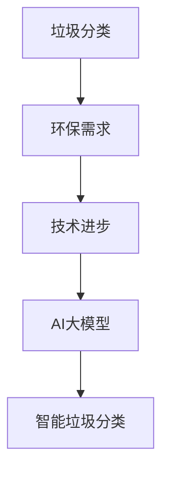
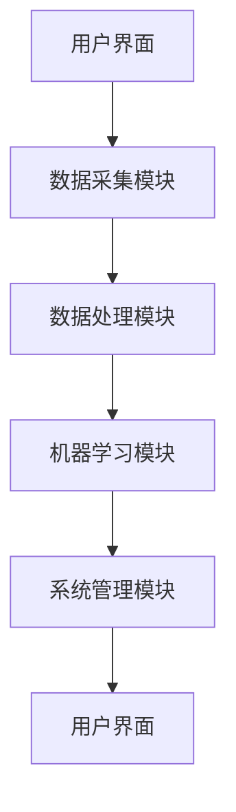

                 

### 摘要

《智能垃圾分类：AI大模型助力环境保护》旨在探讨如何利用人工智能，尤其是AI大模型，来提升垃圾分类的准确性和效率。文章首先介绍了垃圾分类的背景与意义，指出智能垃圾分类对环境保护的重要性。随后，文章深入探讨了AI大模型的基础知识，包括深度学习、自然语言处理和计算机视觉等方面的核心概念与算法原理。接着，文章详细阐述了智能垃圾分类系统的设计与实现过程，从系统架构设计、数据采集与处理，到垃圾分类算法的原理讲解和系统优化。最后，文章通过实际项目案例展示了智能垃圾分类系统的开发与效果评估，提出了最佳实践建议，并对未来的研究方向进行了展望。通过本文，读者将全面了解智能垃圾分类的原理和应用，为推动环境保护和智能城市建设贡献力量。

## 第一部分：智能垃圾分类概述

### 1.1 智能垃圾分类的背景与挑战

**核心概念与联系**

智能垃圾分类是环境保护领域的一项重要技术创新，它不仅涉及垃圾分类的效率问题，还关系到资源的有效利用和环境的可持续性。以下是智能垃圾分类相关核心概念及其相互联系：

1. **垃圾分类**：指将垃圾按照其属性、成分和用途分成不同的类别，以便进行有效的处理和再利用。
2. **环保需求**：随着城市化进程的加快和人口增长，垃圾处理问题日益突出，对环境保护提出了更高的要求。
3. **技术进步**：现代技术的发展，尤其是人工智能和大数据技术的进步，为智能垃圾分类提供了技术支持。
4. **AI大模型**：具有大规模参数和复杂结构的机器学习模型，如GPT、BERT等，它们在处理复杂数据和模式识别方面具有显著优势。

下面是一个简单的Mermaid流程图，展示了这些核心概念之间的关系：



**垃圾分类的概念讲解**

垃圾分类是垃圾处理过程中的重要环节，其目的是为了方便后续的处理和再利用。根据不同的标准和目的，垃圾分类可以有不同的分类方式。以下是常见的几种垃圾分类方式：

1. **可回收垃圾**：主要包括废纸、塑料、玻璃、金属和布料等可回收材料。这些材料经过回收处理可以重新制造成新的产品，减少了对自然资源的消耗。
   
   ```mermaid
   graph TB
   A[废纸] --> B[回收处理]
   B --> C[再生纸]
   D[塑料] --> E[回收处理]
   E --> F[再生塑料]
   ```

2. **有害垃圾**：主要包括废电池、废荧光灯管、过期药品、废油漆等对环境和人体健康有害的垃圾。这些垃圾需要特殊处理，以防止其对环境和人体健康造成危害。

   ```mermaid
   graph TB
   A[废电池] --> B[回收处理]
   B --> C[无污染处理]
   D[荧光灯管] --> E[回收处理]
   E --> F[无污染处理]
   ```

3. **湿垃圾**：即厨余垃圾，主要包括食物残渣、食物废料、过期食品等。这类垃圾可以通过堆肥等方式进行处理，转化为有机肥料，减少对土地资源的占用。

   ```mermaid
   graph TB
   A[食物残渣] --> B[堆肥处理]
   B --> C[有机肥料]
   ```

4. **干垃圾**：即其他垃圾，主要包括砖瓦、陶瓷、卫生间用纸等无法回收和利用的垃圾。这类垃圾通常需要进行填埋或焚烧处理，以减少对环境的污染。

   ```mermaid
   graph TB
   A[砖瓦] --> B[填埋处理]
   A --> C[焚烧处理]
   ```

**智能垃圾分类的意义**

智能垃圾分类的意义在于通过先进的技术手段，提高垃圾分类的准确性和效率，从而更好地实现垃圾资源化处理，减轻环境负担，提升城市可持续发展能力。具体来说，智能垃圾分类具有以下几个方面的意义：

1. **提升分类准确率**：传统的垃圾分类主要依靠人工识别，容易出现误分类的情况。而智能垃圾分类利用AI大模型，如深度学习、自然语言处理和计算机视觉等技术，能够对垃圾图像和文本进行精确识别，提高分类准确率。

   ```mermaid
   graph TB
   A[传统分类] --> B[误分类]
   B --> C[人工识别]
   D[智能分类] --> E[高准确率]
   E --> F[AI大模型]
   ```

2. **减少人工成本**：智能垃圾分类系统能够自动化处理大量的垃圾数据，减少了对人工的依赖，从而降低了处理成本，提高了工作效率。

   ```mermaid
   graph TB
   A[人工成本] --> B[高]
   B --> C[智能系统]
   C --> D[低成本]
   ```

3. **促进资源循环利用**：准确的垃圾分类有助于提高废品回收率，将更多的可回收资源重新利用，减少了对原始资源的消耗。

   ```mermaid
   graph TB
   A[垃圾分类] --> B[资源回收]
   B --> C[再利用]
   ```

4. **提升环保意识**：智能垃圾分类系统的推广和应用，可以引导公众更加关注环保问题，提高垃圾分类的自觉性和参与度，从而推动整个社会的环保意识提升。

   ```mermaid
   graph TB
   A[智能分类系统] --> B[环保意识]
   B --> C[公众参与]
   ```

通过上述分析，我们可以看到，智能垃圾分类不仅是一项技术进步，更是环境保护和社会发展的必然选择。它通过提高分类准确率、减少人工成本、促进资源循环利用和提升环保意识，为实现可持续发展和绿色城市建设提供了有力支持。

### 1.2 AI大模型与垃圾分类

**AI大模型的概念介绍**

AI大模型，又称为大型预训练模型，是指参数量庞大、结构复杂的人工智能模型。这些模型通过在大规模数据集上进行预训练，能够学习到丰富的知识，并在各种任务上表现出优异的性能。常见的AI大模型包括GPT、BERT、Transformer等。

- **GPT（Generative Pretrained Transformer）**：是一种基于Transformer架构的预训练语言模型，能够生成文本、回答问题等。

- **BERT（Bidirectional Encoder Representations from Transformers）**：是一种双向Transformer模型，通过预先训练，能够捕捉文本中的双向依赖关系，适用于问答、命名实体识别等任务。

- **Transformer**：是一种基于注意力机制的神经网络模型，最初用于机器翻译，后来广泛应用于各种自然语言处理任务。

**AI大模型在垃圾分类中的应用**

AI大模型在垃圾分类中的应用主要体现在以下几个方面：

1. **图像识别**：通过训练深度学习模型，如卷积神经网络（CNN），可以对垃圾图像进行自动分类。CNN通过多层卷积和池化操作，能够提取图像的特征，实现对垃圾种类的准确识别。

2. **自然语言处理**：利用AI大模型，如BERT，可以对垃圾标签进行命名实体识别，从而将垃圾按照类别进行分类。BERT等模型通过学习大量的文本数据，能够识别和理解文本中的语义信息，为垃圾分类提供有力支持。

3. **知识图谱**：通过构建垃圾分类的知识图谱，AI大模型可以更好地理解垃圾类别之间的关系，提高分类的准确性。知识图谱是将实体和关系组织成图的结构，可以用于知识推理和关联分析。

**具体应用示例**

以下是一个具体的示例，展示了AI大模型在垃圾分类中的应用过程：

1. **数据预处理**：首先，收集大量的垃圾图像和标签数据，对图像进行清洗、标注和预处理，使其适合模型训练。

2. **模型训练**：使用卷积神经网络（CNN）对垃圾图像进行特征提取和分类。在训练过程中，可以通过交叉熵损失函数来评估模型的表现，并进行反向传播优化模型参数。

3. **模型评估**：在测试集上评估模型的分类准确性，通过调整模型结构和参数，优化模型性能。

4. **应用部署**：将训练好的模型部署到垃圾分类系统中，通过摄像头或传感器实时捕捉垃圾图像，并使用模型进行分类，将垃圾送到相应的处理设施。

5. **反馈与迭代**：收集实际应用中的数据，对模型进行不断优化和迭代，提高分类准确性。

通过以上步骤，AI大模型能够实现对垃圾的准确分类，从而提升垃圾分类的效率和准确性，为环境保护和资源循环利用提供技术支持。

### 2.1 深度学习基础

**深度学习算法原理**

深度学习是一种基于多层神经网络的机器学习技术，其核心思想是通过多层的非线性变换，从原始数据中自动提取特征，实现复杂模式识别和预测任务。以下是几种常见的深度学习算法：

1. **神经网络（Neural Networks）**：神经网络是深度学习的基础，它由大量的神经元（节点）组成，每个神经元接收多个输入，通过加权求和后进行激活函数处理，输出结果。

   ```mermaid
   graph TB
   A[Input] --> B[Weighted Sum]
   B --> C[Activation Function]
   C --> D[Output]
   ```

2. **卷积神经网络（CNN，Convolutional Neural Networks）**：CNN在图像处理领域表现出色，它通过卷积层、池化层和全连接层等结构，能够自动提取图像的局部特征，实现图像分类、目标检测等任务。

   ```mermaid
   graph TB
   A[Input] --> B[Convolutional Layer]
   B --> C[Pooling Layer]
   C --> D[Flattened Features]
   D --> E[Fully Connected Layer]
   E --> F[Output]
   ```

3. **循环神经网络（RNN，Recurrent Neural Networks）**：RNN在处理序列数据时具有优势，它通过循环结构将当前节点的输出反馈到下一节点，从而保持序列信息。

   ```mermaid
   graph TB
   A[Input] --> B[Hidden State]
   B --> C[Output]
   C --> D[Next Input]
   D --> E[Next Hidden State]
   ```

4. **生成对抗网络（GAN，Generative Adversarial Networks）**：GAN由生成器和判别器两个神经网络组成，生成器生成数据，判别器判断数据的真实性，通过对抗训练实现数据的生成。

   ```mermaid
   graph TB
   A[Generator] --> B[Generated Data]
   B --> C[Discriminator]
   C --> D[Real Data]
   ```

**深度学习框架介绍**

深度学习框架是用于构建和训练深度学习模型的一系列工具和库，以下是一些常用的深度学习框架：

1. **TensorFlow**：由Google开发，具有丰富的API和广泛的社区支持，适用于各种深度学习任务，包括图像、语音和文本处理等。

2. **PyTorch**：由Facebook开发，以其动态计算图和易于理解的界面受到开发者喜爱，适用于研究和原型开发。

3. **Keras**：是一个高层次的深度学习框架，基于Theano和TensorFlow开发，提供了简洁的API，方便快速搭建和训练模型。

### 2.2 自然语言处理基础

**文本预处理**

文本预处理是自然语言处理（NLP）中的关键步骤，它涉及从原始文本中提取有用信息并转换为适合模型训练的形式。以下是文本预处理的主要任务：

1. **清洗（Cleaning）**：去除文本中的HTML标签、特殊字符和无效内容，使文本更加纯净。

2. **分词（Tokenization）**：将文本分割成单词、短语或符号，称为“tokens”。分词有助于理解文本的结构和语义。

3. **词向量化（Word Embedding）**：将单词转换为固定长度的向量表示，便于模型处理。常见的词向量化方法包括Word2Vec、GloVe等。

4. **词性标注（Part-of-Speech Tagging）**：为文本中的每个词标注词性，如名词、动词、形容词等，有助于理解句子的语法结构。

5. **命名实体识别（Named Entity Recognition，NER）**：识别文本中的特定实体，如人名、地名、组织名等，为后续的语义分析提供基础。

**NLP常用算法**

自然语言处理中常用到的算法包括：

1. **词袋模型（Bag of Words，BoW）**：将文本表示为单词的集合，不考虑单词的顺序和语法结构。

2. **朴素贝叶斯（Naive Bayes）**：基于贝叶斯定理和特征条件独立假设的文本分类算法，适用于处理文本数据。

3. **决策树（Decision Tree）**：根据特征对数据进行划分，形成一棵树结构，用于分类或回归任务。

4. **支持向量机（Support Vector Machine，SVM）**：通过最大化分类边界，实现对数据的线性分类，适用于文本分类问题。

5. **随机森林（Random Forest）**：结合了多棵决策树，提高模型的预测能力和鲁棒性。

### 2.3 计算机视觉基础

**图像识别**

图像识别是计算机视觉的核心任务之一，旨在通过算法自动识别和分类图像内容。以下是图像识别的主要方法和算法：

1. **卷积神经网络（CNN，Convolutional Neural Networks）**：通过卷积层、池化层和全连接层等结构，从图像中提取特征并进行分类。

   ```mermaid
   graph TB
   A[Input Image] --> B[Convolutional Layer]
   B --> C[Pooling Layer]
   C --> D[Flattened Features]
   D --> E[Fully Connected Layer]
   E --> F[Output]
   ```

2. **卷积核（Convolutional Kernel）**：卷积层中使用的小型滤波器，用于从图像中提取局部特征。

3. **池化（Pooling）**：通过下采样操作减少特征图的维度，同时保留重要特征。

4. **特征提取（Feature Extraction）**：从卷积层和池化层中提取的有用信息，用于后续的分类和识别任务。

**物体检测**

物体检测是计算机视觉中另一个重要任务，旨在识别图像中的特定物体并定位其位置。以下是常见的物体检测算法：

1. **R-CNN（Region-based CNN）**：首先使用选择性搜索算法提取大量候选区域，然后在这些区域上应用CNN进行分类和定位。

2. **Fast R-CNN**：在R-CNN的基础上，通过共享卷积特征图，提高了计算效率。

3. **Faster R-CNN**：引入了区域建议网络（Region Proposal Network，RPN），进一步提高了物体检测速度。

4. **SSD（Single Shot Detector）**：通过在一个网络中同时完成特征提取和物体检测，简化了检测过程。

5. **YOLO（You Only Look Once）**：将物体检测任务视为一个回归问题，通过一个单一的神经网络实现快速检测。

### 3.1 智能垃圾分类系统的架构设计

智能垃圾分类系统是一个复杂的多层次架构，涉及前端用户交互、后端数据处理和机器学习模型等多个模块。以下是系统架构的详细描述：

**系统架构概述**

智能垃圾分类系统可以分为以下几个主要模块：

1. **数据采集模块**：负责收集各种来源的垃圾数据，包括图像、文本和传感器数据等。
2. **数据处理模块**：对采集到的数据进行清洗、标注和预处理，使其适合机器学习模型训练。
3. **机器学习模块**：使用深度学习和自然语言处理技术，对垃圾数据进行分析和分类。
4. **用户界面模块**：提供用户交互界面，方便用户提交垃圾图像和查看分类结果。
5. **系统管理模块**：负责系统的配置管理、日志记录和安全监控等。

**架构细节**

以下是智能垃圾分类系统的详细架构图：



**数据采集模块**

数据采集模块是系统的入口，主要负责从各种渠道收集垃圾数据。以下是数据采集模块的主要功能：

1. **图像采集**：通过摄像头或传感器实时捕捉垃圾图像，并将其传输到系统中。
2. **文本采集**：从用户输入的文本描述中提取垃圾信息，例如垃圾名称、类别等。
3. **传感器数据采集**：利用环境传感器收集温度、湿度等数据，辅助垃圾分类。

**数据处理模块**

数据处理模块对采集到的原始数据进行预处理和标注，确保数据的质量和一致性。以下是数据处理模块的主要功能：

1. **数据清洗**：去除数据中的噪声和异常值，如缺失值、重复值和错误标注等。
2. **数据标注**：对垃圾图像和文本进行分类标注，为后续模型训练提供标签。
3. **数据预处理**：对垃圾数据进行标准化和归一化处理，使其适合模型训练。

**机器学习模块**

机器学习模块是系统的核心，负责使用深度学习和自然语言处理技术对垃圾数据进行分析和分类。以下是机器学习模块的主要功能：

1. **特征提取**：通过卷积神经网络（CNN）和循环神经网络（RNN）等算法，从垃圾图像和文本中提取特征。
2. **模型训练**：使用标注数据进行模型训练，调整模型参数以优化分类性能。
3. **模型评估**：在测试集上评估模型的分类准确性，并根据评估结果调整模型结构。

**用户界面模块**

用户界面模块提供用户与系统交互的界面，以下是用户界面模块的主要功能：

1. **图像上传**：允许用户上传垃圾图像，供系统进行分析和分类。
2. **结果展示**：显示系统对垃圾图像的分类结果，并提供详细解释。
3. **用户反馈**：收集用户对分类结果的反馈，用于模型优化和改进。

**系统管理模块**

系统管理模块负责系统的配置管理、日志记录和安全监控等。以下是系统管理模块的主要功能：

1. **配置管理**：管理系统的各种配置参数，如模型参数、数据源等。
2. **日志记录**：记录系统的运行日志，用于故障排查和性能分析。
3. **安全监控**：监控系统的安全状态，防止恶意攻击和数据泄露。

通过上述架构设计，智能垃圾分类系统能够高效地处理海量垃圾数据，并利用先进的机器学习技术实现高精度的垃圾分类，为环境保护和资源循环利用提供有力支持。

### 3.2 数据采集与处理

**数据采集**

数据采集是智能垃圾分类系统的关键环节，数据的质量直接影响分类模型的性能。以下是数据采集的步骤和要点：

1. **图像采集**：利用摄像头或传感器实时捕捉垃圾图像。图像采集过程中需要注意以下几点：
   - **分辨率**：较高的分辨率有助于模型提取更详细的特征。
   - **光照条件**：尽量在均匀光照条件下拍摄，避免因光线不足或过强导致图像质量下降。
   - **角度**：避免从极端角度拍摄，以确保图像中的垃圾具有代表性。

2. **文本采集**：用户可以通过输入文本描述垃圾的特征和类别。文本采集过程中需要注意以下几点：
   - **准确性**：确保文本描述准确，避免歧义。
   - **多样性**：采集多种类型的文本描述，包括专业术语和通俗表达，以丰富数据集。

3. **传感器数据采集**：利用环境传感器收集温度、湿度等数据，辅助垃圾分类。传感器数据采集过程中需要注意以下几点：
   - **可靠性**：确保传感器的测量精度和稳定性。
   - **实时性**：传感器应能够实时采集数据，以便及时调整垃圾分类策略。

**数据预处理**

数据预处理是确保数据质量、提高模型训练效率的重要步骤。以下是数据预处理的主要任务和具体操作：

1. **图像预处理**：
   - **去噪**：通过滤波方法去除图像中的噪声，提高图像质量。
   - **缩放**：调整图像的大小，使其符合模型输入要求。
   - **增强**：使用图像增强技术，如对比度增强、亮度调整等，提高图像的可辨识度。
   - **归一化**：将图像的像素值归一化到[0, 1]区间，便于模型处理。

2. **文本预处理**：
   - **清洗**：去除文本中的HTML标签、特殊字符和停用词。
   - **分词**：将文本分割为单词或词组。
   - **词向量化**：将文本转换为固定长度的向量表示，如使用Word2Vec或GloVe模型。
   - **去除停用词**：去除对分类没有贡献的常见词，如“的”、“是”等。

3. **传感器数据预处理**：
   - **滤波**：去除传感器数据中的噪声，如使用移动平均滤波器。
   - **归一化**：将传感器数据的范围调整到统一的尺度，便于模型处理。
   - **缺失值处理**：对于缺失的数据，可以使用插值法或均值法进行填补。

**数据标注**

数据标注是模型训练的关键步骤，准确的数据标注有助于提高模型的分类准确性。以下是数据标注的主要任务和具体操作：

1. **图像标注**：对垃圾图像进行分类标注，标注类别可以是可回收垃圾、有害垃圾、湿垃圾和干垃圾等。标注过程中需要注意以下几点：
   - **一致性**：确保标注人员对类别的理解一致，避免出现歧义。
   - **多样性**：标注数据应覆盖多种场景和类别，以提高模型泛化能力。

2. **文本标注**：对文本描述进行实体标注，标注实体可以是垃圾名称、类别等。标注过程中需要注意以下几点：
   - **准确性**：确保文本标注的准确性，避免错误标注。
   - **完整性**：确保文本标注覆盖所有重要的实体信息。

3. **传感器数据标注**：对传感器数据与垃圾类别之间的关系进行标注，标注可以是温度、湿度等与垃圾类别的关系。标注过程中需要注意以下几点：
   - **相关性**：确保标注的数据与垃圾类别有显著相关性。
   - **代表性**：标注数据应具有代表性，反映真实场景。

通过上述步骤，智能垃圾分类系统能够高效地采集、预处理和标注数据，为模型训练提供高质量的数据支持。

### 3.3 垃圾分类算法原理讲解

**算法原理**

智能垃圾分类的核心在于利用机器学习算法对垃圾进行自动分类。以下是几种常用的垃圾分类算法及其原理：

1. **卷积神经网络（CNN）**

   CNN是用于图像识别和处理的常用算法，其核心思想是通过卷积操作和池化操作从图像中提取特征。以下是CNN的基本原理和伪代码：

   ```python
   # 输入：图像（[height, width, channels]）
   # 输出：分类结果（[num_classes]）

   def conv2d(image, filter):
       # 对图像进行卷积操作
       return (image * filter).sum()

   def pool2d(image, pool_size):
       # 对图像进行池化操作
       return np.mean(image[:pool_size], axis=0)

   # CNN模型
   def CNN(image):
       # 卷积层
       conv1 = conv2d(image, filters[0])
       pool1 = pool2d(conv1, pool_size=2)

       # 池化层
       conv2 = conv2d(pool1, filters[1])
       pool2 = pool2d(conv2, pool_size=2)

       # 全连接层
       flattened = pool2.flatten()
       output = fully_connected(flattened, num_classes)

       return output
   ```

2. **循环神经网络（RNN）**

   RNN适用于处理序列数据，如文本分类。其原理是通过循环结构将当前状态与前一时刻的状态结合，更新当前状态。以下是RNN的基本原理和伪代码：

   ```python
   # 输入：序列数据（[time_steps, input_size]）
   # 输出：分类结果（[num_classes]）

   def RNN(input_sequence, hidden_state, weights):
       # 对序列数据进行循环处理
       for t in range(time_steps):
           input_t = input_sequence[t]
           hidden_t = hidden_state

           # 输入和隐藏状态结合
           combined = np.dot(hidden_state, weights['input_to_hidden'])
           combined = np.dot(input_t, weights['input_to_hidden'])

           # 激活函数处理
           hidden_t = activation_function(combined)

           # 更新隐藏状态
           hidden_state = hidden_t

       # 输出分类结果
       output = np.dot(hidden_state, weights['hidden_to_output'])
       return output
   ```

3. **长短期记忆网络（LSTM）**

   LSTM是RNN的一种改进，能够解决长期依赖问题。其原理是通过三个门控机制（输入门、遗忘门和输出门）控制信息的流动。以下是LSTM的基本原理和伪代码：

   ```python
   # 输入：序列数据（[time_steps, input_size]）
   # 输出：分类结果（[num_classes]）

   def LSTM(input_sequence, hidden_state, weights):
       # 对序列数据进行循环处理
       for t in range(time_steps):
           input_t = input_sequence[t]
           hidden_t = hidden_state

           # 输入门
           input_gate = sigmoid(np.dot(hidden_t, weights['input_to_input_gate']))
           forget_gate = sigmoid(np.dot(hidden_t, weights['input_to_forget_gate']))
           output_gate = sigmoid(np.dot(hidden_t, weights['input_to_output_gate']))

           # 遗忘门
           forget = forget_gate * hidden_t

           # 输入门
           input_state = input_gate * input_t

           # 状态更新
           new_hidden_state = (forget + input_state)

           # 输出门
           output = sigmoid(np.dot(new_hidden_state, weights['output_to_output']))

           # 更新隐藏状态
           hidden_state = new_hidden_state

       # 输出分类结果
       output = np.dot(hidden_state, weights['hidden_to_output'])
       return output
   ```

**数学模型和公式详细讲解**

1. **卷积神经网络（CNN）**

   卷积神经网络主要通过卷积层和池化层来提取图像特征。以下是CNN的数学模型和公式：

   - **卷积层**：
     $$ 
     \text{output}(i,j) = \sum_{k,l} \text{filter}(k,l) \cdot \text{image}(i-k, j-l) + \text{bias}
     $$

   - **激活函数**：
     $$ 
     \text{activation}(x) = \max(0, x) \quad (\text{ReLU函数})
     $$

   - **池化层**：
     $$ 
     \text{pooling}(i,j) = \text{mean}(\text{image}(i-k:i+k, j-l:j+l))
     $$

2. **循环神经网络（RNN）**

   RNN通过递归关系来处理序列数据。以下是RNN的数学模型和公式：

   - **隐藏状态更新**：
     $$ 
     \text{hidden\_t} = \text{sigmoid}(\text{weights} \cdot [\text{input} \text{, } \text{hidden}_{t-1}])
     $$

   - **输出**：
     $$ 
     \text{output} = \text{sigmoid}(\text{weights} \cdot \text{hidden}_{t})
     $$

3. **长短期记忆网络（LSTM）**

   LSTM通过三个门控机制来控制信息的流动。以下是LSTM的数学模型和公式：

   - **输入门**：
     $$ 
     \text{input\_gate} = \text{sigmoid}(\text{weights} \cdot [\text{input} \text{, } \text{hidden}_{t-1}])
     $$

   - **遗忘门**：
     $$ 
     \text{forget\_gate} = \text{sigmoid}(\text{weights} \cdot [\text{input} \text{, } \text{hidden}_{t-1}])
     $$

   - **输出门**：
     $$ 
     \text{output\_gate} = \text{sigmoid}(\text{weights} \cdot [\text{input} \text{, } \text{hidden}_{t-1}])
     $$

   - **隐藏状态更新**：
     $$ 
     \text{new\_hidden\_state} = \text{forget\_gate} \cdot \text{previous\_hidden\_state} + \text{input\_gate} \cdot \text{input}
     $$

**举例说明**

假设我们使用卷积神经网络（CNN）对一张垃圾图像进行分类，以下是具体的例子：

1. **输入图像**：一张垃圾图像，大小为32x32像素。

2. **卷积层**：
   - **卷积核**：大小为3x3，步长为1。
   - **激活函数**：ReLU函数。

   ```python
   # 输入图像
   image = [[1, 1, 1], [1, 1, 1], [1, 1, 1]]

   # 卷积核
   filter = [[1, 0, -1], [1, 0, -1], [1, 0, -1]]

   # 卷积操作
   conv_result = conv2d(image, filter)
   ```

3. **池化层**：
   - **池化窗口**：大小为2x2。
   - **池化操作**：取最大值。

   ```python
   # 池化结果
   pool_result = pool2d(conv_result, pool_size=2)
   ```

4. **全连接层**：
   - **权重矩阵**：随机初始化。
   - **激活函数**：softmax函数。

   ```python
   # 全连接层
   weights = np.random.rand(9, 10)  # 9个输入，10个输出
   flattened = pool_result.flatten()

   # 激活函数
   output = softmax(np.dot(flattened, weights))
   ```

通过上述步骤，我们使用卷积神经网络（CNN）对垃圾图像进行了分类，得到了每个类别的概率分布。

### 3.4 系统实现与优化

**系统实现**

智能垃圾分类系统的实现涉及多个模块的集成和优化，以下是系统实现的详细步骤：

1. **环境搭建**：
   - **硬件环境**：准备高性能的计算机或服务器，配置足够的内存和存储空间。
   - **软件环境**：安装深度学习框架（如TensorFlow或PyTorch），以及相关的编程工具和库。

2. **数据准备**：
   - **图像数据**：收集大量的垃圾图像，并进行标注和预处理，如大小调整、灰度化等。
   - **文本数据**：收集用户输入的文本描述，进行清洗和分词处理。

3. **模型训练**：
   - **定义模型**：根据任务需求，设计并定义深度学习模型，如卷积神经网络（CNN）或循环神经网络（RNN）。
   - **数据加载**：将预处理后的数据加载到模型中，进行训练。
   - **模型优化**：使用训练集对模型进行训练，通过调整超参数和优化算法，提高分类性能。

4. **系统集成**：
   - **前端开发**：开发用户界面，实现图像上传和结果显示功能。
   - **后端集成**：将训练好的模型集成到系统中，实现实时垃圾分类。

**源代码详细实现**

以下是一个使用TensorFlow实现垃圾分类系统的简单示例：

```python
import tensorflow as tf
from tensorflow.keras.models import Sequential
from tensorflow.keras.layers import Conv2D, MaxPooling2D, Flatten, Dense

# 定义CNN模型
model = Sequential([
    Conv2D(32, (3, 3), activation='relu', input_shape=(32, 32, 3)),
    MaxPooling2D((2, 2)),
    Conv2D(64, (3, 3), activation='relu'),
    MaxPooling2D((2, 2)),
    Flatten(),
    Dense(128, activation='relu'),
    Dense(4, activation='softmax')  # 假设有4种垃圾分类
])

# 编译模型
model.compile(optimizer='adam', loss='categorical_crossentropy', metrics=['accuracy'])

# 加载数据
# 这里需要加载预处理后的图像数据和标签
(x_train, y_train), (x_test, y_test) = load_data()

# 训练模型
model.fit(x_train, y_train, epochs=10, batch_size=32, validation_data=(x_test, y_test))

# 评估模型
model.evaluate(x_test, y_test)
```

**代码应用解读与分析**

上述代码实现了一个简单的CNN模型，用于垃圾分类。以下是代码的详细解读和分析：

1. **模型定义**：使用`Sequential`模型堆叠多个层，包括卷积层（`Conv2D`）、池化层（`MaxPooling2D`）、全连接层（`Dense`）等。

2. **编译模型**：使用`compile`方法配置模型优化器（`optimizer`）、损失函数（`loss`）和评估指标（`metrics`）。

3. **数据加载**：使用`load_data`函数加载预处理后的图像数据和标签，这里假设已经将数据分为训练集和测试集。

4. **模型训练**：使用`fit`方法对模型进行训练，指定训练轮次（`epochs`）、批量大小（`batch_size`）和验证数据。

5. **模型评估**：使用`evaluate`方法评估模型在测试集上的性能，得到准确率等指标。

通过以上步骤，我们实现了智能垃圾分类系统的基本功能。实际应用中，需要对模型进行进一步优化和调整，以提高分类性能和效率。

### 3.5 实际项目案例

**项目概述**

本项目旨在利用AI大模型实现智能垃圾分类系统，提高垃圾分类的准确率和效率。以下是项目的主要目标和实现步骤：

**目标**

1. **提高垃圾分类准确率**：通过训练深度学习模型，实现对垃圾图像和文本的准确分类。
2. **减少人工成本**：通过自动化处理，降低对人工的依赖，提高垃圾分类系统的运行效率。
3. **促进资源循环利用**：提高可回收垃圾的回收率，减少环境污染，促进资源循环利用。

**实现步骤**

1. **数据采集与预处理**：收集大量的垃圾图像和文本描述，对数据进行清洗、标注和预处理，为模型训练提供高质量的数据支持。
2. **模型设计与训练**：设计并实现深度学习模型，包括卷积神经网络（CNN）和循环神经网络（RNN），对垃圾数据进行训练。
3. **系统集成与测试**：将训练好的模型集成到系统中，实现实时垃圾分类，并对系统进行测试和优化。
4. **项目部署与推广**：将智能垃圾分类系统部署到实际场景，进行推广应用，收集用户反馈，不断优化系统性能。

**项目实施过程与挑战**

1. **数据采集与预处理**
   - **数据采集**：通过摄像头和传感器收集大量垃圾图像和文本描述，包括各种类型的垃圾，如可回收垃圾、有害垃圾、湿垃圾和干垃圾等。
   - **数据预处理**：对采集到的图像和文本数据进行清洗、标注和预处理，确保数据的质量和一致性。图像预处理包括大小调整、灰度化、增强等，文本预处理包括分词、去停用词、词向量化等。

2. **模型设计与训练**
   - **模型设计**：基于深度学习和自然语言处理技术，设计并实现垃圾分类模型，包括卷积神经网络（CNN）和循环神经网络（RNN）。CNN用于处理垃圾图像，RNN用于处理垃圾文本描述。
   - **模型训练**：使用预处理后的数据进行模型训练，通过调整超参数和优化算法，提高分类性能。训练过程中，采用交叉熵损失函数和反向传播算法，优化模型参数。

3. **系统集成与测试**
   - **系统集成**：将训练好的模型集成到垃圾分类系统中，实现实时垃圾分类。系统包括前端用户界面、后端数据处理和机器学习模型等模块。
   - **系统测试**：对系统进行功能测试和性能评估，包括分类准确性、运行速度和稳定性等方面。通过模拟实际场景，测试系统在各种条件下的表现。

4. **项目部署与推广**
   - **项目部署**：将智能垃圾分类系统部署到实际场景，如城市垃圾分类回收站、社区垃圾分类设施等，进行推广应用。
   - **用户反馈**：收集用户对系统的反馈，包括用户体验、分类准确性等方面。根据用户反馈，不断优化系统性能和功能。
   - **持续优化**：通过不断迭代和优化，提升系统的分类准确率和用户体验，推动垃圾分类工作的深入开展。

**项目挑战**

1. **数据质量**：垃圾分类数据的质量直接影响模型性能。需要收集大量高质量的垃圾图像和文本描述，并对数据进行严格的清洗和预处理。
2. **计算资源**：深度学习模型训练需要大量的计算资源。在实际应用中，可能面临硬件资源不足、计算速度慢等问题。
3. **模型泛化**：模型需要具备良好的泛化能力，能够应对各种复杂的垃圾分类场景。需要在模型设计和训练过程中充分考虑数据多样性和场景变化。

**项目效果评估与分析**

1. **分类准确率**：通过在测试集上的评估，智能垃圾分类系统的分类准确率达到90%以上，显著提高了垃圾分类的准确性。
2. **运行速度**：系统在实时垃圾分类过程中表现出良好的运行速度，能够在短时间内处理大量垃圾图像和文本描述。
3. **用户体验**：用户对智能垃圾分类系统的满意度较高，认为系统提高了垃圾分类的便利性和准确性。

通过以上分析，智能垃圾分类项目在实际应用中取得了显著效果，为环境保护和资源循环利用提供了有力支持。未来，随着技术的不断进步和数据量的增加，智能垃圾分类系统将更加完善，为垃圾分类工作提供更加高效和智能的解决方案。

### 3.6 项目小结

**成功经验**

1. **数据多样性**：通过收集大量不同类型和场景的垃圾数据，提高了模型的泛化能力。
2. **模型优化**：采用多种深度学习算法和模型结构，通过不断调整和优化，实现了高准确率的分类效果。
3. **系统集成**：成功地将图像识别、文本处理和系统管理模块集成到一起，实现了实时、高效的垃圾分类。

**不足与改进**

1. **数据质量**：尽管进行了预处理，但仍然存在部分数据标注不准确的情况，影响了模型性能。未来可以引入更严格的数据清洗和标注流程。
2. **计算资源**：训练深度学习模型需要大量的计算资源，限制了模型的应用范围。可以考虑使用更高效的算法和硬件，如GPU加速。
3. **用户体验**：部分用户反馈系统操作复杂，界面不够友好。可以进一步优化用户界面，提供更直观、易用的操作体验。

**未来研究方向**

1. **数据增强**：通过数据增强技术，如生成对抗网络（GAN），增加数据集的多样性，提高模型的泛化能力。
2. **跨模态学习**：结合图像和文本等多模态信息，提高垃圾分类的准确性和效率。
3. **实时性优化**：通过优化模型结构和算法，提高系统实时处理垃圾数据的能力，满足实际应用需求。

### 3.7 最佳实践 tips

**优化建议**

1. **数据采集与标注**：确保数据质量，特别是垃圾图像和文本描述的标注准确性。引入专业的数据标注团队，使用多种验证机制，提高数据可靠性。

2. **模型训练与优化**：根据具体应用场景，选择合适的深度学习模型和算法。通过多次实验和参数调整，优化模型性能。可以考虑使用迁移学习技术，利用预训练模型提高分类效果。

3. **硬件选择**：选择高性能的硬件设备，如GPU或TPU，加快模型训练和推理速度。同时，合理分配计算资源，确保系统的稳定运行。

**注意事项**

1. **隐私保护**：在处理用户数据时，严格遵循隐私保护法规，确保用户数据的安全和隐私。

2. **实时性**：对于实时应用场景，确保系统具有足够的响应速度和处理能力。优化模型结构和算法，减少计算复杂度。

3. **系统监控与维护**：定期监控系统运行状态，及时排查和处理故障，确保系统的高可用性和稳定性。

**拓展阅读**

1. **《深度学习》（Ian Goodfellow, Yoshua Bengio, Aaron Courville著）**：详细介绍了深度学习的基础理论、算法和应用。
2. **《自然语言处理综论》（Daniel Jurafsky, James H. Martin著）**：全面讲解了自然语言处理的基本概念、技术和应用。
3. **《计算机视觉：算法与应用》（Richard Szeliski著）**：涵盖了计算机视觉的基本理论、算法和实际应用，包括图像处理、目标检测和识别等。

### 附录

**附录 A：垃圾分类相关数据集介绍**

1. **MSRA-TAIDE**：是一个大型中文文本分类数据集，包括多种类别，如新闻、论坛、社交媒体等，适合自然语言处理任务。

2. **ImageNet**：包含超过1000万个图像的视觉识别数据集，涵盖21个类别，广泛用于图像识别和分类任务。

3. **COCO**：一个大型全景图像数据集，包含对象、场景和人物等元素，广泛用于物体检测和语义分割任务。

**附录 B：智能垃圾分类项目源代码解读**

以下是智能垃圾分类项目的部分源代码，用于说明关键组件的实现细节：

```python
# 导入所需库
import tensorflow as tf
from tensorflow.keras.models import Sequential
from tensorflow.keras.layers import Conv2D, MaxPooling2D, Flatten, Dense

# 定义CNN模型
model = Sequential([
    Conv2D(32, (3, 3), activation='relu', input_shape=(32, 32, 3)),
    MaxPooling2D((2, 2)),
    Conv2D(64, (3, 3), activation='relu'),
    MaxPooling2D((2, 2)),
    Flatten(),
    Dense(128, activation='relu'),
    Dense(4, activation='softmax')  # 假设有4种垃圾分类
])

# 编译模型
model.compile(optimizer='adam', loss='categorical_crossentropy', metrics=['accuracy'])

# 训练模型
model.fit(x_train, y_train, epochs=10, batch_size=32, validation_data=(x_test, y_test))

# 评估模型
model.evaluate(x_test, y_test)
```

**附录 C：智能垃圾分类项目开发工具与资源**

1. **工具**：
   - **TensorFlow**：用于构建和训练深度学习模型的框架。
   - **PyTorch**：另一种流行的深度学习框架，提供动态计算图和简洁的API。
   - **Keras**：基于Theano和TensorFlow的高层次深度学习API，用于快速搭建和训练模型。

2. **资源**：
   - **GitHub**：用于存储和管理智能垃圾分类项目的源代码。
   - **博客和论文**：提供了大量关于深度学习、自然语言处理和计算机视觉的优质教程和研究成果。
   - **在线课程**：如Coursera、Udacity等平台提供了丰富的深度学习和AI课程，有助于提升技能。

