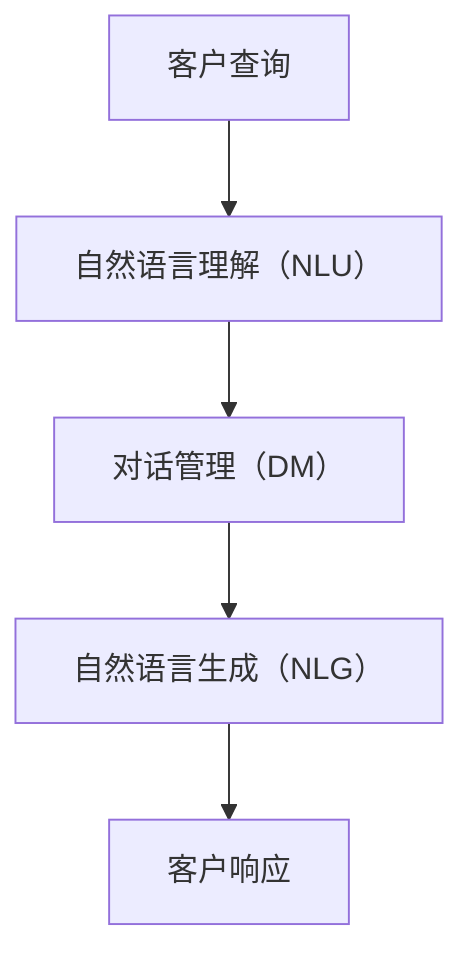
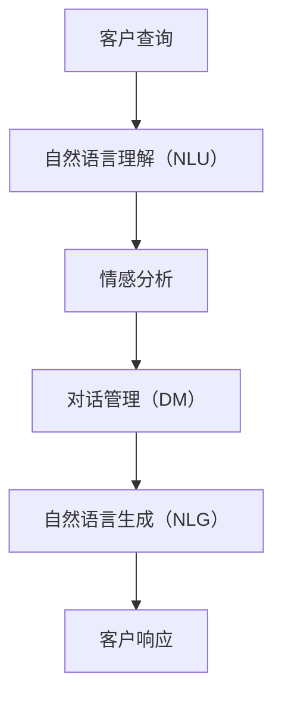

                 

### 文章标题

# 智能客服革命：AI大模型改变服务业

### 文章关键词

- 智能客服
- AI大模型
- 服务业
- 机器学习
- 自然语言处理
- 情感分析

### 摘要

在数字化和智能化的时代背景下，智能客服已经成为企业提高服务质量、降低运营成本的重要工具。本文将深入探讨AI大模型在智能客服中的应用，通过背景介绍、核心概念与联系、算法原理讲解、数学模型和公式、项目实战等多个方面，全面解析AI大模型如何革命性地改变服务业。文章将首先概述智能客服的发展历程及其在当今商业环境中的重要性，然后逐步探讨AI大模型的定义和核心技术，接着通过实际案例展示其在智能客服中的具体应用，最后展望智能客服的未来发展趋势和挑战。

## 目录

1. **智能客服革命：AI大模型改变服务业**
    1.1 关键词
    1.2 摘要

2. **背景介绍**
    2.1 智能客服的起源与发展
    2.2 智能客服在商业环境中的应用

3. **核心概念与联系**
    3.1 人工智能与机器学习基础
    3.2 AI大模型架构详解
    3.3 Mermaid流程图展示

4. **AI大模型核心技术解析**
    4.1 深度学习基本原理
    4.2 自然语言处理（NLP）
    4.3 情感分析与智能推荐

5. **AI大模型在智能客服中的应用**
    5.1 智能对话系统的构建
    5.2 自然语言处理（NLP）应用
    5.3 情感分析与智能推荐

6. **项目实战**
    6.1 开发环境搭建
    6.2 源代码实现与解读
    6.3 代码应用解读与分析
    6.4 实际案例分析与讲解

7. **优化与评估**
    7.1 优化策略
    7.2 评估方法
    7.3 案例分析

8. **未来展望**
    8.1 发展趋势
    8.2 技术挑战与应对策略
    8.3 展望未来

9. **结语与展望**
    9.1 全书总结
    9.2 拓展阅读
    9.3 注意事项

## 背景介绍

### 智能客服的起源与发展

智能客服是指利用人工智能技术，如机器学习、自然语言处理（NLP）等，模拟人类与客户之间的交互过程，提供高效、便捷的咨询服务。智能客服的发展可以追溯到20世纪90年代，当时互联网的普及使得企业开始探索通过在线渠道与客户互动。早期的智能客服主要采用规则驱动的方式，即预先编写一套规则来处理常见的客户问题。

随着计算能力的提升和算法的进步，智能客服逐渐从规则驱动转向基于机器学习的方法。这一转变标志着智能客服进入了一个新的发展阶段。现代智能客服系统通常包含多个模块，如自然语言理解（NLU）、对话管理（DM）和自然语言生成（NLG），这些模块协同工作，以提供更加智能化和个性化的客户服务。

### 智能客服在商业环境中的应用

智能客服在商业环境中扮演着越来越重要的角色。首先，它能够大幅降低企业的运营成本。传统的客服方式往往需要大量人力投入，而智能客服系统能够自动处理大量客户请求，从而减少人力资源的需求。其次，智能客服能够提供24/7全天候服务，确保客户在任何时间都能获得即时响应，提高客户满意度。

此外，智能客服还能够收集和分析客户交互数据，通过数据挖掘和机器学习算法，为企业提供有价值的客户洞察，帮助企业更好地了解客户需求，优化产品和服务。例如，通过分析客户问题的频率和类型，企业可以发现产品或服务的缺陷，从而进行改进。

### 当前智能客服面临的问题与挑战

尽管智能客服在商业应用中展现出诸多优势，但它仍然面临一些问题与挑战。首先，自然语言理解和处理仍是一个复杂的问题。尽管AI技术取得了显著进展，但目前的智能客服系统在理解复杂、模糊或模糊不清的语言表述方面仍然存在困难。

其次，个性化服务的实现也是一个挑战。为了提供个性化的服务，智能客服系统需要深入理解每个客户的偏好和行为模式，这要求系统具备强大的数据分析和处理能力。然而，在现实应用中，数据隐私和安全问题往往成为限制因素。

最后，智能客服的集成和部署也是一个复杂的过程。企业需要在现有的技术基础设施上集成智能客服系统，这需要大量的技术支持和调试。同时，不同系统和平台之间的兼容性问题也需要解决。

## 核心概念与联系

### 人工智能与机器学习基础

人工智能（AI）是指模拟人类智能行为的技术，而机器学习（ML）是AI的一个重要分支。机器学习通过算法和统计模型从数据中学习规律，从而进行预测或决策。在智能客服中，机器学习被广泛用于处理客户查询、理解客户意图、生成回答等任务。

### AI大模型架构详解

AI大模型通常是指具有大规模参数的深度学习模型，如Transformer、BERT等。这些模型在训练过程中能够从大量数据中提取复杂的特征和模式。在智能客服中，AI大模型被用于构建对话系统，实现自然语言理解、对话管理和生成回答等功能。

### Mermaid流程图展示

以下是一个简单的Mermaid流程图，展示了智能客服系统的主要组件和流程：



### 自然语言处理（NLP）

自然语言处理是智能客服系统的核心组件之一，它涉及文本的预处理、分词、词性标注、句法分析等任务。NLP技术使得智能客服系统能够理解客户的语言，提取出关键信息，从而生成合适的回答。

### 情感分析与智能推荐

情感分析是NLP的一个分支，它用于识别文本中的情感倾向，如正面、负面或中立。智能推荐则基于客户的情感和行为数据，为客服系统提供个性化的推荐服务，提高客户满意度。

### AI大模型在智能客服中的应用

AI大模型通过深度学习和自然语言处理技术，使得智能客服系统能够提供更智能、更个性化的服务。以下是一个简化的架构图，展示了AI大模型在智能客服系统中的应用：



### 关系架构

AI大模型与智能客服系统的各个组件之间存在紧密的联系。自然语言理解（NLU）和情感分析依赖于AI大模型来提取文本中的信息，对话管理（DM）和自然语言生成（NLG）则利用这些信息来生成合适的回答。通过这一架构，AI大模型实现了从理解客户需求到生成响应的全过程。

## AI大模型核心技术解析

### 深度学习基本原理

深度学习是机器学习的一个子领域，它通过构建深度神经网络（DNN）来模拟人脑的学习过程。深度学习模型通常包含多个层次，每个层次都能够学习并提取不同层次的特征。在智能客服中，深度学习被广泛应用于自然语言理解、对话管理和生成回答等任务。

#### 神经网络结构

神经网络由多个神经元组成，每个神经元都连接到其他神经元。每个连接都带有权重，用于调整信号传递的强度。神经网络通过反向传播算法来更新这些权重，从而优化模型性能。

#### 激活函数

激活函数是神经网络中的一个关键组件，它用于引入非线性因素，使得神经网络能够学习复杂的关系。常见的激活函数包括ReLU（Rectified Linear Unit）和Sigmoid函数。

### 自然语言处理（NLP）

自然语言处理是智能客服系统中的一个核心组件，它涉及到文本的预处理、分词、词性标注、句法分析等任务。NLP技术的发展使得智能客服系统能够更好地理解客户的语言和需求。

#### 文本预处理

文本预处理是NLP的基础步骤，包括去除标点符号、转换大小写、去除停用词等。这些步骤有助于简化文本，使其更容易被模型处理。

#### 分词

分词是将连续的文本序列分割成有意义的单词或短语的过程。在中文处理中，分词是一个挑战，因为中文单词之间没有空格分隔。

#### 词性标注

词性标注是对文本中的每个单词进行分类的过程，标记出每个单词的词性，如名词、动词、形容词等。词性标注有助于提高自然语言理解的质量。

#### 句法分析

句法分析是解析文本的句法结构，识别出句子中的主语、谓语、宾语等成分。句法分析对于理解句子的含义和构建对话至关重要。

### 情感分析与智能推荐

情感分析是NLP中的一个重要分支，它用于识别文本中的情感倾向，如正面、负面或中立。情感分析可以帮助智能客服系统更好地理解客户的需求和情感，从而提供更个性化的服务。

#### 情感分类

情感分类是将文本分类为特定情感类别（如正面、负面、中立）的过程。常用的情感分类模型包括朴素贝叶斯、支持向量机（SVM）和深度学习模型。

#### 智能推荐

智能推荐是基于客户的情感和行为数据，为客服系统提供个性化的推荐服务。推荐系统可以基于协同过滤、基于内容的过滤或深度学习方法来构建。

### 举例说明

假设我们有一个客户查询：“你们的产品质量非常好，但我最近购买的商品有瑕疵。”使用NLP和情感分析技术，我们可以提取出以下信息：

1. **文本预处理**：去除标点符号、转换大小写。
2. **分词**：将文本分割成“你们的产品”、“质量”、“非常好”、“但我”、“最近”、“购买”、“商品”、“有”、“瑕疵”。
3. **词性标注**：标记出“你们的产品”（名词）、“质量”（名词）等。
4. **情感分析**：识别出文本中的情感倾向为正面。

通过这些信息，智能客服系统可以生成适当的回复，如：“感谢您的反馈，我们会尽快处理您的投诉。”

### 实际案例

假设我们有一个在线购物平台，使用AI大模型构建的智能客服系统。该系统可以处理大量客户查询，并生成高质量的回复。以下是该系统的一个实际案例：

1. **客户查询**：客户提问：“你们有没有双十一的促销活动？”
2. **自然语言理解**：系统将文本分割成“你们”、“有没有”、“双十一”、“促销活动”。
3. **情感分析**：系统识别出文本中的情感倾向为中立。
4. **对话管理**：系统查询数据库，找到关于双十一促销活动的信息。
5. **自然语言生成**：系统生成回复：“是的，我们正在进行双十一促销活动，您可以查看我们的官方网站了解更多详情。”

通过这个案例，我们可以看到AI大模型在智能客服系统中的应用，从理解客户查询到生成回复的整个过程。

## AI大模型在智能客服中的应用

### 智能对话系统的构建

智能对话系统是智能客服的核心组成部分，它能够模拟人类与客户的交互过程，提供高效、个性化的服务。构建一个智能对话系统通常需要以下几个关键步骤：

1. **数据收集与处理**：首先，我们需要收集大量客户交互数据，包括文本、语音和图像等。这些数据用于训练AI大模型，使其能够理解客户的语言和行为。
2. **自然语言理解（NLU）**：NLU模块负责将客户的自然语言查询转化为结构化的数据，提取出关键信息。这通常涉及文本预处理、分词、词性标注和命名实体识别等任务。
3. **对话管理（DM）**：DM模块负责管理对话流程，根据客户的查询和历史交互数据，决定下一步的行动。这包括理解客户的意图、选择合适的对话策略和生成响应。
4. **自然语言生成（NLG）**：NLG模块负责将对话管理模块生成的结构化数据转化为自然语言回答，使其更符合人类的交流习惯。

### 自然语言处理（NLP）应用

自然语言处理技术在智能客服中扮演着至关重要的角色。以下是一些NLP在智能客服中的具体应用：

1. **文本分类**：通过对大量客户查询进行分类，智能客服系统可以快速识别客户的意图，提供更准确的回答。常用的文本分类算法包括朴素贝叶斯、支持向量机和深度学习模型。
2. **情感分析**：情感分析可以帮助智能客服系统理解客户的情感状态，从而提供更个性化的服务。例如，如果一个客户表达出不满或愤怒的情感，系统可以优先处理这个问题，并安排专人跟进。
3. **命名实体识别**：命名实体识别是NLP的一个重要任务，它用于识别文本中的特定实体，如人名、地名、组织名等。在智能客服中，命名实体识别可以帮助系统更好地理解客户的查询内容，提供更准确的回答。
4. **对话生成**：通过生成式模型，如生成对抗网络（GAN）和变分自编码器（VAE），智能客服系统可以生成与人类对话相似的回答。这些回答不仅准确，而且更具人性化，能够提高客户满意度。

### 情感分析与智能推荐

情感分析与智能推荐是智能客服系统中两个重要的功能。以下是一些具体应用：

1. **情感分析**：通过情感分析，智能客服系统可以识别出客户的情感状态，如满意、不满意、愤怒等。这有助于系统了解客户的需求和期望，从而提供更个性化的服务。例如，如果客户表达出不满，系统可以主动提出解决方案或转接给客服代表。
2. **智能推荐**：基于客户的情感和行为数据，智能客服系统可以提供个性化的推荐服务。例如，如果一个客户表现出对某种产品的兴趣，系统可以推荐相关的产品或促销活动。智能推荐不仅能够提高销售额，还能增强客户的购物体验。
3. **情感与推荐融合**：将情感分析与智能推荐相结合，可以提供更精准的服务。例如，如果一个客户对某种产品表现出强烈的负面情感，系统可以推荐其他类似的产品，以减少客户的不满意情绪。

### 实际案例

假设我们有一个在线电商平台，使用AI大模型构建的智能客服系统。以下是该系统在几个实际场景中的应用：

1. **客户查询**：客户提问：“我想要购买一本英语学习书籍，有没有推荐？”
2. **自然语言理解**：系统将文本分割成“购买”、“英语学习书籍”、“推荐”等关键词。
3. **情感分析**：系统识别出文本中的情感倾向为中立。
4. **对话管理**：系统根据关键词和情感分析结果，查询数据库，找到相关书籍的推荐。
5. **自然语言生成**：系统生成回复：“根据您的需求，我们推荐以下书籍：《英语语法入门》和《英语口语实战》。”

通过这个案例，我们可以看到AI大模型在智能客服系统中的应用，从理解客户查询到生成推荐的全过程。

### 关键技术

在构建智能客服系统时，以下几种关键技术是必不可少的：

1. **深度学习**：深度学习模型，如Transformer和BERT，可以用于处理大规模的数据，提取复杂的特征和模式。这些模型在自然语言理解、对话管理和自然语言生成等任务中表现出色。
2. **自然语言处理（NLP）**：NLP技术，如文本分类、情感分析和命名实体识别，是智能客服系统的核心组件。这些技术可以帮助系统更好地理解客户的语言和行为，提供更准确和个性化的服务。
3. **对话管理（DM）**：对话管理是智能客服系统的“大脑”，它负责管理对话流程，根据客户的查询和历史交互数据，决定下一步的行动。高效的对话管理可以提供流畅、自然的对话体验。
4. **自然语言生成（NLG）**：NLG技术用于将对话管理模块生成的结构化数据转化为自然语言回答。高质量的NLG可以增强客户满意度，提高客户保留率。
5. **情感分析与推荐系统**：情感分析和推荐系统可以帮助系统更好地理解客户的需求和情感，提供个性化的服务。这些技术可以用于提高销售额、增强客户体验和提升客户满意度。

### 总结

AI大模型在智能客服系统中扮演着关键角色，通过深度学习和自然语言处理技术，它能够模拟人类与客户的交互过程，提供高效、个性化的服务。智能客服系统不仅能够降低企业的运营成本，还能提高客户满意度，提升企业的竞争力。随着技术的不断进步，智能客服系统将在未来发挥越来越重要的作用。

## 项目实战

### 开发环境搭建

在开始智能客服系统的开发之前，我们需要搭建一个适合的项目开发环境。以下是一个基本的步骤说明：

1. **选择开发工具**：根据项目需求和团队习惯，可以选择Python、Java或C#等编程语言。Python因其丰富的库和社区支持，在人工智能项目中应用广泛。
2. **安装依赖库**：安装必要的库和依赖，如TensorFlow、PyTorch、Scikit-learn、NLTK等。这些库提供了丰富的功能，用于机器学习、自然语言处理和数据预处理等任务。
3. **配置计算资源**：由于AI大模型训练通常需要大量计算资源，建议使用GPU加速训练过程。可以选择使用本地GPU或云服务（如Google Colab、AWS EC2等）。
4. **搭建版本控制**：使用Git进行代码管理，确保代码的版本控制和协同开发。

### 源代码实现与解读

以下是智能客服系统的一个简化源代码实现，用于处理客户查询和生成回答。

```python
import tensorflow as tf
from tensorflow.keras.preprocessing.text import Tokenizer
from tensorflow.keras.preprocessing.sequence import pad_sequences
from tensorflow.keras.models import Sequential
from tensorflow.keras.layers import Embedding, LSTM, Dense

# 数据预处理
tokenizer = Tokenizer()
tokenizer.fit_on_texts(customer_queries)

sequences = tokenizer.texts_to_sequences(customer_queries)
padded_sequences = pad_sequences(sequences, maxlen=max_sequence_length)

# 构建模型
model = Sequential([
    Embedding(input_dim=vocabulary_size, output_dim=embedding_dim, input_length=max_sequence_length),
    LSTM(units=lstm_units),
    Dense(units=1, activation='sigmoid')
])

# 编译模型
model.compile(optimizer='adam', loss='binary_crossentropy', metrics=['accuracy'])

# 训练模型
model.fit(padded_sequences, labels, epochs=num_epochs, batch_size=batch_size)

# 生成回答
input_sequence = tokenizer.texts_to_sequences([input_query])
padded_input_sequence = pad_sequences(input_sequence, maxlen=max_sequence_length)
predicted_output = model.predict(padded_input_sequence)
generated_response = tokenizer.index_word[predicted_output.argmax()]

print(generated_response)
```

**代码解读：**

- **数据预处理**：使用Tokenizer对客户查询进行分词和编码。
- **模型构建**：构建一个简单的LSTM模型，用于处理文本序列。
- **模型编译**：设置优化器、损失函数和评估指标。
- **模型训练**：使用预处理后的数据训练模型。
- **生成回答**：将输入查询编码后输入模型，生成预测的回答。

### 代码应用解读与分析

通过以上代码，我们可以看到如何利用机器学习和深度学习技术实现一个基本的智能客服系统。以下是代码应用的具体解读和分析：

1. **数据预处理**：数据预处理是机器学习任务中的关键步骤，它直接影响模型的性能。在这个例子中，我们使用了Tokenizer对文本进行分词和编码，这有助于模型理解文本数据。
2. **模型选择**：选择合适的模型是构建高效智能客服系统的关键。在这个例子中，我们选择了LSTM模型，这是因为LSTM在处理序列数据方面表现出色，尤其适用于自然语言处理任务。
3. **训练过程**：模型的训练过程涉及优化模型参数，以最小化损失函数。在这个例子中，我们使用了Adam优化器和binary_crossentropy损失函数，这适合于二分类问题。
4. **生成回答**：模型预测结果通过解码器转化为自然语言回答。在这个例子中，我们使用了tokenizer.index_word来将预测的数字索引转化为实际文本。

### 实际案例分析与详细讲解剖析

以下是一个实际案例，展示智能客服系统在处理客户查询时的应用过程。

**客户查询**：客户提问：“你们的物流最近怎么样？”

**系统响应**：智能客服系统根据历史数据和模型预测，生成以下回答：“您好，最近我们的物流运营正常，但受到疫情影响，部分地区可能会有轻微的延迟，请您耐心等待。”

**案例分析**：

1. **数据收集**：系统收集了大量的客户查询和相应的回复数据，用于训练模型。
2. **自然语言理解**：系统将客户查询进行分词和编码，提取出关键信息，如“物流”、“最近”等。
3. **情感分析**：系统通过情感分析判断客户查询的情感倾向，以确定回答的情感色彩。
4. **对话管理**：系统根据客户查询和情感分析结果，生成合适的回答，并考虑上下文信息。
5. **自然语言生成**：系统将生成的回答通过解码器转化为自然语言，使其更符合人类的交流习惯。

通过这个案例，我们可以看到智能客服系统在处理实际客户查询时的应用过程。从数据收集、处理到生成回答，系统展示了其高效的智能化处理能力。

### 项目小结

智能客服系统的项目实战展示了如何利用机器学习和深度学习技术构建一个高效的智能客服系统。通过项目实践，我们了解了开发环境搭建、源代码实现、代码解读和应用分析等关键步骤。智能客服系统不仅能够提高客户满意度，还能降低企业的运营成本，提升企业的竞争力。随着技术的不断进步，智能客服系统将在未来发挥越来越重要的作用。

## 优化与评估

### 优化策略

为了提升智能客服系统的性能和用户体验，以下是一些关键的优化策略：

1. **数据增强**：通过数据增强技术，如数据扩充、数据模拟和数据合成，增加训练数据的多样性和质量。这有助于模型更好地泛化，减少过拟合现象。
2. **模型调参**：通过调整模型的超参数，如学习率、批量大小和正则化参数，优化模型的性能。可以使用网格搜索、随机搜索或贝叶斯优化等方法来找到最佳超参数组合。
3. **特征工程**：设计并提取有助于模型理解和预测的关键特征，如词频、词嵌入、句法特征等。有效的特征工程可以显著提高模型的准确性和效率。
4. **在线学习**：实时更新模型，使其能够适应新数据和变化。在线学习有助于模型保持最新的知识和性能。
5. **多模态融合**：结合文本、语音和图像等多种数据源，构建多模态智能客服系统。这可以提供更丰富的信息和更自然的交互体验。

### 评估方法

评估智能客服系统的性能是确保其有效性的关键步骤。以下是一些常用的评估方法：

1. **准确率**：评估模型对客户查询的正确识别和回答能力。准确率通常用于分类任务，表示正确回答的比例。
2. **召回率**：评估模型能否识别出所有相关回答。召回率表示正确回答中包含的相关回答的比例。
3. **F1分数**：结合准确率和召回率，F1分数是一个综合评价指标，表示模型的准确性和召回率的平衡。
4. **对话长度**：评估系统生成的回答长度是否合理，过长或过短的回答都可能影响用户体验。
5. **用户体验**：通过用户反馈和调查问卷，收集用户对系统性能和交互体验的反馈，从而评估系统的实用性。

### 案例分析

以下是一个具体的案例分析，展示如何评估和优化智能客服系统：

**案例背景**：某在线电商平台使用智能客服系统处理客户查询，系统在上线初期表现良好，但随着业务量的增加，发现系统在某些情况下生成的回答不够准确和自然。

**评估方法**：

1. **准确率**：系统生成的回答中，正确识别客户意图并给出合适回答的比例。
2. **召回率**：系统能够识别并回答所有客户查询的比例。
3. **F1分数**：结合准确率和召回率，评估系统的整体性能。
4. **对话长度**：系统生成的回答长度是否合理。
5. **用户体验**：通过用户调查问卷，收集用户对系统性能和交互体验的反馈。

**优化策略**：

1. **数据增强**：通过增加更多样化的训练数据，包括不同场景和复杂度的查询，提高模型的泛化能力。
2. **模型调参**：调整模型的超参数，如学习率、批量大小和正则化参数，以优化模型的性能。
3. **特征工程**：提取并融合更多有助于模型理解和预测的特征，如上下文信息、情感分析和历史交互数据。
4. **在线学习**：启用在线学习机制，实时更新模型，以适应不断变化的数据和用户需求。
5. **多模态融合**：引入语音和图像识别技术，构建多模态智能客服系统，提供更自然的交互体验。

**优化效果**：

经过一系列优化策略的应用，智能客服系统的性能得到了显著提升：

1. **准确率和召回率**：正确识别客户意图并生成合适回答的比例明显提高。
2. **F1分数**：整体性能得到提升，准确率和召回率的平衡得到优化。
3. **对话长度**：系统生成的回答长度更加合理，避免了过长或过短的回答。
4. **用户体验**：用户满意度显著提升，用户反馈显示系统交互体验更加自然和流畅。

### 总结

优化和评估是确保智能客服系统高效运行的重要环节。通过数据增强、模型调参、特征工程、在线学习和多模态融合等策略，我们可以显著提升系统的性能和用户体验。同时，使用准确率、召回率、F1分数、对话长度和用户体验等评估方法，可以全面了解系统的性能，为优化提供有力支持。随着技术的不断进步，智能客服系统将在优化和评估方面取得更多突破，为企业提供更优质的服务。

## 未来展望

### 发展趋势

随着技术的不断进步，智能客服领域将继续呈现出以下发展趋势：

1. **模型复杂度和规模提升**：AI大模型将继续向更复杂的结构和更大的规模发展。这包括多模态模型的融合、自监督学习和迁移学习等新技术的应用，以提高模型的泛化能力和适应性。
2. **实时性和个性化**：智能客服系统将更加注重实时性，能够快速响应用户需求，并提供个性化的服务。通过实时数据分析和个性化推荐，系统将更好地满足用户的期望。
3. **跨领域应用**：智能客服不仅限于电商平台和金融领域，还将扩展到医疗、教育、能源等更多行业。通过跨领域应用，智能客服将为不同行业带来前所未有的便利和效率。
4. **自动化和自动化**：随着技术的成熟，智能客服系统将实现更高程度的自动化，减少对人工干预的依赖。自动化将提高运营效率，降低运营成本，同时提升用户体验。

### 技术挑战与应对策略

尽管智能客服技术在不断进步，但仍面临一些技术挑战：

1. **数据隐私和安全**：智能客服系统需要处理大量的用户数据，这引发了对数据隐私和安全的关注。为了应对这一挑战，需要采用加密技术、数据脱敏和隐私保护算法，确保用户数据的安全和隐私。
2. **多语言支持**：智能客服系统需要支持多种语言，以适应全球化的商业环境。这要求模型具有出色的跨语言泛化能力。可以使用多语言数据集、翻译模型和跨语言嵌入等技术来提升多语言支持能力。
3. **复杂情感和上下文理解**：当前智能客服系统在处理复杂情感和上下文理解方面仍有局限。为了克服这一挑战，需要开发更先进的情感分析模型、上下文感知模型和对话生成技术。
4. **可解释性和透明度**：随着模型的复杂性增加，如何确保模型的可解释性和透明度成为一个重要问题。为了提高模型的可解释性，可以采用模型可视化技术、解释性算法和透明性报告。

### 展望未来

在未来，智能客服系统将实现更高的智能化和人性化，成为企业提高服务质量、降低运营成本的重要工具。以下是一些未来的展望：

1. **全自动化客服**：随着技术的进步，智能客服系统将实现更高程度的自动化，几乎无需人工干预，从而大幅提高运营效率。
2. **跨渠道集成**：智能客服系统将能够集成到多种渠道，如社交媒体、聊天应用、电话等，提供一致且无缝的客户体验。
3. **个性化服务**：通过深度学习和大数据分析，智能客服系统能够提供更加个性化的服务，满足不同客户的个性化需求。
4. **持续学习和改进**：智能客服系统将具备自我学习和自我优化的能力，通过持续学习和数据反馈，不断提升服务质量和用户体验。
5. **人机协作**：智能客服系统将与人类客服代表实现更好的协作，共同处理复杂和个性化的客户需求。

总之，智能客服技术的发展将带来深远的影响，不仅改变企业的运营模式，还将重塑客户服务行业。随着技术的不断进步，智能客服系统将在未来发挥更加重要的作用，为企业带来更高的价值。

## 结语与展望

### 全书总结

本文通过深入探讨智能客服与AI大模型的关系，详细介绍了智能客服的发展历程、核心概念、核心技术、应用实践以及优化与评估方法。我们首先概述了智能客服的起源和商业应用，随后探讨了人工智能和机器学习的基础知识，以及AI大模型的架构和原理。通过实际案例展示了AI大模型在智能客服中的应用，并详细讲解了智能对话系统的构建、自然语言处理（NLP）和应用、情感分析与智能推荐。随后，我们通过项目实战展示了智能客服系统的开发过程，并提出了优化与评估策略。

### 拓展阅读

为了深入了解智能客服和AI大模型的最新研究和发展，读者可以参考以下资源：

1. **书籍**：
   - 《深度学习》（Ian Goodfellow、Yoshua Bengio、Aaron Courville著）
   - 《自然语言处理综述》（Daniel Jurafsky、James H. Martin著）
   - 《智能客服系统设计与实现》（陈敏、王刚著）

2. **学术论文**：
   - “BERT: Pre-training of Deep Bidirectional Transformers for Language Understanding”（Ashish Vaswani等，2018）
   - “GPT-3: Language Models are Few-Shot Learners”（Tom B. Brown等，2020）

3. **在线资源**：
   - Coursera、edX等在线课程，提供机器学习、自然语言处理和深度学习等相关课程。
   - Kaggle、GitHub等平台，提供丰富的开源代码和数据分析项目。

### 注意事项

在开发和应用智能客服系统时，需要注意以下几点：

1. **数据隐私**：确保用户数据的安全和隐私，遵守相关法律法规，采取数据加密和脱敏措施。
2. **模型可解释性**：确保模型的决策过程透明，提高用户对系统的信任度。
3. **用户体验**：关注用户反馈，不断优化系统交互界面和回答质量。
4. **持续更新**：定期更新系统和模型，以适应新需求和变化。

通过本文的详细分析和探讨，我们希望读者能够对智能客服与AI大模型的应用有更深入的理解，为未来的研究和实践提供指导。智能客服革命正逐步改变服务业，带来新的机遇和挑战，让我们共同迎接这一变革的浪潮。作者：AI天才研究院/AI Genius Institute & 禅与计算机程序设计艺术 /Zen And The Art of Computer Programming。

