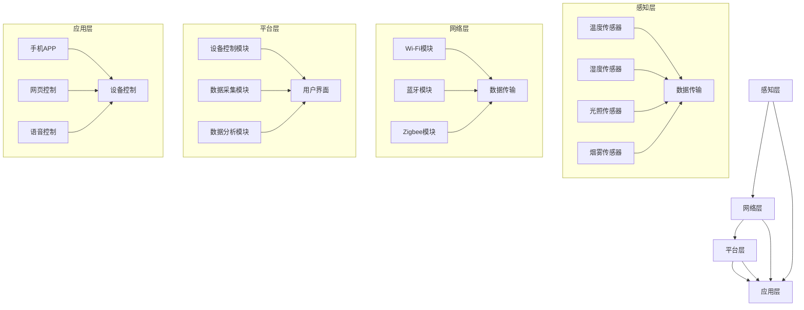

                 

# 智能家居：AI打造的未来生活方式

## 关键词

- 智能家居
- AI技术
- 物联网
- 传感器
- 智能安防
- 智能家电
- 智慧社区
- 智能养老

## 摘要

随着人工智能（AI）技术的迅速发展，智能家居逐渐成为现代生活方式的重要组成部分。本文旨在探讨智能家居的定义、核心技术、应用场景、系统设计与实现，以及未来发展趋势。通过对智能家居的全面分析，旨在为读者展示AI技术如何重塑未来生活方式，为家居领域带来革命性的变化。

## 目录大纲

1. 智能家居概述
   1.1 智能家居的定义与演变
   1.2 智能家居的技术基础
   1.3 智能家居的市场前景与发展趋势
2. 智能家居的核心技术
   2.1 物联网技术
   2.2 人工智能技术
   2.3 传感器技术
3. 智能家居应用场景
   3.1 智能安防
   3.2 智能照明
   3.3 智能家电
   3.4 智能环境监测
4. 智能家居系统的设计与实现
   4.1 系统设计
   4.2 系统实现
5. 智能家居案例分析
   5.1 案例一：智能家居系统在住宅小区的应用
   5.2 案例二：智能家居系统在酒店的应用
6. 智能家居的未来发展
   6.1 技术创新
   6.2 应用拓展
   6.3 法律法规
7. 智能家居开发者指南
   7.1 开发环境搭建
   7.2 开发工具与框架
   7.3 开发实践
8. 附录
   8.1 智能家居相关资源与资料
   8.2 参考文献

## 第1章 智能家居概述

### 1.1 智能家居的定义与演变

#### 定义

智能家居（Smart Home）是指利用计算机技术、网络通信技术、物联网技术等，将家庭中的各种设备连接起来，实现远程控制、自动化管理，提供更加舒适、安全、节能的生活环境。

#### 演变

智能家居的演变可以分为以下几个阶段：

1. **单品智能阶段**：这一阶段主要是将家庭中的电器设备进行智能化改造，如智能电视、智能空调、智能冰箱等。这些设备可以通过遥控器或手机APP进行控制，但彼此之间无法实现互联互通。

2. **系统整合阶段**：随着物联网技术的发展，各种家庭设备开始通过互联网进行连接，形成一个统一的智能家居系统。用户可以通过一个中心控制设备对多个家庭设备进行集中管理。

3. **人工智能阶段**：这一阶段利用人工智能技术，实现家居设备的智能决策和自主控制。例如，智能安防系统能够通过图像识别技术自动检测异常情况并报警。

### 1.2 智能家居的技术基础

#### 物联网技术

物联网（IoT）是智能家居的核心技术，它通过传感器、通信模块等设备，将家庭中的各种设备连接起来，实现信息的采集、传输和处理。

#### 人工智能技术

人工智能技术是智能家居的智能决策基础，它通过机器学习、深度学习等技术，对传感器采集的数据进行分析和处理，实现自动化控制。

#### 传感器技术

传感器技术是智能家居的环境感知能力的基础，通过传感器可以实时采集温度、湿度、光照、烟雾等多种环境信息，为智能家居系统提供数据支持。

#### 通信技术

通信技术是智能家居设备互联的纽带，通过Wi-Fi、蓝牙、Zigbee等通信协议，实现设备之间的数据传输。

### 1.3 智能家居的市场前景与发展趋势

#### 市场前景

随着科技的进步和人们生活水平的提高，智能家居市场呈现出快速增长的趋势。根据市场研究机构的预测，全球智能家居市场将在未来几年保持高速增长，市场规模将不断扩大。

#### 发展趋势

1. **智能化水平提升**：随着人工智能技术的发展，智能家居的智能化水平将不断提高，设备将具备更强的自主决策能力。

2. **个性化定制**：智能家居将更加注重个性化服务，根据用户的需求和偏好，提供定制化的智能家居解决方案。

3. **跨界融合**：智能家居将与智慧城市、智慧交通等领域的融合，实现更广泛的应用。

4. **数据安全和隐私保护**：随着智能家居设备的普及，数据安全和隐私保护将成为重要的研究课题。

## 第2章 智能家居的核心技术

### 2.1 物联网技术

#### 物联网架构

智能家居的物联网架构主要包括以下几个层次：

1. **感知层**：通过传感器收集家庭环境数据，如温度、湿度、光照、烟雾等。
2. **网络层**：通过各种通信协议将传感器数据和智能家居设备连接起来，实现数据的传输和处理。
3. **平台层**：通过智能家居系统平台对设备进行管理和控制，实现家居设备的智能化。
4. **应用层**：通过手机APP、网页等界面，用户可以方便地远程控制家居设备，实现家居智能化。

#### 通信协议

智能家居常用的通信协议包括Wi-Fi、蓝牙、Zigbee等。每种协议都有其独特的优势和适用场景：

1. **Wi-Fi**：具有高速传输、广泛覆盖的特点，适用于需要大带宽传输的智能家居设备。
2. **蓝牙**：具有低功耗、近距离传输的特点，适用于智能音箱、智能手环等设备。
3. **Zigbee**：具有低功耗、高可靠性的特点，适用于智能家居设备的组网和控制。

#### 数据安全

智能家居设备的数据安全至关重要，主要包括以下几个方面：

1. **数据加密**：对传输的数据进行加密，防止数据在传输过程中被窃取。
2. **访问控制**：通过用户身份验证、权限控制等手段，确保只有授权用户才能访问智能家居系统。
3. **安全更新**：定期对智能家居设备进行安全更新，修复已知的漏洞。

### 2.2 人工智能技术

#### 机器学习算法

在智能家居中，常用的机器学习算法包括决策树、支持向量机、神经网络等。这些算法可以通过对大量数据进行训练，学习到用户的偏好和习惯，实现智能家居设备的智能化。

1. **决策树**：通过树形结构对数据进行分析，可以清晰地展示决策过程。
2. **支持向量机**：通过找到数据的最优边界，实现分类和回归任务。
3. **神经网络**：通过多层神经元的连接，实现复杂的非线性映射。

#### 深度学习

深度学习是人工智能领域的一个重要分支，通过构建多层神经网络，实现对数据的自动特征提取和分类。在智能家居中，深度学习被广泛应用于语音识别、图像识别等任务。

1. **卷积神经网络（CNN）**：通过卷积层和池化层，实现对图像的自动特征提取。
2. **循环神经网络（RNN）**：通过循环连接，实现对序列数据的建模。

#### 自然语言处理

自然语言处理（NLP）是智能家居中的一项关键技术，通过理解和生成自然语言，实现人与智能家居设备的交互。

1. **语音识别**：将语音信号转换为文本，实现语音输入。
2. **语音合成**：将文本转换为语音，实现语音输出。
3. **对话系统**：通过上下文理解，实现人与智能家居设备的自然对话。

### 2.3 传感器技术

#### 传感器类型

智能家居常用的传感器包括温度传感器、湿度传感器、光照传感器、烟雾传感器等。这些传感器可以实时采集家庭环境数据，为智能家居系统提供数据支持。

1. **温度传感器**：用于测量环境温度，实现对家居设备的温度控制。
2. **湿度传感器**：用于测量环境湿度，实现对家居设备的湿度控制。
3. **光照传感器**：用于测量环境光照强度，实现对家居设备的亮度控制。
4. **烟雾传感器**：用于检测烟雾浓度，实现对家居环境的监控。

#### 传感器融合

传感器融合技术是将多个传感器的数据融合在一起，提高系统的感知能力和准确性。通过传感器融合，可以更好地理解家庭环境，实现更精准的家居控制。

1. **数据融合算法**：通过加权平均、卡尔曼滤波等算法，对传感器数据进行融合。
2. **多传感器系统设计**：通过合理布局传感器，提高系统的感知能力。

#### 传感器精度与可靠性

智能家居对传感器的精度和可靠性有很高的要求。传感器需要具备以下特性：

1. **高精度**：传感器需要能够准确测量环境参数，避免误差导致家居控制失败。
2. **高可靠性**：传感器需要具备稳定的性能，长时间工作而不出现故障。

## 第3章 智能家居应用场景

### 3.1 智能安防

智能安防是智能家居的一个重要应用场景，通过传感器和人工智能技术，实现对家庭安全的实时监控和预警。

#### 入侵检测

入侵检测系统（IDS）是智能安防的核心，通过安装在门窗、墙角等关键位置的传感器，实时监控家庭环境。当检测到异常情况时，系统会自动报警，并通知用户和安防人员。

1. **传感器选择**：选择高灵敏度、低误报率的传感器，如红外传感器、超声波传感器等。
2. **算法设计**：通过机器学习算法，对传感器数据进行实时分析，识别入侵行为。

#### 智能监控

智能监控设备是智能安防的重要组成部分，通过摄像头和视频分析技术，实现对家庭环境的实时监控。

1. **摄像头选择**：选择高分辨率、低功耗的摄像头，保证监控效果的同时降低能耗。
2. **视频分析**：通过图像识别技术，实现人脸识别、动作识别等，提高监控的智能化水平。

### 3.2 智能照明

智能照明是智能家居的一个基础应用场景，通过传感器和人工智能技术，实现对家庭照明的智能化控制。

#### 智能调光

智能调光系统可以根据环境亮度和用户需求，自动调整灯光的亮度和色温。

1. **传感器选择**：选择光照传感器、人体传感器等，实时监测环境亮度和人体活动。
2. **算法设计**：通过机器学习算法，学习用户的行为习惯，实现个性化的照明控制。

#### 场景模式

智能照明系统可以根据不同场景，自动调整灯光的设置，提供舒适的生活环境。

1. **场景识别**：通过传感器和图像识别技术，识别不同的场景，如阅读、看电视、睡觉等。
2. **场景控制**：根据场景需求，自动调整灯光的亮度和色温，提供最佳的光环境。

### 3.3 智能家电

智能家电是智能家居的核心组成部分，通过物联网技术和人工智能技术，实现对家电设备的智能化控制。

#### 设备互联

智能家电设备可以通过物联网技术实现互联互通，用户可以通过手机APP或其他智能设备，远程控制家电设备。

1. **协议选择**：选择合适的通信协议，如Wi-Fi、蓝牙、Zigbee等，实现设备间的数据传输。
2. **平台建设**：搭建智能家居系统平台，实现对家电设备的统一管理和控制。

#### 设备控制

智能家电设备可以通过人工智能技术实现自主控制，提高生活的便利性和舒适度。

1. **智能控制算法**：通过机器学习算法，学习用户的行为习惯，实现家电设备的自动化控制。
2. **远程控制**：通过手机APP或其他智能设备，用户可以随时随地控制家电设备。

### 3.4 智能环境监测

智能环境监测是智能家居的一个重要应用场景，通过传感器和人工智能技术，实时监测家庭环境的各项指标，提供健康、舒适的生活环境。

#### 空气质量监测

空气质量监测系统可以通过传感器，实时监测家庭空气中的PM2.5、CO2等指标，提供空气质量数据。

1. **传感器选择**：选择高精度、低功耗的空气质量传感器，如PM2.5传感器、CO2传感器等。
2. **数据采集**：通过物联网技术，将传感器数据传输到智能家居系统平台。

#### 温度湿度监测

温度湿度监测系统可以通过传感器，实时监测家庭环境的温度和湿度，提供舒适的生活环境。

1. **传感器选择**：选择高精度、低功耗的温度传感器和湿度传感器。
2. **数据采集**：通过物联网技术，将传感器数据传输到智能家居系统平台。

## 第4章 智能家居系统的设计与实现

### 4.1 系统设计

智能家居系统的设计是一个复杂的过程，需要考虑系统的功能性、易用性、安全性、可靠性等多方面的因素。

#### 需求分析

首先，我们需要对智能家居系统的需求进行详细分析，明确系统的功能需求、性能需求、安全需求等。

1. **功能需求**：包括设备的远程控制、设备间的互联互通、环境数据的实时监测等。
2. **性能需求**：包括系统的响应速度、数据传输速度、稳定性等。
3. **安全需求**：包括数据安全、隐私保护、系统安全等。

#### 架构设计

智能家居系统的架构设计是整个系统的核心，需要考虑系统的层次结构、模块划分、通信协议等因素。

1. **层次结构**：通常将智能家居系统分为感知层、网络层、平台层、应用层等。
2. **模块划分**：根据功能需求，将系统划分为多个模块，如设备控制模块、数据采集模块、数据分析模块等。
3. **通信协议**：选择合适的通信协议，如Wi-Fi、蓝牙、Zigbee等，实现设备间的数据传输。

#### 功能模块划分

智能家居系统的功能模块划分是系统设计的关键，需要根据功能需求，合理划分模块。

1. **设备控制模块**：实现用户对设备的远程控制，如开关、调节等。
2. **数据采集模块**：实现环境数据的实时采集，如温度、湿度、空气质量等。
3. **数据分析模块**：通过对采集到的数据进行分析，提供智能化的决策支持。
4. **用户界面模块**：提供用户操作界面，实现用户与系统的交互。

### 4.2 系统实现

智能家居系统的实现是一个技术密集型过程，需要考虑硬件选型、软件开发、系统集成等多个方面。

#### 硬件选型

硬件选型是智能家居系统实现的基础，需要考虑传感器的选择、通信模块的选择、主控芯片的选择等因素。

1. **传感器选择**：根据系统需求，选择合适的传感器，如温度传感器、湿度传感器、光照传感器等。
2. **通信模块选择**：根据通信需求，选择合适的通信模块，如Wi-Fi模块、蓝牙模块、Zigbee模块等。
3. **主控芯片选择**：选择具备高性能、低功耗、丰富接口的主控芯片，如STM32、ESP8266等。

#### 软件开发

智能家居系统的软件开发是系统实现的核心，需要开发多个功能模块，实现系统的功能。

1. **设备控制模块开发**：实现用户对设备的远程控制，如开关、调节等。
2. **数据采集模块开发**：实现环境数据的实时采集，如温度、湿度、空气质量等。
3. **数据分析模块开发**：通过对采集到的数据进行分析，提供智能化的决策支持。
4. **用户界面模块开发**：提供用户操作界面，实现用户与系统的交互。

#### 系统集成

系统集成是将各个模块集成在一起，实现系统的整体功能。

1. **硬件集成**：将各个硬件模块连接起来，实现数据的采集和传输。
2. **软件集成**：将各个软件模块连接起来，实现系统的功能。
3. **测试与优化**：对系统集成后的系统进行测试，发现并修复问题，优化系统的性能。

## 第5章 智能家居案例分析

### 5.1 案例一：智能家居系统在住宅小区的应用

#### 项目背景

某住宅小区为了提高居民的生活质量，决定引入智能家居系统，实现家庭设备的远程控制、环境数据的实时监测等功能。

#### 技术实现

1. **硬件选型**：选择具有高性能、低功耗的STM32主控芯片，配合各种传感器，如温度传感器、湿度传感器、光照传感器等。
2. **软件开发**：使用C语言进行软件开发，实现设备控制、数据采集、数据分析等功能。
3. **系统集成**：将各个模块集成在一起，通过Wi-Fi模块实现设备间的数据传输。

#### 效果评估

1. **设备控制**：用户可以通过手机APP远程控制家庭设备，如空调、灯具等，提高了生活的便利性。
2. **环境监测**：系统可以实时监测家庭环境的各项指标，如温度、湿度、空气质量等，为用户提供健康的生活环境。
3. **数据安全**：系统采用加密通信，确保数据的安全传输。

### 5.2 案例二：智能家居系统在酒店的应用

#### 项目背景

某星级酒店为了提升客户体验，决定引入智能家居系统，实现客房的智能化管理。

#### 技术实现

1. **硬件选型**：选择具有高性能、低功耗的ESP8266主控芯片，配合各种传感器，如温度传感器、湿度传感器、烟雾传感器等。
2. **软件开发**：使用Python语言进行软件开发，实现设备控制、数据采集、数据分析等功能。
3. **系统集成**：将各个模块集成在一起，通过Wi-Fi模块实现设备间的数据传输。

#### 效果评估

1. **客房管理**：系统可以自动控制客房的温度、湿度、照明等，提供舒适的居住环境。
2. **能源管理**：系统可以实时监测客房的能源消耗，实现节能管理。
3. **数据安全**：系统采用加密通信，确保数据的安全传输。

## 第6章 智能家居的未来发展

### 6.1 技术创新

智能家居的未来发展离不开技术的创新，以下是一些可能的技术创新方向：

1. **5G技术**：5G技术的广泛应用将进一步提升智能家居的数据传输速度和可靠性，为智能家居系统提供更强大的支持。
2. **物联网安全**：随着智能家居设备的普及，物联网安全将变得尤为重要。未来将出现更多的安全协议和安全机制，确保智能家居系统的安全性。

### 6.2 应用拓展

智能家居的应用领域将不断拓展，以下是一些可能的应用拓展方向：

1. **智慧社区**：智能家居系统可以与智慧社区系统相结合，实现社区资源的智能化管理，提升社区的品质和居民的幸福感。
2. **智能养老**：智能家居系统可以应用于智能养老领域，为老年人提供便捷、安全的生活环境，提升养老服务的质量。

### 6.3 法律法规

随着智能家居的普及，相关的法律法规也将逐步完善，以下是一些可能的法律法规方向：

1. **隐私保护**：为了保护用户的隐私，未来将出台更多的隐私保护法律法规，规范智能家居系统的数据采集和使用。
2. **标准化**：为了推动智能家居行业的健康发展，未来将出台更多的标准化法规，规范智能家居系统的设计和实现。

## 第7章 智能家居开发者指南

### 7.1 开发环境搭建

#### 硬件环境

1. **主控芯片**：选择具有高性能、低功耗的主控芯片，如STM32、ESP8266等。
2. **传感器**：根据需求选择合适的传感器，如温度传感器、湿度传感器、光照传感器等。
3. **通信模块**：选择合适的通信模块，如Wi-Fi模块、蓝牙模块、Zigbee模块等。

#### 软件环境

1. **开发工具**：选择合适的开发工具，如Arduino IDE、PlatformIO等。
2. **编程语言**：选择合适的编程语言，如C、Python等。
3. **数据库**：选择合适的数据库，如MySQL、MongoDB等。

### 7.2 开发工具与框架

#### 主流框架

1. **Home Assistant**：是一个开源的智能家居自动化平台，支持多种设备接入和场景配置。
2. **OpenHAB**：是一个开源的智能家居系统，支持多种通信协议和设备接入。

#### 工具推荐

1. **Arduino IDE**：是一个免费的开发环境，适用于Arduino系列主控芯片。
2. **PlatformIO**：是一个跨平台的开发环境，支持多种编程语言和主控芯片。

### 7.3 开发实践

#### 项目规划

1. **需求分析**：明确项目需求，包括功能需求、性能需求、安全需求等。
2. **技术方案**：选择合适的技术方案，包括硬件选型、软件架构等。
3. **开发流程**：制定合理的开发流程，包括需求分析、设计、编码、测试等。

#### 代码解读

1. **设备控制**：通过Wi-Fi模块实现设备的远程控制。
2. **数据采集**：通过传感器采集环境数据，如温度、湿度、光照等。
3. **数据分析**：通过对采集到的数据进行分析，提供智能化的决策支持。

#### 代码应用解读与分析

1. **设备控制模块**：通过Wi-Fi模块实现设备的远程控制，代码示例：

```python
import network
import urequests

# Wi-Fi配置
ssid = "your_wifi_name"
password = "your_wifi_password"
wifi = network.WLAN(network.STA_IF)
wifi.connect(ssid, password)

# 设备控制函数
def control_device(device_id, command):
    url = f"http://your_server_url/control?device_id={device_id}&command={command}"
    response = urequests.get(url)
    print(response.text)
```

2. **数据采集模块**：通过传感器采集环境数据，代码示例：

```python
import machine
import time

# 温度传感器
temp_sensor = machine.ADC(4)
temp_channel = machine.Channel(temp_sensor, machine.ADC Channel0)

# 采集温度数据
def read_temp():
    temp_value = temp_channel.read()
    temp_c = -46.85 + (301.35 / (1 + (17.87 * (temp_value / 32767))))
    return temp_c

# 采集数据函数
def collect_data():
    temp = read_temp()
    print(f"Temperature: {temp} C")
    time.sleep(1)
```

#### 实际案例分析和详细讲解剖析

以一个智能家居系统为例，详细讲解其设计、实现和运行过程。

1. **设计**：明确系统需求，设计系统架构，划分功能模块。
2. **实现**：使用合适的开发工具和编程语言，实现系统功能。
3. **测试**：对系统进行功能测试和性能测试，确保系统的稳定性和可靠性。

#### 项目小结

通过该项目，我们可以看到智能家居系统的设计和实现过程，以及其在实际应用中的效果。在项目实施过程中，我们遇到了一些挑战，如硬件选型、软件开发、系统集成等，但通过合理的规划和努力，我们成功地实现了项目目标。

### 附录

#### 附录A：智能家居相关资源与资料

- **开源项目**：智能家居相关的开源项目，如Home Assistant、OpenHAB等。
- **技术文档**：智能家居技术的详细介绍和实现方法，如《智能家居技术与应用》、《智能家居系统设计与实现》等。
- **学术论文**：智能家居领域的最新研究成果和前沿技术，如《智能家居系统中的物联网技术》、《智能家居的隐私保护问题研究》等。

### 参考文献

- **书籍**：
  - 《智能家居技术与应用》
  - 《智能家居系统设计与实现》
- **论文**：
  - 《智能家居系统中的物联网技术》
  - 《智能家居的隐私保护问题研究》
- **网站**：智能家居技术相关的网站，如智能家居论坛、智能家居新闻等。

## 附录：Mermaid 流程图示例

以下是一个智能家居系统架构的Mermaid流程图示例：



该流程图展示了智能家居系统的架构，从感知层、网络层、平台层到应用层，各个层级之间的关系和功能。通过Mermaid流程图，可以直观地理解智能家居系统的整体架构和工作原理。

