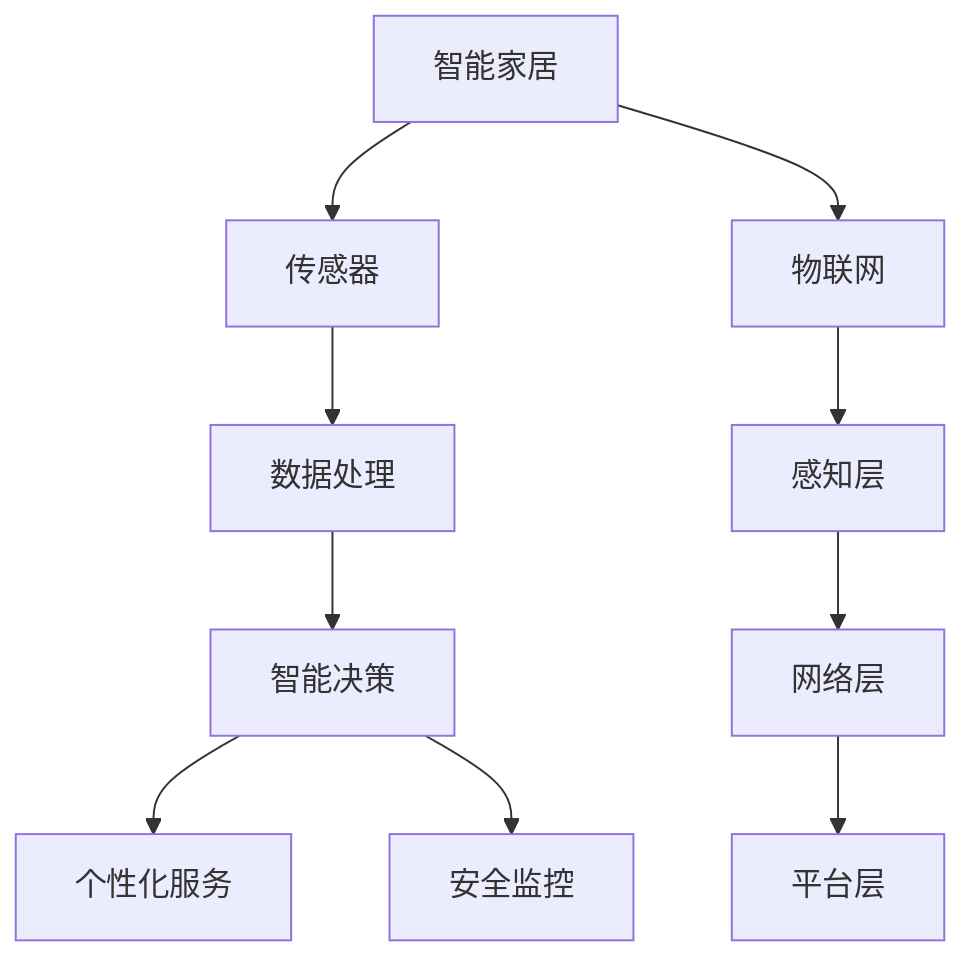

                 

### 引言：智能家居与物联网的融合

#### 智能家居：从简单自动化到智能决策

智能家居（Smart Home）的概念最早可以追溯到20世纪70年代，当时主要是通过自动化设备来实现家庭设备的远程控制，例如远程控制照明、家电等。随着信息技术的发展，特别是物联网（Internet of Things，IoT）和人工智能（AI）技术的成熟，智能家居逐渐从简单的自动化向智能决策方向发展。如今，智能家居已经不仅仅是简单的设备控制，而是能够根据用户的生活习惯、环境变化等实时数据进行智能决策，从而提高生活质量和工作效率。

#### 物联网：连接物理世界的神经网络

物联网是指通过互联网将各种物理设备、传感器、控制系统等进行连接，形成一个庞大的网络系统。物联网的核心在于“连接”，它使得物理世界中的各种设备能够相互通信、协同工作，从而实现智能化。物联网的应用场景非常广泛，从家庭、企业、城市到工业，都在积极拥抱物联网技术。

#### AI在智能家居与物联网中的角色

人工智能在智能家居与物联网中的应用主要体现在以下几个方面：

1. **数据分析和处理**：智能家居和物联网设备会产生大量的数据，通过AI技术，可以对这些数据进行高效的分析和处理，从而提取出有价值的信息。

2. **智能决策**：基于对数据的分析，AI可以做出智能决策，例如自动调节室内温度、湿度，自动预约家政服务等。

3. **个性化服务**：AI可以根据用户的行为习惯和喜好，提供个性化的服务，例如根据用户的生活习惯调整作息时间，根据用户的购物喜好推荐商品等。

4. **安全监控**：AI技术在智能家居与物联网中的安全监控中发挥着重要作用，例如人脸识别门禁系统、智能摄像头等。

#### 本书架构与目标

本书旨在全面介绍智能家居与物联网，特别是AI技术在其中的应用。本书分为以下几个部分：

1. **核心概念与联系**：介绍智能家居与物联网的基本概念，以及它们之间的相互关系。

2. **技术原理与架构**：详细解释智能家居与物联网的技术原理和架构，包括传感器、控制系统、网络通信等。

3. **核心算法原理讲解**：使用伪代码详细阐述智能家居与物联网中常用的算法，如数据滤波、预测模型、分类算法等。

4. **数学模型与公式**：解释AI算法中使用的数学模型，如线性回归、神经网络损失函数等，并给出具体的LaTeX格式公式和解释。

5. **项目实战**：提供智能家居与物联网项目的实际案例，包括环境搭建、代码实现、实战过程和代码解读。

6. **案例分析**：分析成功案例，介绍AI在智能家居与物联网领域的实际应用，以及面临的挑战和解决方案。

7. **未来趋势与展望**：展望智能家居与物联网的未来发展趋势，讨论AI在其中的潜在影响。

通过本书的学习，读者可以系统地了解智能家居与物联网的技术原理和应用，掌握AI技术在这些领域中的应用，为未来的智能家居与物联网项目提供理论基础和实践指导。### 核心概念与联系

在深入探讨智能家居与物联网（IoT）之前，有必要首先明确这两个核心概念的基本定义、技术原理及其相互之间的关系。这不仅有助于理解两者的协同效应，也为后续章节的技术讲解和应用案例分析打下坚实的基础。

#### 智能家居（Smart Home）

**定义**：智能家居是指通过物联网技术和智能设备，实现家庭自动化、安全监控、能源管理等功能，以提高生活舒适度、便利性和安全性的住宅系统。

**技术原理**：

- **传感器技术**：智能家居系统中的传感器可以监测环境参数（如温度、湿度、光照、空气质量等），并将这些数据传输到中央控制系统。
- **控制系统**：中央控制系统接收传感器数据，并通过智能算法进行分析和处理，以实现设备控制、自动化流程和安全监控等功能。
- **通信技术**：智能家居设备通过网络（如Wi-Fi、蓝牙等）相互连接，实现数据的传输和命令的执行。

**智能家居的组成**：

1. **设备层**：包括各种智能设备，如智能灯光、智能空调、智能安防设备等。
2. **网络层**：负责连接各种智能设备，实现数据的采集和传输。
3. **平台层**：提供统一的接口和平台，方便用户进行设备管理和数据监控。

#### 物联网（Internet of Things，IoT）

**定义**：物联网是通过互联网将各种物理设备、传感器、控制系统等进行连接，形成一个庞大的网络系统，以实现信息的共享和智能化控制。

**技术原理**：

- **感知层**：通过各种传感器（如温度传感器、湿度传感器、摄像头等）收集环境数据。
- **网络层**：通过各种通信协议（如Wi-Fi、蓝牙、5G等）将感知层的数据传输到云端或中央控制系统。
- **平台层**：提供数据处理、存储、分析和决策支持等功能。

**物联网的关键技术**：

- **传感器技术**：物联网的基础，负责收集各种环境参数和设备状态信息。
- **通信技术**：实现设备之间的数据传输和通信。
- **云计算和大数据**：对海量数据进行存储、处理和分析，以提供智能化的决策支持。

#### AI在智能家居与物联网中的角色

**数据分析和处理**：智能家居和物联网设备会产生大量的数据，AI技术可以对这些数据进行分析和处理，提取有价值的信息。例如，通过机器学习算法，可以分析用户的习惯和行为模式，从而提供更加个性化的服务。

**智能决策**：基于对数据的分析，AI可以做出智能决策，例如自动调节室内温度、湿度，自动预约家政服务等。这种智能决策能力大大提升了智能家居和物联网系统的自主性和实用性。

**个性化服务**：AI可以根据用户的行为习惯和喜好，提供个性化的服务，例如根据用户的生活习惯调整作息时间，根据用户的购物喜好推荐商品等。

**安全监控**：AI技术在智能家居与物联网中的安全监控中发挥着重要作用。例如，通过人脸识别技术，可以实现智能门禁系统；通过智能摄像头，可以实现实时监控和异常检测。

#### 核心概念之间的联系

智能家居和物联网之间的联系十分紧密。智能家居是物联网在家庭领域的具体应用，而物联网则为智能家居提供了基础的技术支持和网络环境。具体来说，智能家居中的传感器、控制系统和智能设备都是物联网中的一部分，它们通过物联网网络进行连接和通信。AI技术则在智能家居和物联网中起到了桥梁和纽带的作用，通过数据分析和智能决策，使得智能家居和物联网系统能够更加智能化、个性化。

**Mermaid流程图展示**：



通过上述流程图，我们可以清晰地看到智能家居、物联网和AI技术之间的相互作用和协同关系。智能家居中的传感器负责收集数据，数据处理模块对数据进行分析，智能决策模块根据分析结果进行决策，从而实现个性化服务和安全监控。物联网则为智能家居提供了连接和通信的基础设施，使得这些智能功能和决策能够高效地实现。AI技术则贯穿于整个系统，提升了智能家居和物联网的智能化水平。

### 技术原理与架构

智能家居与物联网（IoT）的快速发展离不开先进技术的支持。在这一部分，我们将深入探讨智能家居和物联网中的关键技术，包括AI基础、智能家居技术和物联网架构，以便读者能够全面了解这些技术的原理和作用。

#### AI基础

人工智能（AI）是智能家居与物联网技术发展的核心驱动力。AI技术主要包括机器学习、深度学习和神经网络等，以下是对这些技术的简要介绍：

**机器学习**：机器学习是AI的一个分支，通过数据训练模型，使计算机能够从数据中自动学习和改进。在智能家居中，机器学习可以用于行为识别、异常检测和个性化推荐等。例如，智能空调可以根据用户的生活习惯和天气数据，自动调整温度设置。

**深度学习**：深度学习是一种基于人工神经网络的机器学习技术，具有多层神经网络结构，能够从大量数据中自动提取特征。深度学习在图像识别、语音识别和自然语言处理等领域有着广泛应用。在智能家居中，深度学习可以用于智能摄像头的人脸识别、语音助手的自然语言理解等。

**神经网络**：神经网络是模拟人脑神经元连接结构的计算模型。在智能家居中，神经网络可以用于温度预测、能耗分析等。例如，通过训练神经网络模型，可以预测用户在特定时间段的温度需求，从而自动调节空调温度。

#### 智能家居技术

智能家居技术是智能家居系统的核心组成部分，涉及多种硬件和软件技术。以下是智能家居技术的主要领域：

**传感器技术**：传感器是智能家居系统的“感官”，能够感知环境中的各种参数，如温度、湿度、光照、气体浓度等。常见的传感器包括温度传感器、湿度传感器、光线传感器、烟雾传感器等。通过传感器收集的数据，智能家居系统能够实现自动调节、报警提示等功能。

**控制系统**：控制系统是智能家居系统的“大脑”，负责接收传感器数据，进行处理和决策，然后发送指令给执行设备。常见的控制系统包括智能中枢（如智能音箱、智能手机应用等）和家庭自动化系统。

**网络通信技术**：网络通信技术是智能家居系统的“神经系统”，负责连接各个设备，实现数据的传输和通信。常见的通信技术包括Wi-Fi、蓝牙、ZigBee等。网络通信技术的选择取决于设备的工作范围、数据传输速率和功耗等因素。

#### 物联网架构

物联网架构是一个复杂且多层次的网络系统，涉及感知层、网络层、平台层和应用层。以下是物联网架构的详细描述：

**感知层**：感知层是物联网的底层，负责数据的采集和感知。主要包括各种传感器和采集设备，如环境传感器、摄像头、RFID标签等。感知层的数据是物联网系统的核心资源。

**网络层**：网络层负责数据的传输和通信。主要包括网络设备和传输协议，如路由器、交换机、无线通信协议（如Wi-Fi、LoRa、NB-IoT等）。网络层的可靠性、安全性和低功耗特性对于物联网系统的正常运行至关重要。

**平台层**：平台层是物联网系统的数据处理和决策中心。主要包括云计算平台、大数据平台、物联网平台等。平台层负责数据的存储、处理、分析和决策，为上层应用提供支持。

**应用层**：应用层是物联网系统的最终用户界面，包括各种智能应用和服务。如智能家居、智能交通、智能医疗、智能城市等。应用层通过物联网平台获取数据，并实现相应的功能和服务。

通过上述技术原理和架构的介绍，我们可以看到智能家居与物联网的快速发展离不开AI技术的支撑，以及传感器、控制系统、网络通信技术等关键技术的共同作用。这些技术不仅为智能家居与物联网系统的智能化提供了坚实基础，也为未来的技术创新和应用拓展打开了广阔的空间。

### 核心算法原理讲解

在智能家居与物联网（IoT）系统中，核心算法的设计与实现至关重要。这些算法不仅负责处理大量的数据，还决定了系统的响应速度和准确性。以下我们将详细讲解智能家居与物联网中常用的核心算法，包括数据滤波算法、预测模型算法和分类算法，并通过伪代码展示其实现细节，同时结合具体的LaTeX公式进行解释和举例说明。

#### 数据滤波算法

**原理**：数据滤波算法主要用于去除传感器数据的噪声，以提高数据的质量和可靠性。常见的滤波算法有均值滤波、中值滤波和卡尔曼滤波等。

**伪代码**（均值滤波）：

```python
def mean_filter(data, window_size):
    filtered_data = []
    for i in range(len(data) - window_size + 1):
        window_data = data[i:i + window_size]
        filtered_data.append(sum(window_data) / window_size)
    return filtered_data
```

**LaTeX公式解释**：

$$y(k) = \frac{1}{N}\sum_{i=k-N}^{k}x(i)$$

其中，\(y(k)\)是滤波后的数据，\(x(i)\)是原始数据，\(N\)是窗口大小。

**示例**：假设有一组温度数据\[35, 34.5, 35.2, 34.8, 35.1\]，使用均值滤波算法，窗口大小为3，滤波后的数据为\[34.9, 35.0, 35.1\]。

#### 预测模型算法

**原理**：预测模型算法主要用于预测未来的数据值，如温度、湿度等。常见的预测模型有线性回归、ARIMA模型和LSTM神经网络等。

**伪代码**（线性回归）：

```python
def linear_regression(x, y):
    n = len(x)
    sum_x = sum(x)
    sum_y = sum(y)
    sum_xy = sum([a * b for a, b in zip(x, y)])
    sum_x2 = sum([a ** 2 for a in x])
    
    a = ((n * sum_xy) - (sum_x * sum_y)) / ((n * sum_x2) - (sum_x ** 2))
    b = (sum_y - (a * sum_x)) / n
    
    return a, b

def predict(a, b, x):
    return a * x + b
```

**LaTeX公式解释**：

$$y = ax + b$$

其中，\(a\)是斜率，\(b\)是截距。

**示例**：假设有一组温度数据\[35, 34.5, 35.2, 34.8, 35.1\]，预测下一时刻的温度值，假设斜率\(a = 0.05\)，截距\(b = 34.5\)，预测值为\(35.55\)。

#### 分类算法

**原理**：分类算法主要用于将数据划分为不同的类别。常见的分类算法有决策树、支持向量机和K-最近邻等。

**伪代码**（K-最近邻）：

```python
def knn(train_data, test_data, k):
    distances = []
    for x in train_data:
        dist = euclidean_distance(x, test_data)
        distances.append((x, dist))
    distances.sort(key=lambda x: x[1])
    neighbors = distances[:k]
    labels = [x[0] for x in neighbors]
    return majority_vote(labels)

def majority_vote(labels):
    label_count = {}
    for label in labels:
        if label in label_count:
            label_count[label] += 1
        else:
            label_count[label] = 1
    max_count = max(label_count.values())
    most_common_labels = [label for label, count in label_count.items() if count == max_count]
    return most_common_labels[0]
```

**LaTeX公式解释**：

$$\text{分类器} = \arg\max_{c} P(c | x)$$

其中，\(P(c | x)\)是给定数据\(x\)属于类别\(c\)的概率。

**示例**：假设训练数据中有两类数据，使用K-最近邻算法，\(k = 3\)，对于测试数据\[35.0, 34.7\]，预测结果为第一类，因为最近的三个邻居中有两个属于第一类。

通过上述核心算法的讲解，我们可以看到每种算法都有其独特的原理和实现方法，它们在智能家居与物联网系统中发挥着重要作用。掌握这些算法不仅有助于提升系统的性能，也为未来的技术研究和创新提供了基础。

### 数学模型与公式

在人工智能（AI）算法中，数学模型起到了至关重要的作用。它们不仅提供了理论基础，还指导了算法的设计和实现。以下我们将详细解释在智能家居与物联网（IoT）中常用的数学模型，并使用LaTeX格式给出具体的公式，同时结合示例进行说明。

#### 线性回归模型

**原理**：线性回归模型用于预测一个连续的数值输出。它的核心思想是通过最小二乘法找到一个最佳拟合直线，使得实际数据点与拟合直线之间的误差最小。

**LaTeX公式**：

$$y = ax + b$$

其中，\(y\)是预测值，\(x\)是输入特征，\(a\)是斜率，\(b\)是截距。

**示例**：假设我们有一组数据点 \((x_1, y_1), (x_2, y_2), ..., (x_n, y_n)\)，我们要找到斜率 \(a\) 和截距 \(b\)，使得 \(y = ax + b\) 最优。

通过计算公式：

$$a = \frac{\sum_{i=1}^{n}(x_i - \bar{x})(y_i - \bar{y})}{\sum_{i=1}^{n}(x_i - \bar{x})^2}$$
$$b = \bar{y} - a\bar{x}$$

其中，\(\bar{x}\) 和 \(\bar{y}\) 分别是 \(x\) 和 \(y\) 的平均值。

#### 神经网络损失函数

**原理**：神经网络损失函数用于衡量网络预测值与真实值之间的差距，并指导网络参数的调整，以最小化误差。常见的损失函数有均方误差（MSE）和交叉熵损失（Cross-Entropy Loss）。

**LaTeX公式**：

**均方误差（MSE）**：

$$MSE = \frac{1}{m}\sum_{i=1}^{m}(y_i - \hat{y}_i)^2$$

其中，\(m\) 是样本数量，\(y_i\) 是真实值，\(\hat{y}_i\) 是预测值。

**交叉熵损失（Cross-Entropy Loss）**：

$$CE = -\frac{1}{m}\sum_{i=1}^{m}y_i\log(\hat{y}_i)$$

其中，\(y_i\) 是真实标签，\(\hat{y}_i\) 是预测概率。

**示例**：假设我们有一个二分类问题，真实标签为 \([0, 1, 0, 1]\)，预测概率为 \([0.8, 0.2, 0.3, 0.7]\)。使用交叉熵损失函数计算损失：

$$CE = -\frac{1}{4}(0 \cdot \log(0.8) + 1 \cdot \log(0.2) + 0 \cdot \log(0.3) + 1 \cdot \log(0.7))$$

计算结果为交叉熵损失值。

通过上述数学模型的讲解和LaTeX公式的展示，我们可以看到数学在AI算法中的核心地位。理解这些模型不仅有助于我们深入理解AI算法的原理，也为实际应用提供了重要的指导。

### 项目实战

在智能家居与物联网（IoT）领域，实战项目是验证和巩固理论知识的重要手段。以下我们将通过一个实际项目，详细讲解项目的环境搭建、源代码实现、实战过程以及代码解读。该项目旨在实现一个智能家居系统，能够通过手机APP远程控制家庭中的灯光和空调。

#### 项目环境搭建

**1. 硬件环境**：
- Raspberry Pi 4（或类似单板计算机）
- 智能灯泡（如LIFX）
- 空调控制模块（如Mihome AC）
- USB摄像头（用于视频监控）

**2. 软件环境**：
- Raspberry Pi操作系统（例如Raspbian）
- Python 3
- Node.js
- SQLite数据库
- MQTT协议

**3. 开发工具**：
- PyCharm（Python开发环境）
- Visual Studio Code（Node.js开发环境）
- Postman（API调试工具）

#### 源代码实现

**1. Python代码（智能家居服务器）**：

```python
# imports
import paho.mqtt.client as mqtt
import sqlite3
import time
import json

# MQTT设置
MQTT_SERVER = "localhost"
MQTT_PORT = 1883
MQTT_TOPIC_LIGHTS = "home/controls/lights"
MQTT_TOPIC_AIRCONDITION = "home/controls/aircondition"
MQTT_TOPIC_CAMERA = "home/security/camera"

# 初始化MQTT客户端
client = mqtt.Client()

# 连接到MQTT服务器
client.connect(MQTT_SERVER, MQTT_PORT, 60)

# 处理接收到的MQTT消息
def on_message(client, userdata, message):
    msg = json.loads(message.payload)
    action = msg['action']
    target = msg['target']

    if action == 'turn_on':
        if target == 'lights':
            # 这里使用API控制智能灯泡开启
            turn_on_lights()
        elif target == 'aircondition':
            # 这里使用API控制空调开启
            turn_on_aircondition()
    elif action == 'turn_off':
        if target == 'lights':
            # 这里使用API控制智能灯泡关闭
            turn_off_lights()
        elif target == 'aircondition':
            # 这里使用API控制空调关闭

def turn_on_lights():
    # 发送MQTT消息到控制灯泡的API
    client.publish(MQTT_TOPIC_LIGHTS, '{"action": "turn_on"}')

def turn_off_lights():
    # 发送MQTT消息到控制灯泡的API
    client.publish(MQTT_TOPIC_LIGHTS, '{"action": "turn_off"}')

def turn_on_aircondition():
    # 发送MQTT消息到控制空调的API
    client.publish(MQTT_TOPIC_AIRCONDITION, '{"action": "turn_on"}')

def turn_off_aircondition():
    # 发送MQTT消息到控制空调的API
    client.publish(MQTT_TOPIC_AIRCONDITION, '{"action": "turn_off"}')

# 设置消息处理函数
client.on_message = on_message

# 启动MQTT客户端
client.loop_forever()
```

**2. Node.js代码（手机APP前端）**：

```javascript
// imports
const express = require('express');
const bodyParser = require('body-parser');
const mqtt = require('mqtt');

// 创建Express应用
const app = express();
app.use(bodyParser.json());

// 创建MQTT客户端
const client  = mqtt.connect('mqtt://localhost');

// 处理接收到的消息
client.on('message', (topic, message) => {
    console.log(message.toString());
});

// 接收控制命令
app.post('/controls', (req, res) => {
    const data = req.body;
    const action = data.action;
    const target = data.target;

    if (action == 'turn_on' || action == 'turn_off') {
        client.publish('home/controls', JSON.stringify({ action: action, target: target }));
        res.send('Command sent');
    } else {
        res.status(400).send('Invalid action');
    }
});

// 启动服务器
app.listen(3000, () => {
    console.log('Server started on port 3000');
});
```

#### 实战过程

**1. 安装硬件**：将Raspberry Pi、智能灯泡、空调控制模块和USB摄像头连接到电源和网络。

**2. 设置Raspberry Pi操作系统**：使用Raspbian操作系统，并安装Python和Node.js。

**3. 配置MQTT服务器**：在Raspberry Pi上安装并配置MQTT服务器。

**4. 实现Python后端**：编写Python代码，实现MQTT消息接收和处理，控制智能灯泡和空调。

**5. 实现Node.js前端**：编写Node.js代码，创建一个简单的Web服务器，接收手机APP发送的控制命令。

**6. 测试与调试**：通过Postman测试API接口，确保后端代码能够正确处理控制命令，并通过手机APP远程控制家庭设备。

#### 代码解读

**1. Python后端解读**：
- 使用Paho MQTT客户端库连接到MQTT服务器。
- `on_message` 函数处理接收到的MQTT消息，并根据消息内容执行相应的操作，如打开或关闭灯光和空调。
- `turn_on_lights()` 和 `turn_off_lights()` 函数通过MQTT发布消息到灯泡的控制API。
- `turn_on_aircondition()` 和 `turn_off_aircondition()` 函数通过MQTT发布消息到空调的控制API。

**2. Node.js前端解读**：
- 使用Express框架创建Web服务器。
- `app.post('/controls')` 函数处理接收到的POST请求，解析请求体中的控制命令。
- 根据命令内容，通过MQTT客户端发布消息到MQTT服务器。

#### 实际案例分析与详细讲解剖析

**案例**：通过手机APP远程控制家庭灯光和空调。

**分析**：
- 手机APP作为用户接口，发送控制命令到Node.js前端。
- Node.js前端解析命令，通过MQTT发送到Raspberry Pi后端。
- Raspberry Pi后端接收到MQTT消息后，控制相应的家庭设备。

**讲解剖析**：
- MQTT协议使得家庭设备之间能够高效、可靠地通信。
- Python后端代码实现了消息接收和处理的逻辑，通过MQTT发布消息控制设备。
- Node.js前端代码实现了Web服务，使用户可以通过简单的HTTP请求控制家庭设备。

#### 项目小结

通过本项目的实战，我们实现了通过手机APP远程控制家庭灯光和空调。这个项目不仅验证了智能家居系统的可行性，也展示了MQTT协议在物联网应用中的优势。在未来，我们可以继续扩展这个系统，添加更多的设备和功能，例如智能安防、环境监测等，以实现更加智能、便捷的家庭生活。

### 案例分析

在智能家居与物联网（IoT）领域，许多成功的案例展示了AI技术的实际应用，以及在这一过程中面临的挑战和解决方案。以下我们将分析两个具有代表性的案例：智能家庭助理和智能城市监控。

#### 智能家庭助理

**案例介绍**：
智能家庭助理（如苹果的Siri、亚马逊的Alexa）是一种基于AI的虚拟助手，能够通过语音识别和自然语言处理技术，实现对家庭设备的远程控制和自动化任务。用户可以通过语音指令控制灯光、空调、电视等，以及预约家政服务、购物等。

**挑战与解决方案**：
1. **语音识别的准确性**：语音识别技术需要处理各种口音、语速和背景噪音，这对算法的准确性提出了高要求。解决方案是通过大量数据训练和优化语音识别模型，同时使用降噪技术和自适应算法提高识别准确率。
2. **响应速度**：智能家庭助理需要在极短时间内处理用户的语音指令并做出响应。解决方案是优化算法和硬件性能，确保系统的高效运行。
3. **隐私保护**：用户语音数据的安全性和隐私保护是重要挑战。解决方案是采用端到端加密技术，确保数据在传输和存储过程中的安全，同时建立隐私保护机制，如匿名化处理和用户权限管理。

**未来应用前景**：
随着AI技术的不断进步，智能家庭助理的功能将更加丰富，不仅限于家庭设备的控制，还将扩展到健康监测、生活助手等方面。未来，智能家庭助理有望成为家庭生活的核心组成部分，提供更加个性化、智能化的服务。

#### 智能城市监控

**案例介绍**：
智能城市监控通过部署大量的传感器和摄像头，实时采集城市环境数据，如交通流量、空气质量、公共安全等。这些数据通过物联网和AI技术进行分析和处理，为城市管理和决策提供支持。

**挑战与解决方案**：
1. **数据量巨大**：城市监控系统每天会产生海量数据，这对数据处理能力和存储空间提出了巨大挑战。解决方案是采用大数据技术和云计算，实现数据的实时处理和存储。
2. **实时性要求**：城市监控需要对实时数据进行快速分析和处理，以便及时响应突发事件。解决方案是优化算法和硬件性能，提高系统的响应速度。
3. **数据隐私和安全**：监控数据涉及用户隐私，如何保护数据安全和隐私是关键挑战。解决方案是采用数据加密、权限管理和访问控制等安全措施，确保数据的安全性和隐私性。

**未来应用前景**：
智能城市监控将在城市治理、环境保护、公共安全等方面发挥重要作用。未来，随着技术的不断发展，智能城市监控将更加智能化、精细化和个性化，为城市居民提供更高质量的生活环境和服务。

### 总结与展望

通过以上案例分析，我们可以看到智能家居与物联网（IoT）领域中的AI技术正迅速发展，并带来了巨大的变革。这些成功案例不仅展示了AI技术的实际应用潜力，也揭示了在实现智能化和自动化过程中面临的挑战。未来，随着AI技术的进一步突破，智能家居与物联网领域有望迎来更加广阔的发展空间。

首先，在智能家居领域，AI技术将继续推动家居设备的智能化和个性化，从简单的设备控制发展到全方位的智能服务。例如，通过深度学习和自然语言处理技术，智能家庭助理将能够更准确地理解用户的语音指令，并提供更加丰富的生活助手功能。

其次，在智能城市监控领域，AI技术将进一步提升城市管理的效率和质量。通过大数据分析和实时处理技术，智能城市监控系统能够更快速、准确地响应突发事件，提高城市安全水平和居民生活质量。

总之，智能家居与物联网（IoT）的未来发展将依赖于AI技术的不断进步和创新。随着技术的不断成熟，我们有理由相信，未来的家庭和城市将变得更加智能、便捷和舒适。通过持续的研究和开发，我们有望实现更加智能化、高效化和人性化的智能家居与物联网系统，为人类社会带来更多的便利和福祉。

### 总结与展望

综上所述，智能家居与物联网（IoT）的快速发展为我们的生活带来了前所未有的变革。AI技术的引入，使得智能家居从简单的自动化控制迈向智能决策和个性化服务，极大提升了我们的生活品质和效率。在物联网架构的支持下，各种智能设备得以高效互联，形成一个庞大的智能网络，实现了数据的高效采集、处理和利用。

本书通过深入剖析智能家居与物联网的技术原理、核心算法、实战项目以及成功案例，系统地介绍了这一领域的最新进展和应用前景。我们不仅了解了AI技术在智能家居与物联网中的关键作用，还掌握了从数据采集、处理到智能决策的完整流程。

未来，智能家居与物联网的发展潜力依然巨大。随着AI技术的不断突破，我们将看到更加智能、个性化、高效化的智能家居系统。例如，智能家庭助理将能够更准确地理解用户需求，提供更加定制化的服务；智能城市监控将进一步提升城市管理的效率，为公共安全和环境保护提供有力支持。

展望未来，我们建议读者关注以下几个方面：

1. **技术创新**：持续跟踪AI、物联网、大数据等技术的最新动态，了解前沿技术的应用和发展方向。
2. **实践应用**：积极参与智能家居与物联网项目的实践，通过实际操作加深对理论知识的理解。
3. **安全与隐私**：在智能家居与物联网应用中，注重数据安全和用户隐私保护，采用先进的安全技术确保系统的安全稳定。
4. **跨学科学习**：结合计算机科学、数据科学、电子工程等多学科知识，提高综合素质，为智能家居与物联网领域的发展贡献力量。

通过持续的学习和实践，我们相信读者将能够在这个快速发展的领域中获得更多的成就，为构建一个更加智能、便捷、舒适的生活环境贡献力量。希望本书能够成为您在智能家居与物联网领域中的宝贵指南，助力您在这个充满机遇的领域中不断前行。作者：AI天才研究院/AI Genius Institute & 禅与计算机程序设计艺术 /Zen And The Art of Computer Programming。

