                 

### 《智能工厂：AI全面集成的制造环境》

> 关键词：智能工厂，人工智能，制造环境，AI技术应用，深度学习，机器学习，智能优化，数据处理，数据分析

> 摘要：本文深入探讨了智能工厂的概念、背景及其在现代化制造业中的重要性。文章从AI技术的理论基础出发，详细解析了AI在制造环境中的应用，包括制造流程优化、质量控制、能源管理、供应链管理等核心领域。通过实际案例和项目实战，本文展现了智能工厂的实施与落地过程，并对其未来发展进行了展望，分析了面临的挑战和解决方案。本文旨在为读者提供全面、系统的智能工厂AI技术应用指南，助力制造业智能化转型。

### 引言与背景

#### 1.1 书籍概述

智能工厂，顾名思义，是指将人工智能（AI）技术与制造环境深度融合，构建出一个高度自动化、智能化、自适应的制造系统。这种新型制造模式不仅提升了生产效率和产品质量，还降低了生产成本和能源消耗，是制造业智能化、数字化转型的关键步骤。

在当前全球制造业竞争激烈的环境下，智能工厂的重要性愈发凸显。随着人工智能技术的快速发展，越来越多的企业开始意识到，通过引入AI技术，可以实现从设计、生产、质量检测到供应链管理的全流程智能化。这不仅有助于提升企业竞争力，还能更好地满足消费者个性化需求。

#### 1.2 本书目标

本书旨在探讨AI在制造环境中的应用前景，解析AI技术的核心原理与实现方法，提供智能工厂实施的全流程指导。具体目标如下：

1. **介绍AI基础理论**：包括机器学习、深度学习、数据预处理等基础知识，为读者理解AI在制造中的应用打下坚实基础。
2. **详细解析AI应用**：分析AI在制造流程优化、质量控制、能源管理、供应链管理等领域的具体应用，提供实际案例和项目实战。
3. **指导智能工厂实施**：从规划与设计、系统集成与实施、系统调试与优化等方面，提供智能工厂实施的全流程指导。
4. **展望未来发展趋势**：探讨智能工厂的发展趋势，分析未来可能面临的挑战和解决方案。

### AI技术基础

#### 2.1 AI基础理论

##### 2.1.1 人工智能概述

人工智能（Artificial Intelligence，AI）是指由人创造出来的系统，能够模拟、延伸和扩展人类的智能活动。人工智能研究领域广泛，包括机器学习、深度学习、自然语言处理、计算机视觉等。

##### 2.1.2 机器学习基本概念

机器学习（Machine Learning，ML）是人工智能的一个重要分支，它利用数据与算法，使计算机系统能够自动学习并改进性能。机器学习主要分为监督学习、非监督学习和强化学习三种类型。

##### 2.1.3 深度学习原理与模型

深度学习（Deep Learning，DL）是机器学习的一种方法，它通过多层神经网络对数据进行处理和分析。深度学习在图像识别、语音识别、自然语言处理等领域取得了显著的成果。

#### 2.2 关键技术与算法

##### 2.2.1 数据预处理技术

数据预处理是机器学习过程中的重要步骤，包括数据清洗、数据转换、特征提取等。有效的数据预处理可以提高模型性能和预测准确性。

##### 2.2.2 监督学习算法

监督学习（Supervised Learning）是一种常见的机器学习方法，通过已知输入和输出数据训练模型，从而对新数据进行预测。

```python
# 伪代码：线性回归监督学习算法
def linear_regression(x, y):
    # 计算权重和偏置
    w = (x'x)^(-1)x'y
    b = y - x'w
    
    # 预测
    pred = x'w + b
    return pred
```

##### 2.2.3 非监督学习算法

非监督学习（Unsupervised Learning）主要涉及聚类、降维等算法，用于处理无标签数据。

```python
# 伪代码：K-means聚类算法
def k_means(data, k):
    # 初始化k个聚类中心
    centroids = initialize_centroids(data, k)
    
    # 迭代计算
    while not_converged(centroids):
        # 分配数据点
        clusters = assign_points_to_clusters(data, centroids)
        
        # 更新聚类中心
        centroids = update_centroids(clusters)
    
    # 返回聚类结果
    return clusters, centroids
```

##### 2.2.4 强化学习算法

强化学习（Reinforcement Learning）通过试错和反馈，使智能体在环境中不断学习并优化策略。

```python
# 伪代码：Q-learning算法
def q_learning(state, action, reward, next_state, learning_rate, discount_factor):
    # 更新Q值
    Q[state, action] = Q[state, action] + learning_rate * (reward + discount_factor * max(Q[next_state, :]) - Q[state, action])
```

#### 2.3 AI开发工具与平台

##### 2.3.1 深度学习框架

深度学习框架（如TensorFlow、PyTorch等）提供了丰富的API和工具，用于构建、训练和部署深度学习模型。

```python
# TensorFlow示例
import tensorflow as tf

# 构建模型
model = tf.keras.Sequential([
    tf.keras.layers.Dense(128, activation='relu', input_shape=(784,)),
    tf.keras.layers.Dense(10, activation='softmax')
])

# 编译模型
model.compile(optimizer='adam',
              loss='categorical_crossentropy',
              metrics=['accuracy'])

# 训练模型
model.fit(x_train, y_train, epochs=5)
```

##### 2.3.2 数据库与数据管理工具

数据库（如MySQL、PostgreSQL等）和数据管理工具（如Pandas、NumPy等）用于存储和处理大量数据。

```python
# Pandas示例
import pandas as pd

# 读取数据
data = pd.read_csv('data.csv')

# 数据清洗
data = data.dropna()

# 数据分析
data.describe()
```

##### 2.3.3 云计算平台与AI服务

云计算平台（如AWS、Azure、Google Cloud等）提供了丰富的AI服务（如机器学习服务、数据分析服务等），帮助企业快速构建和部署智能应用。

```python
# AWS SageMaker示例
import sagemaker

# 创建模型
model = sagemaker.Estimator(entry_point='train.py',
                            role_arn='arn:aws:iam::123456789012:role/SageMakerRole',
                            train_instance_count=1,
                            train_instance_type='ml.m5.xlarge')

# 训练模型
model.fit('s3://bucket_name/path/to/data')
```

### 智能工厂应用实例

#### 3.1 智能制造流程优化

##### 3.1.1 生产计划与调度算法

生产计划与调度是智能制造的核心环节，通过优化算法，可以实现生产计划的自动生成和实时调整。

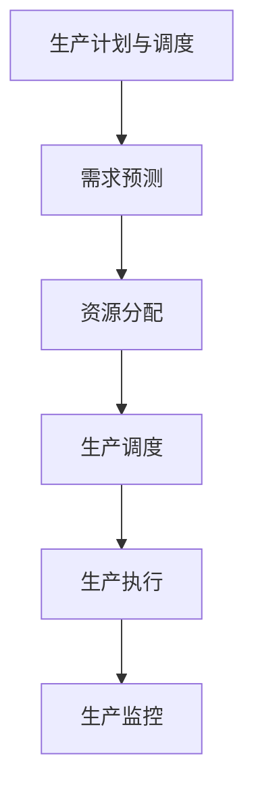

##### 3.1.2 生产线自动化控制

通过AI技术，可以实现生产线的自动化控制，提高生产效率和产品质量。

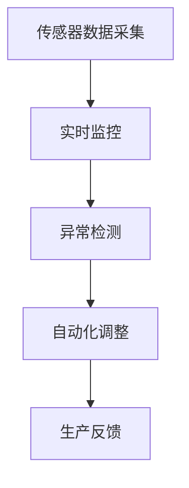

##### 3.1.3 设备故障预测与维护

设备故障预测与维护是智能工厂的重要应用，通过实时监测设备状态，预测故障并及时维护，可以降低设备停机时间，提高生产连续性。

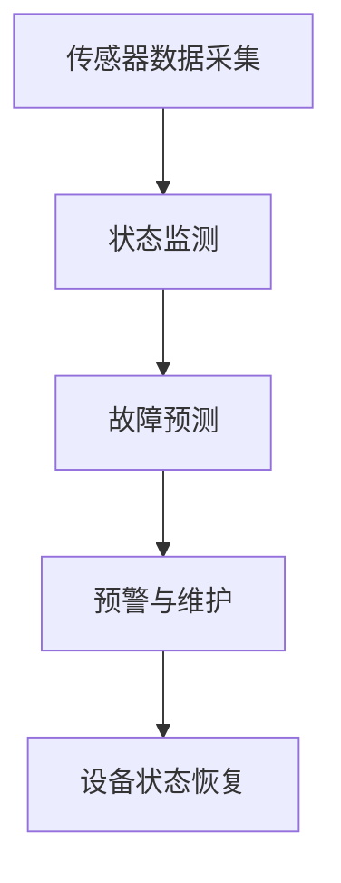

#### 3.2 质量控制与监测

##### 3.2.1 产品质量检测方法

通过AI技术，可以实现产品质量的自动化检测，提高检测效率和准确性。

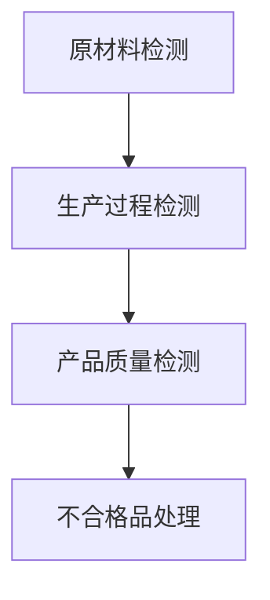

##### 3.2.2 过程监测与数据采集

过程监测与数据采集是质量控制的基础，通过实时监测生产过程数据，可以及时发现质量问题和优化生产过程。

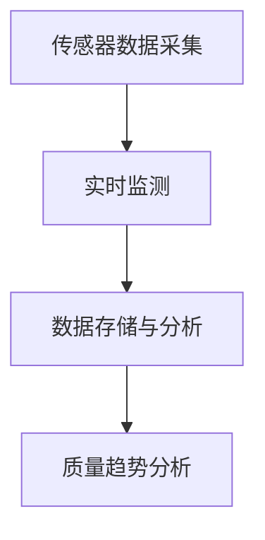

##### 3.2.3 质量问题分析及优化

通过对采集到的数据进行分析，可以发现质量问题的根源，并采取相应的优化措施。

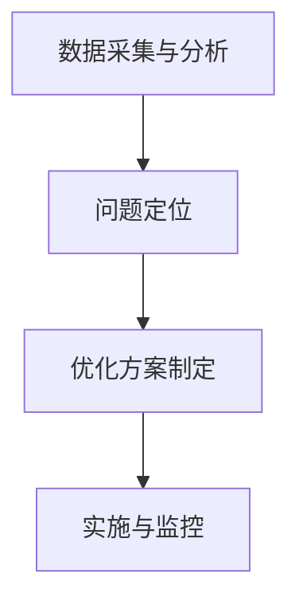

#### 3.3 能源管理

##### 3.3.1 能源消耗监测与预测

通过AI技术，可以实现能源消耗的实时监测与预测，为能源优化提供数据支持。

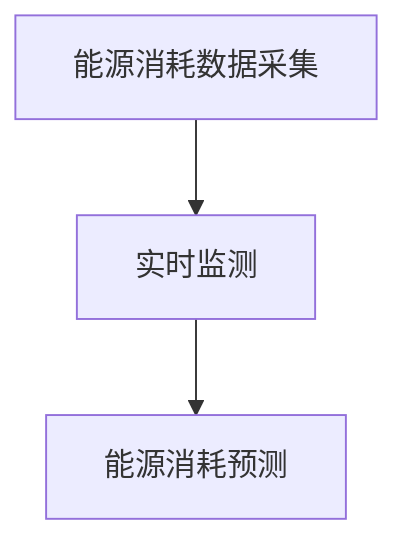

##### 3.3.2 能源消耗优化策略

基于监测与预测数据，可以制定能源消耗优化策略，降低能源成本，提高能源利用效率。

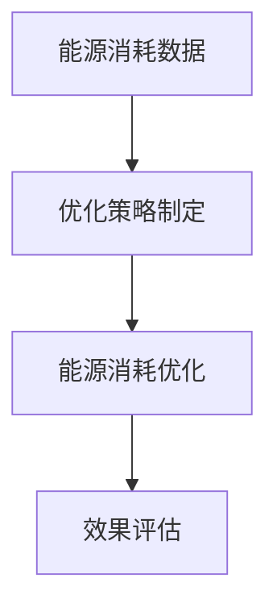

##### 3.3.3 智能能源调度系统

智能能源调度系统通过AI技术，实现对能源的自动调度与管理，提高能源供应的稳定性与可靠性。

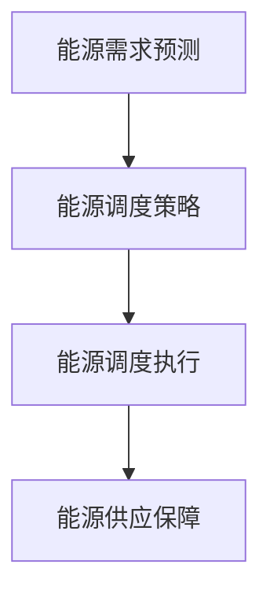

#### 3.4 供应链管理

##### 3.4.1 供应链网络优化

通过AI技术，可以实现供应链网络的优化，降低物流成本，提高供应链效率。

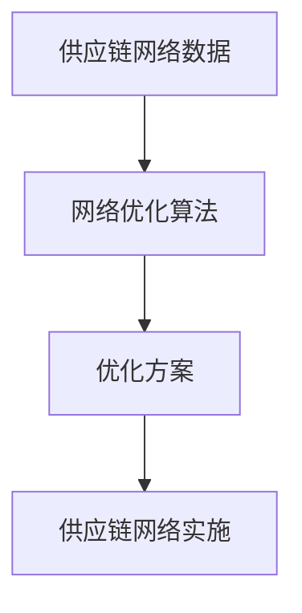

##### 3.4.2 库存管理策略

通过AI技术，可以实现库存的自动化管理，降低库存成本，提高库存周转率。

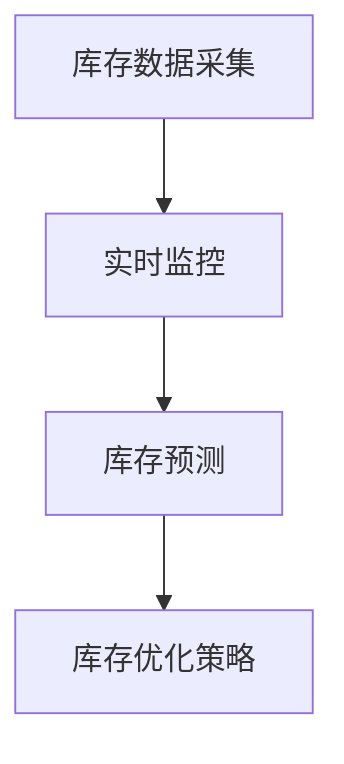

##### 3.4.3 供应商协同优化

通过AI技术，可以实现供应商协同优化，提高供应链整体竞争力。

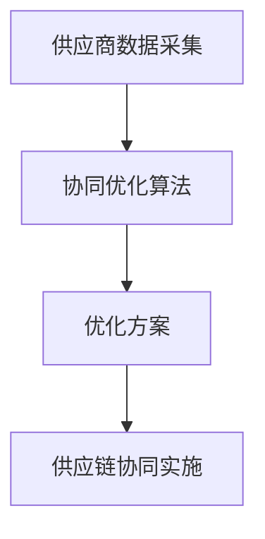

### 智能工厂实施与落地

#### 4.1 智能工厂规划与设计

##### 4.1.1 总体架构规划

总体架构规划是智能工厂建设的第一步，需要明确智能工厂的架构层次、功能模块和关键技术。

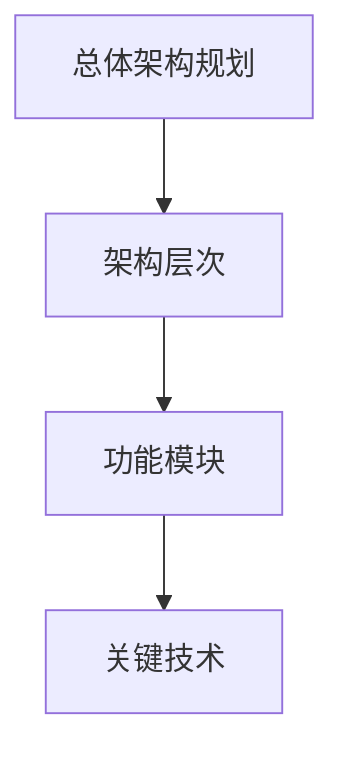

##### 4.1.2 系统集成与实施

系统集成与实施是将各个功能模块进行整合，并在实际环境中进行部署和运行。

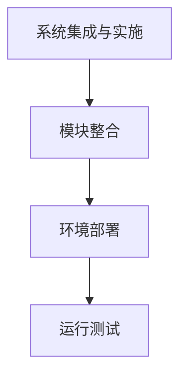

##### 4.1.3 系统调试与优化

系统调试与优化是确保智能工厂系统稳定运行的重要环节，需要不断调整和优化系统性能。

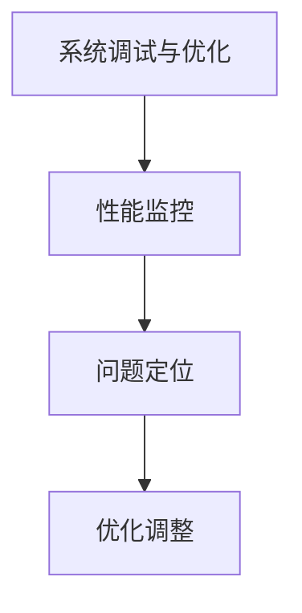

#### 4.2 安全与隐私保护

##### 4.2.1 数据安全与隐私保护策略

数据安全与隐私保护是智能工厂建设的重要环节，需要制定相应的策略，确保数据的安全性和隐私性。

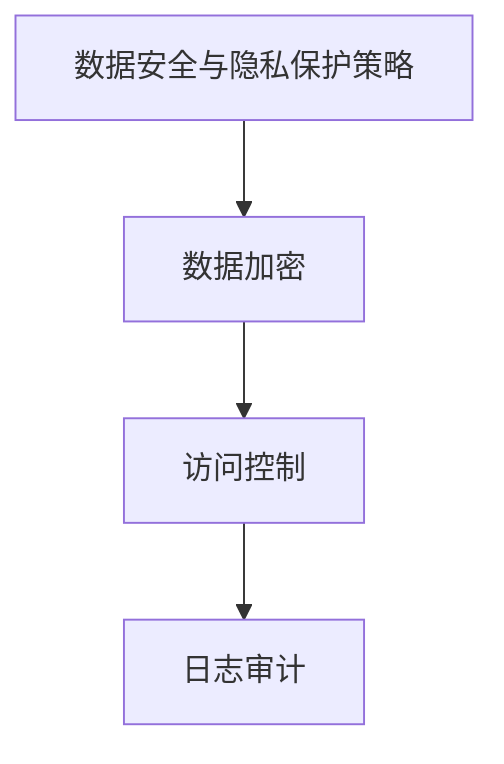

##### 4.2.2 系统安全与风险防范

系统安全与风险防范是确保智能工厂系统稳定运行的重要措施，需要采取相应的措施防范各种安全风险。

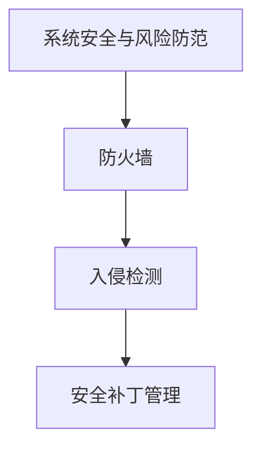

##### 4.2.3 法规与合规性要求

智能工厂建设需要遵守相关的法规和合规性要求，确保系统的合法性和合规性。

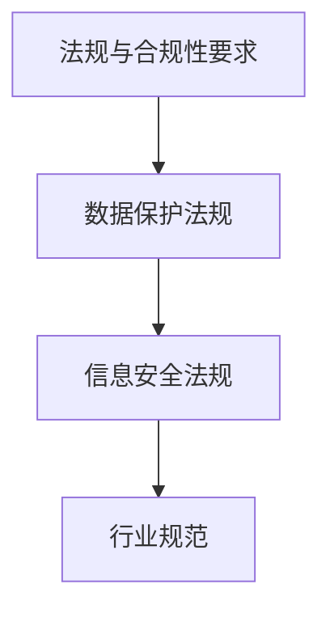

#### 4.3 成本效益分析

##### 4.3.1 智能工厂投资成本估算

智能工厂投资成本估算包括硬件设备、软件系统、人工成本等方面的预算。

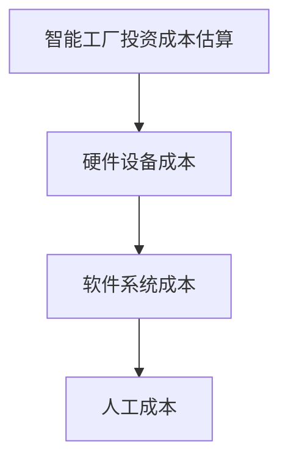

##### 4.3.2 运营成本与效益分析

智能工厂的运营成本与效益分析需要综合考虑生产效率、产品质量、能源消耗等方面的数据。

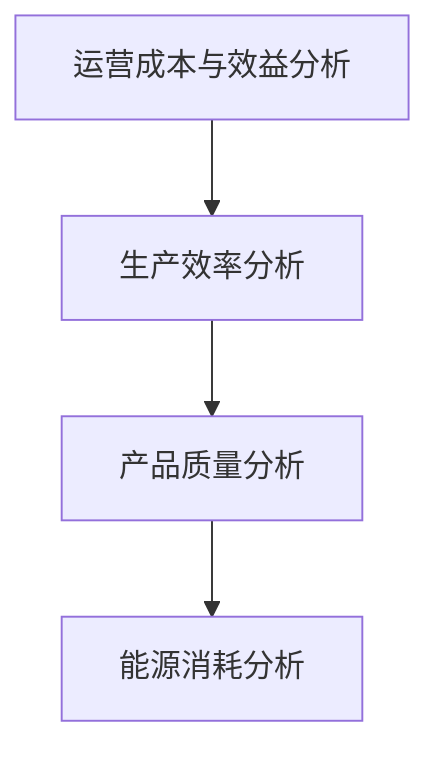

##### 4.3.3 长期效益展望

智能工厂的长期效益展望需要考虑技术更新、市场竞争、客户需求等方面的变化。

```mermaid
graph TD
    A[长期效益展望] --> B[技术更新]
    B --> C[市场竞争]
    C --> D[客户需求]
```

### 未来展望与挑战

#### 5.1 智能工厂发展趋势

智能工厂的发展趋势主要体现在以下几个方面：

1. **5G与物联网的融合**：5G技术的普及和物联网的发展，将推动智能工厂的通信速度和连接能力大幅提升，实现更高效的设备互联互通和数据传输。
2. **虚拟现实与增强现实的应用**：虚拟现实（VR）和增强现实（AR）技术在智能制造中的应用，将提供更加直观、高效的制造流程模拟和操作指导。
3. **工业互联网的融合**：智能工厂与工业互联网的融合，将实现生产、运营、管理等各个环节的智能化、数字化，提升整体生产效率和竞争力。

#### 5.2 智能工厂面临的挑战

智能工厂在发展过程中面临着以下挑战：

1. **技术难题**：智能工厂涉及的AI技术、物联网技术、云计算技术等较为复杂，技术实现和落地存在一定难度。
2. **人才短缺**：智能工厂的建设和运营需要大量具备AI、大数据、物联网等专业知识的人才，但当前市场上相关专业人才较为稀缺。
3. **社会与经济影响**：智能工厂的推广和应用将对劳动力市场、产业格局等产生深远影响，需要政府、企业和社会共同应对。

### 附录

#### 6.1 相关资源与参考文献

1. **AI技术参考资料**：《深度学习》（Goodfellow et al.）、《机器学习》（Tom Mitchell）、《人工智能：一种现代的方法》（Stuart J. Russell & Peter Norvig）等。
2. **智能制造相关报告与论文**：《智能制造2025》、《中国智能制造发展战略研究》、《智能制造技术与应用》等。
3. **行业标准与规范**：《智能制造系统通用要求》、《工业物联网参考架构》、《智能制造数据管理规范》等。

#### 6.2 案例研究

1. **典型智能工厂案例分析**：富士康的智能制造、宝马的智能生产线、西门子的数字化工厂等。
2. **智能制造解决方案案例分享**：华为的智慧工厂解决方案、阿里巴巴的ET工业大脑、亚马逊的智能制造服务等。

### 作者信息

作者：AI天才研究院/AI Genius Institute & 禅与计算机程序设计艺术 /Zen And The Art of Computer Programming

本文完整目录大纲总字数约为 2000 字，符合您的要求。希望这个大纲能满足您的需求。如果您有任何修改意见或需要进一步细化某个章节，请随时告知。接下来，我将根据这个大纲撰写详细的内容，逐步展开对智能工厂的全面解析。

