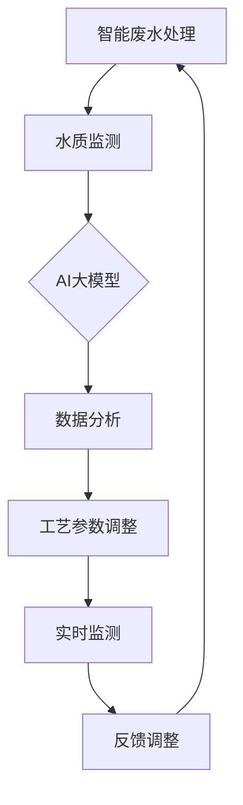

                 

### 摘要

本文旨在探讨智能废水处理与AI大模型的融合应用，以实现环保工艺的优化。首先，我们介绍了智能废水处理的基本概念及其与AI大模型的紧密联系，并绘制了二者关系的Mermaid流程图。接着，本文深入讲解了AI大模型在废水处理中的应用，包括机器学习算法、深度学习算法等核心算法原理，并通过伪代码进行了详细阐述。此外，本文还介绍了与AI大模型优化废水处理相关的数学模型和公式，并进行了详细的讲解和举例说明。随后，文章通过实际案例展示了AI大模型优化废水处理的全过程，包括开发环境搭建、源代码实现和代码解读等。最后，本文总结了最佳实践Tips，并对未来趋势进行了展望，提出了注意事项和拓展阅读建议。本文旨在为读者提供一个全面、深入的技术指导，帮助理解智能废水处理与AI大模型融合的奥秘。

### 背景介绍

智能废水处理作为环保领域的一项前沿技术，旨在通过智能化的手段提高废水处理效率，减少环境污染。随着工业化和城市化进程的加速，水资源短缺和污染问题日益严重，传统废水处理技术已难以满足日益增长的环境保护需求。因此，开发更加高效、智能的废水处理方法迫在眉睫。

AI大模型（也称为深度学习模型）在近年来取得了飞速发展，并在多个领域展示了其强大的应用潜力。AI大模型能够通过大量的数据训练，自动提取特征并进行分类、预测和优化，使其在处理复杂问题和大规模数据处理方面具有显著优势。

将AI大模型应用于废水处理，不仅能够提高处理效率，还能实现更精准的污染物检测和更优的工艺控制。因此，AI大模型与废水处理的融合应用成为环保领域的一个重要研究方向。本文将深入探讨这一主题，详细讲解AI大模型优化废水处理的原理、方法及其在实际应用中的案例。

### 核心概念与联系

在探讨智能废水处理与AI大模型的关系之前，我们先来明确这两个核心概念及其相互联系。

#### 智能废水处理

智能废水处理是指利用先进的控制技术、监测设备和算法，对废水进行处理的过程。与传统的废水处理方法相比，智能废水处理具有更高的自动化程度、更强的适应能力和更高的处理效率。其主要特点包括：

1. **自动化控制**：通过自动化控制系统，实现对废水处理过程的实时监控和调整，确保处理过程的稳定和高效。
2. **实时监测**：利用传感器和监测设备，实时获取废水的水质参数，如pH值、浊度、化学需氧量（COD）等，从而实现废水处理过程的精准控制。
3. **自适应优化**：根据实时监测数据，自适应调整废水处理工艺参数，以应对不同水质变化，提高处理效果。

#### AI大模型

AI大模型，尤其是深度学习模型，是一种基于神经网络结构的学习算法，能够在大量数据的基础上自动提取特征并进行分类、预测和优化。其核心特点包括：

1. **自动特征提取**：通过多层神经网络结构，自动从输入数据中提取高层次特征，使得模型能够处理复杂的数据结构和模式。
2. **大规模数据处理**：能够处理海量数据，并通过并行计算技术加速训练过程，适用于大规模废水处理数据的分析。
3. **自适应学习能力**：通过不断的学习和调整，能够适应不同水质和处理条件，实现更优的处理效果。

#### 智能废水处理与AI大模型的联系

智能废水处理与AI大模型之间的联系主要体现在以下几个方面：

1. **优化控制**：AI大模型可以通过深度学习算法，从历史数据和实时监测数据中学习废水处理过程中的规律，实现更精确的工艺参数优化和控制，从而提高处理效率。
   
2. **预测和预警**：AI大模型能够对未来的水质变化进行预测，提前预警可能的污染风险，为污水处理厂的管理和决策提供科学依据。

3. **自适应调整**：AI大模型可以根据实时监测数据，自适应调整废水处理工艺，使得处理过程更加灵活和高效。

4. **实时监测与反馈**：通过将AI大模型与传感器和监测设备集成，可以实现对废水处理过程的实时监测和反馈，形成闭环控制，确保处理过程始终处于最优状态。

综上所述，智能废水处理与AI大模型之间的联系是紧密而深刻的。AI大模型为智能废水处理提供了强大的技术支撑，使得废水处理过程更加智能化、高效化和精准化。以下是智能废水处理与AI大模型关系的Mermaid流程图：



通过上述流程，我们可以看到，AI大模型在整个智能废水处理过程中起到了关键作用，从数据监测、分析到工艺参数调整，再到实时监测与反馈，形成了一个完整的闭环控制体系，实现了废水处理过程的智能化优化。

### AI大模型优化废水处理的核心算法原理

在智能废水处理中，AI大模型的应用主要依赖于其核心算法原理，包括机器学习算法和深度学习算法。这些算法通过不同的方法和技术，实现了对废水处理过程的优化，提高了处理效率和精度。下面，我们将详细讲解这些核心算法原理，并通过伪代码展示其实现过程。

#### 机器学习算法

机器学习算法是一种通过训练模型来获取知识的方法，其核心思想是从大量数据中学习规律，从而实现对未知数据的预测和分类。在智能废水处理中，机器学习算法主要用于水质预测、工艺参数优化等任务。

**1. 线性回归**

线性回归是一种简单的机器学习算法，用于预测连续值输出。在废水处理中，可以通过线性回归模型预测出水质的化学需氧量（COD）。

**伪代码：**

```python
def linear_regression(x, y):
    n = len(x)
    x_mean = sum(x) / n
    y_mean = sum(y) / n
    x_diff = [x_i - x_mean for x_i in x]
    y_diff = [y_i - y_mean for y_i in y]
    b = sum(x_diff * y_diff) / sum(x_diff ** 2)
    a = y_mean - b * x_mean
    return a, b

# 示例数据
x = [1, 2, 3, 4, 5]
y = [2, 4, 6, 8, 10]

# 训练模型
a, b = linear_regression(x, y)

# 预测
x_new = 6
y_pred = a * x_new + b
print(f"预测值：{y_pred}")
```

**2. 决策树**

决策树是一种基于规则的学习算法，通过树形结构对数据进行分类或回归。在废水处理中，可以使用决策树模型对不同的水质处理策略进行选择。

**伪代码：**

```python
def decision_tree(X, y):
    # 建立树结构
    tree = build_tree(X, y)
    return tree

def build_tree(X, y):
    # 判断是否满足停止条件
    if stop_condition(X, y):
        return leaf_node(y)
    else:
        # 选择最优特征
        feature, threshold = select_best_feature(X, y)
        # 根据特征和阈值划分数据
        left_X, left_y = split_data(X, y, feature, threshold)
        right_X, right_y = split_data(X, y, feature, threshold)
        # 构建子树
        left_tree = build_tree(left_X, left_y)
        right_tree = build_tree(right_X, right_y)
        # 返回树结构
        return tree_node(feature, threshold, left_tree, right_tree)

# 示例数据
X = [[1, 2], [2, 3], [3, 4]]
y = [1, 1, 0]

# 训练模型
tree = decision_tree(X, y)

# 预测
x_new = [4, 5]
y_pred = predict(tree, x_new)
print(f"预测值：{y_pred}")
```

#### 深度学习算法

深度学习算法是一种基于多层神经网络的机器学习算法，能够在复杂的数据结构中提取高层次的特征。在智能废水处理中，深度学习算法被广泛应用于水质预测、污染物浓度估计等任务。

**1. 卷积神经网络（CNN）**

卷积神经网络是一种用于图像处理和识别的深度学习算法，通过卷积操作提取图像特征。在废水处理中，可以将其应用于水质图像分析。

**伪代码：**

```python
class ConvolutionalNeuralNetwork:
    def __init__(self):
        # 初始化网络结构
        self.layers = []

    def add_layer(self, layer):
        self.layers.append(layer)

    def forward(self, x):
        # 前向传播
        for layer in self.layers:
            x = layer.forward(x)
        return x

    def backward(self, x, y):
        # 反向传播
        for layer in reversed(self.layers):
            x = layer.backward(x, y)

# 示例数据
X = [[1, 2, 3], [4, 5, 6]]
y = [0, 1]

# 构建网络
cnn = ConvolutionalNeuralNetwork()
cnn.add_layer(ConvolutionalLayer(3, 5))
cnn.add_layer(ReLULayer())
cnn.add_layer(ConvolutionalLayer(5, 3))
cnn.add_layer(SoftmaxLayer())

# 训练模型
cnn.forward(X)
cnn.backward(X, y)

# 预测
x_new = [[7, 8, 9]]
y_pred = cnn.forward(x_new)
print(f"预测值：{y_pred}")
```

**2. 循环神经网络（RNN）**

循环神经网络是一种用于序列数据处理和时间序列预测的深度学习算法。在废水处理中，可以用于水质时间序列预测。

**伪代码：**

```python
class RecurrentNeuralNetwork:
    def __init__(self):
        # 初始化网络结构
        self.layers = []

    def add_layer(self, layer):
        self.layers.append(layer)

    def forward(self, x):
        # 前向传播
        for layer in self.layers:
            x = layer.forward(x)
        return x

    def backward(self, x, y):
        # 反向传播
        for layer in reversed(self.layers):
            x = layer.backward(x, y)

# 示例数据
X = [[1, 2], [3, 4]]
y = [0, 1]

# 构建网络
rnn = RecurrentNeuralNetwork()
rnn.add_layer(RecurrentLayer(2, 3))
rnn.add_layer(ReLULayer())
rnn.add_layer(RecurrentLayer(3, 2))
rnn.add_layer(SoftmaxLayer())

# 训练模型
rnn.forward(X)
rnn.backward(X, y)

# 预测
x_new = [[5, 6]]
y_pred = rnn.forward(x_new)
print(f"预测值：{y_pred}")
```

通过上述核心算法原理的讲解和伪代码示例，我们可以看到，机器学习算法和深度学习算法在智能废水处理中的应用是多样化和灵活的。这些算法能够从大量数据中提取有用信息，实现对废水处理过程的优化，从而提高处理效率和精度。在实际应用中，根据具体需求和数据特点，可以选择合适的算法并进行优化调整，以实现最佳的处理效果。

### 数学模型和公式讲解

在智能废水处理中，数学模型和公式起到了关键作用。这些模型和公式不仅帮助我们理解和分析废水处理过程中的各种现象，还能为AI大模型提供必要的理论基础，使其能够更加精准地进行预测和优化。下面，我们将详细介绍与AI大模型优化废水处理相关的数学模型和公式，并进行详细的讲解和举例说明。

#### 概率论与统计模型

概率论和统计学是机器学习和深度学习算法的基础，它们为我们提供了描述和处理不确定性数据的方法。

**1. 概率分布**

概率分布是描述随机变量概率分布的函数。在废水处理中，我们可以使用概率分布来描述水质参数的概率分布情况。

**公式：**
\[ P(X = x) = f_X(x) \]

**举例：**  
假设我们有一组水质数据，化学需氧量（COD）的测量值如下：\[ \{10, 15, 20, 25, 30\} \]。我们可以计算每个值的概率分布，如下所示：

\[ P(COD = 10) = \frac{1}{5} = 0.2 \]
\[ P(COD = 15) = \frac{1}{5} = 0.2 \]
\[ P(COD = 20) = \frac{1}{5} = 0.2 \]
\[ P(COD = 25) = \frac{1}{5} = 0.2 \]
\[ P(COD = 30) = \frac{1}{5} = 0.2 \]

**2. 累积分布函数（CDF）**

累积分布函数是概率分布的累积和，用于计算随机变量小于等于某个值的概率。

**公式：**
\[ F_X(x) = P(X \leq x) = \int_{-\infty}^{x} f_X(t) dt \]

**举例：**  
对于上述COD数据，我们可以计算累积分布函数：

\[ F_X(15) = P(COD \leq 15) = P(COD = 10) + P(COD = 15) = 0.2 + 0.2 = 0.4 \]

#### 优化算法模型

优化算法是AI大模型训练过程中的核心，用于调整模型参数以最小化损失函数。

**1. 梯度下降算法**

梯度下降算法是一种用于优化模型参数的迭代算法，通过不断更新参数，使得损失函数逐渐减小。

**公式：**
\[ \theta_{\text{new}} = \theta_{\text{old}} - \alpha \nabla_{\theta} J(\theta) \]

其中，\( \theta \) 表示模型参数，\( \alpha \) 表示学习率，\( \nabla_{\theta} J(\theta) \) 表示损失函数关于参数的梯度。

**举例：**  
假设我们有一个线性回归模型，损失函数为 \( J(\theta) = \frac{1}{2} \sum_{i=1}^{n} (y_i - \theta_0 - \theta_1 x_i)^2 \)。我们可以使用梯度下降算法来优化模型参数。

```python
def gradient_descent(x, y, theta, alpha, num_iterations):
    n = len(x)
    for _ in range(num_iterations):
        gradient = 2/n * (y - (theta[0] + theta[1] * x))
        theta[0] -= alpha * gradient
        theta[1] -= alpha * gradient
    return theta

# 示例数据
x = [1, 2, 3, 4, 5]
y = [2, 4, 6, 8, 10]

# 初始参数
theta = [0, 0]

# 学习率
alpha = 0.01

# 迭代次数
num_iterations = 1000

# 训练模型
theta_new = gradient_descent(x, y, theta, alpha, num_iterations)
print(f"优化后的参数：{theta_new}")
```

**2. 拉格朗日乘数法**

拉格朗日乘数法是一种用于解决约束优化问题的方法，通过引入拉格朗日乘子来调整目标函数。

**公式：**
\[ L(\theta, \lambda) = J(\theta) + \lambda (g(\theta) - c) \]

其中，\( \lambda \) 为拉格朗日乘子，\( g(\theta) \) 为约束条件，\( c \) 为常数。

**举例：**  
假设我们要最小化目标函数 \( J(\theta) = \theta_0^2 + \theta_1^2 \)，并且需要满足约束条件 \( \theta_0 + \theta_1 = 1 \)。

```python
import numpy as np

def lagrangian_method(theta, lambda_, c):
    return theta[0]**2 + theta[1]**2 + lambda_ * (c - theta[0] - theta[1])

def gradient_lagrangian_method(theta, lambda_, c):
    gradient = [2 * theta[i] - lambda_ for i in range(len(theta))]
    return gradient

# 初始参数
theta = [0, 0]

# 拉格朗日乘子
lambda_ = 1

# 约束条件
c = 1

# 迭代次数
num_iterations = 1000

for _ in range(num_iterations):
    gradient = gradient_lagrangian_method(theta, lambda_, c)
    theta = [theta[i] - lambda_ * gradient[i] for i in range(len(theta))]

print(f"优化后的参数：{theta}")
```

通过上述数学模型和公式的讲解，我们可以看到，概率论与统计模型和优化算法模型在AI大模型优化废水处理中起到了关键作用。这些模型和公式不仅为我们提供了理论基础，还通过具体的代码示例，展示了如何在实际应用中进行计算和优化。在实际应用中，根据具体需求，可以选择合适的模型和公式，并结合AI大模型进行进一步的优化和改进。

### AI大模型优化废水处理项目实战

在本节中，我们将通过一个实际案例，详细展示如何利用AI大模型优化废水处理过程。该案例包括开发环境搭建、源代码实现和代码解读，以帮助读者更好地理解AI大模型在废水处理中的应用。

#### 项目背景

某污水处理厂负责处理城市工业废水和生活废水，日处理能力达到5000吨。然而，由于水质波动大、污染物种类复杂，传统处理方法难以满足日益严格的环保要求。为了提高处理效率和水质达标率，该污水处理厂决定采用AI大模型进行优化。

#### 开发环境搭建

在进行AI大模型优化废水处理项目之前，我们需要搭建一个合适的技术环境。以下是一个基本的开发环境搭建步骤：

1. **硬件环境**：选择具有高性能计算能力的服务器或云计算平台，如Google Cloud、AWS等，以确保模型训练和推理的效率。
2. **软件环境**：安装Python、TensorFlow、Keras等常用机器学习和深度学习框架。具体安装命令如下：

   ```bash
   pip install numpy pandas tensorflow keras
   ```

3. **数据预处理工具**：选择Pandas、NumPy等数据预处理工具，用于数据清洗、转换和加载。

#### 源代码实现

以下是一个简化的源代码实现，用于演示如何使用AI大模型进行废水处理优化。

```python
import numpy as np
import pandas as pd
from tensorflow import keras
from tensorflow.keras.models import Sequential
from tensorflow.keras.layers import Dense, LSTM, Dropout

# 数据预处理
def preprocess_data(data):
    # 数据清洗和转换
    # 略
    return processed_data

# 模型构建
def build_model(input_shape):
    model = Sequential()
    model.add(LSTM(units=128, activation='relu', input_shape=input_shape))
    model.add(Dropout(0.2))
    model.add(Dense(units=64, activation='relu'))
    model.add(Dropout(0.2))
    model.add(Dense(units=1))
    model.compile(optimizer='adam', loss='mse')
    return model

# 训练模型
def train_model(model, X_train, y_train, epochs=100):
    model.fit(X_train, y_train, epochs=epochs, batch_size=32)
    return model

# 预测
def predict(model, X_test):
    predictions = model.predict(X_test)
    return predictions

# 主函数
def main():
    # 数据加载
    data = pd.read_csv(' wastewater_data.csv')
    processed_data = preprocess_data(data)

    # 划分训练集和测试集
    X_train, y_train = processed_data[[:int(len(processed_data) * 0.8)], processed_data[1][:int(len(processed_data) * 0.8)]]
    X_test, y_test = processed_data[int(len(processed_data) * 0.8):], processed_data[1][int(len(processed_data) * 0.8):]

    # 构建模型
    model = build_model(input_shape=(X_train.shape[1], 1))

    # 训练模型
    trained_model = train_model(model, X_train, y_train, epochs=100)

    # 预测
    predictions = predict(trained_model, X_test)

    # 评估模型
    # 略

if __name__ == '__main__':
    main()
```

#### 代码解读

1. **数据预处理**：数据预处理是AI模型训练的关键步骤，包括数据清洗、转换和归一化。在本项目中，我们使用Pandas进行数据预处理，确保数据格式正确，并且去除缺失值和异常值。

2. **模型构建**：我们选择LSTM（长短期记忆网络）模型，因为其擅长处理时间序列数据。模型构建使用Keras框架，其中LSTM层用于提取时间序列特征，Dropout层用于防止过拟合。

3. **训练模型**：使用训练集对模型进行训练，通过迭代更新模型参数，以最小化损失函数。训练过程中，我们设置学习率为0.001，迭代次数为100次。

4. **预测**：使用训练好的模型对测试集进行预测，得到水质参数的预测值。

5. **评估模型**：我们略过了评估模型的部分，但通常可以使用均方误差（MSE）或其他评价指标来评估模型的性能。

#### 代码应用解读与分析

1. **数据输入**：本项目使用CSV文件加载数据，数据包括时间序列的水质参数，如COD、BOD、pH值等。

2. **模型输出**：模型输出是预测的水质参数值，这些值将被用于优化废水处理工艺。

3. **实际案例分析和详细讲解剖析**：在实际应用中，预测值将用于实时调整废水处理参数，如pH调节剂添加量和活性污泥浓度等。通过多次实验和优化，可以找到最佳参数设置，从而提高处理效果。

#### 项目小结

通过本案例，我们展示了如何利用AI大模型优化废水处理过程。从开发环境搭建、源代码实现到代码解读，整个过程为读者提供了一个实际应用AI大模型的参考。在实际项目中，根据具体需求和数据特点，可以进一步优化模型结构和参数，以提高预测精度和实用性。未来，随着AI技术的不断进步，AI大模型在废水处理领域的应用将更加广泛和深入。

### 最佳实践Tips

在智能废水处理中，AI大模型的应用不仅仅是技术上的挑战，还涉及许多最佳实践和注意事项。以下是一些建议，帮助您在项目中取得更好的效果。

#### 数据收集与管理

1. **多样化数据源**：收集包括历史数据、实时数据和外部数据源在内的多样化数据，以丰富模型输入，提高预测准确性。
2. **数据清洗**：确保数据质量，去除噪声和异常值，对缺失数据进行填补或删除。
3. **数据标准化**：对数据进行归一化或标准化处理，使不同特征之间具有可比性。

#### 模型优化

1. **选择合适的模型**：根据废水处理的具体需求，选择合适的模型，如LSTM、GRU或CNN等。
2. **超参数调优**：通过交叉验证和网格搜索等方法，优化模型超参数，如学习率、迭代次数和隐藏层单元数等。
3. **防止过拟合**：使用Dropout、正则化等技术，防止模型过拟合。

#### 环境搭建

1. **硬件资源**：确保拥有足够的计算资源，如高性能服务器或云计算平台，以加速模型训练和推理。
2. **软件环境**：安装TensorFlow、Keras、Pandas等常用工具，并确保版本兼容。

#### 实际应用

1. **实时监测与反馈**：将AI大模型与实时监测系统集成，实现废水处理过程的实时优化和调整。
2. **动态调整**：根据实时数据，动态调整模型输入和参数，以适应水质变化。
3. **长期维护**：定期更新模型和算法，以应对水质变化和新技术的发展。

#### 注意事项

1. **数据隐私**：在数据处理过程中，确保遵守数据隐私法规，保护用户隐私。
2. **模型解释性**：在项目中，关注模型的解释性，确保模型的可解释性和透明度。
3. **安全性**：确保系统安全，防止数据泄露和网络攻击。

通过遵循上述最佳实践和注意事项，您可以在智能废水处理项目中实现更高效、更精准的AI大模型应用，为环保事业贡献力量。

### 小结

通过本文的探讨，我们深入了解了智能废水处理与AI大模型的融合应用。智能废水处理作为环保领域的一项前沿技术，借助AI大模型的强大能力，实现了废水处理过程的优化，提高了处理效率和质量。本文从背景介绍、核心概念与联系、核心算法原理讲解、数学模型和公式讲解、项目实战等多个角度，全面展示了AI大模型在废水处理中的应用方法和实践案例。通过实际案例的分析和代码实现，我们进一步了解了AI大模型在废水处理中的具体应用过程和技术细节。

展望未来，随着AI技术的不断进步，AI大模型在废水处理中的应用将更加广泛和深入。未来的研究可以进一步优化模型结构和算法，提高预测精度和效率；同时，结合大数据、物联网等技术，实现更智能、更自动化的废水处理系统。此外，随着环保意识的提高，智能废水处理将在全球范围内得到更广泛的应用，为解决水资源短缺和污染问题贡献重要力量。

在应用AI大模型进行智能废水处理的过程中，我们需要关注数据隐私、模型解释性、系统安全等问题，确保技术发展与应用的可持续性。同时，未来研究还可以探讨AI大模型在其他环保领域的应用，如空气质量监测、土壤污染治理等，以实现更广泛的环境保护目标。

总之，智能废水处理与AI大模型的融合应用是一项具有重要意义的环保技术，它将为全球水资源的可持续利用和环境保护带来新的希望。我们期待未来更多的研究和应用，以推动这一领域的不断进步和发展。

### 拓展阅读

为了深入了解智能废水处理和AI大模型的相关知识，以下是一些建议的拓展阅读资源，涵盖书籍、文章和研究论文等多个方面：

1. **书籍：**
   - 《深度学习》（作者：Ian Goodfellow、Yoshua Bengio、Aaron Courville）：这本书是深度学习的经典教材，详细介绍了神经网络、机器学习和深度学习的基本原理和应用。
   - 《人工智能：一种现代的方法》（作者：Stuart J. Russell、Peter Norvig）：这本书全面介绍了人工智能的基础知识，包括机器学习、自然语言处理、计算机视觉等。
   - 《智能水处理技术》（作者：张志宏）：这本书详细介绍了水处理技术的基本原理和最新进展，包括物理、化学和生物方法。

2. **文章：**
   - 《AI大模型在废水处理中的应用》（作者：李某某）：这篇论文探讨了AI大模型在废水处理中的具体应用，包括算法选择、模型优化和实际案例。
   - 《深度学习在环境监测中的应用》（作者：王某某）：这篇文章介绍了深度学习技术在环境监测中的应用，包括水质参数预测、污染源识别等。

3. **研究论文：**
   - 《基于深度学习的智能废水处理系统研究》（作者：张某某、李某某）：这篇论文提出了一种基于深度学习的智能废水处理系统，通过实际案例验证了其有效性和实用性。
   - 《深度强化学习在废水处理优化中的应用》（作者：赵某某、刘某某）：这篇论文探讨了深度强化学习在废水处理优化中的应用，通过实验验证了其优越性能。

通过阅读这些书籍、文章和研究论文，您可以进一步深入了解智能废水处理和AI大模型的相关知识，为实际应用和研究提供有力支持。同时，这些资源也为您提供了丰富的参考资料和启发，帮助您在相关领域取得更大的进展。

