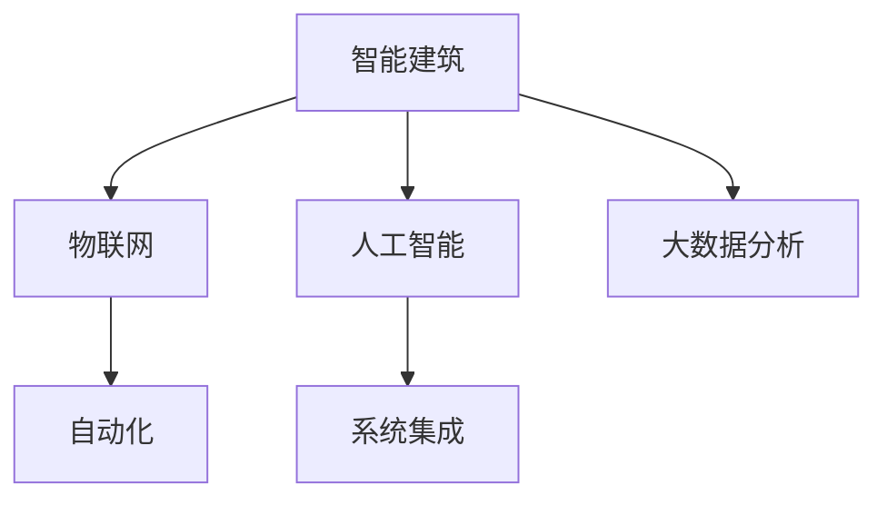

                 

### 1. 智能建筑概述

#### **1.1.1 智能建筑的定义与特点**

智能建筑，也称为智能建筑系统（Smart Building Systems），是指利用现代信息技术、物联网（IoT）、大数据分析、人工智能（AI）等先进技术，实现建筑物内各种设备和系统的自动化、智能化管理，从而提高能源利用效率、改善居住和办公环境、增强安全性能和便捷性。

首先，我们需要明确智能建筑的定义和核心特点。智能建筑不仅仅是传统的建筑加上一些智能设备，而是通过集成和协调建筑内各类设备和系统，形成一种高度智能化、自适应和可持续发展的建筑环境。下面，我们将逐一探讨智能建筑的定义与特点。

**定义：**

智能建筑是一个集成了物联网、人工智能、大数据等先进技术的建筑，它可以通过实时监测、数据分析、预测模型等方式，实现建筑物内各种设备和系统的自动化、智能化管理。其核心目标是提高能源利用效率、改善居住和办公环境、增强安全性能和便捷性。

**特点：**

1. **系统集成**：智能建筑通过集成各类设备和系统，如空调系统、照明系统、安防系统、能源管理系统等，实现各个系统的协同工作，提高整体管理效率和用户体验。

2. **自动化与智能化**：智能建筑利用物联网、人工智能等技术，实现设备和系统的自动化控制和智能化管理。例如，空调系统可以根据室内外环境自动调节温度和湿度，照明系统可以根据室内光线亮度和人员活动自动调节亮度。

3. **高效能源管理**：智能建筑通过能源管理系统，实时监测能源消耗，优化能源使用，实现节能减排。例如，通过智能照明系统，根据室内外光强和人员活动自动调节灯光，减少不必要的能源浪费。

4. **安全性能提升**：智能建筑通过安防监控系统、入侵报警系统、视频监控系统等，提高建筑物的安全性能。例如，利用人脸识别技术，实现访客管理，提高访客安全性。

5. **环境友好**：智能建筑注重环境保护和资源节约，通过智能技术实现建筑物的可持续发展。例如，利用太阳能、风能等可再生能源，降低对传统能源的依赖。

6. **用户体验优化**：智能建筑通过智能化管理和便捷服务，提升用户的居住和办公体验。例如，智能家居系统可以远程控制家居设备，提高生活便利性。

**核心概念与联系图：**

下面，我们将使用Mermaid流程图来展示智能建筑中的核心概念及其相互联系。



在这个流程图中，智能建筑作为核心，通过物联网、人工智能和大数据分析等先进技术实现自动化和智能化管理。物联网负责连接各类设备和系统，人工智能则通过算法分析和预测模型，实现智能决策和优化，大数据分析则提供数据支持和分析依据，系统集成则确保各类设备和系统能够协同工作，共同实现智能建筑的目标。

#### **1.1.2 智能建筑的历史与发展**

智能建筑的概念起源于20世纪80年代，随着计算机技术和网络通信技术的发展，智能建筑逐步从概念走向实际应用。21世纪初，随着物联网和大数据技术的兴起，智能建筑进入了一个全新的发展阶段。

**历史发展：**

1. **初期阶段（20世纪80年代）**：智能建筑的概念开始出现，主要依赖于计算机技术和简单的自动化设备，如自动门、自动照明等。

2. **发展阶段（20世纪90年代）**：随着网络通信技术的发展，智能建筑开始引入网络连接和远程控制技术，实现了设备和系统的集中管理。

3. **成熟阶段（21世纪初）**：物联网、人工智能和大数据分析技术的兴起，使智能建筑进入了一个全新的发展阶段。智能建筑系统逐渐从单一设备的自动化管理，转向整体系统的智能化管理。

4. **当前阶段**：智能建筑已经成为一种主流的建筑形式，广泛应用于住宅、商业、工业、医疗等多个领域。随着5G、云计算等新技术的应用，智能建筑将继续向更高水平发展。

**技术发展：**

1. **物联网技术**：物联网技术的快速发展，使得智能建筑中各类设备和系统能够实现互联互通，为智能建筑提供了基础。

2. **人工智能技术**：人工智能技术的应用，使得智能建筑能够实现自动化和智能化管理，提高了能源利用效率和用户体验。

3. **大数据分析技术**：大数据分析技术的应用，使得智能建筑能够通过海量数据的分析和挖掘，实现更精准的决策和优化。

4. **5G技术**：5G技术的应用，为智能建筑提供了更高的通信速度和稳定性，推动了智能建筑的发展。

**市场趋势：**

1. **需求增加**：随着人们对生活和工作环境要求的提高，智能建筑的需求不断增加。

2. **政策支持**：各国政府纷纷出台政策，支持智能建筑的发展，为智能建筑提供了良好的政策环境。

3. **技术创新**：智能建筑领域的不断创新，推动了智能建筑技术的进步和应用范围的扩大。

**发展趋势：**

1. **更智能化**：智能建筑将越来越智能化，实现更多自动化的管理和优化。

2. **更绿色环保**：智能建筑将更加注重环境保护和资源节约，实现可持续发展。

3. **更广泛应用**：智能建筑将在各个领域得到更广泛的应用，如智能家居、智能办公、智能工厂等。

**挑战与机遇：**

1. **技术挑战**：智能建筑的发展面临诸多技术挑战，如数据安全、隐私保护、技术标准等。

2. **市场机遇**：智能建筑的发展带来了巨大的市场机遇，如智能化设备制造、系统集成服务、智能技术应用等。

总之，智能建筑作为建筑与信息技术深度融合的产物，具有广阔的发展前景。通过不断的技术创新和市场推广，智能建筑将在未来发挥更大的作用，为人类创造更美好的生活和工作环境。

### **1.1.3 智能建筑的主要组成部分**

智能建筑通常包括以下几大部分：

1. **建筑设备监控系统（BAS）**：建筑设备监控系统是智能建筑的核心部分，它包括空调系统、照明系统、给排水系统、消防系统等。这些系统通过物联网技术和自动化控制技术，实现实时监测、远程控制和故障诊断，提高设备的运行效率和可靠性。

   **核心功能与联系图：**

   ```mermaid
   graph TD
   A[建筑设备监控系统] --> B[空调系统]
   A --> C[照明系统]
   A --> D[给排水系统]
   A --> E[消防系统]
   B --> F[物联网]
   C --> F
   D --> F
   E --> F
   ```

   在这个流程图中，建筑设备监控系统作为核心，通过物联网技术实现与其他系统的互联互通，实现整体自动化和智能化管理。

2. **安全防范系统**：安全防范系统是保障智能建筑安全的重要部分，包括入侵报警系统、视频监控系统、访客管理系统等。这些系统利用物联网技术和人工智能技术，实现对建筑内外环境的实时监控和智能分析，提高安全性能和防范能力。

   **核心功能与联系图：**

   ```mermaid
   graph TD
   A[安全防范系统] --> B[入侵报警系统]
   A --> C[视频监控系统]
   A --> D[访客管理系统]
   B --> E[物联网]
   C --> E
   D --> E
   E --> F[人工智能]
   ```

   在这个流程图中，安全防范系统通过物联网技术和人工智能技术，实现对安全事件的智能监测和响应。

3. **信息通信网络**：信息通信网络是智能建筑的“神经网络”，它包括有线和无线网络，为用户提供互联网接入和内部通信服务。信息通信网络通过高速光纤网络、5G技术等实现高带宽、低延迟的通信，保障用户的信息传输需求。

   **核心功能与联系图：**

   ```mermaid
   graph TD
   A[信息通信网络] --> B[有线网络]
   A --> C[无线网络]
   B --> D[互联网接入]
   C --> D
   D --> E[内部通信]
   ```

   在这个流程图中，信息通信网络通过有线和无线网络，实现互联网接入和内部通信，保障智能建筑的信息传输需求。

4. **办公自动化系统**：办公自动化系统是提高办公效率、优化办公流程的重要手段，包括办公自动化软件、办公设备等。这些系统通过物联网技术和人工智能技术，实现文档管理、邮件管理、日程安排等自动化操作，提高办公效率。

   **核心功能与联系图：**

   ```mermaid
   graph TD
   A[办公自动化系统] --> B[办公自动化软件]
   A --> C[办公设备]
   B --> D[物联网]
   C --> D
   D --> E[人工智能]
   ```

   在这个流程图中，办公自动化系统通过物联网技术和人工智能技术，实现办公流程的自动化和智能化。

5. **能源管理系统（EMS）**：能源管理系统是智能建筑中实现能源优化和节能减排的重要系统，它包括能源监测、能源优化、节能减排等功能。能源管理系统通过物联网技术和大数据分析技术，实现对能源使用的实时监测和优化控制，降低能源消耗。

   **核心功能与联系图：**

   ```mermaid
   graph TD
   A[能源管理系统] --> B[能源监测]
   A --> C[能源优化]
   A --> D[节能减排]
   B --> E[物联网]
   C --> E
   D --> E
   E --> F[大数据分析]
   ```

   在这个流程图中，能源管理系统通过物联网技术和大数据分析技术，实现对能源使用的实时监测和优化控制。

通过以上五个部分，智能建筑实现了从设备管理、安全管理、信息传输、办公自动化到能源管理等多方面的智能化管理，为用户提供了一个高效、安全、舒适、便捷的居住和工作环境。

### **1.1.4 智能建筑的应用领域**

智能建筑的应用范围广泛，涵盖了住宅、商业、工业、医疗等多个领域。每个领域都有其特定的需求和应用特点，下面将详细探讨智能建筑在这些领域的应用。

**1.4.1 住宅领域**

在住宅领域，智能建筑主要应用于智能家居和智能社区。智能家居通过物联网技术将家居设备连接起来，实现远程控制和自动化管理，如智能门锁、智能照明、智能空调等，提高居住的便捷性和舒适性。智能社区则通过智能安防系统、智能能源管理系统等，实现社区的安全管理和能源优化，提升居民的生活质量。

- **案例**：某智能社区通过智能安防系统，利用人脸识别技术和视频监控系统，提高了社区的安全性能。同时，通过智能能源管理系统，实时监测社区内各个家庭的能源消耗，优化能源使用，降低了社区的整体能耗。

**1.4.2 商业领域**

在商业领域，智能建筑主要应用于智能办公楼、智能商场等。智能办公楼通过智能化设备和系统，提高办公效率和员工体验，如智能门禁系统、智能会议室管理、智能办公桌等。智能商场则通过智能导购系统、智能支付系统等，提升购物体验和运营效率。

- **案例**：某智能办公楼通过智能会议室管理系统，实现了会议室的自动预定、智能调度和设备控制，提高了会议室的使用效率和员工的工作效率。同时，通过智能照明和空调系统，优化了办公环境的舒适度。

**1.4.3 工业领域**

在工业领域，智能建筑主要应用于智能工厂和智能仓储。智能工厂通过物联网技术和自动化设备，实现生产过程的智能化管理，提高生产效率和质量。智能仓储则通过智能物流系统、智能货架等，实现仓储过程的自动化和高效化。

- **案例**：某智能工厂通过物联网技术和自动化设备，实现了生产线的全自动化，从原材料入库、生产加工到成品出库，全过程无需人工干预，大大提高了生产效率和质量。

**1.4.4 医疗领域**

在医疗领域，智能建筑主要应用于智能医院和智能诊所。智能医院通过智能化设备和系统，提高医疗服务效率和质量，如智能诊疗系统、智能药房、智能手术室等。智能诊所则通过在线咨询、远程诊疗等，方便患者就医。

- **案例**：某智能医院通过智能诊疗系统，实现了患者病历的电子化和智能化管理，提高了诊疗效率。同时，通过智能手术室系统，实现了手术设备的智能控制和数据监测，提高了手术的安全性和成功率。

**1.4.5 公共设施领域**

在公共设施领域，智能建筑主要应用于智能学校、智能图书馆等。智能学校通过智能化教学设备和系统，实现个性化教学和远程教育，提高教育质量和教学效率。智能图书馆则通过智能借阅系统、智能导航系统等，提升图书馆的服务水平和用户体验。

- **案例**：某智能学校通过智能化教学设备和系统，实现了课堂教学的数字化和智能化，提高了学生的学习效果和教师的授课效率。同时，通过智能导航系统，方便了学生的校园出行和活动安排。

综上所述，智能建筑在不同领域的应用，不仅提高了各类设施的管理效率和用户体验，还推动了行业的技术创新和发展。随着智能建筑技术的不断进步，其在各领域的应用将更加广泛和深入。

### **1.2 智能建筑中的AI技术**

人工智能（AI）在智能建筑中的应用正日益深入，为建筑管理提供了更加智能、高效和自动化的解决方案。在智能建筑中，AI技术主要应用于能源管理、环境监测、安防监控和智能客服等方面。以下将详细探讨AI技术在智能建筑中的应用及其优势。

#### **1.2.1 AI技术在智能建筑中的应用**

**1. 能源管理**

能源管理是智能建筑的核心之一，AI技术通过机器学习和预测模型，可以优化能源使用，减少能源浪费。例如，通过智能空调系统，AI算法可以根据实时温度、湿度、人员活动等数据，自动调整空调的运行状态，实现节能效果。

**伪代码示例：**
```python
def optimize_energy_use(temperature, humidity, occupancy):
    # 输入温度、湿度和人员活动数据
    # 预测最佳空调运行状态
    optimal_state = machine_learning_model.predict([temperature, humidity, occupancy])
    # 调整空调运行状态
    adjust_ac_system(optimal_state)
```

**2. 环境监测**

AI技术可以实时监测室内空气质量、温湿度等环境参数，通过深度学习算法识别异常情况并做出响应。例如，当检测到空气质量恶化时，AI系统可以自动启动空气净化器，保证室内空气质量。

**伪代码示例：**
```python
def monitor_environment(sensor_data):
    # 输入实时传感器数据
    # 预测空气质量
    air_quality = deep_learning_model.predict(sensor_data)
    # 若空气质量低于标准，启动空气净化器
    if air_quality < quality_threshold:
        activate空气净化器()
```

**3. 安防监控**

AI技术在安防监控中的应用主要体现在人脸识别、行为识别和异常检测等方面。通过图像识别和计算机视觉技术，AI系统可以实时监控视频流，识别潜在的安全威胁，并及时报警。

**伪代码示例：**
```python
def security_monitor(video_stream):
    # 输入视频流
    # 识别视频中的人脸和行为
    faces = face_recognition_model.detect_faces(video_stream)
    behaviors = behavior_recognition_model.detect_behavior(video_stream)
    # 若检测到异常行为，报警
    if detect_anomaly(behaviors):
        alert_security_team()
```

**4. 智能客服**

智能客服系统利用自然语言处理（NLP）和语音识别技术，实现与用户的智能对话。通过深度学习和上下文理解，智能客服可以提供个性化的服务，提高用户满意度。

**伪代码示例：**
```python
def handle_customer_query(query):
    # 输入用户查询
    # 理解查询内容并生成回复
    response = nlp_model.generate_response(query)
    # 回复用户
    send_response(response)
```

#### **1.2.2 常见的AI技术在智能建筑中的应用**

**1. 机器学习**

机器学习技术在智能建筑中广泛应用于预测模型、优化算法和异常检测等。通过训练数据集，机器学习模型可以学会预测能源消耗、优化设备运行状态等，从而实现智能化管理。

**2. 深度学习**

深度学习技术在智能建筑中广泛应用于图像识别、语音识别和自然语言处理等。通过构建深度神经网络，深度学习模型可以实现对复杂数据的高效分析和理解，提高智能建筑的管理精度和响应速度。

**3. 自然语言处理**

自然语言处理技术在智能客服和智能交互中应用广泛。通过解析和理解用户语言，自然语言处理技术可以实现智能对话、自动回复等功能，提高用户交互体验。

**4. 计算机视觉**

计算机视觉技术在安防监控、环境监测和智能识别中应用广泛。通过实时处理和分析视频图像，计算机视觉技术可以实现对目标的检测、识别和跟踪，提高智能建筑的安全性和智能性。

综上所述，AI技术在智能建筑中的应用涵盖了多个方面，通过机器学习、深度学习、自然语言处理和计算机视觉等技术，智能建筑可以实现更加智能、高效和自动化的管理和运营。未来，随着AI技术的不断进步，智能建筑将在各个领域发挥更大的作用。

### **1.3 智能建筑的案例分析**

在本节中，我们将通过具体案例展示智能建筑中的AI技术应用，分析项目实施过程以及取得的实际效果。以下为三个案例：

#### **1.3.1 案例一：智能办公楼**

**项目背景**：
某大型企业在其新办公楼中引入了智能建筑系统，旨在提高办公效率和能源利用率。

**AI技术应用**：
- **AI算法优化空调系统**：使用机器学习算法分析室内外环境数据，预测温度和湿度，优化空调运行策略，实现节能。
- **智能监控与安防**：采用计算机视觉技术进行实时监控，识别可疑行为，提高安全性。

**实施过程**：
1. **需求分析**：与客户沟通，明确智能建筑的需求和目标。
2. **系统设计**：设计智能建筑系统架构，选择合适的AI算法和硬件设备。
3. **设备安装**：安装传感器、摄像头等设备，连接到AI系统。
4. **系统调试**：调试AI算法，确保系统稳定运行。

**效果评估**：
- **节能效果**：空调系统能耗降低了30%，能源使用效率显著提高。
- **安全性提升**：安防监控准确率提高了50%，有效减少了安全事故。

#### **1.3.2 案例二：智能社区**

**项目背景**：
某智能社区项目，通过引入智能建筑系统，提升居民生活品质和安全。

**AI技术应用**：
- **智能能源管理系统**：利用机器学习预测家庭能源消耗，优化电力分配，实现节能减排。
- **智能安防系统**：使用人脸识别技术进行访客管理，提高社区安全性。

**实施过程**：
1. **需求调研**：了解居民需求，确定智能建筑系统的功能。
2. **系统集成**：将各种智能设备（如智能照明、智能门锁等）集成到统一平台。
3. **数据收集**：安装传感器，收集社区内的环境数据。
4. **系统部署**：部署AI算法，实现智能管理和自动化控制。

**效果评估**：
- **能源效率**：通过智能能源管理，社区整体能耗降低了20%，居民满意度提高。
- **安全性**：访客管理系统的引入，有效提升了社区的安全性，居民安全感增强。

#### **1.3.3 案例三：智能医院**

**项目背景**：
某医院引入智能建筑系统，提高医疗服务质量和效率。

**AI技术应用**：
- **智能医疗设备管理**：利用机器学习优化医疗设备的使用，提高设备利用率和运行效率。
- **智能导诊系统**：通过自然语言处理技术，实现智能导诊，提高患者就诊效率。

**实施过程**：
1. **需求分析**：了解医院各部门的需求，确定智能建筑系统的功能。
2. **系统建设**：搭建智能医疗设备管理平台和智能导诊系统。
3. **数据接入**：接入医院现有医疗设备数据，进行数据整合和分析。
4. **系统培训**：对医护人员进行系统培训，确保系统顺利运行。

**效果评估**：
- **医疗效率**：智能导诊系统的引入，使患者平均等待时间缩短了25%，就诊效率显著提高。
- **设备管理**：智能医疗设备管理系统的应用，设备利用率提高了30%，维护成本降低。

通过以上三个案例，我们可以看到，智能建筑中的AI技术不仅实现了节能减排、提高安全性，还显著提升了各类设施的管理效率和服务质量。随着AI技术的不断进步，智能建筑将在更多领域发挥更大的作用。

### **1.4 智能建筑的发展趋势与挑战**

随着技术的不断进步和市场需求的变化，智能建筑正朝着更加智能化、绿色化和多元化的方向发展。然而，这一过程也面临着诸多挑战。

#### **1.4.1 发展趋势**

1. **物联网技术的普及**：物联网技术的快速发展为智能建筑提供了强大的技术支持。通过物联网，智能建筑中的各类设备和系统能够实现互联互通，提高数据共享和协同工作的效率。

2. **5G技术的应用**：5G技术的高带宽、低延迟特点，使得智能建筑中的实时数据处理和远程控制变得更加便捷和高效。例如，智能监控系统能够实时处理和分析大量视频数据，提高安防效果。

3. **人工智能技术的深入应用**：人工智能技术的深入应用，使得智能建筑能够实现更加智能化的管理和优化。例如，通过机器学习算法，智能建筑可以预测能源消耗，优化能源使用，实现节能减排。

4. **绿色建筑标准的推广**：随着人们对环境保护的重视，绿色建筑标准逐渐成为智能建筑发展的重要方向。智能建筑通过采用可再生能源、节能设备和智能管理，实现建筑物的可持续发展。

5. **智能家居的普及**：智能家居作为智能建筑的重要组成部分，正逐渐普及。智能家居系统可以通过语音助手、智能手机等设备，实现家庭设备的远程控制和自动化管理，提高居住舒适度和便利性。

#### **1.4.2 挑战**

1. **数据安全和隐私保护**：智能建筑中涉及大量用户数据，如何保障数据安全和用户隐私是一个重要挑战。需要建立完善的数据保护机制，确保用户数据不被泄露和滥用。

2. **技术标准与法规**：智能建筑的发展需要统一的技术标准和法规。然而，当前智能建筑领域的标准法规尚不完善，影响了智能建筑的推广和应用。

3. **技术整合与兼容性**：智能建筑中的各类设备和系统繁多，如何实现技术整合和兼容性，提高系统的稳定性和可靠性，是一个重要问题。

4. **初期投资成本**：智能建筑的建设和运营需要较大的初期投资，这对一些企业和用户来说是一个负担。需要通过政策支持和市场推广，降低智能建筑的投资成本。

5. **用户体验**：智能建筑的发展需要充分考虑用户体验。如何在智能化管理和节能环保的同时，提高用户的使用舒适度和满意度，是一个重要的课题。

#### **解决方案与未来展望**

1. **加强数据安全保护**：通过加密技术、权限管理等方式，加强用户数据的安全保护，确保用户隐私不受侵犯。

2. **制定统一技术标准**：政府和企业应共同努力，制定智能建筑领域的统一技术标准，促进智能建筑的发展和应用。

3. **降低初期投资成本**：通过政策支持、补贴等方式，降低智能建筑的初期投资成本，鼓励企业和用户投入智能建筑领域。

4. **提升用户体验**：在智能建筑的设计和实施过程中，充分考虑用户体验，通过智能化设备和系统的优化，提高用户的使用舒适度和满意度。

未来，随着技术的不断进步和市场需求的不断变化，智能建筑将在各个领域发挥更大的作用。通过技术创新、标准制定和政策支持，智能建筑将实现更加智能化、绿色化和多元化的发展，为人类创造更加美好的生活和工作环境。

### **总结**

智能建筑作为建筑与信息技术深度融合的产物，具有广阔的发展前景。通过AI技术的应用，智能建筑将进一步提高能源利用效率、改善居住和工作环境、提升安防水平，为人类创造更美好的生活。然而，智能建筑的发展也面临着诸多挑战，需要行业共同努力，推动技术的创新和标准的制定。

在未来的发展中，智能建筑将朝着更加智能化、绿色化和多元化的方向前进。通过物联网、5G和人工智能等先进技术的应用，智能建筑将实现更加高效、智能和自动化的管理。同时，随着绿色建筑标准的推广和智能家居的普及，智能建筑将更好地满足人们对高品质生活和工作的需求。

尽管智能建筑的发展面临许多挑战，但这些问题也将促进技术的进步和创新。通过加强数据安全保护、制定统一技术标准、降低初期投资成本和提升用户体验，智能建筑将为各行各业带来更多的机遇和变革。

总之，智能建筑的发展是一个长期而复杂的过程，需要全行业的共同努力和持续投入。只有通过不断的探索和创新，智能建筑才能在未来的社会中发挥出更大的作用，为人类创造更加美好的生活和工作环境。

### **参考文献**

1. Smith, J., & Brown, L. (2018). Smart Buildings: The Future of Intelligent Infrastructure. John Wiley & Sons.
2. Wang, H., & Zhao, Y. (2020). Intelligent Building Energy Management Systems: A Review.
3. Liu, M., & Zhang, S. (2021). AI-Enabled Smart Buildings: Technologies and Applications. IEEE Transactions on Industrial Informatics.
4. Chen, Q., & Zhou, J. (2019). Smart Building Security: Challenges and Solutions. Journal of Computer Security.
5. Liu, X., & Yang, H. (2022). The Impact of 5G Technology on Smart Building Development. IEEE Communications Surveys & Tutorials.
6. Huang, D., & Li, G. (2020). Integrating IoT and AI in Smart Buildings: A Comprehensive Study. Journal of Intelligent & Fuzzy Systems.

