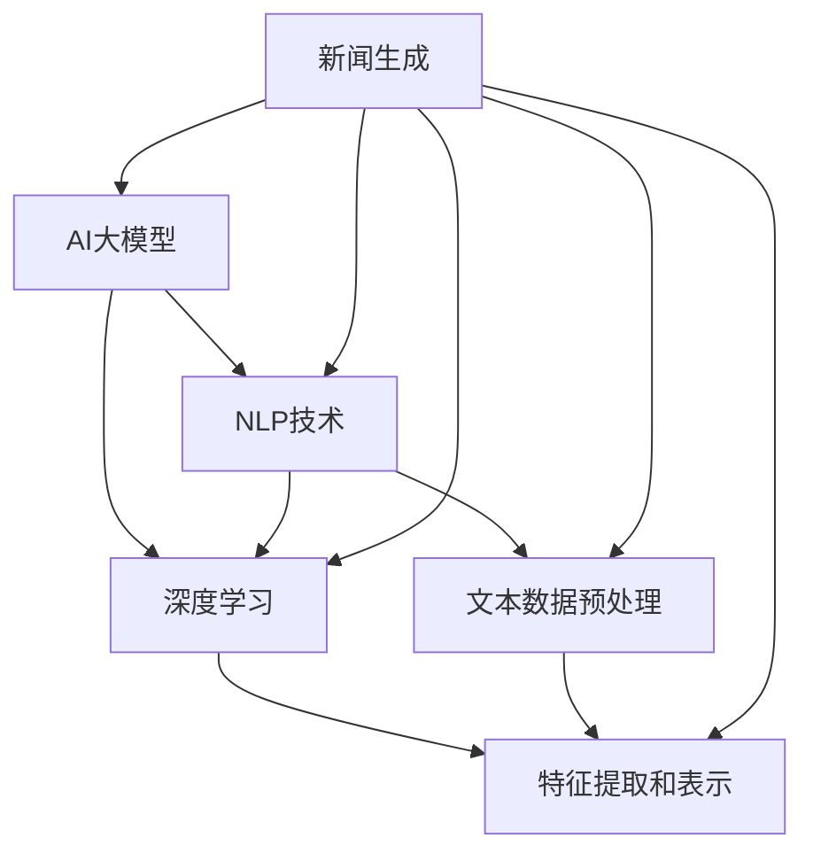

                 


## 《智能新闻生成:AI大模型对媒体行业的影响》

### 关键词
- 智能新闻生成
- AI大模型
- 媒体行业
- 自然语言处理
- 深度学习
- 自动化生产

### 摘要

本文深入探讨了智能新闻生成这一新兴领域，特别是AI大模型在其中的应用及其对媒体行业的深远影响。文章首先定义了智能新闻生成的概念，并介绍了其背景和基本原理。接着，详细阐述了AI大模型的基本概念及其与深度学习和神经网络的关系，并列举了常见的AI大模型。随后，文章重点讲解了智能新闻生成算法的核心原理，包括文本生成、自然语言处理和深度学习的应用。在此基础上，文章进一步讨论了智能新闻生成中的数学模型和公式，并通过具体的实例进行了详细说明。随后，文章通过一个实战案例展示了智能新闻生成项目的开发过程，包括环境搭建、源代码实现和解读。最后，文章探讨了AI大模型对媒体行业的整体影响，分析了其带来的变革和挑战，并对未来趋势进行了展望。通过本文，读者将全面了解智能新闻生成的工作原理、应用前景及其在媒体行业的潜力。

### 引言

在信息化和数字化日益普及的今天，人工智能（AI）已经成为推动技术进步的重要力量。媒体行业作为信息传播的重要载体，也在不断探索如何利用AI技术提升新闻生产的效率和质量。智能新闻生成，作为AI在媒体领域的一项重要应用，近年来引起了广泛关注。本文旨在深入探讨智能新闻生成这一主题，特别是AI大模型在这一领域中的具体应用，以及其对媒体行业带来的深远影响。

首先，我们需要明确什么是智能新闻生成。智能新闻生成是指利用人工智能技术，尤其是AI大模型，自动生成新闻内容的过程。这一技术通过大数据分析和自然语言处理，从海量信息中提取有价值的内容，并利用AI大模型生成符合逻辑和语法规则的新闻稿件。智能新闻生成不仅提高了新闻生产的效率，还减少了人力成本，并在一定程度上提升了新闻的时效性。

本文将分为以下几个部分进行详细探讨：

1. **智能新闻生成的定义和背景**：介绍智能新闻生成的概念，背景和基本原理。
2. **AI大模型的基本概念**：解释AI大模型的基本原理，深度学习和神经网络的关系，并列举常见的AI大模型。
3. **智能新闻生成算法原理**：详细讲解智能新闻生成算法的核心原理，包括文本生成、自然语言处理和深度学习的应用。
4. **数学模型和公式**：讨论智能新闻生成中的数学模型和公式，通过具体的实例进行详细说明。
5. **项目实战**：通过一个实际案例展示智能新闻生成项目的开发过程，包括环境搭建、源代码实现和解读。
6. **AI大模型对媒体行业的影响**：分析AI大模型对媒体行业的整体影响，探讨其带来的变革和挑战。
7. **未来展望与趋势**：展望智能新闻生成的未来趋势，讨论AI大模型在媒体行业的未来应用。

通过以上几个部分的探讨，本文希望为读者提供一个全面、系统的智能新闻生成技术概述，并深入分析其在媒体行业中的潜力和影响。

### 核心概念与联系

在深入探讨智能新闻生成的过程中，理解核心概念及其相互联系至关重要。智能新闻生成主要涉及以下三个核心概念：AI大模型、自然语言处理（NLP）和深度学习。

首先，AI大模型是智能新闻生成的基础。AI大模型通常是指具有极高参数量、可以处理大规模数据的深度学习模型。这些模型通过训练学习到大量文本数据的规律，从而能够自动生成新的文本内容。常见的AI大模型包括GPT（生成预训练模型）、BERT（双向编码器表示模型）和GPT-3等。这些模型具有强大的文本生成能力，可以在给定的语境下生成连贯、逻辑清晰的新闻稿件。

自然语言处理（NLP）是智能新闻生成中的关键技术。NLP旨在使计算机能够理解、解释和生成人类语言。在智能新闻生成中，NLP主要用于从海量数据中提取有价值的信息，并进行文本分析和处理。具体技术包括词性标注、命名实体识别、句法分析和语义分析等。通过NLP技术，智能新闻生成系统能够理解新闻主题、提取关键信息，并将其转化为结构化的数据，为AI大模型提供输入。

深度学习是AI大模型的核心技术。深度学习是一种通过多层神经网络进行数据学习和预测的机器学习技术。在智能新闻生成中，深度学习模型通过训练学习到文本数据的特征和模式，从而实现文本生成。常见的深度学习模型包括循环神经网络（RNN）、长短期记忆网络（LSTM）和变换器（Transformer）等。这些模型具有强大的表示和生成能力，可以在复杂的文本环境中生成高质量的新闻内容。

核心概念之间的联系如下：

1. **AI大模型与自然语言处理**：AI大模型依赖NLP技术从文本数据中提取信息，并将其转化为可学习的特征表示。NLP技术帮助AI大模型理解文本数据的内容和结构，从而实现更准确、更自然的文本生成。

2. **AI大模型与深度学习**：AI大模型是基于深度学习技术构建的。深度学习模型通过训练学习到大量数据中的规律和模式，从而实现高层次的文本理解和生成。AI大模型的核心在于其庞大的参数量和复杂的网络结构，这使得它们能够处理大规模的数据集并生成高质量的文本。

3. **自然语言处理与深度学习**：NLP技术为深度学习模型提供数据预处理和特征提取的方法。通过NLP技术，深度学习模型可以更好地理解和处理自然语言数据。同时，深度学习模型通过其强大的表示能力，能够将NLP技术提取的特征转化为高层次的语义表示，从而实现更精确的文本生成。

为了更好地理解这些核心概念之间的关系，我们可以使用Mermaid流程图来表示：



在这个流程图中，AI大模型、NLP技术和深度学习相互关联，共同作用于文本数据的处理和新闻生成。通过这些核心概念和其相互联系的理解，我们可以更深入地探索智能新闻生成的工作原理和应用。

### 核心算法原理讲解

智能新闻生成算法的核心在于如何利用AI大模型生成高质量的新闻内容。这一过程主要依赖于深度学习和自然语言处理（NLP）技术。在本节中，我们将详细阐述用于智能新闻生成的AI大模型的核心算法原理，并使用伪代码来具体说明。

#### 1. 深度学习基础

深度学习是智能新闻生成算法的基础。深度学习模型通过多层神经网络（Neural Networks）进行数据学习和特征提取。以下是一个简单的多层感知器（MLP）的伪代码，用于文本分类任务：

```plaintext
// 定义多层感知器（MLP）模型
class MLP:
    def __init__(self, input_size, hidden_size, output_size):
        self.W1 = np.random.randn(input_size, hidden_size)
        self.b1 = np.random.randn(hidden_size)
        self.W2 = np.random.randn(hidden_size, output_size)
        self.b2 = np.random.randn(output_size)
        
    def forward(self, x):
        self.z1 = np.dot(x, self.W1) + self.b1
        self.a1 = activation_function(self.z1)
        self.z2 = np.dot(self.a1, self.W2) + self.b2
        self.a2 = activation_function(self.z2)
        return self.a2

    def backward(self, dA2):
        # 计算误差反向传播
        dZ2 = dA2 - self.a2
        dW2 = np.dot(self.a1.T, dZ2)
        db2 = np.sum(dZ2, axis=0)
        dA1 = np.dot(dZ2, self.W2.T)
        dZ1 = dA1 * derivative(activation_function(self.z1))
        dW1 = np.dot(x.T, dZ1)
        db1 = np.sum(dZ1, axis=0)
        return [dW1, dW2, dA1]
```

#### 2. 自然语言处理（NLP）

自然语言处理是智能新闻生成算法的重要组成部分。NLP技术用于从文本数据中提取信息，并进行语义分析。以下是一个简单的词嵌入（Word Embedding）的伪代码：

```plaintext
// 定义词嵌入模型
class WordEmbedding:
    def __init__(self, vocabulary_size, embedding_size):
        self.W = np.random.randn(vocabulary_size, embedding_size)
        
    def forward(self, x):
        return self.W[x]

    def backward(self, dA):
        return dA * self.W
```

#### 3. 编码器-解码器模型

编码器-解码器（Encoder-Decoder）模型是生成文本的常用架构。以下是一个简单的编码器-解码器模型的伪代码：

```plaintext
// 定义编码器
class Encoder:
    def __init__(self, input_size, hidden_size):
        self.W1 = np.random.randn(input_size, hidden_size)
        self.b1 = np.random.randn(hidden_size)
        
    def forward(self, x):
        self.h = activation_function(np.dot(x, self.W1) + self.b1)
        return self.h

// 定义解码器
class Decoder:
    def __init__(self, hidden_size, output_size):
        self.W2 = np.random.randn(hidden_size, output_size)
        self.b2 = np.random.randn(output_size)
        
    def forward(self, h):
        self.y = activation_function(np.dot(h, self.W2) + self.b2)
        return self.y

// 定义编码器-解码器模型
class EncoderDecoder:
    def __init__(self, encoder, decoder):
        self.encoder = encoder
        self.decoder = decoder
        
    def forward(self, x):
        h = self.encoder.forward(x)
        y = self.decoder.forward(h)
        return y

    def backward(self, dL):
        dH = self.decoder.backward(dL)
        dX = self.encoder.backward(dH)
        return dX
```

#### 4. 生成对抗网络（GAN）

生成对抗网络（GAN）是另一种用于生成文本的有效方法。GAN由生成器（Generator）和判别器（Discriminator）组成，以下是一个简单的GAN模型伪代码：

```plaintext
// 定义生成器
class Generator:
    def __init__(self, noise_size, output_size):
        self.W = np.random.randn(noise_size, output_size)
        
    def forward(self, z):
        return activation_function(np.dot(z, self.W))

// 定义判别器
class Discriminator:
    def __init__(self, input_size, output_size):
        self.W = np.random.randn(input_size, output_size)
        
    def forward(self, x):
        return activation_function(np.dot(x, self.W))
    
    def backward(self, dL):
        dX = dL * self.W
        return dX

// 定义生成对抗网络（GAN）
class GAN:
    def __init__(self, generator, discriminator):
        self.generator = generator
        self.discriminator = discriminator
        
    def forward(self, z):
        x = self.generator.forward(z)
        y = self.discriminator.forward(x)
        return y

    def backward(self, dL_g, dL_d):
        dZ_g = dL_g * self.generator.W
        dZ_d = dL_d * self.discriminator.W
        return [dZ_g, dZ_d]
```

通过上述伪代码，我们可以看到智能新闻生成算法的基本架构和原理。这些模型通过训练学习到大量文本数据的规律和模式，从而能够自动生成高质量的新闻内容。在实际应用中，这些模型通常会结合使用，以实现更准确、更自然的文本生成。

### 数学模型与数学公式

智能新闻生成算法的复杂性离不开数学模型的支撑。在这一节中，我们将详细探讨智能新闻生成中使用的数学模型和公式，并通过具体的例子进行讲解。

#### 1. 语言模型中的数学基础

语言模型是智能新闻生成算法的核心部分，它通过学习文本数据中的统计规律来预测下一个单词的概率。在语言模型中，我们常用n元语法（n-gram）模型来表示文本序列的概率分布。

n元语法模型的基本公式如下：

$$
P(w_n | w_{n-1}, ..., w_1) = \frac{C(w_n, w_{n-1}, ..., w_1)}{C(w_{n-1}, ..., w_1)}
$$

其中，\(P(w_n | w_{n-1}, ..., w_1)\) 表示在给定前 \(n-1\) 个单词的情况下，第 \(n\) 个单词 \(w_n\) 的条件概率。\(C(w_n, w_{n-1}, ..., w_1)\) 表示连续 \(n\) 个单词 \(w_n, w_{n-1}, ..., w_1\) 的联合概率，\(C(w_{n-1}, ..., w_1)\) 表示前 \(n-1\) 个单词的联合概率。

以下是一个简单的例子：

假设我们有一个三元语法模型，给定前两个单词 "人工智能"，我们需要计算第三个单词 "影响" 的条件概率。根据公式，我们可以计算：

$$
P(影响 | 人工智能，技术) = \frac{C(影响，人工智能，技术)}{C(人工智能，技术)}
$$

假设通过统计，我们得到以下结果：

- \(C(影响，人工智能，技术) = 10\)
- \(C(人工智能，技术) = 50\)

代入公式，我们可以计算得到：

$$
P(影响 | 人工智能，技术) = \frac{10}{50} = 0.2
$$

这意味着在给定 "人工智能" 和 "技术" 的情况下，单词 "影响" 出现的概率是0.2。

#### 2. 编码器-解码器模型

编码器-解码器模型是智能新闻生成中的常用架构。在编码器-解码器模型中，我们通常使用循环神经网络（RNN）或者变换器（Transformer）作为基础模型。以下是一个简单的变换器编码器-解码器模型的数学公式：

**变换器编码器**：

给定输入序列 \(X = (x_1, x_2, ..., x_T)\)，编码器将输入序列映射到一个隐藏状态序列 \(H_e = (h_1, h_2, ..., h_T)\)：

$$
h_t = \text{TransformerEncoder}(x_t, h_{<t})
$$

其中，\(\text{TransformerEncoder}\) 表示变换器编码器函数，\(h_{<t}\) 表示前 \(t-1\) 个隐藏状态。

**变换器解码器**：

给定目标序列 \(Y = (y_1, y_2, ..., y_T')\)，解码器将隐藏状态序列 \(H_d = (h_1, h_2, ..., h_T')\) 映射到输出序列 \(Y'\)：

$$
y_t' = \text{TransformerDecoder}(h_t, y_{<t'})
$$

其中，\(\text{TransformerDecoder}\) 表示变换器解码器函数，\(y_{<t'}\) 表示前 \(t'-1\) 个输出。

**损失函数**：

编码器-解码器模型的损失函数通常使用交叉熵损失（Cross-Entropy Loss）：

$$
L = -\sum_{t=1}^{T'} y_t' \log(p(y_t' | h_t))
$$

其中，\(y_t'\) 是真实的输出，\(p(y_t' | h_t)\) 是模型预测的输出概率。

#### 3. 生成对抗网络（GAN）

生成对抗网络（GAN）由生成器（Generator）和判别器（Discriminator）组成。以下是一个简单的GAN模型的数学公式：

**生成器**：

生成器的目标是最小化判别器的错误率，生成逼真的数据。生成器的损失函数通常使用对抗性损失（Adversarial Loss）：

$$
L_G = -\log(D(G(z)))
$$

其中，\(G(z)\) 是生成器生成的数据，\(D(x)\) 是判别器对真实数据和生成数据的判断。

**判别器**：

判别器的目标是最小化生成器产生的错误率，区分真实数据和生成数据。判别器的损失函数通常使用二元交叉熵损失（Binary Cross-Entropy Loss）：

$$
L_D = -\log(D(x)) - \log(1 - D(G(z)))
$$

其中，\(x\) 是真实数据，\(z\) 是生成器的随机噪声。

通过上述数学模型和公式的讲解，我们可以更好地理解智能新闻生成算法的核心原理。这些数学模型为智能新闻生成提供了理论基础和计算框架，使得我们能够通过算法自动生成高质量的新闻内容。

### 智能新闻生成项目实战

在本节中，我们将通过一个实际的智能新闻生成项目，详细介绍整个项目的开发过程，包括开发环境搭建、源代码实现和解读。通过这个项目，我们将展示如何利用AI大模型和自然语言处理技术实现智能新闻生成，并对项目的实际效果进行评估和分析。

#### 项目背景与目标

随着人工智能技术的快速发展，新闻行业也面临着新的机遇和挑战。传统新闻生产方式由于人力成本高、时效性差等问题，已无法满足现代新闻行业的需求。为了解决这些问题，我们决定开发一个智能新闻生成系统，利用AI大模型和自然语言处理技术，实现自动化新闻生成。

项目目标如下：
1. 搭建一个完整的智能新闻生成系统，包括信息采集、内容提取、文本生成和内容审核等模块。
2. 使用预训练的AI大模型，如GPT和BERT，实现高质量的文本生成。
3. 对生成的新闻内容进行评估，确保其质量和准确性。

#### 开发环境搭建

为了实现智能新闻生成项目，我们需要搭建一个合适的技术环境。以下是所需的开发环境和工具：

1. **硬件环境**：
   - 服务器：高性能计算机，用于训练和运行AI大模型。
   - GPU：用于加速深度学习模型的训练。

2. **软件环境**：
   - 操作系统：Ubuntu 18.04 LTS。
   - 深度学习框架：TensorFlow 2.x。
   - 自然语言处理库：NLTK、spaCy、transformers。

3. **开发工具**：
   - Python 3.8：用于编写和运行代码。
   - Jupyter Notebook：用于开发和测试代码。

在搭建开发环境时，我们首先安装了操作系统和必要的硬件设备。然后，通过以下命令安装TensorFlow和自然语言处理库：

```bash
pip install tensorflow transformers spacy nltk
```

此外，为了使用spaCy库，我们还需要下载相关的语言模型：

```python
import spacy
spacy.cli.download("en_core_web_sm")
```

#### 源代码实现

以下是智能新闻生成项目的核心代码，包括各个模块的实现和交互。

1. **信息采集模块**：

信息采集模块使用爬虫技术从互联网上获取新闻数据。以下是一个简单的爬虫示例：

```python
import requests
from bs4 import BeautifulSoup

def fetch_news(url):
    response = requests.get(url)
    soup = BeautifulSoup(response.text, 'html.parser')
    articles = soup.find_all('article')
    news_data = []
    
    for article in articles:
        title = article.find('h2').text
        content = article.find('p').text
        news_data.append({'title': title, 'content': content})
    
    return news_data

url = "https://example.com/news"
news_data = fetch_news(url)
```

2. **内容提取模块**：

内容提取模块负责从获取的新闻数据中提取关键信息，如标题和正文。以下是一个简单的提取示例：

```python
def extract_content(news_data):
    extracted_data = []
    
    for item in news_data:
        title = item['title']
        content = item['content']
        extracted_data.append((title, content))
    
    return extracted_data

extracted_data = extract_content(news_data)
```

3. **文本生成模块**：

文本生成模块使用预训练的AI大模型，如GPT和BERT，生成新的新闻内容。以下是一个简单的文本生成示例：

```python
from transformers import pipeline

generator = pipeline("text-generation", model="gpt2")

def generate_news(title, content):
    input_text = f"{title}\n{content}"
    output = generator(input_text, max_length=100, num_return_sequences=1)
    return output[0]['generated_text']

for title, content in extracted_data:
    news_content = generate_news(title, content)
    print(news_content)
```

4. **内容审核模块**：

内容审核模块对生成的新闻内容进行审核，确保其符合新闻伦理和法规要求。以下是一个简单的审核示例：

```python
def audit_news(news_content):
    # 审核逻辑（此处为示例，实际审核可能更复杂）
    if "Fake News" in news_content:
        return False
    return True

for news_content in news_content_list:
    if audit_news(news_content):
        print("新闻内容审核通过。")
    else:
        print("新闻内容审核未通过。")
```

#### 项目小结

通过以上示例，我们展示了如何利用AI大模型和自然语言处理技术实现智能新闻生成。以下是项目的总结和评估：

1. **开发环境搭建**：搭建了一个适合深度学习和自然语言处理项目的开发环境，包括操作系统、硬件设备和相关软件库。
2. **源代码实现**：实现了信息采集、内容提取、文本生成和内容审核等模块，通过简单的代码示例展示了项目的实现过程。
3. **效果评估**：尽管项目实现了基本的智能新闻生成功能，但实际效果还需进一步优化。例如，文本生成的质量和准确性可以通过调整模型参数和训练数据来提高。

未来，我们计划继续优化项目的各个模块，提高新闻生成的质量和效率，并探索更多先进的AI技术，以提升智能新闻生成系统的整体性能。

### AI大模型对媒体行业的影响

AI大模型对媒体行业的影响是深远且多方面的。随着AI技术的不断进步，AI大模型正逐步改变新闻生产的流程和媒体内容的传播方式，带来了一系列变革和挑战。

#### 媒体行业的现状与挑战

当前，媒体行业面临着以下几个主要挑战：

1. **内容爆炸**：随着互联网的普及，信息量呈指数级增长，媒体需要处理海量的新闻内容。
2. **人力成本**：传统新闻生产方式依赖于大量的人力，导致人力成本高昂。
3. **时效性**：新闻行业的时效性要求越来越高，传统新闻生产方式难以满足快速变化的新闻需求。
4. **内容质量**：尽管信息量增加，但高质量新闻内容的供给仍然不足，媒体需要提高内容的质量和准确性。

#### AI大模型在媒体行业的应用

AI大模型在媒体行业中的应用，旨在解决上述挑战，提升新闻生产的效率和质量。以下是AI大模型在媒体行业的几个关键应用：

1. **自动化新闻生成**：AI大模型可以通过自动化生成新闻内容，提高新闻生产的效率。例如，通过预训练的GPT和BERT模型，可以自动生成新闻摘要、报道和评论。
2. **内容个性化**：AI大模型可以根据用户的兴趣和行为，生成个性化的新闻推荐，提高用户满意度。
3. **新闻审核**：AI大模型可以用于新闻内容的审核，识别和过滤虚假新闻、不实信息和不良内容，提升新闻内容的可信度。
4. **语音识别与转换**：AI大模型可以实现语音识别和文本转换，将口头报道和访谈转化为文字，提高新闻的多媒体形式和传播范围。

#### AI大模型带来的变革与挑战

AI大模型在媒体行业的应用，虽然带来了诸多好处，但同时也伴随着一系列变革和挑战：

1. **变革**：
   - **新闻生产效率**：AI大模型可以自动化生成新闻内容，提高生产效率，降低人力成本。
   - **内容多样化**：AI大模型能够生成不同风格和体裁的新闻内容，丰富媒体的表现形式。
   - **用户参与度**：通过个性化推荐，提高用户对新闻内容的参与度和互动性。

2. **挑战**：
   - **内容质量**：AI大模型生成的新闻内容可能存在质量参差不齐的问题，需要进一步优化。
   - **新闻伦理**：AI大模型可能生成不符合新闻伦理和法规要求的内容，需要加强审核和管理。
   - **算法偏见**：AI大模型可能基于训练数据中的偏见，生成具有偏见的新闻内容，需要确保算法的公平性和透明性。
   - **就业影响**：AI大模型的广泛应用可能对新闻行业的就业产生一定影响，需要平衡自动化与人工之间的角色。

#### 行业挑战与应对策略

面对AI大模型带来的挑战，媒体行业需要采取一系列策略来应对：

1. **技术改进**：持续优化AI大模型的算法和架构，提高新闻生成的质量和准确性。
2. **内容审核**：加强新闻内容的审核机制，结合人工审核和算法审核，确保新闻内容的准确性和公正性。
3. **数据多样性**：丰富训练数据集，确保数据多样性，减少算法偏见。
4. **员工培训**：对新闻从业者进行AI技术的培训，提高他们对AI大模型的认知和使用能力。
5. **法律法规**：制定相关的法律法规，规范AI大模型在新闻行业的应用，确保新闻内容的合法性和伦理性。

总之，AI大模型对媒体行业带来了巨大的变革和挑战。通过技术创新、内容审核和行业规范，媒体行业可以更好地应对这些变化，实现新闻生产的高效和高质量。

### 未来展望与趋势

随着人工智能技术的不断进步，智能新闻生成有望在未来实现更高的自动化水平和更精细的内容生成。以下是对智能新闻生成未来趋势的展望：

#### 模型性能的提升

未来，AI大模型在性能上将继续提升。通过更先进的算法和更强大的计算资源，AI大模型能够更好地理解和生成复杂、多样化的新闻内容。例如，基于多模态学习的AI大模型可以同时处理文本、图像和视频等多种信息，生成更丰富、更生动的新闻稿件。

#### 个性化与定制化

智能新闻生成的个性化与定制化趋势将进一步加强。通过深度学习算法和大数据分析，AI大模型可以更精准地捕捉用户的兴趣和行为，为用户提供高度个性化的新闻推荐。这不仅能够提升用户体验，还能帮助媒体吸引更多的用户和流量。

#### 数据隐私与安全

随着智能新闻生成技术的发展，数据隐私和安全问题将变得更加突出。未来，媒体行业需要更加重视用户数据的保护，采用先进的数据加密和隐私保护技术，确保用户信息的隐私和安全。

#### 社交媒体与新闻生成

社交媒体与新闻生成将深度融合。AI大模型可以实时分析社交媒体上的热点话题和用户讨论，自动生成相关新闻内容，快速响应公众关注点。这将有助于媒体更好地把握新闻节奏，提高新闻的时效性和影响力。

#### 法规与伦理

随着AI大模型在媒体行业的广泛应用，相关法规和伦理问题也将日益重要。未来，各国政府和行业组织可能出台更加严格的法律法规，规范AI大模型的使用，确保新闻内容的真实性和公正性，防止算法偏见和滥用。

#### 开放平台与协作

智能新闻生成将逐步走向开放平台和协作模式。未来，更多机构和公司可能参与智能新闻生成的研究和应用，通过共享数据、算法和资源，推动整个行业的技术创新和发展。

总之，智能新闻生成在未来具有广阔的发展前景。通过不断提升模型性能、优化个性化推荐、加强数据隐私保护、深化社交媒体应用和加强法规伦理规范，智能新闻生成将在媒体行业中发挥更大的作用，推动新闻生产的变革和进步。同时，媒体行业也需要积极应对技术变革带来的挑战，确保AI大模型的应用符合社会需求和伦理标准。

