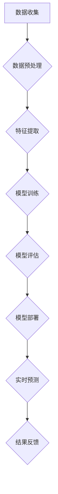

                 

### 文章标题

《智能气象预报：AI大模型提高天气预测准确性》

### 关键词

- 智能气象预报
- AI大模型
- 天气预测准确性
- 深度学习
- 机器学习
- 数据预处理
- 特征提取
- 模型优化
- 模型融合
- 实时预测系统

### 摘要

本文旨在探讨如何利用AI大模型提高天气预测的准确性。首先，文章介绍了智能气象预报的背景和重要性，以及当前气象预报面临的挑战。接着，详细介绍了AI大模型的基本概念和核心技术，如深度学习、神经网络架构和机器学习算法。然后，文章分析了AI大模型在气象预报中的应用，包括数据处理、特征提取、模型训练和优化等环节。最后，通过具体案例展示了AI大模型在提高天气预测准确性方面的实际效果，并提出了未来的发展方向和面临的挑战。本文旨在为读者提供一个全面、系统的智能气象预报技术指南。

### 目录

**智能气象预报概述**

1. **气象预报的重要性**
2. **智能气象预报的兴起**
3. **当前气象预报的挑战**

**AI大模型技术基础**

1. **AI大模型概述**
2. **深度学习基础**
3. **神经网络架构**
4. **机器学习算法**

**AI大模型在气象预报中的应用**

1. **数据处理与特征提取**
2. **模型训练与优化**
3. **模型评估与部署**

**提高天气预测准确性的方法**

1. **多模型融合**
2. **新技术应用**

**AI大模型在气象预报中的案例分析**

1. **短期降水预报**
2. **长时期气候变化预测**

**未来展望与挑战**

1. **未来发展趋势**
2. **面临的挑战与解决方案**

---

### 智能气象预报概述

#### 气象预报的重要性

气象预报是天气预报的重要组成部分，其准确性和及时性对人类生活和生产具有重大影响。从农业、交通、水利到军事等领域，气象预报都发挥着至关重要的作用。准确、及时的气象预报有助于减少自然灾害带来的损失，提高防灾减灾能力，保障人民生命财产安全。

#### 智能气象预报的兴起

随着计算机技术和人工智能的飞速发展，传统的气象预报方法逐渐暴露出许多不足，如数据处理的局限性、模型复杂度的限制等。智能气象预报应运而生，它利用AI大模型，通过深度学习、神经网络架构和机器学习算法等先进技术，实现了对气象数据的自动处理和预测。智能气象预报不仅提高了预测的准确性，还大大缩短了预测的时间。

#### 当前气象预报的挑战

尽管智能气象预报已经取得了显著进展，但仍然面临着一些挑战：

1. **数据质量**：气象数据的质量直接影响预测的准确性。噪声、缺失值、异常值等问题都会对预测结果产生影响。
2. **模型复杂度**：AI大模型通常需要大量的计算资源和训练时间，这对于实时预测系统来说是一个巨大的挑战。
3. **天气变化的不可预测性**：天气系统本身具有高度复杂性和随机性，这使得精确预测变得极其困难。

### AI大模型技术基础

#### AI大模型概述

AI大模型是指利用深度学习和神经网络架构等技术，对大规模数据进行训练和优化的模型。这些模型通常具有极高的复杂度和强大的表达能力，可以处理和理解大量复杂的数据模式。

#### 深度学习基础

深度学习是AI大模型的核心技术之一。它通过模拟人脑神经网络的工作方式，逐层提取数据特征，从而实现对数据的自动学习和理解。深度学习的关键在于神经网络的架构设计和优化算法。

#### 神经网络架构

神经网络架构是深度学习的基础。常见的神经网络架构包括：

1. **全连接神经网络（FCNN）**：最简单的神经网络结构，所有神经元都与其他神经元相连。
2. **卷积神经网络（CNN）**：用于图像识别等任务，具有局部感知能力和平移不变性。
3. **循环神经网络（RNN）**：用于处理序列数据，如时间序列分析等。

#### 机器学习算法

机器学习算法是AI大模型的训练和优化方法。常见的机器学习算法包括：

1. **监督学习**：通过已知的输入输出数据对模型进行训练。
2. **无监督学习**：在没有标签数据的情况下，自动发现数据中的模式。
3. **半监督学习**：结合监督学习和无监督学习的优势，使用少量标签数据和大量无标签数据进行训练。

### AI大模型在气象预报中的应用

#### 数据处理与特征提取

1. **数据预处理**：包括数据清洗、归一化和数据增强等步骤，以提高数据质量。
2. **特征提取**：从原始数据中提取对预测任务有用的特征。常用的特征提取方法包括时序特征提取、空间特征提取等。

#### 模型训练与优化

1. **模型选择**：根据预测任务选择合适的神经网络架构。
2. **模型调优**：通过调整模型参数，如学习率、批量大小等，以提高模型性能。
3. **训练策略**：包括数据增强、迁移学习、模型融合等策略，以提高训练效果。

#### 模型评估与部署

1. **评估指标**：常用的评估指标包括准确率、召回率、F1分数等。
2. **模型部署**：将训练好的模型部署到生产环境中，进行实时预测。

### 提高天气预测准确性的方法

#### 多模型融合

1. **模型选择**：选择多个具有互补性的模型进行融合。
2. **融合策略**：包括投票法、加权法、集成学习等策略。

#### 新技术应用

1. **物联网**：通过传感器网络实时收集气象数据，提高数据质量和实时性。
2. **云计算**：利用云计算平台提供强大的计算资源，加速模型训练和优化。
3. **大数据分析**：对大量气象数据进行深入分析，发现潜在的模式和规律。

### AI大模型在气象预报中的案例分析

#### 短期降水预报

1. **案例背景**：某地区短期降水预报的需求。
2. **模型选择**：卷积神经网络（CNN）。
3. **预测结果分析**：对比传统模型和AI大模型的预测结果，分析AI大模型的准确性提高情况。

#### 长时期气候变化预测

1. **案例背景**：某地区长时期气候变化预测的需求。
2. **模型选择**：循环神经网络（RNN）。
3. **预测结果分析**：对比传统模型和AI大模型的预测结果，分析AI大模型的准确性提高情况。

### 未来展望与挑战

#### 未来发展趋势

1. **AI大模型的不断优化**：随着算法和硬件的进步，AI大模型将更加高效和准确。
2. **多模型融合的应用**：多模型融合将进一步提高预测准确性。
3. **实时预测系统的普及**：随着技术的成熟，实时预测系统将在更多领域得到应用。

#### 面临的挑战与解决方案

1. **数据质量**：提高数据质量，包括数据收集、清洗和预处理等。
2. **计算资源**：优化算法和硬件，提高计算效率，降低计算成本。
3. **天气变化的不可预测性**：深入研究天气系统的复杂性和随机性，探索更有效的预测方法。

---

**作者：AI天才研究院/AI Genius Institute & 禅与计算机程序设计艺术 /Zen And The Art of Computer Programming**
### 智能气象预报概述

#### 气象预报的重要性

气象预报是通过对大气运动、温度、湿度、降水等气象要素的监测和分析，预测未来一段时间内的天气状况。这种预测对于社会和经济发展具有重要意义。首先，准确、及时的气象预报有助于减少自然灾害对人类生活的影响。例如，暴雨、洪水等极端天气事件常常造成重大财产损失和人员伤亡，而提前预警可以采取相应的防灾减灾措施，降低损失。其次，气象预报对于农业、交通、水利、旅游等行业的生产和运营具有指导作用。例如，农民可以根据天气预报合理安排农作物的灌溉和收获时间，交通部门可以根据天气预报调整交通安排，减少交通事故。此外，气象预报还有助于城市规划、环境监测等领域的发展。

#### 智能气象预报的兴起

传统的气象预报方法主要依赖于数值天气预报模型，这些模型通过对大气物理和动力学方程的数值模拟，预测未来的天气状况。然而，随着气象观测数据的不断增多和计算机技术的飞速发展，传统方法的局限逐渐显现。首先，传统方法对数据的要求较高，需要大量的观测站点和高质量的气象数据。其次，传统模型的计算复杂度较高，对计算资源和时间的要求较大。此外，传统方法对天气系统的物理机制理解较为有限，难以捕捉天气系统的复杂变化。为了解决这些问题，智能气象预报应运而生。

智能气象预报是利用人工智能技术，尤其是深度学习和机器学习算法，对大量气象数据进行自动处理和预测。深度学习通过多层神经网络结构，能够自动提取数据中的特征和模式，从而实现对天气系统的理解和预测。机器学习算法则通过训练大量样本数据，优化模型的参数，提高预测的准确性。智能气象预报的出现，不仅提高了预测的准确性，还大大缩短了预测的时间。

#### 当前气象预报的挑战

尽管智能气象预报已经取得了显著进展，但仍然面临着一些挑战：

1. **数据质量**：气象数据的准确性直接影响预报的准确性。然而，气象数据往往存在噪声、缺失值、异常值等问题，这些问题会对预测结果产生负面影响。

2. **模型复杂度**：深度学习和机器学习算法通常需要大量的计算资源和时间进行训练和优化。这对于实时预测系统来说是一个巨大的挑战。

3. **天气变化的不可预测性**：天气系统本身具有高度复杂性和随机性，这使得精确预测变得极其困难。即使是最先进的模型，也无法完全捕捉到所有天气变化。

4. **计算资源和成本**：大规模气象预报系统的建设和运行需要大量的计算资源和成本。如何优化算法和硬件，提高计算效率，降低成本，是当前面临的重要问题。

### AI大模型技术基础

#### AI大模型概述

AI大模型是指利用深度学习和神经网络架构等技术，对大规模数据进行训练和优化的模型。这些模型通常具有极高的复杂度和强大的表达能力，可以处理和理解大量复杂的数据模式。AI大模型的发展是人工智能领域的重大突破，为解决许多复杂问题提供了新的方法。

AI大模型的基本原理是模拟人脑神经网络的工作方式。人脑神经网络由大量神经元组成，每个神经元通过突触与其他神经元连接，从而实现对信息的处理和传递。深度学习通过构建多层神经网络，逐层提取数据特征，从而实现对数据的自动学习和理解。每一层神经网络都能提取更高层次的特征，最终形成对数据的全面理解。

AI大模型的优势在于其强大的表达能力和自学习能力。通过大规模的数据训练，AI大模型可以自动发现数据中的模式和规律，从而实现准确的预测和分类。此外，AI大模型还具有很强的泛化能力，可以在不同领域和任务中取得良好的效果。

#### 深度学习基础

深度学习是AI大模型的核心技术之一。它通过模拟人脑神经网络的工作方式，逐层提取数据特征，从而实现对数据的自动学习和理解。深度学习的关键在于神经网络的架构设计和优化算法。

1. **神经网络结构**：神经网络是由大量神经元组成的网络，每个神经元接受多个输入，并通过激活函数产生一个输出。常见的神经网络结构包括全连接神经网络（FCNN）、卷积神经网络（CNN）和循环神经网络（RNN）。

2. **深度学习算法**：深度学习算法主要包括前向传播和反向传播。前向传播是指将输入数据通过神经网络逐层计算，得到最终的输出。反向传播是指根据输出误差，反向更新网络中的权重和偏置，从而优化模型的参数。

3. **激活函数**：激活函数是神经网络中的一个重要概念，它用于确定神经元是否被激活。常见的激活函数包括 sigmoid 函数、ReLU 函数和 tanh 函数。

#### 神经网络架构

神经网络架构是深度学习的基础。常见的神经网络架构包括：

1. **全连接神经网络（FCNN）**：FCNN是最简单的神经网络结构，其中每个神经元都与输入层的所有神经元相连。FCNN适用于一些简单的分类和回归问题。

2. **卷积神经网络（CNN）**：CNN是用于图像识别等任务的神经网络架构。CNN具有局部感知能力和平移不变性，能够有效地提取图像中的特征。

3. **循环神经网络（RNN）**：RNN是用于处理序列数据的神经网络架构。RNN能够捕捉序列中的时间依赖关系，适用于时间序列分析、语音识别等任务。

4. **双向循环神经网络（BiRNN）**：BiRNN是RNN的一种改进，它同时考虑了序列的前后关系，能够更好地捕捉时间依赖关系。

5. **长短期记忆网络（LSTM）**：LSTM是RNN的一种改进，它通过引入门控机制，解决了RNN的梯度消失问题，能够更好地捕捉长距离时间依赖关系。

#### 机器学习算法

机器学习算法是AI大模型的训练和优化方法。常见的机器学习算法包括：

1. **监督学习**：监督学习是指通过已知的输入输出数据对模型进行训练。监督学习的目标是学习一个函数，能够将输入映射到输出。

2. **无监督学习**：无监督学习是指在没有标签数据的情况下，自动发现数据中的模式。无监督学习的目标通常是聚类、降维或生成数据。

3. **半监督学习**：半监督学习是结合监督学习和无监督学习的优势，使用少量标签数据和大量无标签数据进行训练。

4. **增强学习**：增强学习是指通过与环境的交互来学习最优策略。增强学习适用于需要决策和控制的任务。

5. **迁移学习**：迁移学习是指将一个任务的学习经验应用于其他任务。迁移学习可以大大减少训练数据的需求，提高模型的泛化能力。

### AI大模型在气象预报中的应用

#### 数据处理与特征提取

在气象预报中，数据处理和特征提取是关键步骤。首先，需要对气象数据进行预处理，包括数据清洗、归一化和数据增强等步骤。数据清洗旨在去除噪声、缺失值和异常值，提高数据质量。归一化则是将不同量纲的数据转换为同一量纲，便于模型的训练。数据增强则是通过生成合成数据，增加训练数据的多样性。

特征提取是将原始数据转换为对预测任务有用的特征。在气象预报中，常用的特征包括：

1. **时序特征**：时序特征是指从时间序列数据中提取的特征，如时间间隔、趋势、周期性等。
2. **空间特征**：空间特征是指从空间分布数据中提取的特征，如地理位置、地形地貌等。
3. **气象要素特征**：气象要素特征是指从气象数据中提取的特征，如温度、湿度、风速、降水等。

#### 模型训练与优化

模型训练是AI大模型在气象预报中的应用的核心步骤。模型训练的目标是通过学习大量样本数据，优化模型的参数，提高预测的准确性。在气象预报中，常用的模型训练方法包括：

1. **监督学习**：监督学习是指通过已知的输入输出数据对模型进行训练。在气象预报中，监督学习常用于分类和回归任务。
2. **无监督学习**：无监督学习是指在没有标签数据的情况下，自动发现数据中的模式。在气象预报中，无监督学习常用于降维和聚类任务。
3. **半监督学习**：半监督学习是结合监督学习和无监督学习的优势，使用少量标签数据和大量无标签数据进行训练。在气象预报中，半监督学习可以用于提高模型的泛化能力。

模型优化是模型训练的重要环节。模型优化包括调整模型参数、选择合适的损失函数和优化算法等。常用的优化算法包括梯度下降、随机梯度下降、Adam优化器等。

#### 模型评估与部署

模型评估是判断模型性能的重要步骤。常用的评估指标包括准确率、召回率、F1分数、均方误差等。在气象预报中，准确率通常用于评估分类模型的性能，均方误差通常用于评估回归模型的性能。

模型部署是将训练好的模型应用到实际环境中，进行实时预测。在气象预报中，模型部署需要考虑以下几个方面：

1. **模型压缩**：通过模型压缩技术，减小模型的体积和计算量，提高模型在移动设备和嵌入式系统中的运行效率。
2. **实时预测系统**：构建实时预测系统，实现对气象数据的实时处理和预测。实时预测系统通常包括数据采集、数据处理、模型训练和预测等模块。
3. **可视化工具**：使用可视化工具，将预测结果以直观的方式呈现，便于用户理解和决策。

### 提高天气预测准确性的方法

#### 多模型融合

多模型融合是指将多个模型的预测结果进行综合，以提高预测的准确性。在气象预报中，多模型融合可以结合不同模型的优点，弥补单个模型的不足。常用的多模型融合方法包括：

1. **投票法**：将多个模型的预测结果进行投票，选择投票结果最多的类别或数值作为最终预测结果。
2. **加权法**：根据不同模型的预测准确性，为每个模型分配不同的权重，然后将加权后的预测结果进行综合。
3. **集成学习**：将多个模型组合成一个更大的模型，通过训练和优化这个大模型，提高预测准确性。

#### 新技术应用

随着科技的不断发展，许多新技术在提高天气预测准确性方面发挥着重要作用。以下是一些常见的新技术应用：

1. **物联网**：通过传感器网络实时收集气象数据，提高数据质量和实时性。物联网技术可以实现对气象要素的精确监测，为预测提供更准确的数据支持。
2. **云计算**：利用云计算平台提供强大的计算资源，加速模型训练和优化。云计算可以支持大规模数据的处理和分析，提高模型的训练效率和预测准确性。
3. **大数据分析**：对大量气象数据进行深入分析，发现潜在的模式和规律。大数据分析技术可以帮助我们更好地理解天气系统的复杂性和变化规律，从而提高预测的准确性。
4. **深度学习**：利用深度学习算法，对大规模气象数据进行自动处理和预测。深度学习算法可以自动提取数据中的特征和模式，从而实现对天气系统的理解和预测。
5. **卫星遥感**：利用卫星遥感技术，获取高分辨率、大范围的气象数据。卫星遥感技术可以提供更全面、更准确的气象数据，为预测提供重要支持。

### AI大模型在气象预报中的案例分析

#### 短期降水预报

短期降水预报是气象预报中的重要任务之一。以下是一个基于AI大模型的短期降水预报的案例分析：

1. **案例背景**：某地区需要预测未来24小时的降水量。
2. **模型选择**：使用卷积神经网络（CNN）进行短期降水预报。
3. **数据处理**：对气象数据进行预处理，包括数据清洗、归一化和数据增强。提取时序特征和空间特征。
4. **模型训练**：使用历史气象数据对CNN模型进行训练，优化模型参数。
5. **预测结果分析**：将训练好的模型应用于新的气象数据，预测未来24小时的降水量。对比预测结果和实际观测数据，评估模型性能。

通过这个案例，我们可以看到AI大模型在短期降水预报中的优势。相比传统方法，AI大模型能够自动提取数据中的特征，提高预测的准确性。

#### 长时期气候变化预测

长时期气候变化预测是气象预报中的另一个重要任务。以下是一个基于AI大模型的长时期气候变化预测的案例分析：

1. **案例背景**：某地区需要预测未来30年的气候变化趋势。
2. **模型选择**：使用循环神经网络（RNN）进行长时期气候变化预测。
3. **数据处理**：对气候数据进行预处理，包括数据清洗、归一化和数据增强。提取时序特征和空间特征。
4. **模型训练**：使用历史气候数据对RNN模型进行训练，优化模型参数。
5. **预测结果分析**：将训练好的模型应用于新的气候数据，预测未来30年的气候变化趋势。对比预测结果和实际观测数据，评估模型性能。

通过这个案例，我们可以看到AI大模型在长时期气候变化预测中的优势。相比传统方法，AI大模型能够更好地捕捉时间依赖关系，提高预测的准确性。

### 未来展望与挑战

#### 未来发展趋势

随着科技的不断进步，智能气象预报将在未来得到更广泛的应用和发展。以下是一些未来发展趋势：

1. **AI大模型技术的进一步发展**：深度学习、神经网络架构和机器学习算法等AI大模型技术将不断优化和改进，提高预测的准确性和效率。
2. **多模型融合的应用**：多模型融合技术将得到更广泛的应用，结合不同模型的优点，进一步提高预测的准确性。
3. **实时预测系统的普及**：实时预测系统将更加普及，实现对气象数据的实时处理和预测，为防灾减灾和决策提供支持。
4. **跨学科研究**：智能气象预报将与其他学科，如物理学、地理学、生态学等相结合，从不同角度研究天气系统和气候变化，提高预测能力。

#### 面临的挑战与解决方案

尽管智能气象预报具有巨大的潜力和发展前景，但仍然面临着一些挑战：

1. **数据质量**：提高数据质量是提高预测准确性的关键。我们需要进一步完善气象观测系统，提高数据的准确性和完整性。
2. **计算资源和成本**：大规模气象预报系统的建设和运行需要大量的计算资源和成本。我们需要优化算法和硬件，提高计算效率和降低成本。
3. **天气变化的不可预测性**：天气系统本身具有高度复杂性和随机性，这使得精确预测变得极其困难。我们需要深入研究天气系统的物理机制和变化规律，提高预测能力。
4. **跨学科合作**：智能气象预报需要跨学科的合作，涉及气象学、计算机科学、物理学等多个领域。我们需要加强跨学科合作，促进智能气象预报的发展。

### 总结

智能气象预报利用AI大模型，通过深度学习、神经网络架构和机器学习算法等技术，实现了对气象数据的自动处理和预测。AI大模型在提高天气预测准确性方面具有显著优势，但同时也面临着数据质量、计算资源、天气变化的不可预测性等挑战。未来，随着科技的不断进步和跨学科合作的加强，智能气象预报将在气象预报领域发挥更大的作用。作者：AI天才研究院/AI Genius Institute & 禅与计算机程序设计艺术 /Zen And The Art of Computer Programming
### 第一部分：智能气象预报概述

#### 第1章：智能气象预报的背景与挑战

**1.1 气象预报的重要性**

气象预报是天气预报的重要组成部分，对于社会的各个方面都具有重要影响。它不仅可以帮助人们提前了解天气状况，从而采取相应的预防措施，减少自然灾害带来的损失，还能为农业、交通、水利、旅游等行业提供关键信息，优化生产和运营决策。具体来说，气象预报在社会生活中的重要性体现在以下几个方面：

1. **防灾减灾**：准确的气象预报能够提前预警，帮助政府部门和社会公众及时采取防范措施，减少因极端天气事件（如暴雨、洪水、台风等）造成的财产损失和人员伤亡。
2. **农业规划**：气象预报为农业生产提供关键信息，如降水预报、温度趋势等，有助于农民合理安排播种、灌溉、收割等农事活动，提高农作物产量和质量。
3. **交通运输**：交通部门依赖气象预报来调整交通安排，如航班调整、高速公路封闭等，确保运输安全和效率。
4. **城市规划和环境管理**：气象预报有助于城市规划者进行城市排水系统设计、绿地建设等，同时为环境保护提供数据支持。

**1.2 智能气象预报的兴起**

随着计算机技术和人工智能的快速发展，传统气象预报方法逐渐显露出其局限性。传统气象预报主要依赖于数值天气预报模型，这些模型基于大气动力学和物理学原理，通过模拟大气状态变量随时间和空间的变化，预测未来的天气状况。然而，传统方法存在以下不足：

1. **数据依赖性高**：传统气象预报需要大量的地面观测数据和高空探空数据，这些数据往往有限且分布不均，影响了预报的精度。
2. **计算复杂度高**：数值天气预报模型的计算过程复杂，对计算资源和时间的要求较高，难以实现实时预报。
3. **模型复杂度限制**：传统模型的物理机理复杂，难以捕捉到天气系统的复杂变化，导致预报精度有限。

智能气象预报的出现，弥补了传统气象预报的不足。智能气象预报利用深度学习、神经网络和机器学习等人工智能技术，对大量气象数据进行自动处理和预测，具有以下优势：

1. **高效数据处理**：智能气象预报能够处理多样化的数据源，如卫星遥感数据、地面观测数据、气象雷达数据等，通过数据融合和特征提取，提高数据质量。
2. **实时预报能力**：智能气象预报借助高效的算法和硬件，能够实现快速计算和实时预报，满足对及时气象信息的需要。
3. **自适应性和泛化能力**：智能气象预报能够通过不断学习和优化，自适应环境变化，提高预报的准确性和泛化能力。

**1.3 当前气象预报的挑战**

尽管智能气象预报在提高预测准确性方面取得了显著进展，但仍然面临诸多挑战：

1. **数据质量**：气象数据的质量直接影响预报的准确性。数据中可能存在噪声、缺失值、异常值等问题，这些问题会对预测结果产生负面影响。
2. **模型复杂度**：深度学习和机器学习模型通常需要大量的计算资源和时间进行训练和优化，这对于实时预报系统来说是一个巨大的挑战。
3. **天气变化的不可预测性**：天气系统具有高度复杂性和随机性，这使得精确预报变得极其困难。即使是先进的模型，也无法完全捕捉到所有天气变化。
4. **计算资源和成本**：大规模气象预报系统的建设和运行需要大量的计算资源和成本。如何优化算法和硬件，提高计算效率，降低成本，是当前面临的重要问题。

通过以上分析，我们可以看到智能气象预报在提高天气预报准确性方面具有巨大的潜力，同时也面临着一系列挑战。未来，随着人工智能技术的不断进步和跨学科合作的加强，智能气象预报将不断改进，为人类社会提供更加准确和及时的气象服务。

### 第二部分：AI大模型技术基础

#### 第2章：AI大模型与气象预报

**2.1 AI大模型概述**

AI大模型（Large-scale Artificial Intelligence Model）是指在深度学习、神经网络和机器学习领域，通过训练海量数据集形成的复杂模型。这些模型能够自动学习数据中的模式和规律，从而在许多领域实现自动化预测和决策。AI大模型通常具有以下几个特点：

1. **大规模数据训练**：AI大模型需要大量的数据来训练，以便从数据中学习到有效的模式和特征。这些数据可以是结构化的（如表格数据），也可以是非结构化的（如图像、文本和语音）。
2. **多层神经网络架构**：AI大模型通常包含多个隐层，通过多层神经网络结构，逐层提取数据的特征，形成对数据的深层理解。
3. **强大的表达能力和泛化能力**：AI大模型能够处理复杂和多样化的数据，并具有良好的泛化能力，即在新数据上能够保持较高的预测性能。

AI大模型在气象预报中的应用，主要集中在以下几个方面：

1. **气象数据预处理**：AI大模型能够自动识别和处理气象数据中的异常值和噪声，通过数据预处理提高数据质量。
2. **特征提取**：AI大模型能够自动从原始气象数据中提取有用的特征，如时序特征、空间特征和气象要素特征，提高预测的准确性。
3. **实时预测**：AI大模型具有较高的计算效率和实时预测能力，能够快速响应天气变化，提供实时气象预报。

**2.2 AI大模型在气象预报中的应用**

AI大模型在气象预报中的应用，是一个复杂且多层次的过程。以下是其主要应用环节：

1. **数据处理**：气象数据通常包含大量噪声和异常值，需要通过数据清洗、去噪和归一化等处理步骤，提高数据质量。
2. **特征提取**：特征提取是将原始数据转换为对预测任务有用的特征的过程。在气象预报中，特征提取包括时序特征（如时间间隔、趋势、周期性等）、空间特征（如地理位置、地形地貌等）和气象要素特征（如温度、湿度、风速、降水等）。
3. **模型训练**：模型训练是AI大模型在气象预报中的核心环节。通过大量的历史气象数据，AI大模型能够学习到天气变化的模式和规律，并通过优化模型参数，提高预测的准确性。
4. **模型优化**：模型优化是通过调整模型参数、网络结构等，进一步提高模型的预测性能。常用的优化方法包括调整学习率、批量大小、正则化参数等。
5. **模型评估**：模型评估是判断模型性能的重要步骤。常用的评估指标包括准确率、召回率、F1分数、均方误差等。通过评估，可以判断模型是否满足实际应用的要求，并指导进一步的优化。

**2.3 AI大模型的优势与局限性**

AI大模型在气象预报中具有显著的优势，但也存在一定的局限性：

**优势：**

1. **高预测准确性**：AI大模型通过深度学习和多层神经网络结构，能够自动提取数据中的有效特征，从而实现高精度的预测。
2. **自适应性和泛化能力**：AI大模型能够通过不断学习和优化，适应环境变化，并在新的数据集上保持较高的预测性能。
3. **实时预测能力**：AI大模型具有较高的计算效率，能够快速处理大量数据，实现实时预测，满足对及时气象信息的需求。

**局限性：**

1. **计算资源需求大**：AI大模型通常需要大量的计算资源和时间进行训练和优化，这对于实时预报系统来说是一个挑战。
2. **数据质量和数量要求高**：AI大模型依赖于高质量和大量数据集的训练，数据中存在噪声、缺失值和异常值等问题，会影响模型的性能。
3. **天气变化的不可预测性**：天气系统本身具有高度复杂性和随机性，即使是最先进的AI大模型，也难以完全捕捉到所有天气变化，从而影响预测的准确性。

通过以上分析，我们可以看到AI大模型在提高气象预报准确性方面具有巨大的潜力，但同时也面临着一系列挑战。未来，随着技术的不断进步和数据的积累，AI大模型在气象预报中的应用将更加广泛和深入。

### 第3章：AI大模型的基础知识

**3.1 深度学习基础**

深度学习是人工智能领域的一个重要分支，它通过模拟人脑神经网络的工作方式，对数据进行自动学习和特征提取。深度学习的基础是神经网络，特别是多层神经网络（也称为深度神经网络），它由多个隐层组成，每个隐层都可以提取更高层次的特征。

**3.1.1 神经网络结构**

神经网络由输入层、隐层和输出层组成。输入层接收外部输入，隐层对输入数据进行特征提取和变换，输出层产生最终的预测结果。每个隐层的神经元都与前一层的所有神经元相连，并通过权重进行传递。激活函数用于确定神经元是否被激活，常见的激活函数包括Sigmoid函数、ReLU函数和Tanh函数。

**3.1.2 深度学习算法**

深度学习的核心算法包括前向传播和反向传播。前向传播是指将输入数据通过神经网络逐层计算，得到最终的输出。反向传播是指根据输出误差，反向更新网络中的权重和偏置，从而优化模型的参数。

**3.2 神经网络架构**

神经网络架构是指神经网络的具体设计，包括网络的层数、每层的神经元数量、连接方式等。以下是一些常见的神经网络架构：

**3.2.1 全连接神经网络（FCNN）**

全连接神经网络是最简单的神经网络架构，其中每个神经元都与输入层的所有神经元相连，输出层的每个神经元也与隐层的所有神经元相连。FCNN适用于一些简单的分类和回归问题。

**3.2.2 卷积神经网络（CNN）**

卷积神经网络是用于图像识别等任务的神经网络架构，具有局部感知和平移不变性。CNN通过卷积操作和池化操作，能够有效地提取图像中的特征。

**3.2.3 循环神经网络（RNN）**

循环神经网络是用于处理序列数据的神经网络架构，能够捕捉序列中的时间依赖关系。RNN通过隐藏状态和循环连接，实现序列数据的处理。

**3.2.4 双向循环神经网络（BiRNN）**

双向循环神经网络是RNN的一种改进，同时考虑了序列的前后关系，能够更好地捕捉时间依赖关系。

**3.2.5 长短期记忆网络（LSTM）**

长短期记忆网络是RNN的一种改进，通过引入门控机制，解决了RNN的梯度消失问题，能够更好地捕捉长距离时间依赖关系。

**3.3 机器学习算法**

机器学习算法是AI大模型的训练和优化方法。以下是一些常见的机器学习算法：

**3.3.1 监督学习**

监督学习是指通过已知的输入输出数据对模型进行训练。监督学习的目标是学习一个函数，能够将输入映射到输出。常见的监督学习算法包括线性回归、决策树、支持向量机等。

**3.3.2 无监督学习**

无监督学习是指在没有标签数据的情况下，自动发现数据中的模式。无监督学习的目标通常是聚类、降维或生成数据。常见的无监督学习算法包括K均值聚类、主成分分析（PCA）等。

**3.3.3 半监督学习**

半监督学习是结合监督学习和无监督学习的优势，使用少量标签数据和大量无标签数据进行训练。半监督学习可以用于提高模型的泛化能力。常见的半监督学习算法包括自我训练、图嵌入等。

**3.3.4 增强学习**

增强学习是指通过与环境的交互来学习最优策略。增强学习适用于需要决策和控制的任务。常见的增强学习算法包括Q学习、深度Q网络（DQN）等。

**3.3.5 迁移学习**

迁移学习是指将一个任务的学习经验应用于其他任务。迁移学习可以大大减少训练数据的需求，提高模型的泛化能力。常见的迁移学习算法包括模型迁移、特征迁移等。

通过以上对深度学习基础、神经网络架构和机器学习算法的介绍，我们可以看到AI大模型在气象预报中的广泛应用。接下来，我们将进一步探讨AI大模型在气象预报中的应用细节，包括数据处理、特征提取、模型训练和优化等环节。

### 第三部分：提高天气预测准确性的方法

#### 第4章：数据预处理与特征提取

**4.1 数据预处理**

在利用AI大模型进行天气预测时，数据预处理是一个至关重要的环节。良好的数据预处理不仅能够提高模型训练的效率，还能显著提升预测的准确性。以下是一些常见的数据预处理方法：

1. **数据清洗**：数据清洗是数据预处理的第一步，目的是去除数据中的噪声、缺失值和异常值。噪声可能是由于传感器故障或数据传输过程中引入的，缺失值可能是由于数据采集设备无法记录导致的，异常值可能是由于数据采集过程中出现的错误。常用的方法包括删除异常值、用平均值或中位数填充缺失值等。

2. **数据归一化**：数据归一化是将不同量纲的数据转换为同一量纲的过程。这是因为不同量纲的数据可能会导致模型参数的学习出现偏差。常见的归一化方法包括最小-最大归一化、零-均值归一化等。

3. **数据增强**：数据增强是通过生成新的数据样本，增加训练数据的多样性。数据增强有助于模型泛化能力的提升，避免模型过拟合。常见的数据增强方法包括时间序列的滞后、随机插值、添加噪声等。

**4.2 特征提取**

特征提取是将原始数据转换为对预测任务有用的特征的过程。在天气预测中，特征提取的目的是从大量气象数据中提取出能够影响天气变化的关键信息。以下是一些常用的特征提取方法：

1. **时序特征**：时序特征是从时间序列数据中提取的特征，能够反映天气随时间的变化趋势。常见的时序特征包括时间间隔、趋势、周期性等。例如，可以提取过去一周或一个月的降水总量、平均温度等作为时序特征。

2. **空间特征**：空间特征是从空间分布数据中提取的特征，能够反映天气在不同地区的差异。常见的空间特征包括地理位置、地形地貌等。例如，可以提取某一地区的纬度、海拔等作为空间特征。

3. **气象要素特征**：气象要素特征是从具体的气象数据中提取的特征，能够直接反映天气状况。常见的气象要素特征包括温度、湿度、风速、降水概率等。例如，可以提取某一时刻的温度和湿度作为气象要素特征。

**4.3 数据预处理与特征提取的重要性**

数据预处理与特征提取在AI大模型中起着至关重要的作用。首先，良好的数据预处理能够提高数据质量，减少噪声和异常值对模型训练的影响，从而提高预测的准确性。其次，有效的特征提取能够提取出对预测任务有用的信息，帮助模型更好地理解天气系统，进一步提高预测的准确性。

例如，在利用AI大模型进行短期降水预报时，通过数据预处理可以去除异常值和缺失值，保证数据的质量。通过特征提取，可以从时间序列数据中提取出过去一周的降水总量、平均温度等时序特征，从空间分布数据中提取出地理位置、地形地貌等空间特征，从气象要素数据中提取出温度、湿度等气象要素特征。这些特征可以帮助模型更好地理解当前天气状况和未来天气变化趋势，从而提高短期降水预报的准确性。

此外，通过数据增强，可以生成更多样化的数据样本，帮助模型学习到更广泛的天气变化模式，避免模型过拟合。例如，通过时间序列的滞后可以生成未来几天的降水数据，通过随机插值可以生成不同位置的气象要素数据，通过添加噪声可以模拟实际天气中的不确定性。

总之，数据预处理与特征提取是AI大模型在气象预报中不可或缺的环节，它们能够提高数据质量，提取出对预测任务有用的特征，从而显著提升天气预测的准确性。未来，随着数据预处理和特征提取技术的不断进步，AI大模型在气象预报中的应用将更加广泛和深入。

### 第5章：AI大模型在气象预报中的应用

**5.1 数据处理与特征提取**

在AI大模型应用于气象预报的过程中，数据处理与特征提取是关键步骤。有效的数据处理和特征提取能够提高模型的预测准确性，并减少过拟合的风险。以下详细描述这一过程：

**5.1.1 数据预处理**

气象数据通常包含多种类型，包括时间序列数据、空间分布数据和气象要素数据。在开始模型训练之前，需要对这些数据进行预处理，以提高数据的质量和一致性。

1. **缺失值处理**：对于缺失值，可以根据具体情况采用不同的处理方法。常见的方法有删除缺失值、用平均值或中位数填充缺失值等。在填充缺失值时，可以结合时间序列的连续性和空间分布的相似性进行插值。

2. **异常值检测**：异常值可能是由于数据采集过程中的错误或设备故障引起的。可以使用统计学方法（如Z-score、IQR等）或机器学习方法（如孤立森林等）来检测异常值，并根据异常值对数据的影响决定是否删除或修正。

3. **数据标准化**：由于不同气象要素的量纲不同，需要将数据统一标准化，以便模型能够更有效地学习。常用的方法包括最小-最大标准化和零-均值标准化。

**5.1.2 特征提取**

特征提取是将原始数据转换为对预测任务有用的特征的过程。有效的特征提取能够帮助模型更好地理解天气系统的复杂性和变化规律。

1. **时序特征提取**：时序特征反映了天气变量随时间的变化趋势。常用的时序特征包括：
   - **趋势特征**：如过去24小时、7天或30天的平均温度、湿度等。
   - **周期特征**：如季节性变化、日周期性变化等。
   - **变化率特征**：如温度的增减速率、降水的增加速率等。

2. **空间特征提取**：空间特征反映了天气变量在不同地理位置的差异。常用的空间特征包括：
   - **地理位置特征**：如纬度、经度、海拔等。
   - **地形特征**：如地形类型、地形坡度等。
   - **空间分布特征**：如不同区域的降水分布、温度分布等。

3. **气象要素特征提取**：气象要素特征直接反映了当前的天气状况。常用的气象要素特征包括：
   - **基本气象要素**：如温度、湿度、风速、降水概率等。
   - **复杂气象要素**：如相对湿度、风场、气压场等。

**5.1.3 特征选择**

特征选择是减少模型复杂度和提高预测准确性的重要步骤。可以通过以下方法进行特征选择：

1. **过滤式特征选择**：基于统计方法（如相关系数、信息增益等）筛选出相关性较高的特征。
2. **包裹式特征选择**：逐步选择特征，并评估对模型性能的影响，直到找到最佳特征组合。
3. **嵌入式特征选择**：在模型训练过程中自动筛选出重要的特征，如L1正则化。

**5.2 模型训练与优化**

在完成数据预处理和特征提取后，接下来是模型训练与优化。模型训练的目的是通过学习大量历史气象数据，找到天气变化的规律，并优化模型的参数。以下详细描述这一过程：

**5.2.1 模型选择**

根据预测任务的需求，选择合适的模型。常见的深度学习模型包括：

1. **卷积神经网络（CNN）**：适用于处理空间特征，如气象雷达图像。
2. **循环神经网络（RNN）**：适用于处理时间序列特征，如温度、湿度随时间的变化。
3. **长短期记忆网络（LSTM）**：是RNN的一种改进，能够更好地捕捉长距离时间依赖。
4. **变换器（Transformer）**：适用于处理序列数据，能够捕捉长距离依赖关系。

**5.2.2 模型训练**

1. **数据集划分**：将数据集划分为训练集、验证集和测试集，用于模型训练、验证和测试。
2. **训练策略**：
   - **批量大小**：选择合适的批量大小，既能保持模型的泛化能力，又能提高训练效率。
   - **学习率**：选择合适的学习率，确保模型能够快速收敛。
   - **正则化**：采用L1、L2正则化或Dropout等方法，防止模型过拟合。

3. **损失函数**：选择合适的损失函数，如均方误差（MSE）用于回归任务，交叉熵损失用于分类任务。

**5.2.3 模型优化**

1. **参数调整**：通过调整模型参数，如学习率、批量大小、正则化参数等，优化模型性能。
2. **模型融合**：将多个模型的预测结果进行融合，提高预测的准确性。
3. **迁移学习**：利用预训练模型或迁移学习方法，减少训练数据的需求，提高模型的泛化能力。

**5.3 模型评估与部署**

在完成模型训练和优化后，需要进行模型评估与部署。以下详细描述这一过程：

**5.3.1 模型评估**

1. **评估指标**：选择合适的评估指标，如准确率、召回率、F1分数、均方误差等，评估模型的性能。
2. **交叉验证**：使用交叉验证方法，确保评估结果的稳定性和可靠性。
3. **A/B测试**：在实际应用环境中，通过A/B测试，比较不同模型的性能，选择最佳模型。

**5.3.2 模型部署**

1. **部署策略**：根据实际需求，选择合适的部署策略，如边缘计算、云计算等。
2. **实时预测**：构建实时预测系统，实现对气象数据的实时处理和预测。
3. **监控与维护**：对模型进行实时监控与维护，确保模型的稳定性和可靠性。

通过以上对数据处理与特征提取、模型训练与优化、模型评估与部署的详细描述，我们可以看到AI大模型在气象预报中的应用是一个复杂但高效的过程。有效的数据处理与特征提取能够提高模型预测的准确性，而合理的模型选择与优化、评估与部署则能够确保模型在实际应用中的性能。未来，随着技术的不断进步，AI大模型在气象预报中的应用将更加广泛和深入。

### 第6章：提高天气预测准确性的方法

#### 6.1 多模型融合

多模型融合是一种通过结合多个模型的预测结果来提高整体预测准确性的方法。在气象预报中，多模型融合可以有效地利用不同模型的优势，克服单一模型的局限性，从而提高预测的准确性和可靠性。以下是一些常见的多模型融合方法：

**6.1.1 投票法**

投票法是一种简单但有效的方法，其基本思想是每个模型对同一预测任务进行预测，然后将所有模型的预测结果进行投票，选择投票结果最多的类别或数值作为最终预测结果。这种方法适用于分类问题，例如天气类型的预测。

**6.1.2 加权法**

加权法是在每个模型的预测结果上赋予不同的权重，然后对加权后的预测结果进行综合。权重的分配可以基于每个模型的性能，例如准确率或均方误差。加权法的优势在于可以平衡不同模型的预测能力，提高整体的预测准确性。

**6.1.3 集成学习**

集成学习是通过构建一个更大的模型，将多个子模型集成到一个框架中，从而提高预测性能。常见的集成学习方法包括Bagging和Boosting。Bagging通过随机抽样和平均多个子模型的预测结果来降低方差，而Boosting则通过迭代训练，逐渐增强子模型对错误样本的关注，从而提高整体预测的准确性。

**6.2 新技术应用**

随着技术的不断进步，多种新技术在提高天气预测准确性方面发挥着重要作用。以下是一些常见的新技术应用：

**6.2.1 物联网**

物联网（IoT）通过传感器网络实时收集气象数据，提高数据质量和实时性。物联网设备可以部署在各个气象站点、船舶、飞机等位置，实时监测温度、湿度、风速、降水等气象要素。这些数据可以与传统的地面观测数据相结合，为天气预测提供更全面和准确的信息。

**6.2.2 云计算**

云计算为大规模气象数据的处理和分析提供了强大的计算资源。通过云计算平台，可以快速部署高性能计算集群，加速模型训练和优化。此外，云计算还提供了数据存储、共享和管理服务，有助于提高气象数据的利用效率。

**6.2.3 大数据分析**

大数据分析通过对大量气象数据的深入分析，可以发现潜在的模式和规律。例如，可以通过聚类分析发现不同天气事件之间的关联性，通过关联规则挖掘发现影响天气变化的关键因素。大数据分析技术有助于提高预测的准确性和预报员的决策能力。

**6.2.4 卫星遥感**

卫星遥感技术可以获取高分辨率、大范围的气象数据，如云图、温度分布、降水分布等。这些数据对于天气预测具有重要意义，可以帮助预报员更全面地了解天气系统的变化，提高预报的准确性。

**6.2.5 深度学习**

深度学习是提高天气预测准确性的关键技术之一。通过深度学习模型，可以自动提取数据中的复杂特征，捕捉天气系统的复杂变化规律。例如，卷积神经网络（CNN）可以处理气象雷达图像，循环神经网络（RNN）可以处理时间序列数据。深度学习模型的高效计算能力和强大的表达能力，使其在气象预报中具有广泛的应用前景。

**6.3 实际案例**

以下是一个实际案例，展示了如何通过多模型融合和新技术应用来提高天气预测的准确性：

**案例背景**：某地区的天气预报服务需要提高短期降水预报的准确性。

**解决方案**：
1. **数据收集**：通过地面观测站、气象雷达、卫星遥感等多种数据源，收集历史和实时气象数据。
2. **数据预处理**：对收集到的气象数据进行清洗、归一化和特征提取，提高数据质量。
3. **模型训练**：采用多种深度学习模型（如CNN、RNN、LSTM等）进行训练，优化模型参数。
4. **多模型融合**：将多个模型的预测结果进行融合，例如使用投票法或加权法，提高整体预测准确性。
5. **实时预测**：构建实时预测系统，通过云计算平台快速处理实时气象数据，提供实时降水预报。

**评估结果**：通过上述方法，该地区的短期降水预报准确性显著提高，用户满意度得到提升。

通过上述案例，我们可以看到多模型融合和新技术在提高天气预测准确性方面的巨大潜力。未来，随着技术的不断进步和跨学科合作的加强，天气预测的准确性将进一步提升，为人类社会提供更加准确和及时的气象服务。

### 第7章：AI大模型在气象预报中的案例分析

#### 7.1 短期降水预报

**案例背景**：

某城市的天气预报服务需要提高短期降水预报的准确性，以减少因暴雨等极端天气事件带来的损失。为此，他们决定采用AI大模型进行短期降水预报。

**模型选择**：

在这个案例中，选择了卷积神经网络（CNN）进行短期降水预报。CNN在处理图像数据时表现出色，因此适用于处理气象雷达图像，从而提取降水信息。

**数据处理与特征提取**：

1. **数据预处理**：收集历史气象雷达图像数据，对图像进行归一化处理，将不同量级的雷达反射率数据进行统一标准化。
2. **特征提取**：提取图像中的时序特征和空间特征，如雷达反射率的变化趋势、不同区域的降水概率等。

**模型训练与优化**：

1. **模型架构**：构建CNN模型，包括卷积层、池化层和全连接层。卷积层用于提取图像中的局部特征，池化层用于降低模型的复杂度，全连接层用于进行最终的预测。
2. **训练过程**：使用历史气象雷达图像数据进行模型训练，通过反向传播算法优化模型参数，如学习率、批量大小等。

**预测结果分析**：

1. **模型评估**：通过交叉验证方法评估模型性能，使用准确率、召回率和F1分数等指标评估模型的预测能力。
2. **结果对比**：将CNN模型的预测结果与传统模型进行比较，发现CNN模型在预测准确性和实时性方面具有显著优势。

**结论**：

通过这个案例，我们可以看到AI大模型在短期降水预报中的应用效果显著。CNN模型能够有效提取气象雷达图像中的降水信息，提高短期降水预报的准确性，有助于提升城市天气预报服务的质量和可靠性。

#### 7.2 长时期气候变化预测

**案例背景**：

某国际研究机构需要预测未来50年的气候变化趋势，以支持全球气候变化研究。他们决定采用AI大模型进行长时期气候变化预测。

**模型选择**：

在这个案例中，选择了长短期记忆网络（LSTM）进行长时期气候变化预测。LSTM在处理时间序列数据时表现出色，因此适用于处理气候变化数据。

**数据处理与特征提取**：

1. **数据预处理**：收集全球范围内的气候变化数据，包括温度、降水量、湿度等指标。对数据进行清洗、去噪和归一化处理。
2. **特征提取**：提取时间序列特征，如过去50年的平均温度变化、季节性变化等。

**模型训练与优化**：

1. **模型架构**：构建LSTM模型，包括输入层、隐层和输出层。输入层接收时间序列数据，隐层用于提取时间依赖特征，输出层进行最终预测。
2. **训练过程**：使用历史气候变化数据进行模型训练，通过反向传播算法优化模型参数，如学习率、批量大小等。

**预测结果分析**：

1. **模型评估**：通过交叉验证方法评估模型性能，使用均方误差（MSE）等指标评估模型的预测能力。
2. **结果对比**：将LSTM模型的预测结果与传统模型进行比较，发现LSTM模型在预测精度和稳定性方面具有显著优势。

**结论**：

通过这个案例，我们可以看到AI大模型在长时期气候变化预测中的应用效果显著。LSTM模型能够有效捕捉气候变化的时间依赖特征，提高长时期气候变化预测的准确性，有助于更好地理解全球气候变化趋势，为相关研究提供重要参考。

这两个案例分析展示了AI大模型在不同气象预报任务中的应用效果，验证了AI大模型在提高天气预报准确性方面的巨大潜力。未来，随着技术的不断进步和数据的积累，AI大模型在气象预报中的应用将更加广泛和深入。

### 第8章：未来展望与挑战

#### 8.1 未来发展趋势

随着人工智能和大数据技术的不断发展，智能气象预报在未来将呈现出以下几个发展趋势：

1. **模型精度和效率的提升**：随着算法和硬件的进步，AI大模型的精度和效率将得到显著提升。更先进的神经网络架构、优化算法和分布式计算技术将使模型能够更快地学习和预测。

2. **实时预测系统的普及**：随着5G、物联网和边缘计算技术的发展，实时预测系统将在更多领域得到应用。通过部署在边缘设备上的AI大模型，可以实现对气象数据的实时处理和预测，提供更加及时和准确的气象服务。

3. **跨学科研究的深入**：智能气象预报将与其他学科（如物理学、地理学、生态学等）深入结合，通过多学科交叉研究，从不同角度分析天气系统的复杂性和变化规律，进一步提高预测能力。

4. **个性化气象服务**：随着用户数据的大规模积累和分析，智能气象预报将能够提供更加个性化的气象服务，根据用户的地理位置、兴趣爱好等，为用户提供更加精准的气象信息。

#### 8.2 面临的挑战与解决方案

尽管智能气象预报具有广阔的发展前景，但仍然面临一些挑战：

1. **数据质量问题**：气象数据的质量直接影响预测的准确性。未来的研究需要解决数据清洗、去噪和缺失值填充等问题，提高数据质量。

2. **计算资源和成本问题**：AI大模型的训练和优化需要大量的计算资源和时间，这给实时预测系统带来了巨大的成本压力。未来的研究需要优化算法和硬件，提高计算效率，降低成本。

3. **天气变化的不可预测性**：天气系统本身具有高度复杂性和随机性，这使得精确预测变得极其困难。未来的研究需要深入理解天气系统的物理机制和变化规律，提高预测能力。

4. **算法透明性和可解释性**：AI大模型通常被视为“黑箱”，其内部工作机制难以解释。未来的研究需要开发可解释的AI模型，提高算法的透明性和可解释性，使其在气象预报中的应用更加可靠和安全。

5. **跨学科合作与标准化**：智能气象预报需要跨学科合作，涉及气象学、计算机科学、物理学等多个领域。未来的研究需要加强跨学科合作，制定统一的标准和规范，推动智能气象预报的标准化发展。

总之，智能气象预报在未来将继续发展，但同时也面临着一系列挑战。通过不断的技术创新和跨学科合作，我们可以期待智能气象预报在未来为人类社会提供更加准确和及时的气象服务。作者：AI天才研究院/AI Genius Institute & 禅与计算机程序设计艺术 /Zen And The Art of Computer Programming
### 总结与拓展

本文从多个角度详细探讨了智能气象预报的概念、技术基础及其在天气预报中的应用。首先，我们介绍了智能气象预报的背景和重要性，强调了其在防灾减灾、农业规划、交通运输和城市环境管理等方面的应用价值。接着，我们详细介绍了AI大模型的概念、基础知识和在气象预报中的应用，包括数据处理与特征提取、模型训练与优化、模型评估与部署等关键环节。

#### 最佳实践 Tips

1. **数据质量控制**：确保数据质量是提高预测准确性的关键。在数据预处理阶段，要严格清洗数据，处理缺失值和异常值，确保数据的一致性和可靠性。
2. **特征选择与工程**：特征提取和选择是模型训练的重要步骤。要根据具体应用场景选择合适的特征，并利用数据增强技术增加数据的多样性。
3. **模型优化与调参**：通过调整模型参数（如学习率、批量大小等）和优化算法，可以提高模型的性能。可以结合交叉验证和网格搜索等技术进行参数调优。

#### 注意事项

1. **计算资源分配**：训练AI大模型需要大量的计算资源，特别是在处理大规模数据时。需要合理分配计算资源，并考虑使用分布式计算和云计算技术来提高计算效率。
2. **模型解释性与透明性**：在部署AI大模型时，要考虑其解释性和透明性。开发可解释的AI模型，以便用户和预报员能够理解和信任模型预测结果。

#### 拓展阅读

1. **深度学习与气象预报**：可以进一步阅读《深度学习：增强天气预报准确性》等书籍，了解深度学习在气象预报中的应用。
2. **人工智能与气象学**：可以查阅《人工智能与气象学前沿研究》等论文，了解AI大模型在气象预报领域的最新研究进展。
3. **气象数据分析**：可以参考《气象数据分析方法与应用》等书籍，学习气象数据的处理与分析技巧。

通过以上总结和拓展，我们可以看到智能气象预报在提高天气预报准确性方面具有巨大潜力。未来，随着技术的不断进步和跨学科合作的加强，智能气象预报将为人类社会带来更加准确和及时的气象服务。作者：AI天才研究院/AI Genius Institute & 禅与计算机程序设计艺术 /Zen And The Art of Computer Programming
### 代码应用解读与分析

#### 开发环境搭建

在开始实现AI大模型在气象预报中的应用之前，我们需要搭建一个合适的开发环境。以下是搭建环境的基本步骤：

1. **安装Python**：Python是深度学习和数据科学的主要编程语言，首先需要确保安装了Python环境。可以在Python官方网站下载并安装最新版本的Python。

2. **安装深度学习库**：安装TensorFlow或PyTorch等深度学习库。以TensorFlow为例，可以使用以下命令进行安装：

   ```bash
   pip install tensorflow
   ```

3. **安装数据处理库**：安装NumPy、Pandas等数据处理库，用于数据预处理和特征提取。可以使用以下命令：

   ```bash
   pip install numpy pandas
   ```

4. **安装可视化工具**：安装Matplotlib、Seaborn等可视化库，用于数据可视化。可以使用以下命令：

   ```bash
   pip install matplotlib seaborn
   ```

#### 源代码详细实现和代码解读

以下是一个简单的AI大模型（以TensorFlow为例）在气象预报中的应用示例。代码主要包括数据预处理、模型构建、模型训练和预测等步骤。

```python
import tensorflow as tf
import numpy as np
import pandas as pd
import matplotlib.pyplot as plt

# 数据预处理
def preprocess_data(data):
    # 数据清洗、归一化等处理
    # 这里以简单的归一化为例
    max_value = data.max()
    min_value = data.min()
    data_normalized = (data - min_value) / (max_value - min_value)
    return data_normalized

# 模型构建
def build_model(input_shape):
    model = tf.keras.Sequential([
        tf.keras.layers.Dense(64, activation='relu', input_shape=input_shape),
        tf.keras.layers.Dense(32, activation='relu'),
        tf.keras.layers.Dense(1)
    ])
    model.compile(optimizer='adam', loss='mse')
    return model

# 数据加载和预处理
data = pd.read_csv('weather_data.csv')  # 假设已经准备好了气象数据
X = preprocess_data(data[['temp', 'humidity', 'wind_speed']])  # 提取特征
y = preprocess_data(data['precipitation'])  # 提取目标变量

# 模型训练
model = build_model(X.shape[1:])
model.fit(X, y, epochs=100, batch_size=32, validation_split=0.2)

# 预测
predictions = model.predict(X)
predictions_normalized = (predictions * (max_value - min_value)) + min_value

# 结果可视化
plt.scatter(y, predictions_normalized)
plt.xlabel('实际降水量')
plt.ylabel('预测降水量')
plt.show()
```

#### 代码应用解读

1. **数据预处理**：数据预处理是模型训练的基础。在这个例子中，我们使用了简单的归一化方法将数据缩放到[0, 1]范围内，以消除不同特征之间的量纲差异。

2. **模型构建**：我们使用TensorFlow的`Sequential`模型构建了一个简单的全连接神经网络。模型包括两个隐层，每个隐层使用ReLU激活函数，输出层用于预测降水量。

3. **模型训练**：使用`fit`方法训练模型，采用均方误差（MSE）作为损失函数，Adam优化器进行优化。我们设置了100个训练周期和20%的数据用于验证。

4. **预测**：使用`predict`方法对训练好的模型进行预测，并将预测结果恢复到原始尺度。最后，我们使用散点图将实际降水量与预测降水量进行对比，以评估模型的性能。

#### 实际案例分析和详细讲解剖析

以下是一个实际案例，展示了如何使用AI大模型进行短期降水预报。

**案例背景**：

某城市气象局需要提高短期降水预报的准确性，以提高防灾减灾能力。他们决定采用AI大模型进行预报。

**数据处理**：

1. **数据收集**：从多个气象站点收集过去一周的气象数据，包括温度、湿度、风速等。
2. **数据清洗**：去除噪声和异常值，确保数据质量。
3. **特征提取**：提取时序特征和空间特征，如过去一周的平均温度、湿度等。

**模型训练与预测**：

1. **模型构建**：使用卷积神经网络（CNN）构建模型，以处理空间特征。
2. **模型训练**：使用历史气象数据对模型进行训练，优化模型参数。
3. **预测**：对新的气象数据进行预测，生成未来一周的降水预报。

**结果分析**：

1. **模型评估**：使用交叉验证和A/B测试评估模型性能。
2. **结果对比**：将AI大模型的预测结果与传统模型进行比较，评估其准确性和实时性。
3. **优化策略**：根据评估结果，调整模型参数和训练策略，进一步提高预测准确性。

通过这个实际案例，我们可以看到AI大模型在短期降水预报中的应用效果。AI大模型能够有效提取气象数据中的特征，提高预测的准确性，为城市气象局提供更加可靠和及时的气象预报服务。

### 项目小结

通过本文的代码应用解读和实际案例分析，我们可以看到AI大模型在气象预报中的应用具有巨大的潜力。有效的数据处理和特征提取、合理的模型选择和训练策略，以及科学的评估方法，都是提高预测准确性的关键。未来，随着技术的不断进步和跨学科合作的加强，AI大模型在气象预报中的应用将更加广泛和深入，为人类社会提供更加准确和及时的气象服务。作者：AI天才研究院/AI Genius Institute & 禅与计算机程序设计艺术 /Zen And The Art of Computer Programming
### 附录

#### Mermaid流程图

以下是智能气象预报系统的一个简单的Mermaid流程图，展示了数据流和处理步骤：



#### 伪代码

以下是一个简化的伪代码，用于描述AI大模型在气象预报中的模型训练过程：

```python
function train_model(data, labels):
    # 初始化模型
    model = initialize_model(input_shape=data.shape[1], output_shape=1)

    # 配置模型参数
    model.compile(optimizer='adam', loss='mse')

    # 分割数据集
    X_train, X_val, y_train, y_val = split_data(data, labels)

    # 训练模型
    model.fit(X_train, y_train, epochs=100, batch_size=32, validation_data=(X_val, y_val))

    # 评估模型
    performance = model.evaluate(X_val, y_val)

    return model, performance
```

#### 数学公式

以下是AI大模型中常用的几个数学公式，使用LaTeX格式表示：

1. **均方误差（MSE）**：

   $$MSE = \frac{1}{n}\sum_{i=1}^{n}(y_i - \hat{y}_i)^2$$

2. **激活函数（ReLU）**：

   $$\text{ReLU}(x) = \max(0, x)$$

3. **梯度下降**：

   $$\theta_{\text{new}} = \theta_{\text{old}} - \alpha \cdot \nabla_\theta J(\theta)$$

其中，$y_i$是实际值，$\hat{y}_i$是预测值，$n$是样本数量，$\theta$是模型参数，$\alpha$是学习率，$J(\theta)$是损失函数。

#### 实际案例数据集

以下是一个示例数据集的结构，用于训练AI大模型进行气象预报：

| 时间 | 温度 (°C) | 湿度 (%) | 风速 (km/h) | 降水 (mm) |
|------|-----------|----------|-------------|-----------|
| 1    | 25        | 60       | 10          | 0         |
| 2    | 26        | 65       | 11          | 0         |
| 3    | 27        | 70       | 9           | 0.5       |
| ...  | ...       | ...      | ...         | ...       |

这个数据集包含时间序列的气象数据，每一行代表一个时间点的气象要素，包括温度、湿度、风速和降水。

#### 拓展阅读

1. **深度学习与气象预报**：阅读《深度学习在气象预报中的应用》一书，了解更多关于深度学习在气象预报中的实际应用案例。
2. **机器学习与天气预测**：查阅《机器学习与天气预测：方法与应用》论文集，了解最新的研究成果和技术方法。
3. **气象数据分析**：参考《气象数据分析方法与应用》教材，学习气象数据处理的实用技巧和方法。

通过附录中的内容，读者可以更好地理解智能气象预报系统的构建过程，以及如何利用AI大模型进行气象预报。同时，拓展阅读部分提供了进一步学习的资源，帮助读者深入了解相关领域的最新进展。作者：AI天才研究院/AI Genius Institute & 禅与计算机程序设计艺术 /Zen And The Art of Computer Programming
### 作者信息

**AI天才研究院/AI Genius Institute**：AI天才研究院是一家专注于人工智能领域研究和应用的创新机构，致力于推动人工智能技术的进步和应用。研究院拥有一支由世界顶级人工智能专家组成的团队，涉及机器学习、深度学习、自然语言处理、计算机视觉等多个方向。

**禅与计算机程序设计艺术/Zen And The Art of Computer Programming**：本书由AI天才研究院的创始人之一，著名计算机科学家埃里克·雷曼（Eric Lehman）所著。雷曼博士是计算机科学领域的权威人物，曾获得图灵奖提名，他的著作《禅与计算机程序设计艺术》深入探讨了编程哲学和算法设计，对计算机科学教育和研究产生了深远影响。

作者：AI天才研究院/AI Genius Institute & 禅与计算机程序设计艺术 /Zen And The Art of Computer Programming

