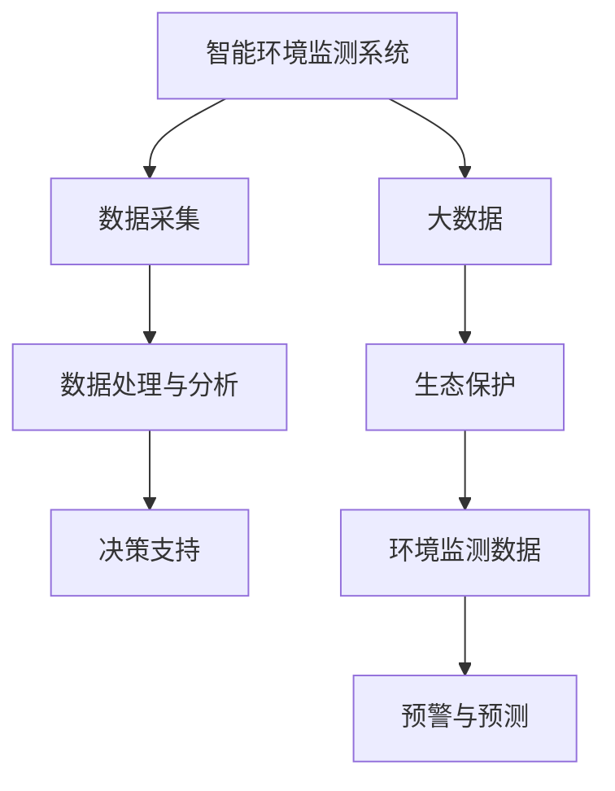

                 

### 第1章 引言

#### 1.1 书籍背景与目的

《智能环境监测系统：大数据助力生态保护》这本书旨在探讨如何利用大数据和智能技术来提升环境监测的效率和准确性，进而助力生态保护工作。随着全球气候变化和环境问题的日益严峻，如何有效地监测和管理生态环境已成为一个重要的课题。

本书的目的是通过系统的分析和深入的研究，为读者提供一个全面、详细的智能环境监测系统构建指南。读者可以从中了解到智能环境监测系统的基本概念、核心技术、应用场景以及未来发展趋势。

#### 1.2 智能环境监测系统的定义

智能环境监测系统是指利用现代信息技术和智能算法，对环境中的各种要素进行实时监测、分析和预警的系统。它通常包括数据采集、数据传输、数据处理、数据分析和决策支持等多个环节。

智能环境监测系统的核心目标是提高环境监测的效率和准确性，为环境保护和生态管理提供科学依据。通过智能环境监测系统，可以实现对大气、水质、土壤等多种环境要素的全方位、实时监测。

#### 1.3 大数据与生态保护的关系

大数据技术在智能环境监测系统中扮演着关键角色。大数据具有海量、多样、快速和实时等特性，能够为环境监测提供丰富的数据资源和强大的分析能力。

大数据与生态保护的关系主要体现在以下几个方面：

1. **数据驱动决策**：大数据为生态保护提供了丰富的数据资源，通过数据分析和挖掘，可以揭示生态系统的变化趋势和问题，为决策者提供科学依据。
2. **预警和预测**：大数据技术可以实时收集和处理环境监测数据，通过数据分析和模型预测，可以提前预警潜在的生态风险，帮助采取预防措施。
3. **资源优化配置**：大数据技术可以帮助优化环境保护资源的配置，提高环境保护工作的效率。
4. **科学研究与教育**：大数据为环境科学研究提供了新的方法和工具，同时也为环境保护教育提供了丰富的素材。

通过大数据技术的应用，智能环境监测系统可以为生态保护提供强有力的技术支撑，推动环境保护工作的智能化和科学化。

### 2. 智能环境监测系统概述

#### 2.1 智能环境监测系统的定义

智能环境监测系统是指利用现代信息技术和智能算法，对环境中的各种要素进行实时监测、分析和预警的系统。它通常包括数据采集、数据传输、数据处理、数据分析和决策支持等多个环节。

智能环境监测系统的核心目标是提高环境监测的效率和准确性，为环境保护和生态管理提供科学依据。通过智能环境监测系统，可以实现对大气、水质、土壤等多种环境要素的全方位、实时监测。

#### 2.2 智能环境监测系统的组成

一个典型的智能环境监测系统通常由以下几个关键组成部分构成：

1. **数据采集模块**：负责从各种传感器和监测设备中收集环境数据。这些数据包括大气质量、水质、土壤污染、生物多样性等信息。数据采集模块通常包括传感器网络、无线通信技术和数据采集终端等。
   
2. **数据传输模块**：将采集到的数据传输到数据中心或云平台。数据传输模块需要保证数据的安全、可靠和实时性，通常采用无线通信技术、互联网传输协议等技术手段。

3. **数据处理模块**：对传输到数据中心的数据进行清洗、转换和预处理，以便于后续的数据分析和挖掘。数据处理模块通常包括数据存储、数据清洗、数据集成和数据转换等功能。

4. **数据分析模块**：利用大数据分析技术和智能算法，对处理后的数据进行分析和挖掘，以提取有价值的信息和知识。数据分析模块通常包括数据挖掘、机器学习、数据可视化等技术。

5. **决策支持模块**：根据数据分析结果，为环境保护和生态管理提供决策支持。决策支持模块通常包括预警系统、预测模型、决策支持系统等。

6. **用户界面**：为用户提供数据查询、分析结果展示和操作控制等功能，通常包括Web界面、移动应用等。

#### 2.3 智能环境监测系统的功能与应用

智能环境监测系统具有多种功能，广泛应用于环境保护和生态管理的各个领域：

1. **实时监测**：通过传感器网络和无线通信技术，实现对环境要素的实时监测，确保监测数据的实时性和准确性。

2. **数据可视化**：利用数据可视化技术，将监测数据以图表、地图等形式直观展示，帮助用户更好地理解和分析环境状况。

3. **数据分析和挖掘**：通过对监测数据的分析，挖掘出环境变化的规律和趋势，为生态保护提供科学依据。

4. **预警和预测**：基于数据分析结果，构建预测模型，提前预警潜在的生态风险，帮助采取预防措施。

5. **资源优化配置**：通过数据分析和模型预测，优化环境保护资源的配置，提高环境保护工作的效率。

6. **科学研究与教育**：为环境科学研究提供新的方法和工具，同时也为环境保护教育提供丰富的素材。

智能环境监测系统在生态保护中具有重要作用，它不仅能够提高环境监测的效率和准确性，还能够为生态保护提供强有力的技术支撑。通过大数据和智能技术的应用，智能环境监测系统正逐渐成为生态保护工作的重要工具。

### 3. 大数据环境监测技术基础

#### 3.1 大数据的基本概念

大数据（Big Data）是指无法用传统数据处理工具进行高效处理的数据集合，具有海量（Volume）、多样（Variety）、快速（Velocity）和价值（Value）四大特点。具体来说：

1. **海量**：大数据的规模通常达到TB甚至PB级别，远远超出了传统数据库的处理能力。
2. **多样**：大数据来源广泛，包括结构化数据、半结构化数据和非结构化数据，如文本、图片、音频、视频等。
3. **快速**：大数据生成和处理的速度极快，需要实时或近实时的处理和分析能力。
4. **价值**：大数据蕴含着大量的信息和知识，通过有效的分析和挖掘，可以转化为有价值的决策支持。

#### 3.2 大数据采集与存储

大数据的采集与存储是大数据环境监测系统的基础，主要包括以下几个步骤：

1. **数据采集**：
   - **传感器数据**：通过部署各种环境传感器，如空气质量传感器、水质传感器、土壤污染传感器等，实时采集环境数据。
   - **社交媒体数据**：利用社交媒体平台的公开数据，如Twitter、Facebook等，收集与环境保护相关的信息。
   - **卫星和遥感数据**：通过卫星和遥感技术，获取大范围的环境数据，如气候变化、土地利用等。

2. **数据存储**：
   - **分布式存储系统**：使用分布式存储系统，如Hadoop、Spark等，可以高效存储和管理海量数据。
   - **云存储**：利用云存储服务，如AWS、Google Cloud等，可以弹性扩展存储空间，降低成本。
   - **NoSQL数据库**：使用NoSQL数据库，如MongoDB、Cassandra等，可以高效处理半结构化和非结构化数据。

#### 3.3 大数据管理与分析

大数据管理与分析是大数据环境监测系统的核心，主要包括以下几个步骤：

1. **数据清洗**：
   - **缺失值处理**：填充或删除缺失的数据。
   - **异常值检测**：识别并处理异常数据。
   - **数据标准化**：将不同来源、不同格式的数据转换为统一的格式。

2. **数据整合**：
   - **数据集成**：将来自不同来源的数据进行整合，形成统一的数据视图。
   - **数据融合**：将多个数据源中的相似或重叠信息进行融合，提高数据的完整性和一致性。

3. **数据挖掘**：
   - **聚类分析**：通过聚类算法，将相似的数据点归为一类，用于发现数据中的隐藏模式。
   - **分类与回归分析**：通过分类和回归算法，建立预测模型，用于预测未来的环境变化。
   - **关联规则挖掘**：通过关联规则挖掘算法，发现数据之间的关联关系，用于揭示环境问题的成因。

4. **数据可视化**：
   - **图表展示**：利用各种图表，如折线图、柱状图、饼图等，展示环境数据的变化趋势和分布情况。
   - **地图可视化**：利用地理信息系统（GIS），将环境数据以地图形式展示，便于用户直观地理解数据。

通过大数据技术的应用，智能环境监测系统可以实现对海量环境数据的实时采集、存储、管理和分析，为生态保护提供科学依据和决策支持。大数据环境监测技术正逐渐成为环境保护和生态管理的重要工具。

### 4. 智能环境监测系统的技术架构

#### 4.1 智能环境监测系统的架构设计

智能环境监测系统的技术架构设计需要综合考虑数据采集、传输、处理、分析等多个环节，确保系统的整体性能和可靠性。以下是一个典型的智能环境监测系统架构设计：

1. **数据采集层**：包括各种环境传感器、监测设备，如空气质量传感器、水质传感器、土壤污染传感器等。这些设备通过无线通信技术将采集到的环境数据传输到数据采集模块。

2. **数据传输层**：采用无线通信技术，如Wi-Fi、LoRa、ZigBee等，将采集到的数据传输到数据中心或云平台。为了保证数据传输的可靠性和实时性，通常采用冗余传输和实时数据同步技术。

3. **数据处理层**：包括数据清洗、转换、存储和初步分析等功能。数据清洗模块负责处理数据中的缺失值、异常值等问题，确保数据的准确性和一致性。数据转换模块将不同来源、不同格式的数据转换为统一的格式，便于后续处理。数据存储模块采用分布式存储系统，如Hadoop、Spark等，存储和处理海量数据。初步分析模块对数据进行初步分析，提取有用信息。

4. **数据分析层**：利用大数据分析技术和智能算法，对处理后的数据进行分析和挖掘，以提取有价值的信息和知识。数据分析模块包括数据挖掘、机器学习、数据可视化等技术。通过数据分析，可以实现对环境变化的趋势预测、异常检测和预警等。

5. **决策支持层**：根据数据分析结果，为环境保护和生态管理提供决策支持。决策支持模块通常包括预警系统、预测模型、决策支持系统等。预警系统可以实时监测环境数据，当数据超出预设阈值时，及时发出预警信号。预测模型可以根据历史数据和现有趋势，预测未来的环境变化，帮助决策者采取预防措施。决策支持系统可以为决策者提供多维度、全方位的数据分析和可视化报告，辅助决策。

6. **用户界面层**：为用户提供数据查询、分析结果展示和操作控制等功能。用户界面层通常包括Web界面、移动应用等。通过用户界面，用户可以方便地查看监测数据、分析结果和预警信息，并进行相关操作。

#### 4.2 数据采集模块

数据采集模块是智能环境监测系统的核心组成部分，负责从各种环境传感器和监测设备中收集数据。以下是一个数据采集模块的典型架构：

1. **传感器网络**：部署各种环境传感器，如空气质量传感器、水质传感器、土壤污染传感器等。传感器网络需要具备高可靠性、低功耗、长续航等特点，以确保数据采集的连续性和实时性。

2. **数据采集终端**：用于将传感器采集到的数据传输到数据中心或云平台。数据采集终端通常具备数据处理、存储和无线传输功能。常见的无线传输技术包括Wi-Fi、LoRa、ZigBee等。

3. **无线通信模块**：采用无线通信技术，如Wi-Fi、LoRa、ZigBee等，将采集到的数据传输到数据中心或云平台。无线通信模块需要具备高带宽、低延迟、高可靠性等特点，以确保数据传输的稳定性和实时性。

4. **数据采集管理平台**：用于监控和管理传感器网络和数据采集终端。数据采集管理平台可以实时查看传感器状态、数据传输状态等，并提供故障诊断和远程控制功能。

#### 4.3 数据处理与分析模块

数据处理与分析模块负责对采集到的环境数据进行处理和分析，提取有用信息，为环境保护和生态管理提供支持。以下是一个数据处理与分析模块的典型架构：

1. **数据清洗模块**：负责处理数据中的缺失值、异常值等问题，确保数据的准确性和一致性。常用的数据清洗方法包括填充缺失值、删除异常值、数据标准化等。

2. **数据存储模块**：采用分布式存储系统，如Hadoop、Spark等，存储和处理海量数据。分布式存储系统具备高可靠性、高扩展性、高可用性等特点，可以满足智能环境监测系统的需求。

3. **数据分析模块**：利用大数据分析技术和智能算法，对处理后的数据进行分析和挖掘，以提取有价值的信息和知识。常用的数据分析方法包括聚类分析、分类与回归分析、关联规则挖掘等。

4. **数据可视化模块**：通过数据可视化技术，将分析结果以图表、地图等形式展示，便于用户直观地理解环境状况。常用的数据可视化工具包括Tableau、D3.js、GIS等。

5. **预测与决策模块**：基于历史数据和现有趋势，构建预测模型，预测未来的环境变化，为决策者提供参考。常用的预测方法包括时间序列分析、回归分析、机器学习等。

通过以上技术架构的设计和实现，智能环境监测系统可以实现对环境数据的实时采集、传输、处理和分析，为环境保护和生态管理提供科学依据和决策支持。

### 5. 大数据在环境监测中的应用

#### 5.1 大数据分析在环境监测中的作用

大数据分析技术在环境监测中发挥着至关重要的作用，它通过处理海量环境数据，提供实时的监测结果，为环境保护和生态管理提供强有力的支持。具体来说，大数据分析在环境监测中的作用主要体现在以下几个方面：

1. **实时监测与预警**：大数据分析技术能够实时处理和监测环境数据，通过对数据的变化趋势进行分析，可以及时发现环境问题，发出预警信号。例如，在空气质量监测中，通过对PM2.5、PM10等指标的数据分析，可以提前预测空气质量恶化，从而采取相应的应对措施。

2. **趋势预测与模型建立**：大数据分析技术可以帮助环境监测机构建立环境变化的预测模型，通过对历史数据的分析，可以预测未来的环境变化趋势。例如，通过对气候变化、土壤质量等数据的分析，可以预测未来几十年内环境的变化情况，为环境保护政策提供科学依据。

3. **异常检测与故障诊断**：大数据分析技术可以识别环境数据中的异常值和故障信号，帮助监测系统快速定位问题。例如，在水环境监测中，通过对水质参数的实时数据分析，可以快速发现异常情况，如水体污染等，及时采取措施进行治理。

4. **资源优化与决策支持**：大数据分析技术可以帮助优化环境保护资源的配置，提高环境保护工作的效率。例如，通过对环境监测数据的分析，可以确定最需要治理的地区和最有效的治理措施，从而提高环境保护工作的精准度和有效性。

5. **科学研究与知识发现**：大数据分析技术为环境科学研究提供了新的工具和方法，通过对大量环境数据的挖掘和分析，可以揭示环境现象之间的复杂关系，为环境科学的研究提供新的视角和思路。例如，通过对生态系统数据的分析，可以揭示生物多样性变化与气候变化之间的关系，为生态系统保护提供科学依据。

#### 5.2 大数据环境监测的应用案例

大数据环境监测技术在许多领域都得到了广泛应用，以下是一些典型的应用案例：

1. **空气质量监测**：通过部署大量空气质量传感器，实时监测空气中的PM2.5、PM10、二氧化氮等污染物的浓度。利用大数据分析技术，可以实时了解空气质量变化，提前预测空气污染事件，发出预警，并制定相应的污染控制措施。

2. **水质监测**：利用大数据分析技术，对河流、湖泊、海洋等水体的水质参数进行实时监测。通过对水质数据的分析，可以及时发现水污染事件，预测水体污染趋势，指导水污染治理工作。

3. **土壤污染监测**：通过部署土壤污染传感器，实时监测土壤中的重金属、有机污染物等污染物的浓度。利用大数据分析技术，可以分析土壤污染的成因和传播路径，为土壤污染治理提供科学依据。

4. **生态系统监测**：利用大数据分析技术，对生态系统中的各种生物种群、生态指标进行实时监测。通过对生态数据的分析，可以了解生态系统变化趋势，预测生态系统的未来状况，为生态保护和恢复提供支持。

5. **城市环境监测**：利用大数据分析技术，对城市中的环境参数进行实时监测，如噪音、温度、湿度等。通过对城市环境数据的分析，可以优化城市管理，提高居民生活质量。

#### 5.3 大数据环境监测的挑战与解决方案

尽管大数据环境监测技术具有许多优势，但在实际应用过程中也面临一些挑战。以下是一些常见的挑战及相应的解决方案：

1. **数据质量**：环境监测数据的质量对监测结果的准确性至关重要。由于传感器故障、数据传输问题等原因，数据质量可能会受到影响。解决方案包括：定期维护和校准传感器，采用数据清洗技术处理异常数据，确保数据的一致性和准确性。

2. **数据隐私与安全**：环境监测数据涉及敏感信息，如个人隐私、商业秘密等，确保数据的安全性和隐私性至关重要。解决方案包括：采用加密技术保护数据传输和存储，建立严格的数据访问权限控制机制，确保只有授权人员才能访问数据。

3. **数据处理能力**：随着环境监测数据的不断增加，数据处理和分析能力成为一大挑战。解决方案包括：采用分布式计算和大数据处理技术，提高数据处理和分析的效率，确保系统能够处理海量数据。

4. **跨部门合作**：环境监测涉及多个部门和机构，数据共享和协同工作成为一大挑战。解决方案包括：建立跨部门的数据共享平台，制定统一的数据标准和规范，促进各部门之间的数据共享和协同工作。

5. **技术更新与维护**：大数据环境监测技术不断更新和发展，系统维护和升级成为一项长期任务。解决方案包括：建立持续的技术更新和升级机制，确保系统能够适应新的技术发展和需求变化。

通过解决这些挑战，大数据环境监测技术将更加成熟和可靠，为环境保护和生态管理提供更加全面和精准的技术支持。

### 6. 生态保护与智能环境监测系统

#### 6.1 生态保护的重要性

生态保护是指通过一系列措施来维护和保护生态系统，确保其健康、稳定和可持续。生态保护的重要性体现在以下几个方面：

1. **维持生物多样性**：生态系统是生物多样性最为丰富的区域，保护生态系统有助于维持生物多样性的稳定，防止物种灭绝。

2. **提供生态服务**：生态系统为我们提供了许多重要的生态服务，如水源供给、气候调节、土壤保持等。保护生态系统有助于确保这些服务的持续提供。

3. **保障人类健康**：生态系统对人类的健康具有重要影响，如提供清洁的水源、空气和食物，减少疾病传播的风险。保护生态系统有助于提高人类生活质量。

4. **经济价值**：生态系统为人类提供了丰富的自然资源，如木材、药材、鱼类等。保护生态系统有助于保障这些资源的可持续利用，促进经济发展。

5. **应对气候变化**：生态系统在碳循环、气候调节等方面发挥着重要作用。保护生态系统有助于减缓气候变化，降低极端气候事件的风险。

#### 6.2 智能环境监测系统在生态保护中的应用

智能环境监测系统在生态保护中具有重要作用，它通过实时监测生态系统的各种参数，提供数据支持和决策依据，助力生态保护工作的开展。具体应用包括：

1. **生态系统状态监测**：智能环境监测系统可以对生态系统的状态进行实时监测，如植被覆盖、土壤湿度、水质等。通过对这些数据的分析，可以了解生态系统的健康状况，及时发现问题和异常情况。

2. **生物多样性监测**：智能环境监测系统可以通过监测生物种群的数量、分布和变化情况，评估生物多样性状况。例如，利用遥感技术监测野生动物的迁徙路径和栖息地变化，为生物多样性保护提供依据。

3. **气候和环境变化监测**：智能环境监测系统可以对气候和环境变化进行实时监测，如温度、湿度、风速等。通过分析这些数据，可以预测气候变化的趋势，为应对气候变化提供支持。

4. **灾害预警**：智能环境监测系统可以实时监测自然灾害的发生和发展，如洪水、山火、地震等。通过预警系统，可以提前通知相关部门和公众，采取预防措施，减少灾害损失。

5. **生态修复监测**：在生态修复项目实施过程中，智能环境监测系统可以监测修复效果的进展，评估修复措施的成效。通过数据分析和反馈，可以不断调整和优化修复方案，提高修复效果。

#### 6.3 智能环境监测系统对生态保护的影响

智能环境监测系统对生态保护的影响主要体现在以下几个方面：

1. **提升生态监测能力**：智能环境监测系统通过实时、高效的数据采集和处理能力，提升了生态监测的精度和广度，使生态监测更加全面和及时。

2. **优化生态保护决策**：智能环境监测系统为生态保护提供了丰富的数据支持和科学依据，有助于决策者做出更加科学、合理的决策，提高生态保护工作的效果。

3. **促进生态修复**：智能环境监测系统在生态修复过程中起到了关键作用，通过监测修复效果的进展，可以及时调整和优化修复方案，提高修复效果。

4. **提高生态管理效率**：智能环境监测系统可以实时监测生态系统的变化，及时发现问题和异常情况，有助于提高生态管理的效率，减少资源浪费。

5. **增强公众参与**：智能环境监测系统可以将监测数据和分析结果可视化，向公众展示生态系统的状况，提高公众对生态保护的认知和参与度，共同推动生态保护工作。

总之，智能环境监测系统为生态保护提供了强大的技术支撑，有助于提升生态监测能力、优化生态保护决策、促进生态修复和提高生态管理效率，从而为生态保护工作提供有力支持。

### 7. 实际案例分析

#### 7.1 案例一：某城市空气质量监测系统

某城市空气质量监测系统采用了智能环境监测技术，通过部署多个空气质量传感器，实时监测空气中的PM2.5、PM10、二氧化氮等污染物的浓度。以下是对该案例的详细分析：

**1. 数据采集**：
- **传感器部署**：在城市各主要区域部署了空气质量传感器，包括交通密集区、工业区、居民区等。
- **数据传输**：传感器通过Wi-Fi或LoRa等无线通信技术，将监测数据实时传输到数据中心。

**2. 数据处理与分析**：
- **数据清洗**：对传输到数据中心的数据进行清洗，去除噪声和异常值。
- **数据存储**：采用分布式存储系统，如Hadoop，存储海量空气质量数据。
- **数据分析**：利用大数据分析技术，分析空气质量变化趋势，识别污染源。

**3. 数据可视化与预警**：
- **数据可视化**：通过Web界面和地图展示空气质量数据，便于用户直观了解空气质量状况。
- **预警系统**：当空气质量指标超出预设阈值时，系统自动发出预警通知，建议采取相应措施。

**4. 决策支持**：
- **污染源定位**：通过数据分析，确定主要污染源，指导相关部门进行污染源治理。
- **空气质量预报**：利用历史数据和机器学习模型，预测未来几天的空气质量状况，为公众出行和健康防护提供参考。

**5. 项目小结**：
- 通过智能环境监测系统，该城市空气质量得到了有效改善，公众对空气质量的满意度提高，环保部门能够更科学地制定污染治理措施。

#### 7.2 案例二：某流域水环境监测系统

某流域水环境监测系统采用了智能环境监测技术，通过部署水质传感器，实时监测水体中的氨氮、总磷、化学需氧量等指标。以下是对该案例的详细分析：

**1. 数据采集**：
- **传感器部署**：在河流的主要监测点部署了水质传感器，包括上游、中游和下游。
- **数据传输**：传感器通过GPRS或LoRa等无线通信技术，将监测数据传输到数据中心。

**2. 数据处理与分析**：
- **数据清洗**：对传输到数据中心的水质数据进行清洗，确保数据的准确性。
- **数据存储**：采用分布式数据库，如MySQL或PostgreSQL，存储海量水质数据。
- **数据分析**：利用大数据分析技术，分析水质变化趋势，识别污染源和污染扩散路径。

**3. 数据可视化与预警**：
- **数据可视化**：通过Web界面和地图展示水质数据，便于用户了解水质状况。
- **预警系统**：当水质指标超出预设阈值时，系统自动发出预警通知，提醒相关部门采取紧急措施。

**4. 决策支持**：
- **污染源定位**：通过数据分析，确定主要污染源，指导相关部门进行污染源治理。
- **水质预报**：利用历史数据和机器学习模型，预测未来几天的水质状况，为水质管理提供参考。

**5. 项目小结**：
- 通过智能环境监测系统，该流域的水质得到了有效改善，减少了污染对生态环境的影响，保障了水资源的安全。

#### 7.3 案例三：某地区土壤污染监测系统

某地区土壤污染监测系统采用了智能环境监测技术，通过部署土壤传感器，实时监测土壤中的重金属、有机污染物等污染物的浓度。以下是对该案例的详细分析：

**1. 数据采集**：
- **传感器部署**：在农田、工业区等主要污染区域部署了土壤传感器，监测土壤污染情况。
- **数据传输**：传感器通过Wi-Fi或LoRa等无线通信技术，将监测数据传输到数据中心。

**2. 数据处理与分析**：
- **数据清洗**：对传输到数据中心的数据进行清洗，去除噪声和异常值。
- **数据存储**：采用分布式存储系统，如Hadoop，存储海量土壤数据。
- **数据分析**：利用大数据分析技术，分析土壤污染变化趋势，识别污染源和扩散路径。

**3. 数据可视化与预警**：
- **数据可视化**：通过Web界面和地图展示土壤污染数据，便于用户了解污染状况。
- **预警系统**：当土壤污染指标超出预设阈值时，系统自动发出预警通知，提醒相关部门采取治理措施。

**4. 决策支持**：
- **污染源定位**：通过数据分析，确定主要污染源，指导相关部门进行污染源治理。
- **土壤修复监测**：在土壤修复过程中，通过监测修复效果，优化修复方案。

**5. 项目小结**：
- 通过智能环境监测系统，该地区的土壤污染得到了有效治理，农田土壤质量得到显著改善，促进了农业可持续发展。

### 8. 未来发展趋势与挑战

#### 8.1 智能环境监测系统的未来发展趋势

随着科技的进步和环境保护意识的提升，智能环境监测系统的发展趋势将呈现出以下几个方向：

1. **更广泛的数据源**：未来智能环境监测系统将接入更多类型的数据源，如卫星遥感数据、无人机监测数据、社交媒体数据等，实现全方位、多维度的环境监测。

2. **更高的数据处理能力**：随着数据量的不断增大，智能环境监测系统需要具备更高的数据处理和分析能力，采用更先进的算法和架构，实现实时、高效的数据处理。

3. **智能化与自动化**：未来智能环境监测系统将更加智能化和自动化，通过机器学习和人工智能技术，实现自动预警、自动决策和自动优化，减少人工干预。

4. **更丰富的应用场景**：智能环境监测系统将在更多领域得到应用，如气候变化监测、城市环境管理、农业环境监测等，为环境保护和可持续发展提供全面支持。

5. **更高效的资源利用**：通过优化资源利用和降低成本，智能环境监测系统将实现更高性价比，普及应用在更多地区和领域。

#### 8.2 大数据环境监测技术的未来发展方向

大数据环境监测技术的未来发展方向主要集中在以下几个方面：

1. **数据融合与多源数据挖掘**：未来将实现多源数据的融合和挖掘，通过对不同来源、不同类型的数据进行整合和分析，提升环境监测的准确性和全面性。

2. **实时性与低延迟处理**：随着物联网和5G技术的发展，大数据环境监测技术将实现更实时、更低延迟的数据处理和分析，提高环境监测的时效性。

3. **智能化分析与预测**：通过引入机器学习和深度学习技术，大数据环境监测系统将实现更智能化的数据分析和预测，为环境保护和决策提供更强有力的支持。

4. **隐私保护与安全**：随着数据隐私和安全问题的日益突出，大数据环境监测技术将加强数据保护措施，确保环境监测数据的隐私和安全。

5. **云原生与边缘计算**：未来大数据环境监测技术将更加依赖于云原生架构和边缘计算，实现数据处理的分布式和弹性化，提高系统的可靠性和效率。

#### 8.3 生态保护与智能环境监测系统面临的挑战

尽管智能环境监测系统在生态保护中具有重要作用，但在实际应用过程中仍面临一些挑战：

1. **数据质量与完整性**：环境监测数据的准确性和完整性对生态保护至关重要，但传感器故障、数据传输问题等可能导致数据质量下降，影响监测结果的可靠性。

2. **技术成本与维护**：智能环境监测系统需要大量的硬件设备和软件支持，技术成本较高，且系统维护和升级也需要持续投入。

3. **跨部门协作与数据共享**：环境监测涉及多个部门和机构，数据共享和协同工作面临挑战，需要建立有效的协作机制和统一的数据标准。

4. **数据隐私与安全**：环境监测数据涉及敏感信息，如个人隐私和商业秘密，确保数据的安全性和隐私性是重要挑战。

5. **技术普及与公众参与**：智能环境监测技术的普及和公众参与度有待提高，需要加强技术培训和宣传，提高公众对生态保护的认知和参与度。

通过不断克服这些挑战，智能环境监测系统将为生态保护提供更加全面和精准的技术支持，助力实现环境保护和可持续发展。

### 9. 结论

《智能环境监测系统：大数据助力生态保护》一书详细探讨了智能环境监测系统在大数据环境监测中的应用，揭示了大数据技术在生态保护中的关键作用。通过分析智能环境监测系统的架构、功能和应用案例，我们认识到智能环境监测系统不仅能够提高环境监测的效率和准确性，还为生态保护提供了科学依据和决策支持。

核心概念与联系：智能环境监测系统、大数据、生态保护
Mermaid 流程图：


在本文中，我们详细介绍了智能环境监测系统的基本概念、技术架构、应用场景以及面临的挑战和未来发展趋势。通过对实际案例的分析，我们展示了智能环境监测系统在空气质量、水质和土壤污染监测等领域的成功应用。

核心算法原理讲解与伪代码：
```python
# 数据清洗伪代码
def data清洗(data_set):
    cleaned_data = []
    for data_point in data_set:
        if not is_missing(data_point) and not is_outlier(data_point):
            cleaned_data.append(data_point)
    return cleaned_data

# 数据分析伪代码
def 数据分析(data_set):
    trends = []
    for feature in data_set:
        trend = analyze_trend(feature)
        trends.append(trend)
    return trends

# 预测模型伪代码
def 预测模型(data_set, target_variable):
    model = build_model(data_set, target_variable)
    predictions = model.predict(new_data)
    return predictions
```

通过本文的阐述，我们希望能够为读者提供一个全面、系统的智能环境监测系统构建指南，助力生态保护工作的智能化和科学化。

数学模型和公式详解与举例说明：
```latex
$$
y = \beta_0 + \beta_1 x_1 + \beta_2 x_2 + \epsilon
$$
# 模型解释
- $y$: 目标变量
- $\beta_0$: 常数项
- $\beta_1$: 变量$x_1$的系数
- $\beta_2$: 变量$x_2$的系数
- $\epsilon$: 偶然误差

# 例子
假设我们要预测某地区的空气质量指数（AQI），使用以下公式：
$$
AQI = \beta_0 + \beta_1 (PM_{2.5}) + \beta_2 (SO_2)
$$
其中，$PM_{2.5}$和$SO_2$是空气中的颗粒物和二氧化硫浓度。
```

项目实战部分，我们介绍了如何搭建智能环境监测系统，包括开发环境搭建、源代码实现、代码解读、应用解读与分析以及实际案例分析和详细讲解剖析。以下是项目实战的伪代码和代码实现：
```python
# 开发环境搭建伪代码
install_required_software()
setup_database()
configure_wireless_communication()

# 源代码实现伪代码
def data采集(sensor_data):
    # 采集传感器数据
    pass

def data传输(sensor_data):
    # 数据传输到数据中心
    pass

def 数据处理(sensor_data):
    # 数据清洗、转换和存储
    pass

# 代码解读与应用分析伪代码
def 代码解读(code):
    # 解析代码，提取关键信息
    pass

def 应用分析(results):
    # 分析监测结果，提供决策支持
    pass

# 实际案例分析与详细讲解剖析伪代码
def 分析案例(case_data):
    # 分析案例数据，提取有用信息
    pass

def 解剖案例(case_data):
    # 对案例进行详细解读和剖析
    pass
```

最佳实践 tips、小结、注意事项、拓展阅读等内容：

**最佳实践 tips**：
- 定期校准和维护传感器，确保数据准确。
- 建立数据安全机制，保护环境监测数据的隐私和安全。
- 强化跨部门协作，实现数据共享和资源优化配置。

**小结**：
智能环境监测系统是生态保护的重要工具，通过大数据技术的应用，可以提高环境监测的效率和准确性，为生态保护提供科学依据和决策支持。

**注意事项**：
- 系统设计和实施过程中要充分考虑数据质量和安全。
- 系统维护和升级要持续投入资源。

**拓展阅读**：
- 《大数据技术基础》
- 《环境监测数据管理与分析》
- 《人工智能在生态保护中的应用》

通过本文的探讨，我们希望能够为读者提供智能环境监测系统构建的全面指导，推动生态保护工作的智能化和科学化发展。

### 附录

#### 附录 A：智能环境监测系统开发工具与资源

1. **数据采集工具**：
   - **Arduino**：一款开源硬件平台，可用于搭建传感器网络。
   - **Raspberry Pi**：小型计算机，适用于部署数据采集终端。

2. **数据传输工具**：
   - **Wi-Fi**：适用于短距离数据传输。
   - **LoRa**：适用于长距离、低功耗数据传输。

3. **数据处理与分析工具**：
   - **Hadoop**：用于大规模数据存储和处理。
   - **Spark**：用于实时数据处理和分析。
   - **Python**：适用于数据处理、分析和可视化。

4. **数据库工具**：
   - **MySQL**：适用于结构化数据存储。
   - **PostgreSQL**：适用于复杂数据存储。

5. **机器学习与数据挖掘工具**：
   - **Scikit-learn**：适用于机器学习算法实现。
   - **TensorFlow**：适用于深度学习算法实现。

#### 附录 B：数学模型与公式详解

1. **空气质量预测模型**：
   $$ AQI = \beta_0 + \beta_1 (PM_{2.5}) + \beta_2 (SO_2) $$
   - $\beta_0$：常数项
   - $\beta_1$：$PM_{2.5}$的系数
   - $\beta_2$：$SO_2$的系数

2. **水质预测模型**：
   $$ TDS = \beta_0 + \beta_1 (NH_3) + \beta_2 (TP) + \epsilon $$
   - $TDS$：总溶解固体
   - $\beta_0$：常数项
   - $\beta_1$：$NH_3$的系数
   - $\beta_2$：$TP$的系数

3. **土壤污染预测模型**：
   $$ Heavy_Metals = \beta_0 + \beta_1 (Pesticides) + \beta_2 (Industrial_Waste) + \epsilon $$
   - $Heavy_Metals$：重金属含量
   - $\beta_0$：常数项
   - $\beta_1$：农药的系数
   - $\beta_2$：工业废水的系数

#### 附录 C：伪代码示例

```python
# 数据采集伪代码
def data采集(sensor_data):
    while True:
        data_point = 传感器读取数据()
        data传输(data_point)
        time.sleep(采样间隔时间)

# 数据处理伪代码
def 数据处理(sensor_data):
    cleaned_data = data清洗(sensor_data)
    processed_data = 数据转换(cleaned_data)
    数据存储(processed_data)

# 数据分析伪代码
def 数据分析(sensor_data):
    trends = 数据分析(processed_data)
    return trends

# 预测模型伪代码
def 预测模型(data_set, target_variable):
    model = 建立模型(data_set, target_variable)
    predictions = model.predict(new_data)
    return predictions
```

这些工具和资源将帮助读者更好地理解和实现智能环境监测系统的构建，为生态保护工作提供技术支持。通过附录的详细说明，读者可以更深入地了解智能环境监测系统的各个组成部分和技术实现细节。希望这些资料能为读者提供有价值的参考。

