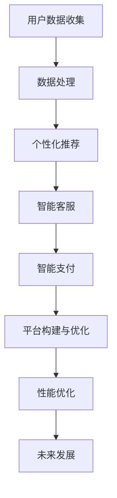

                 


## 文章标题：智能电子商务平台：AI个性化购物体验

### 关键词：智能电子商务、AI个性化购物体验、电子商务平台、人工智能技术、推荐系统、智能客服、智能支付

### 摘要：
随着人工智能技术的快速发展，智能电子商务平台成为电子商务行业的重要趋势。本文将探讨智能电子商务平台的概念、核心技术及其在个性化购物体验中的应用。通过分析个性化推荐、智能客服和智能支付等关键环节，我们将深入了解AI如何提升购物体验，并展望智能电子商务平台的未来发展趋势。

---

## 第一部分：智能电子商务平台概述

### 第1章：智能电子商务平台的基本概念

#### 1.1.1 智能电子商务的定义
智能电子商务是指利用人工智能技术，如机器学习、自然语言处理、数据挖掘等，对电子商务活动进行自动化、智能化处理的一种新型商业模式。智能电子商务的核心目标是提升用户体验、降低运营成本、提高交易效率。

#### 1.1.2 智能电子商务的发展历程
智能电子商务经历了从传统电子商务到基于搜索的电子商务，再到现在的智能电子商务的演变。传统电子商务主要依靠关键词搜索和商品展示，而智能电子商务则通过个性化推荐、智能客服和智能支付等手段，实现了更加精准和高效的服务。

#### 1.1.3 智能电子商务的核心特点
智能电子商务具有以下几个核心特点：

1. **个性化推荐**：利用用户行为数据，为用户推荐最相关的商品和内容。
2. **智能客服**：通过自然语言处理技术，实现与用户的实时沟通，提供高效、专业的服务。
3. **智能支付**：利用生物识别、区块链等技术，提供安全、便捷的支付体验。

### 第2章：人工智能技术在电子商务中的应用

#### 2.1.1 人工智能技术在个性化推荐中的应用
个性化推荐是智能电子商务的核心功能之一。本文将介绍基于协同过滤、内容推荐和深度学习的个性化推荐算法，并分析其优缺点。

#### 2.1.2 人工智能技术在智能客服中的应用
智能客服通过自然语言处理技术，实现与用户的智能对话。本文将介绍智能客服的基本原理、实现方法和应用案例。

#### 2.1.3 人工智能技术在智能支付中的应用
智能支付是智能电子商务的重要组成部分。本文将介绍生物识别、区块链等技术在智能支付中的应用，以及其带来的安全性和便捷性。

---

## 第二部分：AI个性化购物体验的实现

### 第3章：数据收集与处理

#### 3.1.1 数据收集的方法与工具
数据收集是智能电子商务平台的基础。本文将介绍常见的数据收集方法，如用户行为数据、商品数据等，以及常用的数据收集工具。

#### 3.1.2 数据处理的技术与流程
数据处理是数据科学的核心环节。本文将介绍数据处理的基本流程，包括数据清洗、数据集成、数据转换等，以及常用的数据处理技术。

### 第4章：个性化推荐算法设计

#### 4.1.1 个性化推荐算法概述
个性化推荐算法是智能电子商务平台的核心技术。本文将介绍个性化推荐算法的基本原理、分类和应用场景。

#### 4.1.2 协同过滤算法
协同过滤算法是常见的个性化推荐算法之一。本文将使用伪代码详细阐述协同过滤算法的原理和实现。

#### 4.1.3 内容推荐算法
内容推荐算法基于商品属性和用户兴趣进行推荐。本文将介绍内容推荐算法的原理和实现。

#### 4.1.4 深度学习推荐算法
深度学习推荐算法具有强大的表示学习能力和泛化能力。本文将介绍深度学习推荐算法的原理和实现。

### 第5章：智能客服系统设计

#### 5.1.1 智能客服系统概述
智能客服系统是智能电子商务平台的重要组成部分。本文将介绍智能客服系统的基本原理、组成部分和实现方法。

#### 5.1.2 自然语言处理技术
自然语言处理技术是实现智能客服的关键。本文将使用伪代码详细阐述自然语言处理技术的实现。

#### 5.1.3 智能客服系统案例
本文将分析智能客服系统的实际应用案例，包括客户服务、智能导购等。

### 第6章：智能支付解决方案

#### 6.1.1 智能支付概述
智能支付是智能电子商务的重要一环。本文将介绍智能支付的基本概念、发展历程和核心技术。

#### 6.1.2 生物识别技术
生物识别技术是智能支付的重要组成部分。本文将介绍生物识别技术的原理和应用。

#### 6.1.3 区块链技术
区块链技术为智能支付提供了安全性和透明性。本文将介绍区块链技术的原理和应用。

---

## 第7章：智能电子商务平台构建与优化

#### 7.1.1 智能电子商务平台的构建流程
本文将介绍智能电子商务平台的构建流程，包括需求分析、系统设计、开发与测试等。

#### 7.1.2 平台性能优化
平台性能优化是提升用户体验的关键。本文将介绍平台性能优化的方法和技巧。

#### 7.1.3 智能电子商务平台的未来发展
本文将分析智能电子商务平台的未来发展趋势和潜在挑战。

---

## 附录

### 附录 A：相关技术概述
本文将介绍与智能电子商务平台相关的主要技术，如数据挖掘、机器学习、自然语言处理、区块链等。

### 附录 B：开发环境搭建指南
本文将提供智能电子商务平台开发所需的环境搭建指南，包括开发工具、框架和库的安装和使用方法。

### 附录 C：代码案例
本文将提供智能电子商务平台开发的代码案例，包括数据收集、处理、推荐算法、智能客服和智能支付等。

---

## 结论
本文对智能电子商务平台及其在个性化购物体验中的应用进行了详细探讨。通过分析核心技术和实际应用案例，我们认识到AI技术在提升购物体验、降低运营成本和增强用户体验方面的巨大潜力。未来，智能电子商务平台将不断创新，为消费者提供更加智能、个性化的购物体验。

### 作者信息：
作者：AI天才研究院/AI Genius Institute & 禅与计算机程序设计艺术 /Zen And The Art of Computer Programming## 智能电子商务平台概述

### 智能电子商务的定义

智能电子商务，简称智能电商，指的是利用人工智能技术（如机器学习、自然语言处理、数据挖掘等）对电子商务活动进行自动化、智能化的管理和优化。这种模式不仅涵盖了传统的在线购物和支付流程，还包括了更加个性化的购物体验、智能化的客户服务和更加安全的支付系统。

在智能电子商务中，人工智能技术起到了至关重要的作用。首先，机器学习算法通过对海量用户行为数据的分析，能够识别出用户的兴趣偏好，从而为用户提供个性化的商品推荐。其次，自然语言处理技术使得电子商务平台能够理解和回应用户的自然语言查询，提高了交互的便捷性。此外，数据挖掘技术帮助电商平台发现潜在的用户需求和市场趋势，从而优化库存管理和供应链。

智能电子商务的出现，不仅解决了传统电子商务中存在的个性化不足、用户体验差等问题，还为商家提供了更加精准的市场营销工具，降低了运营成本，提高了运营效率。

### 智能电子商务的发展历程

智能电子商务并非一蹴而就，而是经历了多个阶段的发展。以下是智能电子商务的发展历程：

1. **传统电子商务阶段**：这一阶段主要是在互联网普及的背景下，电子商务初具雏形。商家通过建立网站，将商品信息在线展示，用户通过搜索引擎查找商品并完成购买。这一阶段的电子商务以信息展示为主，缺乏对用户个性化需求的精准把握。

2. **基于搜索的电子商务阶段**：随着搜索引擎技术的发展，用户可以通过关键词搜索找到自己需要的商品。这一阶段，电子商务平台开始关注用户体验，通过优化搜索算法和商品展示方式，提高用户的购买效率。

3. **智能电子商务阶段**：在这一阶段，人工智能技术的广泛应用使得电子商务平台能够更加深入地理解和满足用户的个性化需求。个性化推荐系统、智能客服、智能支付等功能的引入，使得购物体验变得更加智能和便捷。

每个阶段的发展都是基于技术进步和市场需求的变化。传统电子商务解决了信息不对称问题，基于搜索的电子商务提高了购买效率，而智能电子商务则通过人工智能技术实现了用户体验的质的飞跃。

### 智能电子商务的核心特点

智能电子商务具有以下核心特点：

1. **个性化推荐**：智能电子商务平台通过机器学习算法分析用户行为数据，为用户提供个性化的商品推荐。这不仅提高了用户的购买满意度，也提升了商家的销售转化率。

2. **智能客服**：智能客服利用自然语言处理技术，能够理解和回应用户的自然语言查询，提供7*24小时的客户服务。智能客服不仅能够提高用户满意度，还能减轻人工客服的工作负担。

3. **智能支付**：智能支付通过生物识别、区块链等新技术，提供了更加安全、便捷的支付方式。例如，通过指纹识别、人脸识别等技术，用户无需输入密码即可完成支付，提高了支付速度。

4. **数据驱动**：智能电子商务平台基于海量数据进行分析和挖掘，实时了解用户需求和市场趋势，从而优化库存管理、供应链和市场营销策略。

5. **全渠道整合**：智能电子商务平台能够整合线上和线下的购物渠道，为用户提供一致的购物体验。无论是通过网站、移动应用还是线下门店，用户都可以享受到智能电商带来的便利。

通过这些核心特点，智能电子商务平台不仅提升了用户的购物体验，也为商家提供了更加高效、精准的运营工具，推动了整个电子商务行业的发展。

### 人工智能技术在电子商务中的应用

人工智能技术在电子商务中的应用，为提升用户体验、降低运营成本、提高交易效率带来了革命性的变化。以下是人工智能技术在电子商务中的几个关键应用领域：

#### 个性化推荐

个性化推荐是智能电子商务的核心功能之一。其基本原理是通过分析用户的浏览记录、购买历史、评价和反馈等信息，利用机器学习算法，如协同过滤算法、基于内容的推荐算法和深度学习算法，为用户推荐他们可能感兴趣的商品。

**协同过滤算法**：协同过滤算法分为用户基于的协同过滤（User-based Collaborative Filtering）和项目基于的协同过滤（Item-based Collaborative Filtering）。用户基于的协同过滤通过找到与当前用户行为相似的用户，推荐这些用户喜欢的商品；项目基于的协同过滤则是通过分析商品之间的相似性，为用户推荐与他们已购买或浏览的商品相似的商品。

伪代码示例：
```python
# 用户基于的协同过滤算法
def user_based_collaborative_filtering(user, users_data):
    similar_users = find_similar_users(user, users_data)
    recommended_items = []
    for user in similar_users:
        recommended_items.extend(users_data[user]['liked_items'])
    return set(recommended_items) - user['liked_items']

# 项目基于的协同过滤算法
def item_based_collaborative_filtering(item, items_data):
    similar_items = find_similar_items(item, items_data)
    recommended_users = []
    for item in similar_items:
        recommended_users.extend(items_data[item]['users'])
    return set(recommended_users) - user['users']
```

**基于内容的推荐算法**：基于内容的推荐算法通过分析商品的内容特征（如标签、属性、描述等）和用户的兴趣特征，推荐与用户已购买或浏览的商品相似的商品。

伪代码示例：
```python
def content_based_filtering(user, item, items_data, user_interests):
    similar_items = find_similar_items_by_content(item, items_data)
    recommended_items = []
    for item in similar_items:
        if item in user_interests:
            recommended_items.append(item)
    return recommended_items
```

**深度学习推荐算法**：深度学习推荐算法利用神经网络模型，如自动编码器（Autoencoder）、生成对抗网络（GAN）和变换器（Transformer）等，能够学习到用户和商品的高维特征表示，从而实现更加精准的推荐。

伪代码示例：
```python
# 深度学习推荐算法示例（使用Transformer模型）
def deep_learning_recommendation(user_embedding, item_embedding, user_item_matrix):
    predicted_ratings = Transformer_model.predict(user_embedding, item_embedding, user_item_matrix)
    recommended_items = top_k_items(predicted_ratings, k=10)
    return recommended_items
```

#### 智能客服

智能客服利用自然语言处理（NLP）和机器学习技术，实现与用户的智能对话，提供高效、专业的客户服务。智能客服能够处理大量的用户查询，减轻人工客服的负担，提高服务效率。

**自然语言处理技术**：自然语言处理技术包括文本分类、实体识别、情感分析等，用于理解和回应用户的自然语言查询。

伪代码示例：
```python
# 文本分类
def text_classification(query, model):
    return model.predict(query)

# 实体识别
def entity_recognition(query, model):
    return model.extract_entities(query)

# 情感分析
def sentiment_analysis(query, model):
    return model.predict_sentiment(query)
```

**对话管理**：对话管理是智能客服的核心，包括对话生成、对话跟踪和对话意图识别等。通过对话管理，智能客服能够理解用户的意图，并提供恰当的回答。

伪代码示例：
```python
def handle_query(query, knowledge_base, dialog_state):
    intent = recognize_intent(query, knowledge_base)
    response = generate_response(intent, dialog_state)
    dialog_state = update_dialog_state(response, dialog_state)
    return response, dialog_state
```

#### 智能支付

智能支付是智能电子商务的重要组成部分，通过生物识别、区块链等新技术，提供了更加安全、便捷的支付方式。

**生物识别技术**：生物识别技术，如指纹识别、人脸识别、虹膜识别等，用于验证用户的身份，确保支付过程的安全性。

**区块链技术**：区块链技术通过去中心化的账本，提供了安全的支付解决方案。区块链能够记录每一笔交易的详细信息，确保交易的不可篡改和透明性。

伪代码示例：
```python
# 指纹识别
def fingerprint_recognition(fingerprint_sample, model):
    return model.verify(fingerprint_sample)

# 人脸识别
def facial_recognition(face_image, model):
    return model.verify(face_image)

# 区块链支付
def blockchain_payment(transaction, blockchain):
    blockchain.add_transaction(transaction)
    return "Payment successful"
```

通过这些人工智能技术的应用，智能电子商务平台不仅提升了用户体验，还为企业带来了更高的运营效率和更精准的市场洞察。

### AI个性化购物体验的实现

#### 数据收集与处理

在实现AI个性化购物体验的过程中，数据收集与处理是至关重要的一环。首先，我们需要明确数据收集的目标和类型。常见的用户数据包括但不限于：

1. **用户行为数据**：如浏览历史、购买记录、点击行为等。
2. **用户个人信息**：如年龄、性别、地理位置、收入水平等。
3. **商品数据**：如商品描述、价格、库存量、评论等。
4. **市场数据**：如节假日促销信息、竞争对手活动等。

**数据收集的方法与工具**：

- **用户行为数据**：通过分析用户在电商平台上的行为数据，如使用浏览器插件、API接口或第三方数据分析工具（如Google Analytics）来收集。
- **用户个人信息**：在用户注册、登录、购物时收集，并通过合法途径获取。
- **商品数据**：通过电商平台提供的API接口获取，或从供应商、制造商处获取。
- **市场数据**：通过爬虫技术或市场调研报告获取。

**数据处理的技术与流程**：

数据处理通常包括以下步骤：

1. **数据清洗**：去除重复数据、缺失数据，对异常值进行校正。
2. **数据集成**：将不同来源的数据进行整合，形成统一的数据视图。
3. **数据转换**：将数据转换为适合分析和建模的格式，如数值化、标准化等。
4. **数据存储**：将处理后的数据存储到数据库或数据仓库中，以便后续分析和查询。

**数据处理技术的实现**：

- **数据清洗**：使用Pandas库进行数据预处理，如删除重复记录、填充缺失值、校正异常值。
  ```python
  import pandas as pd

  df = pd.read_csv('user_data.csv')
  df.drop_duplicates(inplace=True)
  df.fillna(method='ffill', inplace=True)
  ```

- **数据集成**：使用SQL查询将不同来源的数据进行整合。
  ```sql
  SELECT * 
  FROM user_behavior_data 
  JOIN product_data ON user_behavior_data.product_id = product_data.product_id;
  ```

- **数据转换**：使用Pandas进行数据标准化和特征工程。
  ```python
  from sklearn.preprocessing import StandardScaler

  scaler = StandardScaler()
  scaled_data = scaler.fit_transform(df[['age', 'income', 'number_of_purchases']])
  ```

- **数据存储**：使用数据库（如MySQL）或大数据技术（如Hadoop、Spark）进行数据存储和管理。

#### 个性化推荐算法设计

个性化推荐算法是提升购物体验的核心技术之一。以下是几种常见的个性化推荐算法及其基本原理：

**协同过滤算法**：

协同过滤算法通过分析用户行为数据，找出相似用户或商品，并基于这些相似性进行推荐。协同过滤算法分为用户基于的协同过滤（User-based Collaborative Filtering）和项目基于的协同过滤（Item-based Collaborative Filtering）。

1. **用户基于的协同过滤**：

用户基于的协同过滤算法通过计算用户之间的相似性，为当前用户推荐其他用户喜欢的商品。

伪代码示例：
```python
def user_based_collaborative_filtering(current_user, users_data, similarity_measure):
    similar_users = find_similar_users(current_user, users_data, similarity_measure)
    recommended_items = []
    for user in similar_users:
        recommended_items.extend(users_data[user]['liked_items'])
    return set(recommended_items) - current_user['liked_items']
```

2. **项目基于的协同过滤**：

项目基于的协同过滤算法通过计算商品之间的相似性，为当前用户推荐其他用户喜欢的相似商品。

伪代码示例：
```python
def item_based_collaborative_filtering(current_user, items_data, similarity_measure):
    liked_items = current_user['liked_items']
    similar_items = find_similar_items(liked_items, items_data, similarity_measure)
    recommended_items = []
    for item in similar_items:
        if item not in current_user['liked_items']:
            recommended_items.append(item)
    return recommended_items
```

**基于内容的推荐算法**：

基于内容的推荐算法通过分析商品内容和用户兴趣，为用户推荐与已购买或浏览商品内容相似的商品。

伪代码示例：
```python
def content_based_filtering(current_user, item, items_data, user_interests):
    similar_items = find_similar_items_by_content(item, items_data, user_interests)
    recommended_items = []
    for item in similar_items:
        if item not in current_user['liked_items']:
            recommended_items.append(item)
    return recommended_items
```

**深度学习推荐算法**：

深度学习推荐算法通过学习用户和商品的高维特征表示，实现精准的个性化推荐。常见的深度学习推荐算法包括基于神经网络的协同过滤（Neural Collaborative Filtering）和变换器（Transformer）模型。

伪代码示例（基于神经网络的协同过滤）：
```python
def neural_collaborative_filtering(user_embedding, item_embedding, user_item_matrix):
    predicted_ratings = NeuralNetwork.predict(user_embedding, item_embedding, user_item_matrix)
    recommended_items = top_k_items(predicted_ratings, k=10)
    return recommended_items
```

通过这些个性化推荐算法，电商平台能够根据用户的行为和兴趣，为其推荐最相关的商品，从而提升购物体验。

### 智能客服系统设计

智能客服系统是智能电子商务平台的重要组成部分，通过自然语言处理（NLP）和机器学习技术，实现与用户的智能对话，提供高效、专业的客户服务。以下是智能客服系统设计的几个关键方面：

#### 智能客服系统概述

智能客服系统主要由以下几个部分组成：

1. **对话管理**：对话管理是智能客服系统的核心，负责理解用户的意图、生成回应和跟踪对话状态。对话管理通常包括意图识别、实体提取、对话生成和对话状态跟踪等模块。

2. **知识库**：知识库是智能客服系统的基础，包含商品信息、常见问题和标准回答等。知识库为智能客服提供丰富的信息资源，帮助系统更好地理解和回应用户的问题。

3. **自然语言处理模块**：自然语言处理模块负责解析用户的查询，提取关键信息，理解用户的意图和情感。常见的NLP技术包括文本分类、实体识别、情感分析和命名实体识别等。

4. **对话生成**：对话生成模块负责生成恰当的回答。对话生成可以通过模板匹配、规则推理和深度学习等方法实现。

5. **用户界面**：用户界面是智能客服系统与用户交互的入口，通常包括文本聊天、语音聊天和视频聊天等。

#### 自然语言处理技术

自然语言处理技术是实现智能客服的关键。以下是几种常用的NLP技术及其实现方法：

1. **文本分类**：文本分类是将文本数据分类到预定义的类别中。常用的文本分类算法包括朴素贝叶斯、支持向量机（SVM）和深度学习（如卷积神经网络（CNN）、循环神经网络（RNN）等）。

伪代码示例（朴素贝叶斯分类）：
```python
def naive_bayes_classification(document, model):
    probabilities = model.predict(document)
    return max(probabilities, key=probabilities.get)
```

2. **实体识别**：实体识别是从文本中提取出关键信息，如人名、地点、组织名等。实体识别可以通过规则匹配、条件随机场（CRF）和序列标注等方法实现。

伪代码示例（规则匹配）：
```python
def rule_based_entity_recognition(document):
    entities = []
    for entity in predefined_entities:
        if entity in document:
            entities.append(entity)
    return entities
```

3. **情感分析**：情感分析是判断文本中的情感倾向，如正面、负面或中性。常用的情感分析算法包括基于词典的方法、基于机器学习的方法和基于深度学习的方法。

伪代码示例（基于词典的方法）：
```python
def sentiment_analysis(document, sentiment_lexicon):
    sentiment_score = 0
    for word in document:
        if word in sentiment_lexicon:
            sentiment_score += sentiment_lexicon[word]
    return "Positive" if sentiment_score > 0 else ("Negative" if sentiment_score < 0 else "Neutral")
```

4. **命名实体识别**：命名实体识别是从文本中识别出具有特定意义的实体，如人名、组织名、地点名等。命名实体识别通常使用序列标注的方法实现。

伪代码示例（序列标注）：
```python
def named_entity_recognition(document, model):
    entities = []
    for word in document:
        entity = model.predict(word)
        if entity is not None:
            entities.append(entity)
    return entities
```

#### 智能客服系统案例

以下是一个智能客服系统的实际应用案例，该系统主要用于电商平台上的客户服务。

**案例背景**：某电商平台希望为其用户提供一个智能客服系统，以解决用户在购物过程中遇到的各种问题，如产品咨询、订单查询、售后服务等。

**实现步骤**：

1. **需求分析**：分析用户在购物过程中可能遇到的问题，如产品相关问题、订单状态查询、退款处理等。

2. **知识库构建**：构建包含产品信息、常见问题及答案的知识库，为智能客服系统提供信息支持。

3. **自然语言处理模块开发**：开发文本分类、实体识别、情感分析和命名实体识别等模块，实现对用户查询的解析和理解。

4. **对话管理开发**：开发对话管理模块，负责处理用户查询、生成回应和跟踪对话状态。

5. **用户界面设计**：设计用户界面，包括文本聊天窗口、语音聊天按钮和视频聊天入口等。

6. **系统集成与测试**：将各个模块集成到智能客服系统中，并进行测试和优化，确保系统能够稳定、高效地运行。

**系统功能**：

1. **智能问答**：用户可以通过文本聊天窗口向智能客服系统提问，系统会根据用户的问题和知识库中的信息生成回答。

2. **订单查询**：用户可以输入订单号查询订单状态，系统会自动检索订单数据库并返回相关信息。

3. **售后服务**：用户可以提出售后服务请求，如退款、换货等，系统会自动生成相应的处理流程。

4. **智能导购**：用户可以咨询产品相关问题，如产品特性、使用方法等，系统会根据知识库中的信息为用户提供详细的解答。

通过这个案例，我们可以看到智能客服系统如何通过自然语言处理和机器学习技术，为电商平台提供高效、专业的客户服务，从而提升用户体验。

### 智能支付解决方案

智能支付是智能电子商务平台的重要组成部分，通过引入生物识别、区块链等新技术，为用户提供更加安全、便捷的支付体验。以下是智能支付解决方案的概述及其核心技术。

#### 智能支付概述

智能支付指的是利用人工智能、生物识别、区块链等先进技术，实现高效、安全的支付过程。智能支付不仅涵盖了传统的信用卡、借记卡等支付方式，还包括了移动支付、虚拟货币、生物识别支付等新型支付方式。

智能支付的优势主要体现在以下几个方面：

1. **安全性**：智能支付通过生物识别、区块链等安全技术，确保支付过程的安全性，防止欺诈和盗刷。
2. **便捷性**：用户可以通过生物识别技术（如指纹识别、人脸识别）快速完成支付，无需输入密码或刷卡，提高了支付速度。
3. **个性化**：智能支付系统可以根据用户行为和偏好，提供个性化的支付建议和服务。
4. **透明性**：区块链技术为智能支付提供了透明的账本，用户可以实时查询交易记录，确保交易的透明性。

#### 生物识别技术

生物识别技术是智能支付解决方案的关键技术之一，通过验证用户的生物特征（如指纹、人脸、虹膜等）来确认用户身份，从而实现安全的支付过程。

1. **指纹识别**：指纹识别是通过扫描用户的指纹图像，与预先存储的指纹模板进行比较，以确认用户身份。指纹识别技术具有高安全性、高识别率和低成本的特点。

2. **人脸识别**：人脸识别是通过分析用户的面部特征（如眼睛、鼻子、嘴巴等），与预先存储的人脸图像进行匹配，以确认用户身份。人脸识别技术具有快速、便捷、非接触性的优点。

3. **虹膜识别**：虹膜识别是通过扫描用户的虹膜图像，与预先存储的虹膜模板进行比较，以确认用户身份。虹膜识别具有极高的安全性和识别率，但成本较高。

**生物识别技术在支付中的应用**：

- **指纹支付**：用户在注册时绑定指纹信息，支付时只需将手指放置在指纹识别器上，即可完成支付。
- **人脸支付**：用户在注册时上传面部照片，支付时只需对准摄像头，系统会自动识别用户身份并完成支付。
- **虹膜支付**：用户在注册时绑定虹膜信息，支付时只需将眼睛对准虹膜识别器，即可完成支付。

#### 区块链技术

区块链技术是一种去中心化的分布式账本技术，通过加密算法确保数据的完整性和安全性。区块链技术为智能支付提供了透明的账本，用户可以实时查询交易记录，确保交易的透明性和不可篡改性。

1. **区块链的基本原理**：区块链由一系列按时间顺序排列的区块组成，每个区块包含一定数量的交易记录。区块链通过加密算法和共识机制确保数据的完整性和安全性。

2. **区块链在支付中的应用**：区块链技术可以用于记录支付交易，确保交易信息的透明性和不可篡改性。用户可以在区块链上查询交易记录，确保支付的安全和透明。

**区块链技术在支付中的应用**：

- **支付记录存储**：区块链可以记录每一笔支付交易，确保交易记录的可追溯性。
- **支付验证**：通过区块链技术，支付验证过程可以由分布式节点共同完成，提高了支付的安全性和效率。
- **智能合约**：智能合约是区块链上的自动执行合约，可以用于自动化支付流程，提高支付的效率和准确性。

#### 智能支付解决方案的实现

一个典型的智能支付解决方案包括以下几个关键步骤：

1. **用户身份验证**：用户通过指纹识别、人脸识别或虹膜识别等技术进行身份验证。
2. **交易生成**：用户选择支付商品或服务，系统生成支付交易。
3. **交易验证**：交易验证包括金额验证、商品合法性验证和身份验证等。
4. **交易记录**：交易记录存储在区块链上，确保交易信息的透明性和不可篡改性。
5. **支付完成**：支付完成后，系统向用户返回支付成功信息，并通知商家进行发货或提供服务。

通过引入生物识别和区块链技术，智能支付解决方案不仅提升了支付的安全性，还提高了支付的便捷性和透明性，为用户提供了更好的支付体验。

### 智能电子商务平台的构建与优化

#### 智能电子商务平台的构建流程

智能电子商务平台的构建是一个复杂且系统的过程，涉及需求分析、系统设计、开发与测试、部署与运维等多个环节。以下是智能电子商务平台构建的详细流程：

1. **需求分析**：需求分析是构建智能电子商务平台的第一步，主要通过市场调研、用户访谈、需求文档编写等方式，明确平台的功能需求、业务流程和性能要求。需求分析的结果将直接影响平台的后续设计和实现。

2. **系统设计**：系统设计包括架构设计、数据库设计和接口设计等。架构设计需要确定平台的整体架构，包括前端、后端、数据库、缓存、消息队列等组件的架构设计和交互关系。数据库设计则涉及数据模型的设计，包括用户数据、商品数据、订单数据等。接口设计则包括API接口的设计，确保前后端之间的数据交换和业务流程的协同。

3. **开发与测试**：开发与测试是智能电子商务平台构建的核心环节。在开发阶段，需要根据系统设计文档进行前后端的开发，实现平台的功能。开发过程中需要遵循敏捷开发原则，确保快速迭代和持续集成。测试阶段则包括单元测试、集成测试、性能测试和安全测试等，确保平台的质量和稳定性。

4. **部署与运维**：部署与运维是确保智能电子商务平台稳定运行的关键环节。部署包括平台的上线和部署，需要确保平台的高可用性和可扩展性。运维则包括平台的监控、性能优化、故障处理和安全管理等，确保平台的长期稳定运行。

#### 平台性能优化

平台性能优化是提升用户体验、确保业务连续性的重要手段。以下是智能电子商务平台性能优化的几个关键方面：

1. **负载均衡**：通过负载均衡技术，将用户请求分散到多个服务器上，提高平台的处理能力和响应速度。常用的负载均衡算法包括轮询、最小连接数、源地址哈希等。

2. **缓存策略**：缓存策略是提高平台性能的有效手段。通过将频繁访问的数据（如商品信息、用户数据等）缓存到内存或分布式缓存系统中，减少数据库的查询压力，提高数据访问速度。常用的缓存技术包括Redis、Memcached等。

3. **数据库优化**：数据库优化是提升平台性能的关键环节。通过优化数据库结构、索引、查询语句等，提高数据库的查询和写入速度。常见的优化方法包括分库分表、读写分离、垂直拆分和水平拆分等。

4. **缓存预热**：缓存预热是指在用户访问高峰期前，提前将热门数据和页面缓存到内存中，以减少用户访问时的响应时间。

5. **异步处理**：异步处理是将耗时较长的任务（如邮件发送、订单处理等）放入消息队列中，由后台服务异步处理，从而提高系统的响应速度和并发能力。

6. **性能监控**：通过性能监控工具，实时监控平台的性能指标，如CPU使用率、内存使用率、请求响应时间等，及时发现和处理性能瓶颈。

#### 智能电子商务平台的未来发展趋势

随着人工智能技术的不断进步，智能电子商务平台在未来将继续向更加智能化、个性化、安全化和高效化方向发展。以下是智能电子商务平台的未来发展趋势：

1. **人工智能技术的进一步应用**：智能电子商务平台将继续深入应用人工智能技术，如深度学习、自然语言处理、计算机视觉等，提升平台的智能化水平和用户体验。

2. **个性化推荐的深化**：个性化推荐将不仅仅是基于历史行为，还将结合用户的社会关系、心理特征等多维度数据，提供更加精准和个性化的购物体验。

3. **智能客服的完善**：智能客服将逐渐取代传统的人工客服，通过更加智能的自然语言处理和对话管理技术，提供24小时全天候的客户服务。

4. **区块链技术的普及**：区块链技术将在智能支付、供应链管理、数据安全等领域得到广泛应用，提高平台的透明性、安全性和可追溯性。

5. **物联网（IoT）的融合**：智能电子商务平台将与物联网技术深度融合，通过智能设备（如智能音箱、智能手表等）提供更加便捷和智能化的购物体验。

6. **全渠道整合**：智能电子商务平台将实现线上与线下的深度融合，为用户提供一致性的购物体验，实现全渠道的营销和服务。

7. **数据安全和隐私保护**：随着数据隐私和安全的关注度不断提高，智能电子商务平台将加强数据安全和隐私保护措施，确保用户数据的安全和隐私。

通过这些发展趋势，智能电子商务平台将为用户提供更加智能化、个性化、安全化和高效化的购物体验，推动电子商务行业的持续发展。

### 附录

#### 附录 A：相关技术概述

**数据挖掘**：数据挖掘是从大量数据中提取有价值信息的过程。它包括数据预处理、模式识别、关联分析、分类、聚类等算法。数据挖掘在智能电子商务中的应用包括用户行为分析、市场趋势预测和风险控制等。

**机器学习**：机器学习是一种通过数据训练模型，实现自动预测和决策的技术。常见的机器学习算法包括线性回归、逻辑回归、支持向量机（SVM）、决策树、随机森林、神经网络等。机器学习在智能电子商务中用于个性化推荐、用户行为预测和智能客服等。

**自然语言处理（NLP）**：自然语言处理是使计算机能够理解、处理和生成自然语言的技术。NLP在智能电子商务中的应用包括文本分类、情感分析、命名实体识别、机器翻译等。

**区块链**：区块链是一种分布式数据库技术，通过加密算法确保数据的完整性和安全性。区块链在智能电子商务中用于智能支付、供应链管理和数据安全等。

#### 附录 B：开发环境搭建指南

**开发工具**：
- **编程语言**：Python、Java、JavaScript等。
- **开发框架**：Django、Flask（Python）、Spring Boot（Java）等。
- **前端框架**：React、Vue.js、Angular等。

**数据库**：
- **关系型数据库**：MySQL、PostgreSQL、Oracle等。
- **非关系型数据库**：MongoDB、Cassandra、Redis等。

**版本控制**：
- **Git**：用于代码的版本控制和管理。

**容器化技术**：
- **Docker**：用于应用的容器化部署。
- **Kubernetes**：用于容器集群的自动化部署和管理。

**持续集成与持续部署（CI/CD）**：
- **Jenkins**：用于自动化构建、测试和部署。
- **GitLab CI/CD**：与Git集成，实现自动化测试和部署。

**性能监控工具**：
- **Prometheus**：用于监控和告警。
- **Grafana**：用于数据可视化和监控。

#### 附录 C：代码案例

以下是一个简单的Python代码案例，用于实现一个基于协同过滤的个性化推荐系统。该代码将读取用户-商品评分矩阵，使用矩阵分解（Matrix Factorization）算法为用户和商品建立特征表示，并预测用户对未知商品的评分。

```python
import numpy as np
from sklearn.decomposition import NMF

# 用户-商品评分矩阵（示例数据）
ratings_matrix = np.array([
    [5, 3, 0, 2],
    [0, 1, 4, 0],
    [2, 0, 3, 5],
    [3, 4, 0, 0],
    [5, 0, 0, 3],
    [0, 3, 0, 2]
])

# 使用NMF进行矩阵分解
n_components = 2
nmf = NMF(n_components=n_components, random_state=42)
nmf.fit(ratings_matrix)

# 用户和商品的低维特征表示
user_factors = nmf.transform(ratings_matrix)
item_factors = nmf.components_

# 预测未知评分
def predict_rating(user_index, item_index, user_factors, item_factors):
    return np.dot(user_factors[user_index], item_factors[item_index])

# 预测示例
user_index = 1
item_index = 2
predicted_rating = predict_rating(user_index, item_index, user_factors, item_factors)
print(f"Predicted rating: {predicted_rating}")
```

通过这个代码案例，我们可以看到如何使用NMF算法为用户和商品建立特征表示，并通过这些特征进行评分预测。这为智能电子商务平台的个性化推荐提供了基础。

### 总结

智能电子商务平台通过引入人工智能技术，如个性化推荐、智能客服和智能支付，为用户提供了更加智能、个性化的购物体验。本文详细探讨了智能电子商务平台的基本概念、核心技术及其实现过程，包括数据收集与处理、个性化推荐算法设计、智能客服系统设计和智能支付解决方案。通过附录部分的相关技术概述和开发环境搭建指南，读者可以更好地理解智能电子商务平台的实现原理和实际应用。

智能电子商务平台不仅是电子商务行业的重要趋势，也为用户带来了更加便捷、高效的购物体验。未来，随着人工智能技术的不断进步，智能电子商务平台将在个性化推荐、智能客服和智能支付等方面不断创新，为用户提供更加优质的购物体验。同时，智能电子商务平台也将面临数据安全和隐私保护、技术成本和用户体验等挑战，需要持续优化和改进。

作者：AI天才研究院/AI Genius Institute & 禅与计算机程序设计艺术 /Zen And The Art of Computer Programming

---

# Mermaid 流程图



通过这个流程图，我们可以清晰地看到智能电子商务平台各个功能模块之间的关系及其在整个平台中的流程，有助于理解和优化平台的整体架构。

