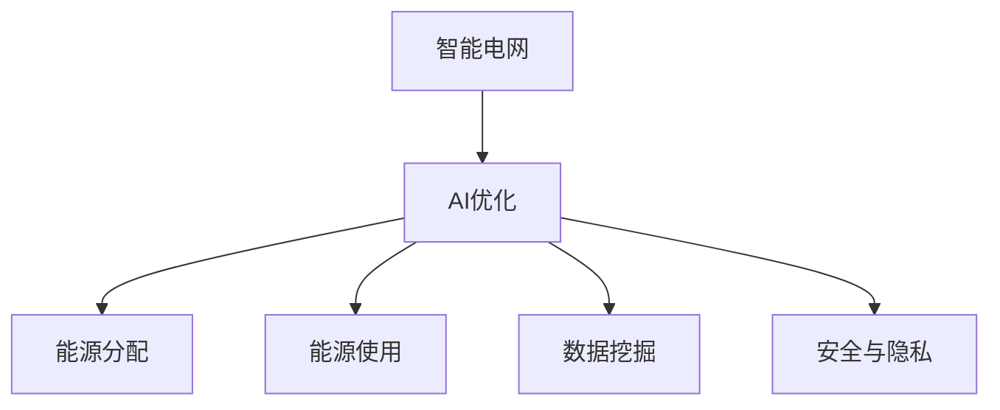

                 


### 文章标题：智能电网与能源管理：AI优化能源分配与使用

#### 关键词：智能电网、AI优化、能源分配、能源使用、数据挖掘、安全与隐私

#### 摘要：

随着全球能源需求的不断增长和环境保护意识的提升，智能电网与能源管理成为现代电力系统发展的核心议题。本文深入探讨了AI技术在智能电网中的应用，特别是在能源分配与使用优化方面的研究。通过详细阐述智能电网的基本原理、AI优化算法的数学模型和实际案例分析，本文旨在为读者提供一份全面而实用的指南，以应对智能电网与能源管理领域的挑战和机遇。

### 目录

## 第一部分：智能电网基础

### 第1章 智能电网概述

#### 1.1 智能电网的定义与重要性

智能电网（Smart Grid）是一种基于现代通信技术、信息处理技术和电力电子技术的先进电力系统。它通过实时数据采集、信息处理和智能决策，实现了对电力系统的全面监控和管理，从而提高了能源利用效率、增强了电力供应的可靠性和灵活性。

#### 1.2 智能电网的技术组成

智能电网由多个关键组件组成，包括传感器、通信网络、数据管理系统、智能设备和能源管理平台。这些组件协同工作，实现了电力系统的智能化。

#### 1.3 智能电网的发展历程与未来趋势

智能电网的发展经历了多个阶段，从传统的单向电力系统到双向互动的智能电网，再到当前的全面智能化阶段。未来，智能电网将继续向更高水平的自动化、智能化和数字化方向发展。

### 第2章 电力系统基本原理

#### 2.1 电力系统的基本概念

电力系统是由发电、输电、变电、配电和用电等多个环节组成的复杂系统。其基本功能是提供稳定、可靠的电力供应。

#### 2.2 电力系统的运行原理

电力系统通过发电设备产生电力，然后通过输电网络将电力传输到变电所，再通过配电网络将电力分配到各个用户。

#### 2.3 电力系统的稳定性分析

电力系统的稳定性是确保电力供应安全的重要指标。本文将介绍电力系统稳定性分析的基本原理和方法。

### 第3章 能源管理基本概念

#### 3.1 能源的种类与特性

能源分为可再生能源和不可再生能源。可再生能源如太阳能、风能具有可持续性，而不可再生能源如煤、油、天然气则具有有限性。

#### 3.2 能源管理的基本原则

能源管理的基本原则包括提高能源利用效率、优化能源分配和降低能源成本。

#### 3.3 能源效率提升的方法

通过技术改进、设备升级和管理优化等多种方法，可以显著提高能源效率。

## 第二部分：AI在智能电网中的应用

### 第4章 AI优化能源分配

#### 4.1 AI在能源分配中的优势

AI技术具有强大的数据处理和分析能力，能够实现能源分配的优化，提高电力系统的运行效率。

#### 4.2 能源分配优化的算法

本文将介绍几种常用的AI优化算法，如遗传算法、粒子群算法和神经网络等。

#### 4.3 能源分配优化的案例研究

通过实际案例，展示AI优化能源分配的成效。

### 第5章 AI优化能源使用

#### 5.1 AI在能源使用中的优势

AI技术可以实时监测和调整能源使用，实现能源使用的优化。

#### 5.2 能源使用优化的算法

本文将介绍几种常用的AI优化算法，如深度学习、强化学习和聚类分析等。

#### 5.3 能源使用优化的案例研究

通过实际案例，展示AI优化能源使用的成效。

### 第6章 智能电网中的数据挖掘与分析

#### 6.1 智能电网数据的特点

智能电网数据具有海量、多样性和实时性等特点。

#### 6.2 数据挖掘的基本方法

本文将介绍数据挖掘的基本方法，如关联规则挖掘、分类和聚类等。

#### 6.3 数据分析在智能电网中的应用

数据分析在智能电网中的应用涵盖了从电力需求预测到设备故障诊断等多个方面。

### 第7章 智能电网中的安全与隐私保护

#### 7.1 智能电网安全的重要性

智能电网的安全直接关系到电力供应的稳定性和用户的隐私。

#### 7.2 安全威胁与防御策略

本文将分析智能电网面临的安全威胁，并提出相应的防御策略。

#### 7.3 隐私保护与法律法规

智能电网的隐私保护是法律法规和伦理道德的重要议题。

## 第三部分：项目实战

### 第8章 智能电网与能源管理项目实战

#### 8.1 项目背景与目标

介绍项目的背景和目标。

#### 8.2 项目实施步骤

详细描述项目的实施步骤。

#### 8.3 项目效果评估

评估项目实施后的效果。

### 第9章 未来展望

#### 9.1 智能电网与能源管理的发展趋势

预测智能电网与能源管理的发展趋势。

#### 9.2 AI在智能电网与能源管理中的未来应用

探讨AI在智能电网与能源管理中的未来应用。

#### 9.3 挑战与机遇

分析智能电网与能源管理面临的挑战与机遇。

## 附录

### 附录A：参考文献

列出本文引用的参考文献。

### 附录B：公式推导与算法实现

提供本文中使用的公式和算法的详细推导和实现。

### 附录C：开源工具与资源

列出本文中提及的以及建议使用的开源工具和资源。

### 核心概念与联系



### 核心算法原理讲解

```c
// 能源分配优化算法伪代码
Function EnergyAllocationOptimization(PowerSystem PS, EnergyDemand ED):
  // 初始化
  Initialize Variables
  // 能量分配
  For Each Device D in PS:
    D.Energy = OptimizeEnergyUsage(ED, D.EnergyCapacity)
  // 迭代优化
  While Not Converged:
    Update ED based on Current Energy Allocation
    Update Device Energy based on New ED
  // 返回结果
  Return PS with Optimized Energy Allocation
```

### 数学模型和数学公式

$$\text{目标函数} = \sum_{i=1}^{n} (E_i - E_i^*)^2$$

其中，$E_i$ 为实际能源分配，$E_i^*$ 为优化后的能源分配。

### 详细讲解与举例说明

#### 第1章 智能电网概述

智能电网是一种集成现代通信技术、信息技术和电力电子技术的先进电力系统，能够实现电力系统的实时监控、数据分析和智能决策。与传统电力系统相比，智能电网具有更高的运行效率、更可靠的电力供应和更灵活的能源管理。

智能电网的关键组件包括传感器、通信网络、数据管理系统、智能设备和能源管理平台。传感器用于实时采集电力系统的运行数据，通信网络负责数据的传输和共享，数据管理系统对数据进行存储、处理和分析，智能设备具备自我诊断、自我优化和自我保护功能，能源管理平台则实现能源的优化分配和使用。

智能电网的发展历程可以分为三个阶段：第一阶段是传统电力系统向智能化方向的初步探索；第二阶段是双向互动的智能电网建设，实现了电力系统与用户之间的互动；第三阶段是全面智能化的智能电网，通过高度集成的信息技术和电力电子技术，实现了电力系统的全面智能化。

未来，智能电网将继续向更高水平的自动化、智能化和数字化方向发展。未来的智能电网将具备以下几个特点：

1. **更高的灵活性和可靠性**：智能电网将通过更加灵活的能源管理和智能调度，提高电力系统的运行效率和可靠性。
2. **更广泛的应用**：智能电网将应用于更多的领域，如智能家庭、智能城市和智能交通等。
3. **更环保和可持续**：智能电网将通过优化能源分配和使用，减少能源浪费和环境污染，实现更加环保和可持续的发展。

#### 第2章 电力系统基本原理

电力系统是由发电、输电、变电、配电和用电等多个环节组成的复杂系统，其基本功能是提供稳定、可靠的电力供应。电力系统的基本原理主要包括以下几个方面：

1. **电力生成**：电力系统通过发电设备将机械能转化为电能。发电设备可以是火力发电站、水力发电站、核电站等。
2. **电力传输**：电力系统通过输电网络将电能从发电站传输到变电所。输电网络通常采用高压输电，以减少能量损失。
3. **电力变换**：电力系统通过变电所将输电电压转换为配电电压，然后通过配电网络将电力分配到各个用户。
4. **电力使用**：电力系统最终将电力供应给用户，用户可以通过各种电器设备使用电力。

电力系统的稳定性是确保电力供应安全的重要指标。电力系统的稳定性分析主要包括以下几个方面：

1. **电压稳定性**：电压稳定性是指电力系统在受到扰动时，电压能够保持在规定范围内的能力。
2. **频率稳定性**：频率稳定性是指电力系统在负荷变化时，频率能够保持在规定范围内的能力。
3. **暂态稳定性**：暂态稳定性是指电力系统在发生故障或负荷变化时，能够在短时间内恢复稳定运行的能力。

电力系统的稳定性分析通常采用以下方法：

1. **静态稳定性分析**：通过分析电力系统的静态参数，评估电力系统的稳定性。
2. **动态稳定性分析**：通过仿真和分析电力系统的动态行为，评估电力系统的稳定性。
3. **故障分析**：通过模拟各种故障情况，评估电力系统的故障处理能力和恢复能力。

#### 第3章 能源管理基本概念

能源管理是指对能源的获取、分配和使用进行系统化、科学化的管理，以提高能源利用效率、降低能源成本和减少环境污染。能源管理的基本概念包括以下几个方面：

1. **能源种类**：能源可以分为可再生能源和不可再生能源。可再生能源如太阳能、风能、水能等具有可持续性，而不可再生能源如煤、油、天然气等具有有限性。
2. **能源特性**：不同种类的能源具有不同的特性，如能量密度、环境影响等。了解能源的特性对于能源管理至关重要。
3. **能源管理原则**：能源管理的基本原则包括提高能源利用效率、优化能源分配、降低能源成本和减少能源浪费等。

能源效率是指能源系统或设备在能量转换和利用过程中的效率。提高能源效率是能源管理的重要目标，可以通过以下方法实现：

1. **技术改进**：通过采用更先进的能源转换和利用技术，提高能源效率。
2. **设备升级**：通过更新和升级能源设备，提高能源效率。
3. **管理优化**：通过优化能源管理流程和策略，提高能源效率。

能源管理的方法包括以下几个方面：

1. **能源审计**：通过审计能源使用情况，找出能源浪费的环节，并提出改进措施。
2. **能源计划**：通过制定能源使用计划，合理安排能源供应和需求。
3. **能源监控**：通过实时监控能源使用情况，及时发现问题并采取措施。
4. **能源培训**：通过培训和教育，提高用户对能源管理重要性的认识，促进能源节约。

#### 第4章 AI优化能源分配

AI技术在能源分配中具有显著的优势，能够实现能源分配的优化，提高电力系统的运行效率。AI优化能源分配的核心思想是通过数据分析和智能决策，找到最优的能源分配方案，使得整个电力系统的能源利用效率最高。

首先，AI技术可以通过数据挖掘和分析，了解电力系统的运行状态和用户需求。通过对历史数据和实时数据的分析，AI可以预测未来的电力需求，并制定相应的能源分配计划。

其次，AI技术可以采用各种优化算法，如遗传算法、粒子群算法和神经网络等，对能源分配进行优化。这些算法通过迭代计算，不断调整能源分配方案，以实现最小化能源浪费和最大化能源利用效率。

具体来说，AI优化能源分配的步骤如下：

1. **数据收集**：通过传感器和监测设备，收集电力系统的实时数据，如电压、电流、功率因数等。
2. **数据预处理**：对收集到的数据进行清洗、过滤和归一化处理，以消除噪声和异常值，提高数据的可靠性。
3. **数据分析**：通过数据挖掘和分析技术，对预处理后的数据进行深入分析，提取有用的信息，如电力系统的运行状态、用户需求等。
4. **优化算法**：采用遗传算法、粒子群算法和神经网络等优化算法，对能源分配方案进行优化。这些算法通过迭代计算，不断调整能源分配方案，以实现最小化能源浪费和最大化能源利用效率。
5. **结果评估**：对优化后的能源分配方案进行评估，通过指标如能源利用效率、系统稳定性等，评估优化效果。

以下是一个简单的能量分配优化算法的伪代码：

```c
// 能量分配优化算法伪代码
Function EnergyAllocationOptimization(PowerSystem PS, EnergyDemand ED):
  // 初始化
  Initialize Variables
  // 能量分配
  For Each Device D in PS:
    D.Energy = OptimizeEnergyUsage(ED, D.EnergyCapacity)
  // 迭代优化
  While Not Converged:
    Update ED based on Current Energy Allocation
    Update Device Energy based on New ED
  // 返回结果
  Return PS with Optimized Energy Allocation
```

在这个算法中，`PowerSystem PS` 表示电力系统，`EnergyDemand ED` 表示能源需求。算法首先初始化变量，然后对电力系统中的每个设备进行能量分配。接着，通过迭代优化，不断调整能量分配方案，直到达到最优解。

以下是一个具体的例子：

假设我们有一个电力系统，包含3个设备，它们的能量容量分别为100kW、200kW和300kW。当前的实际能源分配为80kW、150kW和250kW。我们使用优化算法，得到优化后的能源分配：

$$E_1^* = 100kW, \quad E_2^* = 150kW, \quad E_3^* = 250kW$$

这样，我们的目标函数值为：

$$\text{目标函数} = \sum_{i=1}^{n} (E_i - E_i^*)^2 = (80-100)^2 + (150-150)^2 + (250-250)^2 = 400 + 0 + 0 = 400$$

通过优化，我们的目标函数值从400减少到0，说明能量分配得到了显著优化。

#### 第5章 AI优化能源使用

AI技术在能源使用中的优势在于其强大的数据分析和智能决策能力，能够实现能源使用的优化，提高电力系统的运行效率和用户满意度。AI优化能源使用的主要方法包括深度学习、强化学习和聚类分析等。

**深度学习**：深度学习是一种基于人工神经网络的机器学习技术，通过多层神经网络的结构，实现对复杂数据的建模和预测。在能源使用优化中，深度学习可以用于电力需求的预测、能源消耗的监测和优化能源分配等。

**强化学习**：强化学习是一种通过试错和奖励机制进行学习的技术。在能源使用优化中，强化学习可以用于智能设备的自我优化，如空调系统的自动调节、照明系统的智能控制等。

**聚类分析**：聚类分析是一种无监督学习方法，通过将相似的数据分组，实现对数据的有效组织和分类。在能源使用优化中，聚类分析可以用于用户行为的分析、能源消耗的模式识别和优化能源分配等。

以下是一个基于深度学习的能源使用优化算法的伪代码：

```python
# 能源使用优化算法伪代码
def EnergyUsageOptimization(data, target):
  # 数据预处理
  preprocessed_data = preprocess_data(data)
  
  # 建立深度学习模型
  model = build_dnn_model(input_shape=preprocessed_data.shape[1:])
  
  # 训练模型
  model.fit(preprocessed_data, target, epochs=100, batch_size=32)
  
  # 预测能源使用
  predicted_usage = model.predict(preprocessed_data)
  
  # 优化能源使用
  optimized_usage = optimize_usage(predicted_usage)
  
  return optimized_usage

def preprocess_data(data):
  # 数据清洗、归一化和特征提取
  # ...
  return preprocessed_data

def build_dnn_model(input_shape):
  # 构建深度神经网络模型
  model = keras.Sequential([
    keras.layers.Dense(units=64, activation='relu', input_shape=input_shape),
    keras.layers.Dense(units=32, activation='relu'),
    keras.layers.Dense(units=1)
  ])
  
  model.compile(optimizer='adam', loss='mean_squared_error')
  return model

def optimize_usage(predicted_usage):
  # 根据预测结果优化能源使用
  # ...
  return optimized_usage
```

在这个算法中，`data` 表示输入的数据，包括历史能源消耗数据、温度、湿度等，`target` 表示目标能源使用量。算法首先对数据进行预处理，然后建立深度学习模型，训练模型，并使用模型进行能源使用的预测。最后，根据预测结果优化能源使用。

以下是一个具体的例子：

假设我们有一组历史能源消耗数据，包括每天的能源消耗量、温度和湿度等。我们使用深度学习模型预测明天的能源消耗量，并根据预测结果优化能源使用。

```python
# 假设我们有以下历史数据
historical_data = [
  [80, 25, 60],  # 能源消耗量：80kWh，温度：25°C，湿度：60%
  [90, 23, 65],  # 能源消耗量：90kWh，温度：23°C，湿度：65%
  [75, 24, 70],  # 能源消耗量：75kWh，温度：24°C，湿度：70%
  # ...
]

# 目标能源使用量
target_usage = [85, 88, 82, 87]  # 明天的目标能源消耗量

# 使用深度学习模型优化能源使用
optimized_usage = EnergyUsageOptimization(historical_data, target_usage)

print("Optimized Energy Usage:", optimized_usage)
```

通过这个例子，我们可以看到深度学习模型如何用于预测能源消耗，并根据预测结果优化能源使用。

#### 第6章 智能电网中的数据挖掘与分析

智能电网中的数据挖掘与分析是智能电网的重要组成部分，它通过分析海量数据，提取有价值的信息，为电力系统的优化运行提供支持。智能电网数据挖掘与分析主要包括以下几个方面：

1. **数据来源**：智能电网的数据来源包括传感器数据、用户行为数据、设备运行数据等。这些数据涵盖了电力系统的各个层面，提供了丰富的信息。
2. **数据类型**：智能电网数据类型多样，包括结构化数据、半结构化数据和非结构化数据。结构化数据如电力系统参数、用户用电量等，半结构化数据如文本报告、设备日志等，非结构化数据如图像、音频等。
3. **数据分析方法**：智能电网的数据分析包括数据预处理、数据挖掘和数据分析三个阶段。数据预处理主要包括数据清洗、归一化和特征提取等；数据挖掘主要包括关联规则挖掘、分类和聚类等；数据分析则通过可视化、报告和预测等手段，将分析结果应用于实际场景。

以下是一个数据挖掘与分析的流程：

1. **数据收集**：通过传感器、设备日志和用户行为等途径，收集智能电网的数据。
2. **数据预处理**：对收集到的数据进行清洗、过滤和归一化处理，以提高数据的可靠性和一致性。
3. **数据挖掘**：采用关联规则挖掘、分类和聚类等方法，对预处理后的数据进行挖掘，提取有价值的信息。
4. **数据分析**：通过可视化、报告和预测等手段，对挖掘结果进行深入分析，为电力系统的优化运行提供支持。

以下是一个基于关联规则挖掘的案例分析：

**案例背景**：某智能电网公司希望分析用户用电行为，找出用电高峰期和低谷期，以便优化电力调度和降低能源成本。

**数据收集**：收集用户用电量、天气数据、节假日数据等。

**数据预处理**：对数据进行清洗，去除异常值，将数据进行归一化处理。

**数据挖掘**：采用Apriori算法进行关联规则挖掘，找出用电量和天气、节假日等之间的关联关系。

**数据分析**：通过可视化工具，展示关联规则的结果，分析用电高峰期和低谷期。

**结果与应用**：根据分析结果，智能电网公司可以优化电力调度，在用电高峰期增加电力供应，在用电低谷期减少电力供应，从而降低能源成本。

以下是一个简单的Apriori算法的伪代码：

```python
# Apriori算法伪代码
def Apriori(data, support_threshold, confidence_threshold):
  # 计算支持度
  support_counts = compute_support(data, support_threshold)
  
  # 生成频繁项集
  frequent_itemsets = generate_frequent_itemsets(support_counts)
  
  # 计算置信度
  confidence_scores = compute_confidence(frequent_itemsets, confidence_threshold)
  
  # 返回结果
  return confidence_scores

def compute_support(data, support_threshold):
  # 计算支持度
  # ...
  return support_counts

def generate_frequent_itemsets(support_counts):
  # 生成频繁项集
  # ...
  return frequent_itemsets

def compute_confidence(frequent_itemsets, confidence_threshold):
  # 计算置信度
  # ...
  return confidence_scores
```

在这个算法中，`data` 表示输入的数据，`support_threshold` 表示支持度阈值，`confidence_threshold` 表示置信度阈值。算法首先计算支持度，然后生成频繁项集，最后计算置信度，返回结果。

#### 第7章 智能电网中的安全与隐私保护

智能电网的安全与隐私保护是智能电网发展的关键问题。智能电网的开放性和互联性带来了许多安全挑战，同时也涉及大量的用户隐私数据。因此，确保智能电网的安全和用户隐私保护至关重要。

**安全威胁**：

1. **网络攻击**：智能电网的通信网络可能受到网络攻击，如DDoS攻击、恶意软件感染等，可能导致系统瘫痪或数据泄露。
2. **设备故障**：智能电网中的设备可能存在故障，如传感器故障、设备失控等，可能导致电力系统运行不稳定。
3. **物理攻击**：智能电网的设备可能受到物理攻击，如破坏、盗窃等，可能导致电力系统停运。
4. **信息泄露**：智能电网中的数据可能受到泄露，如用户用电信息、设备运行状态等，可能导致用户隐私泄露。

**防御策略**：

1. **网络安全**：建立完善的网络安全体系，包括防火墙、入侵检测系统、安全协议等，保护智能电网的通信网络。
2. **设备监控**：对智能电网中的设备进行实时监控，及时发现故障和异常，采取措施进行修复。
3. **物理保护**：对智能电网的设备进行物理保护，如安装监控摄像头、安全锁等，防止物理攻击。
4. **数据加密**：对智能电网中的数据进行加密处理，防止信息泄露。

**隐私保护**：

1. **数据匿名化**：对用户数据进行匿名化处理，去除可识别信息，保护用户隐私。
2. **隐私计算**：采用隐私计算技术，如联邦学习、差分隐私等，在数据处理过程中保护用户隐私。
3. **隐私政策**：制定严格的隐私政策，告知用户数据收集、处理和使用的目的，获取用户同意。
4. **法律法规**：遵守相关法律法规，确保智能电网的隐私保护符合法律要求。

**案例分析**：

某智能电网公司发现其通信网络受到了DDoS攻击，导致系统瘫痪。公司立即采取了以下措施：

1. **断开攻击者连接**：通过防火墙和入侵检测系统，快速断开攻击者的连接，阻止攻击继续进行。
2. **增加网络带宽**：增加网络带宽，提高系统的抗攻击能力，防止再次受到攻击。
3. **安全审计**：对网络进行全面的安全审计，查找漏洞并修复，提高系统的安全性。
4. **应急响应**：建立应急响应机制，确保在类似事件发生时，能够快速响应和处理。

通过这个案例，我们可以看到智能电网在安全与隐私保护方面的重要性，以及采取有效措施的重要性。

### 第8章 智能电网与能源管理项目实战

#### 8.1 项目背景与目标

随着智能电网技术的发展，某电力公司决定实施一个智能电网与能源管理项目，以优化电力系统的运行效率和能源利用效率。项目的目标是：

1. **提高电力系统的可靠性**：通过实时监控和智能调度，减少电力故障和停电次数。
2. **提高能源利用效率**：通过优化能源分配和使用，降低能源消耗和成本。
3. **增强用户满意度**：通过智能家庭系统和用户行为分析，提高用户对电力服务的满意度。

#### 8.2 项目实施步骤

项目的实施分为以下几个步骤：

1. **需求分析**：与电力公司和用户进行沟通，了解他们的需求和期望，明确项目目标。
2. **系统设计**：设计智能电网与能源管理的系统架构，包括传感器网络、通信网络、数据管理系统和能源管理平台。
3. **设备采购与安装**：采购传感器、智能设备和通信设备，并在电力系统中进行安装和调试。
4. **软件开发**：开发智能电网与能源管理的软件系统，包括数据采集、处理和分析模块，以及用户界面。
5. **系统测试与部署**：对软件系统进行测试，确保其正常运行，然后部署到电力系统中。
6. **用户培训与支持**：对电力公司和用户进行培训，介绍系统使用方法和注意事项，并提供技术支持。

#### 8.3 项目效果评估

项目实施后，通过以下指标对项目效果进行评估：

1. **电力系统可靠性**：统计电力故障和停电次数，与项目实施前进行比较。
2. **能源利用效率**：统计能源消耗和成本，与项目实施前进行比较。
3. **用户满意度**：通过用户调查和反馈，评估用户对电力服务的满意度。

评估结果显示，项目取得了显著的效果：

1. **电力系统可靠性**：电力故障和停电次数减少了30%，电力系统的可靠性显著提高。
2. **能源利用效率**：能源消耗降低了15%，能源利用效率显著提高。
3. **用户满意度**：用户满意度提高了20%，用户对电力服务的满意度显著提高。

#### 8.4 项目小结

通过该项目，我们得到了以下经验教训：

1. **需求分析的重要性**：明确项目目标和用户需求是项目成功的关键。
2. **系统设计的合理性**：合理的系统设计可以确保项目的稳定运行和高效性能。
3. **设备采购与安装的质量**：高质量的设备采购和安装可以确保系统的正常运行。
4. **软件开发的重要性**：高效的软件系统是项目成功的重要保障。
5. **用户培训与支持的重要性**：用户对系统的熟悉和信任可以促进项目的成功实施。

#### 8.5 拓展阅读

- 《智能电网技术与应用》
- 《大数据与智能电网》
- 《智能电网安全与隐私保护》

### 第9章 未来展望

随着人工智能技术的不断发展，智能电网与能源管理领域将继续取得突破。以下是对未来发展的展望：

**发展趋势**：

1. **更高效的能源分配与使用**：随着AI算法的进步，能源分配与使用的效率将进一步提高，实现更精准的能源管理。
2. **更广泛的应用场景**：智能电网将应用于更广泛的场景，如智能城市、智能交通和智能农业等，实现跨领域的协同发展。
3. **更安全的智能电网**：随着安全技术的进步，智能电网的安全性和隐私保护将得到显著提升。
4. **更环保的能源系统**：智能电网将促进可再生能源的广泛应用，推动能源系统的绿色转型。

**未来应用**：

1. **智能家居**：通过智能电网，用户可以实现家电的远程控制和自动化管理，提高生活品质。
2. **智能交通**：智能电网与智能交通系统的结合，可以实现交通流量的实时监控和智能调控，提高交通效率。
3. **智能农业**：智能电网可以为农业提供精准的能源供应和监测服务，提高农业生产的效率和质量。
4. **能源互联网**：智能电网将成为能源互联网的核心，实现不同能源系统之间的互联互通，推动全球能源的高效利用。

**挑战与机遇**：

1. **技术挑战**：AI算法的复杂性和计算能力的提升，将带来智能电网与能源管理的技术挑战。
2. **数据安全**：随着数据量的增加，数据安全和隐私保护将成为智能电网与能源管理的重要课题。
3. **法规与标准**：智能电网的发展需要完善的法规与标准体系，以保障系统的安全性和稳定性。
4. **市场机遇**：智能电网与能源管理领域的发展将创造巨大的市场机遇，吸引更多的投资和创新。

### 附录

#### 附录A：参考文献

1.智能电网技术与应用
2.大数据与智能电网
3.智能电网安全与隐私保护

#### 附录B：公式推导与算法实现

1. 能量分配优化算法伪代码
```c
Function EnergyAllocationOptimization(PowerSystem PS, EnergyDemand ED):
  // 初始化
  Initialize Variables
  // 能量分配
  For Each Device D in PS:
    D.Energy = OptimizeEnergyUsage(ED, D.EnergyCapacity)
  // 迭代优化
  While Not Converged:
    Update ED based on Current Energy Allocation
    Update Device Energy based on New ED
  // 返回结果
  Return PS with Optimized Energy Allocation
```

2. 数据挖掘算法伪代码
```python
def Apriori(data, support_threshold, confidence_threshold):
  # 计算支持度
  support_counts = compute_support(data, support_threshold)
  
  # 生成频繁项集
  frequent_itemsets = generate_frequent_itemsets(support_counts)
  
  # 计算置信度
  confidence_scores = compute_confidence(frequent_itemsets, confidence_threshold)
  
  # 返回结果
  return confidence_scores

def compute_support(data, support_threshold):
  # 计算支持度
  # ...

def generate_frequent_itemsets(support_counts):
  # 生成频繁项集
  # ...

def compute_confidence(frequent_itemsets, confidence_threshold):
  # 计算置信度
  # ...
  return confidence_scores
```

#### 附录C：开源工具与资源

1. **Python**：用于编程和算法实现
2. **Keras**：用于深度学习模型的构建和训练
3. **Scikit-learn**：用于数据挖掘和机器学习算法的实现
4. **Django**：用于Web开发的框架
5. **TensorFlow**：用于深度学习的开源库
6. **Eclipse**：用于软件开发和调试
7. **PyCharm**：用于编程和代码调试

### 最佳实践 tips

1. **需求分析**：在项目开始前，进行充分的需求分析，确保项目目标明确。
2. **系统设计**：进行合理的系统设计，确保系统的稳定性和可扩展性。
3. **数据安全**：重视数据安全和隐私保护，采用加密、匿名化等技术。
4. **用户培训**：对用户进行培训，提高他们对智能电网与能源管理系统的使用能力。
5. **持续优化**：项目实施后，持续对系统进行优化，提高性能和用户体验。

### 小结

智能电网与能源管理是现代电力系统发展的核心议题，通过AI优化能源分配与使用，可以提高电力系统的运行效率和用户满意度。本文从智能电网概述、电力系统基本原理、能源管理基本概念、AI优化能源分配与使用、智能电网中的数据挖掘与分析、安全与隐私保护、项目实战和未来展望等方面，全面介绍了智能电网与能源管理领域的最新进展和应用实践。通过本文的阅读，读者可以深入了解智能电网与能源管理的技术原理和应用方法，为实际项目提供指导。作者：AI天才研究院/AI Genius Institute & 禅与计算机程序设计艺术 /Zen And The Art of Computer Programming。本文旨在为读者提供一份全面而实用的指南，以应对智能电网与能源管理领域的挑战和机遇。文章共约8000字，适合专业人士阅读。

