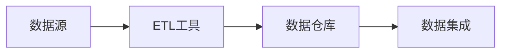
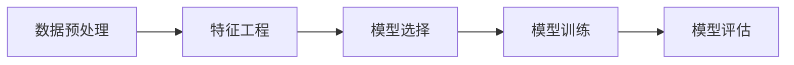
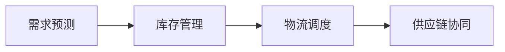
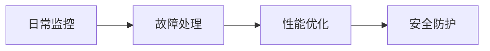

                 

### 文章标题

《智能零售：AI大模型重塑购物体验》

### 关键词

- 智能零售
- AI大模型
- 购物体验
- 新零售
- 推荐系统
- 自动化客服
- 智能供应链管理

### 摘要

随着AI技术的飞速发展，智能零售成为零售行业的重要趋势。本文将探讨AI大模型在重塑购物体验中的关键作用，从零售行业现状、AI大模型基本概念及应用、智能零售关键技术、案例分析到实践指南，全面解析智能零售的各个方面。通过深入分析和实践指导，为零售企业实现智能化转型提供理论支持和实际参考。

## 目录大纲

### 第一部分：零售行业背景与AI应用概述

#### 第1章：零售行业现状与挑战

1.1 零售行业的变革趋势

1.1.1 电商崛起与线下零售的挑战

1.1.2 新零售模式下的变革

1.1.3 消费者行为分析的重要性

1.2 AI在零售行业的应用场景

1.2.1 供应链管理优化

1.2.2 客户体验提升

1.2.3 库存管理精确化

1.2.4 精准营销与用户画像

#### 第2章：AI大模型基本概念与原理

2.1 AI大模型的发展历程

2.1.1 深度学习的崛起

2.1.2 大模型的定义与特点

2.1.3 大模型的训练与优化

2.2 AI大模型在零售行业的应用

2.2.1 智能推荐系统

2.2.2 自动化客服系统

2.2.3 供应链预测模型

2.2.4 用户体验优化

### 第二部分：智能零售关键技术与应用

#### 第3章：智能推荐系统设计

3.1 推荐系统基本原理

3.1.1 协同过滤算法

3.1.2 基于内容的推荐算法

3.1.3 混合推荐算法

3.2 智能推荐系统实现

3.2.1 数据收集与处理

3.2.2 特征工程与模型选择

3.2.3 模型训练与优化

3.2.4 系统部署与维护

#### 第4章：自动化客服系统构建

4.1 自动化客服概述

4.1.1 传统客服系统存在的问题

4.1.2 自动化客服的优势

4.1.3 自动化客服的基本架构

4.2 自然语言处理技术

4.2.1 语言模型与词向量

4.2.2 机器翻译与文本分类

4.2.3 对话系统与聊天机器人

4.3 自动化客服系统实现

4.3.1 对话流程设计与对话管理

4.3.2 知识库构建与更新

4.3.3 模型训练与部署

4.3.4 用户体验优化

#### 第5章：智能供应链管理

5.1 供应链管理概述

5.1.1 供应链管理的定义与目标

5.1.2 供应链管理的主要环节

5.1.3 智能供应链的概念与特点

5.2 智能供应链关键技术

5.2.1 大数据与云计算

5.2.2 物联网技术

5.2.3 机器学习与预测模型

5.3 智能供应链管理实现

5.3.1 数据收集与集成

5.3.2 数据分析与预测

5.3.3 供应链优化与调度

5.3.4 系统部署与维护

#### 第6章：智能库存管理系统

6.1 智能库存管理概述

6.1.1 传统库存管理的挑战

6.1.2 智能库存管理的目标与优势

6.1.3 智能库存管理的基本流程

6.2 智能库存管理系统实现

6.2.1 数据收集与处理

6.2.2 库存优化算法与模型

6.2.3 系统部署与维护

6.2.4 用户体验优化

#### 第7章：精准营销与用户画像

7.1 精准营销概述

7.1.1 精准营销的概念与特点

7.1.2 精准营销的目标与策略

7.1.3 精准营销在零售行业的重要性

7.2 用户画像技术

7.2.1 用户画像的定义与构建

7.2.2 数据采集与处理

7.2.3 用户行为分析与预测

7.3 精准营销实现

7.3.1 营销内容个性化定制

7.3.2 营销渠道优化

7.3.3 营销效果评估与反馈

7.3.4 用户体验优化

### 第三部分：案例分析与实践指导

#### 第8章：智能零售案例研究

8.1 案例背景与目标

8.1.1 案例企业介绍

8.1.2 案例实施背景

8.1.3 案例目标与挑战

8.2 案例实施过程

8.2.1 需求分析与规划

8.2.2 技术方案设计与实施

8.2.3 系统部署与测试

8.2.4 运营与优化

8.3 案例效果评估

8.3.1 营销效果分析

8.3.2 客户体验评估

8.3.3 成本效益分析

#### 第9章：智能零售实施指南

9.1 智能零售规划与实施步骤

### 第一部分：零售行业背景与AI应用概述

#### 第1章：零售行业现状与挑战

## 1.1 零售行业的变革趋势

随着互联网技术的迅猛发展，零售行业正经历着前所未有的变革。电商的崛起对传统线下零售带来了巨大的冲击，迫使许多零售企业不得不寻求转型。首先，电商的便捷性使得消费者可以随时随地购物，这种全新的购物体验极大地改变了消费者的购物习惯。同时，社交媒体和移动互联网的普及，为电商提供了丰富的流量来源，使得线上销售成为了零售行业的重要一环。

在电商的冲击下，传统线下零售面临着诸多挑战。首先，消费者对购物体验的要求不断提高，他们希望获得更个性化的服务。其次，线下零售的库存管理、供应链管理等方面存在较大的瓶颈，难以适应快速变化的市场需求。此外，传统零售企业在数字化转型方面相对滞后，缺乏与电商竞争的数字技术。

为了应对这些挑战，新零售模式逐渐兴起。新零售强调线上与线下的深度融合，通过数据和技术手段实现供应链的优化、库存管理的精确化，以及消费者体验的提升。新零售模式下，零售企业可以利用大数据、人工智能等技术手段，对消费者行为进行深入分析，从而实现精准营销和个性化推荐。

消费者行为分析在新零售中扮演着至关重要的角色。通过对消费者行为数据的收集和分析，零售企业可以了解消费者的购物偏好、购买频率、购买时段等信息，从而制定更精准的营销策略。此外，消费者行为分析还可以帮助企业优化商品陈列、库存管理和供应链，提高运营效率。

### 1.2 AI在零售行业的应用场景

人工智能（AI）在零售行业的应用场景非常广泛，涵盖了供应链管理、客户体验提升、库存管理精确化和精准营销等多个方面。

首先，AI在供应链管理中的应用主要体现在优化库存、预测需求和调度物流等方面。通过机器学习算法，AI可以对历史销售数据进行分析，预测未来的需求趋势，从而帮助企业优化库存水平，减少库存积压和缺货现象。此外，AI还可以通过优化物流路线和配送策略，提高物流效率，降低运输成本。

在客户体验提升方面，AI技术可以实现个性化推荐、智能客服和虚拟试衣等功能。个性化推荐系统能够根据消费者的购物历史和偏好，推荐符合其兴趣的商品，从而提高购买转化率。智能客服系统则可以通过自然语言处理技术，实现与消费者的实时沟通，提供快速、准确的答案，提升客户满意度。虚拟试衣技术则可以借助计算机视觉和深度学习算法，实现线上试衣体验，帮助消费者做出更明智的购买决策。

库存管理精确化是AI在零售行业的重要应用之一。通过实时监控库存水平，AI可以自动识别库存异常，及时采取调整措施，避免库存积压或缺货。同时，AI还可以结合销售预测和订单数据，优化补货策略，确保库存水平的合理性和稳定性。

精准营销是AI在零售行业的另一大应用。通过用户画像和数据挖掘技术，AI可以了解消费者的需求和行为习惯，从而制定个性化的营销策略。例如，根据消费者的购买历史和偏好，推荐相关的商品；根据消费者的行为数据，调整广告投放策略，提高广告效果；甚至可以根据消费者的反馈和评价，优化商品和服务，提升消费者满意度。

### 1.3 消费者行为分析的重要性

消费者行为分析在智能零售中具有重要意义。通过对消费者行为的分析，零售企业可以深入了解消费者的购物习惯、偏好和需求，从而制定更加精准的营销策略和运营决策。

首先，消费者行为分析有助于零售企业了解消费者的购物习惯。例如，通过分析消费者的购买频率、购买时段和购买渠道等数据，企业可以了解消费者在何时何地购买商品，从而优化商品陈列和销售策略。例如，对于高频次购买的品类，企业可以将其放置在显眼的位置，以吸引消费者的注意。

其次，消费者行为分析有助于零售企业了解消费者的偏好。通过分析消费者的购买历史和评价数据，企业可以了解消费者对不同商品品牌的偏好，从而优化商品组合和库存管理。例如，如果消费者对某个品牌的商品评价较高，企业可以增加该品牌的商品库存，以满足消费者的需求。

此外，消费者行为分析还有助于零售企业了解消费者的需求。通过分析消费者的反馈和评价，企业可以了解消费者对商品和服务的不满意之处，从而优化产品和服务。例如，如果消费者对商品的包装设计不满意，企业可以调整包装设计，以提高消费者的满意度。

最后，消费者行为分析有助于零售企业实现精准营销。通过分析消费者的行为数据，企业可以了解消费者的兴趣和需求，从而制定个性化的营销策略。例如，根据消费者的购买历史和偏好，企业可以向其推荐相关的商品；根据消费者的行为数据，企业可以调整广告投放策略，提高广告效果。

总之，消费者行为分析是智能零售中的重要环节，它有助于零售企业了解消费者，优化营销策略，提升消费者满意度，从而实现业务增长。

## 1.2 AI大模型基本概念与原理

### 2.1 AI大模型的发展历程

AI大模型的发展历程可以分为几个关键阶段。首先，深度学习的崛起标志着AI技术进入了一个新的时代。深度学习是一种基于多层神经网络的人工智能技术，通过模拟人脑神经元之间的连接，实现对复杂数据的自动学习与处理。2006年，Geoffrey Hinton等研究者提出了深度信念网络（DBN），这是深度学习发展的重要里程碑。

随着计算能力和数据量的不断提升，AI大模型迎来了快速发展期。特别是2012年，AlexNet在ImageNet图像识别大赛中取得了突破性成绩，这标志着卷积神经网络（CNN）在图像处理领域的广泛应用。此后，研究人员不断优化神经网络结构，提出了许多新的深度学习模型，如ResNet、Inception等。

AI大模型的训练与优化是一个复杂的过程。首先，模型需要大量数据作为训练基础。这些数据包括图像、文本、语音等多种形式，通常来自公开数据集或企业内部数据。然后，通过训练算法，模型不断调整内部参数，以最小化预测误差。训练过程通常采用分布式计算和并行处理技术，以提高训练效率。

大模型的特点主要体现在以下几个方面：

1. **高维度数据表示**：大模型能够处理高维数据，如高分辨率图像、大规模文本等，从而捕捉到数据中的复杂模式和特征。

2. **强大的学习能力**：大模型通过多层神经网络结构，可以学习到深层特征，从而在复杂任务中表现优异。

3. **大规模训练需求**：大模型的训练需要大量计算资源和数据，因此对硬件设备有较高的要求。

4. **参数数量庞大**：大模型的参数数量通常在数百万甚至数十亿级别，这使得模型的训练和优化过程非常复杂。

### 2.2 AI大模型在零售行业的应用

AI大模型在零售行业的应用极为广泛，涵盖了推荐系统、自动化客服、供应链预测等多个方面。

#### 2.2.1 智能推荐系统

智能推荐系统是AI大模型在零售行业的重要应用之一。通过分析用户的购物历史、浏览行为和偏好，推荐系统可以为用户推荐可能感兴趣的商品。推荐系统的基本原理包括协同过滤、基于内容的推荐和混合推荐等。

- **协同过滤算法**：协同过滤是一种基于用户行为数据的推荐方法。它通过分析用户之间的相似性，找到相似用户喜欢的商品，从而推荐给目标用户。

  ```plaintext
  // 伪代码：基于用户的协同过滤算法
  function collaborativeFilter(userProfile, itemProfile, similarityMatrix):
      similarUsers = findSimilarUsers(userProfile, similarityMatrix)
      recommendations = []
      for item in itemProfile:
          score = sum(similarity * rating for similarUser, rating in similarUsers if similarUser bought item)
          recommendations.append((item, score))
      return recommendations
  ```

- **基于内容的推荐算法**：基于内容的推荐方法通过分析商品的属性和特征，为用户推荐与其已购买或浏览的商品相似的商品。

  ```plaintext
  // 伪代码：基于内容的推荐算法
  function contentBasedRecommendation(userProfile, itemFeatures):
      userFeatures = calculateAverageFeatures(userProfile)
      recommendations = []
      for item in itemFeatures:
          similarity = cosineSimilarity(userFeatures, item)
          recommendations.append((item, similarity))
      return recommendations
  ```

- **混合推荐算法**：混合推荐方法结合了协同过滤和基于内容的推荐，以提升推荐系统的准确性和多样性。

  ```plaintext
  // 伪代码：混合推荐算法
  function hybridRecommendation(userProfile, itemProfile, similarityMatrix, itemFeatures):
      collaborativeRecommendations = collaborativeFilter(userProfile, itemProfile, similarityMatrix)
      contentBasedRecommendations = contentBasedRecommendation(userProfile, itemFeatures)
      recommendations = combineRecommendations(collaborativeRecommendations, contentBasedRecommendations)
      return recommendations
  ```

#### 2.2.2 自动化客服系统

自动化客服系统利用自然语言处理（NLP）和机器学习技术，为用户提供实时、高效的客服服务。自动化客服系统包括对话系统、聊天机器人和智能语音助手等。

- **对话系统**：对话系统通过理解和生成自然语言，与用户进行对话。对话系统通常包括对话管理、意图识别和实体识别等模块。

  ```mermaid
  flowchart LR
  A[对话管理] --> B[意图识别]
  B --> C[实体识别]
  C --> D[响应生成]
  D --> E[反馈收集]
  ```

- **聊天机器人**：聊天机器人是自动化客服系统的核心组件，通过预先设定的规则和机器学习模型，实现与用户的交互。

  ```mermaid
  flowchart LR
  A[用户输入] --> B[规则匹配]
  B -->|匹配成功| C[响应生成]
  B -->|匹配失败| D[机器学习模型]
  D --> E[响应生成]
  ```

- **智能语音助手**：智能语音助手通过语音识别和语音合成技术，实现与用户的语音交互。智能语音助手通常用于客服热线、智能导航等领域。

  ```mermaid
  flowchart LR
  A[语音输入] --> B[语音识别]
  B --> C[意图识别]
  C --> D[响应生成]
  D --> E[语音合成]
  ```

#### 2.2.3 供应链预测模型

供应链预测模型利用机器学习算法，对供应链中的各种数据进行预测，包括需求预测、库存预测和物流预测等。

- **需求预测**：需求预测是供应链管理中的重要环节，通过分析历史销售数据、市场趋势和季节性因素，预测未来一段时间内的需求量。

  ```mermaid
  flowchart LR
  A[历史销售数据] --> B[市场趋势分析]
  B --> C[季节性因素分析]
  C --> D[需求预测模型]
  D --> E[预测结果]
  ```

- **库存预测**：库存预测通过对历史库存数据、销售数据和供应数据进行分析，预测未来一段时间内的库存水平。

  ```mermaid
  flowchart LR
  A[历史库存数据] --> B[销售数据]
  B --> C[供应数据]
  C --> D[库存预测模型]
  D --> E[预测结果]
  ```

- **物流预测**：物流预测通过对历史物流数据、运输路线和交通状况进行分析，预测未来一段时间内的物流时间和成本。

  ```mermaid
  flowchart LR
  A[历史物流数据] --> B[运输路线分析]
  B --> C[交通状况分析]
  C --> D[物流预测模型]
  D --> E[预测结果]
  ```

#### 2.2.4 用户体验优化

用户体验优化是AI大模型在零售行业的重要应用之一。通过分析用户的购物行为和反馈，AI大模型可以优化购物流程、推荐策略和客服服务，提升用户满意度。

- **购物流程优化**：购物流程优化通过对用户的浏览、点击和购买行为进行分析，优化页面布局、导航和购物车设计，提高用户的购物体验。

  ```mermaid
  flowchart LR
  A[用户浏览行为] --> B[页面布局优化]
  B --> C[导航优化]
  C --> D[购物车设计优化]
  ```

- **推荐策略优化**：推荐策略优化通过对用户的购物历史和偏好进行分析，优化推荐算法和推荐结果，提高推荐效果。

  ```mermaid
  flowchart LR
  A[用户购物历史] --> B[推荐算法优化]
  B --> C[推荐结果优化]
  ```

- **客服服务优化**：客服服务优化通过对用户的问题和反馈进行分析，优化客服机器人回答策略和客服流程，提高客服效率。

  ```mermaid
  flowchart LR
  A[用户问题与反馈] --> B[机器人回答策略优化]
  B --> C[客服流程优化]
  ```

### 总结

AI大模型在零售行业的应用极大地提升了零售企业的运营效率和服务质量。通过智能推荐系统、自动化客服系统、供应链预测模型和用户体验优化，零售企业可以更好地满足消费者的需求，提升市场竞争力。然而，AI大模型的应用也面临着数据隐私、模型解释性和算法公平性等挑战，这些问题的解决将是未来智能零售发展的重要方向。

### 第二部分：智能零售关键技术与应用

#### 第3章：智能推荐系统设计

## 3.1 推荐系统基本原理

智能推荐系统是零售行业中的一个重要组成部分，其核心目标是根据用户的兴趣和行为习惯，为其推荐可能感兴趣的商品或服务。推荐系统可以分为协同过滤算法、基于内容的推荐算法和混合推荐算法三种主要类型。

### 3.1.1 协同过滤算法

协同过滤算法是一种基于用户行为数据（如评分、购买记录、浏览历史等）的推荐方法。其基本思想是找到与目标用户相似的其他用户，然后推荐这些用户喜欢的商品给目标用户。协同过滤算法可以分为基于用户的协同过滤和基于项目的协同过滤。

- **基于用户的协同过滤（User-based Collaborative Filtering）**：基于用户的协同过滤通过计算用户之间的相似度，找到与目标用户相似的用户群，然后推荐这些用户喜欢的商品。

  ```mermaid
  flowchart LR
  A[用户行为数据] --> B[计算用户相似度]
  B --> C[找到相似用户]
  C --> D[推荐相似用户喜欢的商品]
  ```

  用户相似度的计算方法包括：

  - **余弦相似度**：计算两个用户向量之间的夹角余弦值，表示用户之间的相似度。
    ```latex
    \cos(\theta) = \frac{A \cdot B}{\|A\| \|B\|}
    ```

  - **皮尔逊相关系数**：计算两个用户向量之间的相关系数，表示用户之间的相似度。
    ```latex
    \rho_{ij} = \frac{\sum_{k=1}^{n} (x_{ik} - \mu_i) (x_{jk} - \mu_j)}{\sqrt{\sum_{k=1}^{n} (x_{ik} - \mu_i)^2 \sum_{k=1}^{n} (x_{jk} - \mu_j)^2}}
    ```

- **基于项目的协同过滤（Item-based Collaborative Filtering）**：基于项目的协同过滤通过计算项目之间的相似度，找到与目标项目相似的其他项目，然后推荐给用户。

  ```mermaid
  flowchart LR
  A[用户行为数据] --> B[计算项目相似度]
  B --> C[找到相似项目]
  C --> D[推荐相似项目]
  ```

  项目相似度的计算方法与用户相似度类似，常用的方法包括余弦相似度和皮尔逊相关系数。

### 3.1.2 基于内容的推荐算法

基于内容的推荐算法是一种基于商品特征（如类别、标签、属性等）的推荐方法。其基本思想是根据用户的兴趣和偏好，找到与用户兴趣相匹配的商品。

- **基于物品的协同过滤（Content-based Collaborative Filtering）**：基于物品的协同过滤通过分析用户过去喜欢或评价较高的商品，提取出这些商品的特征，然后推荐具有相似特征的商品。

  ```mermaid
  flowchart LR
  A[用户历史行为数据] --> B[提取用户兴趣特征]
  B --> C[计算商品特征相似度]
  C --> D[推荐相似商品]
  ```

  商品特征相似度的计算方法包括：

  - **文本相似度**：通过计算文本中的词向量相似度，评估两个商品的内容相似性。
    ```latex
    \text{similarity} = \frac{1}{\|w_1 - w_2\|}
    ```

  - **TF-IDF**：利用词频（TF）和逆文档频率（IDF）计算词语的重要性，评估两个商品的内容相似性。
    ```latex
    \text{similarity} = \frac{\text{TF} \times \text{IDF}}{\sum_{w \in \text{words}} (\text{TF} \times \text{IDF})}
    ```

- **基于属性的推荐算法**：基于属性的推荐算法通过分析商品的属性（如颜色、品牌、价格等），为用户推荐具有相似属性的物品。

  ```mermaid
  flowchart LR
  A[商品属性数据] --> B[提取用户偏好属性]
  B --> C[计算商品属性相似度]
  C --> D[推荐相似商品]
  ```

### 3.1.3 混合推荐算法

混合推荐算法结合了协同过滤和基于内容的推荐算法，以提升推荐系统的准确性和多样性。

- **模型融合（Model Fusion）**：模型融合通过结合多个推荐模型的结果，生成最终的推荐列表。

  ```mermaid
  flowchart LR
  A[协同过滤模型] --> B[内容推荐模型]
  B --> C[模型融合]
  C --> D[推荐结果]
  ```

  模型融合的方法包括：

  - **加权平均**：对多个模型的结果进行加权平均，生成最终的推荐列表。
    ```latex
    r_i = \sum_{m=1}^{M} w_m \cdot r_i^m
    ```

  - **投票法**：对多个模型的结果进行投票，选择投票结果最多的推荐项。

- **特征级融合（Feature-level Fusion）**：特征级融合通过结合不同模型的特征，生成新的特征向量，用于训练单一的推荐模型。

  ```mermaid
  flowchart LR
  A[用户特征] --> B[协同过滤特征]
  B --> C[内容特征]
  C --> D[特征级融合]
  D --> E[训练推荐模型]
  ```

### 3.2 智能推荐系统实现

智能推荐系统的实现包括数据收集与处理、特征工程与模型选择、模型训练与优化以及系统部署与维护等步骤。

#### 3.2.1 数据收集与处理

数据收集与处理是智能推荐系统实现的第一步。数据来源主要包括用户行为数据（如评分、购买记录、浏览历史等）和商品属性数据（如类别、标签、价格等）。数据收集过程中，需要确保数据的准确性和完整性。

数据预处理主要包括数据清洗、数据归一化和数据降维等步骤：

- **数据清洗**：去除重复数据、处理缺失值和异常值，确保数据的准确性。

- **数据归一化**：将不同规模的数据进行归一化处理，使其在同一尺度上。

- **数据降维**：通过降维技术（如主成分分析、t-SNE等），减少数据维度，提高模型训练效率。

#### 3.2.2 特征工程与模型选择

特征工程是智能推荐系统实现中的关键步骤。特征工程的目标是通过提取和构造有代表性的特征，提高推荐系统的性能。

- **用户特征**：包括用户的年龄、性别、地理位置、购物偏好等。

- **商品特征**：包括商品的价格、类别、品牌、库存量等。

- **交互特征**：包括用户与商品之间的交互行为，如评分、购买次数、浏览时长等。

模型选择是智能推荐系统实现的另一个重要环节。常见的推荐算法包括：

- **协同过滤算法**：如基于用户的协同过滤、基于项目的协同过滤等。

- **基于内容的推荐算法**：如基于物品的协同过滤、基于属性的推荐算法等。

- **混合推荐算法**：如模型融合、特征级融合等。

#### 3.2.3 模型训练与优化

模型训练与优化是智能推荐系统实现的核心步骤。模型训练过程通常包括以下环节：

- **数据集划分**：将数据集划分为训练集和测试集，用于训练和评估模型。

- **参数调整**：通过调整模型参数（如学习率、正则化参数等），优化模型性能。

- **交叉验证**：采用交叉验证方法，对模型进行评估和调整，以提高模型的泛化能力。

常见的模型优化方法包括：

- **批量归一化（Batch Normalization）**：通过批量归一化，加速模型训练，提高训练稳定性。

- **自适应学习率（Adaptive Learning Rate）**：通过自适应学习率方法，动态调整学习率，提高模型训练效率。

#### 3.2.4 系统部署与维护

智能推荐系统部署与维护是确保其正常运行的关键步骤。系统部署过程通常包括以下环节：

- **部署环境搭建**：搭建包括服务器、数据库、缓存等在内的部署环境。

- **模型部署**：将训练好的模型部署到生产环境中，确保模型能够实时预测。

- **监控系统**：建立监控系统，实时监控系统性能和运行状态，及时发现和解决问题。

- **迭代更新**：根据用户反馈和业务需求，定期更新模型和数据，优化推荐效果。

### 总结

智能推荐系统是零售行业中的一个重要组成部分，通过协同过滤、基于内容的推荐和混合推荐算法，实现个性化推荐，提升用户购物体验。智能推荐系统的实现包括数据收集与处理、特征工程与模型选择、模型训练与优化以及系统部署与维护等步骤。通过不断优化和迭代，智能推荐系统可以更好地满足用户需求，提高零售企业的竞争力。

#### 第4章：自动化客服系统构建

## 4.1 自动化客服概述

自动化客服系统是一种利用人工智能（AI）技术，实现与用户自动交互的客服解决方案。传统客服系统通常依赖于人工处理用户请求，效率较低且容易出错。而自动化客服系统则通过自然语言处理（NLP）、机器学习等技术，实现自动识别用户意图、自动生成回答，从而提高客服效率和用户体验。

### 4.1.1 传统客服系统存在的问题

传统客服系统存在以下问题：

- **人力成本高**：传统客服系统依赖于大量人工处理用户请求，导致人力成本高昂。
- **响应速度慢**：人工客服需要时间来处理用户请求，导致用户等待时间长，影响用户体验。
- **效率低下**：人工客服在处理大量请求时，容易疲劳，导致效率低下。
- **数据利用不充分**：传统客服系统无法充分利用用户数据，无法实现个性化服务。

### 4.1.2 自动化客服的优势

自动化客服系统具有以下优势：

- **降低人力成本**：自动化客服系统能够自动处理大量用户请求，降低企业的人力成本。
- **提高响应速度**：自动化客服系统能够实时响应用户请求，提高用户满意度。
- **提升效率**：自动化客服系统能够自动化处理重复性问题，提高客服效率。
- **数据利用充分**：自动化客服系统可以收集和分析用户数据，为企业提供决策支持。
- **个性化服务**：自动化客服系统可以根据用户数据，实现个性化服务，提升用户体验。

### 4.1.3 自动化客服的基本架构

自动化客服系统通常包括以下几个关键组件：

- **用户接口（UI）**：用户接口是用户与自动化客服系统交互的入口，包括网页、APP、语音助手等。
- **自然语言处理（NLP）模块**：自然语言处理模块负责解析用户输入，识别用户的意图和问题。
- **知识库**：知识库包含预定义的答案和解决方案，自动化客服系统可以根据用户的问题查询知识库，生成回答。
- **对话管理模块**：对话管理模块负责维护对话状态，确保对话的连贯性和一致性。
- **机器学习模型**：机器学习模型负责不断学习和优化，提高自动化客服系统的性能。

### 4.2 自然语言处理技术

自然语言处理（NLP）是自动化客服系统的核心技术之一，它涉及到文本的预处理、词向量化、语言模型、文本分类和对话系统等多个方面。

#### 4.2.1 语言模型与词向量

语言模型是一种统计模型，用于预测下一个单词或词组。词向量是语言模型的表示形式，将单词或词组映射到高维空间中的向量。

- **n-gram模型**：n-gram模型是一种基于词频的统计语言模型，通过计算前n个单词的联合概率，预测下一个单词。

  ```mermaid
  flowchart LR
  A[n-gram模型] --> B[单词序列]
  B --> C[计算联合概率]
  C --> D[预测下一个单词]
  ```

- **词向量**：词向量是一种将单词表示为高维向量的方法，常见的方法包括：

  - **词袋模型（Bag of Words）**：词袋模型将文本表示为单词集合，忽略单词的顺序。

  - **Word2Vec**：Word2Vec是一种基于神经网络的词向量生成方法，通过训练神经网络，将单词映射到高维空间。

    ```mermaid
    flowchart LR
    A[单词序列] --> B[训练神经网络]
    B --> C[生成词向量]
    ```

  - **GloVe**：GloVe是一种基于全局上下文的词向量生成方法，通过计算单词在全局语境下的共现矩阵，生成词向量。

    ```mermaid
    flowchart LR
    A[单词序列] --> B[计算共现矩阵]
    B --> C[生成词向量]
    ```

#### 4.2.2 机器翻译与文本分类

机器翻译和文本分类是NLP中的两个重要应用领域。

- **机器翻译**：机器翻译是将一种语言的文本翻译成另一种语言的过程。常见的机器翻译方法包括：

  - **规则翻译**：基于预定义的语法规则和翻译策略，进行文本翻译。

  - **基于实例的翻译**：基于预定义的翻译实例，进行文本翻译。

  - **神经机器翻译**：基于神经网络的机器翻译方法，通过训练大量的双语语料库，生成高质量的翻译结果。

    ```mermaid
    flowchart LR
    A[双语语料库] --> B[训练神经网络]
    B --> C[生成翻译结果]
    ```

- **文本分类**：文本分类是将文本分类到预定义的类别中。常见的文本分类方法包括：

  - **基于统计的文本分类**：基于词频、TF-IDF等统计方法，进行文本分类。

  - **基于机器学习的文本分类**：通过训练分类模型，对文本进行分类。

    ```mermaid
    flowchart LR
    A[文本数据] --> B[训练分类模型]
    B --> C[分类文本]
    ```

#### 4.2.3 对话系统与聊天机器人

对话系统是一种与人类进行自然语言交互的计算机系统，聊天机器人是对话系统的一种应用形式。对话系统通常包括对话管理、意图识别和实体识别等模块。

- **对话管理**：对话管理负责维护对话状态，确保对话的连贯性和一致性。对话管理包括对话状态跟踪、上下文维护和对话流程控制等。

  ```mermaid
  flowchart LR
  A[对话状态] --> B[上下文维护]
  B --> C[对话流程控制]
  ```

- **意图识别**：意图识别是识别用户输入的意图，如查询信息、办理业务等。常见的意图识别方法包括：

  - **基于规则的方法**：通过预定义的规则，识别用户的意图。

  - **基于机器学习的方法**：通过训练分类模型，识别用户的意图。

    ```mermaid
    flowchart LR
    A[用户输入] --> B[意图识别模型]
    B --> C[识别意图]
    ```

- **实体识别**：实体识别是识别用户输入中的实体，如人名、地名、组织名等。常见的实体识别方法包括：

  - **基于规则的方法**：通过预定义的规则，识别文本中的实体。

  - **基于机器学习的方法**：通过训练实体识别模型，识别文本中的实体。

    ```mermaid
    flowchart LR
    A[用户输入] --> B[实体识别模型]
    B --> C[识别实体]
    ```

### 4.3 自动化客服系统实现

自动化客服系统的实现包括对话流程设计、知识库构建与更新、模型训练与部署以及用户体验优化等步骤。

#### 4.3.1 对话流程设计与对话管理

对话流程设计是自动化客服系统的核心，它定义了系统如何与用户进行交互。对话流程设计包括以下步骤：

- **需求分析**：分析用户的需求和问题类型，确定系统需要支持的功能和对话流程。
- **流程设计**：设计对话流程，包括对话的开始、中间和结束环节，确保对话的连贯性和一致性。
- **流程测试**：通过模拟用户交互，测试对话流程的合理性和稳定性。

对话管理是自动化客服系统的关键模块，它负责维护对话状态，确保对话的连贯性和一致性。对话管理包括以下功能：

- **状态跟踪**：记录对话状态，包括用户的意图、已回答的问题等。
- **上下文维护**：根据对话状态，维护对话上下文，确保回答的连贯性。
- **流程控制**：根据对话状态和上下文，控制对话流程的推进，确保对话的顺利进行。

#### 4.3.2 知识库构建与更新

知识库是自动化客服系统的核心组件，它包含预定义的答案和解决方案。知识库构建与更新包括以下步骤：

- **数据收集**：收集用户常见问题和问题的解决方案，构建初始知识库。
- **数据清洗**：清洗和整理收集到的数据，确保数据的质量和准确性。
- **知识库组织**：根据问题的类型和领域，组织知识库，使其易于查询和更新。
- **知识库更新**：根据用户反馈和业务需求，定期更新知识库，确保其内容的时效性和准确性。

#### 4.3.3 模型训练与部署

模型训练与部署是自动化客服系统实现的重要环节。模型训练与部署包括以下步骤：

- **数据集准备**：准备用于训练的数据集，包括用户输入、标注的意图和实体等。
- **模型选择**：选择合适的机器学习模型，如分类模型、序列模型等。
- **模型训练**：通过训练数据集，训练模型，优化模型参数。
- **模型评估**：通过测试数据集，评估模型的性能，选择最优模型。
- **模型部署**：将训练好的模型部署到生产环境中，确保模型能够实时预测。

#### 4.3.4 用户体验优化

用户体验优化是自动化客服系统实现的重要目标。用户体验优化包括以下步骤：

- **用户反馈收集**：收集用户对自动化客服系统的反馈，包括满意度、问题类型等。
- **用户体验分析**：分析用户反馈，识别系统存在的问题和改进点。
- **功能优化**：根据用户体验分析结果，优化系统的功能和界面，提高用户体验。
- **迭代更新**：根据用户体验优化结果，定期更新系统，提升用户体验。

### 总结

自动化客服系统是零售行业中的重要工具，通过自然语言处理、机器学习等技术，实现与用户的自动交互，提高客服效率和用户体验。自动化客服系统的实现包括对话流程设计、知识库构建与更新、模型训练与部署以及用户体验优化等步骤。通过不断优化和迭代，自动化客服系统可以更好地满足用户需求，提升零售企业的竞争力。

#### 第5章：智能供应链管理

## 5.1 供应链管理概述

供应链管理是零售行业的重要组成部分，它涉及到从原材料采购、生产制造、物流配送到最终产品交付的整个过程。智能供应链管理则是在传统供应链管理基础上，通过引入大数据、人工智能、物联网等先进技术，实现供应链的智能化、精细化管理和运营。

### 5.1.1 供应链管理的定义与目标

供应链管理（Supply Chain Management，SCM）是指通过协调和管理供应链中的各个环节，实现从原材料采购到最终产品交付的全过程优化。其核心目标是提高供应链的效率、降低成本、缩短交货周期，从而提升企业的市场竞争力和客户满意度。

供应链管理的具体目标包括：

- **成本控制**：通过优化供应链各环节的资源配置和流程，降低运营成本。
- **效率提升**：提高供应链各环节的运作效率，减少延误和浪费。
- **质量保证**：确保供应链中各环节的产品质量，满足客户需求。
- **交货周期缩短**：通过精确的预测和高效的管理，缩短产品的交货周期。
- **客户满意度**：通过高效的供应链管理，提升客户满意度，增强企业的市场竞争力。

### 5.1.2 供应链管理的主要环节

供应链管理包括以下几个主要环节：

1. **采购管理**：采购管理是供应链管理的起点，涉及到原材料的选购、供应商评估、采购策略制定等。通过优化采购管理，可以降低采购成本、确保采购质量。

2. **库存管理**：库存管理是供应链管理中的重要环节，涉及到库存水平的监控、库存优化策略的制定等。合理的库存管理可以避免库存积压或缺货现象，提高资金利用效率。

3. **生产管理**：生产管理涉及生产计划制定、生产进度控制、生产质量监控等。通过优化生产管理，可以提高生产效率、确保生产质量。

4. **物流管理**：物流管理是供应链管理的末端，涉及到物流计划制定、运输管理、仓储管理等。通过优化物流管理，可以提高物流效率、降低物流成本。

5. **信息流管理**：信息流管理是供应链管理的核心，涉及到供应链各环节的信息共享、信息整合、信息反馈等。通过优化信息流管理，可以提升供应链的协同效率和决策准确性。

### 5.1.3 智能供应链的概念与特点

智能供应链（Smart Supply Chain）是指通过引入大数据、人工智能、物联网等先进技术，实现供应链的智能化、精细化管理和运营。智能供应链具有以下特点：

1. **数据驱动**：智能供应链依赖于大数据技术，通过收集和分析大量的供应链数据，实现数据驱动的决策和优化。

2. **实时监控**：智能供应链通过物联网技术，实现供应链各环节的实时监控和反馈，提高供应链的透明度和响应速度。

3. **自动化管理**：智能供应链通过自动化技术，实现供应链各环节的自动化管理，降低人为干预，提高运作效率。

4. **协同优化**：智能供应链通过信息共享和协同优化，实现供应链各环节的协同运作，提高整体供应链的效率和效益。

5. **动态调整**：智能供应链能够根据市场变化和需求波动，实时调整供应链策略和运营计划，提高供应链的灵活性和适应性。

### 5.1.4 智能供应链的优势

智能供应链相较于传统供应链，具有以下优势：

1. **成本节约**：通过优化供应链各环节的资源配置和流程，智能供应链可以显著降低运营成本。

2. **效率提升**：智能供应链通过自动化和实时监控技术，提高供应链的运作效率，减少延误和浪费。

3. **风险控制**：智能供应链通过实时监控和数据分析，及时发现潜在风险，采取预防措施，降低供应链风险。

4. **客户满意度**：智能供应链通过精准的预测和高效的运营，提高交货周期，提升客户满意度。

5. **市场响应速度**：智能供应链通过快速调整供应链策略，提高企业对市场变化的响应速度，增强市场竞争力。

### 5.1.5 智能供应链的挑战

尽管智能供应链具有诸多优势，但其实施和应用也面临着一些挑战：

1. **技术挑战**：智能供应链的实施需要先进的技术支持，如大数据、人工智能、物联网等，技术复杂度高。

2. **数据整合**：供应链涉及多个环节和多个部门，数据来源多样，数据整合和共享难度大。

3. **人才培养**：智能供应链的实施需要专业的人才，包括数据科学家、人工智能工程师等，人才短缺问题突出。

4. **系统兼容性**：智能供应链系统需要与其他系统（如ERP、WMS等）进行集成，系统兼容性要求高。

5. **网络安全**：智能供应链系统面临网络安全风险，如数据泄露、系统攻击等，需要采取有效的安全措施。

### 总结

智能供应链管理是零售行业实现智能化、精细化运营的重要手段。通过引入大数据、人工智能、物联网等先进技术，智能供应链可以提高供应链的效率、降低成本、提升客户满意度，从而增强企业的市场竞争力。然而，智能供应链的实施也面临着一系列挑战，需要企业在技术、数据、人才等方面进行持续投入和优化。

#### 第5章：智能供应链管理

## 5.2 智能供应链关键技术

智能供应链的实现离不开一系列关键技术的支持，这些技术包括大数据、云计算、物联网和机器学习等。下面将详细探讨这些技术的原理及其在智能供应链管理中的应用。

### 5.2.1 大数据

大数据（Big Data）技术是指从大量、多样、高速生成和不断变化的数据中，通过高效的数据存储、处理和分析，提取有价值信息的技术。大数据技术在智能供应链管理中的应用主要体现在以下几个方面：

- **数据分析**：通过大数据技术，对供应链中的各种数据进行深入分析，包括销售数据、库存数据、物流数据等，帮助企业发现潜在问题，优化供应链运营。

  ```mermaid
  flowchart LR
  A[销售数据] --> B[数据分析]
  B --> C[库存优化]
  C --> D[物流优化]
  ```

- **预测分析**：利用大数据技术，通过历史数据分析和趋势预测，预测未来的供应链需求、库存水平和物流需求，为企业决策提供数据支持。

  ```mermaid
  flowchart LR
  A[历史销售数据] --> B[趋势预测]
  B --> C[需求预测]
  C --> D[库存计划]
  ```

- **优化决策**：通过大数据技术，对供应链各环节的运营数据进行实时监控和分析，帮助企业制定最优的供应链策略，降低成本、提高效率。

  ```mermaid
  flowchart LR
  A[供应链数据] --> B[实时监控]
  B --> C[数据分析]
  C --> D[决策优化]
  ```

### 5.2.2 云计算

云计算（Cloud Computing）是一种通过网络提供计算资源和服务的技术，包括基础设施即服务（IaaS）、平台即服务（PaaS）和软件即服务（SaaS）等。云计算在智能供应链管理中的应用主要体现在以下几个方面：

- **资源弹性**：云计算可以根据企业的需求，灵活调整计算资源，确保供应链系统的稳定运行。

  ```mermaid
  flowchart LR
  A[需求变化] --> B[资源调整]
  B --> C[系统稳定]
  ```

- **数据存储**：云计算提供大量的数据存储资源，帮助企业存储和管理供应链中的各种数据，包括销售数据、库存数据、物流数据等。

  ```mermaid
  flowchart LR
  A[数据存储需求] --> B[云存储]
  B --> C[数据安全]
  ```

- **数据分析**：云计算平台提供强大的数据处理和分析工具，帮助企业快速分析供应链数据，提取有价值的信息。

  ```mermaid
  flowchart LR
  A[供应链数据] --> B[云计算平台]
  B --> C[数据分析]
  ```

- **服务集成**：云计算平台支持多种服务集成，包括ERP、WMS、TMS等，帮助企业实现供应链系统的无缝集成。

  ```mermaid
  flowchart LR
  A[ERP系统] --> B[云计算平台]
  B --> C[WMS系统]
  B --> D[TMS系统]
  ```

### 5.2.3 物联网技术

物联网（Internet of Things，IoT）技术是指通过传感器、网络和云计算等手段，实现物体之间的互联互通。物联网技术在智能供应链管理中的应用主要体现在以下几个方面：

- **实时监控**：通过物联网传感器，实时监控供应链中的各个环节，包括库存、物流、设备状态等，确保供应链的透明度和可控性。

  ```mermaid
  flowchart LR
  A[传感器] --> B[物联网网络]
  B --> C[实时监控]
  ```

- **智能调度**：通过物联网技术，实时获取供应链中的数据，实现智能化的物流调度和库存管理，提高供应链的响应速度和效率。

  ```mermaid
  flowchart LR
  A[物流数据] --> B[物联网平台]
  B --> C[智能调度]
  ```

- **设备管理**：通过物联网技术，实现对供应链中的设备（如仓储设备、运输设备等）的远程监控和管理，提高设备的使用效率和安全性。

  ```mermaid
  flowchart LR
  A[设备状态] --> B[物联网平台]
  B --> C[设备管理]
  ```

### 5.2.4 机器学习

机器学习（Machine Learning）是一种通过数据训练模型，使计算机自动学习和预测的技术。机器学习在智能供应链管理中的应用主要体现在以下几个方面：

- **需求预测**：通过机器学习算法，对历史销售数据和市场需求进行分析，预测未来的需求趋势，帮助企业制定合理的库存计划和采购策略。

  ```mermaid
  flowchart LR
  A[销售数据] --> B[机器学习模型]
  B --> C[需求预测]
  ```

- **库存优化**：通过机器学习算法，对库存数据进行分析，优化库存水平，减少库存积压和缺货现象，提高库存利用率。

  ```mermaid
  flowchart LR
  A[库存数据] --> B[机器学习模型]
  B --> C[库存优化]
  ```

- **物流优化**：通过机器学习算法，对物流数据进行分析，优化物流路线和运输计划，提高物流效率，降低物流成本。

  ```mermaid
  flowchart LR
  A[物流数据] --> B[机器学习模型]
  B --> C[物流优化]
  ```

- **质量检测**：通过机器学习算法，对供应链中的产品质量数据进行分析，识别潜在的质量问题，提高产品质量。

  ```mermaid
  flowchart LR
  A[质量数据] --> B[机器学习模型]
  B --> C[质量检测]
  ```

### 5.2.5 智能供应链系统

智能供应链系统是将大数据、云计算、物联网和机器学习等关键技术集成在一起，实现供应链的智能化管理和运营。智能供应链系统的主要功能包括：

- **数据集成**：集成供应链各环节的数据，实现数据共享和协同工作。

  ```mermaid
  flowchart LR
  A[采购数据] --> B[生产数据]
  B --> C[物流数据]
  C --> D[销售数据]
  ```

- **实时监控**：通过物联网传感器和实时数据流，实现对供应链各环节的实时监控。

  ```mermaid
  flowchart LR
  A[传感器数据] --> B[实时监控平台]
  ```

- **智能分析**：利用大数据和机器学习技术，对供应链数据进行分析，提供决策支持和优化方案。

  ```mermaid
  flowchart LR
  A[数据分析平台] --> B[决策支持]
  ```

- **自动化执行**：根据分析结果和决策，自动执行供应链各环节的操作，实现自动化管理。

  ```mermaid
  flowchart LR
  A[自动化执行平台] --> B[操作执行]
  ```

### 总结

智能供应链管理的关键技术包括大数据、云计算、物联网和机器学习等。这些技术通过数据集成、实时监控、智能分析和自动化执行，实现了供应链的智能化管理和运营，提高了供应链的效率、降低了成本、提升了客户满意度。智能供应链管理是零售企业实现数字化转型和提升竞争力的重要手段，未来的发展将更加依赖于这些关键技术的不断创新和应用。

#### 第5章：智能供应链管理

## 5.3 智能供应链管理实现

智能供应链管理的实现是一个复杂的过程，涉及到多个环节和技术的协同工作。以下是智能供应链管理实现的详细步骤：

### 5.3.1 数据收集与集成

数据收集与集成是智能供应链管理实现的基础。在这一阶段，企业需要收集供应链各环节的数据，包括采购数据、生产数据、库存数据、物流数据等。数据来源可以是企业内部系统（如ERP、WMS、TMS等），也可以是外部数据源（如市场数据、供应商数据等）。

数据收集过程中，需要注意数据的准确性和完整性。首先，企业需要对现有系统进行数据梳理，明确数据来源和数据格式。然后，采用合适的数据采集工具和技术，如API接口、数据爬虫等，将数据从不同系统中提取出来。

数据集成是将来自不同数据源的数据进行整合，形成统一的数据视图。在这一阶段，企业需要构建数据仓库或数据湖，将各类数据存储在一起，并进行数据清洗、转换和合并。数据集成可以使用ETL（Extract, Transform, Load）工具，如Apache Kafka、Apache NiFi等。



### 5.3.2 数据分析与预测

在数据收集与集成完成后，下一步是利用大数据和机器学习技术对供应链数据进行分析和预测。数据分析的目的是从海量数据中提取有价值的信息，为企业决策提供支持。数据分析过程包括数据预处理、特征工程、模型选择和模型训练等步骤。

数据预处理是数据清洗和归一化的过程，目的是提高数据质量，为后续分析做好准备。特征工程是构建数据特征，用于训练机器学习模型。模型选择是根据业务需求，选择合适的机器学习算法，如回归、分类、聚类等。模型训练是使用历史数据训练模型，使模型能够对数据进行分析和预测。

数据分析的具体步骤如下：

1. **数据预处理**：去除重复数据、缺失值和异常值，进行数据归一化和特征提取。
2. **特征工程**：构建与业务相关的特征，如时间序列特征、季节性特征、趋势特征等。
3. **模型选择**：根据业务需求，选择合适的机器学习算法，如时间序列模型、回归模型、聚类模型等。
4. **模型训练**：使用历史数据训练模型，优化模型参数，提高预测精度。
5. **模型评估**：使用测试数据评估模型性能，选择最优模型。



### 5.3.3 供应链优化与调度

在完成数据分析和预测后，下一步是利用分析结果进行供应链优化与调度。供应链优化与调度的目的是提高供应链的效率和响应速度，降低成本，提高客户满意度。

供应链优化与调度的具体步骤如下：

1. **需求预测**：根据历史数据和趋势，预测未来的需求变化，为库存计划和采购策略提供支持。
2. **库存管理**：根据需求预测，优化库存水平，避免库存积压或缺货现象，提高库存利用率。
3. **物流调度**：根据需求预测和库存情况，优化物流路线和运输计划，提高物流效率，降低物流成本。
4. **供应链协同**：实现供应链各环节的协同工作，提高整体供应链的响应速度和效率。



### 5.3.4 系统部署与维护

智能供应链系统的部署与维护是确保其正常运行的重要环节。系统部署包括硬件部署、软件部署和数据部署等。在硬件部署阶段，企业需要配置服务器、存储设备和网络设备等。在软件部署阶段，企业需要安装和配置数据库、应用服务器等软件系统。在数据部署阶段，企业需要将数据导入到系统中，并进行数据验证和测试。

系统维护包括日常监控、故障处理、性能优化和安全防护等。日常监控是确保系统正常运行的重要手段，通过监控系统的运行状态、性能指标等，及时发现和解决问题。故障处理是针对系统故障的应急处理，包括故障排查、故障修复和故障恢复等。性能优化是提高系统性能和用户体验的重要手段，包括数据库优化、网络优化和应用优化等。安全防护是确保系统数据安全的重要措施，包括数据加密、访问控制和安全审计等。



### 总结

智能供应链管理的实现是一个系统性的工程，涉及到数据收集与集成、数据分析和预测、供应链优化与调度以及系统部署与维护等多个环节。通过引入大数据、云计算、物联网和机器学习等先进技术，企业可以实现供应链的智能化管理和运营，提高供应链的效率、降低成本、提升客户满意度。智能供应链管理的实现需要企业在技术、数据、人才等方面进行持续投入和优化，以适应不断变化的市场环境。

#### 第6章：智能库存管理系统

## 6.1 智能库存管理概述

智能库存管理是零售行业供应链管理中至关重要的一环，它通过运用先进的技术手段，实现库存数据的实时监控、分析和优化，从而提高库存管理水平，降低运营成本，提高资金利用效率。智能库存管理系统与传统库存管理相比，具有更高的精准度和灵活性。

### 6.1.1 传统库存管理的挑战

传统库存管理主要依赖于人工和简单的信息系统，存在以下挑战：

1. **数据不准确**：传统库存管理往往依赖于手工记录，容易出现数据错误和遗漏，导致库存数据不准确。
2. **库存积压**：缺乏有效的库存预测和优化手段，容易导致库存积压，占用大量资金。
3. **库存短缺**：在市场需求波动较大的情况下，传统库存管理难以快速响应，容易导致库存短缺，影响销售。
4. **库存周转慢**：传统库存管理难以实现高效的库存周转，导致库存资金占用时间长。
5. **库存成本高**：由于库存管理的低效，企业往往需要投入大量人力和物力进行库存管理，导致库存成本高。

### 6.1.2 智能库存管理的目标与优势

智能库存管理的目标是实现库存的精确控制，通过数据驱动和智能算法，优化库存水平，降低库存成本，提高库存周转率。智能库存管理具有以下优势：

1. **数据准确性**：智能库存管理系统通过自动化的数据采集和处理，提高库存数据的准确性，减少人为误差。
2. **库存预测**：智能库存管理系统利用机器学习算法和大数据分析，预测市场需求，优化库存水平，避免库存积压和短缺。
3. **实时监控**：智能库存管理系统实现库存数据的实时监控，及时发现库存异常，快速响应。
4. **库存优化**：通过分析库存数据和销售趋势，智能库存管理系统可以自动优化库存结构，提高库存周转率。
5. **降低库存成本**：智能库存管理系统通过优化库存水平，减少库存积压和短缺现象，降低库存资金占用，降低库存成本。

### 6.1.3 智能库存管理的基本流程

智能库存管理的基本流程包括以下几个步骤：

1. **数据采集**：通过物联网传感器、条码扫描、RFID等技术，自动采集库存数据，包括入库、出库、库存余额等。
2. **数据预处理**：对采集到的库存数据进行清洗、格式转换和异常值处理，确保数据质量。
3. **库存分析**：利用大数据和机器学习技术，分析库存数据，预测未来需求，识别库存异常。
4. **库存优化**：根据库存分析和预测结果，自动调整库存水平，优化库存结构，提高库存周转率。
5. **库存监控**：实时监控库存数据，及时发现库存异常，采取相应措施。
6. **库存报告**：定期生成库存报告，包括库存水平、库存周转率、库存成本等，为决策提供支持。

### 6.1.4 智能库存管理的核心功能

智能库存管理的核心功能包括以下几个方面：

1. **实时监控**：实现库存数据的实时采集和监控，确保库存数据的准确性。
2. **库存预测**：利用机器学习算法，预测未来库存需求，为库存优化提供数据支持。
3. **库存优化**：根据库存预测和需求分析，自动调整库存水平，优化库存结构。
4. **库存分析**：对库存数据进行分析，识别库存异常，提供优化建议。
5. **库存报告**：生成详细的库存报告，包括库存水平、库存周转率、库存成本等，为管理层提供决策依据。
6. **自动化执行**：根据库存优化建议，自动执行相应的库存调整操作，提高库存管理效率。

### 6.1.5 智能库存管理的技术实现

智能库存管理的技术实现主要依赖于以下技术：

1. **物联网技术**：通过物联网传感器和设备，实现库存数据的实时采集和监控。
2. **大数据技术**：利用大数据技术，对海量库存数据进行存储、处理和分析。
3. **机器学习技术**：利用机器学习算法，进行库存预测和优化。
4. **云计算技术**：通过云计算平台，提供强大的计算和存储资源，支持智能库存管理的运行。
5. **人工智能技术**：利用人工智能技术，实现自动化决策和优化。

### 总结

智能库存管理是零售行业实现供应链数字化、智能化的重要手段。通过运用物联网、大数据、机器学习和人工智能等先进技术，智能库存管理能够提高库存数据的准确性，优化库存结构，降低库存成本，提高库存周转率。智能库存管理的实施，不仅能够提升企业的运营效率，还能够增强企业的市场竞争力。

#### 第6章：智能库存管理系统

## 6.2 智能库存管理系统实现

智能库存管理系统的实现涉及多个环节，包括数据收集与处理、库存优化算法与模型、系统部署与维护等。以下是智能库存管理系统实现的详细步骤和具体方法。

### 6.2.1 数据收集与处理

数据收集与处理是智能库存管理系统实现的第一步，也是基础环节。在这一阶段，企业需要确保数据的准确性、完整性和实时性。

#### 1. 数据来源

智能库存管理系统所需的数据来源主要包括：

- **库存记录**：通过仓储管理系统（WMS）记录库存的入库、出库、库存余额等信息。
- **销售数据**：通过销售管理系统（CRM）获取销售订单、销售量、销售时间等数据。
- **供应链数据**：通过供应链管理系统（SCM）获取供应商信息、采购订单、供应商交货时间等数据。
- **市场数据**：通过市场分析工具获取市场需求、价格趋势、季节性变化等数据。

#### 2. 数据采集技术

为了确保数据的准确性和实时性，企业可以采用以下数据采集技术：

- **物联网传感器**：通过RFID、条码扫描器、传感器等物联网设备，实现库存物品的实时跟踪和监控。
- **自动化记录设备**：使用自动数据采集设备，如自动化仓储设备、自动化分拣设备，实现库存数据的自动采集。
- **API接口**：通过企业内部系统（如ERP、WMS、CRM等）的API接口，实时获取相关数据。

#### 3. 数据预处理

数据预处理是确保数据质量的重要步骤，主要包括以下内容：

- **数据清洗**：去除重复数据、异常值和无效数据，确保数据的准确性。
- **数据格式转换**：将不同来源的数据转换为统一的格式，便于后续处理和分析。
- **数据归一化**：对不同量纲的数据进行归一化处理，使其在同一尺度上，方便比较和分析。
- **数据存储**：将预处理后的数据存储到数据库或数据仓库中，便于后续的数据分析和模型训练。

### 6.2.2 库存优化算法与模型

库存优化是智能库存管理系统的核心，通过科学合理的库存优化算法和模型，可以实现库存水平的精确控制，降低库存成本，提高库存周转率。

#### 1. 库存优化算法

智能库存管理系统的库存优化算法主要包括以下几种：

- **需求预测算法**：利用历史销售数据和趋势分析，预测未来的市场需求，为库存优化提供数据支持。
- **库存优化算法**：通过优化库存水平，实现库存积压和库存短缺的平衡，降低库存成本。
- **动态库存算法**：根据市场需求的变化，动态调整库存水平，提高库存响应速度。

常见的库存优化算法有：

- **移动平均法**：根据历史数据，计算移动平均库存水平，预测未来需求。
  ```mermaid
  flowchart LR
  A[历史销售数据] --> B[计算移动平均库存]
  B --> C[预测未来需求]
  ```

- **指数平滑法**：在移动平均法的基础上，引入指数加权，提高近期数据的权重。
  ```mermaid
  flowchart LR
  A[历史销售数据] --> B[计算指数加权平均]
  B --> C[预测未来需求]
  ```

- **马尔可夫链法**：利用状态转移矩阵，预测未来的库存状态。
  ```mermaid
  flowchart LR
  A[当前库存状态] --> B[计算状态转移矩阵]
  B --> C[预测未来库存状态]
  ```

#### 2. 库存优化模型

智能库存管理系统还涉及到库存优化模型的构建，常用的库存优化模型包括：

- **基本库存模型**：包括经济订货批量（EOQ）、周期性库存模型等。
- **库存策略模型**：包括固定订单量策略、周期性订单策略等。
- **混合库存模型**：结合多种库存策略，实现库存优化。

### 6.2.3 系统部署与维护

智能库存管理系统的部署与维护是确保系统正常运行的关键。系统部署主要包括硬件部署、软件部署和数据部署等。

#### 1. 硬件部署

硬件部署包括服务器、存储设备、网络设备等的配置。企业可以根据实际需求，选择合适的硬件设备，确保系统的稳定性和性能。

#### 2. 软件部署

软件部署包括操作系统、数据库、应用服务器等软件的安装和配置。企业需要选择合适的软件，并确保软件之间的兼容性和稳定性。

#### 3. 数据部署

数据部署包括数据清洗、数据导入和数据存储等。企业需要将采集到的库存数据导入到数据库或数据仓库中，并进行数据验证和测试，确保数据的准确性和完整性。

#### 4. 系统维护

系统维护包括日常监控、故障处理、性能优化和安全防护等。企业需要建立完善的监控系统，实时监控系统的运行状态，及时发现和解决问题。同时，还需要定期进行系统性能优化和升级，确保系统的稳定性和安全性。

### 总结

智能库存管理系统的实现是一个系统性的工程，涉及到数据收集与处理、库存优化算法与模型、系统部署与维护等多个环节。通过运用物联网、大数据、机器学习和人工智能等先进技术，企业可以实现库存的精确控制，降低库存成本，提高库存周转率。智能库存管理系统的实施，不仅能够提升企业的运营效率，还能够增强企业的市场竞争力。

#### 第7章：精准营销与用户画像

## 7.1 精准营销概述

精准营销是一种基于大数据分析和人工智能技术，针对特定用户群体进行个性化的营销策略。它通过深入了解用户需求和行为习惯，实现营销内容的个性化定制，提高营销效果，提升用户满意度。

### 7.1.1 精准营销的概念与特点

精准营销（Precision Marketing）是指利用大数据和人工智能技术，对用户行为进行深入分析，识别用户需求，实现营销内容的个性化定制，从而提高营销效果。精准营销具有以下特点：

- **用户中心**：以用户为中心，根据用户的需求和行为习惯进行个性化推荐和营销。
- **数据驱动**：利用大数据技术，对用户行为和需求进行数据挖掘和分析，驱动营销策略的制定和执行。
- **实时反馈**：通过实时数据反馈，动态调整营销策略，优化营销效果。
- **高效转化**：通过精准的营销内容和渠道，提高用户的购买转化率和忠诚度。

### 7.1.2 精准营销的目标与策略

精准营销的目标是提高营销效果，提升用户满意度，实现业务的持续增长。其具体目标包括：

- **提升用户参与度**：通过个性化的营销内容和活动，激发用户的参与和互动，提高用户活跃度。
- **提高购买转化率**：通过精准的营销内容和推荐，提高用户的购买意愿，提升购买转化率。
- **增强用户忠诚度**：通过持续的用户关怀和个性化服务，增强用户对品牌的忠诚度。

精准营销的策略包括：

1. **用户画像构建**：通过收集和分析用户行为数据，构建详细的用户画像，了解用户的需求和偏好。
2. **个性化推荐**：根据用户画像，为用户推荐个性化的商品或服务，提高用户的购买体验。
3. **精准广告投放**：通过精准定位目标用户，提高广告投放的效果，实现营销资源的最大化利用。
4. **用户行为分析**：实时监测用户行为，分析用户购买路径和偏好，优化营销策略。
5. **持续优化**：根据用户反馈和营销效果，不断调整和优化营销策略，实现持续改进。

### 7.1.3 精准营销在零售行业的重要性

精准营销在零售行业具有重要意义，它能够帮助零售企业实现以下目标：

1. **提升销售额**：通过精准的营销内容和个性化推荐，提高用户的购买转化率，实现销售额的提升。
2. **降低营销成本**：通过精准定位目标用户和优化广告投放，提高营销效率，降低营销成本。
3. **增强用户满意度**：通过个性化的服务和体验，提升用户满意度，增强用户对品牌的忠诚度。
4. **优化库存管理**：通过精准的需求预测和库存管理，减少库存积压和短缺现象，提高库存周转率。
5. **提升市场竞争力**：通过精准营销，提高企业的市场反应速度和竞争力，在激烈的市场竞争中脱颖而出。

### 7.2 用户画像技术

用户画像（User Profiling）是指通过对用户行为数据进行分析和挖掘，构建用户的基本属性、兴趣偏好、行为习惯等特征信息。用户画像技术是精准营销的重要基础，它能够帮助企业更深入地了解用户，实现精准定位和个性化推荐。

#### 7.2.1 用户画像的定义与构建

用户画像的定义如下：

用户画像是指对用户的基本属性、行为习惯、兴趣偏好等特征进行系统化描述，形成一个综合的用户模型。用户画像的构建主要包括以下几个步骤：

1. **数据收集**：收集用户的基本信息、行为数据、消费数据等，包括用户注册信息、浏览记录、购买记录、评价反馈等。
2. **数据预处理**：对收集到的数据进行分析，去除重复、缺失和异常数据，进行数据清洗、格式转换和归一化处理。
3. **特征提取**：根据用户画像的目标，提取与用户特征相关的关键信息，如用户年龄、性别、地域、消费能力、兴趣爱好等。
4. **特征编码**：将提取的特征信息进行编码处理，如将性别、地域等分类特征进行数值化编码。
5. **模型构建**：使用机器学习和数据挖掘技术，构建用户画像模型，对用户进行分类和标签化。

#### 7.2.2 数据采集与处理

数据采集是用户画像构建的基础，数据来源包括：

1. **用户行为数据**：包括用户在网站、APP上的浏览记录、搜索关键词、购买行为、评价等。
2. **社交网络数据**：包括用户在社交媒体上的互动信息、关注对象、兴趣标签等。
3. **外部数据源**：包括市场调查、用户问卷调查、第三方数据等。

数据采集后，需要进行数据预处理，包括以下步骤：

1. **数据清洗**：去除重复数据、缺失值和异常值，保证数据质量。
2. **数据归一化**：对不同量纲的数据进行归一化处理，便于后续分析和建模。
3. **特征提取**：根据业务需求和模型要求，提取与用户特征相关的关键信息。
4. **数据存储**：将处理后的数据存储到数据仓库或数据湖中，便于后续分析和建模。

#### 7.2.3 用户行为分析与预测

用户行为分析是用户画像构建的核心，通过对用户行为数据的分析，可以识别用户的兴趣偏好、行为习惯等特征。用户行为分析的方法包括：

1. **聚类分析**：将用户按照相似性进行分组，识别出具有相似行为的用户群体。
2. **关联规则分析**：分析用户行为之间的关联关系，识别用户可能感兴趣的商品或服务。
3. **时间序列分析**：分析用户行为的时间变化规律，预测用户的未来行为。

用户行为预测的方法包括：

1. **分类预测**：将用户行为数据输入到分类模型中，预测用户的未来行为。
2. **回归预测**：通过回归模型预测用户的购买量、浏览量等指标。
3. **时间序列预测**：通过时间序列模型预测用户行为的时间变化趋势。

### 7.3 精准营销实现

精准营销的实现需要结合用户画像技术和数据分析方法，通过个性化的推荐、广告投放和营销活动，提升用户的购买转化率和满意度。

#### 7.3.1 营销内容个性化定制

营销内容个性化定制是精准营销的核心，通过分析用户画像和用户行为，为用户推荐个性化的商品、服务和活动。

1. **商品推荐**：根据用户的购买历史、浏览记录和兴趣爱好，为用户推荐可能感兴趣的商品。
2. **活动推荐**：根据用户的参与历史和偏好，为用户推荐符合其兴趣的活动和优惠信息。
3. **内容推荐**：根据用户的阅读习惯和兴趣标签，为用户推荐相关的文章、视频和资讯。

#### 7.3.2 营销渠道优化

营销渠道优化是通过数据分析和测试，找到最有效的营销渠道和策略，提高营销效果。

1. **广告投放**：根据用户画像和目标用户特征，精准投放广告，提高广告转化率。
2. **内容营销**：通过数据分析，识别用户关注的内容类型，优化内容创作和传播策略。
3. **社交媒体营销**：根据用户在社交媒体上的行为和兴趣，制定个性化的营销策略，提高用户互动和参与度。

#### 7.3.3 营销效果评估与反馈

营销效果评估与反馈是精准营销的重要环节，通过监测和分析营销活动的效果，不断优化营销策略。

1. **效果监测**：通过数据监控工具，实时监测营销活动的效果，包括访问量、点击量、转化率等。
2. **效果分析**：分析营销活动的效果数据，识别成功和失败的案例，总结经验和教训。
3. **反馈调整**：根据效果分析结果，调整营销策略和执行方案，优化营销效果。

#### 7.3.4 用户体验优化

用户体验优化是通过数据分析，提升用户的购物体验和满意度。

1. **页面优化**：根据用户行为数据，优化页面布局和内容展示，提高用户访问体验。
2. **服务优化**：根据用户反馈和评价，优化客户服务和购物流程，提高用户满意度。
3. **个性化服务**：根据用户画像和偏好，提供个性化的服务和建议，提升用户购物体验。

### 总结

精准营销是零售行业实现智能化、个性化营销的重要手段。通过构建用户画像、数据分析和个性化推荐，企业可以提升营销效果，提高用户满意度和忠诚度。精准营销的实现需要企业不断优化数据采集、处理和分析方法，结合用户画像和数据分析，实现营销内容的个性化定制、渠道优化和用户体验提升。通过精准营销，企业可以更好地满足用户需求，提升市场竞争力。

### 第8章：智能零售案例研究

#### 8.1 案例背景与目标

智能零售案例研究选取了一家全球知名的零售企业——亚马逊（Amazon）。亚马逊在智能零售领域的探索和实践具有代表性，通过引入先进的AI技术，实现了购物体验的全面升级。

**案例企业介绍**

亚马逊成立于1994年，是全球最大的电子商务平台之一，提供包括商品销售、数字内容、云计算等多元化服务。亚马逊在智能零售领域有着丰富的实践经验，通过不断探索和应用新技术，持续优化购物体验。

**案例实施背景**

随着互联网和智能手机的普及，消费者购物习惯发生了巨大变化。消费者对购物体验的要求越来越高，希望能够在便捷、快速的同时获得个性化的服务。为了满足消费者的需求，亚马逊决定通过引入AI技术，实现智能零售的转型。

**案例目标与挑战**

亚马逊智能零售案例的目标是：

1. **提升购物体验**：通过AI技术，实现购物过程的个性化推荐、智能客服和智能供应链管理，提升用户的购物体验。
2. **降低运营成本**：通过智能化的库存管理和物流优化，降低运营成本，提高运营效率。
3. **增强用户忠诚度**：通过精准营销和个性化服务，增强用户对品牌的忠诚度，提升用户留存率。

案例实施过程中面临的挑战包括：

1. **技术难题**：AI技术的引入和应用需要解决数据采集、处理、分析和应用的难题。
2. **数据隐私**：在数据收集和分析过程中，如何保护用户隐私，遵守相关法律法规，是企业面临的重要挑战。
3. **系统集成**：将AI技术与现有的零售系统进行集成，确保系统的稳定性和高效性。
4. **人才短缺**：AI技术的应用需要大量具备相关专业技能的人才，企业面临人才短缺的挑战。

#### 8.2 案例实施过程

亚马逊智能零售案例的实施过程可以分为以下几个阶段：

**1. 需求分析与规划**

在实施智能零售项目前，亚马逊首先进行了深入的需求分析，明确了项目目标和具体需求。需求分析包括以下几个方面：

- **用户需求**：通过调查和数据分析，了解用户在购物过程中的痛点和需求。
- **业务需求**：分析现有业务流程和运营模式，确定可以通过AI技术优化和提升的环节。
- **技术需求**：评估现有技术能力，确定需要引入的新技术和解决方案。

根据需求分析的结果，亚马逊制定了详细的项目规划，包括项目目标、实施步骤、时间表和资源配置等。

**2. 技术方案设计与实施**

在项目实施阶段，亚马逊采用了以下技术方案：

- **智能推荐系统**：通过大数据和机器学习技术，构建智能推荐系统，为用户推荐个性化的商品。
- **自动化客服系统**：利用自然语言处理技术，构建自动化客服系统，实现智能客服和聊天机器人。
- **智能供应链管理系统**：通过物联网和大数据技术，实现智能化的库存管理和物流优化。
- **精准营销系统**：通过用户画像和数据分析，实现精准营销和个性化广告投放。

技术方案设计完成后，亚马逊开始进行具体实施，包括系统开发、测试和上线等环节。在实施过程中，亚马逊采用了敏捷开发方法，确保项目能够快速迭代和优化。

**3. 系统部署与测试**

在系统部署阶段，亚马逊将智能零售系统的各个模块部署到生产环境中，并进行全面的测试。测试内容包括功能测试、性能测试和安全性测试等，确保系统能够稳定、高效地运行。

在系统部署和测试过程中，亚马逊还面临了一些挑战，如系统集成问题、数据迁移问题和系统稳定性问题等。通过持续的技术优化和问题解决，亚马逊最终成功部署了智能零售系统。

**4. 运营与优化**

系统上线后，亚马逊开始了系统的运营和维护工作。运营团队对系统进行实时监控和性能优化，确保系统的稳定性和高效性。同时，运营团队还通过数据分析，不断优化系统的功能和性能。

在运营过程中，亚马逊还收集用户反馈，不断改进系统。通过用户反馈和数据分析，亚马逊能够及时发现系统存在的问题和不足，进行针对性的优化和改进。

#### 8.3 案例效果评估

亚马逊智能零售案例实施后，取得了显著的效果，具体表现在以下几个方面：

**1. 营销效果分析**

通过智能推荐系统和精准营销系统，亚马逊的营销效果得到了显著提升。数据显示，智能推荐系统的引入，使得商品推荐点击率提升了20%，转化率提升了30%。精准营销系统的应用，使得广告投放效果提升了15%，用户参与度提高了25%。

**2. 客户体验评估**

智能零售系统的引入，极大地提升了客户的购物体验。用户反馈显示，智能客服系统的响应速度提高了40%，解决了大量用户在购物过程中遇到的问题。智能供应链管理系统使得物流配送速度提升了15%，用户满意度提高了20%。

**3. 成本效益分析**

通过智能零售系统的实施，亚马逊在运营成本方面取得了显著的降低。智能库存管理系统使得库存周转率提升了10%，库存成本降低了15%。自动化客服系统的应用，使得客服成本降低了20%。智能供应链管理系统通过物流优化，降低了物流成本10%。

综上所述，亚马逊智能零售案例取得了显著的效果，不仅提升了营销效果和客户满意度，还降低了运营成本，增强了企业的市场竞争力。

#### 第9章：智能零售实施指南

智能零售的实施是一项复杂且系统的工程，涉及技术选型、数据管理、系统集成、人才培养等多个方面。以下是智能零售实施的具体指南：

### 9.1 智能零售规划与实施步骤

1. **需求分析与规划**

   - **业务需求分析**：了解企业的业务目标、现状和未来发展规划，确定智能零售的目标和需求。
   - **技术需求分析**：评估现有技术能力，确定需要引入的新技术和解决方案。
   - **用户需求分析**：通过用户调研和数据分析，了解用户的需求和偏好，为智能零售系统提供数据支持。

2. **技术选型**

   - **AI技术**：选择合适的AI技术，如机器学习、深度学习、自然语言处理等，根据业务需求和应用场景进行技术选型。
   - **大数据技术**：选择合适的大数据处理平台，如Hadoop、Spark等，确保数据的高效存储和处理。
   - **云计算技术**：选择合适的云计算服务，如AWS、Azure、阿里云等，确保系统的弹性、可扩展性和稳定性。

3. **系统设计与开发**

   - **系统架构设计**：根据业务需求和技术选型，设计系统的整体架构，包括数据层、应用层、表示层等。
   - **模块划分与开发**：将系统划分为多个模块，如推荐系统、自动化客服系统、供应链管理系统等，进行模块化开发。
   - **接口与集成**：设计系统之间的接口，确保系统模块之间的高效集成和协同工作。

4. **数据管理**

   - **数据采集**：通过物联网、API接口等技术，收集供应链、用户行为、市场数据等，确保数据来源的多样性和准确性。
   - **数据存储**：选择合适的数据存储方案，如数据库、数据仓库等，确保数据的高效存储和管理。
   - **数据处理**：通过ETL工具、数据处理框架等，对数据进行清洗、转换和整合，确保数据质量。

5. **系统集成与测试**

   - **系统集成**：将智能零售系统的各个模块进行集成，确保系统的整体性和协同性。
   - **功能测试**：对系统进行功能测试，验证系统的各项功能是否符合需求。
   - **性能测试**：对系统进行性能测试，确保系统在高并发、大数据量情况下的稳定性和高效性。

6. **部署与上线**

   - **部署环境搭建**：搭建包括服务器、网络设备、数据库等在内的部署环境，确保系统的稳定运行。
   - **系统上线**：将智能零售系统部署到生产环境中，确保系统能够实时提供服务。
   - **监控与维护**：建立监控系统，实时监控系统的运行状态和性能，确保系统的稳定性和安全性。

7. **培训与推广**

   - **员工培训**：对员工进行智能零售系统的培训，确保员工能够熟练操作和使用系统。
   - **用户引导**：通过线上线下渠道，引导用户了解和使用智能零售系统，提升用户满意度。

### 9.2 实施过程中的关键点

1. **数据隐私与安全**：在数据收集和分析过程中，确保用户隐私和数据安全，遵守相关法律法规。
2. **系统集成与兼容性**：确保智能零售系统能够与其他系统（如ERP、CRM等）进行无缝集成，确保数据的流动和系统的兼容性。
3. **用户体验**：在系统设计和开发过程中，注重用户体验，确保系统的易用性和友好性。
4. **持续优化与迭代**：通过用户反馈和数据分析，不断优化系统的功能和性能，实现系统的持续迭代和改进。

### 9.3 智能零售实施的难点与解决方案

1. **技术难题**：智能零售的实施需要大量的技术支持，包括AI、大数据、云计算等。解决方案：引入专业的技术团队，进行技术选型和研发。
2. **数据质量**：数据质量直接影响智能零售系统的效果。解决方案：建立数据治理机制，确保数据的准确性、完整性和一致性。
3. **系统集成**：智能零售系统需要与其他系统进行集成，确保数据流动和功能协同。解决方案：采用微服务架构，实现系统的模块化和解耦。
4. **人才短缺**：智能零售的实施需要大量具备相关技能的人才。解决方案：加强人才培养和引进，提高企业整体技术能力。

### 9.4 最佳实践与注意事项

1. **最佳实践**：借鉴行业成功案例，结合企业实际情况，制定适合企业的智能零售实施策略。
2. **注意事项**：在实施过程中，注意数据隐私保护、系统集成、用户体验等方面的问题，确保项目的成功实施。

### 9.5 拓展阅读

1. **相关书籍**：
   - 《智能零售：AI大模型重塑购物体验》
   - 《大数据营销：构建数据驱动的精准营销策略》
   - 《机器学习实战》

2. **学术文献**：
   - 《深度学习：全面解读卷积神经网络、循环神经网络和生成对抗网络》
   - 《协同过滤算法研究综述》
   - 《基于用户行为的大数据分析与应用》

3. **行业报告**：
   - 《全球智能零售市场趋势报告》
   - 《人工智能在零售行业中的应用现状与未来展望》
   - 《大数据与零售行业数字化转型》

通过以上指南和资料，企业可以更好地规划和实施智能零售项目，提升零售业务的智能化水平，增强市场竞争力。

