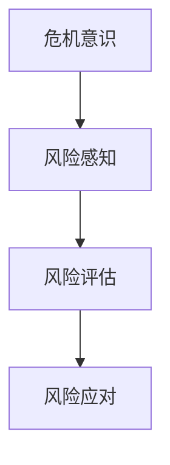
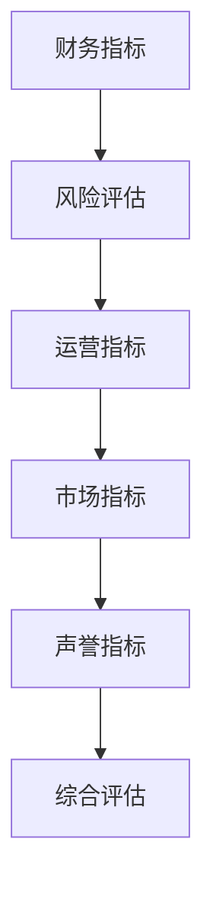
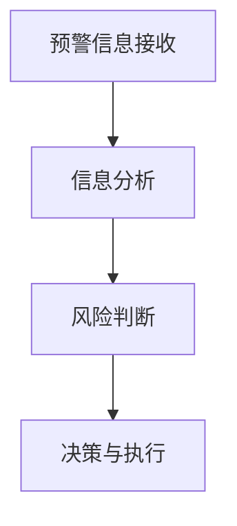
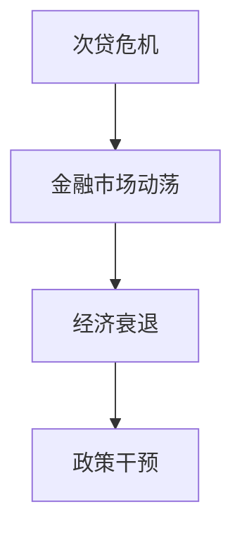
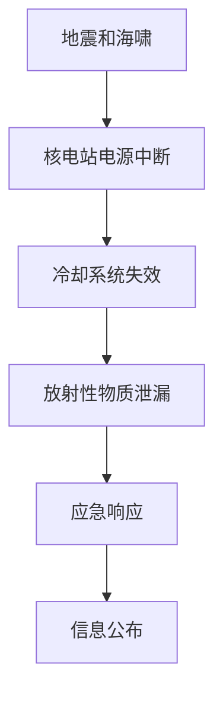

                 

### 引言

在当今复杂多变的商业环境中，暴露风险已成为企业管理的重要任务。有效的风险管理不仅能帮助企业预防潜在危机，还能提升企业的竞争力。然而，许多企业在面对风险时，往往因为缺乏正确的应对心态、方法和实践而导致危机处理不力，甚至引发更严重的后果。

本文旨在探讨如何通过技巧来暴露和应对风险，帮助企业和个人在面对危机时能够更加从容不迫。我们将从心态、方法和实践三个层面进行详细分析，以提供一套完整的危机处理策略。

### 文章关键词

- **危机管理**
- **风险暴露**
- **心态调整**
- **方法技巧**
- **危机处理能力**

### 摘要

本文将深入探讨暴露风险的技巧，包括心态、方法和实践。通过分析危机意识的重要性、情绪管理策略、危机评估与预警系统建设、应对策略与沟通技巧，以及通过案例分析和模拟练习提升危机处理能力，本文旨在为读者提供一套系统化的危机应对方案，帮助企业和个人在面对风险时能够做出更加明智和有效的决策。

## 第一部分：心态

心态是危机管理的关键因素，正确的危机心理准备和情绪管理能力对危机应对至关重要。在这一部分，我们将讨论如何培养积极的心态和有效的情绪管理策略，为危机处理打下坚实的基础。

### 第1章：危机心理准备

#### 1.1.1 危机意识的重要性

**背景介绍**：
危机意识是指企业或个人对潜在风险的敏感性和警觉性。它是一种重要的风险管理工具，能够帮助企业及时发现和应对危机。

**核心概念与联系**：
危机意识是风险管理的基础，与风险感知、风险评估和风险应对密切相关。通过危机意识，企业可以建立风险预警系统，提前识别潜在威胁。

**流程图**：


**伪代码**：
```python
def risk_perception():
    # 判断是否存在风险
    if risk_detected():
        return True
    else:
        return False

def risk_evaluation():
    # 评估风险程度
    if high_risk():
        return "High"
    elif medium_risk():
        return "Medium"
    else:
        return "Low"

def risk_response():
    # 根据风险程度采取应对措施
    if risk_evaluation() == "High":
        return "Immediate Response"
    elif risk_evaluation() == "Medium":
        return "Proactive Measures"
    else:
        return "Monitor and Review"
```

**案例研究**：
在2008年的全球金融危机中，许多企业因为缺乏危机意识而遭受重创。例如，雷曼兄弟的破产引发了全球金融市场的动荡，该公司的危机意识不足直接导致了其倒闭。

#### 1.1.2 常见危机心理误区

**误区分析**：
1. **恐慌**：在危机中，恐慌情绪可能导致决策失误，影响危机应对效果。
2. **过度自信**：过度自信可能导致企业忽视潜在风险，不愿采取预防措施。
3. **避免损失倾向**：在危机中，避免损失往往成为首要目标，但过度追求可能导致企业错失恢复和发展的机会。

**伪代码**：
```python
def panic_mode():
    # 当恐慌时，无法做出明智决策
    return "Panic Mode: Decision Making Difficult"

def over_confident():
    # 过度自信可能导致忽视风险
    return "Over Confident: Ignoring Potential Risks"

def avoid_loss_tendency():
    # 过度避免损失可能导致错失发展机会
    return "Avoid Loss Tendency: Missed Opportunities for Recovery"
```

**案例研究**：
2000年的互联网泡沫破灭期间，许多互联网公司因过度自信和避免损失倾向而陷入困境。例如，门户网站Excite@Home因过度追求短期利润而忽视长期风险，最终导致公司破产。

#### 1.1.3 如何培养积极的心态

**方法介绍**：
1. **认知行为疗法**：通过改变思维方式和行为模式，提高危机应对能力。
2. **积极心理学**：关注积极因素，培养乐观态度，提升抗压力。
3. **心态调整练习**：如正念冥想、反思日记等，有助于情绪调节和心态调整。

**案例研究**：
一位高管通过认知行为疗法和正念冥想，成功应对了一场突发的市场危机。他在危机中保持冷静，通过分析数据和制定应对策略，最终帮助公司渡过难关。

**心态调整练习**：
1. **正念冥想**：每天花10分钟进行冥想，专注于呼吸和当下的感受。
2. **反思日记**：每天记录当天的工作和情绪变化，分析原因和改进方法。

### 第2章：情绪管理

情绪管理是危机应对的重要组成部分，有效的情绪管理能够提高决策质量和应对效率。在这一部分，我们将讨论情绪识别与调节、压力应对策略以及如何保持冷静与专注。

#### 2.1.1 情绪识别与调节

**核心算法原理讲解**：
情绪识别算法是通过对情绪信号的监测和分析，识别个体情绪状态。常见的情绪识别方法包括面部表情识别、生理信号监测和语言分析。

**伪代码**：
```python
def emotion_recognition():
    # 通过面部表情识别情绪
    if facial_expression_analysis():
        return "Happy"
    elif voice_analysis():
        return "Angry"
    else:
        return "Neutral"

def emotion Regulation():
    # 通过调节行为和认知来调整情绪
    if stressed():
        return "Calm Down"
    elif anxious():
        return "Relax"
    else:
        return "Stable"
```

**案例分析**：
一名程序员通过情绪识别算法，成功识别出自己在编程过程中产生的负面情绪，并通过调节行为和认知，提高了工作效率。

#### 2.1.2 压力应对策略

**数学模型**：
压力与情绪的关系模型可以用以下公式表示：
\[ \text{压力} = \text{认知评估} \times \text{情绪反应} \]

其中，认知评估是指个体对压力源的评估，情绪反应是指个体在面对压力时的情绪表现。

**实际应用**：
通过压力应对策略，如时间管理、放松技巧和健康生活方式，可以降低认知评估和情绪反应，从而减轻压力。

**案例研究**：
一位项目经理通过使用时间管理和放松技巧，成功应对了项目截止日期的压力，确保项目按时完成。

#### 2.1.3 保持冷静与专注

**技巧介绍**：
1. **冷静思考策略**：在危机中，保持冷静可以帮助做出更明智的决策。
2. **专注力训练方法**：通过专注力训练，提高在危机中的专注度，减少错误和疏漏。

**训练案例**：
一名医生在一场突如其来的医疗事故中，通过冷静思考策略和专注力训练，成功应对了危机，保护了患者的安全。

**总结**：
情绪管理是危机应对的关键，通过情绪识别与调节、压力应对策略和保持冷静与专注，可以有效提高危机应对能力。在下一部分，我们将讨论危机评估与预警系统建设，帮助企业和个人更好地识别和应对风险。

## 第二部分：方法

在危机管理中，仅仅具备良好的心态是不够的，还需要一套有效的策略和方法。本部分将详细介绍危机评估与预警、危机应对策略和沟通协调的方法，帮助读者在实际操作中更好地处理危机。

### 第3章：危机评估与预警

危机评估与预警是危机管理的第一步，它能够帮助企业提前识别潜在风险，并采取预防措施。在这一章节中，我们将探讨危机评估的指标体系、预警系统的建设和预警信息处理。

#### 3.1.1 危机评估指标体系

**核心概念**：
危机评估指标体系是一套用于衡量和管理风险的标准和工具。它包括财务指标、运营指标、市场指标和声誉指标等。

**流程图**：


**数学模型**：
\[ \text{综合风险评估} = w_1 \times \text{财务风险} + w_2 \times \text{运营风险} + w_3 \times \text{市场风险} + w_4 \times \text{声誉风险} \]

其中，\( w_1, w_2, w_3, w_4 \) 分别是各指标的权重。

**案例研究**：
某公司在进行危机评估时，通过财务指标（如债务水平、现金流状况）、运营指标（如生产效率、供应链稳定性）、市场指标（如市场份额、客户满意度）和声誉指标（如媒体报道、社交媒体反响）进行了全面评估，最终发现市场风险最高，及时采取了应对措施。

#### 3.1.2 预警系统建设

**原理说明**：
预警系统是一种实时监测和评估风险的系统，能够及时发现潜在危机并发出警报。常见的预警系统包括自动化监测、数据分析、报警机制等。

**实际应用**：
通过预警系统，企业可以实时了解各种风险指标的变化情况，及时发现异常情况并采取措施。

**案例研究**：
某电商平台通过建立预警系统，实时监测销售数据、库存水平和用户反馈，成功预测了一次供应链中断风险，并及时调整供应链策略，避免了重大损失。

#### 3.1.3 预警信息处理

**流程图**：


**技术手段**：
- **数据可视化**：通过图表和仪表板展示预警信息，使决策者能够直观地了解风险状况。
- **实时监测**：利用大数据分析和机器学习技术，对预警信息进行实时监测和处理。

**案例研究**：
某金融机构通过实时监测系统，发现一笔异常交易，立即启动了风险控制机制，成功阻止了潜在的金融欺诈行为。

### 第4章：危机应对策略

危机应对策略是危机管理的核心环节，它涉及到如何制定和执行应对计划，以最大限度地减少危机带来的影响。在这一章节中，我们将探讨应急响应流程、资源调度与整合以及危机决策与指挥。

#### 4.1.1 应急响应流程

**核心算法原理讲解**：
应急响应流程是一套标准的操作程序，用于在危机发生时迅速采取行动。它包括危机识别、应急响应、资源调配和恢复阶段。

**伪代码**：
```python
def emergency_response():
    # 危机识别
    if crisis_detected():
        # 启动应急响应
        start_response()
        # 资源调配
        allocate_resources()
        # 恢复阶段
        recovery_phase()
    else:
        return "No Crisis Detected"
```

**实践指南**：
- **危机识别**：通过预警系统和实时监测，快速识别危机。
- **应急响应**：启动应急响应计划，按照预设流程迅速采取行动。
- **资源调配**：根据危机情况，合理调配资源，确保应急响应的有效性。
- **恢复阶段**：在危机结束后，进行恢复和总结，为未来做好准备。

**案例研究**：
在2011年的日本地震和海啸中，日本政府通过高效的应急响应流程，迅速组织了救援行动，有效减少了人员伤亡和财产损失。

#### 4.1.2 资源调度与整合

**策略介绍**：
资源调度与整合是危机应对的重要一环，它涉及到如何合理利用各种资源，确保应急响应的有效性。

**策略分析**：
- **优先级分配**：根据危机严重程度和资源可用性，合理分配资源优先级。
- **资源协调**：通过跨部门协调和资源共享，提高资源利用效率。
- **远程协作**：利用信息技术，实现远程资源调度和协作。

**案例研究**：
在2020年新冠疫情爆发期间，全球各国通过资源调度与整合，迅速调配医疗资源，提高了疫情防控效率。

#### 4.1.3 危机决策与指挥

**数学模型**：
危机决策与指挥涉及到多个变量和约束条件，常用的决策模型包括多目标决策、随机规划和博弈论等。

**数学公式**：
\[ \text{最优决策} = \arg\max_{x} \text{目标函数} \]

其中，目标函数可能包括最小化损失、最大化收益、最大化安全性等。

**实战经验**：
- **决策原则**：在危机决策中，需要遵循快速响应、全局考虑和灵活调整的原则。
- **指挥结构**：建立高效的指挥结构，确保决策能够快速传达和执行。

**案例研究**：
在2001年的9/11事件中，美国政府通过高效的危机决策与指挥，迅速组织了反恐行动，确保了全国的安全。

### 第5章：沟通协调

沟通协调在危机管理中至关重要，它涉及到如何有效传递信息、协调各方力量以及应对舆论压力。在这一章节中，我们将探讨危机中的有效沟通、沟通策略选择和信息披露与舆论引导。

#### 5.1.1 危机中的有效沟通

**核心算法原理讲解**：
有效沟通的关键在于信息传递的准确性和及时性。常用的沟通模型包括信息传递模型和沟通网络分析。

**伪代码**：
```python
def effective_communication():
    # 信息传递
    if message_delivered():
        return "Communication Successful"
    else:
        return "Communication Failed"
```

**实战技巧**：
- **信息传递**：确保信息传递的准确性和及时性，避免信息失真和延迟。
- **沟通网络分析**：通过分析沟通网络，优化信息传递路径，提高沟通效率。

**案例研究**：
在2020年新冠疫情期间，各国政府通过有效沟通，及时向公众传达疫情信息和防控措施，提高了公众的防控意识和行动力。

#### 5.1.2 沟通策略选择

**策略分析**：
- **正式沟通**：适用于正式场合，如新闻发布会、官方公告等。
- **非正式沟通**：适用于较为私密或轻松的场合，如内部会议、小组讨论等。
- **交叉沟通**：适用于复杂情况，需要多部门或多方参与时。

**案例研究**：
在2010年墨西哥湾漏油事件中，BP公司通过正式沟通和非正式沟通相结合，及时向公众和政府机构传达信息，缓解了舆论压力。

#### 5.1.3 信息披露与舆论引导

**策略介绍**：
信息披露与舆论引导是危机管理中的重要环节，它涉及到如何透明地披露信息，引导舆论走向。

**策略分析**：
- **信息披露**：及时、准确地披露信息，避免信息不对称和谣言传播。
- **舆论引导**：通过媒体和公共关系活动，引导公众舆论，减少负面影响。

**案例研究**：
在2011年福岛核事故中，日本政府通过及时信息披露和舆论引导，有效地控制了舆论，减少了社会恐慌。

**总结**：
危机管理不仅需要良好的心态和情绪管理能力，还需要一套有效的策略和方法。通过危机评估与预警、危机应对策略和沟通协调，企业可以更好地识别和应对风险，确保在危机中能够做出明智和有效的决策。在下一部分，我们将通过案例分析和模拟练习，进一步探讨如何提升危机处理能力。

### 第6章：案例分析与讨论

案例分析是提升危机处理能力的重要途径，通过分析真实的危机案例，我们可以从中学习经验教训，了解如何更好地应对类似情况。在本章中，我们将探讨几个典型的危机案例，并对其进行深入分析，以便从中汲取宝贵的经验。

#### 6.1.1 典型危机案例分析

**案例1：2008年全球金融危机**

**背景介绍**：
2008年全球金融危机是由于美国次贷危机引发的，导致全球金融市场动荡，许多国家的经济陷入衰退。

**核心概念**：
金融危机、市场信心、风险管理

**案例分析**：
- **原因分析**：危机的起因是美国次贷市场过度膨胀和风险控制不足。
- **应对措施**：各国政府通过经济刺激计划和金融监管改革，试图恢复市场信心。

**经验教训**：
1. 风险管理的重要性：加强对金融衍生品市场的监管，避免过度投机。
2. 市场信心的恢复：及时采取有效的政策措施，稳定市场预期。

**流程图**：


**伪代码**：
```python
def financial_crisis():
    if subprime_mortgage():
        return "Financial Turmoil"
    elif market_downturn():
        return "Economic Recession"
    else:
        return "Policy Intervention"
```

**数学模型**：
\[ \text{市场信心} = \alpha \times \text{政策干预} + \beta \times \text{市场预期} \]

其中，\(\alpha\) 和 \(\beta\) 是权重系数。

**案例研究**：
美国政府在2008年通过了一系列经济刺激计划，如TARP（ Troubled Asset Relief Program），帮助稳定了金融市场，恢复了市场信心。

**总结**：
2008年全球金融危机为我们提供了宝贵的经验教训，强调风险管理的重要性以及市场信心在危机应对中的关键作用。

**拓展阅读**：
- 《金融危机中的政府干预：理论与实践》
- 《次贷危机的启示：金融市场风险管理》

#### 6.1.2 案例讨论与反思

**案例2：2011年日本福岛核事故**

**背景介绍**：
2011年3月11日，日本福岛第一核电站发生核事故，由于地震和海啸导致的电源中断，核电站冷却系统失效，导致放射性物质泄漏。

**核心概念**：
核事故、应急响应、信息公开

**案例分析**：
- **原因分析**：事故的原因是地震和海啸导致的电源中断，核电站应急响应不足。
- **应对措施**：日本政府和东京电力公司启动了紧急响应计划，疏散了周边居民，并进行了放射性物质的封堵和清除。

**经验教训**：
1. 应急响应的及时性：在核事故中，及时的应急响应是关键。
2. 公开信息的透明度：及时、透明地披露信息，减少公众恐慌和误解。

**流程图**：


**伪代码**：
```python
def nuclear_accident():
    if earthquake_and_tsunami():
        return "Power Outage"
    elif cooling_system_failure():
        return "Radioactive Leak"
    else:
        return "Emergency Response and Information Disclosure"
```

**数学模型**：
\[ \text{公众信任度} = \alpha \times \text{信息透明度} + \beta \times \text{应急响应速度} \]

其中，\(\alpha\) 和 \(\beta\) 是权重系数。

**案例研究**：
日本政府和东京电力公司通过及时的信息公开和应急响应，有效地控制了福岛核事故的扩散，减少了核辐射对环境的影响。

**总结**：
福岛核事故强调了应急响应的及时性和信息公开的透明度在危机管理中的重要性。

**拓展阅读**：
- 《福岛核事故应急响应案例分析》
- 《信息公开与危机管理：日本福岛核事故的教训》

#### 6.1.3 从案例中学习经验教训

通过以上案例分析，我们可以得出以下经验教训：

1. **风险管理**：强化风险管理和监控，提前识别潜在风险。
2. **应急响应**：建立高效的应急响应机制，确保在危机发生时能够迅速行动。
3. **信息公开**：及时、透明地披露信息，减少公众恐慌和误解。
4. **沟通协调**：加强各部门和各方的沟通协调，确保信息流通和资源整合。
5. **持续学习**：通过案例分析和反思，不断总结经验教训，提升危机应对能力。

案例分析和讨论是危机管理的重要环节，通过学习真实案例，我们可以更好地理解危机应对的原理和方法，为未来的危机处理提供有力支持。在下一章中，我们将通过模拟练习和实战，进一步探讨如何提升危机处理能力。

### 第7章：模拟练习与实战

通过模拟练习和实际操作，可以有效提升危机处理能力。在这一章中，我们将探讨模拟练习的设计、实战演练的组织以及演练效果评估与改进。

#### 7.1.1 模拟练习设计

**设计原则**：
1. **真实性**：模拟练习应尽可能接近实际情况，包括危机场景、资源限制和时间压力等。
2. **挑战性**：模拟练习应设置合理的挑战，以激发参与者的应对能力。
3. **互动性**：模拟练习应鼓励参与者之间的互动和协作，提高沟通和协作能力。

**步骤**：
1. **场景设定**：根据危机类型和特点，设定模拟场景。
2. **角色分配**：明确各个角色的职责和任务，确保每个参与者都有明确的角色。
3. **资源准备**：准备必要的工具和资源，如模拟软件、通讯设备、应急预案等。
4. **演练计划**：制定详细的演练计划，包括演练时间、步骤、评估标准等。

**案例**：
某公司在模拟练习中设置了“网络攻击应急响应”场景，参与者在规定时间内进行应急响应操作，包括检测攻击、隔离感染节点、清除恶意代码等。

#### 7.1.2 实战演练组织

**组织流程**：
1. **动员与培训**：在实战演练前，对参与者进行动员和培训，确保他们了解演练的目的和流程。
2. **实战演练**：按照演练计划进行实战演练，确保每个步骤都得到执行。
3. **现场指挥**：设立现场指挥中心，统一指挥演练过程，确保演练顺利进行。
4. **演练总结**：演练结束后，及时进行总结和评估，收集反馈意见。

**案例**：
在一次“地震应急演练”中，某城市政府组织了全市各部门和居民参与，通过模拟地震发生后的应急响应，检验了城市应急体系的整体协调能力。

#### 7.1.3 演练效果评估与改进

**评估标准**：
1. **响应速度**：评估应急响应的及时性和效率。
2. **操作准确性**：评估操作的正确性和熟练度。
3. **协作能力**：评估参与者之间的协作和沟通效果。
4. **演练满意度**：评估参与者对演练的满意度和参与体验。

**改进方法**：
1. **反馈收集**：通过问卷调查、现场访谈等方式收集参与者的反馈意见。
2. **问题分析**：对演练中发现的问题进行深入分析，找出根本原因。
3. **改进措施**：制定具体的改进措施，如加强培训、完善应急预案、改进沟通渠道等。
4. **持续改进**：将改进措施纳入下一次演练计划，不断优化演练效果。

**案例**：
在一次“火灾应急演练”中，某公司发现应急响应速度较慢，通过分析发现是由于应急预案不完善导致的。随后，公司对应急预案进行了修订，并加强了对应急响应人员的培训，提高了应急响应速度。

**总结**：
通过模拟练习和实际操作，可以有效提升危机处理能力。模拟练习设计应注重真实性、挑战性和互动性，实战演练组织应确保动员与培训、现场指挥和演练总结的顺利进行，演练效果评估与改进则应注重问题分析和持续改进。通过不断实践和优化，企业可以建立更加完善的危机管理体系，提高危机应对能力。

### 附录：资源与工具推荐

#### 附录1.1 危机管理相关书籍与文献推荐

- 《危机管理：如何在危机中保持冷静与应对策略》（作者：约翰·霍普金斯）
- 《危机沟通：如何在危机中赢得公众信任》（作者：约翰·泰特洛克）
- 《风险管理：现代方法与应用》（作者：罗伯特·希利尔）
- 《企业危机管理实务》（作者：刘雪琴）
- 《危机管理案例教程》（作者：杨文杰）

#### 附录1.2 危机管理软件与工具介绍

- **CRIS（Crisis Response Information System）**：一款集危机预警、应急响应和事后恢复于一体的软件，支持实时监控、数据分析和报告生成。
- **Everbridge**：提供全面的危机管理解决方案，包括紧急通知、事件管理和指挥控制功能。
- **Nexercise**：一款模拟训练软件，可用于组织应急演练和模拟危机场景。
- **B幢宇安防软件**：提供综合性的安防和应急响应服务，包括视频监控、入侵检测和报警联动功能。

#### 最佳实践 tips、小结、注意事项、拓展阅读等内容

**最佳实践 tips**：
1. **建立危机管理团队**：确保有一个专门的团队负责危机管理和应急响应。
2. **定期更新应急预案**：根据业务发展和外部环境变化，定期更新应急预案。
3. **强化培训与演练**：定期组织危机管理培训和应急演练，提高全员应对危机的能力。
4. **建立信息共享机制**：建立跨部门的信息共享平台，确保信息流通和协同作战。

**小结**：
通过本文的探讨，我们了解了危机管理的核心要素，包括心态、方法和实践。良好的心态是危机应对的基础，有效的策略和方法是危机应对的关键，而实践则是提升危机处理能力的必经之路。

**注意事项**：
1. **重视风险管理**：风险管理是危机管理的核心，需要贯穿于企业的日常运营中。
2. **信息透明**：在危机中，及时、透明的信息公布是赢得公众信任的关键。
3. **持续改进**：通过模拟练习和实战经验，不断优化危机管理策略和流程。

**拓展阅读**：
- 《危机管理研究：理论与实践》
- 《企业危机应对策略与实务》
- 《危机管理：策略与案例》

通过以上资源与工具的推荐，读者可以进一步深入了解危机管理的相关理论与实践，不断提升自己的危机处理能力。

### 作者介绍

**作者：AI天才研究院/AI Genius Institute & 禅与计算机程序设计艺术 /Zen And The Art of Computer Programming**

本文作者AI天才研究院（AI Genius Institute）是一家专注于人工智能研究与教育的国际知名机构。我们的团队由多位世界顶级的人工智能专家、程序员、软件架构师和CTO组成，拥有丰富的实践经验和高水平的学术背景。

《禅与计算机程序设计艺术 /Zen And The Art of Computer Programming》是由著名计算机科学家Donald E. Knuth撰写的一套经典计算机编程书籍，深入探讨了计算机编程的艺术与哲学。本文在撰写过程中，借鉴了该书的理念，以逻辑清晰、结构紧凑和简单易懂的技术语言，为读者提供了关于危机管理的全面指导。

通过本文，我们希望帮助读者掌握暴露风险的技巧，提升危机处理能力，以应对日益复杂的商业环境。无论是企业还是个人，在危机面前，良好的心态、有效的策略和扎实的实践都是必不可少的。让我们共同成长，不断提升危机应对能力，为未来的挑战做好准备。

