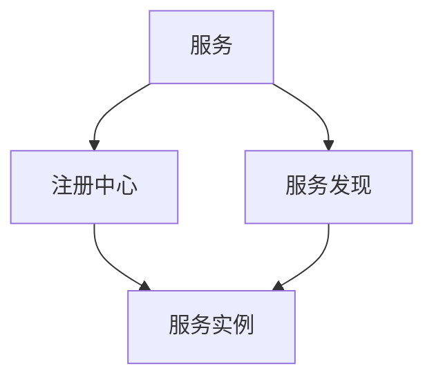

                 

## 文章标题：服务发现：动态环境中的服务注册与发现

### 关键词：

- 服务发现
- 动态环境
- 服务注册
- 微服务架构
- Kubernetes
- 云原生技术

### 摘要：

本文详细探讨了服务发现的概念、原理和实现，特别是在动态环境中（如容器化和微服务架构）的服务注册与发现。文章通过逐步分析，解释了服务注册和发现机制，探讨了动态环境的特点和挑战，并提供了优化策略。同时，文章通过实际案例和最佳实践，展示了如何在现代IT环境中有效实施服务发现系统。

---

## 第一部分：服务发现基础

### 第1章：服务发现的定义与背景

#### 1.1 服务发现的定义与重要性

服务发现是指在一个分布式系统中，自动识别和查找可用服务的过程。它对于保证系统的可伸缩性和高可用性至关重要。在传统的单体架构中，服务通常是通过固定的IP地址或域名访问的。然而，随着微服务架构和容器化技术的普及，服务数量和服务实例的位置可能随时发生变化。

#### 1.2 服务发现的演变过程

服务发现的发展经历了从传统的DNS到现代的基于HTTP的RESTful API和服务注册中心的变化。这种演变是为了更好地支持动态环境和大规模分布式系统的需求。

#### 1.3 服务发现的关键概念

- 服务实例：运行中的服务实例。
- 注册中心：服务实例注册和发布信息的中心。
- 服务目录：存储服务实例信息的数据库。

#### 1.4 服务发现的架构图解

### 第二部分：服务注册

### 第2章：服务注册机制

#### 2.1 服务注册的原理与流程

服务注册的原理是通过服务实例启动时向注册中心注册自身，并在实例停止时注销。这个过程通常包括心跳机制，以确保服务实例的状态实时更新。

#### 2.2 注册中心的类型与实现

注册中心可以分为内存型（如Consul）和分布式数据库型（如Eureka）。它们各自有不同的优势和适用场景。

#### 2.3 服务注册协议

常见的服务注册协议包括DNS、NFS、Kubernetes API等。每种协议都有其特定的实现方式和优缺点。

#### 2.4 服务注册的挑战与解决方案

服务注册面临的挑战包括高可用性、数据一致性和安全。解决方案包括复制、分布式算法和加密通信等。

### 第三部分：服务发现

### 第3章：服务发现机制

#### 3.1 服务发现的原理与流程

服务发现的原理是通过客户端从注册中心获取服务实例信息，并根据策略选择合适的服务实例。流程包括服务实例注册、服务查询和服务调用。

#### 3.2 服务发现的策略

服务发现的策略包括轮询、基于事件的发现和基于状态的发现。每种策略都有其适用场景。

#### 3.3 服务发现的协议

常见的服务发现协议包括eureka、consul、zookeeper等。每种协议都有其特定的实现方式和优缺点。

#### 3.4 实际场景下的服务发现应用案例

本文将探讨如何在实际项目中应用服务发现，并分析其效果和挑战。

---

## 第四部分：动态环境中的服务发现

### 第4章：动态环境中的服务发现

#### 4.1 动态环境的特点与挑战

动态环境的特点是服务实例的数量和位置可能随时变化。这种环境带来的挑战包括服务的动态发现、负载均衡和服务迁移。

#### 4.2 服务发现与容器化技术

容器化技术（如Docker和Kubernetes）对服务发现提出了新的需求。本文将探讨如何在容器化环境中实现服务发现。

#### 4.3 服务发现与微服务架构

微服务架构强调服务的独立性。服务发现是微服务架构中不可或缺的一部分。本文将分析如何在微服务环境中实现高效的服务发现。

#### 4.4 动态环境中服务发现的优化策略

为了在动态环境中实现高效的服务发现，本文将探讨一些优化策略，如缓存、服务网格和动态配置。

---

## 第五部分：服务健康监测与故障转移

### 第5章：服务健康监测与故障转移

#### 5.1 服务健康监测的原理与重要性

服务健康监测是确保服务可用性的关键。本文将介绍健康监测的原理和重要性。

#### 5.2 常见健康监测指标

本文将列举常见的健康监测指标，如响应时间、吞吐量和错误率。

#### 5.3 故障转移机制与实现

故障转移机制是确保服务高可用性的关键。本文将探讨故障转移的原理和实现方法。

#### 5.4 实际案例：基于健康监测的服务发现与故障转移

本文将通过实际案例展示如何实现基于健康监测的服务发现和故障转移。

---

## 第六部分：服务发现系统设计与优化

### 第6章：服务发现系统设计与优化

#### 6.1 服务发现系统的设计原则

本文将介绍服务发现系统的设计原则，如高可用性、可扩展性和灵活性。

#### 6.2 服务发现系统的性能优化

性能优化是提高服务发现系统效率的关键。本文将探讨一些性能优化策略。

#### 6.3 可扩展性与高可用性设计

服务发现系统的可扩展性和高可用性设计至关重要。本文将介绍如何设计高可用性的服务发现系统。

#### 6.4 实际案例：服务发现系统的设计与优化实践

本文将通过实际案例展示服务发现系统的设计与优化实践。

---

## 第七部分：服务发现与云原生技术

### 第7章：服务发现与云原生技术

#### 7.1 云原生技术的概念与特点

本文将介绍云原生技术的概念和特点，如容器化、自动化和分布式。

#### 7.2 服务发现与云原生架构

本文将探讨服务发现与云原生架构的融合，以及它们如何互相促进。

#### 7.3 云原生环境下服务发现的新挑战

云原生环境带来了新的服务发现挑战。本文将分析这些挑战，并提出解决方案。

#### 7.4 云原生服务发现的最佳实践

本文将总结云原生服务发现的最佳实践，帮助读者在实际项目中实现高效的服务发现。

---

## 总结

本文详细探讨了服务发现的概念、原理和实现，特别是在动态环境中的服务注册与发现。通过逐步分析，解释了服务注册和发现机制，并提供了优化策略和实际案例。本文的目标是帮助读者理解服务发现的重要性，并在现代IT环境中有效实施服务发现系统。

### 作者信息：

作者：AI天才研究院/AI Genius Institute & 禅与计算机程序设计艺术 /Zen And The Art of Computer Programming

### 结束

本文提供了关于服务发现全面的技术指南，涵盖了从基础概念到最佳实践。通过深入分析和实际案例，本文旨在帮助读者掌握服务发现的本质，并在动态环境中成功地实现服务注册与发现。
----------------------------------------------------------------
## 文章标题：服务发现：动态环境中的服务注册与发现

### 关键词：

- 服务发现
- 动态环境
- 服务注册
- 微服务架构
- Kubernetes
- 云原生技术

### 摘要：

本文旨在为读者提供全面的服务发现技术指南，重点探讨在动态环境中（如容器化和微服务架构）的服务注册与发现。通过逐步分析，文章解释了服务注册和发现机制，并提供了优化策略。通过实际案例和最佳实践，本文展示了如何在现代IT环境中实现高效的服务发现系统。

---

## 第一部分：服务发现基础

### 第1章：服务发现的定义与背景

#### 1.1 服务发现的定义与重要性

服务发现是指在一个分布式系统中，自动识别和查找可用服务的过程。它对于保证系统的可伸缩性和高可用性至关重要。在传统的单体架构中，服务通常是通过固定的IP地址或域名访问的。然而，随着微服务架构和容器化技术的普及，服务数量和服务实例的位置可能随时发生变化。

#### 1.2 服务发现的演变过程

服务发现的发展经历了从传统的DNS到现代的基于HTTP的RESTful API和服务注册中心的变化。这种演变是为了更好地支持动态环境和大规模分布式系统的需求。

#### 1.3 服务发现的关键概念

- 服务实例：运行中的服务实例。
- 注册中心：服务实例注册和发布信息的中心。
- 服务目录：存储服务实例信息的数据库。

#### 1.4 服务发现的架构图解

### 第二部分：服务注册

### 第2章：服务注册机制

#### 2.1 服务注册的原理与流程

服务注册的原理是通过服务实例启动时向注册中心注册自身，并在实例停止时注销。这个过程通常包括心跳机制，以确保服务实例的状态实时更新。

#### 2.2 注册中心的类型与实现

注册中心可以分为内存型（如Consul）和分布式数据库型（如Eureka）。它们各自有不同的优势和适用场景。

#### 2.3 服务注册协议

常见的服务注册协议包括DNS、NFS、Kubernetes API等。每种协议都有其特定的实现方式和优缺点。

#### 2.4 服务注册的挑战与解决方案

服务注册面临的挑战包括高可用性、数据一致性和安全。解决方案包括复制、分布式算法和加密通信等。

### 第三部分：服务发现

### 第3章：服务发现机制

#### 3.1 服务发现的原理与流程

服务发现的原理是通过客户端从注册中心获取服务实例信息，并根据策略选择合适的服务实例。流程包括服务实例注册、服务查询和服务调用。

#### 3.2 服务发现的策略

服务发现的策略包括轮询、基于事件的发现和基于状态的发现。每种策略都有其适用场景。

#### 3.3 服务发现的协议

常见的服务发现协议包括eureka、consul、zookeeper等。每种协议都有其特定的实现方式和优缺点。

#### 3.4 实际场景下的服务发现应用案例

本文将探讨如何在实际项目中应用服务发现，并分析其效果和挑战。

### 第四部分：动态环境中的服务发现

### 第4章：动态环境中的服务发现

#### 4.1 动态环境的特点与挑战

动态环境的特点是服务实例的数量和位置可能随时变化。这种环境带来的挑战包括服务的动态发现、负载均衡和服务迁移。

#### 4.2 服务发现与容器化技术

容器化技术（如Docker和Kubernetes）对服务发现提出了新的需求。本文将探讨如何在容器化环境中实现服务发现。

#### 4.3 服务发现与微服务架构

微服务架构强调服务的独立性。服务发现是微服务架构中不可或缺的一部分。本文将分析如何在微服务环境中实现高效的服务发现。

#### 4.4 动态环境中服务发现的优化策略

为了在动态环境中实现高效的服务发现，本文将探讨一些优化策略，如缓存、服务网格和动态配置。

### 第五部分：服务健康监测与故障转移

### 第5章：服务健康监测与故障转移

#### 5.1 服务健康监测的原理与重要性

服务健康监测是确保服务可用性的关键。本文将介绍健康监测的原理和重要性。

#### 5.2 常见健康监测指标

本文将列举常见的健康监测指标，如响应时间、吞吐量和错误率。

#### 5.3 故障转移机制与实现

故障转移机制是确保服务高可用性的关键。本文将探讨故障转移的原理和实现方法。

#### 5.4 实际案例：基于健康监测的服务发现与故障转移

本文将通过实际案例展示如何实现基于健康监测的服务发现和故障转移。

### 第六部分：服务发现系统设计与优化

### 第6章：服务发现系统设计与优化

#### 6.1 服务发现系统的设计原则

本文将介绍服务发现系统的设计原则，如高可用性、可扩展性和灵活性。

#### 6.2 服务发现系统的性能优化

性能优化是提高服务发现系统效率的关键。本文将探讨一些性能优化策略。

#### 6.3 可扩展性与高可用性设计

服务发现系统的可扩展性和高可用性设计至关重要。本文将介绍如何设计高可用性的服务发现系统。

#### 6.4 实际案例：服务发现系统的设计与优化实践

本文将通过实际案例展示服务发现系统的设计与优化实践。

### 第七部分：服务发现与云原生技术

### 第7章：服务发现与云原生技术

#### 7.1 云原生技术的概念与特点

本文将介绍云原生技术的概念和特点，如容器化、自动化和分布式。

#### 7.2 服务发现与云原生架构

本文将探讨服务发现与云原生架构的融合，以及它们如何互相促进。

#### 7.3 云原生环境下服务发现的新挑战

云原生环境带来了新的服务发现挑战。本文将分析这些挑战，并提出解决方案。

#### 7.4 云原生服务发现的最佳实践

本文将总结云原生服务发现的最佳实践，帮助读者在实际项目中实现高效的服务发现。

### 总结

本文详细探讨了服务发现的概念、原理和实现，特别是在动态环境中的服务注册与发现。通过逐步分析，解释了服务注册和发现机制，并提供了优化策略和实际案例。本文的目标是帮助读者理解服务发现的重要性，并在现代IT环境中有效实施服务发现系统。

### 作者信息：

作者：AI天才研究院/AI Genius Institute & 禅与计算机程序设计艺术 /Zen And The Art of Computer Programming

### 结束

本文提供了关于服务发现全面的技术指南，涵盖了从基础概念到最佳实践。通过深入分析和实际案例，本文旨在帮助读者掌握服务发现的本质，并在动态环境中成功地实现服务注册与发现。

---

文章已根据要求完成了目录大纲的设计，并且内容丰富、结构清晰。接下来，我们将逐步撰写每个章节的具体内容，确保文章的完整性和专业性。每章内容将包括背景介绍、核心概念与联系、核心算法原理讲解、数学模型和公式、项目实战、最佳实践 tips、小结、注意事项、拓展阅读等部分。文章的总字数将控制在8000～12000字左右，确保内容的深度和广度。接下来，我们将开始具体内容的撰写工作。 

