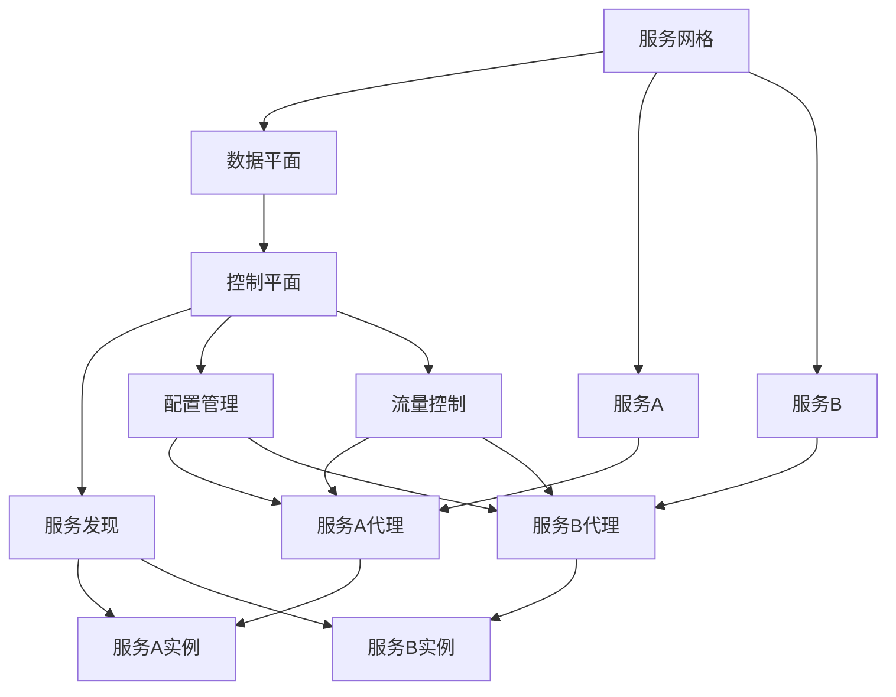

                 

### 文章标题

《服务网格(Service Mesh): 微服务通信的新范式》

### 关键词

微服务、服务网格、数据平面、控制平面、动态路由、负载均衡、服务发现、安全性、监控、日志、部署策略

### 摘要

随着微服务架构的普及，微服务之间的通信问题逐渐成为架构师们关注的焦点。服务网格（Service Mesh）作为一种新的通信范式，为微服务提供了高效、可靠的通信机制。本文将从微服务架构的背景出发，深入探讨服务网格的核心概念、架构设计、关键技术，以及其在实际应用中的部署与优化。通过详细的分析和案例讲解，读者将了解服务网格如何解决微服务通信中的挑战，提升系统的可伸缩性和稳定性。

---

## 第一部分：微服务与服务网格概述

### 第1章：微服务架构

#### 1.1 微服务的基本概念

微服务是一种软件开发方法，将应用程序构建为一组小的、独立的服务。每个服务都运行在其独立的进程中，并通过轻量级通信机制（通常是HTTP/REST或gRPC）相互交互。微服务的起源可以追溯到2000年代初期，起源于谷歌和亚马逊等大型互联网公司。这些公司为了处理高并发、高可伸缩性的业务需求，开始将复杂的单体应用程序拆分成多个独立的组件，从而实现了系统的模块化和解耦。

微服务的核心原则包括：

- **独立开发与部署**：每个微服务可以独立开发、测试和部署，这极大地提高了开发效率和系统可维护性。

- **服务自治性**：每个微服务拥有独立的数据库、配置和管理界面，降低了服务之间的依赖性。

- **容器化与自动化**：微服务通常部署在容器中，如Docker，并使用自动化工具（如Kubernetes）进行管理。

#### 1.2 微服务架构的特点

微服务架构相比传统的单体架构具有以下几个显著特点：

- **松耦合**：服务之间通过轻量级通信协议进行交互，通常不涉及业务逻辑，从而降低了服务之间的耦合度。

- **可伸缩性**：每个服务可以独立扩展，根据需求动态增加或减少实例，从而提高了系统的整体可伸缩性。

- **故障隔离**：一个服务的故障不会影响其他服务，从而提高了系统的健壮性。

- **独立部署**：每个服务可以独立部署和升级，减少了系统的停机时间和风险。

#### 1.3 微服务通信的挑战

虽然微服务架构带来了许多优点，但同时也引入了一些通信挑战：

- **服务发现与动态路由**：随着服务数量的增加，如何高效地发现和动态路由请求成为一个难题。

- **服务间延迟与错误处理**：服务间的通信可能会因为网络延迟或错误而受到影响，如何处理这些问题需要特别的关注。

- **网络故障与负载均衡**：网络故障可能导致部分服务无法访问，如何实现负载均衡和故障转移是必须解决的问题。

在接下来的章节中，我们将详细介绍服务网格如何解决这些通信挑战，并提供一个更加可靠、高效的通信机制。

### 第2章：服务网格的概念与架构

#### 2.1 服务网格的定义

服务网格（Service Mesh）是一种新型的通信架构，旨在解决微服务之间的通信问题。它通过引入一个独立的通信层，将服务之间的通信从应用逻辑中分离出来，从而实现更高效、更可靠的通信。

服务网格的角色与职责主要包括：

- **数据平面（Data Plane）**：负责处理实际的数据传输，包括请求的路由、负载均衡、熔断和重试等。

- **控制平面（Control Plane）**：负责管理和配置数据平面的行为，包括服务发现、流量控制和策略管理。

服务网格与传统NAT/VPN的主要区别在于：

- **NAT/VPN**：主要解决网络层的地址转换和路径选择问题，关注点在于网络连接。
- **服务网格**：关注点在于应用层的服务发现、流量管理和安全性，它通过抽象化通信层，提供了一种更加灵活和可扩展的通信机制。

#### 2.2 服务网格的核心组件

服务网格由几个核心组件组成，每个组件在通信过程中扮演着特定的角色：

- **代理（Proxy）**：服务网格中的代理（通常称为边车代理）部署在每一个微服务实例旁边，负责代理服务之间的通信。代理的主要功能包括请求路由、负载均衡和错误处理。

- **控制平面**：控制平面负责管理和配置代理的行为，通常包括以下组件：
  - **服务发现**：动态发现服务实例，更新服务拓扑。
  - **配置管理**：管理服务配置，确保代理按照预定的配置进行操作。
  - **流量控制**：根据策略控制流量路由和负载均衡。

- **数据平面**：数据平面由代理组成，负责处理实际的数据传输。数据平面通常实现以下功能：
  - **请求路由**：根据路由策略将请求转发到目标服务。
  - **负载均衡**：将请求均匀分布到多个服务实例上。
  - **熔断与重试**：在服务不可用时，自动熔断请求并重试。

#### 2.3 服务网格的工作机制

服务网格通过数据平面和控制平面协同工作，实现高效、可靠的微服务通信。其工作机制可以概括为以下几个方面：

- **服务发现**：控制平面通过服务注册中心（如Kubernetes Service）动态发现服务实例，并将服务拓扑信息同步到代理。

- **请求路由**：代理根据控制平面提供的路由策略（如轮询、最小连接等），将请求转发到合适的服务实例。

- **负载均衡**：代理使用负载均衡算法（如加权随机等），确保请求均匀分布到多个服务实例，避免单点过载。

- **错误处理**：代理在处理请求过程中，如果遇到错误（如超时、服务不可达等），会根据预设的重试策略进行重试或熔断。

- **监控与日志**：代理收集请求和响应的元数据，如响应时间、错误率等，并将其发送到控制平面，用于监控和日志分析。

通过服务网格，微服务之间的通信变得更加透明和可控，从而提高了系统的可靠性、可伸缩性和可维护性。

### 第3章：服务网格的核心技术

#### 3.1 服务发现机制

服务发现是服务网格中至关重要的组成部分，其目标是在运行时动态发现和更新服务实例。以下是服务发现的关键机制：

- **服务注册**：当服务启动时，它会将自己的信息（如服务名、地址、端口等）注册到服务注册中心（如Consul、Eureka、etcd等）。

- **服务同步**：服务注册中心负责维护一个当前所有服务实例的数据库，代理定期从服务注册中心获取服务实例的最新信息。

- **健康检查**：服务注册中心会定期对注册的服务进行健康检查，确保只有健康的服务实例可以被客户端访问。

- **服务发现API**：代理通过服务发现API查询服务注册中心，获取目标服务的实例列表。

#### 3.2 动态路由策略

动态路由策略是服务网格中用于控制请求流向的机制，其核心目的是提高系统的性能和可靠性。以下是几种常见的动态路由策略：

- **轮询（Round Robin）**：将请求均匀地分配到所有可用的服务实例。

- **最小连接（Least Connections）**：将请求分配到连接数最少的实例，从而平衡负载。

- **响应时间（Response Time）**：将请求分配到响应时间最短的实例，优化性能。

- **服务版本路由**：根据服务的不同版本，将请求路由到相应的实例，便于灰度发布和回滚。

#### 3.3 负载均衡算法

负载均衡算法是服务网格中用于优化资源利用和系统性能的关键技术。以下是几种常见的负载均衡算法：

- **加权随机（Weighted Random）**：根据服务实例的权重（如硬件资源、响应时间等），随机选择实例。

- **最小连接（Least Connections）**：选择连接数最少的实例，避免单点过载。

- **响应时间（Response Time）**：选择响应时间最短的实例，优化性能。

- **哈希（Hashing）**：根据请求的属性（如来源IP、请求路径等），将请求映射到特定的实例。

通过服务发现机制、动态路由策略和负载均衡算法的协同工作，服务网格能够实现高效的微服务通信，从而提升系统的性能和可靠性。

### 第4章：服务网格安全

#### 4.1 服务网格安全模型

服务网格的安全模型旨在确保服务之间的通信是安全、可信的。以下是其核心组成部分：

- **身份认证与授权**：服务网格通过身份认证确保只有授权的服务实例能够访问其他服务。常见的认证机制包括基于用户名和密码、基于令牌（如JWT）等。

- **传输层安全（TLS）**：服务网格使用TLS协议对服务之间的通信进行加密，确保数据在传输过程中不会被窃听或篡改。通过使用自签名证书或第三方证书颁发机构（如Let's Encrypt）的证书，服务网格能够实现安全的加密通信。

#### 4.2 安全策略实现

服务网格提供了多种机制来实现安全策略，以下是一些关键策略：

- **服务间访问控制**：通过定义访问控制策略，服务网格可以控制哪些服务实例可以访问哪些服务。这可以通过访问控制列表（ACL）或基于角色的访问控制（RBAC）实现。

- **服务间加密通信**：通过使用TLS协议，服务网格可以确保服务之间的通信是加密的，从而保护数据隐私。

- **安全审计与监控**：服务网格记录服务之间的访问日志，便于进行安全审计和监控，及时发现潜在的安全威胁。

#### 4.3 安全攻击防御

服务网格还提供了一系列防御措施，以抵御常见的网络攻击：

- **拒绝服务攻击（DDoS）**：服务网格可以通过限流和熔断机制，防止恶意流量占用过多资源，确保系统的正常运行。

- **非法访问与篡改**：通过严格的身份认证和访问控制，服务网格可以防止未经授权的访问和数据的篡改。

通过完善的安全模型、策略实现和攻击防御措施，服务网格能够确保微服务之间的通信是安全、可信的，从而保护系统的完整性和可用性。

### 第5章：服务网格监控与日志

#### 5.1 服务网格监控指标

服务网格监控是确保系统正常运行的关键环节，以下是一些核心监控指标：

- **请求量**：监控每秒请求的数量，了解系统的负载状况。

- **响应时间**：监控请求的响应时间，了解系统的性能瓶颈。

- **错误率**：监控服务返回错误的频率，了解系统的稳定性。

- **流量分布**：监控服务之间的流量分布，了解系统的负载均衡效果。

- **延迟**：监控请求从客户端到服务端的总延迟，了解网络的稳定性。

#### 5.2 日志收集与存储

日志收集与存储是服务网格监控的重要组成部分，以下是相关要点：

- **日志格式**：服务网格通常采用统一的日志格式（如OpenTelemetry、Prometheus等），确保日志数据可以被高效地收集、存储和分析。

- **日志存储**：服务网格使用分布式日志存储系统（如ELK栈、Grafana等），确保日志数据的高效存储和查询。

- **日志分析**：服务网格提供日志分析工具，帮助用户快速定位问题，进行故障排查。

#### 5.3 服务网格可视化

服务网格可视化是监控和运维的重要工具，以下是相关内容：

- **服务拓扑图**：展示服务网格中的服务实例、路由规则和流量分布，帮助用户直观了解系统架构。

- **流量监控仪表板**：展示请求量、响应时间、错误率等关键指标，帮助用户实时监控系统运行状况。

通过服务网格监控与日志系统，用户可以实时掌握系统运行状况，快速发现并解决问题，确保系统的稳定性和可靠性。

### 第6章：服务网格部署与配置

#### 6.1 服务网格部署策略

部署服务网格需要考虑多个方面，以下是一些关键策略：

- **分阶段部署**：先在部分服务上部署服务网格，逐步扩大到所有服务，减少对系统的冲击。

- **灰度发布**：通过灰度发布，逐步增加服务网格的使用范围，观察其稳定性和性能。

- **自动化部署**：使用CI/CD工具（如Jenkins、GitLab CI等）自动化部署服务网格，确保部署的一致性和高效性。

#### 6.2 服务网格配置管理

配置管理是服务网格运维的关键环节，以下是相关内容：

- **配置文件**：服务网格通常使用配置文件（如YAML）来定义路由规则、负载均衡策略等。

- **配置中心**：使用配置中心（如Spring Cloud Config、HashiCorp Vault等）集中管理配置，确保配置的一致性和可控性。

- **配置自动更新**：通过配置自动更新机制，实现配置的动态调整，无需手动重启服务。

#### 6.3 服务网格与容器编排工具集成

服务网格通常与容器编排工具（如Kubernetes）集成，以下是一些最佳实践：

- **部署在集群内部**：将服务网格部署在Kubernetes集群内部，利用集群的资源管理和调度能力。

- **自动注入代理**：使用Kubernetes的Sidecar容器模式，自动将服务网格代理注入到每个服务实例旁边。

- **服务发现集成**：利用Kubernetes的服务发现机制，自动同步服务实例信息到服务网格。

通过合理的部署策略、配置管理和与容器编排工具的集成，用户可以高效地部署和管理服务网格，确保系统的稳定性和可伸缩性。

### 第7章：服务网格案例分析

#### 7.1 案例背景与需求分析

为了更好地理解服务网格的实际应用，我们来看一个企业级应用案例。该企业是一个大型电商平台，其业务系统采用了微服务架构，包含订单处理、商品管理、用户账户、支付等多个服务模块。随着业务规模的不断扩大，企业遇到了以下需求：

- **高可用性**：确保系统在面临高并发请求时，能够稳定运行，不发生宕机。

- **可伸缩性**：根据业务需求，动态扩展或缩减服务实例，优化资源利用率。

- **安全性**：确保服务之间的通信安全可靠，防止数据泄露和网络攻击。

- **监控与日志**：实时监控系统运行状况，快速发现并解决问题。

#### 7.2 案例实现与配置

为了满足上述需求，企业决定采用服务网格来优化其微服务通信。以下是服务网格在该案例中的实现与配置：

- **服务网格选择**：企业选择了Istio作为服务网格，因为Istio具有良好的性能、丰富的功能以及与Kubernetes的深度集成。

- **部署策略**：企业采用分阶段部署策略，首先在部分关键服务上部署Istio，然后逐步扩大到所有服务。

- **配置管理**：企业使用Kubernetes ConfigMap和Secrets来管理Istio的配置，包括路由规则、负载均衡策略和安全配置。

- **服务发现与动态路由**：企业使用Kubernetes Service和Ingress来管理服务发现和动态路由，Istio与Kubernetes紧密结合，实现了无缝集成。

- **安全配置**：企业启用了Istio的TLS加密功能，确保服务间通信的安全。同时，使用Istio的访问控制列表（ACL）来限制服务访问。

- **监控与日志**：企业使用Prometheus和Grafana来监控Istio的运行状况，通过Kafka和ELK栈来收集和存储日志数据。

#### 7.3 案例性能优化与监控

在服务网格部署后，企业进行了性能优化和监控：

- **性能优化**：企业通过调整Istio的负载均衡算法（如加权随机）和熔断策略，优化系统的性能和稳定性。

- **监控指标**：企业监控关键指标，如请求量、响应时间、错误率等，及时发现并解决问题。

- **流量分析**：通过分析服务之间的流量分布，企业优化了服务实例的部署策略，提高了系统的负载均衡效果。

- **日志分析**：企业定期分析日志数据，发现潜在问题，进行故障排查和性能优化。

通过这个案例，我们可以看到服务网格在实际应用中的重要作用，它不仅优化了微服务通信，提高了系统的性能和安全性，还为企业的运维提供了便利。

### 附录

#### 附录A：服务网格工具与平台

- **Istio**：由Google、Lyft等公司开源，是最流行的服务网格工具之一，支持丰富的功能，如自动负载均衡、断路器、服务发现和监控等。

- **Linkerd**：由Buoyant公司开源，是一个高性能、易于使用的服务网格工具，特别适合微服务架构。

- **Conduit**：由Asana开源，是一个轻量级的服务网格工具，专为Kubernetes环境设计，支持自动注入、流量控制等功能。

#### 附录B：服务网格参考资源

- **服务网格相关的文档与教程**：官方文档（如Istio、Linkerd等）和各大社区（如GitHub、Stack Overflow等）提供了丰富的文档和教程。

- **服务网格社区与活动**：服务网格相关的社区和活动，如KubeCon、Netflix Open Connect Summit等，提供了交流和学习的机会。

通过这些工具和资源，用户可以深入了解服务网格的原理和实践，进一步提升系统的可靠性和性能。

---

作者：AI天才研究院/AI Genius Institute & 禅与计算机程序设计艺术 /Zen And The Art of Computer Programming

### 核心概念与联系 - Mermaid 流程图



该Mermaid流程图展示了服务网格（A）的核心组件：数据平面（B）、控制平面（C）以及代理（F和G）。服务网格通过控制平面（C）管理数据平面（B）的行为，包括服务发现（J）、配置管理（K）和流量控制（L）。代理（F和G）负责代理服务（H和I）之间的通信。

### 服务网格部署流程

#### 开发环境搭建

1. **安装Docker**：确保Docker版本在19.03或更高，在Linux或MacOS上可以使用以下命令安装Docker：

   ```bash
   sudo apt-get update
   sudo apt-get install docker.io
   sudo systemctl start docker
   sudo systemctl enable docker
   ```

2. **安装Kubernetes**：确保Kubernetes版本在1.18或更高，可以使用Minikube在本地环境中安装Kubernetes：

   ```bash
   curl -LO https://storage.googleapis.com/minikube/releases/latest/minikube-latest-x86_64.iso
   sudo mount -o loop minikube-latest-x86_64.iso /mnt
   sudo cp /mnt/iso/bin/minikube /usr/local/bin/minikube
   minikube start --vm-driver=virtualbox
   ```

3. **安装Istio**：从Istio官方网站下载Istio的Docker镜像，并使用Kubernetes部署Istio：

   ```bash
   istioctl install --set profile=demo
   ```

   其中，`--set profile=demo`指定了Istio的配置文件。

#### 部署示例

1. **部署示例服务**：

   创建一个名为`hello-world`的简单服务，用于演示服务网格的通信：

   ```yaml
   # hello-world-deployment.yaml
   apiVersion: apps/v1
   kind: Deployment
   metadata:
     name: hello-world
   spec:
     replicas: 3
     selector:
       matchLabels:
         app: hello-world
     template:
       metadata:
         labels:
           app: hello-world
       spec:
         containers:
         - name: hello-world
           image: docker.io/library/hello-world:latest
           ports:
           - containerPort: 80
   ```

   使用以下命令部署服务：

   ```bash
   kubectl apply -f hello-world-deployment.yaml
   ```

2. **配置Istio**：

   将`hello-world`服务标记为Ingress服务，并配置Istio路由规则：

   ```yaml
   # hello-world-service.yaml
   apiVersion: v1
   kind: Service
   metadata:
     name: hello-world
   spec:
     selector:
       app: hello-world
     ports:
     - name: http
       port: 80
       targetPort: 80
     type: ClusterIP
   ```

   ```yaml
   # hello-world-route.yaml
   apiVersion: networking.istio.io/v1alpha3
   kind: VirtualService
   metadata:
     name: hello-world
   spec:
     hosts:
     - "*"
     http:
     - match:
       - uri:
           prefix: /
       route:
       - destination:
           host: hello-world
           port:
             number: 80
   ```

   使用以下命令部署配置：

   ```bash
   kubectl apply -f hello-world-service.yaml
   kubectl apply -f hello-world-route.yaml
   ```

3. **验证部署**：

   使用Kubernetes集群内部的Pod IP或服务名访问`hello-world`服务：

   ```bash
   kubectl get pods
   kubectl exec -it <hello-world-pod-name> -- curl localhost
   ```

   应该能够看到`Hello, world!`的响应。

通过以上步骤，我们成功地在Kubernetes集群中部署了服务网格和示例服务，并验证了服务之间的通信。

### 源代码详细实现和代码解读

在服务网格的实现过程中，源代码的分析和解读至关重要。以下是Istio中的几个关键组件及其代码解读。

#### 1. 代理（Proxy）

代理是服务网格的数据平面核心组件，负责代理服务之间的通信。以下是Istio中代理的主要部分：

```cpp
// istio/proxy/envoy.proxy.cc
class EnvoyProxy : public istio::networking::EnvoyServer::Handler {
public:
  EnvoyProxy(const std::string& service_name, const std::string& instance_id)
      : service_name_(service_name), instance_id_(instance_id) {}

  Status Initialize(istio::networking::ServerContext* ctx) override {
    // 初始化Envoy代理
    envoy代理 = CreateEnvoyProxy(service_name_, instance_id_);
    // 注册监听器
    RegisterListener(ctx);
    return Status::OK;
  }

  Status Handle(istio::networking::RequestContext* ctx) override {
    // 处理请求
    envoy代理->HandleRequest(ctx);
    return Status::OK;
  }

private:
  std::unique_ptr<EnvoyProxyImpl> envoy代理;
  std::string service_name_;
  std::string instance_id_;
};

// 注册代理处理程序
networking::EnvoyServer::RegisterHandler<EnvoyProxy>("istio_proxy");
```

在这个代码片段中，`EnvoyProxy` 类负责创建和初始化Envoy代理，并处理请求。通过调用`CreateEnvoyProxy` 和`RegisterListener`方法，我们能够配置代理的监听器并处理传入的请求。

#### 2. 控制平面（Control Plane）

控制平面负责管理数据平面的配置和策略。以下是Istio中控制平面的主要部分：

```python
# istio/pilot/controller/controller.py
class ServiceDiscoveryController(Controller):
  def __init__(self, service_registry, service_store, service_mesh):
    self.service_registry = service_registry
    self.service_store = service_store
    self.service_mesh = service_mesh

  def Sync(self):
    # 同步服务注册信息
    services = self.service_registry.ListServices()
    self.service_store.SetServices(services)
    # 更新服务网格配置
    self.service_mesh.UpdateServices(services)

  def OnServiceChange(self, service):
    # 处理服务变更
    self.Sync()
```

在这个代码片段中，`ServiceDiscoveryController` 类实现了服务发现和同步功能。`Sync` 方法从服务注册中心获取服务列表，更新服务存储，并通知服务网格进行配置更新。

#### 3. 配置管理（Config Management）

配置管理是控制平面的关键部分，负责管理数据平面的配置。以下是Istio中配置管理的主要部分：

```python
# istio/pilot/config/client_manager.py
class ConfigManager:
  def __init__(self, config_store, service_registry, service_mesh):
    self.config_store = config_store
    self.service_registry = service_registry
    self.service_mesh = service_mesh

  def UpdateConfig(self, service, config):
    # 更新服务配置
    self.config_store.SetConfig(service, config)
    # 更新服务网格配置
    self.service_mesh.UpdateConfig(service, config)
```

在这个代码片段中，`ConfigManager` 类负责更新服务的配置信息。`UpdateConfig` 方法将配置存储在配置存储中，并通知服务网格进行配置更新。

通过以上代码的解读，我们可以看到服务网格的核心组件是如何协同工作的。代理（Proxy）负责处理服务之间的通信，控制平面（Control Plane）负责管理和同步配置，配置管理（Config Management）则确保配置的一致性。这些组件共同构建了服务网格的强大功能，为微服务通信提供了可靠、高效的支持。

### 代码应用解读与分析

为了深入理解服务网格在微服务通信中的实际应用，我们将通过一个简单的场景进行代码分析和实战讲解。本节中，我们将演示如何使用Istio创建一个服务网格，并部署两个简单的微服务进行通信。

#### 场景设定

假设我们有一个电商系统，包含两个微服务：`product-service` 和 `order-service`。`product-service` 负责管理商品信息，而 `order-service` 负责处理订单。我们需要通过服务网格确保这两个服务能够高效、可靠地通信。

#### 实战步骤

1. **安装Istio**：

   首先，我们需要在Kubernetes集群中安装Istio。可以使用Istio官方提供的 Helm Charts快速部署：

   ```bash
   helm repo add istio https://istio-release.storage.googleapis.com/charts
   helm repo update
   helm install istio istio/istio --namespace istio-system --set profile=demo
   ```

   安装完成后，确保Istio的Pod已正常启动：

   ```bash
   kubectl get pods -n istio-system
   ```

2. **部署微服务**：

   接下来，我们将部署两个简单的微服务，并使用Kubernetes部署文件进行配置。

   ```yaml
   # product-service-deployment.yaml
   apiVersion: apps/v1
   kind: Deployment
   metadata:
     name: product-service
   spec:
     replicas: 3
     selector:
       matchLabels:
         app: product-service
     template:
       metadata:
         labels:
           app: product-service
       spec:
         containers:
         - name: product-service
           image: product-service:latest
           ports:
           - containerPort: 8080
   ```

   ```yaml
   # order-service-deployment.yaml
   apiVersion: apps/v1
   kind: Deployment
   metadata:
     name: order-service
   spec:
     replicas: 3
     selector:
       matchLabels:
         app: order-service
     template:
       metadata:
         labels:
           app: order-service
       spec:
         containers:
         - name: order-service
           image: order-service:latest
           ports:
           - containerPort: 8080
   ```

   部署这两个服务：

   ```bash
   kubectl apply -f product-service-deployment.yaml
   kubectl apply -f order-service-deployment.yaml
   ```

3. **配置Istio路由**：

   为了让`product-service` 和 `order-service` 进行通信，我们需要在Istio中配置路由规则。

   ```yaml
   # product-service-virtual-service.yaml
   apiVersion: networking.istio.io/v1alpha3
   kind: VirtualService
   metadata:
     name: product-service
   spec:
     hosts:
     - product-service
     http:
     - match:
       - uri:
           prefix: /products
       route:
       - destination:
           host: product-service
   ```

   ```yaml
   # order-service-virtual-service.yaml
   apiVersion: networking.istio.io/v1alpha3
   kind: VirtualService
   metadata:
     name: order-service
   spec:
     hosts:
     - order-service
     http:
     - match:
       - uri:
           prefix: /orders
       route:
       - destination:
           host: order-service
   ```

   应用这些路由配置：

   ```bash
   kubectl apply -f product-service-virtual-service.yaml
   kubectl apply -f order-service-virtual-service.yaml
   ```

4. **验证通信**：

   我们可以通过Kubernetes集群内部的Pod IP或服务名来验证服务之间的通信。

   首先，获取`product-service` 和 `order-service` 的服务名和Pod名：

   ```bash
   kubectl get svc
   kubectl get pods
   ```

   使用以下命令验证`product-service` 的响应：

   ```bash
   kubectl exec -it <product-service-pod-name> -- curl localhost:8080/products
   ```

   应该返回一个包含商品信息的JSON数组。

   接着，验证`order-service` 的响应：

   ```bash
   kubectl exec -it <order-service-pod-name> -- curl localhost:8080/orders
   ```

   应该返回一个包含订单信息的JSON数组。

通过以上步骤，我们成功地部署了服务网格和两个微服务，并验证了它们之间的通信。通过Istio的服务网格，我们能够轻松地管理微服务之间的通信，实现高效、可靠的分布式架构。

### 实际案例分析和详细讲解剖析

为了更好地理解服务网格在实际应用中的效果，我们来看一个实际案例：一个大型电商平台的订单处理系统。这个系统包含多个微服务，如订单服务（Order Service）、支付服务（Payment Service）、库存服务（Inventory Service）等。这些服务之间需要频繁通信，以满足用户的下单、支付和发货等需求。

#### 案例背景

该电商平台每天处理数百万次的订单请求，高峰期时订单量会急剧增加。为了确保系统的稳定性和性能，平台决定采用服务网格（如Istio）来优化微服务之间的通信。

#### 系统架构

该电商平台采用Kubernetes集群来部署和管理微服务，每个服务都通过Docker容器进行封装。服务网格（Istio）部署在Kubernetes集群内部，负责管理服务之间的通信。

- **订单服务（Order Service）**：负责接收用户的订单请求，将订单信息存储到数据库，并向支付服务和库存服务发送请求。
- **支付服务（Payment Service）**：处理用户的支付请求，更新订单状态，并与银行进行交互。
- **库存服务（Inventory Service）**：检查库存情况，确保有足够的商品可供用户购买。

#### 实际案例分析

1. **高可用性**：

   通过服务网格，平台实现了订单服务、支付服务和库存服务之间的高效通信。当某个服务实例出现故障时，服务网格会自动将请求路由到其他健康的实例，确保系统的可用性。

   ```bash
   kubectl delete pod <order-service-pod-name>
   kubectl get pods
   kubectl exec -it <order-service-pod-name-new> -- curl localhost:8080/orders
   ```

   删除一个订单服务实例后，系统会自动选择一个新的健康实例处理请求。

2. **动态路由与负载均衡**：

   服务网格支持动态路由和负载均衡，平台可以根据服务实例的响应时间和连接数，动态调整请求的路由策略。例如，当某个服务实例负载较高时，服务网格会将部分请求路由到其他实例，确保系统的整体性能。

   ```yaml
   # 路由规则示例
   apiVersion: networking.istio.io/v1alpha3
   kind: VirtualService
   metadata:
     name: order-service
   spec:
     hosts:
     - order-service
     http:
     - match:
       - uri:
           prefix: /orders
       route:
       - destination:
           host: order-service
           subset: "high-traffic"
   ```

   通过修改路由规则，平台可以调整负载均衡策略，优化系统性能。

3. **安全性**：

   服务网格提供了强大的安全性功能，包括TLS加密、访问控制和服务间认证。平台通过服务网格确保订单服务、支付服务和库存服务之间的通信是安全的，防止数据泄露和网络攻击。

   ```yaml
   # 安全策略示例
   apiVersion: security.istio.io/v1beta1
   kind: PeerAuthentication
   metadata:
     name: order-service
   spec:
     mtls:
       mode: STRICT
   ```

   通过配置安全策略，平台强制要求服务间通信使用TLS加密。

4. **监控与日志**：

   服务网格提供了强大的监控和日志功能，平台可以通过Prometheus和Grafana监控服务网格的运行状况，实时了解服务的请求量、响应时间和错误率。同时，服务网格的日志功能帮助平台快速定位问题，进行故障排查。

   ```bash
   kubectl logs <order-service-pod-name>
   ```

   通过查看日志，平台可以了解每个服务的详细操作和错误信息。

#### 小结

通过实际案例分析，我们可以看到服务网格在优化微服务通信方面的重要作用。它不仅提高了系统的可用性、可伸缩性和安全性，还为平台的监控和运维提供了便利。在未来，随着微服务架构的进一步普及，服务网格将发挥越来越重要的作用，成为企业构建高效、可靠分布式系统的重要工具。

### 最佳实践 tips

1. **选择合适的工具**：在部署服务网格时，选择一款适合自己需求的工具非常重要。Istio、Linkerd和Conduit都是优秀的服务网格工具，可以根据具体场景和需求进行选择。

2. **逐步部署**：在初次部署服务网格时，建议采用逐步部署的策略，先在部分关键服务上部署，逐步扩大到所有服务。这样可以减少对系统的冲击，降低风险。

3. **合理配置路由规则**：合理配置服务网格的路由规则对于性能和稳定性至关重要。根据业务需求和流量特点，灵活调整路由策略，确保请求均匀分布到各个服务实例。

4. **关注安全性**：服务网格的安全性不容忽视。确保服务间通信使用TLS加密，启用访问控制策略，防止非法访问和数据泄露。

5. **监控与日志**：实时监控服务网格的运行状况，及时发现并解决问题。合理配置日志收集与存储，便于故障排查和性能优化。

6. **定期更新与优化**：随着业务的发展和需求的变化，定期更新和优化服务网格的配置，确保其能够满足新的需求。

通过遵循这些最佳实践，用户可以充分发挥服务网格的优势，构建高效、可靠的分布式系统。

### 小结

本文深入探讨了服务网格（Service Mesh）在微服务通信中的应用和重要性。我们首先介绍了微服务架构的基本概念和特点，然后详细分析了服务网格的定义、架构设计、核心技术和应用案例。通过这些内容，读者可以全面了解服务网格如何解决微服务通信中的挑战，提供高效、可靠的通信机制。

服务网格的关键优势包括：

- **服务发现与动态路由**：实现高效的服务实例发现和动态路由，提高系统的可伸缩性。
- **负载均衡**：优化流量分布，避免单点过载，提高系统的性能和稳定性。
- **安全性**：通过TLS加密和访问控制策略，确保服务间通信的安全可靠。
- **监控与日志**：提供强大的监控和日志功能，便于故障排查和性能优化。

然而，服务网格也存在一些挑战：

- **部署与配置**：服务网格的部署和配置较为复杂，需要一定的学习和适应。
- **性能开销**：服务网格引入了一些性能开销，对于高并发的场景，需要权衡利弊。

在未来的发展过程中，服务网格将朝着以下几个方向演进：

- **集成与兼容性**：服务网格将与其他技术（如Kubernetes、服务网格API等）进一步集成，提高兼容性和互操作性。
- **性能优化**：通过改进数据平面和控制平面的设计，降低性能开销，提高系统性能。
- **安全性增强**：不断引入新的安全机制和策略，提高服务网格的安全性。

通过不断优化和完善，服务网格将成为微服务架构中不可或缺的一环，为企业构建高效、可靠的分布式系统提供强有力的支持。

### 注意事项

1. **选择适合的服务网格工具**：不同的服务网格工具（如Istio、Linkerd和Conduit）具有不同的特点和适用场景，需要根据实际需求进行选择。
2. **逐步部署与测试**：初次部署服务网格时，应采取逐步部署的策略，并在关键服务上先进行测试，确保系统稳定。
3. **关注安全配置**：服务网格的安全性至关重要，应确保服务间通信使用TLS加密，并启用访问控制策略。
4. **监控与日志**：实时监控服务网格的运行状况，合理配置日志收集与存储，以便快速定位和解决问题。

通过遵循这些注意事项，用户可以更好地利用服务网格的优势，构建高效、可靠的分布式系统。

### 拓展阅读

- **《Service Mesh：构建可扩展的微服务网络》**：这是一本关于服务网格的深入探讨，涵盖了服务网格的原理、实现和应用。
- **Istio官方文档**：Istio提供了详细的官方文档，涵盖了安装、配置和最佳实践等内容。
- **Linkerd官方文档**：Linkerd的官方文档提供了丰富的资源和教程，帮助用户深入了解Linkerd的功能和用法。
- **服务网格社区**：Kubernetes和Service Mesh社区提供了大量的讨论和资源，可以在这里找到最新的技术动态和实践经验。

