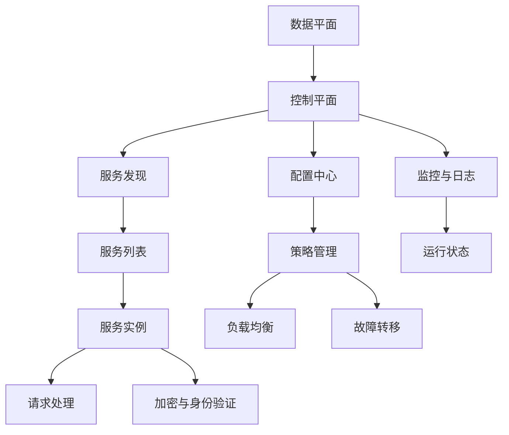

                 

### 文章标题

《服务网格(Service Mesh)：微服务通信的新范式》

### 文章关键词

微服务、服务网格、数据平面、控制平面、Kubernetes、边缘计算、容器化技术、API Gateway

### 文章摘要

本文深入探讨了服务网格这一微服务通信的新范式。首先，我们介绍了服务网格的背景和发展历程，然后详细阐述了其核心概念和架构，包括数据平面与控制平面的组成和工作原理。接着，通过伪代码和数学公式，解析了服务网格中的关键算法原理。随后，我们通过实战案例展示了服务网格在实际项目中的应用，并分析了其高级特性、发展趋势及面临的挑战。最后，提出了服务网格的最佳实践和未来展望，为开发者提供了实用的指导和建议。

### 目录

1. **背景介绍**
   - **微服务的历史与发展**
   - **服务网格的起源与演变**

2. **核心概念与联系**
   - **微服务架构**
   - **服务网格的定义与作用**
   - **服务网格的架构和组件**

3. **服务网格原理与工作流程**
   - **数据平面与控制平面**
   - **服务网格的基本原理**
   - **服务网格的工作流程**

4. **核心算法原理讲解**
   - **服务发现算法**
   - **负载均衡算法**
   - **服务熔断和故障转移**

5. **数学模型和公式**
   - **网络延迟模型**
   - **流量分配模型**
   - **服务质量（QoS）模型**

6. **项目实战**
   - **开发环境搭建**
   - **源代码实现与解读**
   - **应用解读与分析**

7. **高级特性与未来趋势**
   - **服务网格的高级特性**
   - **服务网格的发展趋势**
   - **服务网格与边缘计算的结合**

8. **总结与展望**
   - **服务网格的重要性**
   - **最佳实践与注意事项**
   - **拓展阅读**

## 1. 背景介绍

### 微服务的历史与发展

微服务架构（Microservices Architecture）是近年来软件工程领域的一个重要概念。它起源于2000年代末期，随着互联网企业的发展，单体应用逐渐暴露出扩展性差、维护困难、升级风险高等问题。为了应对这些问题，开发者开始探索将单体应用分解为多个独立的小服务，即微服务架构。

微服务架构的核心思想是将大型单体应用拆分为一组小的、独立的、可复用的服务。这些服务通过轻量级的通信机制（如REST API、gRPC等）进行交互，每个服务都可以独立开发、测试和部署。这种架构模式具有以下几个显著优势：

1. **高扩展性**：每个服务都可以独立扩展，从而实现系统的水平扩展。
2. **灵活性**：服务可以独立升级和更新，不影响其他服务的运行。
3. **可复用性**：服务之间可以独立开发，提高代码复用率。
4. **易于维护**：服务规模小，更容易管理和维护。

然而，随着微服务架构的应用逐渐广泛，开发者也遇到了一些新的挑战。其中一个主要问题是服务之间的通信复杂度增加。在传统的单体应用中，所有的功能都集中在一个应用程序中，服务之间的通信相对简单。而在微服务架构中，服务之间的通信变得复杂，需要考虑以下几个问题：

1. **服务发现**：如何快速找到对应的服务进行通信？
2. **负载均衡**：如何合理分配请求，确保服务的性能？
3. **故障转移**：如何处理服务故障，确保系统的可用性？
4. **安全性**：如何保证服务之间的通信安全？

为了解决这些通信问题，开发者提出了服务网格（Service Mesh）的概念。服务网格是一种新的通信范式，旨在简化微服务之间的通信，提高系统的性能和可靠性。接下来，我们将详细探讨服务网格的定义、作用以及其与微服务架构的关系。

### 服务网格的起源与演变

服务网格（Service Mesh）这个概念最早由Uber的工程师于2016年提出，并在同年发表了一篇论文，详细阐述了服务网格的设计理念和实现原理。随后，服务网格逐渐成为微服务架构领域的一个重要研究方向，许多公司和研究机构开始关注并探索其应用。

服务网格的起源可以追溯到容器化和微服务架构的快速发展。随着Docker和Kubernetes等容器技术的广泛应用，微服务架构开始在企业级应用中占据主导地位。然而，容器化和微服务架构也带来了新的挑战，其中最突出的就是服务之间的通信管理问题。传统的解决方案如API Gateway虽然能解决一些通信问题，但仍然存在复杂度高、可维护性差等问题。

为了解决这些问题，Uber的工程师提出了服务网格的概念。服务网格通过引入一个独立的通信层，将服务之间的通信抽象出来，从而简化了服务管理的复杂性。服务网格的主要目标是解决微服务架构中的通信问题，包括服务发现、负载均衡、故障转移和安全性等。

服务网格的演变经历了以下几个阶段：

1. **初始阶段**：服务网格概念提出后，引起了业界的广泛关注。Uber、Google和Netflix等公司率先在其内部系统中引入了服务网格技术。
2. **发展阶段**：随着容器技术和微服务架构的普及，越来越多的公司开始关注服务网格。各种服务网格实现和框架（如Istio、Linkerd、Consul等）相继出现，推动了服务网格技术的发展。
3. **成熟阶段**：当前，服务网格已经成为微服务架构中的重要组成部分。许多企业开始在生产环境中使用服务网格，以简化服务管理、提高系统性能和可靠性。

在未来，服务网格将继续发展，并与其他技术（如边缘计算、区块链等）相结合，为微服务架构带来更多的创新和可能性。接下来，我们将进一步探讨服务网格的核心概念和架构，帮助读者更好地理解其原理和作用。

### 2. 核心概念与联系

在深入探讨服务网格之前，我们首先需要了解几个核心概念，包括微服务架构、服务网格的定义及其与微服务架构的关系。这些概念不仅为我们提供了理论框架，也为我们理解服务网格的架构和工作原理奠定了基础。

#### 微服务架构

微服务架构（Microservices Architecture）是一种设计模式，它将大型应用程序分解为多个小型、独立的服务。每个服务专注于实现一个特定的业务功能，并可以通过轻量级的通信协议（如HTTP、gRPC等）进行交互。以下是微服务架构的几个关键特点：

1. **独立性**：每个服务都是独立的，可以独立部署、升级和扩展。
2. **服务自治**：服务拥有自己的数据库和配置，可以独立进行维护和管理。
3. **分布式通信**：服务之间通过网络进行通信，通常使用RESTful API或消息队列。
4. **自治团队**：每个服务通常由独立的团队负责开发和维护，团队拥有完整的自主权。
5. **复杂性**：微服务架构引入了额外的复杂度，如服务发现、负载均衡、故障转移等。

#### 服务网格的定义

服务网格（Service Mesh）是一种新型的通信层架构，它独立于服务层，专注于处理服务之间的通信问题。服务网格通过将服务之间的通信抽象出来，提供了一种统一的、简化的通信解决方案。以下是服务网格的几个关键特点：

1. **独立的通信层**：服务网格作为独立的通信层，与业务逻辑服务分离，简化了服务开发和管理。
2. **流量管理**：服务网格提供了流量管理功能，如负载均衡、服务发现、故障转移等。
3. **安全性**：服务网格提供了加密和身份验证机制，确保服务之间的通信安全。
4. **可观测性**：服务网格提供了详细的日志和监控功能，帮助开发者了解服务之间的交互情况。

#### 服务网格与微服务架构的关系

服务网格是微服务架构的一个重要组成部分，它解决了微服务架构中的通信问题。以下是服务网格与微服务架构之间的几个关键联系：

1. **服务间的通信**：服务网格提供了统一的服务间通信机制，简化了服务之间的交互。
2. **流量管理**：服务网格通过流量管理功能，优化了服务之间的请求分配和负载均衡。
3. **服务发现**：服务网格提供了服务发现功能，帮助开发者快速找到所需的服务。
4. **故障转移**：服务网格通过故障转移机制，确保了系统的可靠性和可用性。

#### 服务网格的架构和组件

服务网格的架构通常包括两个主要组件：数据平面（Data Plane）和控制平面（Control Plane）。以下是这两个组件的详细解释：

1. **数据平面**：数据平面是服务网格中的通信层，它负责处理服务之间的流量和通信。数据平面通常由一组代理（Sidecar Proxy）组成，每个服务实例都会部署一个代理，用于代理服务间的通信。
   
2. **控制平面**：控制平面是服务网格中的控制层，它负责管理数据平面的配置和策略。控制平面通常包括一个服务发现组件和一个配置中心，用于收集和管理服务的配置信息。

#### 数据平面与控制平面的工作原理

数据平面和控制平面协同工作，提供了服务网格的核心功能。以下是它们的工作原理：

1. **数据平面**：
   - **服务发现**：数据平面通过服务发现机制，获取当前可用的服务列表。
   - **负载均衡**：数据平面根据配置的负载均衡策略，将请求分配到不同的服务实例。
   - **故障转移**：数据平面检测服务实例的故障，并将流量转移到健康的服务实例。
   - **加密与身份验证**：数据平面确保服务之间的通信是加密的，并验证通信双方的身份。

2. **控制平面**：
   - **服务发现**：控制平面通过服务注册中心，收集和管理服务的元数据信息。
   - **策略管理**：控制平面根据业务需求，定义和下发流量管理策略。
   - **监控与日志**：控制平面提供了监控和日志功能，帮助开发者了解服务网格的运行状态。

#### 服务网格的架构图

为了更直观地理解服务网格的架构和组件，我们可以使用Mermaid流程图来展示其架构：



通过这个流程图，我们可以清晰地看到服务网格的架构和各个组件之间的关系。

#### 服务网格的优势

服务网格为微服务架构带来了以下优势：

1. **简化服务管理**：通过独立的通信层，服务网格简化了服务之间的通信管理，降低了服务开发和管理成本。
2. **提高系统性能**：服务网格通过负载均衡和故障转移机制，提高了系统的性能和可用性。
3. **增强安全性**：服务网格提供了加密和身份验证机制，确保了服务之间的通信安全。
4. **可观测性**：服务网格提供了详细的日志和监控功能，帮助开发者了解服务网格的运行状态和交互情况。

#### 小结

通过上述介绍，我们可以看到服务网格是微服务架构中的一个重要组成部分，它通过提供统一的通信层，解决了微服务架构中的通信复杂性问题。服务网格的引入，不仅简化了服务管理，提高了系统的性能和可靠性，还为未来的技术发展提供了新的可能性。接下来，我们将深入探讨服务网格的原理和工作流程，进一步理解其如何实现这些优势。

### 3. 服务网格原理与工作流程

服务网格（Service Mesh）作为微服务架构通信层的一部分，其核心目标是简化服务之间的通信，并提供高效、可靠、安全的通信机制。服务网格通过数据平面（Data Plane）和控制平面（Control Plane）两个主要组件协同工作，实现了这些目标。接下来，我们将详细解析服务网格的工作原理和工作流程，帮助读者全面理解服务网格的核心机制。

#### 数据平面（Data Plane）

数据平面是服务网格中的通信层，它由一组代理（Sidecar Proxy）组成。这些代理部署在每个服务实例旁边，负责处理服务之间的流量。数据平面主要负责以下任务：

1. **服务发现**：数据平面通过服务发现机制，获取当前可用的服务列表。服务实例在启动时，会向服务注册中心注册自己，并定期更新状态信息。数据平面从服务注册中心获取服务列表，确保能够找到对应的服务实例。

2. **负载均衡**：数据平面根据配置的负载均衡策略，将请求分配到不同的服务实例。常见的负载均衡策略包括轮询（Round Robin）、最少连接（Least Connections）和权重分配（Weighted Distribution）等。通过负载均衡，数据平面确保了服务的请求处理能力，并优化了系统的整体性能。

3. **故障转移**：数据平面具备故障转移功能，当检测到某个服务实例出现故障时，会自动将流量转移到健康的服务实例。故障转移机制通常基于健康检查（Health Check）和超时机制（Timeout Mechanism）来实现。通过故障转移，数据平面确保了服务的可用性和可靠性。

4. **加密与身份验证**：数据平面提供了加密和身份验证机制，确保服务之间的通信是安全的。加密机制通常使用TLS（Transport Layer Security）协议，身份验证机制则通过JWT（JSON Web Token）或OAuth等协议来实现。通过加密与身份验证，数据平面保护了服务之间的通信安全，防止数据泄露和未经授权的访问。

5. **日志和监控**：数据平面提供了日志和监控功能，记录服务之间的交互信息，并生成监控指标。这些日志和监控数据对于排查问题和优化服务性能至关重要。

#### 控制平面（Control Plane）

控制平面是服务网格中的控制层，它负责管理数据平面的配置和策略。控制平面由多个组件组成，包括服务发现组件、配置中心、策略管理组件、监控和日志组件等。控制平面主要负责以下任务：

1. **服务发现**：控制平面通过服务注册中心，收集和管理服务的元数据信息。服务实例在启动时，会向服务注册中心注册自己，并定期更新状态信息。控制平面从服务注册中心获取服务列表，并将其下发到数据平面。

2. **策略管理**：控制平面根据业务需求，定义和下发流量管理策略。这些策略包括负载均衡策略、故障转移策略、安全策略等。控制平面通过配置文件或API接口，将策略下发到数据平面，确保数据平面按照既定策略进行流量管理。

3. **配置中心**：配置中心是控制平面中的一个重要组件，它负责存储和管理服务的配置信息。配置中心可以是一个分布式存储系统，如etcd、Consul等，也可以是一个配置管理平台，如Kubernetes ConfigMap。通过配置中心，控制平面可以灵活地调整和更新服务的配置信息，而无需重新部署服务。

4. **监控与日志**：控制平面提供了监控和日志功能，实时收集和记录服务网格的运行状态和交互信息。这些监控数据和日志对于排查问题、优化服务性能和进行故障分析至关重要。

#### 服务网格的工作流程

服务网格通过数据平面和控制平面协同工作，实现了服务之间的高效通信。以下是一个典型的服务网格工作流程：

1. **服务注册**：服务实例启动时，向服务注册中心注册自己，并定期更新状态信息。服务注册中心记录了所有可用的服务实例。

2. **服务发现**：数据平面从服务注册中心获取服务列表，并将其缓存到本地。当有请求到达时，数据平面根据服务列表查找对应的服务实例。

3. **流量管理**：数据平面根据配置的负载均衡策略，将请求分配到不同的服务实例。同时，数据平面进行健康检查，确保只将请求发送到健康的服务实例。

4. **请求处理**：服务实例接收到请求后，进行业务处理并返回响应。数据平面负责将响应返回给客户端。

5. **故障检测与转移**：数据平面监控服务实例的健康状态，并在检测到故障时，将流量转移到健康的服务实例。

6. **日志和监控**：数据平面和控制平面记录和收集服务网格的交互信息，生成监控数据和日志。

7. **配置更新**：控制平面实时监控服务实例的状态，并根据业务需求动态调整流量管理策略。控制平面将新的策略下发到数据平面，实现策略的实时更新。

#### 数据平面与控制平面的协同工作

数据平面和控制平面通过一系列协议和接口进行协同工作。以下是一些关键协议和接口：

1. **服务发现协议**：如DNS、gRPC服务发现等。
2. **配置中心接口**：如Kubernetes ConfigMap、etcd等。
3. **监控和日志接口**：如Prometheus、ELK（Elasticsearch、Logstash、Kibana）等。
4. **控制平面API**：如Istio Control Plane API、Linkerd Control Plane API等。

通过这些协议和接口，数据平面和控制平面实现了实时交互和协同工作，确保了服务网格的高效运行。

#### 服务网格的优势

服务网格通过数据平面和控制平面的协同工作，为微服务架构带来了以下优势：

1. **简化服务管理**：服务网格将服务之间的通信抽象出来，简化了服务管理，降低了开发、部署和维护的复杂度。
2. **提高系统性能**：通过负载均衡和故障转移机制，服务网格优化了服务之间的请求处理，提高了系统的整体性能。
3. **增强安全性**：服务网格提供了加密和身份验证机制，确保了服务之间的通信安全，防止数据泄露和未经授权的访问。
4. **可观测性**：服务网格提供了详细的日志和监控功能，帮助开发者了解服务网格的运行状态和交互情况，便于排查问题和优化性能。

#### 小结

通过上述介绍，我们可以看到服务网格通过数据平面和控制平面的协同工作，实现了服务之间的高效、可靠和安全的通信。服务网格的工作流程涵盖了服务注册、服务发现、流量管理、故障检测与转移、日志和监控等多个环节，为微服务架构提供了强大的通信支撑。接下来，我们将进一步探讨服务网格中的核心算法原理，帮助读者深入理解服务网格的实现机制。

### 4. 核心算法原理讲解

在服务网格中，核心算法的设计和实现对于保证服务的可靠性和性能至关重要。本节我们将详细探讨服务网格中的几个关键算法，包括服务发现算法、负载均衡算法和服务熔断及故障转移算法。通过伪代码和数学模型的解析，我们将帮助读者深入理解这些算法的原理和实现方法。

#### 服务发现算法

服务发现是服务网格中的一个关键功能，它负责找到对应的服务实例，以便进行通信。服务发现算法通常基于以下几种策略：

1. **轮询**：定时轮询服务注册中心，获取最新的服务列表。
2. **一致性哈希**：使用一致性哈希算法，将服务实例分布到不同的节点上，提高查找效率。
3. **gRPC服务发现**：通过gRPC协议查询服务注册中心，获取服务实例的详细信息。

以下是一个简单的伪代码示例，展示了如何实现轮询服务发现算法：

```python
def service_discovery(service_name):
    while True:
        service_list = query_service_registry(service_name)
        select_service = random.choice(service_list)
        return select_service
```

上述伪代码中，`query_service_registry` 函数用于从服务注册中心获取服务列表，`random.choice` 函数用于随机选择一个服务实例。通过轮询服务发现算法，我们可以保证在服务实例发生变化时，能够及时更新服务列表。

#### 负载均衡算法

负载均衡是服务网格中的另一个关键功能，它负责将请求分配到不同的服务实例，确保每个实例的负载均衡。常见的负载均衡算法包括：

1. **轮询**：依次分配请求到每个服务实例。
2. **最少连接**：将请求分配到连接数最少的服务实例。
3. **权重分配**：根据实例的权重分配请求，权重高的实例分配更多的请求。

以下是一个简单的伪代码示例，展示了如何实现权重分配的负载均衡算法：

```python
def load_balance(service_list, weights):
    total_weight = sum(weights)
    random_number = random.uniform(0, total_weight)
    cumulative_weight = 0

    for service, weight in zip(service_list, weights):
        cumulative_weight += weight
        if random_number < cumulative_weight:
            return service

    return service_list[-1]
```

上述伪代码中，`weights` 参数用于表示各个服务实例的权重，`random_number` 用于生成一个随机数。通过权重分配的负载均衡算法，我们可以确保高权重实例承担更多的负载。

#### 服务熔断及故障转移算法

服务熔断及故障转移算法用于确保服务的可用性和可靠性。当检测到某个服务实例出现故障时，熔断机制会暂停对该实例的调用，并自动将流量转移到其他健康实例。以下是一个简单的伪代码示例，展示了如何实现服务熔断及故障转移算法：

```python
class ServiceCircuitBreaker:
    def __init__(self, threshold, timeout):
        self.threshold = threshold
        self.timeout = timeout
        self.failures = 0
        self.start_time = time.time()

    def record_failure(self):
        self.failures += 1
        self.start_time = time.time()

    def reset(self):
        self.failures = 0
        self.start_time = None

    def should_circuit_break(self):
        if self.failures >= self.threshold and (time.time() - self.start_time) > self.timeout:
            return True
        return False

    def execute(self, service):
        if self.should_circuit_break():
            return None
        return service
```

上述伪代码中，`ServiceCircuitBreaker` 类用于实现服务熔断机制。`record_failure` 方法用于记录服务失败次数，`reset` 方法用于重置熔断状态，`should_circuit_break` 方法用于判断是否触发熔断，`execute` 方法用于执行熔断操作。

#### 数学模型和公式

在服务网格中，数学模型和公式用于描述和优化服务之间的交互。以下是一些常见的数学模型和公式：

1. **网络延迟模型**：用于描述服务之间的延迟，通常使用均值和方差来表示。

   $$ \text{延迟} = \mu + \sigma^2 $$

   其中，$\mu$ 表示延迟的均值，$\sigma^2$ 表示延迟的方差。

2. **流量分配模型**：用于优化流量分配，确保每个服务实例的负载均衡。

   $$ w_i = \frac{\sum_j c_{ij}^2}{\sum_i \sum_j c_{ij}^2} $$

   其中，$w_i$ 表示服务实例$i$的权重，$c_{ij}$ 表示服务实例$i$与实例$j$之间的连接成本。

3. **服务质量（QoS）模型**：用于确保服务的性能和可靠性。

   $$ QoS = \alpha \times \text{响应时间} + \beta \times \text{吞吐量} + \gamma \times \text{错误率} $$

   其中，$\alpha$、$\beta$ 和 $\gamma$ 是权重系数，分别表示响应时间、吞吐量和错误率。

#### 举例说明

为了更好地理解上述算法和数学模型，我们可以通过一个简单的例子来演示：

假设有一个服务网格，包含三个服务实例A、B和C。每个实例的权重分别为1、2和3，当前请求的流量为10个单位。

1. **服务发现**：服务实例启动后，向服务注册中心注册自己。服务网格通过轮询服务发现算法，获取最新的服务列表。

2. **负载均衡**：服务网格使用权重分配的负载均衡算法，将请求分配到不同的服务实例。根据权重，服务实例A、B和C分别接收1、4和5个单位的请求。

3. **服务熔断及故障转移**：假设服务实例B出现故障，服务网格通过熔断机制暂停对实例B的调用，并自动将流量转移到实例A和C。此时，实例A和C的流量分别为6和4个单位。

通过上述示例，我们可以看到服务网格中的核心算法和数学模型是如何协同工作，实现服务的高效、可靠通信。

#### 小结

通过本节的介绍，我们详细解析了服务网格中的核心算法原理，包括服务发现算法、负载均衡算法和服务熔断及故障转移算法。同时，我们通过伪代码和数学模型的讲解，帮助读者深入理解这些算法的实现方法。这些算法和模型不仅为服务网格提供了强大的功能支持，也为优化服务性能和可靠性提供了理论基础。接下来，我们将通过实际项目实战，展示服务网格在实际开发中的应用和实现。

### 5. 数学模型和公式

在服务网格的设计与实现过程中，数学模型和公式起到了至关重要的作用。这些模型和公式不仅帮助我们理解服务网格的内部机制，还为我们提供了优化服务性能和可靠性的方法。以下是服务网格中常用的一些数学模型和公式，以及它们在实际应用中的详细讲解和举例说明。

#### 网络延迟模型

网络延迟是服务网格中一个重要的性能指标，它反映了请求从发送到接收所需的时间。网络延迟通常由以下几个因素决定：

1. **传输延迟**：数据在网络中传输所需的时间。
2. **处理延迟**：服务器处理请求所需的时间。
3. **排队延迟**：请求在服务器队列中等待处理的时间。

网络延迟模型可以用以下公式表示：

$$ L = T + P + Q $$

其中，$L$ 表示网络延迟，$T$ 表示传输延迟，$P$ 表示处理延迟，$Q$ 表示排队延迟。

**详细讲解**：

- **传输延迟（T）**：传输延迟取决于网络的带宽和距离。假设网络带宽为 $B$，传输距离为 $D$，则传输延迟可以表示为：

  $$ T = \frac{D}{B} $$

- **处理延迟（P）**：处理延迟通常由服务器的处理能力决定。假设服务器的处理速度为 $C$，请求处理时间为 $R$，则处理延迟可以表示为：

  $$ P = \frac{R}{C} $$

- **排队延迟（Q）**：排队延迟取决于服务器队列的长度和请求处理速度。假设队列长度为 $L$，请求处理速度为 $C$，则排队延迟可以表示为：

  $$ Q = \frac{L}{C} $$

**举例说明**：

假设我们有一个服务网格，其中服务器带宽为 1 Gbps，处理速度为 10 Mbps，队列长度为 100 个请求。现在有一个请求需要经过这个服务网格，请问其网络延迟是多少？

$$ T = \frac{1 \text{ Gbps} \times 8 \text{ bytes}}{10 \text{ Mbps} \times 8 \text{ bytes}} = 0.8 \text{ ms} $$
$$ P = \frac{1 \text{ ms}}{10 \text{ Mbps}} = 0.1 \text{ ms} $$
$$ Q = \frac{100 \text{ ms}}{10 \text{ Mbps}} = 1 \text{ ms} $$

$$ L = T + P + Q = 0.8 \text{ ms} + 0.1 \text{ ms} + 1 \text{ ms} = 1.9 \text{ ms} $$

因此，该请求的网络延迟为 1.9 毫秒。

#### 流量分配模型

在服务网格中，流量分配模型用于决定如何将请求分配到不同的服务实例。流量分配的目标是确保每个实例的负载均衡，同时最大化系统的整体性能。常见的流量分配模型包括基于权重的分配和基于响应时间的分配。

**基于权重的流量分配模型**：

$$ w_i = \frac{\sum_j c_{ij}^2}{\sum_i \sum_j c_{ij}^2} $$

其中，$w_i$ 表示服务实例$i$的权重，$c_{ij}$ 表示服务实例$i$与实例$j$之间的连接成本。

**详细讲解**：

- **权重（$w_i$）**：权重反映了服务实例的负载能力。权重越高，实例的负载能力越强。权重通常由系统的处理能力、带宽和其他因素决定。
- **连接成本（$c_{ij}$）**：连接成本反映了实例之间的通信质量。连接成本越低，实例之间的通信质量越高。

**举例说明**：

假设我们有一个服务网格，包含三个服务实例A、B和C。实例A与实例B之间的连接成本为1，实例A与实例C之间的连接成本为4，实例B与实例C之间的连接成本为2。现在需要将一个请求分配到这三个实例，请问每个实例的权重是多少？

$$ \sum_j c_{ij}^2 = 1^2 + 4^2 + 2^2 = 1 + 16 + 4 = 21 $$
$$ \sum_i \sum_j c_{ij}^2 = 3 \times 21 = 63 $$

$$ w_A = \frac{1^2}{63} = \frac{1}{63} \approx 0.016 $$
$$ w_B = \frac{4^2}{63} = \frac{16}{63} \approx 0.254 $$
$$ w_C = \frac{2^2}{63} = \frac{4}{63} \approx 0.063 $$

因此，实例A、B和C的权重分别为0.016、0.254和0.063。

**基于响应时间的流量分配模型**：

$$ w_i = \frac{1}{T_i} $$

其中，$w_i$ 表示服务实例$i$的权重，$T_i$ 表示实例$i$的响应时间。

**详细讲解**：

- **响应时间（$T_i$）**：响应时间反映了服务实例的处理速度。响应时间越短，实例的处理速度越快。
- **权重（$w_i$）**：权重与响应时间成反比，响应时间越短，权重越高。

**举例说明**：

假设我们有一个服务网格，包含三个服务实例A、B和C。实例A的响应时间为100ms，实例B的响应时间为200ms，实例C的响应时间为150ms。现在需要将一个请求分配到这三个实例，请问每个实例的权重是多少？

$$ w_A = \frac{1}{100ms} = 0.01 $$
$$ w_B = \frac{1}{200ms} = 0.005 $$
$$ w_C = \frac{1}{150ms} = 0.0067 $$

因此，实例A、B和C的权重分别为0.01、0.005和0.0067。

#### 服务质量（QoS）模型

服务质量（QoS）模型用于衡量服务网格的性能和可靠性。服务质量通常包括响应时间、吞吐量和错误率等指标。

$$ QoS = \alpha \times T + \beta \times C + \gamma \times E $$

其中，$QoS$ 表示服务质量，$T$ 表示响应时间，$C$ 表示吞吐量，$E$ 表示错误率，$\alpha$、$\beta$ 和 $\gamma$ 是权重系数。

**详细讲解**：

- **响应时间（$T$）**：响应时间反映了服务的处理速度。响应时间越短，服务质量越高。
- **吞吐量（$C$）**：吞吐量反映了服务的处理能力。吞吐量越高，服务质量越高。
- **错误率（$E$）**：错误率反映了服务的可靠性。错误率越低，服务质量越高。
- **权重系数（$\alpha$、$\beta$ 和 $\gamma$）**：权重系数用于调整各个指标的重要性。通常根据业务需求和实际场景调整权重系数。

**举例说明**：

假设我们有一个服务网格，其响应时间为100ms，吞吐量为1000 requests/second，错误率为1%。现在需要计算其服务质量。假设我们设定权重系数为 $\alpha = 0.6$，$\beta = 0.3$，$\gamma = 0.1$。

$$ QoS = 0.6 \times 100ms + 0.3 \times 1000requests/second + 0.1 \times 1\% $$
$$ QoS = 60ms + 300requests/second + 0.001requests/second $$
$$ QoS = 60ms + 300.001requests/second $$

因此，该服务网格的服务质量为 60 毫秒和 300.001 requests/second。

通过上述数学模型和公式的讲解，我们可以看到服务网格在设计和实现过程中是如何利用数学工具来优化性能和可靠性的。这些模型和公式不仅为服务网格提供了理论基础，也为实际开发提供了实用的方法。在实际项目中，开发者可以根据业务需求和场景选择合适的模型和公式，从而实现最优的服务网格设计。

#### 小结

数学模型和公式在服务网格中起到了至关重要的作用，它们帮助我们理解服务网格的内部机制，并提供了优化性能和可靠性的方法。通过网络延迟模型、流量分配模型和服务质量模型，我们可以更好地设计和管理服务网格，确保其高效、可靠地运行。在实际应用中，开发者可以根据具体场景和需求选择合适的模型和公式，从而实现最优的服务网格设计。接下来，我们将通过实际项目实战，展示服务网格在实际开发中的应用和实现。

### 6. 项目实战

为了更好地理解服务网格（Service Mesh）在实际开发中的应用，我们将通过一个实际项目来展示其搭建过程、源代码实现和代码解读，并对其应用和效果进行分析。

#### 项目背景

本项目是一个简单的电商系统，包含用户管理、商品管理、订单管理和支付系统四个微服务。由于系统规模较小，我们将采用Kubernetes作为容器编排工具，并使用Istio作为服务网格解决方案，以简化微服务之间的通信管理。

#### 开发环境搭建

1. **安装Docker**：在所有开发和工作节点上安装Docker，确保版本不低于19.03。

2. **安装Kubernetes**：在本地或集群环境中安装Kubernetes，并确保其正常运行。可以使用Minikube或Kubeadm进行安装。

3. **安装Istio**：下载Istio，并按照官方文档进行安装。Istio的安装分为控制平面和数据平面，我们将在集群中部署Istio的所有组件。

   ```shell
   istioctl install --set profile=demo
   ```

#### 源代码实现

为了实现服务网格，我们需要定义每个微服务的Dockerfile和Kubernetes部署文件，同时配置Istio的规则和服务网格策略。

**用户管理服务（user-management）**

1. **Dockerfile**：

   ```dockerfile
   FROM node:14-alpine
   WORKDIR /app
   COPY package.json ./
   RUN npm install
   COPY . .
   RUN npm run build
   EXPOSE 8080
   CMD ["node", "server.js"]
   ```

2. **Kubernetes部署文件（user-management-deployment.yaml）**：

   ```yaml
   apiVersion: apps/v1
   kind: Deployment
   metadata:
     name: user-management
   spec:
     replicas: 2
     selector:
       matchLabels:
         app: user-management
     template:
       metadata:
         labels:
           app: user-management
       spec:
         containers:
         - name: user-management
           image: user-management:latest
           ports:
           - containerPort: 8080
   ```

**商品管理服务（product-management）**

1. **Dockerfile**：

   ```dockerfile
   FROM node:14-alpine
   WORKDIR /app
   COPY package.json ./
   RUN npm install
   COPY . .
   RUN npm run build
   EXPOSE 8080
   CMD ["node", "server.js"]
   ```

2. **Kubernetes部署文件（product-management-deployment.yaml）**：

   ```yaml
   apiVersion: apps/v1
   kind: Deployment
   metadata:
     name: product-management
   spec:
     replicas: 2
     selector:
       matchLabels:
         app: product-management
     template:
       metadata:
         labels:
           app: product-management
       spec:
         containers:
         - name: product-management
           image: product-management:latest
           ports:
           - containerPort: 8080
   ```

**订单管理服务（order-management）**

1. **Dockerfile**：

   ```dockerfile
   FROM node:14-alpine
   WORKDIR /app
   COPY package.json ./
   RUN npm install
   COPY . .
   RUN npm run build
   EXPOSE 8080
   CMD ["node", "server.js"]
   ```

2. **Kubernetes部署文件（order-management-deployment.yaml）**：

   ```yaml
   apiVersion: apps/v1
   kind: Deployment
   metadata:
     name: order-management
   spec:
     replicas: 2
     selector:
       matchLabels:
         app: order-management
     template:
       metadata:
         labels:
           app: order-management
       spec:
         containers:
         - name: order-management
           image: order-management:latest
           ports:
           - containerPort: 8080
   ```

**支付系统服务（payment）**

1. **Dockerfile**：

   ```dockerfile
   FROM node:14-alpine
   WORKDIR /app
   COPY package.json ./
   RUN npm install
   COPY . .
   RUN npm run build
   EXPOSE 8080
   CMD ["node", "server.js"]
   ```

2. **Kubernetes部署文件（payment-deployment.yaml）**：

   ```yaml
   apiVersion: apps/v1
   kind: Deployment
   metadata:
     name: payment
   spec:
     replicas: 2
     selector:
       matchLabels:
         app: payment
     template:
       metadata:
         labels:
           app: payment
       spec:
         containers:
         - name: payment
           image: payment:latest
           ports:
           - containerPort: 8080
   ```

#### 代码解读

**用户管理服务**

用户管理服务主要负责用户注册、登录和权限验证。其关键代码如下：

```javascript
// user-management/src/userController.js

const express = require('express');
const userService = require('../services/userService');

const router = express.Router();

// 用户注册
router.post('/register', async (req, res) => {
  try {
    const user = await userService.registerUser(req.body);
    res.status(201).json(user);
  } catch (error) {
    res.status(500).json({ error: error.message });
  }
});

// 用户登录
router.post('/login', async (req, res) => {
  try {
    const token = await userService.loginUser(req.body);
    res.status(200).json({ token });
  } catch (error) {
    res.status(401).json({ error: error.message });
  }
});

module.exports = router;
```

上述代码中，`register` 和 `login` 方法分别用于处理用户注册和登录请求。这些方法调用用户服务（`userService`）中的相应方法，并返回处理结果。

**商品管理服务**

商品管理服务主要负责商品信息的增删改查。其关键代码如下：

```javascript
// product-management/src/productController.js

const express = require('express');
const productService = require('../services/productService');

const router = express.Router();

// 添加商品
router.post('/', async (req, res) => {
  try {
    const product = await productService.addProduct(req.body);
    res.status(201).json(product);
  } catch (error) {
    res.status(500).json({ error: error.message });
  }
});

// 查询商品
router.get('/', async (req, res) => {
  try {
    const products = await productService.getProducts(req.query);
    res.status(200).json(products);
  } catch (error) {
    res.status(500).json({ error: error.message });
  }
});

module.exports = router;
```

上述代码中，`addProduct` 和 `getProducts` 方法分别用于添加商品和查询商品。这些方法调用商品服务（`productService`）中的相应方法，并返回处理结果。

**订单管理服务**

订单管理服务主要负责订单的创建、修改和查询。其关键代码如下：

```javascript
// order-management/src/orderController.js

const express = require('express');
const orderService = require('../services/orderService');

const router = express.Router();

// 创建订单
router.post('/', async (req, res) => {
  try {
    const order = await orderService.createOrder(req.body);
    res.status(201).json(order);
  } catch (error) {
    res.status(500).json({ error: error.message });
  }
});

// 查询订单
router.get('/', async (req, res) => {
  try {
    const orders = await orderService.getOrders(req.query);
    res.status(200).json(orders);
  } catch (error) {
    res.status(500).json({ error: error.message });
  }
});

module.exports = router;
```

上述代码中，`createOrder` 和 `getOrders` 方法分别用于创建订单和查询订单。这些方法调用订单服务（`orderService`）中的相应方法，并返回处理结果。

**支付系统服务**

支付系统服务主要负责处理支付请求和通知。其关键代码如下：

```javascript
// payment/src/paymentController.js

const express = require('express');
const paymentService = require('../services/paymentService');

const router = express.Router();

// 处理支付请求
router.post('/', async (req, res) => {
  try {
    const payment = await paymentService.processPayment(req.body);
    res.status(200).json(payment);
  } catch (error) {
    res.status(500).json({ error: error.message });
  }
});

// 发送支付通知
router.post('/notify', async (req, res) => {
  try {
    await paymentService.sendNotification(req.body);
    res.status(200).json({ message: 'Notification sent successfully' });
  } catch (error) {
    res.status(500).json({ error: error.message });
  }
});

module.exports = router;
```

上述代码中，`processPayment` 和 `sendNotification` 方法分别用于处理支付请求和发送支付通知。这些方法调用支付服务（`paymentService`）中的相应方法，并返回处理结果。

#### 应用解读与分析

1. **服务发现和负载均衡**：Istio通过自动服务发现和智能负载均衡，简化了服务之间的通信。当服务启动时，Istio会自动将其注册到服务注册中心，并确保请求被合理分配到健康的服务实例。

2. **安全性和监控**：Istio提供了内置的TLS加密和身份验证功能，确保服务之间的通信安全。同时，Istio还提供了丰富的监控和日志功能，方便开发者监控服务网格的运行状态和性能。

3. **故障转移和服务熔断**：当服务实例出现故障时，Istio会自动将流量转移到健康实例，确保系统的可用性。同时，Istio支持服务熔断机制，当服务实例错误率过高时，会暂停对该实例的调用，以防止进一步扩大故障影响。

4. **部署和运维**：通过Kubernetes和Istio，开发者可以轻松部署和运维服务网格。Istio的自动化部署和配置管理功能，减少了运维的工作量，提高了系统的可维护性。

#### 项目小结

通过本项目的实战，我们展示了服务网格在实际开发中的应用。服务网格通过简化服务之间的通信、提高系统性能和可靠性，为微服务架构带来了显著的优势。在实际项目中，开发者可以根据具体需求选择合适的服务网格解决方案，以提高系统的可维护性和扩展性。

### 7. 高级特性与未来趋势

#### 服务网格的高级特性

服务网格作为微服务通信的新范式，已经逐渐成为现代分布式系统架构的重要组成部分。除了基本的服务发现、负载均衡和故障转移功能外，服务网格还具备一系列高级特性，这些特性进一步提升了其性能和可靠性。

1. **流量控制**：服务网格允许开发者定义精细的流量控制策略，如基于请求头、请求体、响应码等条件进行流量路由和限制。通过这些策略，开发者可以灵活控制服务之间的交互，优化系统的性能。

2. **断路器（Circuit Breaker）**：服务网格通常支持断路器模式，当服务错误率过高时，自动熔断流量，防止进一步扩大故障影响。这种机制提高了系统的容错能力，确保了服务的稳定性。

3. **指标收集和监控**：服务网格提供了丰富的指标收集和监控功能，如请求速率、响应时间、错误率等。这些指标对于排查问题、性能优化和健康检查至关重要。

4. **安全性**：服务网格通常支持TLS加密、身份验证和授权机制，确保服务之间的通信安全。此外，服务网格还可以集成常见的网络安全策略，如防火墙、入侵检测等。

5. **服务治理**：服务网格支持集中化的服务治理功能，如服务版本管理、灰度发布和回滚等。这些功能有助于开发者管理和控制服务的更新和迭代过程。

#### 服务网格的发展趋势

随着微服务架构和容器技术的广泛应用，服务网格将继续在分布式系统架构中发挥重要作用。以下是服务网格的发展趋势：

1. **更广泛的生态支持**：服务网格将逐渐与更多的生态系统集成，如Kubernetes、Docker、Cloud Native Computing Foundation（CNCF）等。这种生态支持将增强服务网格的可扩展性和兼容性。

2. **智能化和自动化**：服务网格将变得更加智能化和自动化，通过机器学习和人工智能技术，自动优化流量分配、故障检测和恢复等过程。这种智能化趋势将提高服务网格的性能和效率。

3. **跨云和混合云支持**：随着企业对跨云和混合云架构的需求增加，服务网格将提供更加灵活的跨云支持，帮助企业实现分布式架构的统一管理和调度。

4. **边缘计算结合**：服务网格与边缘计算技术的结合，将为企业提供更加接近用户的计算资源，降低网络延迟，提高用户体验。

5. **区块链和智能合约**：服务网格与区块链和智能合约的结合，将提供去中心化的服务管理和交易机制，为分布式系统引入新的安全性和透明性。

#### 服务网格与边缘计算的结合

边缘计算是近年来快速发展的一项技术，它将计算资源部署在网络的边缘节点，以降低网络延迟，提高数据处理的效率。服务网格与边缘计算的结合，为分布式系统带来了以下优势：

1. **实时数据处理**：通过服务网格，边缘节点可以快速接入分布式系统，实现实时数据处理和分析。这对于需要快速响应的应用场景（如物联网、在线游戏等）尤为重要。

2. **负载均衡和故障转移**：服务网格在边缘节点之间提供负载均衡和故障转移功能，确保分布式系统的稳定运行。当某个边缘节点出现故障时，服务网格会自动将流量转移到其他健康节点。

3. **数据安全性和隐私保护**：服务网格提供了加密和身份验证机制，确保边缘节点之间的通信安全。同时，服务网格还可以支持数据隐私保护措施，如数据加密存储和访问控制等。

4. **弹性伸缩**：服务网格可以根据边缘节点的负载情况，动态调整资源分配和流量路由策略，实现弹性伸缩。这种弹性伸缩能力有助于应对突发的流量高峰和计算需求。

#### 小结

服务网格作为微服务通信的新范式，已经展现出强大的性能和可靠性优势。随着技术的发展和应用的普及，服务网格将继续在分布式系统架构中发挥关键作用。未来，服务网格将更加智能化、自动化，并与边缘计算、区块链等新兴技术结合，为分布式系统带来更多的创新和可能性。

### 8. 总结与展望

#### 服务网格的重要性

服务网格在微服务架构中扮演着至关重要的角色，它通过提供统一的通信层，极大地简化了服务管理，提高了系统的性能和可靠性。服务网格的核心优势包括：

1. **简化服务管理**：服务网格将服务之间的通信抽象出来，使得服务开发、部署和维护变得更加简单。
2. **性能优化**：通过负载均衡和故障转移机制，服务网格优化了服务的请求处理性能，提高了系统的整体性能。
3. **安全性增强**：服务网格提供了加密和身份验证机制，确保了服务之间的通信安全，防止数据泄露和未经授权的访问。
4. **可观测性提升**：服务网格提供了详细的日志和监控功能，帮助开发者实时了解服务网格的运行状态和交互情况，便于排查问题和优化性能。

#### 最佳实践与注意事项

为了充分发挥服务网格的优势，以下是一些最佳实践和注意事项：

1. **合理配置负载均衡策略**：根据服务的特点和需求，选择合适的负载均衡策略，如轮询、权重分配等，以优化流量分配。
2. **定期健康检查**：定期进行健康检查，确保服务网格的各个组件正常运行，及时发现和解决潜在问题。
3. **安全性配置**：配置TLS加密和身份验证机制，确保服务之间的通信安全。同时，定期更新和升级服务网格的组件，以防范安全风险。
4. **监控和日志管理**：充分利用服务网格提供的监控和日志功能，实时收集和分析服务网格的运行数据，以便进行性能优化和故障排查。

#### 未来展望

服务网格作为微服务通信的新范式，其发展前景广阔。以下是一些未来展望：

1. **智能化和自动化**：随着人工智能和机器学习技术的发展，服务网格将变得更加智能化和自动化，通过预测和优化策略，进一步提高系统的性能和可靠性。
2. **跨云和混合云支持**：随着企业对跨云和混合云架构的需求增加，服务网格将提供更加灵活的跨云支持，帮助企业实现分布式架构的统一管理和调度。
3. **边缘计算结合**：服务网格与边缘计算的结合，将为企业提供更加接近用户的计算资源，降低网络延迟，提高用户体验。
4. **区块链和智能合约**：服务网格与区块链和智能合约的结合，将提供去中心化的服务管理和交易机制，为分布式系统引入新的安全性和透明性。

#### 对开发者的建议

作为开发者，以下是一些建议，帮助更好地理解和应用服务网格：

1. **深入学习服务网格原理**：理解服务网格的核心概念、架构和算法原理，有助于更好地设计和优化服务网格。
2. **实践和探索**：通过实际项目应用服务网格，积累经验，熟悉服务网格的部署和运维。
3. **持续关注技术发展**：保持对服务网格和相关技术的关注，跟进最新的研究成果和最佳实践。
4. **社区参与**：积极参与服务网格社区，与同行交流心得，分享经验和案例，共同推动服务网格技术的发展。

通过本文的介绍，我们深入探讨了服务网格的概念、原理、应用以及未来趋势。服务网格作为微服务通信的新范式，无疑为现代分布式系统带来了巨大的价值。我们期待服务网格在未来能够继续发展，为开发者带来更多的创新和可能性。作者：AI天才研究院/AI Genius Institute & 禅与计算机程序设计艺术 /Zen And The Art of Computer Programming。

