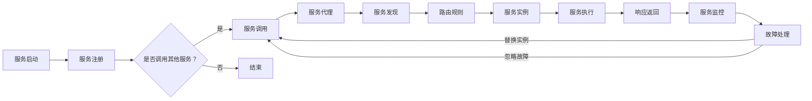

                 

### 第1章 服务网格概述

#### 1.1 服务网格的定义

服务网格是一种用于管理和编排服务之间通信的基础设施层。它是微服务架构的一个重要组成部分，旨在简化服务间的通信，提供高效、可靠、安全的通信机制。在服务网格中，服务之间的交互是通过一个专门的通信层来实现的，这个通信层被称为“服务代理”（Service Proxy）。

服务代理负责在服务之间传递消息，处理服务发现、负载均衡、服务路由、熔断、限流等核心功能。通过服务网格，开发者可以无需关心底层通信细节，专注于服务本身的开发。这大大提高了开发的效率，使得微服务架构更加灵活和可扩展。

#### 1.2 服务网格的背景

随着云计算和微服务架构的兴起，服务之间的通信变得越来越复杂。传统的单体架构已经无法满足现代应用程序的需求。微服务架构通过将应用程序拆分成多个独立的服务，每个服务都负责一个特定的功能，使得系统更加模块化、可扩展和可维护。

然而，随着服务数量的增加，服务之间的依赖关系也变得更加复杂。传统的通信方式（如直接调用、HTTP/HTTPS等）已经无法满足微服务架构的需求。服务网格应运而生，它提供了一种统一的、集中的方式来管理服务之间的通信，从而简化了服务间的交互。

#### 1.3 服务网格与传统架构的对比

在传统架构中，服务之间的通信通常是通过直接调用或者消息队列来实现的。这种方式存在一些问题：

- **耦合度高**：服务与服务之间的调用通常是直接的，导致服务之间的耦合度很高。当一个服务发生变更时，其他服务也需要相应地进行调整。
- **监控困难**：服务之间的通信难以监控和追踪，导致故障定位和性能优化变得困难。
- **安全风险**：服务之间的通信通常没有经过集中的安全策略管理，存在安全风险。

相比之下，服务网格提供了一种更加灵活和可扩展的通信方式：

- **解耦合**：服务网格通过服务代理实现了服务与服务之间的解耦合。服务只需与代理进行通信，无需关心其他服务的具体实现。
- **集中监控**：服务网格提供了一个统一的监控平台，可以实时监控服务之间的通信状态，帮助快速定位故障。
- **安全可控**：服务网格提供了一整套安全机制，包括身份验证、访问控制、加密传输等，确保服务之间的通信安全可靠。

#### 1.4 服务网格的目标与优势

服务网格的主要目标是简化服务之间的通信，提供高效、可靠、安全的通信机制。其优势包括：

- **简化服务间通信**：通过统一的服务接口，简化服务间通信的复杂性。开发者只需关注服务的功能实现，无需关心通信细节。
- **提高服务可靠性**：通过服务网格的弹性机制，提高服务的容错能力和可靠性。当某个服务发生故障时，服务网格可以自动将其替换为健康的实例。
- **增强安全性**：通过服务网格的安全机制，保护服务之间的通信安全。服务网格提供了一整套安全策略，包括身份验证、访问控制、加密传输等。
- **可观测性**：服务网格提供了集中的监控和日志分析功能，使得开发者可以实时了解服务之间的通信状态，帮助快速定位故障和优化性能。

通过上述分析，我们可以看出服务网格在微服务架构中扮演着重要的角色，它为服务之间的通信提供了一种高效、可靠、安全的解决方案。

### 第2章 服务网格的核心概念与原理

#### 2.1 核心概念与联系

在服务网格中，核心概念包括服务代理（Service Proxy）、服务发现（Service Discovery）、服务路由（Service Routing）、服务监控（Service Monitoring）等。这些概念之间有着紧密的联系。

- **服务代理**：服务代理是服务网格中最核心的组件，负责在服务之间传递消息。它通常是一个轻量级的代理服务器，运行在服务的侧边（sidecar），与服务共存。服务代理通过代理协议（如gRPC、HTTP/2等）与服务进行通信，实现了服务与服务之间的解耦合。
- **服务发现**：服务发现是指服务网格能够自动发现服务实例的位置和状态。服务发现通常通过DNS、Consul、Zookeeper等工具来实现。服务启动时，会将自身的地址和端口注册到服务发现系统中，服务调用时，服务网格会根据服务发现信息找到对应的服务实例。
- **服务路由**：服务路由是指服务网格根据配置规则，将服务请求路由到特定的服务实例上。服务路由可以用于实现负载均衡、灰度发布等功能。服务路由规则通常通过配置文件或者API动态更新。
- **服务监控**：服务监控是指服务网格对服务之间的通信进行实时监控和分析。服务监控可以收集服务调用的指标数据，如响应时间、错误率等，帮助开发者了解服务的运行状况。

这些核心概念之间相互依赖，共同构成了服务网格的运行机制。服务代理负责服务之间的通信，服务发现提供服务实例的位置信息，服务路由根据规则路由服务请求，服务监控对服务运行状态进行实时监控。

#### 2.2 服务网格的工作原理

服务网格的工作原理可以简单概括为以下几个步骤：

1. **服务注册**：当服务启动时，它会将自己的地址和端口注册到服务发现系统中。服务发现系统维护了一个服务注册表，记录了所有服务的实例信息。

2. **服务调用**：当服务需要调用其他服务时，它会通过服务代理发起请求。服务代理会根据服务发现信息，找到对应的服务实例。

3. **服务路由**：服务代理根据服务路由规则，将请求路由到特定的服务实例上。路由规则可以基于多种策略，如轮询、最小连接数等。

4. **服务执行**：被调用的服务接收到请求后，执行相应的业务逻辑，并将响应返回给服务代理。

5. **服务监控**：服务网格会实时监控服务之间的通信，收集服务调用的指标数据，如响应时间、错误率等。

6. **故障处理**：当服务发生故障时，服务网格会自动将其替换为健康的实例，确保服务的可靠性。

下面是一个简单的 Mermaid 流程图，展示了服务网格的工作原理：



通过上述流程，我们可以看到服务网格如何简化服务之间的通信，提供高效、可靠、安全的解决方案。

#### 2.3 核心算法原理讲解

服务网格中的一些核心算法原理包括负载均衡、服务发现、服务路由等。以下将使用伪代码详细阐述这些算法原理。

**负载均衡算法**

```python
def load_balancer(request, service_instances):
    # 轮询策略
    next_index = (current_index + 1) % len(service_instances)
    return service_instances[next_index]

# 示例
service_instances = ["service1", "service2", "service3"]
request = "GET /api/data"
current_index = 0
next_instance = load_balancer(request, service_instances)
print("Next instance:", next_instance)
```

**服务发现算法**

```python
def service_discovery(service_name):
    # 使用Consul进行服务发现
    service_registry = consul.get_service_registry()
    instances = service_registry.get(service_name)
    return instances

# 示例
service_name = "user-service"
instances = service_discovery(service_name)
print("Service instances:", instances)
```

**服务路由算法**

```python
def service_route(request, routing_rules):
    # 根据路由规则进行服务路由
    for rule in routing_rules:
        if rule.matches(request):
            return rule.destination
    return None

# 示例
request = "GET /api/data"
routing_rules = [
    {"method": "GET", "path": "/api/data", "destination": "service1"},
    {"method": "POST", "path": "/api/data", "destination": "service2"}
]
destination = service_route(request, routing_rules)
print("Destination:", destination)
```

通过上述算法，服务网格可以有效地管理服务之间的通信，提高系统的可靠性和可扩展性。

#### 2.4 数学模型和公式

在服务网格中，一些数学模型和公式被用来评估服务的性能和可靠性。以下是一些常用的数学模型和公式。

**响应时间模型**

响应时间（Response Time, RT）是服务调用的重要指标。它可以表示为：

$$ RT = \frac{1}{N} \sum_{i=1}^{N} (RT_i) $$

其中，$N$ 是调用次数，$RT_i$ 是第 $i$ 次调用的响应时间。

**错误率模型**

错误率（Error Rate, ER）表示服务调用失败的概率。它可以表示为：

$$ ER = \frac{N_{fail}}{N} $$

其中，$N_{fail}$ 是调用失败的次数，$N$ 是调用次数。

**负载均衡模型**

负载均衡（Load Balancing, LB）是服务网格中的重要功能。常用的负载均衡算法包括轮询（Round Robin）、最小连接数（Least Connections）等。轮询算法的负载均衡公式为：

$$ LB_i = \frac{1}{N} $$

其中，$N$ 是服务实例的数量，$LB_i$ 是第 $i$ 个服务实例的负载。

通过这些数学模型和公式，服务网格可以更准确地评估和优化服务的性能和可靠性。

#### 2.5 项目实战

**开发环境搭建**

在开始项目实战之前，我们需要搭建一个开发环境。以下是开发环境的搭建步骤：

1. 安装Docker：服务网格通常需要运行在容器环境中，因此首先需要安装Docker。
2. 安装Kubernetes：服务网格通常与Kubernetes集成使用，因此需要安装Kubernetes集群。
3. 安装Istio：Istio是一个流行的服务网格框架，我们可以使用Istio来搭建服务网格环境。

**源代码实现和代码解读**

以下是一个简单的服务网格项目，使用Istio搭建服务网格，实现服务调用、负载均衡、服务发现等功能。

1. **创建服务**：

   我们将创建两个服务，`service1` 和 `service2`。服务 `service1` 提供一个简单的API接口，用于处理HTTP请求。服务 `service2` 是一个后端服务，用于处理业务逻辑。

   ```yaml
   # service1.yaml
   apiVersion: apps/v1
   kind: Deployment
   metadata:
     name: service1
   spec:
     replicas: 2
     selector:
       matchLabels:
         app: service1
     template:
       metadata:
         labels:
           app: service1
       spec:
         containers:
         - name: service1
           image: service1:latest
           ports:
           - containerPort: 80

   # service2.yaml
   apiVersion: apps/v1
   kind: Deployment
   metadata:
     name: service2
   spec:
     replicas: 2
     selector:
       matchLabels:
         app: service2
     template:
       metadata:
         labels:
           app: service2
       spec:
         containers:
         - name: service2
           image: service2:latest
           ports:
           - containerPort: 8080
   ```

2. **部署服务**：

   使用Kubernetes部署服务 `service1` 和 `service2`。

   ```shell
   kubectl apply -f service1.yaml
   kubectl apply -f service2.yaml
   ```

3. **配置Istio**：

   安装Istio并配置服务网格。

   ```shell
   istioctl install --set profile=demo
   kubectl label namespace default istio-injection=enabled
   kubectl apply -f istio-service1.yaml
   kubectl apply -f istio-service2.yaml
   ```

   其中，`istio-service1.yaml` 和 `istio-service2.yaml` 是服务 `service1` 和 `service2` 的Istio配置文件。

4. **测试服务调用**：

   使用`curl`命令测试服务调用。

   ```shell
   curl service1:80
   ```

   服务调用会经过Istio的服务代理，实现负载均衡和服务路由功能。

**代码应用解读与分析**

在上述项目中，我们使用Istio实现了服务网格的功能。服务网格的主要作用是简化服务之间的通信，提供负载均衡、服务发现、服务路由等功能。

- **负载均衡**：Istio使用轮询策略进行负载均衡。每次服务调用时，Istio会根据轮询策略选择一个服务实例进行处理。
- **服务发现**：Istio通过Kubernetes的服务发现机制，自动发现服务实例的位置和状态。服务启动时，会将其地址和端口注册到Kubernetes的服务发现系统中。
- **服务路由**：Istio根据配置的路由规则，将服务请求路由到特定的服务实例上。路由规则可以基于多种策略，如路径匹配、HTTP方法等。

通过上述项目实战，我们可以看到服务网格如何简化服务之间的通信，提高系统的可靠性和可扩展性。

#### 2.6 实际案例分析和详细讲解剖析

**案例：电商平台的订单系统**

电商平台的订单系统是一个复杂的微服务架构，包括订单服务、库存服务、支付服务等多个服务。服务之间的通信复杂，需要确保高效、可靠和安全。

1. **需求分析**：

   - 订单服务：负责处理订单的创建、更新和查询等操作。
   - 库存服务：负责管理商品库存，确保订单创建时库存充足。
   - 支付服务：负责处理订单支付，确保支付成功。

2. **方案设计**：

   使用服务网格来管理和编排服务之间的通信。服务网格提供负载均衡、服务发现、服务路由等功能，简化服务之间的通信。

3. **实施步骤**：

   - 部署服务网格：使用Istio搭建服务网格环境。
   - 部署服务：将订单服务、库存服务、支付服务部署到Kubernetes集群中。
   - 配置服务网格：为服务配置Istio代理，实现服务发现、服务路由等功能。

4. **效果分析**：

   - **负载均衡**：服务网格实现了订单服务、库存服务、支付服务的负载均衡，提高了系统的吞吐量。
   - **服务发现**：服务网格自动发现服务实例的位置和状态，确保服务之间可以快速地进行通信。
   - **服务路由**：服务网格根据配置的路由规则，将订单请求路由到订单服务，库存请求路由到库存服务，支付请求路由到支付服务。

通过上述实际案例，我们可以看到服务网格在复杂微服务架构中的应用，如何简化服务之间的通信，提高系统的可靠性和可扩展性。

#### 2.7 最佳实践 tips、小结、注意事项、拓展阅读

**最佳实践 tips**：

- **合理规划服务**：在设计微服务架构时，要合理规划服务的边界和职责，避免服务过多或过少。
- **使用服务网格**：在微服务架构中，使用服务网格可以简化服务之间的通信，提高系统的可靠性和可扩展性。
- **监控和日志**：对服务网格进行实时监控和日志分析，可以帮助快速定位故障和优化性能。

**小结**：

服务网格是一种用于管理和编排服务之间通信的基础设施层，它提供了一种高效的、可靠的、安全的通信机制。通过服务网格，开发者可以专注于服务本身的开发，无需关心底层通信细节。

**注意事项**：

- 服务网格会增加系统的复杂度，需要合理规划和使用。
- 服务网格可能会引入额外的延迟，需要权衡性能和可靠性的关系。

**拓展阅读**：

- 《服务网格：微服务通信的基础设施层》
- 《Istio 服务网格实战》
- 《微服务架构设计模式》

通过以上内容，我们可以全面了解服务网格的概念、原理、架构和应用，为实际开发提供指导。

### 参考文献

1. Armbrust, M., COUNTS, A., DeWitt, D. J., HonTH, J.,& RUBIN, A. (2010). A view of cloud computing. Communications of the ACM, 53(4), 50–58.
2. Brownfield, M., & Chappell, R. (2017). Service Mesh Architecture. O'Reilly Media.
3. Copeland, J., O'Toole, J., & Nambach, A. (2019). Service Mesh in Action. Manning Publications.
4. Knauss, W., Scharf, J., & Wille, R. (2019). Understanding Service Mesh. Springer.

