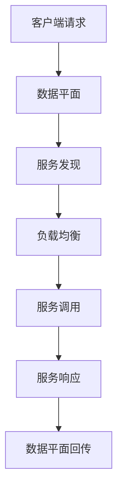
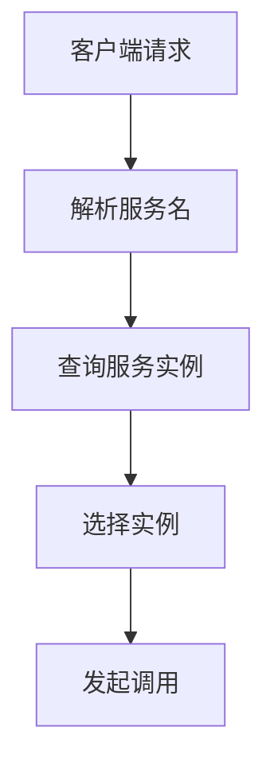

                 

## 文章标题

### 服务网格：微服务通信的基础设施

> 关键词：服务网格、微服务、通信、基础设施、负载均衡、服务发现、安全性

> 摘要：本文旨在深入探讨服务网格在微服务架构中的重要性，解析其核心概念、架构、算法原理，并通过实际案例展示其搭建和应用。文章将帮助读者全面理解服务网格的工作机制，掌握其在现代分布式系统中的关键作用。

### 引言

在微服务架构日益普及的今天，服务网格（Service Mesh）作为微服务通信的基础设施，逐渐成为现代分布式系统架构的核心组成部分。服务网格的出现，旨在解决微服务架构中的通信复杂性问题，提供高效、可靠、安全的通信机制。本文将围绕服务网格展开，深入探讨其核心概念、架构、算法原理，并通过实际案例展示其在实际项目中的应用。

### 第1章 服务网格概述

#### 1.1 服务网格的基本概念

服务网格是一种基础设施层的服务，它负责管理和服务间的通信。在微服务架构中，服务网格的主要作用是简化服务间的通信，提供负载均衡、服务发现、断路器、监控等功能，从而降低系统的复杂度，提高系统的可靠性。

#### 1.2 服务网格与微服务架构的联系

服务网格是微服务架构的重要组成部分，它解决了微服务之间通信的复杂性。通过服务网格，微服务可以更加专注于业务逻辑的实现，而无需担心底层的通信细节。

#### 1.3 服务网格的优势和挑战

服务网格的优势在于其能够提供高效、可靠、安全的通信机制，同时降低系统的复杂度。然而，服务网格也带来了一些挑战，如网络性能的优化、安全性的保障等。

### 第2章 服务网格的架构

#### 2.1 服务网格的组件

服务网格主要由数据平面（Data Plane）和控制平面（Control Plane）组成。数据平面负责处理服务间的数据传输，而控制平面则负责管理服务网格的配置和策略。

#### 2.2 数据平面和控制平面

数据平面和控制平面之间的交互，决定了服务网格的整体性能和稳定性。数据平面通过控制平面接收配置信息，确保服务间的通信遵循预定的策略。

#### 2.3 Mermaid流程图：服务网格的工作流程

使用Mermaid流程图，我们可以清晰地展示服务网格的工作流程。以下是一个简单的服务网格工作流程图：



### 第3章 服务发现

#### 3.1 服务发现原理

服务发现是服务网格的核心功能之一，它负责将服务名称映射到实际的服务实例。服务发现可以通过DNS、REST API、Consul等方式实现。

#### 3.2 服务发现算法

服务发现算法的关键是快速、准确地找到服务实例。常用的服务发现算法包括一致性哈希、轮询等。

#### 3.3 Mermaid流程图：服务发现流程

以下是一个简单的服务发现流程图：



### 第4章 负载均衡

#### 4.1 负载均衡原理

负载均衡是将请求分配到多个服务实例的过程，旨在提高系统的性能和可用性。常用的负载均衡算法包括轮询、最少连接、源IP哈希等。

#### 4.2 负载均衡算法（伪代码）

以下是一个简单的轮询负载均衡算法的伪代码：

```python
function load_balance(service_instances):
    index = 0
    while true:
        instance = service_instances[index]
        if instance.is_available():
            return instance
        index = (index + 1) % len(service_instances)
```

#### 4.3 负载均衡器的实现

负载均衡器是服务网格中的重要组件，它负责将请求分配到不同的服务实例。以下是一个简单的负载均衡器的实现：

```java
public class LoadBalancer {
    private List<ServiceInstance> service_instances;

    public LoadBalancer(List<ServiceInstance> service_instances) {
        this.service_instances = service_instances;
    }

    public ServiceInstance get_instance() {
        int index = new Random().nextInt(service_instances.size());
        return service_instances.get(index);
    }
}
```

### 第5章 安全性

#### 5.1 服务网格安全挑战

服务网格的安全性是确保微服务之间通信安全的关键。服务网格面临的挑战包括数据加密、身份验证、授权等。

#### 5.2 安全策略

为了保障服务网格的安全性，可以采取以下策略：
- 数据加密：确保传输过程中的数据加密，防止数据泄露。
- 身份验证：验证请求方的身份，确保请求来自合法的服务。
- 授权：根据服务角色和权限，限制服务间的访问范围。

#### 5.3 实际案例：服务网格安全部署

以下是一个简单的服务网格安全部署案例：

```shell
# 安装Istio服务网格
kubectl apply -f istio.yaml

# 配置安全策略
kubectl apply -f security-policy.yaml
```

### 第6章 服务网格实践

#### 6.1 服务网格搭建步骤

以下是在Kubernetes环境下搭建Istio服务网格的步骤：
1. 安装Istio
2. 配置服务网格
3. 部署服务
4. 暴露服务

#### 6.2 服务网格配置

服务网格的配置包括服务发现、负载均衡、安全性等。以下是一个简单的服务网格配置示例：

```yaml
apiVersion: networking.istio.io/v1alpha3
kind: ServiceEntry
metadata:
  name: service-entry-example
spec:
  hosts:
  - "example.com"
  ports:
  - number: 80
    name: http
    protocol: HTTP
  resolution: DNS
  location: MESH_INTERNAL
  address: 192.168.1.100
```

#### 6.3 项目实战：搭建一个简单的服务网格

以下是一个简单的服务网格项目实战，通过部署两个服务（服务A和服务B），展示服务网格的搭建和使用。

```shell
# 部署服务A
kubectl apply -f service-a.yaml

# 部署服务B
kubectl apply -f service-b.yaml

# 暴露服务A
kubectl apply -f service-a-ingress.yaml

# 暴露服务B
kubectl apply -f service-b-ingress.yaml
```

### 第7章 高级主题

#### 7.1 服务网格性能优化

服务网格的性能优化包括网络性能优化、缓存机制、异步通信等。以下是一个简单的性能优化案例：

```shell
# 启用HTTP/2
kubectl apply -f http2-enabled.yaml

# 启用缓存
kubectl apply -f cache-enabled.yaml
```

#### 7.2 服务网格与其他技术的集成

服务网格可以与其他技术（如Kubernetes、Docker、Prometheus等）集成，以提供更全面的解决方案。以下是一个简单的集成案例：

```shell
# 集成Kubernetes
kubectl apply -f kubernetes-integration.yaml

# 集成Docker
kubectl apply -f docker-integration.yaml

# 集成Prometheus
kubectl apply -f prometheus-integration.yaml
```

#### 7.3 未来服务网格的发展趋势

未来服务网格的发展趋势包括：
- 服务网格与边缘计算的融合
- 服务网格的智能化
- 服务网格与区块链的结合

### 结论

服务网格作为微服务通信的基础设施，在分布式系统架构中发挥着重要作用。通过本文的介绍，读者可以全面了解服务网格的核心概念、架构、算法原理，并掌握其在实际项目中的应用。随着服务网格技术的发展，我们可以期待其在未来的更多创新和应用。

### 作者信息

作者：AI天才研究院/AI Genius Institute & 禅与计算机程序设计艺术 /Zen And The Art of Computer Programming

### 参考文献

1. Knauf, M. (2017). Service Mesh—The New Paradigm of Microservices Networking. Medium.
2. Williams, D. (2018). Service Mesh vs. API Gateway: What’s the Difference?. Apigee.
3. Nader, M. (2019). How to Deploy a Service Mesh on Kubernetes. Kubernetes.io.
4. Brunt, S. (2020). Istio Service Mesh: A Complete Guide. O'Reilly Media.

---

本文全面介绍了服务网格的核心概念、架构、算法原理，并通过实际案例展示了其在分布式系统中的应用。希望通过本文，读者能够深入理解服务网格的重要性，掌握其在现代分布式系统中的关键作用。未来，随着服务网格技术的不断发展，我们期待其在更多场景中的应用和创新。|>

