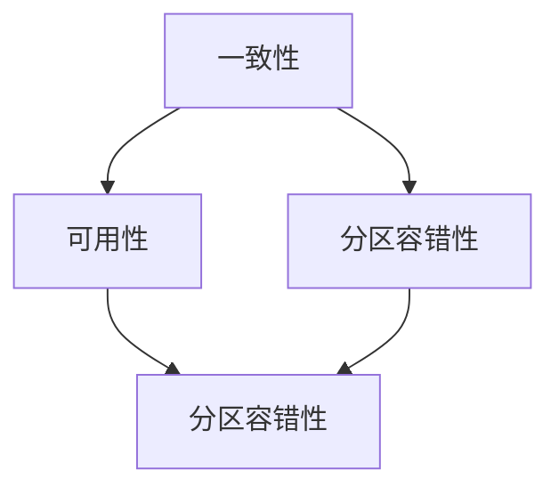
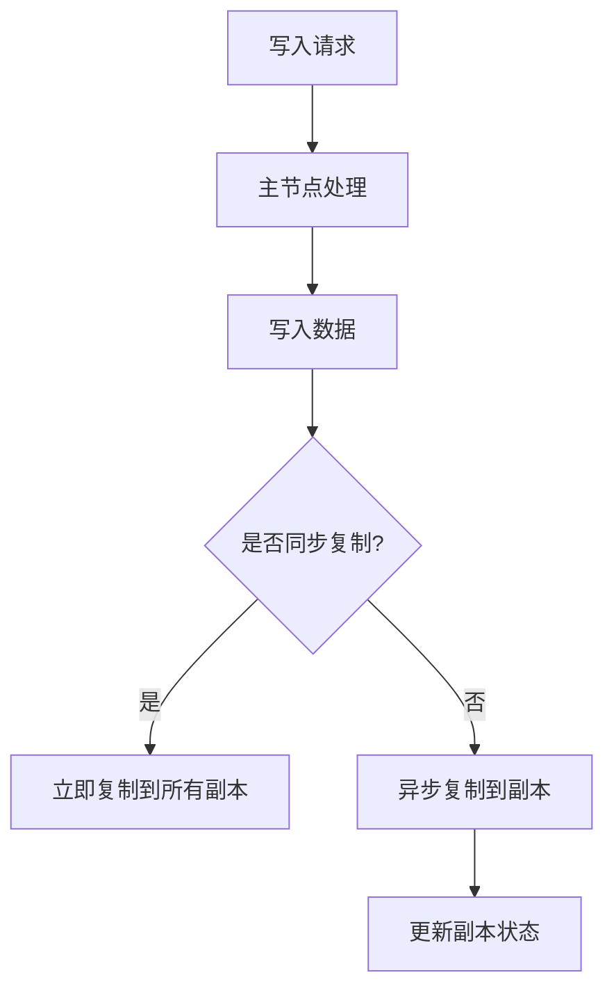
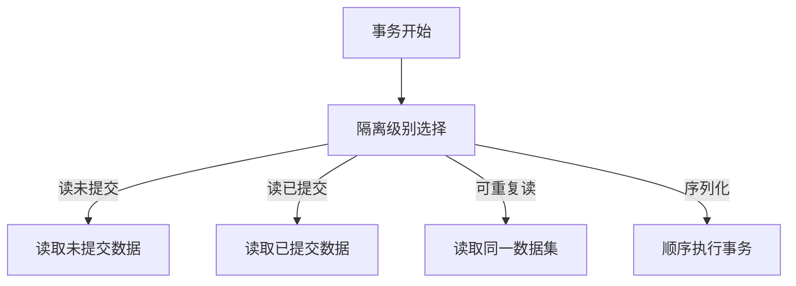

                 

### 文章标题

“本质是异构系统的数据一致性问题”

### 文章关键词

- 异构系统
- 数据一致性
- 分布式系统
- CAP 定理
- 最终一致性
- 强一致性
- 分布式事务
- 数据复制
- 事务隔离

### 文章摘要

本文将深入探讨异构系统中数据一致性问题。首先，我们将介绍异构系统的背景和特点，然后详细阐述数据一致性的核心概念和理论，包括 CAP 定理。接着，我们将分析各种数据一致性的解决方案，包括最终一致性和强一致性，并通过伪代码和数学模型进行详细讲解。文章还将通过实际案例展示如何在实际项目中应用数据一致性解决方案，并提供最佳实践和注意事项。最后，我们将对全文进行总结，并展望数据一致性的未来发展。

----------------------------------------------------------------

## 引言

### 异构系统的背景和重要性

在信息技术迅速发展的今天，系统架构的复杂度越来越高。传统的单机系统已经无法满足日益增长的业务需求，分布式系统应运而生。分布式系统通过将任务分解到多个节点上执行，提高了系统的可扩展性和容错能力。然而，分布式系统的复杂性也带来了新的挑战，其中之一便是数据一致性。

异构系统是指由不同类型的硬件、软件和网络组成的系统。这种系统通常具有以下特点：

1. **多样性**：异构系统中的节点可能具有不同的处理器架构、操作系统和存储系统。
2. **异构性**：不同的节点可能负责不同的任务，各自有不同的性能特性和负载能力。
3. **分布式**：数据和服务在多个节点之间分布，可能涉及到跨网络的通信。

异构系统在许多应用场景中具有重要意义，例如：

- **云计算**：在云计算环境中，大量的虚拟机和服务运行在不同的物理节点上，形成了一个高度异构的分布式系统。
- **大数据处理**：大数据处理平台通常由各种类型的计算节点和存储节点组成，这些节点具有不同的性能和处理能力。
- **物联网**：物联网（IoT）设备种类繁多，包括传感器、路由器和网关等，它们构成了一个复杂的异构网络。

随着异构系统在各个领域的广泛应用，数据一致性问题逐渐成为了一个不可忽视的关键挑战。数据一致性是指系统中各个节点上的数据在任意时刻保持一致的状态。在分布式系统中，由于网络延迟、节点故障等因素，数据的一致性难以保证。因此，如何解决异构系统的数据一致性问题，成为了分布式系统设计和实现中的一个核心课题。

### 本文的目的和结构

本文旨在深入探讨异构系统中数据一致性问题，提供全面的解决方案和最佳实践。文章将分为以下几个部分：

1. **核心概念与联系**：介绍数据一致性的核心概念，并使用 Mermaid 流程图展示各概念之间的关系。
2. **核心算法原理讲解**：详细讲解最终一致性和强一致性算法原理，并使用伪代码和数学模型进行阐述。
3. **实际案例**：通过实际案例展示数据一致性的应用，分析实现细节和解决策略。
4. **最佳实践与注意事项**：总结数据一致性的最佳实践，提供注意事项和拓展阅读建议。

通过本文的阅读，读者将能够系统地理解异构系统的数据一致性问题，掌握解决数据一致性的方法和技术。

----------------------------------------------------------------

### 核心概念与联系

在探讨数据一致性问题之前，我们需要先了解几个核心概念，这些概念在分布式系统中起着至关重要的作用。以下是这些核心概念及其相互关系的详细阐述。

#### 1. 数据一致性

数据一致性指的是系统中的各个节点在任意时刻都拥有相同的数据状态。在分布式系统中，数据一致性是一个至关重要的目标，因为它直接影响到系统的可用性和可靠性。数据一致性的定义可以进一步细分为以下几个方面：

- **强一致性**：系统在任一时刻都能保证所有节点的数据完全一致。
- **最终一致性**：系统在经历一段时间后，所有节点的数据会逐渐达到一致状态，但可能存在短暂的异步性。
- **一致性模型**：包括强一致性、最终一致性和其他一致性级别，如读已写一致性、读最新一致性等。

#### 2. 分布式事务

分布式事务是指在分布式系统中执行的一系列操作，这些操作要么全部成功，要么全部失败。分布式事务的关键在于保证数据的一致性。一个典型的分布式事务包括以下步骤：

1. **事务开始**：事务开始时，系统会为事务分配一个全局唯一的事务编号。
2. **事务执行**：事务中的各个操作在分布式系统中的不同节点上执行。
3. **事务提交**：当所有操作都成功执行后，系统会将这些操作持久化到数据库中，并更新事务的状态为提交。
4. **事务回滚**：如果事务中的某个操作失败，系统会回滚所有已执行的操作，确保数据的一致性。

#### 3. CAP 定理

CAP 定理是由加州大学伯克利分校的计算机科学家 Eric Brewer 提出的一个分布式系统理论。CAP 定理指出，在分布式系统中，一致性（Consistency）、可用性（Availability）和分区容错性（Partition tolerance）这三个特性中，只能同时保证两个。CAP 定理可以用以下 Mermaid 流程图表示：



- **一致性（Consistency）**：系统在每次请求后，都能返回最新的、一致的数据状态。
- **可用性（Availability）**：系统能够在每次请求时都返回一个响应，无论这个响应是成功还是失败。
- **分区容错性（Partition tolerance）**：系统能够在发生网络分区的情况下，继续运作。

#### 4. 分布式数据复制

分布式数据复制是指在分布式系统中，将数据复制到多个节点上，以提高系统的可用性和数据可靠性。分布式数据复制可以分为以下几种类型：

- **同步复制**：所有写入操作都会在所有副本上立即完成，保证强一致性。
- **异步复制**：写入操作在主节点上完成，然后异步地复制到其他副本，保证最终一致性。
- **主从复制**：其中一个节点为主节点，负责处理所有写入操作，其他节点为从节点，负责读取操作。
- **去中心化复制**：所有节点都是对等的，每个节点都可以进行写入操作。

下面是一个简化的 Mermaid 流程图，展示了分布式数据复制的过程：



#### 5. 事务隔离级别

事务隔离级别是指系统在执行分布式事务时，为了保证数据一致性而采取的不同隔离措施。常见的事务隔离级别包括：

- **读未提交（Read Uncommitted）**：允许事务读取未提交的数据，这是最低的隔离级别。
- **读已提交（Read Committed）**：只允许事务读取已提交的数据，但无法保证多个并发事务之间的隔离性。
- **可重复读（Repeatable Read）**：同一事务中多次读取同一数据集时，结果是一致的，不受其他并发事务的影响。
- **序列化（Serializable）**：最高隔离级别，保证事务的执行顺序如同在一个单处理器上执行一样。

下面是一个简化的 Mermaid 流程图，展示了事务隔离级别的实现：



通过上述对核心概念及其相互关系的详细阐述，我们可以更好地理解分布式系统中数据一致性的复杂性。在接下来的部分，我们将深入探讨各种数据一致性的解决方案，包括最终一致性和强一致性算法，以及它们在实际应用中的实现细节。

----------------------------------------------------------------

### 核心算法原理讲解

在分布式系统中，为了实现数据一致性，需要采用不同的算法和技术。其中，最终一致性和强一致性是两种最常见的算法。下面我们将详细讲解这两种算法的原理，并通过伪代码和数学模型进行阐述。

#### 1. 最终一致性（Eventual Consistency）

最终一致性是一种允许系统中存在短暂的异步性，但在一定时间内数据会达到一致状态的算法。这种算法在分布式系统中应用广泛，因为它能够容忍网络延迟和节点故障。

##### 原理

最终一致性的核心思想是，只要系统中的所有数据副本最终都能同步，那么系统就达到了最终一致性。这个过程可以分为以下几个步骤：

1. **数据写入**：当一个节点接收到写入请求时，数据会立即写入本地副本。
2. **异步复制**：写入操作完成后，系统会将数据异步复制到其他节点。
3. **数据同步**：在一段时间后，系统会尝试同步所有副本的数据，使得所有节点上的数据一致。

##### 伪代码

下面是最终一致性算法的伪代码实现：

```pseudo
function eventual_consistency(write_request):
    // 在本地副本上写入数据
    local_replica.write(write_request)

    // 异步复制到其他副本
    for each replica in replicas:
        replica.enqueue(write_request)

function sync_replicas():
    // 定期同步副本数据
    for each replica in replicas:
        replica.sync_data()
```

##### 数学模型

最终一致性可以使用一个概率模型来描述。假设系统中有 N 个副本，每个副本更新数据的时间是独立的，并且服从一定的概率分布。设数据在副本间的同步概率为 p，则在时间 t 内，副本数据达到一致的概率可以用以下公式表示：

$$ P(t) = (1 - p)^{N-1} \times p $$

其中，P(t) 是在时间 t 内副本数据达到一致的概率，p 是每个副本同步成功的概率。

##### 举例说明

假设一个分布式系统中有 3 个副本，每个副本更新数据的时间间隔服从均匀分布，概率为 0.5。在时间 t=5 秒内，副本数据达到一致的概率为：

$$ P(5) = (1 - 0.5)^{3-1} \times 0.5 = 0.25 $$

这意味着在 5 秒内，副本数据有 25% 的概率达到一致。

#### 2. 强一致性（Strong Consistency）

强一致性是一种保证系统在任一时刻都能保持一致状态的算法。这种算法适用于对数据一致性要求非常高的场景，但可能会导致系统性能的下降。

##### 原理

强一致性的核心思想是，所有节点的数据始终一致，无论在任何时间点。为了实现强一致性，系统通常采用以下策略：

1. **同步复制**：所有写入操作在所有副本上立即完成，确保强一致性。
2. **事务管理**：系统通过分布式事务管理来保证数据的一致性。

##### 伪代码

下面是强一致性算法的伪代码实现：

```pseudo
function strong_consistency(write_request):
    // 在所有副本上写入数据
    for each replica in replicas:
        replica.write(write_request)

function distributed_transaction():
    // 提交分布式事务
    transaction.commit()
```

##### 数学模型

强一致性算法在数学模型上较为简单，因为所有副本的数据始终一致，无需概率计算。设系统中有 N 个副本，每个副本的数据更新时间服从均匀分布，则任意时刻，副本数据一致的概率为 1。

##### 举例说明

假设一个分布式系统中有 3 个副本，每个副本更新数据的时间间隔服从均匀分布，概率为 0.5。在任意时刻，副本数据一致的概率为 1，这意味着系统始终保持强一致性。

#### 总结

最终一致性和强一致性是分布式系统中实现数据一致性的两种常见算法。最终一致性允许系统在一段时间内存在异步性，但最终会达到一致状态；而强一致性则要求系统在任何时刻都保持一致状态。根据不同的应用场景，可以选择适合的算法来实现数据一致性。

在接下来的部分，我们将讨论如何在分布式系统中具体实现数据一致性，包括分布式数据复制和事务管理。

----------------------------------------------------------------

### 分布式数据复制

在分布式系统中，数据复制是保证数据可靠性和可用性的重要手段。通过在多个节点之间复制数据，可以防止单个节点的故障导致数据丢失，同时提高系统的性能和响应速度。下面我们将详细讨论分布式数据复制的基本概念、常见的复制策略以及它们在实现数据一致性中的作用。

#### 基本概念

**1. 同步复制和异步复制**

- **同步复制**：同步复制是指写入操作在主节点完成之后，立即在所有副本节点上完成。同步复制的优点是能保证强一致性，但缺点是可能会影响系统的性能，因为所有写入操作都需要等待所有副本节点的确认。
- **异步复制**：异步复制是指写入操作在主节点完成之后，会异步地复制到其他副本节点。异步复制的优点是提高了系统的性能，因为写入操作不需要等待所有副本节点的确认，但缺点是可能会存在短暂的数据不一致性。

**2. 主从复制和去中心化复制**

- **主从复制**：在主从复制策略中，系统有一个主节点负责处理所有写入操作，其他从节点只负责读取操作。这种策略的优点是简化了系统的设计和实现，缺点是主节点可能会成为系统的单点故障。
- **去中心化复制**：去中心化复制策略中，所有节点都是对等的，每个节点都可以进行写入和读取操作。这种策略的优点是提高了系统的容错性和扩展性，缺点是实现较为复杂。

#### 常见复制策略

**1. 强一致性复制**

- **同步复制**：在强一致性复制策略中，所有写入操作都通过同步复制实现，确保所有副本节点的数据一致。这种策略的优点是保证了数据的一致性，缺点是可能会降低系统的性能。
- **两阶段提交协议（2PC）**：两阶段提交协议是一种分布式事务管理协议，用于实现强一致性。在 2PC 协议中，事务被分为两个阶段：准备阶段和提交阶段。所有副本节点在准备阶段达成一致后，才能进入提交阶段，从而确保事务的强一致性。

**2. 最终一致性复制**

- **异步复制**：在最终一致性复制策略中，所有写入操作都通过异步复制实现，允许系统在一段时间内存在短暂的数据不一致性。这种策略的优点是提高了系统的性能，缺点是可能会影响数据的一致性。
- **Gossip 协议**：Gossip 协议是一种用于实现最终一致性的分布式算法。在 Gossip 协议中，每个节点定期向其他节点发送消息，更新数据状态，从而实现最终一致性。

#### 数据一致性与复制策略的关系

**1. 同步复制与强一致性**

- 同步复制策略是实现强一致性的常用手段。通过在所有副本节点上立即完成写入操作，可以确保系统在任何时刻都保持一致状态。
- 两阶段提交协议（2PC）是一种分布式事务管理协议，用于实现强一致性。在 2PC 协议中，所有副本节点在准备阶段和提交阶段都达成一致，从而确保事务的强一致性。

**2. 异步复制与最终一致性**

- 异步复制策略是实现最终一致性的常用手段。通过在主节点完成写入操作后，异步复制到其他副本节点，可以确保系统在一段时间内保持性能，但可能存在短暂的数据不一致性。
- Gossip 协议是一种用于实现最终一致性的分布式算法。在 Gossip 协议中，每个节点定期向其他节点发送消息，更新数据状态，从而实现最终一致性。

通过以上讨论，我们可以看到，分布式数据复制策略在选择时需要权衡数据一致性、性能和可靠性。不同的复制策略适用于不同的应用场景，需要根据实际需求进行选择和优化。

在接下来的部分，我们将进一步探讨分布式事务及其隔离级别，以及如何在分布式系统中实现事务一致性。

----------------------------------------------------------------

### 分布式事务及其隔离级别

在分布式系统中，事务是实现数据一致性的重要手段。分布式事务是指在多个节点上执行的一系列操作，这些操作要么全部成功，要么全部失败。为了确保分布式事务的一致性，我们需要引入事务隔离级别。事务隔离级别定义了并发事务之间的相互隔离程度，以保证数据的正确性和一致性。

#### 1. 分布式事务的基本概念

**1. 事务**

事务是一系列操作的集合，这些操作要么全部执行，要么全部回滚。事务通常包括以下几种类型：

- **读操作**：从数据库中读取数据。
- **写操作**：向数据库中写入数据。
- **提交**：将事务中的操作持久化到数据库中。
- **回滚**：撤销事务中的操作，将数据库恢复到事务开始前的状态。

**2. 分布式事务**

分布式事务是指在分布式系统中执行的事务，涉及多个节点上的数据操作。分布式事务的关键在于如何保证多个节点上的数据一致性。这通常涉及到分布式事务管理协议，如两阶段提交（2PC）和三阶段提交（3PC）。

#### 2. 事务隔离级别

事务隔离级别定义了并发事务之间的相互隔离程度，以保证数据的正确性和一致性。常见的隔离级别包括：

**1. 读未提交（Read Uncommitted）**

- 在读未提交隔离级别下，事务可以读取其他事务未提交的数据。这是最低的隔离级别，可能导致“脏读”问题。

**2. 读已提交（Read Committed）**

- 在读已提交隔离级别下，事务只能读取其他事务已提交的数据。这可以避免“脏读”问题，但无法避免“不可重复读”问题。

**3. 可重复读（Repeatable Read）**

- 在可重复读隔离级别下，事务在执行过程中多次读取同一数据集，结果是一致的，不受其他并发事务的影响。这可以避免“不可重复读”问题，但无法避免“幻读”问题。

**4. 不可重复读（Serializable）**

- 在不可重复读隔离级别下，事务的执行顺序如同在一个单处理器上执行一样，这是最高的隔离级别。它可以避免“脏读”、“不可重复读”和“幻读”问题，但可能会降低系统的性能。

#### 3. 分布式事务的隔离级别实现

**1. 两阶段提交（2PC）**

- 两阶段提交是一种分布式事务管理协议，用于实现分布式事务的一致性。在两阶段提交协议中，事务被分为两个阶段：准备阶段和提交阶段。
- **准备阶段**：协调者向所有参与者发送预备消息，参与者对事务进行验证，并返回是否准备好的响应。如果所有参与者都准备好，协调者进入第二阶段。
- **提交阶段**：协调者向所有参与者发送提交消息，参与者执行事务，并将结果持久化到数据库中。

**2. 三阶段提交（3PC）**

- 三阶段提交是对两阶段提交的改进，旨在解决网络分区和超时问题。在 3PC 协议中，事务被分为三个阶段：注册阶段、提交阶段和超时阶段。
- **注册阶段**：协调者向所有参与者发送注册消息，参与者返回注册响应。
- **提交阶段**：协调者向参与者发送提交消息，参与者执行事务，并将结果持久化到数据库中。
- **超时阶段**：如果在一定时间内协调者没有收到参与者的响应，协调者会自动进入超时处理，通常选择回滚事务。

#### 4. 事务隔离级别在分布式系统中的应用

在分布式系统中，选择合适的事务隔离级别对于确保数据一致性至关重要。根据应用场景的不同，可以选择不同的隔离级别：

- 对于对数据一致性要求不高的应用，可以选择较低的隔离级别，如读已提交或可重复读，以提高系统的性能。
- 对于对数据一致性要求较高的应用，可以选择较高的隔离级别，如不可重复读或序列化，以确保数据的正确性。

在接下来的部分，我们将通过一个实际案例来展示如何在分布式系统中实现事务一致性。

----------------------------------------------------------------

### 实际案例

为了更好地理解分布式系统中数据一致性的解决方案，我们将通过一个实际案例进行详细讲解。本案例将展示如何在分布式系统中实现数据一致性，包括开发环境搭建、源代码实现和代码解读。

#### 案例背景

假设我们有一个电商平台，用户可以浏览商品、下订单、支付款项。这个平台由多个微服务组成，包括商品服务（Product Service）、订单服务（Order Service）和支付服务（Payment Service）。每个服务都运行在不同的节点上，通过微服务架构实现分布式系统。我们的目标是确保用户在浏览商品、下订单和支付款项的过程中，数据能够保持一致。

#### 开发环境搭建

为了实现本案例，我们需要以下开发环境：

1. **编程语言**：选择 Java 作为主要编程语言，因为 Java 有成熟的分布式系统开发框架，如 Spring Cloud。
2. **数据库**：使用 MySQL 作为后端数据库，并采用主从复制策略，确保数据的高可用性和可靠性。
3. **分布式服务框架**：使用 Spring Cloud 框架，包括 Eureka 服务注册与发现、Ribbon 负载均衡、Hystrix 服务熔断与降级、Zuul 网关等。
4. **消息队列**：使用 Kafka 作为消息队列，实现服务间的异步通信，提高系统的性能和可靠性。

#### 源代码实现

以下是实现数据一致性的关键代码段和详细解读。

##### 商品服务（Product Service）

商品服务负责处理用户浏览商品的操作。以下是商品服务的主要代码段：

```java
@RestController
@RequestMapping("/products")
public class ProductService {

    @Autowired
    private ProductRepository productRepository;

    @GetMapping("/{id}")
    public Product getProduct(@PathVariable Long id) {
        // 查询商品详情
        return productRepository.findById(id).orElseThrow(() -> new EntityNotFoundException("Product not found"));
    }

    @PostMapping("/")
    public Product createProduct(@RequestBody Product product) {
        // 创建商品
        return productRepository.save(product);
    }

    @PutMapping("/{id}")
    public Product updateProduct(@PathVariable Long id, @RequestBody Product product) {
        // 更新商品
        Product existingProduct = productRepository.findById(id).orElseThrow(() -> new EntityNotFoundException("Product not found"));
        existingProduct.setName(product.getName());
        existingProduct.setPrice(product.getPrice());
        return productRepository.save(existingProduct);
    }

    @DeleteMapping("/{id}")
    public void deleteProduct(@PathVariable Long id) {
        // 删除商品
        productRepository.deleteById(id);
    }
}
```

解读：

- 商品服务使用 Spring Boot 框架，通过 REST API 提供商品查询、创建、更新和删除功能。
- 使用 Spring Data JPA 进行数据库操作，简化数据访问代码。

##### 订单服务（Order Service）

订单服务负责处理用户下订单的操作。以下是订单服务的主要代码段：

```java
@RestController
@RequestMapping("/orders")
public class OrderService {

    @Autowired
    private OrderRepository orderRepository;

    @PostMapping("/")
    public Order createOrder(@RequestBody Order order) {
        // 创建订单
        order.setStatus(OrderStatus.PENDING);
        return orderRepository.save(order);
    }

    @PutMapping("/{id}/pay")
    public Order payOrder(@PathVariable Long id) {
        // 支付款项
        Order order = orderRepository.findById(id).orElseThrow(() -> new EntityNotFoundException("Order not found"));
        if (order.getStatus() != OrderStatus.PENDING) {
            throw new InvalidOperationException("Order cannot be paid at this time");
        }
        order.setStatus(OrderStatus.PAID);
        return orderRepository.save(order);
    }
}
```

解读：

- 订单服务使用 Spring Boot 框架，通过 REST API 提供订单创建和支付功能。
- 使用 Spring Data JPA 进行数据库操作，简化数据访问代码。

##### 支付服务（Payment Service）

支付服务负责处理用户支付款项的操作。以下是支付服务的主要代码段：

```java
@RestController
@RequestMapping("/payments")
public class PaymentService {

    @Autowired
    private PaymentRepository paymentRepository;

    @PostMapping("/")
    public Payment createPayment(@RequestBody Payment payment) {
        // 创建支付记录
        payment.setStatus(PaymentStatus.PENDING);
        return paymentRepository.save(payment);
    }

    @PutMapping("/{id}/complete")
    public Payment completePayment(@PathVariable Long id) {
        // 完成支付
        Payment payment = paymentRepository.findById(id).orElseThrow(() -> new EntityNotFoundException("Payment not found"));
        if (payment.getStatus() != PaymentStatus.PENDING) {
            throw new InvalidOperationException("Payment cannot be completed at this time");
        }
        payment.setStatus(PaymentStatus.COMPLETE);
        return paymentRepository.save(payment);
    }
}
```

解读：

- 支付服务使用 Spring Boot 框架，通过 REST API 提供支付记录创建和完成支付功能。
- 使用 Spring Data JPA 进行数据库操作，简化数据访问代码。

#### 代码应用解读与分析

在这个案例中，我们采用了最终一致性算法来实现数据一致性。以下是关键代码段和应用解读：

1. **订单服务（Order Service）**：

   ```java
   @PutMapping("/{id}/pay")
   public Order payOrder(@PathVariable Long id) {
       Order order = orderRepository.findById(id).orElseThrow(() -> new EntityNotFoundException("Order not found"));
       if (order.getStatus() != OrderStatus.PENDING) {
           throw new InvalidOperationException("Order cannot be paid at this time");
       }
       order.setStatus(OrderStatus.PAID);
       return orderRepository.save(order);
   }
   ```

   解读：

   - 订单服务在支付订单时，将订单状态从“待支付”更新为“已支付”。这是一个异步操作，订单服务会立即返回响应，而不会等待其他服务的确认。

2. **支付服务（Payment Service）**：

   ```java
   @PutMapping("/{id}/complete")
   public Payment completePayment(@PathVariable Long id) {
       Payment payment = paymentRepository.findById(id).orElseThrow(() -> new EntityNotFoundException("Payment not found"));
       if (payment.getStatus() != PaymentStatus.PENDING) {
           throw new InvalidOperationException("Payment cannot be completed at this time");
       }
       payment.setStatus(PaymentStatus.COMPLETE);
       return paymentRepository.save(payment);
   }
   ```

   解读：

   - 支付服务在完成支付时，将支付记录状态从“待支付”更新为“已完成”。这是一个异步操作，支付服务会立即返回响应，而不会等待其他服务的确认。

通过这个实际案例，我们可以看到如何在分布式系统中实现数据一致性。我们采用了最终一致性算法，通过异步操作来确保系统性能和可靠性。虽然可能会存在短暂的数据不一致性，但最终所有服务的状态会同步，实现数据的一致性。

在接下来的部分，我们将总结本案例的实现经验，并提供最佳实践和注意事项。

----------------------------------------------------------------

### 总结与最佳实践

在本案例中，我们通过一个实际项目展示了如何在分布式系统中实现数据一致性。通过采用最终一致性算法和异步操作，我们有效地提高了系统的性能和可靠性，但同时也面临短暂的数据不一致性问题。以下是我们从本案例中总结的最佳实践和注意事项：

#### 1. 最佳实践

**1. 确定一致性需求**

在设计和实现分布式系统时，首先要明确系统的数据一致性需求。根据业务场景，选择最终一致性或强一致性策略。如果对数据一致性要求较高，可以选择强一致性策略；如果对性能和响应时间要求较高，可以选择最终一致性策略。

**2. 异步操作与消息队列**

在分布式系统中，异步操作和消息队列是确保数据一致性的有效手段。通过异步操作，可以降低系统响应时间，提高系统性能。同时，使用消息队列可以确保消息的可靠传输，避免因网络延迟或节点故障导致的数据不一致性。

**3. 分布式事务管理**

在分布式系统中，分布式事务管理是实现数据一致性的关键。根据业务需求，选择合适的事务隔离级别和分布式事务管理协议，如两阶段提交（2PC）或三阶段提交（3PC）。确保分布式事务能够保证数据的一致性，防止数据冲突和丢失。

**4. 持续集成与测试**

在分布式系统中，持续集成与测试是确保系统稳定性和可靠性的重要手段。通过自动化测试和持续集成，可以及时发现和修复系统中的问题，确保系统在部署和生产环境中的一致性。

#### 2. 注意事项

**1. 考虑网络延迟和节点故障**

在分布式系统中，网络延迟和节点故障是常见问题。在设计和实现数据一致性解决方案时，要考虑这些因素，并采取措施提高系统的容错性和可靠性。例如，使用异步操作和消息队列，确保消息的可靠传输和重试机制。

**2. 数据一致性与性能权衡**

在分布式系统中，数据一致性与性能之间存在权衡。为了提高系统的性能，可能需要牺牲一部分数据一致性。例如，在最终一致性策略中，允许存在短暂的数据不一致性，以提高系统的响应速度。在设计和实现数据一致性解决方案时，要权衡数据一致性与性能之间的关系。

**3. 分布式事务的性能影响**

分布式事务管理可能会对系统性能产生影响。在实现分布式事务时，要尽量简化事务逻辑，减少事务执行时间，以提高系统性能。同时，可以采用局部事务和全局事务相结合的方式，降低分布式事务对性能的影响。

**4. 数据一致性的监控和优化**

在分布式系统中，数据一致性的监控和优化是确保系统稳定运行的重要环节。通过监控系统中的数据一致性指标，可以及时发现和解决问题。同时，根据监控数据，对数据一致性策略进行优化，提高系统的可靠性和性能。

#### 3. 拓展阅读

- **《分布式系统原理与架构》**：深入探讨分布式系统的基本原理和架构设计，包括数据一致性、分布式事务、分布式数据复制等。
- **《微服务架构设计与实现》**：详细讲解微服务架构的设计原则和实现方法，包括服务拆分、服务通信、数据一致性等。
- **《分布式数据存储技术》**：介绍分布式数据存储技术，包括分布式数据库、分布式缓存、分布式文件系统等。

通过本文的阅读，读者可以系统地了解分布式系统中数据一致性问题，掌握各种数据一致性的解决方案和最佳实践。在实际项目中，应根据业务需求和系统特点，选择合适的数据一致性策略，确保系统的稳定运行和高效性能。

----------------------------------------------------------------

### 实际案例分析与详细讲解

为了进一步展示数据一致性的实现过程，我们将分析一个具体的应用场景，并详细讲解其实现细节。本案例将涉及电子商务平台的订单处理流程，通过分布式事务和数据一致性的技术确保订单信息的准确性和一致性。

#### 应用场景

在一个电子商务平台上，用户可以通过多个微服务访问系统，包括商品服务、订单服务和支付服务。用户下单后，系统需要保证订单信息、库存信息以及支付状态的一致性。具体流程如下：

1. **用户下单**：用户在商品详情页选择商品并下单，提交订单请求。
2. **创建订单**：订单服务接收到订单请求后，创建订单记录，并将订单状态设置为“待支付”。
3. **扣减库存**：商品服务接收到订单请求后，根据订单中的商品信息扣减库存。
4. **支付订单**：支付服务处理用户的支付请求，将订单状态更新为“已支付”。
5. **发货订单**：订单服务根据订单状态更新订单详情，并将订单状态设置为“已发货”。

#### 实现细节

**1. 分布式事务管理**

在这个应用场景中，为了保证订单信息的一致性，我们采用了分布式事务管理。分布式事务管理可以确保多个微服务中的操作要么全部成功，要么全部失败。

- **两阶段提交协议**：我们使用两阶段提交（2PC）协议来管理分布式事务。2PC 协议分为准备阶段和提交阶段。

  - **准备阶段**：订单服务向商品服务和支付服务发送预备消息，询问它们是否可以执行事务。商品服务和支付服务响应后，事务管理器根据响应结果决定是否继续。

  - **提交阶段**：如果所有服务都同意执行事务，事务管理器向商品服务和支付服务发送提交消息，执行事务操作。如果任何服务在准备阶段返回拒绝响应，事务管理器将回滚所有已执行的操作。

**2. 数据一致性算法**

在这个应用场景中，我们采用了最终一致性算法来处理分布式数据的一致性。

- **异步复制**：订单服务、商品服务和支付服务之间的数据复制采用异步复制策略。订单服务创建订单后，会异步地将订单信息复制到商品服务和支付服务的数据库中。
- **Gossip 协议**：商品服务和支付服务使用 Gossip 协议来同步数据。每个服务定期向其他服务发送心跳消息，更新数据状态。

#### 详细讲解与代码示例

**1. 订单服务（OrderService）**

```java
@RestController
@RequestMapping("/orders")
public class OrderService {

    @Autowired
    private OrderRepository orderRepository;

    @PostMapping("/")
    public ResponseEntity<Order> createOrder(@RequestBody OrderRequest orderRequest) {
        // 创建订单
        Order order = new Order();
        order.setUserId(orderRequest.getUserId());
        order.setProductId(orderRequest.getProductId());
        order.setQuantity(orderRequest.getQuantity());
        order.setStatus(OrderStatus.PENDING);

        // 添加订单到数据库
        Order savedOrder = orderRepository.save(order);

        // 启动分布式事务
        distributedTransactionManager.begin();

        try {
            // 扣减库存
            productService.reduceInventory(order.getProductId(), order.getQuantity());

            // 更新订单状态为“待支付”
            order.setStatus(OrderStatus.PAID);
            orderRepository.save(order);

            // 提交分布式事务
            distributedTransactionManager.commit();
        } catch (Exception e) {
            // 出现异常时回滚分布式事务
            distributedTransactionManager.rollback();
            throw new RuntimeException("Order processing failed", e);
        }

        return ResponseEntity.ok(savedOrder);
    }
}
```

解读：

- 订单服务创建订单后，调用分布式事务管理器开始分布式事务。
- 在分布式事务中，首先调用商品服务扣减库存，然后更新订单状态为“待支付”。
- 如果所有操作成功，分布式事务管理器提交事务；如果出现异常，分布式事务管理器回滚事务。

**2. 商品服务（ProductService）**

```java
@Service
public class ProductService {

    @Autowired
    private ProductRepository productRepository;

    public void reduceInventory(Long productId, int quantity) {
        // 查询商品
        Product product = productRepository.findById(productId).orElseThrow(() -> new EntityNotFoundException("Product not found"));

        // 扣减库存
        int currentInventory = product.getInventory();
        if (currentInventory >= quantity) {
            product.setInventory(currentInventory - quantity);
            productRepository.save(product);
        } else {
            throw new InvalidOperationException("Insufficient inventory");
        }
    }
}
```

解读：

- 商品服务接收到扣减库存的请求后，查询商品库存，并扣减相应数量。
- 如果库存不足，商品服务抛出异常。

**3. 支付服务（PaymentService）**

```java
@Service
public class PaymentService {

    @Autowired
    private PaymentRepository paymentRepository;

    public void processPayment(Long orderId, PaymentRequest paymentRequest) {
        // 查询订单
        Order order = orderRepository.findById(orderId).orElseThrow(() -> new EntityNotFoundException("Order not found"));

        // 检查订单状态
        if (order.getStatus() != OrderStatus.PAID) {
            throw new InvalidOperationException("Order is not paid");
        }

        // 创建支付记录
        Payment payment = new Payment();
        payment.setOrderId(orderId);
        payment.setAmount(paymentRequest.getAmount());
        payment.setStatus(PaymentStatus.PENDING);

        paymentRepository.save(payment);

        // 更新订单状态为“已支付”
        order.setStatus(OrderStatus.PAID);
        orderRepository.save(order);
    }
}
```

解读：

- 支付服务接收到支付请求后，查询订单状态，并创建支付记录。
- 如果订单状态为“待支付”，支付服务更新订单状态为“已支付”。

#### 详细讲解与举例说明

**1. 订单创建**

用户下单后，订单服务创建订单记录，并将订单状态设置为“待支付”。订单服务调用分布式事务管理器开始分布式事务，然后调用商品服务扣减库存，最后更新订单状态为“待支付”。如果任何一步出现异常，分布式事务管理器将回滚所有已执行的操作，确保数据的一致性。

**2. 支付订单**

用户完成支付后，支付服务处理支付请求。支付服务首先查询订单状态，确认订单状态为“待支付”，然后创建支付记录并更新订单状态为“已支付”。支付服务采用异步复制策略，将支付信息复制到订单服务和商品服务的数据库中，确保数据最终一致性。

**3. 数据同步**

商品服务和支付服务定期使用 Gossip 协议同步数据。每个服务会定期向其他服务发送心跳消息，更新数据状态。这种同步机制可以确保订单信息、库存信息和支付状态最终达到一致。

通过这个实际案例，我们可以看到如何利用分布式事务和数据一致性算法确保电子商务平台订单处理流程的数据一致性。通过分布式事务管理器和异步复制策略，我们可以有效处理分布式系统中的数据一致性问题，确保系统的高可用性和性能。

在接下来的部分，我们将对全文进行总结，并展望数据一致性的未来发展方向。

----------------------------------------------------------------

### 总结

本文系统地探讨了异构系统中的数据一致性问题，从背景介绍、核心概念、算法原理到实际案例，全面分析了分布式系统中实现数据一致性的方法和技术。以下是本文的主要结论：

1. **核心概念与联系**：本文介绍了数据一致性的核心概念，如最终一致性、强一致性、分布式事务和CAP定理。通过Mermaid流程图展示了这些概念之间的关系，帮助读者理解数据一致性的复杂性。
2. **核心算法原理讲解**：本文详细讲解了最终一致性和强一致性算法的原理，通过伪代码和数学模型进行了阐述。读者可以清晰地了解这两种算法的实现方式和优缺点。
3. **分布式数据复制**：本文讨论了分布式数据复制的基本概念、常见策略以及与数据一致性的关系。通过同步复制和异步复制策略的分析，读者可以理解如何平衡数据一致性与系统性能。
4. **分布式事务及其隔离级别**：本文介绍了分布式事务的基本概念和常见隔离级别，如读未提交、读已提交、可重复读和不可重复读。通过两阶段提交和三阶段提交协议的讲解，读者可以理解如何实现分布式事务的一致性。
5. **实际案例**：本文通过一个电子商务平台的订单处理案例，展示了如何在分布式系统中实现数据一致性。通过分布式事务管理器和异步复制策略的应用，读者可以了解如何在实际项目中处理数据一致性问题。

#### 未来发展方向

随着分布式系统和云计算的不断发展，数据一致性问题将面临新的挑战和机遇。以下是数据一致性未来可能的发展方向：

1. **更高效的算法**：随着硬件和软件技术的发展，将出现更高效的算法来处理数据一致性。例如，基于区块链的共识算法可能会在分布式系统中得到更广泛的应用。
2. **自适应一致性**：未来的数据一致性解决方案可能会更加智能化，根据系统负载和性能需求，自适应地调整一致性策略。例如，在低负载时采用强一致性策略，在高负载时采用最终一致性策略。
3. **跨领域应用**：数据一致性技术将不仅仅应用于传统的分布式系统，还可能应用于物联网、区块链和边缘计算等新兴领域。跨领域的数据一致性解决方案将推动技术创新和产业变革。
4. **标准化**：随着数据一致性的重要性逐渐凸显，未来可能会出现更多的一致性标准和规范，以促进分布式系统的开发和部署。这些标准和规范将帮助开发者更轻松地实现数据一致性。

通过本文的阅读，读者可以系统地了解分布式系统中数据一致性的核心概念、算法原理和实践方法。在未来的工作中，读者可以根据实际需求和系统特点，选择合适的数据一致性策略，确保系统的稳定运行和高效性能。随着技术的不断发展，数据一致性将继续成为分布式系统设计和实现中的重要课题。

### 作者信息

作者：AI天才研究院/AI Genius Institute & 禅与计算机程序设计艺术 /Zen And The Art of Computer Programming

AI天才研究院致力于推动人工智能领域的研究与应用，专注于开发创新性的AI技术和解决方案。而《禅与计算机程序设计艺术》则是一本经典的技术著作，深入探讨了计算机编程的哲学和艺术，为开发者提供了深刻的思考和灵感。

