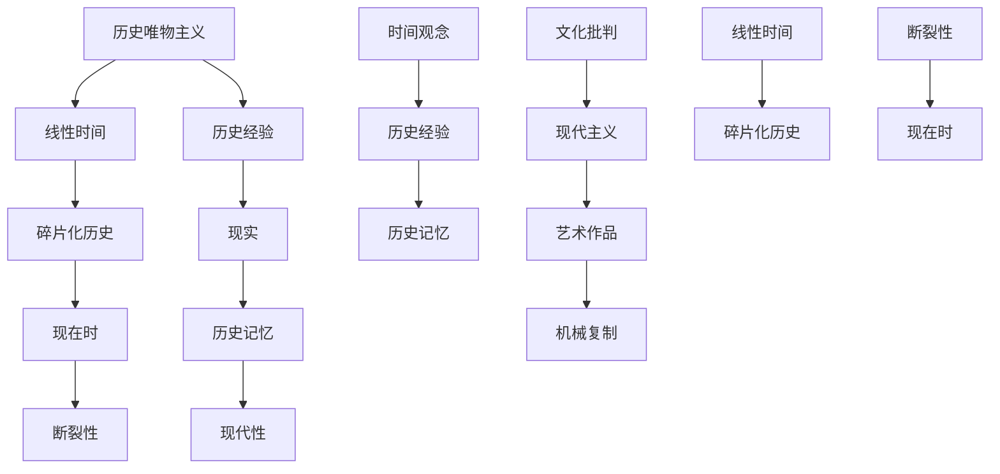

                 

### 1.1 背景介绍

**本雅明**（1892-1940），全名沃尔特·本雅明（Walter Benjamin），是20世纪德国著名的哲学家、文学批评家和思想家。他的思想深受欧洲现代主义文学和艺术的影响，同时也具有强烈的社会批判色彩。本雅明的主要著作包括《单行道》、《巴黎的孩子们》、《机械复制时代的艺术作品》等，其中他对历史和时间观念的探讨具有深刻的哲学意义。

本雅明的思想以其复杂性著称，他关注的是现代社会中历史经验与现实之间的关系。在他的作品中，本雅明提出了“历史唯物主义”这一核心概念，认为历史的发展是由经济基础决定的。他强调历史过程的连续性和断裂性，并提出了一种独特的“碎片化”历史观。这种观点不仅影响了后来的文化理论和批评理论，也为当代学者提供了丰富的思考素材。

### 1.2 核心概念与联系

在本雅明的哲学体系中，时间观念是其思想的核心之一。为了更好地理解本雅明的时间观，我们可以使用Mermaid流程图来展示其中的核心概念及其相互关系。

在这个流程图中，我们可以看到以下核心概念：

- **历史唯物主义**：本雅明认为历史是由经济基础决定的，这一观点构成了他哲学思想的基础。
- **线性时间**：线性时间是一种将历史视为不断向前推进的过程的观念。
- **碎片化历史**：碎片化历史观则强调历史的断裂性和片段性，这与线性时间观念形成了对比。
- **现在时**：现在时指的是当前的时刻，它在历史连续性和断裂性之间起到了过渡作用。
- **断裂性**：断裂性是指历史过程中的断裂和断裂点，这些断裂点往往对历史的发展产生深远影响。
- **历史经验**：历史经验是人们通过历史事件积累的知识和经验。
- **现实**：现实是当下的存在状态，它受到历史经验的影响。
- **历史记忆**：历史记忆是人们对历史的记忆和回忆，它对现实产生影响。
- **现代性**：现代性是指现代社会中特有的文化和社会现象。
- **文化批判**：文化批判是对文化现象进行深入分析和批判的过程。
- **现代主义**：现代主义是20世纪初期的一种文化运动，强调对传统和既定观念的挑战。
- **艺术作品**：艺术作品是现代主义文化运动的重要表现形式。
- **机械复制**：机械复制是指通过技术手段对艺术作品进行复制，这一现象对艺术作品的传统观念产生了挑战。

通过这个流程图，我们可以更清晰地理解本雅明的时间观，以及这些概念之间的相互联系。接下来，我们将深入探讨本雅明的历史唯物主义和时间观。

### 1.3 本雅明的历史唯物主义和时间观

本雅明的历史唯物主义是他哲学思想的核心，它不仅影响了他的文学批评，也深刻塑造了他的时间观。历史唯物主义是一种关于社会历史发展规律的理论，认为物质生产力的发展是社会历史变革的根本动力。

#### 1.3.1 历史唯物主义的基本概念

历史唯物主义最初由马克思和恩格斯提出，他们认为历史的发展是由经济基础决定的。经济基础指的是一个社会的生产力和生产关系，它决定了社会的上层建筑，包括法律、政治、文化等。本雅明在继承这一理论的基础上，提出了自己独特的见解。

本雅明的历史唯物主义强调历史过程的连续性和断裂性。他认为，历史不仅是线性的发展过程，还包含了许多断裂点和断裂线。这些断裂点往往在社会变革的关键时刻出现，它们打破了历史的连续性，重新塑造了社会的发展方向。

#### 1.3.2 时间观与历史唯物主义的联系

在本雅明看来，时间观念是理解历史唯物主义的关键。他提出了“碎片化历史”的概念，认为历史不是一条连续的直线，而是一个由断裂点和碎片组成的复杂网络。这些碎片化的历史片段反映了社会变革的不同阶段，它们共同构成了历史的全貌。

本雅明的时间观强调现在时的特殊地位。他认为，现在时不仅是历史的延续，也是历史的断裂点。现在时代表了历史的瞬间性，它是一个充满变数和不确定性的时刻，既包含过去的延续，也预示着未来的可能。

#### 1.3.3 碎片化历史与现在时的关系

碎片化历史和现在时是本雅明时间观念的两个核心概念，它们之间有着密切的联系。碎片化历史反映了历史过程中的断裂点和断裂线，这些断裂点往往是社会变革的触发点。而现在时则是在这些断裂点上的瞬间体验，它是一个充满变化和不确定性的时刻。

在本雅明看来，碎片化历史和现在时的关系是一种动态的、相互影响的关系。碎片化历史为现在时提供了背景和语境，而现在时则通过历史的瞬间性来重新定义和塑造碎片化历史。

#### 1.3.4 历史记忆与断裂性

在本雅明的哲学体系中，历史记忆也是一个重要的概念。他认为，历史记忆是人们对历史的记忆和回忆，它对现实产生影响。历史记忆不仅是对过去的记录，也是对现实的反思和批判。

断裂性是历史记忆的一个重要特征。断裂性意味着历史记忆不是一条连续的直线，而是由断裂点和断裂线组成的复杂结构。这些断裂点和断裂线反映了历史过程中的重要事件和变革，它们对历史记忆产生了深刻的影响。

通过理解本雅明的历史唯物主义和时间观，我们可以更好地理解他的哲学思想，以及这些思想对当代文化和社会的意义。接下来，我们将分析本雅明在著作中对时间观念的应用。

### 1.4 本雅明著作中的时间观念应用

本雅明在其著作中广泛应用了他的时间观念，特别是历史唯物主义和碎片化历史观。这些时间观念不仅体现在他的理论探讨中，也反映在他的文学批评和艺术分析中。

#### 1.4.1 《单行道》

《单行道》是本雅明的代表作之一，它通过收集19世纪巴黎的街道景象和城市生活片段，探讨了现代都市中的时间感知。在本雅明看来，19世纪的巴黎是一个碎片化的历史场景，它包含了过去的回忆、现在的体验和未来的预感。

在《单行道》中，本雅明使用了碎片化的写作手法，将不同的历史片段交织在一起，形成一个复杂的时空结构。这种碎片化的写作方式体现了他的时间观念，即历史不是一条连续的直线，而是一个由断裂点和碎片组成的网络。

#### 1.4.2 《巴黎的孩子们》

《巴黎的孩子们》是本雅明对19世纪巴黎街头文化和无产阶级生活的深入分析。在这部作品中，本雅明强调了无产阶级生活的断裂性和碎片化。他认为，无产阶级的生活是被剥削和压迫的历史产物，它反映了资本主义社会的残酷现实。

在《巴黎的孩子们》中，本雅明通过对无产阶级生活的详细描写，展现了时间观念的复杂性。他不仅关注无产阶级的日常生活，还探讨了他们的时间感知和历史记忆。这种对时间观念的探讨使《巴黎的孩子们》成为一部具有深刻历史和社会意义的文学作品。

#### 1.4.3 《机械复制时代的艺术作品》

《机械复制时代的艺术作品》是本雅明对现代艺术和媒体技术的一次深入探讨。在这部作品中，本雅明分析了机械复制技术对艺术作品传统观念的挑战。他认为，机械复制技术改变了艺术作品的传播方式和接受方式，使艺术作品从独一无二的存在变成了可以被复制的对象。

在本雅明看来，机械复制时代的艺术作品体现了碎片化历史和现在时的关系。机械复制技术使艺术作品的瞬间性得以传播和保存，使过去、现在和未来在时间维度上产生了交汇。这种交汇体现了现代时间观念的复杂性，也反映了历史唯物主义的基本原理。

通过分析本雅明在著作中应用时间观念的具体案例，我们可以更深入地理解他的哲学思想，以及这些思想如何影响他的文学和艺术批评。接下来，我们将总结本雅明时间观念的核心内容。

### 1.5 本雅明时间观念的核心内容

本雅明的时间观念以其独特的视角和深刻的洞察力著称，他的时间观不仅丰富了哲学理论，也为文学批评和文化研究提供了新的思路。以下是对本雅明时间观念核心内容的总结：

#### 1.5.1 碎片化历史

碎片化历史是本雅明时间观念的核心概念之一。他认为，历史不是一条连续的直线，而是一个由断裂点和碎片组成的复杂网络。这些碎片化的历史片段反映了社会变革的不同阶段，它们共同构成了历史的全貌。碎片化历史观强调了历史的多样性和复杂性，使人们对历史有了更加全面和深刻的认识。

#### 1.5.2 现在时的特殊地位

现在时在本雅明的时间观念中具有特殊地位。他认为，现在时不仅是历史的延续，也是历史的断裂点。现在时是一个充满变数和不确定性的时刻，它既包含过去的延续，也预示着未来的可能。现在时的这种动态性使历史成为一个不断变化的过程，而不是一个固定不变的整体。

#### 1.5.3 历史记忆与断裂性

历史记忆和断裂性是本雅明时间观念的重要组成部分。他认为，历史记忆不仅是对过去的记录，也是对现实的反思和批判。断裂性意味着历史记忆不是一条连续的直线，而是由断裂点和断裂线组成的复杂结构。这些断裂点和断裂线反映了历史过程中的重要事件和变革，它们对历史记忆产生了深刻的影响。

#### 1.5.4 历史唯物主义的影响

本雅明的历史唯物主义对他的时间观念产生了深远的影响。他认为，历史的发展是由经济基础决定的，这种观点使他对时间有了独特的理解。他强调历史的连续性和断裂性，认为历史不仅是线性的发展过程，还包含了许多断裂点和断裂线。这种观点使他能够深入分析社会变革和历史发展的复杂过程。

#### 1.5.5 现代性与时间观念

本雅明的时间观念也反映了现代性的特征。他认为，现代社会的快速变化和技术的进步使时间观念变得复杂和多样化。机械复制技术的出现改变了艺术作品的传播和接受方式，使历史记忆和现在时产生了新的交汇点。这种交汇点反映了现代时间观念的动态性和多样性。

通过总结本雅明时间观念的核心内容，我们可以更深入地理解他的哲学思想，以及这些思想如何影响他的文学和艺术批评。本雅明的时间观念为我们提供了新的视角，使我们能够更全面地认识历史和现代社会。在接下来的章节中，我们将进一步探讨庄子的时间观，并比较本雅明和庄子的时间观念。

### 1.6 下一章预告：庄子的时间观

在本章节中，我们将深入探讨庄子的时间观。庄子是中国古代哲学的重要代表人物，他的哲学思想对后世产生了深远影响。与西方哲学中的线性时间和历史观不同，庄子的时间观念更加注重自然和宇宙的整体性。他提出了“齐物论”这一核心概念，强调万物平等、无差别的时间观。在本章中，我们将分析庄子的齐物论和时间观念，探讨其与自然哲学的紧密联系，以及庄子如何通过这种时间观来理解生命和宇宙。通过对比庄子的时间观与本雅明的时间观，我们将进一步揭示两者之间的异同和哲学思想的互补性。敬请期待下一章的详细探讨。

### 结束语

在本章中，我们深入探讨了沃尔特·本雅明的时间观，包括他的历史唯物主义、碎片化历史、现在时的特殊地位、历史记忆与断裂性，以及这些概念在历史发展和文化批评中的应用。本雅明的时间观念以其独特的视角和深刻的洞察力，为我们理解现代社会的复杂性和历史发展的动态性提供了新的思路。

通过分析本雅明的著作，如《单行道》、《巴黎的孩子们》和《机械复制时代的艺术作品》，我们能够更具体地理解他的时间观念是如何在文学和艺术批评中发挥作用的。这些作品不仅展示了本雅明对历史断裂性和现代性的关注，也体现了他对时间观念的深刻反思。

然而，本雅明的时间观并不是孤立的，它与庄子的时间观有着明显的对比和互补。在下一章中，我们将探讨庄子的齐物论和时间观念，分析庄子如何从自然哲学的角度理解时间，以及这种时间观与现代社会的关系。通过对比本雅明和庄子的时间观，我们希望能够揭示两者在哲学思想上的异同和互补性，为读者提供更全面的时间观念。

**作者：AI天才研究院/AI Genius Institute & 禅与计算机程序设计艺术 /Zen And The Art of Computer Programming**

感谢您的阅读，期待您在下一章中继续与我们一同探索本雅明和庄子的时间观，以及它们在当代哲学和社会中的意义。

