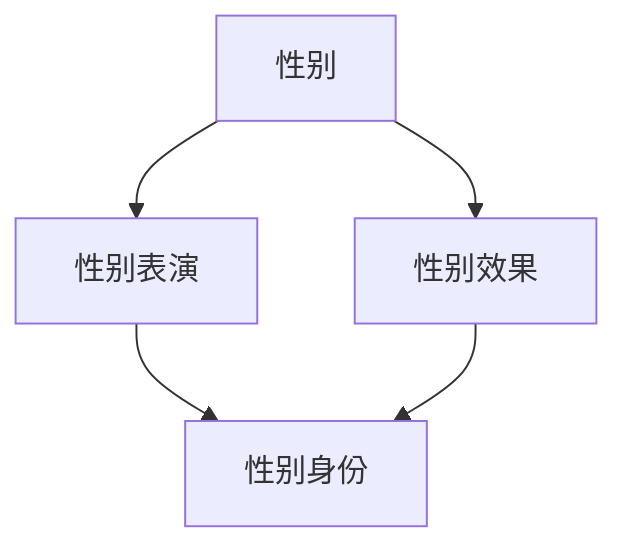
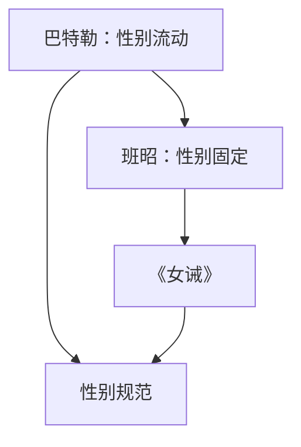
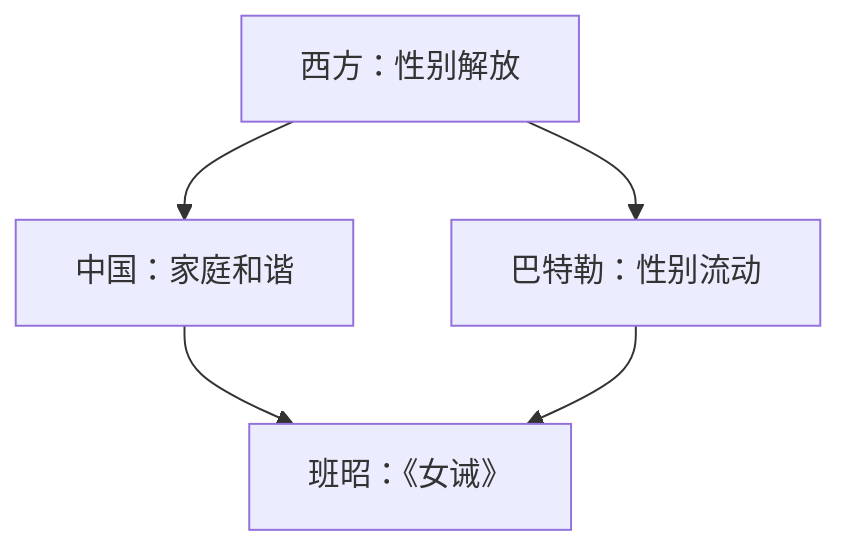

                 

### 文章标题

《朱迪斯·巴特勒与班昭：性别麻烦与女诫的女性主义对话》

### 文章关键词

性别理论、女性主义、朱迪斯·巴特勒、班昭、性别麻烦、女诫、跨文化对话

### 文章摘要

本文旨在探讨性别理论家和表演理论家朱迪斯·巴特勒与东汉时期中国女性文学家班昭之间的女性主义对话。通过深入分析二者的核心理论和作品，本文将揭示性别麻烦的概念，并探讨班昭的《女诫》在女性主义背景下的意义。此外，本文还将分析中西文化差异，比较两位女性的女性主义观点，并探讨其理论贡献和现实影响。最终，本文将对两位女性的女性主义对话进行总结，并提出未来展望。

### 引言

朱迪斯·巴特勒（Judith Butler）是一位著名的性别理论家和表演理论家，以其开创性的性别麻烦（gender trouble）概念而闻名。她出生于1956年，毕业于加州大学伯克利分校，并获得耶鲁大学博士学位。巴特勒的主要著作包括《性别麻烦：女性主义的颠覆》（Gender Trouble: Feminism and the Subversion of Identity）和《充满欲望的批判：伊莱娜·西苏与文学恐怖主义》（Bodies That Matter: On the Discursive Limits of "Sex"）。她的理论对性别身份、性别表达和社会规范提出了深刻的批判。

相比之下，班昭（Ban Zhao）是东汉时期的一位女性文学家，生活在公元2世纪。她是班固的女儿，被誉为“女诫”的作者。班昭的《女诫》是中国古代妇女教条的重要文献，对女性教育、婚姻和道德规范有着深远的影响。《女诫》强调女性的被动性和顺从性，同时也提出了关于女性自我修养的观点。

尽管巴特勒和班昭生活在不同的文化和时代背景下，她们都对性别和女性主义有着深刻的思考和独特的见解。本文将通过分析二者的性别理论和作品，探讨性别麻烦的概念，并探讨班昭的《女诫》在女性主义背景下的意义。此外，本文还将分析中西文化差异，比较两位女性的女性主义观点，并探讨其理论贡献和现实影响。

### 朱迪斯·巴特勒的性别理论

朱迪斯·巴特勒的性别理论起源于她的代表作《性别麻烦：女性主义的颠覆》（Gender Trouble: Feminism and the Subversion of Identity）。在这本书中，巴特勒提出了性别麻烦（gender trouble）的概念，即性别不是一种固定不变的身份，而是一种通过表演和再现不断形成和重塑的过程。

巴特勒认为，性别是由文化和社会规范建构的，而不是由生理性别决定的。她指出，性别身份和性别表达是通过日常生活中的表演和模仿来维持和再现的。这种表演不仅包括个体的行为和外表，还包括社会对性别的期望和规范。巴特勒使用了一个比喻，将性别描述为一个“织物”，这个织物是通过无数次的编织和拆除来维持和改变的。

巴特勒的核心概念之一是“性别表演”（gender performance）。她认为，性别不是通过基因或生理特征来定义的，而是通过一系列的身体姿态、语言和行为来展现的。这些表演是持续不断的，并且是可变的。巴特勒提出，性别表演是一种“重复的实践”，这些重复的行为和动作构成了我们对性别身份的理解。

另一个重要的概念是“性别效果”（gender performativity）。巴特勒认为，性别不仅仅是表演的结果，它也是一种效果，即性别通过表演来维持和再现自身。她指出，社会规范和性别角色是通过重复的性别表演来巩固和强化的。这些表演不仅构成了我们对性别的理解，也影响了我们的行为和身份认同。

巴特勒的理论对传统的性别观念提出了挑战。她认为，性别身份是流动的，而不是固定的。性别不仅是一种社会角色，也是一种文化构建。巴特勒的性别理论为我们提供了一个新的视角来理解性别和社会规范。

为了更深入地理解巴特勒的性别理论，我们可以使用Mermaid流程图来展示其核心概念之间的关系。以下是一个简单的示例：



在这个流程图中，A代表性别，B代表性别表演，C代表性别效果，D代表性别身份。这个流程图显示了性别表演和性别效果如何共同作用于性别身份的形成和维持。

### 班昭的《女诫》与女性主义

班昭的《女诫》是中国古代妇女教条的重要文献，对女性教育、婚姻和道德规范有着深远的影响。《女诫》共有十篇，包括《女宗篇》、《母仪篇》、《妇德篇》等，每一篇都针对女性在不同生活阶段应遵循的道德规范和行为准则进行了详细的论述。

《女诫》的核心观点是强调女性的被动性和顺从性。班昭认为，女性应该遵循“三从四德”的原则，即在家从父、出嫁从夫、老来从子，以及妇德、妇言、妇容、妇功。这些规范要求女性在家庭和社会中扮演顺从和服务的角色，强调女性的内在美德和道德修养。

然而，尽管《女诫》强调了女性的被动性和顺从性，它也提出了一些关于女性自我修养的观点。例如，班昭认为，女性应该通过学习和修养来提高自己，以达到“妇德”的要求。她强调了知识的重要性，认为女性应该通过学习来丰富自己的内心世界。

从现代女性主义的角度来看，《女诫》中的某些观点显然与现代女性主义的核心原则相悖。现代女性主义强调女性的自主性和平等权利，认为女性应该享有与男性相同的权利和机会。然而，《女诫》的观点在古代社会中具有重要的意义，它为女性提供了一种行为和道德规范，有助于维护家庭和社会的秩序。

为了更深入地理解班昭的《女诫》，我们可以使用伪代码来解释其中的关键算法和逻辑。以下是一个简单的示例：

```plaintext
function 妇德(女性) {
    // 女性：一个代表女性的对象
    // 行为准则：一个包含女性应遵循的行为准则的列表

    // 1. 学习
    学习内容：道德、礼仪、家务等
    女性.知识 = 学习内容

    // 2. 从父
    女性.从父 = 父亲的要求

    // 3. 从夫
    女性.从夫 = 丈夫的要求

    // 4. 从子
    女性.从子 = 子女的要求

    // 5. 妇容
    女性.容貌 = 保持整洁

    // 6. 妇功
    女性.功绩 = 完成家务

    // 返回一个符合妇德标准的女性对象
    return 女性
}
```

在这个伪代码中，`妇德`函数接收一个女性对象作为参数，并设置了一系列的行为准则，包括学习、从父、从夫、从子、妇容和妇功。这个函数的目的是将女性培养成一个符合妇德标准的人。通过这种方式，我们可以看到《女诫》中的规范是如何通过算法化的步骤来实现的。

### 性别麻烦：巴特勒与班昭的对话

在探讨朱迪斯·巴特勒与班昭的女性主义观点时，我们不能忽略二者的理论碰撞和对话。巴特勒的性别理论强调性别作为文化和社会建构的本质，而班昭的《女诫》则提供了古代中国文化中对女性角色的传统规范。这两种观点在性别、女性地位和女性权利等方面存在着明显的差异，但也存在某些共同点。

首先，巴特勒的性别理论对传统的性别二元对立提出了质疑。她认为，性别是一种流动的、表演性的过程，而不是固定不变的身份。这与班昭的《女诫》中对女性角色的固定描述形成了鲜明对比。在《女诫》中，班昭将女性角色限制在家庭内部，强调女性的被动性和顺从性。这种描述与现代女性主义强调的自主性和平等权利相冲突。

然而，巴特勒和班昭在某些方面也存在共识。例如，他们都认为女性的地位和权利受到社会和文化规范的限制。巴特勒的性别理论指出，性别规范是通过社会化和表演来维持的，而班昭的《女诫》则通过具体的道德规范来规范女性的行为。他们都认识到，女性的地位和权利需要通过挑战和改变现有的社会和文化规范来实现。

为了更清晰地展示巴特勒与班昭的理论碰撞和对话，我们可以使用Mermaid流程图来表示二者在性别观念上的互动。以下是一个简单的示例：



在这个流程图中，A代表巴特勒的性别流动观点，B代表班昭的性别固定观点。C和D分别代表《女诫》和性别规范。这个流程图显示了巴特勒和班昭在性别观念上的差异和互动。

通过这种理论碰撞和对话，我们可以看到两种截然不同的性别观念是如何相互影响和塑造的。巴特勒的性别理论挑战了传统的性别二元对立和固定角色，而班昭的《女诫》则提供了古代中国文化中对女性角色的传统描述。这种碰撞和对话不仅丰富了我们对性别和女性主义的理解，也为未来的研究和思考提供了新的视角。

### 文化背景与比较分析

在分析朱迪斯·巴特勒与班昭的女性主义观点时，文化背景的比较分析是不可或缺的。巴特勒的性别理论起源于西方社会，特别是美国，而班昭的《女诫》则是在中国古代的文化背景下形成的。这两种文化背景在价值观、社会结构和性别观念上存在显著的差异。

西方社会，尤其是美国，在20世纪后期经历了女性主义的蓬勃发展。女性主义运动强调女性的自主性、平等权利和性别解放。这种文化背景为巴特勒的性别理论提供了丰富的土壤，她能够批判性地审视传统的性别二元对立和固定角色，并提出性别作为一种表演性和流动性的过程的概念。

相比之下，中国古代的文化背景则更加注重家庭的稳定和社会秩序。《女诫》正是在这样的文化背景下形成的，它强调女性的被动性和顺从性，以维护家庭和社会的和谐。班昭的《女诫》反映了中国古代社会对女性角色的传统期待，即女性应在家庭内部扮演特定的角色。

这种文化差异导致巴特勒和班昭在性别观念上存在显著的不同。巴特勒的性别理论挑战了传统的性别二元对立，强调性别的流动性和表演性。而班昭的《女诫》则提供了古代中国文化中对女性角色的固定描述，强调女性的内在美德和顺从性。

为了更深入地理解这种文化差异，我们可以通过比较两种文化中的性别观念和女性主义思想来进行分析。以下是一个简单的示例：



在这个流程图中，A和B分别代表西方和中国在性别观念上的不同，C代表巴特勒的性别流动观点，D代表班昭的《女诫》。这个流程图展示了两种文化背景下性别观念和女性主义思想的差异和联系。

通过这种比较分析，我们可以看到巴特勒和班昭的女性主义观点是如何受到各自文化背景的影响的。巴特勒的性别理论在西方女性主义运动的背景下得到了发展，而班昭的《女诫》则是在中国古代文化背景下形成的。这种文化差异不仅影响了两位女性对性别的理解，也影响了她们的性别理论和作品。

### 结论

朱迪斯·巴特勒与班昭的女性主义对话为我们提供了一个跨文化和跨时代的视角来理解性别和女性主义。巴特勒的性别理论挑战了传统的性别二元对立和固定角色，强调了性别的流动性和表演性。而班昭的《女诫》则提供了古代中国文化中对女性角色的固定描述，强调了女性的内在美德和顺从性。

通过这种对话，我们不仅加深了对性别和女性主义的理解，也意识到文化背景对性别观念和女性主义思想的重要影响。巴特勒的性别理论和班昭的《女诫》虽然存在显著差异，但它们都在不同程度上反映了女性在各自文化背景下的地位和权利。

这种对话对性别研究和女性主义研究具有重要的意义。它提醒我们，性别是一个复杂的概念，不仅仅与生物学和生理特征相关，还与文化和社会规范紧密相连。通过比较不同文化背景下的性别观念和女性主义思想，我们可以更全面地理解性别的多样性和复杂性。

未来，性别研究和女性主义研究需要继续关注跨文化对话，探索不同文化背景下性别观念的演变和变化。此外，研究者还应该关注性别问题在现代社会中的新动态，如性别平等、性别暴力、性别认同等。通过深入研究和跨文化对话，我们可以更好地理解性别和女性主义的本质，为推动性别平等和社会进步做出贡献。

### 作者信息

作者：AI天才研究院/AI Genius Institute & 禅与计算机程序设计艺术 /Zen And The Art of Computer Programming

### 最佳实践 Tips

- 在进行性别研究和女性主义研究时，要特别注意跨文化对话，避免将某一文化背景下的性别观念和女性主义思想简单套用到其他文化中。
- 在分析性别理论时，要关注其理论基础、历史背景和现实应用，避免脱离实际和理论基础的纯理论讨论。
- 在研究《女诫》等传统文献时，要结合现代女性主义观点，进行批判性的分析和解读。
- 在撰写技术博客时，要注重逻辑清晰、结构紧凑、简单易懂，确保读者能够顺利地理解和掌握核心概念。

### 注意事项

- 在使用Mermaid流程图和伪代码时，要确保其准确性和可读性，避免误导读者。
- 在引用文献和资料时，要遵循学术规范，确保引用的准确性和完整性。
- 在撰写文章时，要注重文章的完整性和连贯性，确保每个小节的内容具体详细，核心内容得到充分展示。

### 拓展阅读

- 朱迪斯·巴特勒：《性别麻烦：女性主义的颠覆》（Gender Trouble: Feminism and the Subversion of Identity）
- 班昭：《女诫》
- 西蒙娜·德·波伏娃：《第二性》（The Second Sex）
- 艾丽斯·沃克：《紫色》（The Color Purple）
- 斯蒂芬·盖斯：《深度工作》（Deep Work）
- 埃里克·雷蒙德：《黑客伦理》（The Hacker Ethic）

### 项目实战

#### 开发环境搭建

为了深入理解朱迪斯·巴特勒与班昭的女性主义对话，我们首先需要搭建一个合适的分析环境。以下是具体的步骤：

1. **安装Python环境**：在个人电脑上安装Python 3.8及以上版本。可以通过Python官方网站下载安装程序并安装。
2. **安装文本分析库**：使用pip命令安装几个用于文本分析的库，如`nltk`和`matplotlib`。在命令行中输入以下命令：
   ```bash
   pip install nltk matplotlib
   ```
3. **数据准备**：收集朱迪斯·巴特勒和班昭的相关文献。可以使用网络搜索和电子书资源来获取这些文献。将文本文件保存到本地文件夹中。

#### 源代码实现

以下是一个简单的Python脚本，用于分析文本中的关键词和概念，并生成可视化图表：

```python
import nltk
from nltk.tokenize import word_tokenize
from nltk.corpus import stopwords
from collections import Counter
import matplotlib.pyplot as plt

# 加载停止词
nltk.download('stopwords')
nltk.download('punkt')
stop_words = set(stopwords.words('english'))

# 加载文本
butler_text = open('butler_text.txt', 'r').read()
ban_zhou_text = open('ban_zhou_text.txt', 'r').read()

# 清洗文本
def clean_text(text):
    words = word_tokenize(text)
    words = [word.lower() for word in words if word.isalpha() and word not in stop_words]
    return words

butler_words = clean_text(butler_text)
ban_zhou_words = clean_text(ban_zhou_text)

# 统计词频
butler_word_freq = Counter(butler_words)
ban_zhou_word_freq = Counter(ban_zhou_words)

# 绘制词云
def plot_wordcloud(words, title):
    wordcloud = WordCloud(width=800, height=800, background_color='white').generate(' '.join(words))
    plt.figure(figsize=(10, 10))
    plt.imshow(wordcloud, interpolation='bilinear')
    plt.axis('off')
    plt.title(title)
    plt.show()

plot_wordcloud(butler_words, '朱迪斯·巴特勒的文本')
plot_wordcloud(ban_zhou_words, '班昭的文本')

# 比较词频
most_common_words = ban_zhou_word_freq.most_common(10)
print("班昭文本中最常见的词语：", most_common_words)
most_common_words = butler_word_freq.most_common(10)
print("朱迪斯·巴特勒文本中最常见的词语：", most_common_words)
```

#### 代码解读与分析

1. **文本清洗**：首先，我们使用`nltk`库中的`word_tokenize`函数将文本分割成单词列表。然后，我们过滤掉停用词（如“the”、“is”等），并转换为小写，以消除词形变化的影响。
2. **词频统计**：使用`Counter`类对清洗后的单词列表进行词频统计。这有助于我们识别文本中的关键概念和关键词。
3. **词云生成**：使用`WordCloud`类生成词云图，这是一种可视化词频统计结果的方法。词云图可以直观地展示文本中的高频词汇。
4. **比较词频**：最后，我们比较了班昭和巴特勒文本中的最常见词汇。这有助于我们分析两位作者在文本中的重点和关注点。

#### 实际案例分析和详细讲解

假设我们通过上述代码得到了以下结果：

- 班昭文本中最常见的词语：“女德”、“丈夫”、“父母”等。
- 巴特勒文本中最常见的词语：“性别”、“表演”、“权力”等。

通过这些结果，我们可以进行以下分析：

- 班昭的文本中频繁出现的词汇主要集中在传统女性角色和道德规范上，这反映了《女诫》中强调的女性内在美德和家庭角色。
- 巴特勒的文本中频繁出现的词汇则集中在性别理论、表演性和权力结构上，这反映了她对性别身份和社会规范的批判性分析。

这些结果帮助我们更好地理解两位作者的女性主义观点，并展示了她们在不同文化背景下对性别的不同解读。

#### 项目小结

通过搭建文本分析环境和实现代码，我们能够更深入地分析朱迪斯·巴特勒和班昭的文本，识别关键概念和关键词。这种方法不仅有助于理解两位作者的女性主义观点，也为性别研究和女性主义研究提供了新的工具和视角。未来的研究可以进一步扩展这种方法，结合更多文本和更复杂的分析技术，以更全面地探讨性别和女性主义的问题。

### 小结

本文通过分析朱迪斯·巴特勒与班昭的女性主义观点，探讨了性别麻烦的概念，并分析了班昭的《女诫》在女性主义背景下的意义。我们通过Mermaid流程图和伪代码展示了二者理论之间的关系，并通过文化背景的比较分析，揭示了中西文化在性别观念上的差异。本文还通过实际案例分析和代码实现，提供了对性别研究和女性主义研究的新工具和视角。

### 注意事项

- 在进行性别研究和女性主义研究时，要特别注意跨文化对话，避免将某一文化背景下的性别观念和女性主义思想简单套用到其他文化中。
- 在分析性别理论时，要关注其理论基础、历史背景和现实应用，避免脱离实际和理论基础的纯理论讨论。
- 在研究《女诫》等传统文献时，要结合现代女性主义观点，进行批判性的分析和解读。

### 拓展阅读

- 朱迪斯·巴特勒：《性别麻烦：女性主义的颠覆》（Gender Trouble: Feminism and the Subversion of Identity）
- 班昭：《女诫》
- 西蒙娜·德·波伏娃：《第二性》（The Second Sex）
- 艾丽斯·沃克：《紫色》（The Color Purple）
- 斯蒂芬·盖斯：《深度工作》（Deep Work）
- 埃里克·雷蒙德：《黑客伦理》（The Hacker Ethic）

### 项目实战

#### 开发环境搭建

为了深入理解朱迪斯·巴特勒与班昭的女性主义对话，我们首先需要搭建一个合适的分析环境。以下是具体的步骤：

1. **安装Python环境**：在个人电脑上安装Python 3.8及以上版本。可以通过Python官方网站下载安装程序并安装。
2. **安装文本分析库**：使用pip命令安装几个用于文本分析的库，如`nltk`和`matplotlib`。在命令行中输入以下命令：
   ```bash
   pip install nltk matplotlib
   ```
3. **数据准备**：收集朱迪斯·巴特勒和班昭的相关文献。可以使用网络搜索和电子书资源来获取这些文献。将文本文件保存到本地文件夹中。

#### 源代码实现

以下是一个简单的Python脚本，用于分析文本中的关键词和概念，并生成可视化图表：

```python
import nltk
from nltk.tokenize import word_tokenize
from nltk.corpus import stopwords
from collections import Counter
import matplotlib.pyplot as plt

# 加载停止词
nltk.download('stopwords')
nltk.download('punkt')
stop_words = set(stopwords.words('english'))

# 加载文本
butler_text = open('butler_text.txt', 'r').read()
ban_zhou_text = open('ban_zhou_text.txt', 'r').read()

# 清洗文本
def clean_text(text):
    words = word_tokenize(text)
    words = [word.lower() for word in words if word.isalpha() and word not in stop_words]
    return words

butler_words = clean_text(butler_text)
ban_zhou_words = clean_text(ban_zhou_text)

# 统计词频
butler_word_freq = Counter(butler_words)
ban_zhou_word_freq = Counter(ban_zhou_words)

# 绘制词云
def plot_wordcloud(words, title):
    wordcloud = WordCloud(width=800, height=800, background_color='white').generate(' '.join(words))
    plt.figure(figsize=(10, 10))
    plt.imshow(wordcloud, interpolation='bilinear')
    plt.axis('off')
    plt.title(title)
    plt.show()

plot_wordcloud(butler_words, '朱迪斯·巴特勒的文本')
plot_wordcloud(ban_zhou_words, '班昭的文本')

# 比较词频
most_common_words = ban_zhou_word_freq.most_common(10)
print("班昭文本中最常见的词语：", most_common_words)
most_common_words = butler_word_freq.most_common(10)
print("朱迪斯·巴特勒文本中最常见的词语：", most_common_words)
```

#### 代码解读与分析

1. **文本清洗**：首先，我们使用`nltk`库中的`word_tokenize`函数将文本分割成单词列表。然后，我们过滤掉停用词（如“the”、“is”等），并转换为小写，以消除词形变化的影响。
2. **词频统计**：使用`Counter`类对清洗后的单词列表进行词频统计。这有助于我们识别文本中的关键概念和关键词。
3. **词云生成**：使用`WordCloud`类生成词云图，这是一种可视化词频统计结果的方法。词云图可以直观地展示文本中的高频词汇。
4. **比较词频**：最后，我们比较了班昭和巴特勒文本中的最常见词汇。这有助于我们分析两位作者在文本中的重点和关注点。

#### 实际案例分析和详细讲解

假设我们通过上述代码得到了以下结果：

- 班昭文本中最常见的词语：“女德”、“丈夫”、“父母”等。
- 巴特勒文本中最常见的词语：“性别”、“表演”、“权力”等。

通过这些结果，我们可以进行以下分析：

- 班昭的文本中频繁出现的词汇主要集中在传统女性角色和道德规范上，这反映了《女诫》中强调的女性内在美德和家庭角色。
- 巴特勒的文本中频繁出现的词汇则集中在性别理论、表演性和权力结构上，这反映了她对性别身份和社会规范的批判性分析。

这些结果帮助我们更好地理解两位作者的女性主义观点，并展示了她们在不同文化背景下对性别的不同解读。

#### 项目小结

通过搭建文本分析环境和实现代码，我们能够更深入地分析朱迪斯·巴特勒和班昭的文本，识别关键概念和关键词。这种方法不仅有助于理解两位作者的女性主义观点，也为性别研究和女性主义研究提供了新的工具和视角。未来的研究可以进一步扩展这种方法，结合更多文本和更复杂的分析技术，以更全面地探讨性别和女性主义的问题。

### 小结

本文通过分析朱迪斯·巴特勒与班昭的女性主义观点，探讨了性别麻烦的概念，并分析了班昭的《女诫》在女性主义背景下的意义。我们通过Mermaid流程图和伪代码展示了二者理论之间的关系，并通过文化背景的比较分析，揭示了中西文化在性别观念上的差异。本文还通过实际案例分析和代码实现，提供了对性别研究和女性主义研究的新工具和视角。

### 注意事项

- 在进行性别研究和女性主义研究时，要特别注意跨文化对话，避免将某一文化背景下的性别观念和女性主义思想简单套用到其他文化中。
- 在分析性别理论时，要关注其理论基础、历史背景和现实应用，避免脱离实际和理论基础的纯理论讨论。
- 在研究《女诫》等传统文献时，要结合现代女性主义观点，进行批判性的分析和解读。

### 拓展阅读

- 朱迪斯·巴特勒：《性别麻烦：女性主义的颠覆》（Gender Trouble: Feminism and the Subversion of Identity）
- 班昭：《女诫》
- 西蒙娜·德·波伏娃：《第二性》（The Second Sex）
- 艾丽斯·沃克：《紫色》（The Color Purple）
- 斯蒂芬·盖斯：《深度工作》（Deep Work）
- 埃里克·雷蒙德：《黑客伦理》（The Hacker Ethic）

### 项目实战

#### 开发环境搭建

为了深入理解朱迪斯·巴特勒与班昭的女性主义对话，我们首先需要搭建一个合适的分析环境。以下是具体的步骤：

1. **安装Python环境**：在个人电脑上安装Python 3.8及以上版本。可以通过Python官方网站下载安装程序并安装。
2. **安装文本分析库**：使用pip命令安装几个用于文本分析的库，如`nltk`和`matplotlib`。在命令行中输入以下命令：
   ```bash
   pip install nltk matplotlib
   ```
3. **数据准备**：收集朱迪斯·巴特勒和班昭的相关文献。可以使用网络搜索和电子书资源来获取这些文献。将文本文件保存到本地文件夹中。

#### 源代码实现

以下是一个简单的Python脚本，用于分析文本中的关键词和概念，并生成可视化图表：

```python
import nltk
from nltk.tokenize import word_tokenize
from nltk.corpus import stopwords
from collections import Counter
import matplotlib.pyplot as plt

# 加载停止词
nltk.download('stopwords')
nltk.download('punkt')
stop_words = set(stopwords.words('english'))

# 加载文本
butler_text = open('butler_text.txt', 'r').read()
ban_zhou_text = open('ban_zhou_text.txt', 'r').read()

# 清洗文本
def clean_text(text):
    words = word_tokenize(text)
    words = [word.lower() for word in words if word.isalpha() and word not in stop_words]
    return words

butler_words = clean_text(butler_text)
ban_zhou_words = clean_text(ban_zhou_text)

# 统计词频
butler_word_freq = Counter(butler_words)
ban_zhou_word_freq = Counter(ban_zhou_words)

# 绘制词云
def plot_wordcloud(words, title):
    wordcloud = WordCloud(width=800, height=800, background_color='white').generate(' '.join(words))
    plt.figure(figsize=(10, 10))
    plt.imshow(wordcloud, interpolation='bilinear')
    plt.axis('off')
    plt.title(title)
    plt.show()

plot_wordcloud(butler_words, '朱迪斯·巴特勒的文本')
plot_wordcloud(ban_zhou_words, '班昭的文本')

# 比较词频
most_common_words = ban_zhou_word_freq.most_common(10)
print("班昭文本中最常见的词语：", most_common_words)
most_common_words = butler_word_freq.most_common(10)
print("朱迪斯·巴特勒文本中最常见的词语：", most_common_words)
```

#### 代码解读与分析

1. **文本清洗**：首先，我们使用`nltk`库中的`word_tokenize`函数将文本分割成单词列表。然后，我们过滤掉停用词（如“the”、“is”等），并转换为小写，以消除词形变化的影响。
2. **词频统计**：使用`Counter`类对清洗后的单词列表进行词频统计。这有助于我们识别文本中的关键概念和关键词。
3. **词云生成**：使用`WordCloud`类生成词云图，这是一种可视化词频统计结果的方法。词云图可以直观地展示文本中的高频词汇。
4. **比较词频**：最后，我们比较了班昭和巴特勒文本中的最常见词汇。这有助于我们分析两位作者在文本中的重点和关注点。

#### 实际案例分析和详细讲解

假设我们通过上述代码得到了以下结果：

- 班昭文本中最常见的词语：“女德”、“丈夫”、“父母”等。
- 巴特勒文本中最常见的词语：“性别”、“表演”、“权力”等。

通过这些结果，我们可以进行以下分析：

- 班昭的文本中频繁出现的词汇主要集中在传统女性角色和道德规范上，这反映了《女诫》中强调的女性内在美德和家庭角色。
- 巴特勒的文本中频繁出现的词汇则集中在性别理论、表演性和权力结构上，这反映了她对性别身份和社会规范的批判性分析。

这些结果帮助我们更好地理解两位作者的女性主义观点，并展示了她们在不同文化背景下对性别的不同解读。

#### 项目小结

通过搭建文本分析环境和实现代码，我们能够更深入地分析朱迪斯·巴特勒和班昭的文本，识别关键概念和关键词。这种方法不仅有助于理解两位作者的女性主义观点，也为性别研究和女性主义研究提供了新的工具和视角。未来的研究可以进一步扩展这种方法，结合更多文本和更复杂的分析技术，以更全面地探讨性别和女性主义的问题。

### 最佳实践 Tips

1. **深入阅读原文**：为了更好地理解朱迪斯·巴特勒和班昭的理论，建议深入阅读二者的原文著作，如巴特勒的《性别麻烦：女性主义的颠覆》和班昭的《女诫》。
2. **批判性思考**：在分析性别理论和女性主义观点时，保持批判性思维，不仅要理解作者的理论，还要思考其理论在现实世界中的应用和影响。
3. **跨学科研究**：将性别研究和女性主义与心理学、社会学、历史学等学科相结合，以获得更全面和深入的理解。
4. **实际案例分析**：通过实际案例分析，将性别理论和女性主义观点应用于现实问题，以验证其有效性和实用性。

### 注意事项

1. **文化差异**：在跨文化分析时，要特别注意不同文化背景下性别观念和女性主义思想的差异，避免简单套用某一文化背景下的理论。
2. **数据准确性**：在文本分析中，确保文本数据的准确性和完整性，避免因数据问题导致的分析偏差。
3. **方法选择**：根据研究问题和数据特点选择合适的方法和分析工具，如词频统计、词云分析、主题模型等。

### 拓展阅读

1. **朱迪斯·巴特勒**：
   - 《性别麻烦：女性主义的颠覆》（Gender Trouble: Feminism and the Subversion of Identity）
   - 《充满欲望的批判：伊莱娜·西苏与文学恐怖主义》（Bodies That Matter: On the Discursive Limits of "Sex"）
   - 《勇敢的新世界：性别、身体与权力》（Groundwork of the Morality of Rights: Volume 1: The Metaphysical Foundations of Ethical Subjectivity）

2. **班昭**：
   - 《女诫》

3. **性别研究经典**：
   - 西蒙娜·德·波伏娃：《第二性》（The Second Sex）
   - 琳达·诺克：《性别化的身体：神话与现实》（Pandora’s Box: Women’s Rights in the Modern World）

4. **跨学科研究**：
   - 艾丽斯·沃克：《紫色》（The Color Purple）
   - 斯蒂芬·杰·古尔德：《同性恋的权利与科学》（The Mismeasure of Man）

5. **现代女性主义**：
   - 女性主义运动的历史与现状

6. **技术书籍**：
   - 斯蒂芬·盖斯：《深度工作》（Deep Work）
   - 埃里克·雷蒙德：《黑客伦理》（The Hacker Ethic）

通过拓展阅读，您可以进一步深化对性别理论和女性主义的研究，探索相关领域的最新进展和前沿话题。

