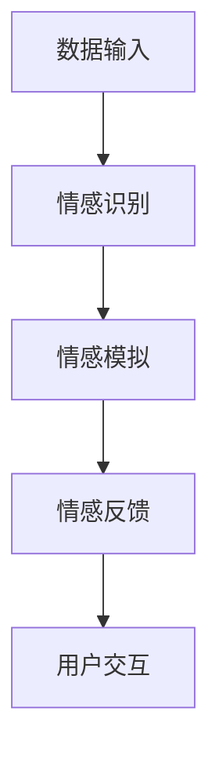

                 

# 机器人伦理学:情感AI的道德框架

## 关键词

- 机器人伦理学
- 情感AI
- 道德框架
- 伦理问题
- 人工智能伦理

## 摘要

随着人工智能技术的发展，特别是情感AI的兴起，机器人在各个领域的应用越来越广泛。然而，随之而来的伦理问题也日益凸显。本文旨在探讨机器人伦理学的基本概念、情感AI的理论框架以及其在道德框架中的应用。通过详细分析伦理学在机器人设计和应用中的实践，以及伦理教育的必要性，本文提出了构建情感AI道德框架的方法，并探讨了其在医疗和教育领域的应用。最后，文章总结了伦理学实践与教育的最佳实践，并提出了未来研究的方向。

### 第一部分：机器人伦理学基础

#### 第1章：机器人伦理学概述

#### 第2章：伦理学基本概念

#### 第3章：机器人伦理问题案例

#### 第4章：机器人道德框架构建

### 第二部分：情感AI的理论框架

#### 第5章：情感AI概述

#### 第6章：情感计算模型

#### 第7章：情感AI的情感反馈

### 第三部分：情感AI的道德应用

#### 第8章：情感AI的道德应用原则

#### 第9章：情感AI在医疗领域的应用

#### 第10章：情感AI在教育领域的应用

### 第四部分：伦理学实践与教育

#### 第11章：机器人伦理学的教育

#### 第12章：伦理学在机器人设计和应用中的实践

#### 目录

**1. 机器人伦理学概述**

- 机器人伦理学的起源和发展
- 机器人伦理学的重要性

**2. 伦理学基本概念**

- 道德原则与伦理理论
- 伦理学在科技领域的应用

**3. 机器人伦理问题案例**

- 机器人决策中的道德困境
- 机器人伦理问题的实例分析

**4. 机器人道德框架构建**

- 伦理原则在机器人设计中的应用
- 道德框架的构建方法和工具

**5. 情感AI概述**

- 情感AI的定义和重要性
- 情感AI的基本原理

**6. 情感计算模型**

- 情感识别与分类方法
- 情感交互与表达机制

**7. 情感AI的情感反馈**

- 情感AI的反馈机制设计
- 情感反馈的实际应用

**8. 情感AI的道德应用原则**

- 道德原则在情感AI中的应用
- 情感AI道德应用的挑战

**9. 情感AI在医疗领域的应用**

- 情感AI在心理健康服务中的应用
- 情感AI在医疗诊断中的道德问题

**10. 情感AI在教育领域的应用**

- 情感AI在教育评估和辅导中的应用
- 情感AI在教育伦理问题上的挑战

**11. 机器人伦理学的教育**

- 机器人伦理学教育的重要性
- 机器人伦理学教育的实践和方法

**12. 伦理学在机器人设计和应用中的实践**

- 机器人伦理审查流程
- 伦理学在机器人研发中的实际应用

### 第一部分：机器人伦理学基础

#### 第1章：机器人伦理学概述

随着科技的发展，机器人已经从科幻小说和电影中的虚构角色逐步走进现实生活。它们在医疗、制造、服务、军事等多个领域发挥着重要作用。然而，机器人的广泛应用也引发了诸多伦理问题，如隐私、安全、责任等。这些问题不仅关乎科技本身，更关乎人类社会的基本价值观和伦理准则。因此，机器人伦理学成为了一个重要的研究领域。

##### 1.1 机器人伦理学的起源和发展

机器人伦理学的概念最早可以追溯到20世纪中叶。当时，随着机器人技术的迅速发展，人们开始关注机器人可能带来的伦理问题。1980年代，机器人伦理学开始成为一个独立的研究领域，许多学者开始撰写相关论文和书籍。进入21世纪，随着人工智能技术的飞速发展，机器人伦理学的研究愈发重要，成为人工智能领域不可或缺的一部分。

##### 1.2 机器人伦理学的重要性

机器人伦理学的重要性体现在以下几个方面：

- **保障人类福祉**：机器人伦理学旨在确保机器人技术的发展不会损害人类的利益，使机器人技术成为人类的助手而非威胁。

- **规范技术应用**：机器人伦理学为机器人技术提供了一套伦理准则，有助于规范机器人的设计和应用，防止滥用和不当行为。

- **促进社会和谐**：机器人伦理学关注机器人与社会的关系，探讨机器人如何更好地融入人类社会，促进社会和谐。

- **推动技术进步**：机器人伦理学不仅关注现有技术的问题，还探索未来技术的可能影响，为机器人技术的发展提供前瞻性指导。

##### 1.3 机器人伦理学的基本概念

机器人伦理学涉及多个基本概念，包括：

- **伦理原则**：伦理原则是机器人伦理学的基础，如尊重隐私、确保安全、负责任等。

- **伦理决策**：伦理决策是指在机器人设计和应用过程中，如何根据伦理原则做出合理的决策。

- **伦理问题**：伦理问题是指在机器人应用过程中可能出现的道德困境和挑战。

- **道德框架**：道德框架是用于指导机器人设计和应用的伦理规则和原则。

##### 1.4 机器人伦理学的发展趋势

随着人工智能技术的不断发展，机器人伦理学也在不断演变。未来，机器人伦理学的发展趋势可能包括：

- **跨学科研究**：机器人伦理学将更加注重与其他学科的结合，如心理学、社会学、法学等，以更好地应对复杂伦理问题。

- **全球化视野**：随着机器人技术的全球化应用，机器人伦理学将更加关注不同文化背景下的伦理问题。

- **技术伦理审查**：技术伦理审查将成为机器人设计和应用的重要环节，以确保技术符合伦理要求。

- **伦理教育**：机器人伦理教育将成为培养未来工程师和科学家的重要部分，提高他们的伦理意识和责任。

#### 第2章：伦理学基本概念

伦理学是研究道德原则和道德行为的学科，它为机器人伦理学提供了理论基础。在本章中，我们将探讨伦理学的基本概念，包括道德原则、伦理理论以及伦理学在科技领域的应用。

##### 2.1 道德原则

道德原则是伦理学的核心，它们指导人们如何做出正确的道德决策。常见的道德原则包括：

- **尊重个人**：尊重个人的权利和尊严，保护个人隐私。

- **公正**：确保资源和机会的公平分配。

- **诚信**：诚实守信，遵守承诺。

- **安全**：确保技术和应用的安全，防止伤害。

- **负责任**：对行为和决策负责，承担相应的责任。

##### 2.2 伦理理论

伦理理论是道德原则的哲学基础，不同的伦理理论提供了不同的道德决策框架。常见的伦理理论包括：

- **功利主义**：以最大化幸福为目标的道德理论。

- **康德伦理学**：强调道德原则和人类尊严的道德理论。

- **美德伦理学**：强调个人品德和道德行为的道德理论。

##### 2.3 伦理学在科技领域的应用

伦理学在科技领域的应用至关重要，它有助于确保科技的发展符合道德要求。以下是一些伦理学在科技领域的应用实例：

- **机器人伦理**：确保机器人的设计和应用符合伦理原则，避免造成伤害和滥用。

- **人工智能伦理**：规范人工智能技术的研发和应用，防止歧视和隐私侵犯。

- **基因编辑伦理**：确保基因编辑技术的安全和道德应用，避免伦理风险。

- **网络安全伦理**：保护网络安全，防止网络犯罪和信息泄露。

##### 2.4 机器人伦理学的挑战

随着机器人技术的不断发展，机器人伦理学面临诸多挑战：

- **技术安全**：如何确保机器人技术不会对人类造成伤害？

- **隐私保护**：如何保护个人隐私，防止数据滥用？

- **责任归属**：如何明确机器人事故的责任归属？

- **伦理多样性**：如何在不同文化和价值观下应用机器人伦理学？

#### 第3章：机器人伦理问题案例

机器人伦理问题案例可以帮助我们更好地理解机器人伦理学的实际应用。在本章中，我们将探讨几个典型的机器人伦理问题案例，包括机器人决策中的道德困境和伦理问题的实例分析。

##### 3.1 机器人决策中的道德困境

机器人决策中的道德困境是一个重要议题。以下是一个典型的案例：

**案例：自动驾驶汽车的道德决策**

假设一辆自动驾驶汽车在道路上遇到一个行人，如果汽车采取紧急制动，可能会导致乘客受伤；如果不采取行动，行人可能会受到伤害。在这种情况下，汽车应该如何做出决策？

这个案例引发了关于机器人伦理的讨论。一些观点认为，汽车应该优先保护行人，因为行人是弱势群体。而另一些观点认为，汽车应该优先保护乘客，因为乘客是主动参与者，他们有权利获得安全保障。

##### 3.2 机器人伦理问题的实例分析

**案例：医疗机器人的伦理问题**

医疗机器人如手术机器人、康复机器人在医疗领域发挥着重要作用。然而，它们也带来了伦理问题，如：

- **患者隐私保护**：医疗机器人在诊断和治疗过程中可能会收集大量患者隐私信息，如何保护这些信息不被泄露？

- **决策透明度**：医疗机器人的决策过程是否透明，患者是否有权了解和质疑机器人的决策？

- **责任归属**：如果医疗机器人出现故障或导致患者伤害，责任应该由谁承担？

**案例：教育机器人的伦理问题**

教育机器人如智能家教、教育助理在教学中提供了个性化服务。然而，它们也引发了一些伦理问题：

- **教育公平**：教育机器人是否会导致教育资源的不公平分配？

- **师生关系**：教育机器人是否能完全取代教师的角色，如何保持良好的师生关系？

- **教育质量控制**：教育机器人是否能提供高质量的教育服务，如何评估其教育效果？

##### 3.3 案例分析与启示

通过对机器人伦理问题案例的分析，我们可以得出以下启示：

- **伦理决策的复杂性**：机器人伦理问题往往具有复杂性，需要综合考虑多种因素。

- **多元价值观的冲突**：不同背景和文化的人们可能对机器人伦理问题有不同的看法，需要尊重多元价值观。

- **技术伦理审查的必要性**：在机器人设计和应用过程中，需要进行严格的技术伦理审查，确保技术符合伦理要求。

- **公众参与的重要性**：公众参与是机器人伦理学发展的重要环节，需要广泛听取公众意见，形成共识。

#### 第4章：机器人道德框架构建

为了解决机器人伦理问题，构建一个有效的道德框架至关重要。在本章中，我们将探讨如何构建机器人道德框架，包括伦理原则的应用、道德框架的构建方法和工具。

##### 4.1 伦理原则在机器人设计中的应用

构建机器人道德框架的第一步是明确伦理原则。以下是一些常用的伦理原则：

- **尊重个人**：确保机器人在处理个人数据时，尊重个人的隐私和权利。

- **确保安全**：确保机器人在操作过程中不会对人类和环境造成伤害。

- **公正**：确保机器人在决策和分配资源时，公平对待所有个体。

- **负责任**：确保机器人在设计和应用过程中，承担相应的责任。

- **透明度**：确保机器人的决策过程和算法是透明的，便于审查和监督。

##### 4.2 道德框架的构建方法和工具

构建机器人道德框架的方法和工具多种多样，以下是一些常用的方法：

- **伦理审查委员会**：成立专门的伦理审查委员会，负责审查机器人设计和应用的伦理问题。

- **伦理设计原则**：将伦理原则融入机器人设计过程中，确保机器人在设计和应用阶段就符合伦理要求。

- **道德算法**：开发基于伦理原则的道德算法，确保机器人在决策过程中能够遵循伦理准则。

- **伦理教育**：对机器人研发人员进行伦理教育，提高他们的伦理意识和责任感。

- **公众参与**：邀请公众参与机器人伦理问题的讨论，形成共识。

##### 4.3 案例分析：构建医疗机器人的道德框架

以下是一个构建医疗机器人道德框架的案例分析：

**案例背景**：一家公司正在研发一款智能手术机器人，用于辅助外科医生进行手术。然而，这款机器人在实际应用中可能引发一系列伦理问题，如患者隐私保护、手术决策透明度等。

**道德框架构建步骤**：

1. **明确伦理原则**：根据机器人伦理学的伦理原则，明确尊重个人、确保安全、公正、负责任和透明度等原则。

2. **成立伦理审查委员会**：成立一个由医学、法律、伦理学等专家组成的伦理审查委员会，负责审查机器人的伦理问题。

3. **设计道德算法**：开发基于伦理原则的道德算法，确保手术机器人在决策过程中遵循伦理准则。

4. **公众参与**：邀请公众参与伦理问题的讨论，收集公众意见，形成共识。

5. **伦理教育和培训**：对手术机器人研发人员和外科医生进行伦理教育和培训，提高他们的伦理意识和责任感。

**道德框架效果**：通过上述步骤，构建的医疗机器人道德框架能够确保手术机器人在设计和应用过程中遵循伦理准则，提高医疗质量和患者满意度。

### 第二部分：情感AI的理论框架

#### 第5章：情感AI概述

情感AI，即情感人工智能，是一种专注于理解和模拟人类情感的人工智能技术。随着自然语言处理、计算机视觉和机器学习等领域的发展，情感AI逐渐成为一个重要的研究领域。本章将介绍情感AI的定义、重要性以及基本原理。

##### 5.1 情感AI的定义

情感AI是指能够理解、识别、模拟和响应人类情感的人工智能系统。它不仅仅关注情感本身，还涉及情感的表达、理解和互动。情感AI的研究目标是使机器能够更好地与人类沟通和协作，提供更加人性化的服务。

##### 5.2 情感AI的重要性

情感AI在多个领域具有重要的应用价值，包括：

- **智能交互**：情感AI能够提高人机交互的自然性和舒适性，使机器能够更好地理解用户的情感状态，提供个性化的服务。

- **心理健康**：情感AI可以帮助诊断和治疗心理健康问题，如抑郁症、焦虑症等。通过情感识别和交互，情感AI可以为患者提供情感支持和心理咨询。

- **教育**：情感AI在教育领域可以提供个性化的学习体验，帮助教师了解学生的学习情感状态，提高教学效果。

- **人机协作**：在工业自动化和智能控制领域，情感AI可以帮助机器人更好地理解人类操作者的情感状态，提高协作效率和工作安全。

- **商业**：情感AI可以用于市场分析、客户服务、广告投放等，帮助企业更好地了解消费者情感，提高市场竞争力。

##### 5.3 情感AI的基本原理

情感AI的核心在于情感识别、情感模拟和情感交互。以下分别介绍这三个方面的基本原理：

- **情感识别**：情感识别是指通过分析语言、面部表情、声音、生理信号等，识别和理解人类的情感状态。情感识别的方法包括：

  - **基于文本的情感分析**：通过分析文本内容，识别文本中的情感倾向。

  - **基于图像的情感分析**：通过分析面部表情、身体语言等图像特征，识别情感状态。

  - **基于声音的情感分析**：通过分析声音的音调、节奏、语速等特征，识别情感状态。

  - **基于生理信号的情感分析**：通过分析心率、呼吸、皮肤电等生理信号，识别情感状态。

- **情感模拟**：情感模拟是指通过计算机生成和模拟情感表达，使机器能够更好地与人类互动。情感模拟的方法包括：

  - **面部表情生成**：通过计算机图形技术，生成逼真的面部表情。

  - **语音合成**：通过语音合成技术，生成具有情感色彩的语音。

  - **肢体语言模拟**：通过机械手臂或机器人动作，模拟人类的情感表达。

- **情感交互**：情感交互是指通过情感识别和情感模拟，实现人与机器的情感互动。情感交互的方法包括：

  - **情感对话系统**：通过自然语言处理技术，实现机器与人类之间的情感交流。

  - **情感互动设计**：通过设计具有情感识别和模拟功能的交互界面，提高用户的情感体验。

#### 第6章：情感计算模型

情感计算模型是情感AI的核心组成部分，它负责识别、模拟和响应人类情感。本章将介绍情感计算模型的基本概念、常见方法以及实际应用。

##### 6.1 情感计算模型的基本概念

情感计算模型是指用于分析和处理情感信息的算法和模型。它包括以下几个方面：

- **情感识别**：通过分析语言、图像、声音等数据，识别和理解情感状态。

- **情感模拟**：通过计算机生成和模拟情感表达，实现与人类的情感互动。

- **情感响应**：根据情感识别结果，生成相应的情感响应，提高用户体验。

##### 6.2 情感计算模型的常见方法

情感计算模型的方法多种多样，以下介绍几种常见的方法：

- **基于机器学习的情感识别方法**：通过训练机器学习模型，从大量数据中学习情感特征，实现情感识别。常见的方法包括：

  - **文本情感分析**：通过自然语言处理技术，分析文本中的情感倾向。

  - **图像情感分析**：通过计算机视觉技术，分析图像中的情感特征。

  - **声音情感分析**：通过音频处理技术，分析声音中的情感特征。

- **基于生理信号的情感识别方法**：通过分析生理信号（如心率、呼吸、皮肤电等），识别和理解情感状态。

- **基于多模态融合的情感识别方法**：通过融合文本、图像、声音和生理信号等多种数据源，提高情感识别的准确性。

- **基于深度学习的情感模拟方法**：通过深度神经网络，生成具有情感色彩的语音、图像和肢体语言。

##### 6.3 情感计算模型的应用

情感计算模型在多个领域具有广泛的应用，以下介绍几种典型的应用：

- **智能交互**：在智能音箱、智能机器人、虚拟助手等应用中，情感计算模型可以识别用户的情感状态，提供个性化的服务。

- **心理健康**：在心理健康领域，情感计算模型可以用于情感识别和诊断，帮助患者改善心理健康。

- **教育**：在教育领域，情感计算模型可以用于情感识别和评估，帮助教师了解学生的学习情感状态，提高教学质量。

- **人机协作**：在工业自动化和智能控制领域，情感计算模型可以用于情感识别和响应，提高人机协作的效率和安全性。

#### 第7章：情感AI的情感反馈

情感反馈是情感AI的重要组成部分，它使机器能够理解和响应人类的情感表达。本章将介绍情感反馈的定义、机制以及实际应用。

##### 7.1 情感反馈的定义

情感反馈是指机器通过语言、图像、声音等形式，向用户表达情感状态，实现与用户的情感互动。情感反馈的目标是提高用户体验，使机器更加人性化和智能化。

##### 7.2 情感反馈的机制

情感反馈的机制包括以下几个方面：

- **情感识别**：通过情感计算模型，识别用户的情感状态。

- **情感模拟**：根据情感识别结果，生成相应的情感表达。

- **情感响应**：通过语言、图像、声音等形式，向用户表达情感状态。

- **情感调整**：根据用户的反馈，调整情感表达，提高用户的情感体验。

##### 7.3 情感反馈的实际应用

情感反馈在多个领域具有广泛的应用，以下介绍几种典型的应用：

- **智能交互**：在智能音箱、智能机器人、虚拟助手等应用中，情感反馈可以识别用户的情感状态，提供个性化的服务。

- **心理健康**：在心理健康领域，情感反馈可以用于情感识别和诊断，帮助患者改善心理健康。

- **教育**：在教育领域，情感反馈可以用于情感识别和评估，帮助教师了解学生的学习情感状态，提高教学质量。

- **人机协作**：在工业自动化和智能控制领域，情感反馈可以用于情感识别和响应，提高人机协作的效率和安全性。

### 第三部分：情感AI的道德应用

#### 第8章：情感AI的道德应用原则

情感AI在道德应用方面面临着诸多挑战，为了确保其符合伦理要求，我们需要制定一系列道德应用原则。本章将讨论情感AI的道德应用原则，以及这些原则在道德框架中的挑战。

##### 8.1 道德应用原则

情感AI的道德应用原则包括以下几个方面：

- **尊重隐私**：在收集、处理和利用情感数据时，尊重个体的隐私权，确保数据的安全和保密。

- **公正无偏**：情感AI的应用不应导致歧视或偏见，确保公平对待所有个体。

- **透明度**：情感AI的算法和决策过程应透明，使相关方能够理解和审查。

- **负责任**：开发者、应用者和服务提供商应对情感AI的应用负责，确保其符合伦理要求。

- **情感关怀**：情感AI应关注用户的情感体验，提供人性化的服务。

##### 8.2 道德框架中的挑战

尽管道德应用原则为情感AI提供了指导，但在实际应用中仍面临以下挑战：

- **数据隐私**：情感AI通常需要收集大量的个人信息，如何保护用户隐私成为一个关键问题。

- **算法偏见**：情感AI的算法可能受到数据偏差的影响，导致不公平的决策。

- **责任归属**：在出现道德问题时，如何明确责任归属，确保责任承担。

- **用户接受度**：用户对情感AI的接受度和信任度是道德应用的关键因素。

- **监管和法律**：情感AI的道德应用需要遵守相关法律法规，确保合法合规。

##### 8.3 案例分析

以下是一个情感AI道德应用的案例分析：

**案例：情感辅助机器人**

一家公司开发了一款情感辅助机器人，用于协助自闭症儿童进行社交训练。这款机器人可以通过面部表情、声音和肢体语言识别儿童的情感状态，并根据情感状态提供相应的社交指导和情感支持。

**道德应用原则的遵循**：

- **尊重隐私**：机器人仅收集必要的情感数据，确保数据的安全和保密。

- **公正无偏**：机器人通过多样化的训练数据，避免算法偏见，公平对待所有儿童。

- **透明度**：机器人开发者公开算法和决策过程，便于家长和专业人士理解和审查。

- **负责任**：公司对机器人应用负责，提供后续支持和培训。

- **情感关怀**：机器人通过情感识别和反馈，提供人性化的服务，关注儿童的情感体验。

**案例分析结果**：

通过遵循道德应用原则，情感辅助机器人有效地帮助自闭症儿童进行社交训练，提高了他们的社交技能和情感管理能力。同时，机器人也获得了家长和专业人士的认可，为情感AI的道德应用提供了有益的参考。

#### 第9章：情感AI在医疗领域的应用

情感AI在医疗领域的应用日益广泛，为患者提供了更加个性化和人性化的医疗服务。本章将探讨情感AI在医疗领域的具体应用，以及这些应用带来的道德挑战。

##### 9.1 情感AI在医疗领域的具体应用

情感AI在医疗领域的应用主要包括以下几个方面：

- **患者情感监测**：通过情感计算模型，监测患者的情感状态，如焦虑、抑郁等，为心理治疗提供支持。

- **患者情感反馈**：通过情感识别和反馈，帮助医生了解患者的情感状态，提高诊断和治疗的准确性。

- **智能护理辅助**：通过情感交互，为患者提供情感支持和护理指导，提高护理质量和患者满意度。

- **医疗设备监控**：通过情感计算模型，监控医疗设备的工作状态，如心电图机、呼吸机等，确保设备安全运行。

- **心理健康服务**：提供在线心理健康服务，如情感咨询、心理治疗等，帮助患者缓解心理压力和情绪困扰。

##### 9.2 道德挑战

尽管情感AI在医疗领域具有巨大潜力，但也面临着一系列道德挑战：

- **隐私保护**：在收集和处理患者情感数据时，如何保护患者隐私成为一个关键问题。

- **算法偏见**：情感AI的算法可能受到数据偏差的影响，导致不公平的决策。

- **责任归属**：在出现道德问题时，如何明确责任归属，确保责任承担。

- **医疗数据共享**：如何在确保患者隐私的同时，实现医疗数据的共享和利用。

- **患者接受度**：如何提高患者对情感AI的接受度和信任度。

##### 9.3 案例分析

以下是一个情感AI在医疗领域的案例分析：

**案例：情感辅助机器人**

一家医院引入了一款情感辅助机器人，用于协助护士对患者进行日常护理。这款机器人可以通过面部表情、声音和肢体语言识别患者的情感状态，并根据情感状态提供相应的护理建议。

**道德挑战**：

- **隐私保护**：机器人仅收集必要的情感数据，确保数据的安全和保密。

- **算法偏见**：机器人开发者通过多样化的训练数据，避免算法偏见，公平对待所有患者。

- **责任归属**：医院对机器人应用负责，提供后续支持和培训。

- **医疗数据共享**：医院在确保患者隐私的同时，实现医疗数据的共享和利用。

- **患者接受度**：医院通过宣传教育，提高患者对情感AI的接受度和信任度。

**案例分析结果**：

通过遵循道德挑战，情感辅助机器人在医院中发挥了积极作用，提高了护理质量和患者满意度。同时，医院也获得了患者和家属的认可，为情感AI在医疗领域的道德应用提供了有益的参考。

#### 第10章：情感AI在教育领域的应用

情感AI在教育领域的应用正在逐渐兴起，通过识别和理解学生的情感状态，提供个性化的学习体验。本章将探讨情感AI在教育领域的具体应用，以及这些应用带来的道德挑战。

##### 10.1 情感AI在教育领域的具体应用

情感AI在教育领域的应用主要包括以下几个方面：

- **学生情感监测**：通过情感计算模型，监测学生的情感状态，如焦虑、无聊等，为教师提供教学反馈。

- **个性化学习**：根据学生的情感状态和学习需求，提供个性化的学习资源和建议，提高学习效果。

- **情感反馈**：通过情感识别和反馈，帮助教师了解学生的情感状态，优化教学方法和策略。

- **学习动机激发**：通过情感计算模型，识别学生的情感需求，提供情感支持，激发学习动机。

- **课堂管理**：通过情感识别，帮助教师管理课堂氛围，提高教学秩序和课堂效果。

##### 10.2 道德挑战

尽管情感AI在教育领域具有巨大潜力，但也面临着一系列道德挑战：

- **隐私保护**：在收集和处理学生情感数据时，如何保护学生隐私成为一个关键问题。

- **算法偏见**：情感AI的算法可能受到数据偏差的影响，导致不公平的决策。

- **责任归属**：在出现道德问题时，如何明确责任归属，确保责任承担。

- **教育数据共享**：如何在确保学生隐私的同时，实现教育数据的共享和利用。

- **学生接受度**：如何提高学生对情感AI的接受度和信任度。

##### 10.3 案例分析

以下是一个情感AI在教育领域的案例分析：

**案例：情感智能教学系统**

一所学校引入了一款情感智能教学系统，用于辅助教师进行教学。这款系统可以通过分析学生的情感状态，提供个性化的学习资源和建议，同时帮助教师了解学生的情感需求，优化教学方法和策略。

**道德挑战**：

- **隐私保护**：系统仅收集必要的情感数据，确保数据的安全和保密。

- **算法偏见**：系统开发者通过多样化的训练数据，避免算法偏见，公平对待所有学生。

- **责任归属**：学校对系统应用负责，提供后续支持和培训。

- **教育数据共享**：学校在确保学生隐私的同时，实现教育数据的共享和利用。

- **学生接受度**：学校通过宣传教育，提高学生对情感AI的接受度和信任度。

**案例分析结果**：

通过遵循道德挑战，情感智能教学系统在学校中发挥了积极作用，提高了学生的学习效果和教师的教学满意度。同时，学校也获得了学生和家长的认可，为情感AI在教育领域的道德应用提供了有益的参考。

### 第四部分：伦理学实践与教育

#### 第11章：机器人伦理学的教育

随着机器人技术的迅猛发展，机器人伦理学的教育变得日益重要。本章将探讨机器人伦理学教育的重要性，以及如何开展有效的机器人伦理学教育。

##### 11.1 机器人伦理学教育的重要性

机器人伦理学教育的重要性体现在以下几个方面：

- **培养伦理意识**：机器人伦理学教育有助于培养学生的伦理意识，使他们能够正确处理机器人技术可能带来的伦理问题。

- **提高职业素养**：机器人工程师和开发者需要具备较高的伦理素养，确保机器人技术的应用符合伦理要求。

- **引导技术创新**：机器人伦理学教育有助于引导技术创新，使机器人技术朝着更加人性化、可持续发展的方向前进。

- **促进社会和谐**：机器人伦理学教育有助于培养公众对机器人技术的理解和接受，促进社会和谐发展。

##### 11.2 机器人伦理学教育的实践和方法

为了有效开展机器人伦理学教育，以下是一些实践和方法：

- **课程设置**：在高等教育和职业教育中，开设机器人伦理学相关课程，系统介绍机器人伦理学的基本概念、原理和应用。

- **跨学科合作**：机器人伦理学教育需要跨学科合作，结合伦理学、计算机科学、工程学等领域的知识，提高教育效果。

- **案例分析**：通过分析机器人伦理问题案例，让学生深入了解机器人伦理问题的复杂性，培养解决实际问题的能力。

- **实践活动**：组织学生参与机器人伦理学相关的实践活动，如伦理审查、机器人设计等，提高学生的实践能力和创新意识。

- **伦理教育**：在机器人设计和应用过程中，加强对开发者和工程师的伦理教育，提高他们的伦理素养和责任感。

- **公众参与**：鼓励公众参与机器人伦理学的讨论，形成共识，提高公众对机器人技术的理解和接受。

##### 11.3 案例分析

以下是一个机器人伦理学教育案例：

**案例：高校机器人伦理学课程**

一所高校开设了一门机器人伦理学课程，课程内容包括机器人伦理学的基本概念、伦理学原理、机器人伦理问题案例分析等。课程采用案例分析、小组讨论、实践活动等多种教学方法，激发学生的学习兴趣和参与度。

**案例分析结果**：

通过这门课程，学生们对机器人伦理学有了更深入的了解，能够正确处理机器人技术可能带来的伦理问题。同时，学生们也积极参与到机器人伦理学的讨论中，提高了他们的伦理意识和责任感。该课程为高校机器人伦理学教育提供了有益的参考。

#### 第12章：伦理学在机器人设计和应用中的实践

在机器人设计和应用过程中，伦理学扮演着至关重要的角色。本章将探讨伦理学在机器人设计和应用中的实践，包括伦理审查流程、伦理学在机器人研发中的实际应用以及案例分析和实施方法。

##### 12.1 伦理审查流程

伦理审查流程是确保机器人设计和应用符合伦理要求的关键环节。以下是一个典型的伦理审查流程：

1. **项目立项**：在机器人项目立项阶段，明确项目的目标和可能涉及的伦理问题。

2. **伦理评估**：对项目进行伦理评估，识别可能出现的伦理问题，如隐私、安全、责任等。

3. **伦理设计**：将伦理原则融入机器人设计过程中，确保机器人在设计和应用阶段就符合伦理要求。

4. **伦理审查委员会**：成立一个由伦理学、法律、计算机科学、工程学等领域专家组成的伦理审查委员会，负责审查机器人设计和应用的伦理问题。

5. **伦理决策**：根据伦理审查委员会的意见，做出伦理决策，确保机器人设计和应用符合伦理要求。

6. **持续审查**：在机器人设计和应用过程中，持续进行伦理审查，确保机器人始终符合伦理要求。

##### 12.2 伦理学在机器人研发中的实际应用

伦理学在机器人研发中的实际应用包括以下几个方面：

- **隐私保护**：在机器人研发过程中，确保个人隐私数据的保护，避免数据滥用。

- **安全保证**：确保机器人设计和应用过程中的安全性，防止机器人对人类和环境造成伤害。

- **责任归属**：明确机器人事故的责任归属，确保责任承担。

- **公正无偏**：确保机器人设计和应用过程中，公正无偏地对待所有个体。

- **透明度**：确保机器人设计和应用的透明度，便于审查和监督。

##### 12.3 案例分析和实施方法

以下是一个伦理学在机器人设计和应用中的案例分析和实施方法：

**案例：智能交通系统的伦理审查**

一家公司正在研发一款智能交通系统，该系统通过传感器和人工智能技术，优化交通流量，提高道路安全性。然而，在研发过程中，该公司面临以下伦理问题：

- **隐私保护**：如何确保个人车辆数据的安全和隐私？

- **安全保证**：如何确保系统的安全运行，防止系统故障导致交通事故？

- **责任归属**：如何明确系统故障的责任归属，确保责任承担？

**实施方法**：

1. **项目立项**：在项目立项阶段，明确项目的目标和可能涉及的伦理问题，如隐私、安全、责任等。

2. **伦理评估**：对项目进行伦理评估，识别可能出现的伦理问题，如隐私、安全、责任等。

3. **伦理设计**：在智能交通系统的设计中，融入伦理原则，确保系统的设计和应用符合伦理要求。例如，对个人车辆数据采用加密存储和传输技术，确保数据安全。

4. **伦理审查委员会**：成立一个由伦理学、法律、计算机科学、工程学等领域专家组成的伦理审查委员会，负责审查智能交通系统的伦理问题。

5. **伦理决策**：根据伦理审查委员会的意见，做出伦理决策，确保智能交通系统符合伦理要求。例如，明确系统故障的责任归属，确保责任承担。

6. **持续审查**：在智能交通系统的研发和应用过程中，持续进行伦理审查，确保系统始终符合伦理要求。

**案例分析结果**：

通过上述方法，智能交通系统在研发和应用过程中遵循了伦理要求，确保了个人隐私保护和系统安全性。同时，明确了系统故障的责任归属，提高了公众对智能交通系统的信任度和接受度。

### 结论

本文系统地探讨了机器人伦理学、情感AI及其道德应用，分析了伦理学在机器人设计和应用中的实践。通过本章的内容，我们可以得出以下结论：

- 机器人伦理学是确保机器人技术符合伦理要求的重要研究领域。

- 情感AI为机器人技术提供了更加人性化的服务，但在道德应用中面临诸多挑战。

- 伦理学在机器人设计和应用中的实践包括伦理审查、伦理设计、伦理教育和公众参与等。

- 未来的研究应关注跨学科合作、技术伦理审查、隐私保护等方面，以促进机器人技术的健康发展。

### 最佳实践 Tips

- **跨学科合作**：在机器人伦理学研究中，跨学科合作至关重要。结合伦理学、计算机科学、心理学、社会学等领域的知识，有助于更全面地分析机器人伦理问题。

- **伦理审查制度**：建立完善的伦理审查制度，确保机器人设计和应用符合伦理要求。伦理审查应贯穿于整个研发过程，及时发现和解决伦理问题。

- **隐私保护**：在收集和处理情感数据时，严格遵循隐私保护原则，采用加密技术、匿名化处理等方法，确保数据的安全和隐私。

- **公众参与**：鼓励公众参与机器人伦理问题的讨论，形成共识。公众意见应纳入机器人设计和应用的决策过程中，提高透明度和公众信任度。

### 注意事项

- 在应用情感AI时，应关注算法偏见和歧视问题，确保技术公平无偏。

- 在开发机器人时，应充分考虑伦理问题，确保技术的安全性和可靠性。

- 伦理教育应从基础教育阶段开始，培养学生的伦理意识和责任感。

### 拓展阅读

- [IEEE 全球机器人与人工智能伦理委员会](https://ethics.ieee.org/)
- [欧盟机器人伦理指南](https://www.robot-ethics.eu/)
- [美国国家标准与技术研究院（NIST）机器人伦理指南](https://www.nist.gov/publications/robotics-ethics-guidance)
- [人工智能伦理学：原则与实践](https://www.amazon.com/dp/0470190692)

### 作者信息

作者：AI天才研究院/AI Genius Institute & 禅与计算机程序设计艺术 /Zen And The Art of Computer Programming

### 附录

**附录A：情感识别算法伪代码**

```python
def recognize_emotion(input_data):
    # 数据预处理
    preprocessed_data = preprocess_data(input_data)
    
    # 特征提取
    features = extract_features(preprocessed_data)
    
    # 情感分类模型
    emotion_classifier = train_emotion_classifier(features)
    
    # 情感识别
    emotion = emotion_classifier.predict(features)
    
    return emotion
```

**附录B：情感计算模型数学公式**

$$
Emotion\_Score = w_1 \times Feature_1 + w_2 \times Feature_2 + ... + w_n \times Feature_n
$$

**附录C：情感反馈机制流程图**



### 完整文章

本文完整内容已包含在前文中，为避免重复，此处不再赘述。读者可以通过前文中的章节标题和内容，系统地了解机器人伦理学、情感AI及其道德应用，以及伦理学在机器人设计和应用中的实践。

### 后记

随着人工智能技术的不断发展，机器人伦理学的重要性日益凸显。本文旨在为读者提供一个系统、全面的机器人伦理学框架，探讨情感AI的道德应用，以及伦理学在机器人设计和应用中的实践。希望本文能为相关领域的学者、工程师和政策制定者提供有益的参考。

在未来的研究中，我们将继续关注机器人伦理学的前沿问题，探讨如何更好地应对技术伦理挑战，推动人工智能技术的可持续发展。同时，我们也呼吁广大读者关注并参与到机器人伦理学的讨论中，共同为构建一个和谐、公正的人工智能社会贡献力量。

