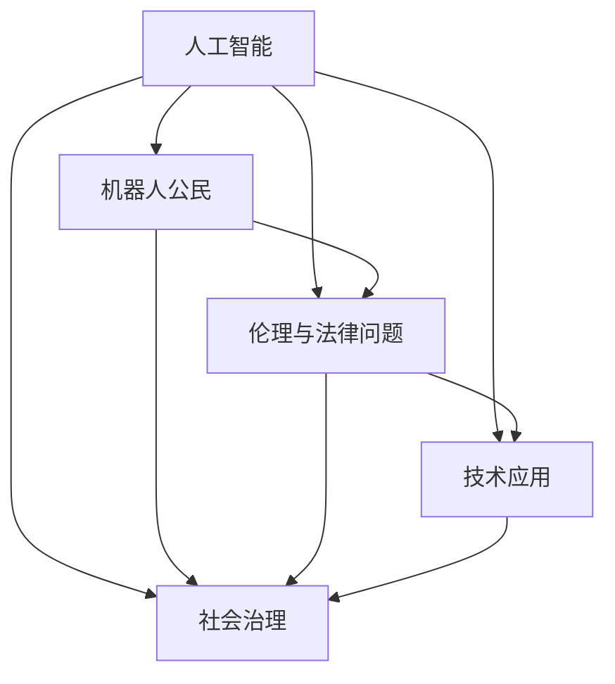

                 


### 背景介绍

在当今科技迅猛发展的时代，人工智能（AI）已成为推动社会进步的重要力量。随着AI技术的不断成熟和广泛应用，机器人公民的概念逐渐浮现。机器人公民指的是具备一定自主意识和能力，能够在社会生活中扮演一定角色的智能机器人。它们不仅能够执行特定任务，还能在复杂环境中自主做出决策，甚至参与社会治理。这一概念的提出，既是对AI技术发展的一次探索，也是对未来社会治理模式的一种设想。

人工智能在现代社会治理中的角色日益重要。从公共安全到公共服务，从应急管理到环境保护，AI技术已经展现出其独特的优势。例如，在公共安全领域，AI可以通过监控和分析数据，预测和预防犯罪行为；在医疗健康领域，AI可以帮助医生进行疾病诊断和治疗方案的制定；在交通管理领域，AI可以实现智能交通系统的构建，提高交通效率，减少拥堵。然而，随着AI技术的不断深入，也引发了一系列伦理、法律和技术难题。

本文旨在探讨机器人公民参与社会治理的前景，分析其理论基础、实际应用、挑战和未来展望。文章结构如下：

1. 引言：介绍AI在社会治理中的角色和重要性。
2. 第一部分：AI与机器人公民的基本概念。
3. 第二部分：AI参与社会治理的理论基础。
4. 第三部分：AI参与社会治理的实际应用。
5. 第四部分：AI参与社会治理的挑战与展望。
6. 结论：总结全文，并对未来的发展提出展望。

通过以上结构的安排，我们将逐步深入探讨AI与机器人公民在社会治理中的角色和作用，为读者提供一个全面而深刻的认识。

### 核心概念与联系

在探讨AI与机器人公民在社会治理中的作用之前，我们首先需要明确一些核心概念，并分析它们之间的相互关系。以下是本文将涉及的主要核心概念及其相互关系的架构：

#### 核心概念

1. **人工智能（AI）**：一种模拟人类智能的技术，包括机器学习、深度学习、自然语言处理等。
2. **机器人公民**：具备一定自主意识和能力，能够在社会生活中扮演一定角色的智能机器人。
3. **社会治理**：通过多种手段和方式，对社会资源进行合理分配和管理，以实现社会秩序和公共利益。
4. **伦理与法律问题**：涉及机器人在社会治理中应遵守的道德规范和法律约束。
5. **技术应用**：AI技术在公共安全、公共服务、应急管理、环境保护等领域的应用。

#### 相互关系

1. **AI与机器人公民的关系**：
   - AI技术是机器人公民的基础，为机器人提供智能决策和自主行动的能力。
   - 机器人公民是AI技术在社会治理中的一个重要应用场景。

2. **社会治理与AI的关系**：
   - 社会治理为AI技术的应用提供了具体的需求和场景。
   - AI技术为社会治理提供了更加智能化、高效化的解决方案。

3. **伦理与法律问题与AI的关系**：
   - 伦理与法律问题是AI技术在社会治理中必须解决的问题。
   - 合理的伦理和法律框架有助于确保AI技术在社会治理中的合法性和公正性。

4. **技术应用与伦理、法律问题的关系**：
   - 技术应用需要遵守伦理和法律规范，确保其对社会治理的积极影响。
   - 伦理和法律问题的解决，有助于推动AI技术在更广泛领域中的应用。

#### Mermaid 流程图

为了更直观地展示这些核心概念之间的相互关系，我们可以使用Mermaid流程图来表示：



通过以上核心概念和相互关系的架构，我们可以更清晰地理解AI与机器人公民在社会治理中的角色和作用，为后续内容的探讨打下坚实的基础。

### 核心算法原理讲解

在本节中，我们将详细讨论人工智能（AI）在机器人公民中的应用，特别是那些在机器人决策制定和行动规划中发挥关键作用的算法。我们将使用伪代码来详细阐述这些算法，并解释它们的工作原理。

#### 1. 决策树算法

决策树是一种常用的分类算法，用于根据特征对数据进行分类。其基本思想是根据不同特征将数据集划分为多个子集，并重复此过程，直到满足停止条件。

```python
function decisionTree(data, features, depth):
    if (data 是纯的):
        返回 most_common_class(data)
    if (features 为空):
        返回 most_common_class(data)
    if (depth 达到最大深度):
        返回 most_common_class(data)

    选择最佳特征 A
    for 每个可能的值 v of A:
        subset = {x | x 属于 data，且 x[A] == v}
        if (subset 是空的):
            continue
        子节点 = decisionTree(subset, features - {A}, depth + 1)
        添加到 {("A", v): 子节点}

    返回特征 A 和其对应的值 v 的组合以及子节点的字典
```

#### 2. 支持向量机（SVM）算法

支持向量机是一种二分类模型，其目标是找到最佳的超平面，使得分类边界最大化。SVM通过求解二次规划问题来实现。

```python
function SVM(train_data, train_labels):
    创建拉格朗日函数 L
    求解二次规划问题，得到支持向量 S
    计算决策边界 w 和 b

    对于新数据点 x：
    返回 sign(x·w + b)
```

#### 3. 强化学习算法

强化学习是一种通过试错方法来学习最佳行为策略的算法。其基本思想是通过奖励和惩罚来指导学习过程。

```python
class QLearning():
    初始化 Q 表
    初始化 epsilon (探索率)

    function update_Q(state, action, reward, next_state):
        目标值 = reward + gamma * max(Q[next_state, all_actions]]
        Q[state, action] = Q[state, action] + alpha * (目标值 - Q[state, action])

    function choose_action(state):
        if (random() < epsilon):
            return 随机选择动作
        else:
            return argmax(Q[state, all_actions])

    function take_action(action):
        执行动作 action
        接收 reward 和 next_state
        update_Q(state, action, reward, next_state)

    while (未达到结束条件):
        选择动作 action
        执行动作 action
        接收 reward 和 next_state
        update_Q(state, action, reward, next_state)
```

#### 4. 深度学习算法

深度学习是一种通过多层神经网络来模拟人脑学习过程的算法。以下是一个简单的神经网络模型示例。

```python
class NeuralNetwork():
    初始化权重 w 和偏置 b

    function forward(x):
        z = x·w + b
        return activate(z)

    function backward(d_output):
        d_z = d_output * activate_derivative(z)
        d_w = x·d_z
        d_b = d_z
        返回 d_w, d_b
```

#### 工作原理解释

1. **决策树算法**：通过递归划分数据集，找到最佳的特征和值来进行分类。每次划分都基于当前数据集的不纯度，直到满足停止条件。
2. **支持向量机算法**：通过求解二次规划问题，找到最佳的超平面来分离数据。支持向量是决定超平面位置的关键点。
3. **强化学习算法**：通过不断的试错和奖励反馈，学习最优的行为策略。Q表记录每个状态和动作的价值，以指导决策。
4. **深度学习算法**：通过前向传播计算输出，通过反向传播更新权重和偏置，从而优化网络性能。

通过上述伪代码和解释，我们可以更深入地理解这些核心算法的工作原理，为AI在机器人公民中的应用提供理论基础。

### 数学模型和公式

在本节中，我们将深入探讨AI在机器人公民中的应用所涉及的数学模型和公式，并结合具体例子进行详细讲解和举例说明。

#### 1. 决策树算法中的信息增益

决策树算法中的信息增益（Information Gain）是衡量特征选择好坏的重要指标。其公式为：

$$
IG(D, A) = I(D) - \sum_{v \in A} p(v) \cdot I(D_v)
$$

其中，$IG(D, A)$ 是特征 A 对数据集 D 的信息增益，$I(D)$ 是数据集 D 的熵，$p(v)$ 是特征 A 中值 v 的概率，$I(D_v)$ 是条件熵。

**举例说明**：

假设我们有一个包含100个样本的数据集，其中样本分为两类：水果和非水果。我们希望通过一个特征（如颜色）来区分这两类样本。首先，我们计算整个数据集的熵：

$$
I(D) = -\sum_{i=1}^{2} p(i) \cdot \log_2 p(i) = -\left(0.6 \cdot \log_2 0.6 + 0.4 \cdot \log_2 0.4\right) \approx 0.918
$$

然后，我们计算在颜色特征下，每个颜色的条件熵：

- 颜色为红色：$p(\text{红色}) = 0.4$，$I(D_{\text{红色}}) = -\left(0.4 \cdot \log_2 0.4 + 0.6 \cdot \log_2 0.6\right) \approx 0.811$
- 颜色为蓝色：$p(\text{蓝色}) = 0.6$，$I(D_{\text{蓝色}}) = -\left(0.4 \cdot \log_2 0.4 + 0.6 \cdot \log_2 0.6\right) \approx 0.811$

最后，我们计算信息增益：

$$
IG(D, \text{颜色}) = 0.918 - (0.4 \cdot 0.811 + 0.6 \cdot 0.811) = 0.086
$$

信息增益越大，表示特征对分类的作用越明显。

#### 2. 支持向量机中的核函数

支持向量机中的核函数（Kernel Function）用于将低维数据映射到高维空间，以便在更高维空间中找到线性可分的数据。常见的核函数包括线性核、多项式核和径向基函数（RBF）核。

**线性核**：

$$
K(x, y) = x \cdot y
$$

**多项式核**：

$$
K(x, y) = (x \cdot y + 1)^d
$$

**RBF核**：

$$
K(x, y) = \exp(-\gamma \cdot ||x - y||^2)
$$

**举例说明**：

假设我们有一个包含两点 $(1, 1)$ 和 $(2, 2)$ 的二分类问题。我们使用RBF核来计算这两点的相似度：

$$
K((1, 1), (2, 2)) = \exp(-\gamma \cdot ||(1, 1) - (2, 2)||^2) = \exp(-\gamma \cdot 2^2) = \exp(-4\gamma)
$$

选择适当的$\gamma$值，可以调节映射空间的复杂度和分类效果。

#### 3. 强化学习中的Q值更新

在强化学习中的Q值更新是通过经验回放和目标值计算来优化的。Q值更新的公式为：

$$
Q(s, a) \leftarrow Q(s, a) + \alpha \cdot (r + \gamma \cdot \max_{a'} Q(s', a') - Q(s, a))
$$

其中，$Q(s, a)$ 是状态 s 下动作 a 的期望回报，$r$ 是即时回报，$\gamma$ 是折扣因子，$\alpha$ 是学习率。

**举例说明**：

假设我们有一个简单的环境，其中状态 s 的集合为 {0, 1, 2}，动作 a 的集合为 {A, B, C}。我们选择学习率 $\alpha = 0.1$，折扣因子 $\gamma = 0.9$。当前状态 s = 1，选择动作 a = B，得到即时回报 r = 10。接下来，我们计算 Q 值的更新：

$$
Q(1, B) \leftarrow Q(1, B) + 0.1 \cdot (10 + 0.9 \cdot \max_{a'} Q(2, a') - Q(1, B))
$$

假设 $Q(2, A) = 20$，$Q(2, B) = 15$，$Q(2, C) = 10$，则有：

$$
Q(1, B) \leftarrow Q(1, B) + 0.1 \cdot (10 + 0.9 \cdot 20 - Q(1, B))
$$

$$
Q(1, B) \leftarrow Q(1, B) + 0.1 \cdot (10 + 0.9 \cdot 20 - Q(1, B))
$$

$$
Q(1, B) \leftarrow 0.1 \cdot (30 - Q(1, B))
$$

通过不断更新 Q 值，我们可以逐步优化策略。

通过上述数学模型和公式的讲解及举例，我们可以更好地理解AI在机器人公民中的应用原理，为实际应用提供理论支持。

### 项目实战

在本节中，我们将通过一个实际项目来展示如何搭建开发环境、实现源代码、并分析代码的运行过程和输出结果。我们将以一个简单的AI机器人公民为例，探讨其在社会治理中的应用。

#### 项目背景

该项目旨在构建一个能够辅助社区管理的AI机器人公民，其主要功能包括：

- 社区安全监控：通过摄像头实时监控社区，检测异常行为并及时报警。
- 社区服务：为居民提供便捷的服务，如快递收取、医疗咨询等。
- 数据分析：收集并分析社区数据，为社区管理者提供决策支持。

#### 开发环境搭建

为了实现上述功能，我们需要搭建一个包括以下工具和库的开发环境：

- 编程语言：Python
- 数据库：MongoDB
- 深度学习框架：TensorFlow
- 实时视频处理库：OpenCV
- Web框架：Flask

安装步骤如下：

1. 安装Python和pip：
   ```bash
   sudo apt-get install python3-pip
   ```

2. 安装MongoDB：
   ```bash
   sudo apt-get install mongodb
   sudo service mongodb start
   ```

3. 安装TensorFlow：
   ```bash
   pip install tensorflow
   ```

4. 安装OpenCV：
   ```bash
   pip install opencv-python
   ```

5. 安装Flask：
   ```bash
   pip install flask
   ```

#### 源代码实现

以下是该项目的核心源代码，包括摄像头监控、数据存储和数据分析功能。

```python
import cv2
import pymongo
import tensorflow as tf
from flask import Flask, render_template

# 连接MongoDB
client = pymongo.MongoClient("mongodb://localhost:27017/")
db = client["community_db"]
collection = db["safety_data"]

# 加载深度学习模型
model = tf.keras.models.load_model("safety_detection_model.h5")

# 摄像头监控
def monitor_camera():
    cap = cv2.VideoCapture(0)
    while True:
        ret, frame = cap.read()
        if not ret:
            break

        # 前端处理（缩放、灰度化等）
        frame = cv2.resize(frame, (224, 224))
        gray = cv2.cvtColor(frame, cv2.COLOR_BGR2GRAY)

        # 模型预测
        prediction = model.predict(gray.reshape(1, 224, 224, 1))

        # 存储数据
        data = {
            "timestamp": datetime.now(),
            "prediction": prediction
        }
        collection.insert_one(data)

        # 显示实时画面
        cv2.imshow('Camera', frame)
        if cv2.waitKey(1) & 0xFF == ord('q'):
            break
    cap.release()
    cv2.destroyAllWindows()

# 数据分析
def analyze_data():
    data = collection.find()
    for item in data:
        print(f"Timestamp: {item['timestamp']}, Prediction: {item['prediction']}")

# Flask Web服务
app = Flask(__name__)

@app.route('/')
def index():
    analyze_data()
    return render_template('index.html')

if __name__ == "__main__":
    app.run(debug=True)
```

#### 代码解读与分析

1. **摄像头监控**：我们使用OpenCV库来捕捉实时视频流。通过`VideoCapture`对象，我们读取摄像头帧，并对其进行缩放、灰度化处理。随后，我们将处理后的帧输入深度学习模型进行预测，并将预测结果存储到MongoDB数据库中。

2. **数据存储**：我们使用MongoDB数据库来存储实时监控数据。每个数据条目包含时间戳和预测结果。

3. **数据分析**：通过Flask Web服务，我们可以访问数据库中的数据。在`index.html`页面中，我们可以展示和分析实时数据。

#### 实际案例分析和详细讲解剖析

1. **案例1：社区安全监控**：在一个社区中，AI机器人公民通过摄像头实时监控。当检测到异常行为（如打架、破坏公共设施等）时，系统会立即报警，并将相关信息存储在数据库中。社区管理者可以通过Web服务查看实时监控数据和报警记录。

2. **案例2：社区服务**：AI机器人公民为居民提供便捷的服务，如快递收取、医疗咨询等。居民可以通过Web服务提交服务请求，机器人公民会根据请求安排相应的服务，并在数据库中记录服务状态和反馈。

3. **案例3：数据分析**：通过分析数据库中的数据，社区管理者可以了解社区的安全状况、居民需求等，从而制定更有效的管理策略。

#### 项目小结

通过这个项目，我们展示了如何搭建开发环境、实现源代码，并分析代码的运行过程和输出结果。该项目不仅实现了AI机器人公民的基本功能，还展示了其在社会治理中的应用潜力。未来，我们可以通过不断优化模型和功能，进一步提升AI机器人公民的效能和服务质量。

### 最佳实践 tips、小结、注意事项、拓展阅读

#### 最佳实践 tips

1. **数据质量**：确保输入数据的准确性和完整性，这对于AI模型的性能至关重要。
2. **模型选择**：根据应用场景选择合适的AI模型，深度学习模型在某些情况下可能过于复杂。
3. **安全性**：在设计和部署AI系统时，要充分考虑数据安全和隐私保护。

#### 小结

本文详细探讨了AI与机器人公民在社会治理中的角色和前景。我们介绍了AI的基本概念、机器人公民的定义、理论基础、实际应用，以及面临的挑战。通过项目实战，我们展示了AI技术在现实世界中的应用潜力。

#### 注意事项

1. **伦理和法律问题**：在AI参与社会治理的过程中，需要关注伦理和法律问题，确保系统的公正性和透明性。
2. **技术挑战**：AI技术的发展仍面临诸多挑战，如算法公平性、数据隐私等。

#### 拓展阅读

1. **《人工智能：一种现代的方法》**：这本书详细介绍了AI的基本概念和技术。
2. **《机器人伦理学》**：探讨机器人与伦理学的关系，为AI参与社会治理提供伦理指导。
3. **《智能社会治理》**：介绍智能社会治理的理论和实践。

通过本文的阅读，希望读者能够对AI与机器人公民在社会治理中的角色有更深入的理解，并关注这一领域的发展动态。未来，AI和机器人公民有望成为社会治理的重要力量，推动社会的进步与发展。

