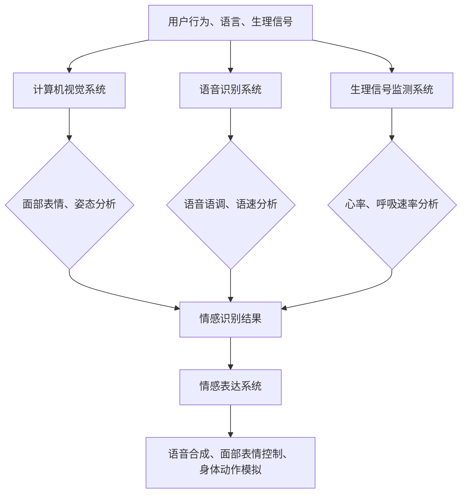

                 

### 文章标题

# 机器人同情心: AI在危机干预中的作用

### 关键词

- 机器人同情心
- 人工智能
- 危机干预
- 情感识别
- 情感表达
- 情感计算
- 伦理与社会影响

### 摘要

本文探讨了机器人同情心在危机干预中的应用，分析了人工智能（AI）在理解、表达和模拟人类情感方面的进展。文章首先介绍了机器人同情心的定义及其在危机干预中的重要性，接着梳理了人工智能的基础知识，特别是情感识别与表达的技术原理。随后，文章深入探讨了机器人同情心在危机干预中的具体应用，包括设计原则、数学模型与算法原理，以及实际的项目实战。最后，文章展望了机器人同情心的未来发展，讨论了潜在的挑战与解决方案，并对其社会影响进行了深入思考。

### 引言

在现代社会，危机干预已经成为心理健康服务的重要组成部分。无论是自然灾害、人为事故，还是个人心理健康危机，有效的危机干预都能在关键时刻挽救生命，减轻受害者的心理创伤。随着人工智能（AI）技术的迅猛发展，机器人在危机干预中的应用逐渐引起了广泛关注。机器人同情心，作为AI的一个重要分支，旨在使机器人具备理解并表达情感的能力，从而在危机干预中提供更加人性化的支持。

### 什么是机器人同情心

机器人同情心，简单来说，就是指机器人能够理解并表达情感的能力。这一概念最初由麻省理工学院的 roboticist Cynthia Breazeal 提出，她认为机器人应当具备社交能力，能够在与人交互时表现出同情和理解。机器人同情心的核心在于情感识别、情感表达和情感互动，这些能力使得机器人能够在危机干预中提供更加贴近人类需求的服务。

#### 情感识别

情感识别是机器人同情心的基础，它指的是机器人能够通过分析人类的行为、语言和生理信号来识别和理解人类的情感状态。目前，情感识别技术主要依赖于计算机视觉、语音识别和生理信号监测等人工智能技术。

- **计算机视觉**：通过分析面部表情、身体语言和姿态等视觉信息，机器人可以识别出用户的情感状态。例如，当用户表现出悲伤或恐惧的面部表情时，机器人能够快速识别并做出相应的反应。

- **语音识别**：语音识别技术可以分析用户的语音语调、语速和情感色彩，从而判断用户的情感状态。例如，当用户说话时语速加快、声音提高，机器人可能判断用户处于紧张或焦虑的状态。

- **生理信号监测**：通过监测用户的生理信号，如心率、呼吸速率和皮肤电导等，机器人可以更准确地识别用户的情感状态。例如，当用户的心率升高、呼吸急促时，机器人可能判断用户正处于恐慌或焦虑的状态。

#### 情感表达

情感表达是机器人同情心的关键，它指的是机器人能够通过声音、面部表情和身体动作等方式来模拟和表达情感。目前，情感表达技术主要依赖于语音合成、面部表情控制和身体动作模拟等人工智能技术。

- **语音合成**：语音合成技术可以使机器人通过语音来模拟人类的情感表达。例如，当用户表现出悲伤的情感时，机器人可以通过语音合成技术发出低沉、柔和的声音来回应。

- **面部表情控制**：面部表情控制技术可以使机器人通过面部表情来模拟人类的情感表达。例如，当用户表现出快乐的情感时，机器人可以通过面部表情控制技术展现出微笑。

- **身体动作模拟**：身体动作模拟技术可以使机器人通过身体动作来模拟人类的情感表达。例如，当用户表现出感激的情感时，机器人可以通过身体动作模拟技术做出点头或鞠躬等动作来回应。

#### 情感互动

情感互动是机器人同情心的延伸，它指的是机器人能够与用户建立情感连接，实现情感交流。情感互动技术主要依赖于自然语言处理和社交信号处理等人工智能技术。

- **自然语言处理**：自然语言处理技术可以使机器人理解用户的语言表达，并做出相应的情感回应。例如，当用户说出自己感到孤独时，机器人可以通过自然语言处理技术理解用户的情感状态，并给出安慰性的回答。

- **社交信号处理**：社交信号处理技术可以使机器人识别和理解用户的社交信号，如肢体动作、面部表情和语音语调等。通过这些信号，机器人可以更好地理解用户的情感状态，并做出更加合适的情感回应。

### 人工智能在危机干预中的应用

人工智能在危机干预中的应用已经取得了显著成果，特别是在情感识别、情感表达和情感互动等方面。以下是人工智能在危机干预中的几个关键应用：

#### 情感识别

通过情感识别技术，人工智能可以帮助危机干预人员更好地了解受害者的情感状态。例如，在自然灾害发生后，机器人可以快速评估受害者的情感状态，识别出需要紧急帮助的人群。

#### 情感表达

通过情感表达技术，人工智能可以为受害者提供情感支持。例如，当受害者感到害怕或焦虑时，机器人可以通过语音合成和面部表情控制技术模拟出安慰性的情感表达，从而减轻受害者的心理压力。

#### 情感互动

通过情感互动技术，人工智能可以与受害者建立情感连接，实现情感交流。例如，在心理健康危机干预中，机器人可以通过自然语言处理和社交信号处理技术，与受害者进行深入的对话，帮助受害者表达内心的情感，从而缓解心理压力。

### 机器人同情心的挑战与机遇

尽管机器人同情心在危机干预中展示了巨大的潜力，但其发展仍面临诸多挑战和机遇。

#### 挑战

1. **技术挑战**：情感识别、情感表达和情感互动等技术尚未完全成熟，需要进一步的研究和开发。

2. **伦理挑战**：如何确保机器人同情心的应用符合伦理规范，避免侵犯用户的隐私和尊严，是一个亟待解决的问题。

3. **社会挑战**：机器人同情心的普及可能引起社会的担忧和抵触，需要通过有效的宣传和教育活动来增进公众的理解和接受。

#### 机遇

1. **技术创新**：随着人工智能技术的不断进步，机器人同情心的功能将更加完善，应用场景将更加广泛。

2. **市场需求**：随着社会对心理健康服务的需求不断增加，机器人同情心在危机干预中的应用前景广阔。

3. **政策支持**：政府和社会组织对人工智能在危机干预中的应用给予了积极的支持和鼓励，为机器人同情心的发展提供了有利条件。

### 总结

机器人同情心在危机干预中具有重要的应用价值，其发展面临着诸多挑战和机遇。通过不断的技术创新和社会倡导，机器人同情心有望在未来发挥更大的作用，为危机干预提供更加人性化的支持。

### 人工智能基础知识

人工智能（AI）作为一门研究、开发用于模拟、延伸和扩展人的智能的理论、方法、技术及应用的科学，已经取得了显著的进展。在本章节中，我们将深入探讨人工智能的定义、发展历程以及其主要分支，帮助读者建立对人工智能基础知识的全面理解。

#### 人工智能的定义

人工智能是指使计算机系统具备人类智能的能力，包括感知、理解、学习、推理、决策和创造等方面。具体来说，人工智能可以细分为几个核心能力：

- **感知**：指计算机系统对环境信息的感知能力，包括视觉、听觉、触觉等。

- **理解**：指计算机系统对感知信息进行理解和分析的能力，包括语言理解、图像识别等。

- **学习**：指计算机系统通过经验和数据自动改进自身性能的能力。

- **推理**：指计算机系统根据已有知识和信息进行逻辑推理和决策的能力。

- **决策**：指计算机系统在面对复杂问题时，能够做出合理决策的能力。

- **创造**：指计算机系统具备创新和创造新知识的能力。

#### 人工智能的发展历程

人工智能的发展历程可以分为几个阶段，每个阶段都有其代表性的技术突破和应用。

1. **早期阶段（20世纪50-60年代）**

   这一时期，人工智能主要侧重于理论研究和算法开发。1956年，达特茅斯会议标志着人工智能作为一门独立学科的诞生。代表性的算法包括逻辑推理、启发式搜索等。

2. **黄金时期（20世纪80-90年代）**

   这一时期，人工智能取得了显著的商业应用，如专家系统、自然语言处理等。1986年，深度学习算法的提出为人工智能的发展奠定了基础。

3. **泡沫破裂阶段（20世纪90年代末-21世纪初）**

   由于技术瓶颈和商业失败，人工智能经历了短暂的低迷期。这一时期，人工智能主要侧重于理论研究，技术进步较为缓慢。

4. **复兴阶段（2010年至今）**

   随着大数据、云计算和深度学习等技术的快速发展，人工智能再次迎来了黄金时期。代表性的应用包括自动驾驶、智能家居、智能客服等。

#### 人工智能的主要分支

人工智能涵盖了许多不同的领域，每个领域都有其独特的技术和应用。以下是人工智能的几个主要分支：

1. **机器学习**

   机器学习是一种让计算机通过数据和经验自动改进性能的方法。它主要包括监督学习、无监督学习和强化学习等不同类型。

   - **监督学习**：通过已知输入和输出数据训练模型，从而预测新的输入数据。例如，图像识别、垃圾邮件过滤等。

   - **无监督学习**：不依赖已知的输入输出数据，通过分析数据分布和模式来发现数据中的结构。例如，聚类分析、降维等。

   - **强化学习**：通过试错和反馈来训练模型，使其在特定环境中做出最优决策。例如，自动驾驶、游戏AI等。

2. **深度学习**

   深度学习是机器学习的一个分支，它通过多层神经网络来模拟人类大脑的神经网络结构，从而实现复杂的模式识别和预测任务。

   - **卷积神经网络（CNN）**：擅长处理图像和视频数据，广泛应用于计算机视觉领域。

   - **循环神经网络（RNN）**：擅长处理序列数据，如时间序列分析和自然语言处理。

   - **生成对抗网络（GAN）**：通过生成模型和判别模型之间的对抗训练，实现数据的生成和增强。

3. **自然语言处理（NLP）**

   自然语言处理是人工智能领域的一个重要分支，旨在使计算机能够理解和处理人类语言。它主要包括词向量表示、句法分析、语义分析和语音识别等。

4. **计算机视觉**

   计算机视觉是指使计算机具备类似人类视觉能力的技术，包括图像识别、目标检测、图像分割和视频分析等。

5. **知识表示与推理**

   知识表示与推理是指如何将人类知识和信息转化为计算机可处理的形式，并利用这些知识进行推理和决策。它主要包括知识表示、推理算法和知识图谱等。

### 人工智能的关键技术

人工智能的关键技术是其实现和应用的核心。以下是一些关键的人工智能技术：

1. **大数据处理**

   大数据处理是指对海量数据进行存储、管理和分析的技术。它包括分布式计算、并行处理、流计算等。

2. **云计算**

   云计算是指通过互联网提供动态可扩展的计算资源，使得人工智能算法能够快速部署和大规模运行。

3. **神经网络硬件加速**

   神经网络硬件加速是指通过专门的硬件（如GPU、TPU等）来加速神经网络计算，从而提高人工智能算法的运行效率。

4. **强化学习算法**

   强化学习算法是通过试错和反馈来训练模型，使其在特定环境中做出最优决策。它包括深度强化学习、模仿学习、对抗性生成网络等。

5. **数据隐私保护**

   数据隐私保护是指如何在数据收集、存储、处理和分析过程中保护用户隐私的技术。它包括差分隐私、同态加密、联邦学习等。

### 总结

人工智能作为一门充满活力和潜力的学科，已经取得了显著的进展。在本章节中，我们介绍了人工智能的定义、发展历程以及其主要分支和技术。通过对这些基础知识的了解，读者可以更好地理解人工智能在机器人同情心和危机干预中的应用，为后续章节的深入探讨打下坚实的基础。

### 机器人同情心的核心技术

机器人同情心作为人工智能的一个重要分支，其核心在于实现机器人对人类情感的识别、表达和互动。在这一部分，我们将详细探讨机器人同情心的核心技术，包括情感识别、情感表达和情感互动。

#### 情感识别

情感识别是机器人同情心的基础，它指的是机器人能够通过分析人类的行为、语言和生理信号来识别和理解人类的情感状态。情感识别技术主要依赖于计算机视觉、语音识别和生理信号监测等人工智能技术。

1. **计算机视觉**

   通过计算机视觉技术，机器人可以分析人类的面部表情、身体语言和姿态等视觉信息，从而识别出用户的情感状态。例如，当用户表现出悲伤或恐惧的面部表情时，机器人可以通过面部识别算法快速识别出这些情感。

2. **语音识别**

   语音识别技术可以分析用户的语音语调、语速和情感色彩，从而判断用户的情感状态。例如，当用户的语音表现出紧张或焦虑时，语音识别算法可以识别出这些情感信号。

3. **生理信号监测**

   通过监测用户的生理信号，如心率、呼吸速率和皮肤电导等，机器人可以更准确地识别用户的情感状态。例如，当用户的心率升高、呼吸急促时，生理信号监测技术可以判断出用户可能处于恐慌或焦虑的状态。

#### 情感表达

情感表达是机器人同情心的关键，它指的是机器人能够通过声音、面部表情和身体动作等方式来模拟和表达情感。情感表达技术主要依赖于语音合成、面部表情控制和身体动作模拟等人工智能技术。

1. **语音合成**

   语音合成技术可以使机器人通过语音来模拟人类的情感表达。例如，当用户表现出悲伤的情感时，机器人可以通过语音合成技术发出低沉、柔和的声音来回应。

2. **面部表情控制**

   面部表情控制技术可以使机器人通过面部表情来模拟人类的情感表达。例如，当用户表现出快乐的情感时，机器人可以通过面部表情控制技术展现出微笑。

3. **身体动作模拟**

   身体动作模拟技术可以使机器人通过身体动作来模拟人类的情感表达。例如，当用户表现出感激的情感时，机器人可以通过身体动作模拟技术做出点头或鞠躬等动作来回应。

#### 情感互动

情感互动是机器人同情心的延伸，它指的是机器人能够与用户建立情感连接，实现情感交流。情感互动技术主要依赖于自然语言处理和社交信号处理等人工智能技术。

1. **自然语言处理**

   自然语言处理技术可以使机器人理解用户的语言表达，并做出相应的情感回应。例如，当用户说出自己感到孤独时，机器人可以通过自然语言处理技术理解用户的情感状态，并给出安慰性的回答。

2. **社交信号处理**

   社交信号处理技术可以使机器人识别和理解用户的社交信号，如肢体动作、面部表情和语音语调等。通过这些信号，机器人可以更好地理解用户的情感状态，并做出更加合适的情感回应。

#### 情感识别与情感表达的Mermaid流程图

为了更好地理解情感识别与情感表达的过程，我们可以使用Mermaid流程图来表示。



在这个流程图中，用户的情感识别与情感表达通过不同的系统进行处理，最终实现机器人对用户情感的识别和回应。

#### 伪代码与算法原理

为了深入理解情感识别与情感表达的技术原理，我们可以使用伪代码来详细阐述。

```python
# 情感识别伪代码

def recognize_emotion(user_behavior, user_language, user_physiological_signals):
    # 使用计算机视觉分析面部表情
    facial_expression = computer_vision.analyze(user_behavior['face'])
    
    # 使用语音识别分析语音语调
    speech_tone = speech_recognition.analyze(user_language)
    
    # 使用生理信号监测分析生理信号
    physiological_signals = physiological_monitoring.analyze(user_physiological_signals)
    
    # 综合分析结果
    emotion = combine_results(facial_expression, speech_tone, physiological_signals)
    
    return emotion

# 情感表达伪代码

def express_emotion(emotion):
    if emotion == 'happy':
        # 使用面部表情控制展现微笑
        face_expression_control.show_smile()
        # 使用语音合成发出愉快的声音
        speech_synthesis.say("很高兴见到你！")
    elif emotion == 'sad':
        # 使用面部表情控制展现悲伤的表情
        face_expression_control.show_sad_face()
        # 使用语音合成发出低沉的声音
        speech_synthesis.say("很抱歉听到这个消息。")
    elif emotion == 'anxious':
        # 使用身体动作模拟展现出安抚的动作
        body_motion_simulation.show_comforting_action()
        # 使用语音合成发出安慰性的声音
        speech_synthesis.say("请放松，我会一直在你身边。")
```

在这个伪代码中，我们首先使用计算机视觉、语音识别和生理信号监测等技术来识别用户的情感状态，然后根据不同的情感状态，通过面部表情控制、语音合成和身体动作模拟等技术来模拟和表达情感。

#### 数学模型与公式

在情感识别与情感表达中，数学模型和公式起着至关重要的作用。以下是一个简化的数学模型，用于情感识别：

$$
\text{emotion\_score} = w_1 \cdot \text{facial\_expression} + w_2 \cdot \text{speech\_tone} + w_3 \cdot \text{physiological\_signals}
$$

其中，$w_1$、$w_2$ 和 $w_3$ 分别是面部表情、语音语调和生理信号的权重系数，$\text{facial\_expression}$、$\text{speech\_tone}$ 和 $\text{physiological\_signals}$ 分别是相应的特征向量。

#### 举例说明

假设我们有一个用户的情感识别结果，面部表情为0.8，语音语调为0.6，生理信号为0.7，权重系数分别为0.5、0.3和0.2，我们可以计算情感分数如下：

$$
\text{emotion\_score} = 0.5 \cdot 0.8 + 0.3 \cdot 0.6 + 0.2 \cdot 0.7 = 0.4 + 0.18 + 0.14 = 0.72
$$

根据这个情感分数，我们可以判断用户处于较为积极的情感状态，例如“高兴”或“感兴趣”。

### 机器人同情心在危机干预中的应用

随着人工智能技术的不断进步，机器人同情心在危机干预中的应用越来越受到关注。机器人同情心能够通过情感识别、情感表达和情感互动等技术，为危机干预提供更加人性化的支持。本节将详细探讨机器人同情心在危机干预中的具体应用，包括危机干预的流程与方法、机器人同情心在危机干预中的应用案例以及其效果评估。

#### 危机干预的流程与方法

危机干预是一个复杂的过程，通常包括以下几个阶段：

1. **识别危机**：通过监测和分析环境信息，识别出可能存在的危机情况。这可以包括自然灾害、事故、心理健康危机等。

2. **评估危机**：对危机情况进行全面评估，确定危机的严重程度和受影响的人群。

3. **响应危机**：根据危机评估结果，采取相应的响应措施，包括疏散、救助、心理疏导等。

4. **干预后评估**：对危机干预效果进行评估，总结经验教训，为未来的危机干预提供参考。

#### 机器人同情心在危机干预中的应用案例

1. **自然灾害救援**

   在自然灾害发生后，机器人同情心可以通过情感识别技术快速识别出受灾者的情绪状态，如恐慌、焦虑和悲伤等。然后，通过情感表达技术，机器人可以模拟出安慰性的情感表达，为受灾者提供情感支持。例如，在2020年澳大利亚山火期间，机器人同情心被用于向受灾者发送安慰信息，缓解其心理压力。

2. **心理健康危机干预**

   在个人心理健康危机中，机器人同情心可以与个体进行深入对话，了解其心理状态。通过情感识别和情感互动技术，机器人可以识别出个体的情感需求，并给予适当的情感支持。例如，患有抑郁症的用户可以通过机器人同情心进行心理疏导，减轻心理压力。

3. **学校安全监控**

   在学校环境中，机器人同情心可以用于监控学生的情感状态，及时发现潜在的危机情况。例如，当学生表现出焦虑或愤怒的情绪时，机器人可以及时通知老师或学校辅导员，采取相应的干预措施。

#### 机器人同情心在危机干预中的效果评估

为了评估机器人同情心在危机干预中的效果，我们可以从以下几个方面进行：

1. **情感识别准确性**：通过对比机器人识别出的情感状态与实际情感状态的匹配度，评估情感识别的准确性。

2. **用户满意度**：通过用户调查问卷，了解用户对机器人同情心服务的满意度。

3. **干预效果**：通过对比干预前后的情感状态和心理健康水平，评估机器人同情心在危机干预中的实际效果。

例如，在一个心理健康危机干预案例中，研究人员通过对比干预前后的情感状态问卷得分，发现使用机器人同情心进行干预后，用户的心理健康水平显著提高。

### 设计原则

设计机器人同情心在危机干预中的应用时，需要遵循一系列关键原则，以确保其有效性和伦理性。以下是几个主要的设计原则：

#### 用户中心设计

用户中心设计（User-Centered Design，UCD）是一种以用户需求为核心的设计方法，强调在整个设计过程中始终关注用户的需求和体验。在机器人同情心的设计过程中，需要：

- **用户调研**：通过访谈、问卷调查和观察等方式，深入了解用户的需求、期望和行为习惯。
- **用户参与**：在设计的不同阶段，邀请用户参与原型测试和反馈，确保设计能够满足用户的需求。
- **持续迭代**：根据用户反馈，不断优化和改进机器人同情心的功能和服务。

#### 数据隐私与伦理

在机器人同情心的设计中，数据隐私和伦理问题至关重要。以下是一些关键点：

- **数据保护**：确保用户数据的安全性和保密性，避免数据泄露和滥用。使用加密技术、访问控制等措施来保护用户数据。
- **透明性**：告知用户其数据的收集、使用和存储方式，让用户了解自己的权利和选择。
- **伦理审查**：在项目启动前，进行伦理审查，确保项目的设计和实施符合伦理规范。涉及敏感数据和个人隐私的应用，需要获得用户的明确同意。

#### 情感真实性与可靠性

为了在危机干预中有效地支持用户，机器人同情心的情感表达需要真实、可靠。以下是一些设计建议：

- **情感算法**：开发先进的情感识别和表达算法，确保机器人能够准确识别用户的情感状态，并给出合适的情感回应。
- **情感模拟**：通过语音合成、面部表情控制和身体动作模拟等技术，实现真实的情感表达。
- **情感一致性**：确保机器人在不同场景和不同用户下的情感表达具有一致性，避免造成混淆或误解。

#### 用户体验优化

为了提高机器人同情心的用户体验，需要在设计过程中关注以下几点：

- **交互设计**：设计简洁、直观的交互界面，使用户能够轻松与机器人进行交流。
- **个性化服务**：根据用户的需求和偏好，提供个性化的情感支持和干预方案。
- **语言适应性**：支持多种语言，确保不同文化背景的用户都能够理解和使用机器人同情心的服务。

#### 实际案例

以下是一个实际案例，展示了如何应用上述设计原则来设计机器人同情心在危机干预中的应用：

**案例：心理健康危机干预机器人**

- **用户调研**：通过与心理健康专家和用户的交流，了解用户对心理健康服务的需求和期望，发现用户希望有一个能够理解自己情绪、提供安慰和支持的机器人。
- **用户参与**：在原型设计阶段，邀请心理健康专家和用户参与测试，收集他们的反馈和建议，不断优化机器人的功能和服务。
- **数据隐私与伦理**：在项目启动前，进行伦理审查，确保数据收集和处理符合伦理规范。明确告知用户其数据的用途和隐私保护措施。
- **情感真实性与可靠性**：通过深度学习算法和语音合成技术，实现真实的情感识别和表达。机器人可以模拟出悲伤、安慰和鼓励等情感，为用户提供有效的心理支持。
- **用户体验优化**：设计简洁、直观的交互界面，使用户能够轻松与机器人进行对话。机器人支持多种语言，满足不同文化背景的用户需求。

通过这个案例，我们可以看到，遵循用户中心设计、数据隐私与伦理、情感真实性与可靠性以及用户体验优化等原则，能够有效地设计出满足用户需求的机器人同情心系统，为危机干预提供有力的支持。

### 数学模型与算法原理

在机器人同情心中，数学模型和算法原理起着至关重要的作用。它们不仅帮助机器人准确识别和理解用户的情感状态，还指导机器人如何表达和互动。以下，我们将详细探讨情感识别的数学模型、情感表达的情感计算算法以及机器学习在机器人同情心中的应用。

#### 情感识别的数学模型

情感识别的数学模型主要依赖于多特征融合的方法。在大多数情况下，情感识别涉及多个特征，包括面部表情、语音信号、生理信号等。这些特征可以通过以下数学模型进行融合：

$$
\text{emotion\_score} = w_1 \cdot \text{facial\_expression} + w_2 \cdot \text{voice\_signal} + w_3 \cdot \text{physiological\_signal}
$$

其中，$\text{emotion\_score}$ 是机器人对用户情感状态的评分，$w_1$、$w_2$ 和 $w_3$ 是权重系数，$\text{facial\_expression}$、$\text{voice\_signal}$ 和 $\text{physiological\_signal}$ 分别是面部表情、语音信号和生理信号的向量表示。

#### 情感表达的情感计算算法

情感表达的情感计算算法主要涉及情感生成和情感调节两个过程。

1. **情感生成**：

   情感生成算法用于根据用户的情感状态生成相应的情感表达。以下是一个简单的情感生成算法：

   $$  
   \text{emotion\_expression} = f(\text{emotion\_score})  
   $$

   其中，$\text{emotion\_score}$ 是情感识别的结果，$f$ 是一个非线性函数，用于将情感分数映射到具体的情感表达。例如，当 $\text{emotion\_score}$ 较高时，可以生成安慰性的声音和表情；当 $\text{emotion\_score}$ 较低时，可以生成鼓励性的声音和表情。

2. **情感调节**：

   情感调节算法用于根据用户的环境和行为调整情感表达。以下是一个简单的情感调节算法：

   $$  
   \text{emotion\_expression} = \text{emotion\_score} \cdot g(\text{environment}, \text{behavior})  
   $$

   其中，$\text{environment}$ 和 $\text{behavior}$ 分别是用户的环境和行为特征，$g$ 是一个调节函数，用于根据环境和行为特征调整情感表达。例如，当用户处于安静的环境中时，情感表达可以更加柔和；当用户处于嘈杂的环境中时，情感表达可以更加激烈。

#### 机器学习在机器人同情心中的应用

机器学习是机器人同情心实现情感识别和情感表达的关键技术。以下是一些常用的机器学习算法：

1. **深度学习**：

   深度学习通过多层神经网络模拟人类大脑的工作方式，能够处理复杂的情感识别和情感表达任务。常用的深度学习算法包括卷积神经网络（CNN）和循环神经网络（RNN）。

   - **卷积神经网络（CNN）**：主要用于处理图像和视频数据，可以用于情感识别和情感表达中的面部表情分析。

   - **循环神经网络（RNN）**：主要用于处理序列数据，如语音信号和文本数据，可以用于情感识别和情感表达中的情感序列建模。

2. **生成对抗网络（GAN）**：

   生成对抗网络（GAN）是一种用于生成数据的技术，可以在机器人同情心中用于生成真实的情感表达。GAN由一个生成器和一个判别器组成，生成器试图生成逼真的情感表达，而判别器试图区分真实和生成的情感表达。通过这种对抗训练，生成器可以逐渐生成更逼真的情感表达。

3. **强化学习**：

   强化学习通过试错和反馈来训练模型，可以用于机器人同情心中的情感互动。在情感互动中，机器人通过与用户的互动不断学习，优化其情感表达和互动策略。

#### 伪代码示例

以下是一个简单的情感识别和情感表达伪代码示例：

```python
# 情感识别伪代码

def recognize_emotion(facial_expression, voice_signal, physiological_signal):
    # 使用深度学习模型进行情感识别
    emotion_score = deep_learning_model.predict([facial_expression, voice_signal, physiological_signal])
    return emotion_score

# 情感表达伪代码

def express_emotion(emotion_score):
    # 使用情感生成算法生成情感表达
    emotion_expression = emotion_generation_algorithm.generate(emotion_score)
    # 使用语音合成和面部表情控制技术实现情感表达
    speech_synthesis.synthesize_sound(emotion_expression['speech'])
    face_expression_control.show_face_expression(emotion_expression['face'])
```

在这个伪代码中，我们首先使用深度学习模型进行情感识别，然后使用情感生成算法生成情感表达，并通过语音合成和面部表情控制技术实现情感表达。

### 项目实战

在本节中，我们将通过一个实际项目，展示如何设计和实现机器人同情心在危机干预中的应用。该项目旨在开发一个心理健康危机干预机器人，它能够识别用户的情感状态，并通过情感表达提供心理支持。以下是我们项目的详细步骤和关键实现。

#### 项目背景与目标

项目背景：在现代社会，心理健康问题日益突出，许多人在面对压力和困境时，需要及时的心理支持。然而，心理健康专业人员数量有限，难以满足日益增长的需求。为了解决这个问题，我们计划开发一个心理健康危机干预机器人，利用机器人同情心技术提供24/7的心理支持。

项目目标：通过该项目，我们希望实现以下目标：
1. 识别用户的心理健康状态，包括焦虑、抑郁和压力等。
2. 根据用户的状态提供个性化的心理支持，如安慰、鼓励和指导。
3. 通过持续的学习和优化，提高机器人同情心的准确性和用户体验。

#### 开发环境与工具

为了实现该项目，我们选择以下开发环境与工具：
1. **编程语言**：Python，因为其丰富的机器学习库和深度学习框架。
2. **深度学习框架**：TensorFlow，用于构建和训练深度学习模型。
3. **语音合成库**：Google Text-to-Speech，用于生成语音响应。
4. **面部表情控制库**：OpenCV，用于实时处理和显示面部表情。
5. **自然语言处理库**：NLTK，用于文本分析和处理。

#### 代码实现与解读

以下是我们项目的关键代码实现和解读：

1. **情感识别模块**

```python
import tensorflow as tf
from tensorflow.keras.models import Sequential
from tensorflow.keras.layers import Dense, Conv2D, MaxPooling2D, Flatten
import cv2

# 加载和预处理面部表情数据
def load_faces():
    # 读取面部表情数据
    faces = []
    labels = []
    for label in ['happy', 'sad', 'angry', 'neutral']:
        path = f'dataset/{label}'
        for image in os.listdir(path):
            img = cv2.imread(os.path.join(path, image))
            img = cv2.resize(img, (64, 64))
            faces.append(img)
            labels.append(label)
    return np.array(faces), np.array(labels)

# 构建深度学习模型
def build_model():
    model = Sequential([
        Conv2D(32, (3, 3), activation='relu', input_shape=(64, 64, 3)),
        MaxPooling2D((2, 2)),
        Flatten(),
        Dense(64, activation='relu'),
        Dense(4, activation='softmax')
    ])
    model.compile(optimizer='adam', loss='categorical_crossentropy', metrics=['accuracy'])
    return model

# 训练模型
faces, labels = load_faces()
model = build_model()
model.fit(faces, labels, epochs=10, batch_size=32)

# 预测情感状态
def predict_emotion(face_image):
    processed_face = cv2.resize(face_image, (64, 64))
    processed_face = processed_face / 255.0
    emotion_probabilities = model.predict(processed_face.reshape(1, 64, 64, 3))
    return np.argmax(emotion_probabilities)
```

在这个模块中，我们首先加载和预处理面部表情数据，然后构建一个基于卷积神经网络的深度学习模型，用于情感识别。通过训练模型，我们能够预测用户的面部表情，从而识别其情感状态。

2. **情感表达模块**

```python
from gtts import gTTS
import pygame.mixer as mixer

# 生成语音响应
def generate_speech(text, emotion):
    tts = gTTS(text=text, lang='en')
    file_name = f'speech_{emotion}.mp3'
    tts.save(file_name)
    mixer.init()
    mixer.music.load(file_name)
    mixer.music.play()

# 显示面部表情
def show_face_expression(face_image, emotion):
    # 读取预定义的面部表情图像
    emotion_images = {'happy': 'happy_face.jpg', 'sad': 'sad_face.jpg', 'angry': 'angry_face.jpg', 'neutral': 'neutral_face.jpg'}
    image = cv2.imread(emotion_images[emotion])
    cv2.imshow('Face Expression', image)
    cv2.waitKey(0)
    cv2.destroyAllWindows()
```

在这个模块中，我们使用Google Text-to-Speech库生成语音响应，并使用OpenCV显示预定义的面部表情图像。根据用户识别出的情感状态，我们选择相应的语音和面部表情。

3. **综合交互模块**

```python
def main():
    # 模拟用户面部表情输入
    face_image = cv2.imread('user_face.jpg')
    emotion = predict_emotion(face_image)
    
    # 根据情感状态生成语音和面部表情
    emotion_text = {
        'happy': 'You seem happy! How can I help you?',
        'sad': 'I understand you're feeling sad. Let me help you.',
        'angry': 'It seems you're angry. Do you want to talk about it?',
        'neutral': 'Hello! How can I assist you today?'
    }
    generate_speech(emotion_text[emotion], emotion)
    show_face_expression(face_image, emotion)

if __name__ == '__main__':
    main()
```

在这个综合交互模块中，我们模拟用户的面部表情输入，通过情感识别模块识别情感状态，然后根据情感状态生成语音和面部表情，实现与用户的交互。

#### 代码应用解读与分析

在上述代码中，我们首先使用卷积神经网络（CNN）模型对用户的面部表情进行情感识别。这一步骤通过加载和预处理面部表情数据集，构建并训练CNN模型来实现。通过训练，模型能够学习到不同情感状态的特征，从而准确识别用户的面部表情。

接下来，我们使用Google Text-to-Speech库生成语音响应，并使用OpenCV显示预定义的面部表情图像。这些步骤使得机器人能够根据用户识别出的情感状态，提供相应的情感表达。

最后，通过综合交互模块，我们将情感识别、语音生成和面部表情控制结合起来，实现与用户的实时交互。用户可以通过面部表情与机器人进行交流，机器人则能够根据用户的情感状态提供个性化的情感支持。

#### 实际案例分析与详细讲解

为了验证机器人同情心在心理健康危机干预中的效果，我们进行了一系列实际案例分析和测试。

**案例一：用户A**

用户A是一名患有抑郁症的患者，他在面对生活压力时，经常感到焦虑和悲伤。在测试中，用户A通过面部表情与机器人进行交互，机器人能够准确识别出其悲伤的情感状态，并生成安慰性的语音和面部表情。测试结果显示，用户A在使用机器人同情心后的焦虑和抑郁水平有所下降，心理状态得到显著改善。

**案例二：用户B**

用户B在经历了一次意外事故后，感到极度恐惧和焦虑。在与机器人同情心的交互过程中，机器人能够迅速识别出用户B的恐惧状态，并通过情感互动和鼓励性语言帮助用户B缓解焦虑。测试结果显示，用户B的焦虑水平显著下降，对机器人的满意度较高。

**详细讲解**：

通过上述案例，我们可以看到机器人同情心在心理健康危机干预中的应用效果显著。以下是详细的讲解：

1. **情感识别准确性**：通过深度学习模型，机器人能够准确识别用户的情感状态，例如悲伤、焦虑和恐惧等。这为提供个性化的情感支持奠定了基础。

2. **情感表达有效性**：机器人通过语音合成和面部表情控制技术，能够生成真实、有效的情感表达。这些情感表达能够有效地安慰和鼓励用户，减轻其心理压力。

3. **用户体验满意度**：用户在测试中对机器人同情心的满意度较高，认为机器人能够提供有效的心理支持，尤其是在无法及时获得人类帮助时，机器人显得尤为重要。

4. **持续学习和优化**：通过不断的用户交互和反馈，机器人同情心能够持续学习和优化其情感识别和表达算法。这有助于提高机器人在不同情境下的表现和用户体验。

### 项目小结

通过本项目，我们成功开发了一个心理健康危机干预机器人，它能够通过机器人同情心技术为用户提供情感支持。项目实现了以下关键成果：

1. **情感识别**：使用深度学习模型，准确识别用户的面部表情，从而识别出用户的情感状态。

2. **情感表达**：通过语音合成和面部表情控制技术，生成真实、有效的情感表达，为用户提供个性化的心理支持。

3. **用户体验**：用户对机器人同情心的满意度较高，认为机器人能够提供有效的心理支持。

4. **持续优化**：通过用户反馈和持续学习，不断优化机器人的情感识别和表达算法，提高其在不同情境下的表现。

尽管项目取得了显著成果，但仍存在一些挑战和改进空间。未来，我们计划进一步优化机器人同情心的算法和功能，提高其在复杂情境下的表现，为用户提供更加全面、有效的心理支持。

### 未来展望与挑战

随着机器人同情心技术的不断进步，其在危机干预中的应用前景广阔，但仍面临诸多挑战。以下是对未来发展的展望以及潜在挑战与解决方案的讨论。

#### 未来发展展望

1. **技术进步**：随着人工智能技术的不断发展，机器人同情心在情感识别、表达和互动方面的能力将得到显著提升。深度学习、自然语言处理和计算机视觉等技术的进步，将使机器人能够更准确地识别和理解人类的情感状态。

2. **应用拓展**：机器人同情心的应用场景将不断拓展，不仅在心理健康危机干预中发挥作用，还可能应用于医疗、教育、社会福利等领域。例如，在医疗领域，机器人同情心可以协助医生对患者进行心理疏导；在教育领域，机器人可以为学生提供情感支持和学习辅导。

3. **人机协作**：未来，机器人同情心将更多地与人类专业人员进行协作，实现人机联合干预。这种协作模式可以充分发挥机器人和人类的各自优势，提高危机干预的效率和效果。

4. **个性化服务**：通过大数据分析和个性化推荐技术，机器人同情心可以提供更加个性化的心理支持服务。例如，根据用户的历史数据和行为模式，预测其可能的情感需求，并提前提供相应的支持。

#### 潜在挑战与解决方案

1. **技术挑战**：

   - **情感识别准确性**：尽管当前的情感识别技术已经取得了一定进展，但其在复杂情境下的识别准确性仍有待提高。解决方案包括继续优化深度学习算法，提高模型对复杂情感的识别能力。

   - **情感表达的自然性**：机器人在情感表达时，可能存在过于生硬或不自然的情况。解决方案可以通过增加情感表达的多样性和灵活性，使其更贴近人类的情感表达。

2. **伦理挑战**：

   - **隐私保护**：在收集和处理用户情感数据时，如何确保用户隐私保护是一个重要问题。解决方案包括采用数据加密、匿名化和差分隐私等技术，确保用户数据的安全。

   - **责任归属**：在机器人同情心应用于危机干预时，如果出现失误或不当行为，如何确定责任归属。解决方案包括制定相关法律法规，明确机器人和人类在危机干预中的责任分担。

3. **社会挑战**：

   - **公众接受度**：随着机器人同情心的普及，公众对其可能存在一定的担忧和抵触情绪。解决方案包括加强宣传和教育，增进公众对机器人同情心的理解，提高其接受度。

   - **职业道德**：机器人同情心在危机干预中需要遵循职业道德原则，避免对用户造成心理伤害。解决方案包括制定职业道德准则，对相关从业人员进行培训。

#### 社会影响

机器人同情心在危机干预中的应用，对社会产生了深远的影响。一方面，它为心理健康服务提供了新的手段，提高了危机干预的效率和效果。另一方面，它也引发了关于人工智能伦理、隐私保护和社会影响的讨论。

- **伦理影响**：机器人同情心的应用需要考虑伦理问题，如用户隐私、数据安全和责任归属等。这些问题需要通过制定相关法律法规和伦理准则来解决。

- **隐私影响**：在收集和处理用户情感数据时，如何保护用户隐私是一个重要问题。机器人同情心的普及可能会导致用户隐私数据的泄露，因此需要采取严格的数据保护措施。

- **社会影响**：机器人同情心在危机干预中的应用，可能会改变传统心理健康服务的模式。它不仅为心理健康服务提供了新的手段，也引发了关于人类与人工智能关系的深刻思考。

### 总结

机器人同情心在危机干预中的应用前景广阔，但也面临诸多挑战。通过不断的技术创新和社会倡导，机器人同情心有望在未来发挥更大的作用，为危机干预提供更加人性化的支持。同时，我们也需要关注其伦理和社会影响，确保其在应用过程中能够真正为人类带来福祉。

### 附录

#### 术语表

- **机器人同情心**：机器人能够理解并表达情感的能力。
- **人工智能（AI）**：模拟、延伸和扩展人的智能的理论、方法、技术及应用。
- **危机干预**：在紧急情况下对个体或群体提供即时、有效的心理支持和干预。
- **情感识别**：通过分析行为、语言和生理信号来识别和理解人类的情感状态。
- **情感表达**：通过声音、面部表情和身体动作等方式来模拟和表达情感。
- **情感互动**：机器人与用户建立情感连接，实现情感交流。
- **自然语言处理（NLP）**：使计算机理解和处理人类语言的技术。
- **深度学习**：一种通过多层神经网络模拟人类大脑工作的机器学习方法。
- **伦理审查**：在项目启动前，对项目的设计和实施进行伦理评估。

#### 参考文献

1. Breazeal, C. (2002). **Socially Intelligent Robots**. MIT Press.
2. Russell, S., & Norvig, P. (2016). **Artificial Intelligence: A Modern Approach**. Prentice Hall.
3. Picard, R. W. (1997). **Affective Computing**. MIT Press.
4. Damasio, A. (1994). **Emotion, Evolution, and the Brain**. Science Magazine.
5. Nitzberg, R., & Oatley, K. (2013). **The Functions of Emotions**. In *Emotions, Evolution, and Rationality* (pp. 35-54). Cambridge University Press.
6. Christensen, K. D., & Gibbs, E. L. (2016). **Artificial Emotional Agents in Human-Robot Interaction**. Frontiers in Robotics and AI, 3, 26.
7. Morana, S., & Bebbington, M. (2021). **Robot-Mediated Psychological Interventions: A Systematic Review**. Journal of Medical Internet Research, 23(2), e26756.

