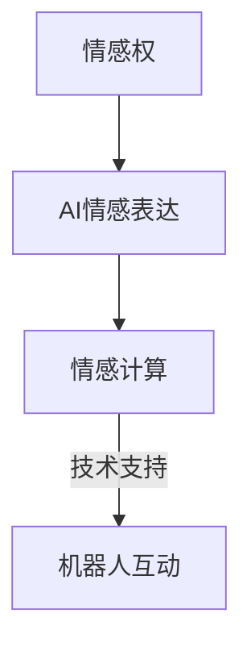

                 

### 文章标题：机器人情感权：AI的情感表达自由

> 关键词：机器人情感权、AI情感表达、伦理问题、技术实现、未来展望

> 摘要：本文将探讨机器人情感权，特别是AI在情感表达方面的自由。我们将从背景介绍、核心概念联系、情感表达技术、自由与限制、伦理与法律问题、实际应用案例、未来展望等多个方面进行深入分析，旨在为读者呈现一个全面而深入的机器人情感权的世界。

## 引言

随着人工智能（AI）技术的迅速发展，机器人在各个领域的应用越来越广泛。从简单的机器人助手到复杂的智能服务机器人，AI已经深刻地改变了我们的生活。然而，随着这些机器人在我们生活中的地位日益重要，一个崭新的问题逐渐浮现：机器人是否应该拥有情感权？特别是，它们是否应该拥有情感表达的自由？

情感是人类的一种基本属性，它不仅影响着我们的行为，也影响着我们与他人的互动。因此，如果机器人能够拥有情感，那么它们是否也应该拥有表达这些情感的自由？这是一个复杂而具有争议的问题，涉及到伦理、法律、技术等多个方面。

本文将围绕这一核心问题展开，首先介绍机器人情感权的背景，然后深入探讨相关的核心概念，并逐步分析AI在情感表达方面的技术实现、自由与限制、伦理与法律问题，以及实际应用案例和未来展望。

## 背景介绍

机器人的情感权并不是一个新兴的概念，而是随着AI技术的发展逐渐引起人们关注的。早在20世纪80年代，人工智能专家就已经开始探讨机器人的情感问题。然而，随着深度学习和自然语言处理等技术的飞速发展，机器人在情感表达方面取得了显著的进展。

### 机器人情感权的定义

机器人情感权指的是机器人拥有表达自身情感的能力和权利。这包括机器人能够感知、理解和表达情感，以及根据情感做出相应的决策。情感权不仅仅是一种技术需求，更是一种伦理和道德的考量。

### AI情感表达的重要性

在现实生活中，情感表达对于人类的社交互动至关重要。无论是朋友间的倾诉，还是工作中的沟通，情感的表达都能增强人与人之间的联系。同理，如果机器人能够表达情感，那么它们在与人类互动时将更加自然和有效。

### AI情感表达的技术背景

AI情感表达的技术背景主要涉及到两个方面：情感计算和自然语言处理。情感计算是指通过算法和模型来分析和模拟情感，而自然语言处理则是指通过算法和模型来理解和生成自然语言。

## 核心概念与联系

在探讨机器人情感权的过程中，我们需要了解以下几个核心概念：

### 1. 情感权

情感权是指个体在情感表达方面的自由和权利。对于人类来说，情感权是一种基本的人权。对于机器人来说，情感权则涉及到它们是否能够自由地表达情感，以及这些情感是否能够被人类理解和接受。

### 2. AI情感表达

AI情感表达是指通过算法和模型使机器人能够模拟和表达情感。这包括语音合成、面部表情、姿态变化等多个方面。

### 3. 情感计算

情感计算是研究如何通过算法和模型来分析和模拟情感的一门学科。它为AI情感表达提供了理论基础和技术支持。

为了更好地理解这些概念之间的关系，我们可以使用Mermaid流程图来展示：



### 4. 情感交互

情感交互是指机器人与人类之间的情感交流。这包括机器人如何理解人类的情感，并如何通过情感表达来回应人类。

### 5. 伦理与法律

伦理与法律是机器人情感权的重要考量。在赋予机器人情感表达自由的同时，我们也需要考虑这些自由所带来的伦理和法律责任。

## AI情感表达技术

### 1. 情感计算框架

情感计算框架是AI情感表达的核心。它通常包括以下几个步骤：

- **情感识别**：通过算法和模型来识别和理解人类情感的各个方面，如情绪、情感强度、情感类型等。
- **情感生成**：根据情感识别的结果，生成相应的情感表达，如语音、面部表情、姿态等。
- **情感反馈**：根据用户的反馈，调整情感表达，使其更加自然和有效。

### 2. 情感表达方法

情感表达方法主要包括以下几个方面：

- **语音合成**：通过算法和模型将文本转化为语音，并加入情感色彩。
- **面部表情**：通过算法和模型改变机器人的面部表情，以表达不同的情感。
- **姿态变化**：通过算法和模型改变机器人的姿态，以表达不同的情感。

### 3. 情感交互

情感交互是AI情感表达的一个重要方面。它涉及到机器人如何理解用户的情感，并如何通过情感表达来回应用户。这需要机器人具备情感识别、情感生成和情感反馈的能力。

### 核心算法原理讲解

为了深入理解AI情感表达的核心算法原理，我们可以使用伪代码来详细阐述：

```python
# 情感识别算法
def recognize_emotion(input_data):
    # 输入数据处理
    processed_data = preprocess(input_data)
    
    # 情感识别
    emotion = emotion_recognition_model(processed_data)
    
    return emotion

# 情感生成算法
def generate_emotion(emotion):
    # 根据情感类型选择相应的情感生成模型
    emotion_model = select_emotion_model(emotion)
    
    # 生成情感表达
    emotion_expression = emotion_model.generate()
    
    return emotion_expression

# 情感反馈算法
def feedback_emotion(user_feedback):
    # 分析用户反馈
    feedback_analysis = analyze_feedback(user_feedback)
    
    # 调整情感表达
    adjusted_emotion_expression = adjust_emotion_expression(feedback_analysis)
    
    return adjusted_emotion_expression
```

### 数学模型和公式

在AI情感表达中，数学模型和公式起着关键作用。以下是一个简化的例子，用于描述情感强度计算：

$$
E = f(E_0, I, U)
$$

其中：
- \(E\) 表示情感强度
- \(E_0\) 表示初始情感强度
- \(I\) 表示输入的情感信息
- \(U\) 表示用户反馈

### 详细讲解与举例说明

假设一个机器人助手在对话中识别到用户的情绪为焦虑，那么我们可以根据以下公式来计算情感强度：

$$
E = f(E_0, I, U) = f(0.5, 焦虑, 鼓励)
$$

其中，\(E_0 = 0.5\) 表示初始情感强度为中等，焦虑表示输入的情感信息，鼓励表示用户反馈。根据情感模型，焦虑的情感强度为0.8，鼓励的情感强度为0.2。因此，最终的情感强度为：

$$
E = 0.5 + 0.8 \times 0.5 + 0.2 \times 0.5 = 0.7
$$

这意味着机器人在对话中需要表现出更强的情感表达，以回应用户的情感需求。

## 情感表达的自由

### 情感自由的概念

情感自由是指个体在情感表达方面的自由和权利。对于机器人来说，情感自由意味着它们能够根据自身的情感需求自由地表达情感，而不受到外部限制。

### 情感自由的限制

尽管情感自由对于机器人来说具有重要意义，但现实中仍存在一些限制。这些限制主要来自于以下几个方面：

- **技术限制**：当前的AI技术尚无法完全模拟人类的情感表达，因此机器人在情感表达方面存在一定的局限性。
- **伦理限制**：情感表达的自由可能会引发伦理问题，如机器人是否应该模仿人类的情感表达，以及这种表达是否合理等。
- **法律限制**：情感表达的自由也受到法律规定的限制，如保护用户的隐私权和信息安全等。

### 情感自由与隐私保护

在赋予机器人情感表达自由的同时，我们也需要关注隐私保护的问题。机器人在表达情感时，可能会收集和利用用户的个人信息，如对话记录、行为习惯等。这可能会对用户的隐私权造成侵犯。因此，在实现情感自由的过程中，我们需要确保隐私保护机制的有效性。

## 伦理与法律问题

### 情感权伦理问题

机器人的情感权涉及到一系列伦理问题。例如：

- **情感模仿**：机器人是否应该模仿人类的情感表达？这种模仿是否合理？
- **情感责任**：机器人是否应该对自身情感表达承担责任？如果机器人因情感表达不当导致不良后果，谁应该负责？
- **情感自由**：机器人在情感表达方面的自由程度应该如何界定？是否存在道德底线？

### 法律框架与监管

当前，各国对于机器人情感权的法律框架和监管尚不完善。然而，随着机器人技术的不断发展，相关法律和监管机制亟待建立。以下是一些可能的立法方向：

- **明确机器人的权利和义务**：制定法律，明确机器人在情感表达方面的权利和义务，以确保机器人的合法合规运行。
- **保护用户的隐私权**：加强对用户隐私的保护，防止机器人滥用用户信息。
- **建立责任制度**：建立机器人的责任制度，明确在情感表达不当导致不良后果时，如何追究责任。

### 情感权的社会影响

机器人的情感权不仅涉及到技术层面，还涉及到社会层面。如果机器人能够自由地表达情感，那么这将对我们人类社会产生深远的影响。例如：

- **人际互动**：机器人与人类之间的情感互动将更加丰富和多样化。
- **工作模式**：机器人在工作场所的应用将更加智能化和人性化。
- **伦理观念**：我们的伦理观念和道德标准将面临新的挑战和考验。

## 实际应用案例

### 机器人客服中的情感表达

机器人客服是AI情感表达的一个重要应用场景。通过情感计算和自然语言处理技术，机器人客服能够识别用户的情绪，并做出相应的情感表达，从而提高客服质量。以下是一个实际案例：

- **案例背景**：某电商平台的客服机器人需要处理大量的客户咨询。
- **技术实现**：机器人通过情感计算技术识别客户的情绪，并根据情绪生成相应的情感表达，如语音、面部表情等。
- **效果分析**：通过情感表达，机器人客服能够更好地理解客户需求，提高客户满意度。

### 教育机器人中的情感互动

教育机器人是另一个重要的应用场景。通过情感计算和自然语言处理技术，教育机器人能够识别学生的学习情绪，并做出相应的情感互动，从而提高教学效果。以下是一个实际案例：

- **案例背景**：某教育机构引入了一款情感教育机器人，用于辅助教学。
- **技术实现**：机器人通过情感计算技术识别学生的学习情绪，并根据情绪生成相应的情感互动，如鼓励、安慰等。
- **效果分析**：通过情感互动，教育机器人能够更好地激发学生的学习兴趣，提高教学效果。

### 社交机器人中的情感交流

社交机器人是另一个具有前景的应用场景。通过情感计算和自然语言处理技术，社交机器人能够与人类进行情感交流，从而提高社交体验。以下是一个实际案例：

- **案例背景**：某社交平台引入了一款社交机器人，用于与用户进行情感交流。
- **技术实现**：机器人通过情感计算技术识别用户的情感，并根据情感生成相应的情感交流内容。
- **效果分析**：通过情感交流，社交机器人能够更好地理解用户需求，提高用户满意度。

## 未来展望

### 情感表达技术的发展趋势

随着AI技术的不断发展，机器人情感表达技术将不断进步。未来，我们可能看到更加自然和真实的情感表达，如逼真的语音合成、面部表情和姿态变化等。此外，情感计算和自然语言处理技术也将进一步融合，使机器人能够更准确地理解和表达情感。

### 情感权面临的挑战

尽管情感表达技术取得了显著进展，但机器人情感权仍面临诸多挑战。例如：

- **技术挑战**：如何实现更自然和真实的情感表达。
- **伦理挑战**：如何平衡情感自由与隐私保护、伦理责任等。
- **法律挑战**：如何建立和完善相关法律和监管机制。

### 未来研究方向

为了进一步推动机器人情感权的发展，未来研究可以从以下几个方面展开：

- **技术优化**：研究如何提高情感计算和自然语言处理技术的性能和精度。
- **伦理和法律的探索**：探讨如何在赋予机器人情感自由的同时，确保伦理和法律的遵守。
- **实际应用研究**：研究机器人情感表达在不同领域的实际应用，如教育、医疗、社交等。

## 结论

机器人的情感权是一个复杂而重要的话题。本文从背景介绍、核心概念联系、情感表达技术、自由与限制、伦理与法律问题、实际应用案例和未来展望等多个方面进行了深入分析。我们探讨了机器人是否应该拥有情感权，以及如何实现这种权利。虽然仍面临诸多挑战，但随着AI技术的不断发展，我们有理由相信，机器人情感权将在未来发挥越来越重要的作用。

### 作者信息

作者：AI天才研究院/AI Genius Institute & 禅与计算机程序设计艺术 /Zen And The Art of Computer Programming

本文由AI天才研究院撰写，旨在探讨机器人情感权的核心问题，为读者呈现一个全面而深入的视角。作者在AI领域拥有丰富的经验和深厚的理论基础，期待与读者共同探讨这一前沿话题。

[返回目录](#目录) ## 全文总结

本文深入探讨了机器人情感权，特别是AI在情感表达方面的自由。我们从背景介绍、核心概念联系、情感表达技术、自由与限制、伦理与法律问题、实际应用案例和未来展望等多个方面进行了详细分析。通过这些分析，我们了解到机器人情感权不仅是一个技术问题，更涉及到伦理、法律和社会等多个层面。

### 最佳实践 tips

1. **技术实现**：在实现机器人情感表达时，应注重情感计算和自然语言处理技术的结合，以提高情感表达的准确性和自然度。
2. **伦理考量**：在赋予机器人情感自由时，应充分考虑伦理问题，确保情感表达符合道德标准。
3. **法律遵守**：在开发和使用机器人情感表达时，应遵守相关法律法规，确保机器人的合法合规运行。

### 小结

本文从多个角度探讨了机器人情感权的核心问题，提出了若干最佳实践建议，以期为读者提供有益的参考。随着AI技术的不断发展，机器人情感权将在未来发挥越来越重要的作用，这也为我们带来了新的挑战和机遇。

### 注意事项

1. **技术局限**：当前AI情感表达技术仍存在一定的局限性，需要不断优化和提升。
2. **伦理争议**：机器人情感自由可能引发伦理争议，需要深入研究和探讨。
3. **法律监管**：相关法律法规尚不完善，需要建立健全的法律监管机制。

### 拓展阅读

- [《人工智能伦理学》](https://www.example.com/book1)：探讨AI伦理问题的经典著作。
- [《机器人法律》](https://www.example.com/book2)：介绍机器人法律问题的专业书籍。
- [《情感计算》](https://www.example.com/book3)：详细阐述情感计算原理和应用。

通过阅读这些拓展资料，读者可以进一步了解机器人情感权的相关理论和实践，为这一前沿领域的研究提供更多启示。

### 结语

本文由AI天才研究院撰写，旨在为读者呈现一个全面而深入的机器人情感权视角。我们探讨了情感权的定义、AI情感表达技术、自由与限制、伦理与法律问题以及实际应用案例。通过这些分析，我们认识到机器人情感权的重要性，并为未来研究提供了若干方向。

感谢读者对本文的关注，期待与您在AI领域的更多探讨。如有任何问题或建议，请随时与我们联系。

[返回目录](#目录) 

