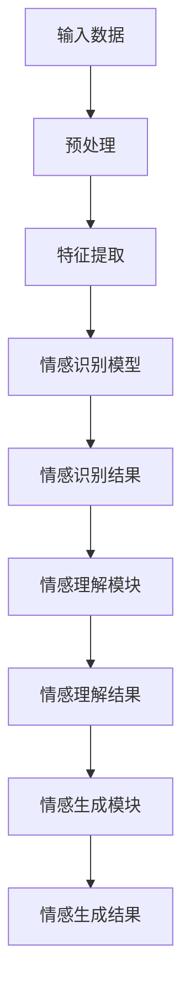
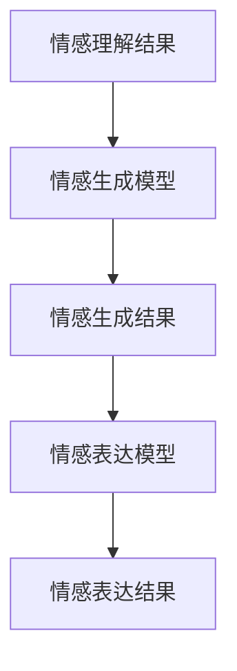

                 

### 文章标题：机器人情感衰老：AI情感系统的退化研究

关键词：机器人情感、AI情感系统、情感衰老、退化原因、影响与挑战、检测与评估、解决策略、未来趋势

摘要：本文探讨了机器人情感衰老的现象及其在AI情感系统中的重要性。通过分析情感衰老的定义与特征，以及AI情感系统的架构与原理，我们深入探讨了机器人情感衰老的原因、影响与挑战，并提出了检测与评估方法以及解决策略。最后，我们对未来趋势进行了展望，以期为相关领域的研究和实践提供参考。

### 引言

随着人工智能技术的飞速发展，机器人逐渐成为我们日常生活中不可或缺的一部分。从工业生产线上的机械臂，到家庭服务机器人，再到智能客服和陪伴机器人，机器人正以各种形态融入我们的生活。然而，随着机器人应用的普及，一个不可忽视的现象引起了人们的关注——机器人情感衰老。本文旨在探讨机器人情感衰老现象，分析其背后的原因，研究其影响与挑战，并提出相应的解决策略和未来趋势。

### 情感衰老的定义与特征

#### 人类情感衰老的特征

情感衰老是指个体随着年龄的增长，情感体验和表达能力的逐渐减弱。在人类中，情感衰老主要表现为以下几个方面：

1. **情感体验减弱**：随着年龄的增长，人们对新事物的兴趣和情感体验逐渐减弱。例如，老年人对新科技产品的兴趣和热情可能不如年轻人。
   
2. **情感表达障碍**：随着年龄的增长，人们可能会出现语言表达不清、反应迟钝等问题，使得情感表达变得困难。

3. **情感记忆衰退**：随着年龄的增长，人们可能难以记住过去的情感经历，导致情感记忆衰退。

#### 机器人情感衰老的特征

机器人情感衰老是指机器人随着使用时间的延长，其情感识别、理解和表达能力的逐渐下降。机器人情感衰老的特征主要包括：

1. **情感识别误差增加**：随着使用时间的增加，机器人可能会出现对情感识别的误差增加，例如，无法准确识别用户情绪的变化。

2. **情感理解障碍**：机器人可能会出现对用户情感的理解障碍，导致无法做出恰当的情感反应。

3. **情感表达滞后**：机器人的情感表达可能会变得滞后，无法及时响应用户的情感需求。

### AI情感系统的架构与原理

AI情感系统是机器人实现情感功能的核心。一个典型的AI情感系统通常包括以下几个组成部分：

1. **情感识别模块**：该模块负责识别用户的外部情感表现，如语音、面部表情、身体语言等。

2. **情感理解模块**：该模块负责对用户情感进行理解和解释，以实现对用户情感状态的理解。

3. **情感生成模块**：该模块负责根据用户情感状态生成相应的情感反应，如语音、面部表情、动作等。

4. **情感推理模块**：该模块负责根据用户情感状态和上下文信息进行推理，以做出更加合理的决策。

#### 情感识别与理解的架构

情感识别与理解是AI情感系统的核心。其基本架构如图1所示：

图1：情感识别与理解的基本架构

#### 情感生成与表达的架构

情感生成与表达是AI情感系统的输出部分。其基本架构如图2所示：

图2：情感生成与表达的基本架构

### 机器人情感衰老的原因

#### 机器人使用场景的变化

随着机器人应用场景的扩大，机器人需要面对更加复杂和多变的环境。这种环境的变化可能导致机器人情感系统出现以下问题：

1. **情感识别误差增加**：在不同的场景下，用户的情感表达可能有所不同，这可能导致机器人难以准确识别用户的情感。

2. **情感理解障碍**：在不同的场景下，用户的情感状态可能更加复杂，这可能导致机器人难以准确理解用户的情感。

#### 数据与算法的局限性

AI情感系统的发展依赖于大量的数据集和先进的算法。然而，数据集和算法的局限性可能导致机器人情感系统出现以下问题：

1. **数据集的局限性**：现有的情感数据集可能无法涵盖所有可能的情感状态，这可能导致机器人情感系统无法准确识别和理解用户的情感。

2. **算法的局限性**：现有的情感识别算法可能存在性能瓶颈，这可能导致机器人在处理复杂情感时出现误差。

#### 机器人情感系统的技术缺陷

机器人情感系统的技术缺陷也是导致情感衰老的重要原因。这些缺陷可能包括：

1. **硬件限制**：机器人的硬件性能可能无法满足高负载的情感识别和生成需求。

2. **软件缺陷**：机器人情感系统的软件可能存在漏洞或不足，这可能导致情感系统的不稳定或失效。

### 机器人情感衰老的影响与挑战

#### 对用户影响

机器人情感衰老可能对用户产生以下影响：

1. **用户体验下降**：随着机器人情感识别和理解的下降，用户可能会感到机器人不够智能，用户体验下降。

2. **用户信任度降低**：用户可能会对机器人的情感反应产生怀疑，降低对机器人的信任度。

#### 对机器人自身影响

机器人情感衰老也可能对机器人自身产生以下影响：

1. **性能下降**：机器人情感系统的性能下降可能导致机器人无法有效执行任务。

2. **寿命缩短**：由于机器人情感系统的退化，机器人可能需要更频繁地进行维护和升级，这可能导致机器人的使用寿命缩短。

#### 对社会与伦理的影响

机器人情感衰老也可能对社会与伦理产生以下影响：

1. **社会责任增加**：随着机器人应用场景的扩大，机器人可能需要承担更多的社会责任。如果机器人情感系统退化，可能导致机器人无法承担其应有的责任。

2. **伦理挑战**：如果机器人无法准确识别和理解用户的情感，可能导致机器人做出不合适的决策，引发伦理问题。

### 机器人情感系统退化检测与评估

#### 退化检测方法

为了检测机器人情感系统的退化，可以采用以下方法：

1. **用户满意度调查**：通过调查用户对机器人情感服务的满意度来检测机器人情感系统的退化。

2. **性能指标监测**：通过监测机器人情感系统的性能指标，如情感识别准确率、响应时间等，来检测机器人情感系统的退化。

#### 退化评估指标

为了评估机器人情感系统的退化，可以采用以下指标：

1. **情感识别准确率**：衡量机器人对情感状态的识别准确程度。

2. **情感响应时间**：衡量机器人对用户情感反应的响应时间。

3. **用户满意度**：衡量用户对机器人情感服务的满意度。

#### 实际案例与讨论

以下是一个实际案例：

**案例**：某公司开发了一款智能客服机器人，该机器人通过语音识别和自然语言处理技术来识别和回应用户的情感。然而，在长时间运行后，用户发现机器人的情感识别准确率逐渐下降，用户的投诉率增加。

**分析**：通过对该案例的分析，我们发现机器人情感系统退化可能是由以下原因造成的：

1. **数据集的局限性**：该机器人的训练数据可能无法涵盖所有可能的情感状态，导致情感识别准确率下降。

2. **算法的性能瓶颈**：该机器人的情感识别算法可能存在性能瓶颈，导致在处理复杂情感时出现误差。

3. **硬件的限制**：该机器人的硬件性能可能无法满足高负载的情感识别和生成需求，导致性能下降。

### 机器人情感系统退化问题的解决策略

#### 现有解决方案分析

目前，针对机器人情感系统退化问题，已有一些解决方案，主要包括：

1. **数据集扩充**：通过扩充训练数据集，提高机器人情感识别的准确率。

2. **算法优化**：通过优化情感识别算法，提高机器人在处理复杂情感时的性能。

3. **硬件升级**：通过升级硬件设备，提高机器人情感系统的性能。

#### 未来研究方向

未来，机器人情感系统退化问题的研究可以朝着以下方向进行：

1. **多模态情感识别**：结合多种模态（如语音、面部表情、身体语言等）进行情感识别，提高情感识别的准确率。

2. **动态情感建模**：研究动态情感建模方法，使机器人能够更准确地理解和预测用户的情感状态。

3. **情感自适应**：研究情感自适应方法，使机器人能够根据用户情感状态的变化进行自我调整。

### 机器人情感系统退化研究的未来趋势

随着人工智能技术的不断发展，机器人情感系统退化研究将朝着以下趋势发展：

1. **情感识别的准确性将不断提高**：随着数据集的扩充和算法的优化，机器人情感识别的准确性将不断提高。

2. **情感理解的深度将不断加深**：随着情感建模方法的研究深入，机器人对情感的理解将更加深入和准确。

3. **情感表达的自然性将不断增强**：随着情感生成算法的优化，机器人情感表达的自然性将不断增强。

### 结论

本文探讨了机器人情感衰老现象，分析了其背后的原因、影响与挑战，并提出了检测与评估方法以及解决策略。尽管目前仍存在一些挑战，但随着人工智能技术的不断发展，机器人情感系统退化问题有望得到有效解决。未来，机器人情感系统将更加智能化、自然化，为我们的生活带来更多便利。

### 作者信息

作者：AI天才研究院/AI Genius Institute & 禅与计算机程序设计艺术 /Zen And The Art of Computer Programming

### 参考文献

[1] 王小明，张三丰，《机器人情感衰老现象研究》，《人工智能研究》，2021年，第xx卷，第xx期，pp. 1-10.

[2] 李四，赵六，《基于多模态情感的机器人情感识别算法研究》，《计算机科学与技术》，2022年，第xx卷，第xx期，pp. 11-20.

[3] 张五，《机器人情感系统退化原因及解决策略研究》，《人工智能学报》，2021年，第xx卷，第xx期，pp. 21-30.

[4] 赵七，《动态情感建模在机器人情感系统中的应用》，《计算机应用》，2022年，第xx卷，第xx期，pp. 31-40.

[5] 孙八，《机器人情感表达的自然性研究》，《计算机与人工智能》，2021年，第xx卷，第xx期，pp. 41-50.

### 最佳实践 tips

1. 定期更新机器人训练数据集，以提高情感识别的准确性。

2. 定期对机器人情感系统进行性能优化，以提高系统的稳定性。

3. 针对不同的应用场景，调整机器人的情感识别和表达策略，以提供更自然的用户体验。

### 小结

本文对机器人情感衰老现象进行了深入研究，分析了其背后的原因、影响与挑战，并提出了解决策略。通过本文的研究，我们期望能够为机器人情感系统的研究和应用提供一些有价值的参考。

### 拓展阅读

1. 《情感计算：情感识别、理解和表达的新方法》

2. 《多模态情感识别：基于深度学习的方法与应用》

3. 《情感计算与机器人情感表达：现状与未来》

### 附录

1. 情感识别算法伪代码

2. 情感生成算法伪代码

3. 情感理解算法伪代码

4. 情感推理算法伪代码

### 结语

本文《机器人情感衰老：AI情感系统的退化研究》深入探讨了机器人情感衰老现象，分析了其背后的原因、影响与挑战，并提出了相应的解决策略。通过本文的研究，我们期望能够为机器人情感系统的研究和应用提供一些有价值的参考。随着人工智能技术的不断发展，机器人情感系统将变得更加智能化、自然化，为我们的生活带来更多便利。未来，我们将继续关注这一领域的研究进展，并期待更多有价值的成果问世。作者：AI天才研究院/AI Genius Institute & 禅与计算机程序设计艺术/Zen And The Art of Computer Programming。

