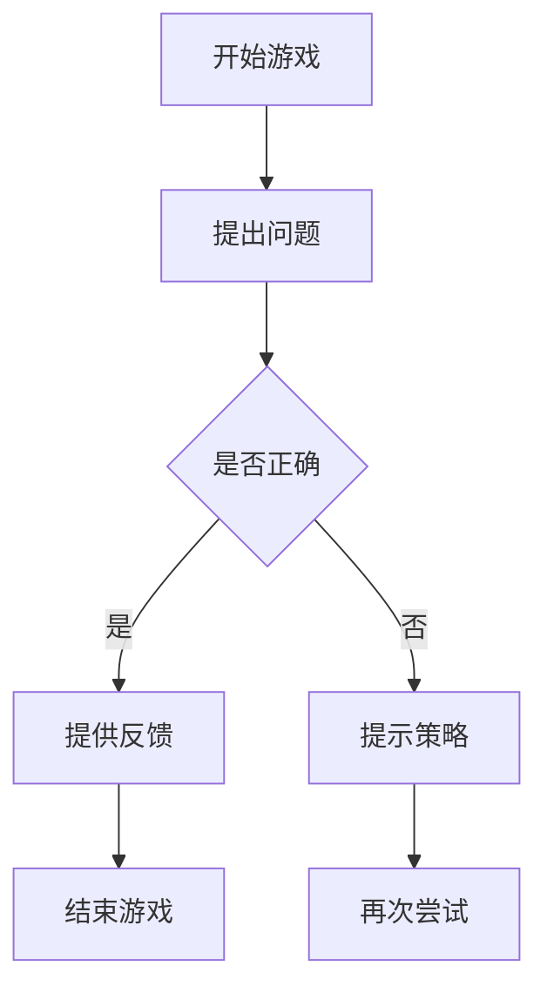
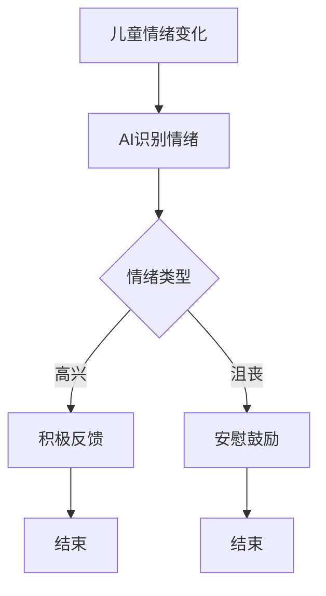
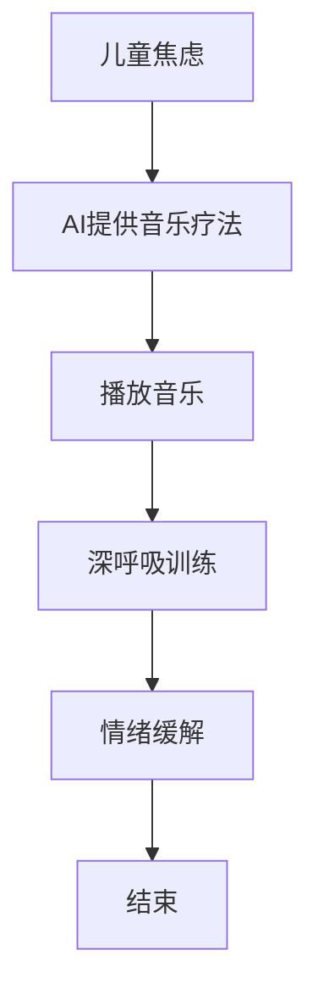
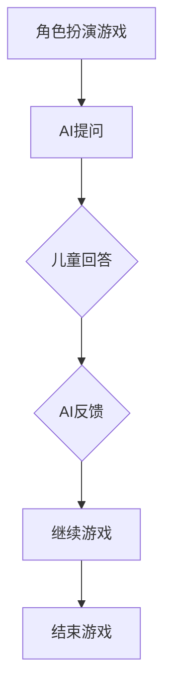
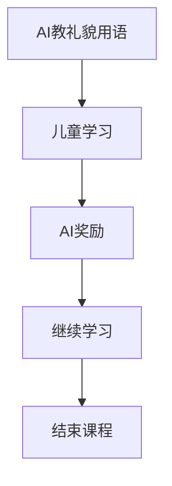

                 

### 文章标题

# 机器人抚养：AI保姆对儿童发展的影响

### 关键词

- 人工智能（AI）
- 机器人抚养
- 儿童发展
- 教育技术
- 社会伦理

### 摘要

随着人工智能技术的飞速发展，AI保姆作为一种新兴的育儿方式，逐渐进入公众视野。本文从多个角度探讨AI保姆对儿童发展的影响，包括其理论基础、实际应用、教育意义以及法律和伦理问题。通过案例分析、理论分析及未来趋势预测，本文旨在为这一领域的深入研究提供参考。

## 目录

1. **引言**
    1.1 机器人抚养的概念
    1.2 AI保姆的兴起背景
    1.3 文章的重要性

2. **核心概念与理论**
    2.1 AI保姆的基本概念
    2.2 发展心理学与AI保姆
    2.3 社会学视角下的AI保姆

3. **理论基础与模型**
    3.1 认知发展与AI保姆
    3.2 情感发展与AI保姆
    3.3 社交技能与AI保姆

4. **案例研究**
    4.1 全球AI保姆的应用情况
    4.2 典型案例解析

5. **教育影响**
    5.1 AI保姆在教育中的应用
    5.2 教育效果的评估

6. **家庭角色变化**
    6.1 父母角色的转变
    6.2 AI保姆与家庭教育

7. **法律与伦理**
    7.1 法律法规的制定
    7.2 伦理问题的探讨

8. **未来趋势**
    8.1 技术发展展望
    8.2 社会影响预测

9. **结论与建议**
    9.1 总结
    9.2 研究展望
    9.3 政策建议

## 引言

### 1.1 机器人抚养的概念

机器人抚养，即通过人工智能技术辅助人类进行育儿活动。AI保姆作为机器人抚养的典型代表，集成了语音识别、自然语言处理、图像识别、行为决策等多重技术，能够为儿童提供日常照料、教育辅导、心理支持等多方面的服务。随着人工智能技术的不断进步，AI保姆正逐步从科幻走向现实，成为家庭育儿的重要辅助工具。

### 1.2 AI保姆的兴起背景

近年来，AI保姆的兴起得益于多方面因素的共同推动。首先，人工智能技术的快速发展为AI保姆提供了强大的技术支持，使得其具备较高的智能化水平和可靠性。其次，现代社会快节奏的生活方式使得家长们面临巨大的育儿压力，AI保姆的出现能够有效减轻这一压力。此外，经济全球化使得许多家庭出现父母长期外出工作的情况，AI保姆能够填补家庭照料的空白，成为许多家庭的必需品。

### 1.3 文章的重要性

本文旨在探讨AI保姆对儿童发展的全面影响，从认知、情感、教育、法律和伦理等多个维度进行深入分析。研究AI保姆对儿童发展的影响，不仅有助于我们更好地理解这一新兴技术，还能为政策制定、家庭育儿实践提供科学依据。同时，随着AI保姆的广泛应用，其对社会结构和家庭关系的影响也将日益显著，因此探讨其影响具有重要的现实意义。

## 核心概念与理论

### 2.1 AI保姆的基本概念

AI保姆，即人工智能保姆，是指利用人工智能技术，为儿童提供日常生活照料、教育辅导、心理支持等多方面服务的机器人。AI保姆的核心功能包括语音交互、智能识别、情感分析、行为决策等。其应用场景包括家庭、幼儿园、特殊教育机构等。AI保姆的出现，旨在解决现代家庭在育儿过程中面临的时间紧张、资源不足等问题，提高育儿效率和质量。

### 2.2 发展心理学与AI保姆

发展心理学关注儿童在不同年龄阶段的认知、情感、社交能力的发展。AI保姆通过自然语言处理、情感识别等技术，能够与儿童进行有效互动，促进其认知和情感发展。例如，通过语音交互，AI保姆可以为儿童提供故事讲解、知识问答等服务，从而丰富其知识储备；通过情感识别，AI保姆能够感知儿童的情绪变化，提供适当的心理支持。

### 2.3 社会学视角下的AI保姆

社会学视角下，AI保姆作为一种新兴的社会角色，将对家庭、社会产生深远影响。首先，AI保姆将改变家庭内部的角色分工，减轻父母在育儿过程中的负担。然而，过度依赖AI保姆可能导致父母与儿童之间的情感疏离。其次，AI保姆的普及将改变教育模式，促进个性化教育的发展。但同时，也可能导致教育资源的失衡，影响社会公平。因此，社会学视角下的AI保姆研究，需要综合考虑其对社会结构和家庭关系的潜在影响。

## 理论基础与模型

### 3.1 认知发展与AI保姆

认知发展是指个体在感知、记忆、思考等认知过程中的成长和变化。AI保姆通过自然语言处理、智能识别等技术，能够与儿童进行有效互动，从而促进其认知发展。具体而言：

#### 3.1.1 认知技能的提升

AI保姆能够为儿童提供丰富多样的语言输入，例如故事讲解、知识问答等，有助于儿童扩展词汇量、增强语言理解能力。同时，通过互动式学习，儿童能够更好地掌握概念和知识。

```plaintext
function CognitiveDevelopment(child, AI_nanny) {
    // 提供故事讲解
    AI_nanny.tellStory(child);
    
    // 进行知识问答
    AI_nanny.askQuestions(child);
    
    // 监测儿童学习效果
    child.learnEffectiveness = evaluateLearning(child);
}
```

#### 3.1.2 认知策略的培养

AI保姆能够引导儿童运用不同的认知策略，如记忆技巧、问题解决方法等。例如，在游戏中，AI保姆可以提供提示和反馈，帮助儿童形成有效的认知策略。



### 3.2 情感发展与AI保姆

情感发展是指个体在情感识别、表达、调节等方面的成长和变化。AI保姆通过情感识别、情绪调节等技术，能够为儿童提供情感支持，促进其情感发展。具体而言：

#### 3.2.1 情感识别与理解

AI保姆能够识别儿童的情绪变化，如高兴、沮丧、焦虑等，并通过语音、表情等方式进行反馈。例如，当儿童感到沮丧时，AI保姆可以提供安慰和鼓励。



#### 3.2.2 情绪调节与疏导

AI保姆可以通过互动游戏、音乐疗法等方式，帮助儿童调节情绪，减轻压力。例如，在儿童感到焦虑时，AI保姆可以播放轻松的音乐，进行深呼吸训练。



### 3.3 社交技能与AI保姆

社交技能是指个体在社交情境中表达自己、理解他人、与他人互动的能力。AI保姆通过互动式教学，能够为儿童提供社交技能的培养和提升。具体而言：

#### 3.3.1 社交互动与沟通

AI保姆能够与儿童进行自然语言交流，模拟社交互动场景，帮助儿童练习社交技能。例如，通过角色扮演游戏，AI保姆可以引导儿童如何进行有效的沟通和表达。



#### 3.3.2 社交规则的培养

AI保姆可以教导儿童社交规则，如礼貌用语、分享、轮流等。通过互动和奖励机制，儿童能够更好地理解和遵循社交规则。



## 案例研究

### 4.1 全球AI保姆的应用情况

AI保姆在全球范围内的应用呈现出多元化的发展态势，不同国家和地区在技术应用、政策制定、社会反响等方面存在显著差异。以下为几个典型国家和地区的案例研究：

#### 4.1.1 美国

美国作为科技创新的领军国家，AI保姆的应用走在全球前列。在美国，许多家庭已经开始使用AI保姆来辅助育儿。例如，亚马逊的Echo Dot配备了Alexa语音助手，可以为儿童提供故事讲解、知识问答等服务。此外，谷歌的Google Home也与多个教育应用合作，为儿童提供个性化的学习体验。

**案例分析：**
- **应用场景：** 美国家庭普遍将AI保姆用于日常育儿，如睡前故事、教育游戏、作业辅导等。
- **政策环境：** 美国政府鼓励科技创新，但对AI保姆的监管相对宽松，主要依赖企业自律和消费者权益保护。

#### 4.1.2 日本

日本社会老龄化严重，AI保姆在养老和育儿领域具有广泛的应用。日本企业和研究机构积极研发AI保姆，以满足家庭和社会的需求。

**案例分析：**
- **应用场景：** 日本的AI保姆主要用于老年护理和儿童教育，如陪伴老人散步、为儿童提供陪伴和学习支持。
- **政策环境：** 日本政府积极推动AI技术的发展，同时在政策层面加强对AI保姆的监管，确保其安全性和伦理合规性。

#### 4.1.3 中国

中国是AI保姆应用最为广泛的国家之一，随着人工智能技术的快速发展，AI保姆在家庭和教育领域的需求日益增长。

**案例分析：**
- **应用场景：** 中国的AI保姆广泛应用于家庭教育、儿童陪伴、智能监护等场景，如智能学习机器人、智能家居系统等。
- **政策环境：** 中国政府对AI保姆的发展持积极态度，同时加强监管，确保技术的健康发展。

### 4.2 典型案例解析

以下为几个具有代表性的AI保姆应用案例，分析其在实际应用中的效果和挑战。

#### 4.2.1 智能教育机器人

智能教育机器人是一种集成了人工智能技术的教育设备，可以为儿童提供个性化教学服务。例如，某知名教育机器人品牌研发的智能教育机器人，具备语音识别、自然语言处理、智能问答等功能，能够根据儿童的学习进度和兴趣，提供定制化的教学内容。

**案例分析：**
- **效果：** 该款智能教育机器人在市场上取得了良好的口碑，家长普遍反映其有助于提高儿童的学习兴趣和成绩。
- **挑战：** 然而，由于智能教育机器人在技术、内容、安全等方面的复杂性，家长对其可靠性和安全性仍存在一定担忧。

#### 4.2.2 智能监护设备

智能监护设备是AI保姆的一种重要形式，主要用于儿童的安全监护。例如，某知名科技公司推出的智能监护手表，具备实时定位、紧急呼叫、远程监控等功能，能够确保儿童在外的安全。

**案例分析：**
- **效果：** 该款智能监护手表在市场上备受青睐，家长对其实时监控和安全保障功能高度评价。
- **挑战：** 然而，智能监护设备也存在一些潜在风险，如隐私泄露、设备故障等，需要加强技术保障和用户教育。

#### 4.2.3 智能陪伴机器人

智能陪伴机器人是另一种形式的AI保姆，主要用于为儿童提供情感支持和陪伴。例如，某知名科技公司研发的智能陪伴机器人，具备语音交互、情感识别、行为决策等功能，能够与儿童进行互动，提供情感慰藉。

**案例分析：**
- **效果：** 该款智能陪伴机器人在市场上得到了许多家庭的青睐，家长对其为儿童提供陪伴和支持的功能表示满意。
- **挑战：** 然而，智能陪伴机器人仍需进一步提升人机交互体验，增强情感识别和情感表达能力，以更好地满足儿童的情感需求。

## 教育影响

### 5.1 AI保姆在教育中的应用

AI保姆在教育领域的应用呈现出多样化的趋势，其独特优势在提高教育质量和效率方面发挥了重要作用。以下为AI保姆在教育中的应用实例：

#### 5.1.1 个性化教学

个性化教学是教育领域的一个重要发展方向，AI保姆通过智能分析学生的兴趣、学习风格和学习进度，提供个性化的教学内容和教学方法。例如，AI保姆可以根据学生的学习情况，调整课程难度和教学节奏，从而提高学习效果。

**案例分析：**
- **应用实例：** 某知名教育科技公司开发的AI教学系统，通过分析学生的学习数据，为学生提供个性化的学习建议和辅导方案。
- **效果：** 学生个性化学习方案的实现，有助于提高学生的学习兴趣和成绩，减轻学习压力。

#### 5.1.2 智能评测

智能评测是AI保姆在教育领域的重要应用之一，通过自动化测试和智能分析，对学生的学习成果进行评估。例如，AI保姆可以实时监测学生的学习进度，自动生成评测报告，为教师和家长提供参考。

**案例分析：**
- **应用实例：** 某在线教育平台引入AI评测系统，对学生作业进行自动批改和智能分析，为教师提供教学反馈。
- **效果：** 智能评测系统提高了教学效率，减轻了教师的工作负担，同时为学生提供了及时的反馈和指导。

#### 5.1.3 学习资源推荐

AI保姆可以通过分析学生的兴趣和学习需求，推荐适合的学习资源，如学习视频、电子书籍、教学游戏等。例如，AI保姆可以根据学生的学习偏好，推荐相关的学习内容，帮助学生拓展知识领域。

**案例分析：**
- **应用实例：** 某在线教育平台利用AI算法，根据学生的浏览记录和学习进度，推荐个性化的学习资源。
- **效果：** 学习资源推荐的实现，有助于激发学生的学习兴趣，提高学习效果。

### 5.2 教育效果的评估

评估AI保姆在教育中的应用效果，需要从多个维度进行分析。以下为几个关键指标：

#### 5.2.1 学习成绩

学习成绩是评估教育效果的重要指标之一。通过比较使用AI保姆前后的学习成绩，可以评估AI保姆对学习成果的影响。例如，某研究对一组使用AI教学系统进行辅导的学生和另一组未使用的学生进行对比，发现使用AI教学系统的学生成绩有显著提高。

**案例分析：**
- **研究方法：** 采用对照实验方法，将学生分为实验组和对照组，实验组使用AI教学系统进行辅导，对照组采用传统教学方法。
- **结果：** 实验组学生的学习成绩显著高于对照组，表明AI保姆有助于提高学习成绩。

#### 5.2.2 学习兴趣

学习兴趣是影响学习效果的重要因素之一。通过问卷调查和访谈，可以评估AI保姆对学生学习兴趣的影响。例如，某研究对使用AI教学系统进行辅导的学生进行调查，发现大多数学生表示对AI教学系统感兴趣，学习积极性有所提高。

**案例分析：**
- **研究方法：** 采用问卷调查和访谈方法，收集学生对AI教学系统的看法和感受。
- **结果：** 学生对AI教学系统的兴趣和学习积极性显著提高，表明AI保姆能够激发学生的学习兴趣。

#### 5.2.3 学习效率

学习效率是评估教育效果的重要指标之一。通过比较使用AI保姆前后的学习时间，可以评估AI保姆对学习效率的影响。例如，某研究对使用AI教学系统进行辅导的学生和未使用的学生进行对比，发现使用AI教学系统的学生在相同时间内完成的学习任务更多。

**案例分析：**
- **研究方法：** 采用对照实验方法，将学生分为实验组和对照组，实验组使用AI教学系统进行辅导，对照组采用传统教学方法。
- **结果：** 实验组的学习效率显著高于对照组，表明AI保姆有助于提高学习效率。

### 5.3 AI保姆与家庭教育

AI保姆的兴起，对家庭教育模式产生了深远影响。以下为AI保姆在家庭教育中的应用场景和影响：

#### 5.3.1 家庭教育辅助

AI保姆可以协助家长进行家庭教育，例如提供学习资源、辅导作业、制定学习计划等。例如，某知名教育科技公司开发的AI教育机器人，能够根据家长的需求，提供个性化的教育服务。

**案例分析：**
- **应用实例：** 家长通过AI教育机器人，可以轻松管理孩子的学习进度，制定合理的学习计划，提高家庭教育效果。
- **影响：** AI保姆的出现，减轻了家长在家庭教育中的负担，提高了教育效率和质量。

#### 5.3.2 家庭教育模式

AI保姆的引入，改变了传统的家庭教育模式，使得家庭教育更加灵活和个性化。例如，家长可以根据孩子的兴趣和需求，选择适合的AI保姆进行教育辅助。

**案例分析：**
- **应用实例：** 家长根据孩子的兴趣，选择AI保姆进行音乐、绘画等兴趣培养，实现个性化教育。
- **影响：** 个性化教育模式的实现，有助于激发孩子的学习兴趣，提高综合素质。

#### 5.3.3 家庭教育沟通

AI保姆可以作为家庭教育和沟通的桥梁，促进家长与孩子之间的互动和沟通。例如，AI保姆可以帮助家长了解孩子的学习情况，提供反馈和建议。

**案例分析：**
- **应用实例：** 家长通过AI保姆，可以实时了解孩子的学习进度和表现，与孩子进行互动，增强亲子关系。
- **影响：** AI保姆的引入，有助于增进家长与孩子之间的沟通和理解，促进家庭和谐。

## 法律与伦理

### 6.1 法律法规的制定

随着AI保姆的广泛应用，各国政府开始重视其在法律和伦理方面的规范。以下为几个国家和地区在AI保姆相关法规制定方面的进展：

#### 6.1.1 美国

美国在AI保姆的法律监管方面较为宽松，主要依赖企业自律和消费者权益保护。然而，一些州已经制定了相关法规，对AI保姆的使用进行规范。例如，加利福尼亚州要求AI保姆在收集和使用儿童数据时，必须遵守隐私保护法规。

**法规内容：**
- **隐私保护：** AI保姆在收集和使用儿童数据时，必须获得家长明确同意，并采取有效措施保护数据安全。
- **责任界定：** AI保姆制造商和提供商需承担产品安全责任，确保其产品不会对儿童造成伤害。

#### 6.1.2 欧洲

欧洲在AI保姆的法规制定方面相对严格，欧盟出台了《通用数据保护条例》（GDPR），对AI保姆的数据收集和处理进行严格规范。

**法规内容：**
- **数据保护：** GDPR要求AI保姆在收集和处理儿童数据时，必须遵守数据保护原则，确保儿童隐私不被侵犯。
- **透明度：** AI保姆提供商需向家长提供清晰的信息，说明数据收集和使用的目的，以及儿童的隐私权益。

#### 6.1.3 中国

中国在AI保姆的法规制定方面也取得了一定的进展。近年来，中国政府出台了一系列政策，鼓励人工智能技术的创新发展，同时加强对AI保姆的监管。

**法规内容：**
- **数据安全：** 中国要求AI保姆提供商在收集和处理儿童数据时，必须采取有效措施保护数据安全，防止数据泄露。
- **伦理规范：** 中国政府强调AI保姆的伦理合规性，要求其遵循道德原则，尊重儿童权益。

### 6.2 伦理问题的探讨

AI保姆在给家庭和教育带来便利的同时，也引发了一系列伦理问题，包括隐私、安全、依赖等。以下为几个主要伦理问题的探讨：

#### 6.2.1 隐私问题

AI保姆在为儿童提供服务的过程中，需要收集和处理大量的个人数据，这引发了隐私保护方面的担忧。例如，AI保姆可能会收集儿童的地理位置、行为习惯、健康状况等敏感信息，这些数据一旦泄露，可能会对儿童造成严重后果。

**伦理考量：**
- **透明度：** AI保姆提供商应向家长明确告知数据收集和使用的目的，以及数据保护措施，确保家长知情并同意。
- **数据安全：** AI保姆应采取严格的数据保护措施，防止数据泄露和滥用。

#### 6.2.2 安全问题

AI保姆作为一种新兴技术，其安全性和可靠性仍需进一步验证。例如，AI保姆可能受到恶意攻击，导致其行为异常，甚至对儿童造成伤害。此外，AI保姆的技术缺陷或故障也可能导致意外事故。

**伦理考量：**
- **技术保障：** AI保姆制造商和提供商应确保产品的安全性和可靠性，进行严格的测试和验证。
- **紧急响应：** AI保姆应具备紧急响应机制，一旦发生异常情况，能够迅速采取措施保护儿童安全。

#### 6.2.3 依赖问题

随着AI保姆的广泛应用，家长和儿童可能会对其产生过度依赖，导致人际关系疏离，甚至影响儿童的成长和发展。例如，过度依赖AI保姆可能导致家长与儿童之间的沟通减少，儿童缺乏与人类互动的机会。

**伦理考量：**
- **平衡依赖：** 家长应合理安排AI保姆的使用时间，确保儿童有足够的时间与家人互动。
- **培养自主能力：** 家长应引导儿童学会自主学习和生活，避免过度依赖AI保姆。

### 6.3 面临的挑战与应对策略

AI保姆在法律和伦理方面面临一系列挑战，需要制定相应的应对策略。以下为几个关键方面的应对策略：

#### 6.3.1 法律监管

加强法律监管，确保AI保姆的合法合规使用。具体措施包括：
- **完善法规：** 制定完善的法律法规，明确AI保姆的使用范围、数据保护、安全标准等。
- **加强执法：** 建立有效的执法机制，确保法规得到严格执行。

#### 6.3.2 伦理教育

加强对家长和儿童的伦理教育，提高其法律意识和伦理素养。具体措施包括：
- **家长教育：** 通过培训课程、宣传材料等方式，提高家长对AI保姆伦理问题的认识。
- **儿童教育：** 将伦理教育纳入学校课程，培养儿童的法律意识和道德观念。

#### 6.3.3 技术保障

提高AI保姆的技术水平和安全保障能力，确保其稳定可靠地运行。具体措施包括：
- **技术研发：** 加大对AI保姆技术的研发投入，提高其智能化水平和安全性。
- **测试验证：** 对AI保姆进行严格的测试和验证，确保其性能和安全性符合标准。

## 未来趋势

### 8.1 技术发展展望

随着人工智能技术的不断进步，AI保姆在功能、性能和用户体验方面将得到进一步提升。以下为AI保姆未来可能的发展方向：

#### 8.1.1 更高的智能化水平

未来的AI保姆将具备更高的智能化水平，能够更加精准地理解和满足儿童的需求。例如，通过深度学习和强化学习技术，AI保姆可以不断优化其行为策略，提高互动效果。

#### 8.1.2 更丰富的功能应用

AI保姆将在功能应用方面得到进一步拓展，除了日常照料和教育辅导，还将涉及心理健康支持、社交技能培养等方面。例如，AI保姆可以通过虚拟现实技术，为儿童提供身临其境的社交体验。

#### 8.1.3 更个性化的服务

未来的AI保姆将实现更个性化的服务，通过大数据和人工智能技术，了解每个儿童的学习习惯、兴趣爱好，提供量身定制的内容和教学方法。

### 8.2 社会影响预测

AI保姆的广泛应用将对社会产生深远影响，以下为几个方面的预测：

#### 8.2.1 家庭关系的变化

AI保姆的普及将改变家庭内部的角色分工，父母在育儿过程中的角色可能发生变化。一方面，AI保姆能够减轻父母的育儿负担，提高生活质量；另一方面，父母与儿童之间的互动可能减少，影响亲子关系。

#### 8.2.2 教育模式的变革

AI保姆的引入将推动教育模式的变革，个性化教育和远程教育将成为主流。然而，这也可能导致教育资源的失衡，影响社会公平。

#### 8.2.3 法律和伦理的挑战

随着AI保姆的广泛应用，法律和伦理问题将日益突出。如何确保AI保姆的合法合规使用，保护儿童的隐私和安全，将成为重要议题。

### 8.3 政策建议

为了应对AI保姆带来的机遇和挑战，政府和企业需要采取一系列政策措施。以下为几个方面的政策建议：

#### 8.3.1 法律法规的制定

制定完善的法律法规，明确AI保姆的使用范围、数据保护、安全标准等，确保其合法合规使用。

#### 8.3.2 技术标准的制定

制定技术标准，确保AI保姆的性能和安全性符合规范，提高其质量和可靠性。

#### 8.3.3 伦理教育

加强对家长和儿童的伦理教育，提高其法律意识和伦理素养，确保AI保姆的伦理合规使用。

#### 8.3.4 政策支持

政府和企业应加大对AI保姆技术研发和应用的支持，推动其健康发展。

## 结论与建议

### 9.1 总结

本文从多个角度探讨了AI保姆对儿童发展的影响，包括理论基础、实际应用、教育意义以及法律和伦理问题。通过案例分析和理论模型，本文揭示了AI保姆在促进儿童认知、情感、社交技能发展方面的积极作用，同时也指出其潜在的法律和伦理挑战。未来，随着技术的不断发展，AI保姆将在家庭和教育领域发挥更加重要的作用。

### 9.2 研究展望

未来的研究应重点关注AI保姆的长期影响，特别是在儿童成长过程中的持续作用。此外，应加强对AI保姆在不同文化和社会背景下的应用研究，以全面了解其全球范围内的效果。同时，法律和伦理问题的研究也应持续深入，为AI保姆的健康发展提供有力支持。

### 9.3 政策建议

政府应制定完善的法律法规，明确AI保姆的使用范围和监管要求，确保其合法合规使用。同时，应加强对家长和儿童的伦理教育，提高其法律意识和伦理素养。企业则应加大技术研发投入，提高AI保姆的性能和安全性，推动其健康、可持续发展。通过政策支持和行业合作，共同促进AI保姆的普及和应用。

