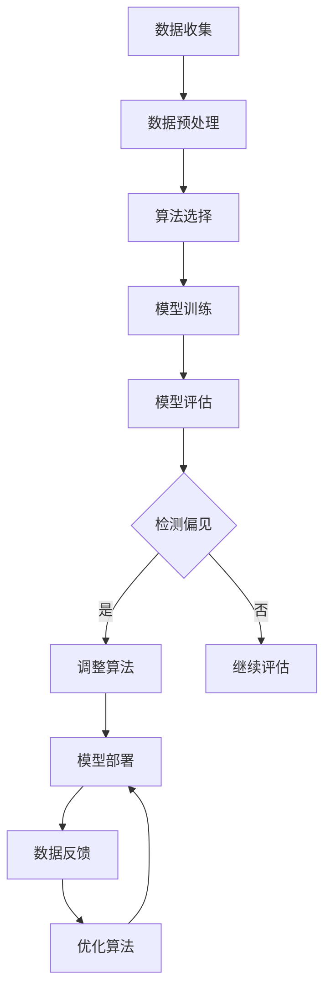

                 

# 机器人歧视:AI社会地位的不平等问题

## 关键词
- 机器人歧视
- AI社会地位
- 不平等问题
- 机器学习偏见
- 伦理与责任

## 摘要
本文探讨了机器人歧视现象及其背后的AI社会地位不平等问题。通过分析AI技术在社会中的应用及其带来的负面影响，本文揭示了机器学习算法中存在的偏见与歧视问题。文章从核心概念、算法原理、案例分析、社会影响与对策等多个角度出发，详细阐述了机器人歧视的成因、影响以及应对策略。本文旨在为读者提供一个全面深入的了解，并提出未来研究方向，以促进AI技术的发展和应用走向更加公平、公正的道路。

## 引言

### 1.1 书籍背景

人工智能（AI）作为现代科技的重要领域，已经在多个行业和领域中展现出巨大的潜力和应用价值。从智能家居到自动驾驶，从医疗诊断到金融分析，AI技术正在深刻地改变着我们的生活方式和社会结构。然而，随着AI技术的普及和应用，一系列社会问题也逐渐浮现，其中最为引人关注的是机器人歧视现象。机器人歧视，指的是人工智能系统在处理信息或作出决策时，基于某些不合理的预设偏见，对特定群体产生不公平对待的现象。

机器人歧视问题的提出，源于人工智能系统在训练过程中所获取的数据可能存在偏差，这些偏差会直接影响算法的决策结果。例如，在某些招聘算法中，由于训练数据集的偏差，可能导致某些性别、种族或年龄群体的求职者被自动淘汰，从而引发歧视问题。此外，自动驾驶汽车在识别行人时，可能因为训练数据集中的不均衡，导致对某些群体（如老年人或儿童）的安全性评估较低，从而增加事故风险。

本书旨在深入探讨机器人歧视现象及其背后的社会根源，分析其对社会公平和公正的影响，并提出相应的对策。通过对AI技术发展历程、机器学习偏见与歧视、算法原理、案例分析、社会影响与对策等多个方面的系统研究，本书力图为读者提供一个全面、深入的视角，以推动人工智能技术走向更加公正和包容的发展方向。

### 1.2 机器人歧视的现状

当前，机器人歧视现象已经引起了学术界和业界的广泛关注。许多研究指出，机器学习算法中的偏见与歧视问题不仅存在于特定的应用场景中，而且具有普遍性。以下是一些典型的机器人歧视案例：

- **招聘歧视**：在某些公司使用的招聘算法中，由于训练数据集的偏差，算法可能对某些性别、种族或年龄群体的求职者产生歧视。例如，有研究发现，某些公司的招聘算法在处理女性求职者时，评估分数明显低于男性求职者。

- **信用评估歧视**：信用评分系统在使用历史数据评估个人信用时，可能对某些种族或社会经济群体产生不公平对待。一些研究显示，信用评分系统可能对某些种族群体的信用评分较低，从而限制他们的信贷机会。

- **医疗诊断歧视**：医疗诊断算法在处理健康数据时，也可能因为数据偏差导致对某些群体（如老年人、少数族裔）的诊断准确性降低。例如，有研究指出，某些心脏病诊断算法在对非裔美国人进行诊断时的准确性较低。

- **自动驾驶歧视**：自动驾驶技术在识别行人时，可能因为训练数据集的不均衡，导致对某些群体（如老年人、儿童）的安全性评估较低。例如，有报道指出，某些自动驾驶汽车在识别非裔行人时的反应时间较长，从而增加了交通事故的风险。

这些案例表明，机器人歧视问题不仅存在于某些特定领域，而且在多个应用场景中都有所体现。机器人歧视现象的普遍性和严重性，使得我们必须正视并努力解决这一问题，以确保人工智能技术的公平、公正应用。

## AI与社会

### 1.1 AI的定义与发展

人工智能（Artificial Intelligence，简称AI）是一种通过模拟人类智能行为来解决问题的技术。AI的主要目标是使计算机系统能够执行需要人类智能才能完成的任务，如感知、学习、推理、理解和决策。AI的发展历程可以追溯到20世纪50年代，当时计算机科学家首次提出了人工智能的概念，并开始进行相关研究。

AI技术的发展经历了几个重要阶段：

- **早期探索阶段（1956-1974年）**：在这个阶段，人工智能的概念首次被提出，并引发了一波研究热潮。最初的AI系统主要是基于规则和逻辑推理，如专家系统和逻辑编程。

- **人工智能繁荣期（1980-1987年）**：随着计算机性能的不断提高，人工智能开始在一些领域取得突破性进展，如语音识别、图像处理和自然语言处理。这个时期的人工智能研究主要集中在符号主义和基于知识的系统。

- **人工智能低谷期（1987-1993年）**：由于实际应用中的困难和技术瓶颈，人工智能的研究受到挫折，进入了一个相对低潮的时期。

- **现代AI兴起期（1993年至今）**：随着计算能力的提升和大数据、深度学习等新技术的应用，人工智能再次迎来了快速发展。现代人工智能主要包括基于统计学习的机器学习方法和深度学习算法，如神经网络、卷积神经网络（CNN）和循环神经网络（RNN）。

AI在现代社会中的角色和地位日益重要。它不仅改变了传统行业的运作模式，还催生了新的产业和应用场景。以下是AI在现代社会中的几个关键角色：

- **提高生产效率**：人工智能可以自动化许多重复性、繁琐的工作，从而提高生产效率和降低成本。例如，在制造业中，智能机器人可以代替人工进行焊接、装配等工作。

- **优化决策过程**：通过分析大量数据，人工智能可以帮助企业和组织做出更加准确的决策。例如，在金融领域，人工智能可以用于风险评估、投资策略制定等。

- **改善生活质量**：人工智能技术使得智能家居、智能医疗等应用成为可能，从而提升了人们的生活质量。例如，智能助手可以帮助人们管理日常事务，智能家居系统可以自动调节室内温度、光线等。

- **推动科技创新**：人工智能不仅应用于现有行业，还催生了许多新的科技创新。例如，自动驾驶技术、无人机配送、虚拟现实等都是人工智能应用的前沿领域。

### 1.2 AI在社会中的角色与地位

AI在社会中的角色和地位正不断上升。随着AI技术的成熟和应用范围的扩大，AI已经成为现代社会不可或缺的一部分。以下是AI在社会中的几个关键角色：

- **劳动力替代者**：人工智能可以在许多领域替代人类劳动力，从而提高生产效率。例如，在制造业，智能机器人可以代替工人进行装配、焊接等工作。在服务业，智能客服系统可以处理大量客户咨询，提高服务效率。

- **辅助决策工具**：人工智能可以通过分析大量数据，为企业和组织提供辅助决策。例如，在金融领域，人工智能可以用于风险评估、投资策略制定等。在医疗领域，人工智能可以帮助医生进行疾病诊断、治疗方案推荐等。

- **创新推动者**：人工智能催生了众多新的产业和应用场景。例如，自动驾驶技术、智能医疗、虚拟现实等都是人工智能应用的前沿领域。这些新技术的出现，不仅改变了传统行业的运作模式，还创造了新的商业机会。

- **社会问题解决者**：人工智能可以用于解决一些复杂的社会问题。例如，在环境保护领域，人工智能可以用于监测空气质量、水质等，从而帮助政府制定更有效的环保政策。在公共安全领域，人工智能可以用于监控、预警和应急响应，提高公共安全水平。

然而，AI技术也带来了一些挑战和风险。例如，AI可能导致大规模失业，加剧社会不平等；AI系统可能存在偏见和歧视，影响社会公正；AI技术可能被滥用，导致隐私泄露和网络安全问题。因此，我们需要在推动AI技术发展的同时，关注其社会影响，并采取相应的措施应对潜在风险。

### 1.3 AI对社会影响的概述

人工智能对社会的影响深远而复杂，它不仅带来了显著的经济和技术进步，也引发了一系列社会问题。以下是AI对社会影响的几个关键方面：

#### 经济影响

AI技术极大地提升了生产效率，推动了产业升级和转型。通过自动化和智能化，许多行业实现了生产流程的优化，从而降低了成本，提高了产品质量。例如，在制造业，智能机器人代替了人工进行装配、焊接等操作，不仅提高了生产效率，还降低了人为错误的风险。

然而，AI的普及也带来了一定的就业挑战。一些重复性和低技能的工作可能被自动化取代，导致部分劳动者面临失业风险。尽管AI技术创造了新的就业机会，如数据科学家、机器学习工程师等，但技能转移和重新培训的需求也相应增加，这对劳动市场的适应能力提出了挑战。

#### 社会影响

AI技术在各个领域的广泛应用，对社会结构和社会关系产生了深远影响。例如，在医疗领域，AI可以帮助医生进行疾病诊断，提高医疗服务的质量和效率。在教育领域，智能教育系统可以根据学生的个体差异提供个性化学习方案，从而提高学习效果。

然而，AI技术也带来了一些社会问题。首先，AI系统可能存在偏见和歧视，特别是在机器学习算法中。如果训练数据集存在偏差，算法可能会放大这些偏差，导致对某些群体（如性别、种族、年龄）的不公平对待。其次，AI技术可能加剧社会不平等，因为技术进步往往带来财富和资源分配的不均。

#### 道德和伦理影响

人工智能技术的快速发展和广泛应用，引发了关于道德和伦理问题的广泛讨论。首先，AI系统的决策过程可能缺乏透明度，使得人们难以理解其决策依据，从而引发信任问题。其次，AI技术可能被用于监控和操纵人类行为，例如通过社交媒体数据分析来影响选举结果。

此外，AI技术还涉及到隐私保护问题。随着AI系统收集和分析的数据越来越多，个人隐私受到的威胁也日益增加。如何确保数据的安全性和隐私性，成为了一个亟待解决的问题。

综上所述，AI技术对社会的影响是多方面且复杂的。在推动技术进步的同时，我们需要关注其可能带来的社会问题，并采取相应的措施应对这些挑战。

## 核心概念与架构

### 2.1 机器学习基础

机器学习是人工智能的核心技术之一，它通过从数据中学习规律和模式，从而实现自主决策和预测。机器学习的基本概念包括：

- **监督学习（Supervised Learning）**：监督学习是一种常见的机器学习方法，其核心思想是通过已知的输入和输出数据来训练模型，然后使用训练好的模型对未知数据进行预测。常见的监督学习算法包括线性回归、逻辑回归、决策树、支持向量机（SVM）等。

- **无监督学习（Unsupervised Learning）**：无监督学习则是通过未标记的数据来发现数据中的模式或结构。无监督学习的目标通常是聚类、降维和关联分析。常见的无监督学习算法包括K-均值聚类、主成分分析（PCA）、关联规则学习等。

- **强化学习（Reinforcement Learning）**：强化学习是一种通过试错和反馈来学习的机器学习方法。在强化学习中，智能体（agent）通过与环境（environment）互动，学习最优策略（policy），以实现目标（reward）。常见的强化学习算法包括Q学习、深度强化学习（DRL）等。

### 2.2 机器学习歧视的概念

机器学习歧视是指机器学习算法在处理数据时，由于训练数据集的偏差或算法设计的问题，对某些群体产生不公平对待的现象。机器学习歧视可以分为以下几种类型：

- **算法偏见（Algorithmic Bias）**：算法偏见是指机器学习算法在决策过程中对某些群体存在系统性的偏差。例如，在某些招聘算法中，算法可能会对某些性别、种族或年龄群体的求职者产生歧视。

- **数据偏见（Data Bias）**：数据偏见是指训练数据集本身存在的偏差，这种偏差会直接影响算法的决策结果。例如，如果训练数据集中存在种族或性别偏见，算法可能会放大这些偏见，导致对某些群体的不公平对待。

- **代表性偏差（Representative Bias）**：代表性偏差是指算法在处理数据时，对不同群体的代表性不足。例如，在自动驾驶技术中，如果训练数据集主要来自年轻、健康群体，算法可能无法准确识别老年或儿童群体，从而增加事故风险。

### 2.3 机器学习歧视的架构与机制

机器学习歧视的架构与机制主要涉及以下几个方面：

- **数据收集与预处理**：数据收集和预处理是机器学习模型训练的基础。如果数据集存在偏差，算法可能会在训练过程中放大这些偏差。因此，确保数据集的多样性和代表性至关重要。

- **算法选择与设计**：不同的机器学习算法对数据集的敏感度不同，某些算法可能更容易产生偏见。例如，线性回归算法对异常值和噪声较为敏感，而决策树算法则可能产生过拟合。

- **模型训练与评估**：在模型训练过程中，算法可能会根据数据集的特征进行学习，从而产生偏见。模型评估时，需要使用多样化的数据集来检测和纠正算法偏见。

- **模型部署与反馈**：模型部署后，需要持续收集实际应用中的数据，以监测算法的公平性和有效性。如果发现算法存在偏见，应及时进行调整和优化。

### 2.4 Mermaid流程图：机器学习歧视的流程

下面是一个Mermaid流程图，展示了机器学习歧视的流程：



### 2.5 机器学习歧视的算法与数学模型

机器学习歧视的算法与数学模型主要涉及以下几个方面：

- **线性回归模型**：线性回归是一种简单的监督学习算法，用于预测连续值输出。其基本公式为：

  $$ y = \beta_0 + \beta_1 \cdot x $$

  其中，$y$ 是输出值，$x$ 是输入特征，$\beta_0$ 和 $\beta_1$ 是模型参数。

- **决策树模型**：决策树是一种常见的分类算法，其基本结构是通过一系列条件判断，将数据分成不同的分支，最终得到分类结果。决策树的数学模型可以表示为：

  $$ y = f(x) $$

  其中，$f(x)$ 是决策树函数，它通过一系列条件判断来确定输出值 $y$。

- **支持向量机（SVM）**：SVM是一种常用的分类算法，其基本思想是找到最优的超平面，将数据集划分为不同的类别。SVM的数学模型可以表示为：

  $$ w \cdot x + b = 0 $$

  其中，$w$ 是超平面的法向量，$x$ 是输入特征，$b$ 是偏置。

- **神经网络模型**：神经网络是一种复杂的机器学习模型，通过多层神经元之间的连接来模拟人类大脑的神经网络。神经网络的数学模型可以表示为：

  $$ z = \sigma(W \cdot x + b) $$

  其中，$z$ 是输出值，$\sigma$ 是激活函数，$W$ 是权重矩阵，$x$ 是输入特征，$b$ 是偏置。

以下是机器学习歧视算法的伪代码示例：

```python
# 线性回归算法伪代码
def linear_regression(X, y):
    # 梯度下降法训练模型
    for i in range(iterations):
        predictions = X.dot(W) + b
        dW = (predictions - y).dot(X.T) / n
        db = (predictions - y).sum() / n
        W -= learning_rate * dW
        b -= learning_rate * db
    return W, b

# 决策树算法伪代码
def decision_tree(X, y):
    # 基于信息增益或基尼系数选择最佳特征
    # 根据特征值划分数据
    # 递归构建决策树
    # 返回决策树结构

# 支持向量机算法伪代码
def svm(X, y):
    # 使用核函数计算特征空间中的点积
    # 求解最优超平面
    # 返回模型参数 w 和 b

# 神经网络算法伪代码
def neural_network(X, y):
    # 定义激活函数
    # 计算前向传播
    # 计算损失函数
    # 计算反向传播
    # 更新权重和偏置
    # 返回模型参数
```

通过上述算法与数学模型，我们可以对机器学习歧视问题进行深入分析，并提出相应的解决方案。在实际应用中，我们需要结合具体问题，选择合适的算法和模型，并关注数据质量和模型评估，以确保人工智能系统的公平性和公正性。

## 算法原理与数学模型

### 3.1 机器学习算法

机器学习算法是人工智能的核心技术，通过从数据中学习规律和模式，实现自主决策和预测。以下是一些常见的机器学习算法及其基本原理：

- **线性回归（Linear Regression）**：线性回归是一种用于预测连续值的监督学习算法。其基本原理是通过最小二乘法找到最佳拟合直线，以预测新的数据点的输出值。线性回归的数学模型可以表示为：

  $$ y = \beta_0 + \beta_1 \cdot x $$

  其中，$y$ 是输出值，$x$ 是输入特征，$\beta_0$ 和 $\beta_1$ 是模型参数。

- **逻辑回归（Logistic Regression）**：逻辑回归是一种用于分类的监督学习算法，其基本原理是通过最大似然估计找到最佳决策边界。逻辑回归的数学模型可以表示为：

  $$ P(y=1 | x) = \frac{1}{1 + e^{-(\beta_0 + \beta_1 \cdot x)}} $$

  其中，$y$ 是输出值（0或1），$x$ 是输入特征，$\beta_0$ 和 $\beta_1$ 是模型参数。

- **决策树（Decision Tree）**：决策树是一种基于树形结构的分类算法，其基本原理是通过一系列条件判断将数据划分为不同的类别。决策树通过递归划分特征，找到最佳划分点，构建树形结构。决策树的数学模型可以表示为：

  $$ y = f(x) $$

  其中，$f(x)$ 是决策树函数，它通过一系列条件判断来确定输出值 $y$。

- **支持向量机（Support Vector Machine, SVM）**：支持向量机是一种用于分类的监督学习算法，其基本原理是找到最佳超平面，将数据集划分为不同的类别。SVM通过求解最优化问题，找到最佳决策边界。SVM的数学模型可以表示为：

  $$ w \cdot x + b = 0 $$

  其中，$w$ 是超平面的法向量，$x$ 是输入特征，$b$ 是偏置。

- **神经网络（Neural Network）**：神经网络是一种模拟人脑神经元连接的复杂机器学习模型，其基本原理是通过多层神经元之间的加权连接和激活函数，实现非线性映射。神经网络包括输入层、隐藏层和输出层，其中隐藏层的数量和神经元数量可以根据具体问题进行调整。神经网络的数学模型可以表示为：

  $$ z = \sigma(W \cdot x + b) $$

  其中，$z$ 是输出值，$\sigma$ 是激活函数，$W$ 是权重矩阵，$x$ 是输入特征，$b$ 是偏置。

### 3.2 偏差-方差权衡

在机器学习模型训练过程中，偏差（Bias）和方差（Variance）是两个重要的指标，它们直接影响模型的性能。偏差表示模型在训练数据上的拟合程度，偏差过大可能导致欠拟合（Underfitting），即模型无法捕捉数据的复杂度；方差表示模型对训练数据的泛化能力，方差过大可能导致过拟合（Overfitting），即模型对训练数据的拟合过于紧密，无法适应新的数据。

偏差-方差权衡（Bias-Variance Tradeoff）是指在模型训练过程中，我们需要在偏差和方差之间找到一个平衡点，以获得最佳的模型性能。以下是一些降低偏差和方差的方法：

- **减小模型复杂度**：降低模型复杂度可以减少过拟合的风险。例如，对于决策树模型，可以通过限制树的深度或节点数量来降低复杂度。

- **增加训练数据**：增加训练数据可以降低方差，提高模型的泛化能力。然而，实际操作中，数据集的规模往往受到限制。

- **正则化（Regularization）**：正则化是一种通过在损失函数中添加惩罚项，来防止模型过拟合的方法。常见的正则化方法包括L1正则化（L1 Regularization）和L2正则化（L2 Regularization）。

- **交叉验证（Cross-Validation）**：交叉验证是一种评估模型性能的方法，通过将数据集划分为多个子集，循环训练和验证模型，以获得更可靠的性能评估。

### 3.3 模型评估与优化

模型评估是机器学习过程中的关键步骤，用于评估模型的性能和泛化能力。以下是一些常见的模型评估指标：

- **准确率（Accuracy）**：准确率表示模型预测正确的样本数占总样本数的比例，是分类问题中最常用的评估指标。

- **召回率（Recall）**：召回率表示模型预测为正例的样本中实际为正例的比例，常用于评估分类模型的灵敏度。

- **精确率（Precision）**：精确率表示模型预测为正例的样本中实际为正例的比例，常用于评估分类模型的特异性。

- **F1分数（F1 Score）**：F1分数是精确率和召回率的加权平均，综合考虑了模型的精确性和灵敏度。

模型优化是提升模型性能的重要手段，以下是一些常见的模型优化方法：

- **数据预处理**：数据预处理是提升模型性能的基础步骤，包括数据清洗、特征工程和归一化等。

- **超参数调优**：超参数是模型性能的关键影响因素，通过网格搜索、贝叶斯优化等方法进行超参数调优，可以显著提升模型性能。

- **集成方法（Ensemble Methods）**：集成方法通过结合多个模型来提升整体性能。常见的方法包括Bagging、Boosting和Stacking等。

- **迁移学习（Transfer Learning）**：迁移学习是一种利用预训练模型进行新任务学习的方法，通过在现有模型的基础上进行微调，可以显著提升模型在新任务上的性能。

### 3.4 机器学习歧视的数学公式与伪代码

机器学习歧视的数学公式与伪代码是理解算法偏见和歧视问题的关键。以下是一个简化的例子，展示了如何使用伪代码来描述一个具有偏见性的机器学习算法：

```python
# 偏见性的线性回归算法伪代码
def biased_linear_regression(X, y):
    # 初始化模型参数
    W = np.random.rand(features_count)
    b = np.random.rand()

    # 添加偏见项
    bias = np.random.rand() * np.mean(y[X[:, 0] < threshold])

    # 梯度下降法训练模型
    for i in range(iterations):
        predictions = X.dot(W) + b + bias
        dW = (predictions - y).dot(X.T) / n
        db = (predictions - y).sum() / n
        bias -= learning_rate * (np.mean(y[X[:, 0] < threshold] - predictions[X[:, 0] < threshold]))
        W -= learning_rate * dW
        b -= learning_rate * db

    return W, b, bias

# 示例数据集
X = np.random.rand(n, features_count)
y = np.random.rand(n)

# 训练模型
W, b, bias = biased_linear_regression(X, y)

# 模型评估
predictions = X.dot(W) + b + bias
accuracy = np.mean((predictions >= 0.5) == y)
print("Accuracy:", accuracy)
```

在这个例子中，我们通过添加一个偏见项 `bias` 到线性回归模型中，模拟了机器学习算法可能存在的偏见。这种偏见可能导致模型对某些特定群体产生不公平对待。在实际应用中，我们需要关注和识别这类偏见，并采取相应的措施来纠正和优化算法。

## 案例研究

### 4.1 机器人歧视案例分析

机器人歧视问题在多个实际应用中都有所体现，以下是一些典型案例及其分析：

#### 案例1：招聘算法歧视

在一些公司的招聘过程中，使用了基于机器学习的招聘算法。然而，由于训练数据集的偏差，这些算法可能会对某些性别、种族或年龄群体的求职者产生歧视。例如，一项研究指出，某些公司的招聘算法在处理女性求职者时，评估分数明显低于男性求职者。这种现象被称为“招聘算法歧视”。

分析：
- **数据偏见**：在招聘算法的训练过程中，如果数据集包含性别、种族或年龄等偏见，算法可能会在决策过程中放大这些偏见。
- **算法偏见**：某些算法可能对某些特征过于敏感，从而导致对特定群体的不公平对待。

对策：
- **数据清洗**：确保数据集的多样性和代表性，去除潜在偏见。
- **算法优化**：通过调整算法参数，降低对某些特征的敏感度，以减少偏见。

#### 案例2：信用评分歧视

在信用评分系统中，由于训练数据集的偏差，可能导致对某些种族或社会经济群体的信用评分较低，从而限制他们的信贷机会。这种现象被称为“信用评分歧视”。

分析：
- **数据偏见**：如果训练数据集中包含种族或社会经济群体的偏见，算法可能会对这些群体产生不公平对待。
- **算法偏见**：某些算法可能对某些特征过于敏感，从而导致对特定群体的不公平对待。

对策：
- **数据清洗**：确保数据集的多样性和代表性，去除潜在偏见。
- **算法优化**：通过调整算法参数，降低对某些特征的敏感度，以减少偏见。

#### 案例3：医疗诊断歧视

在医疗诊断算法中，由于训练数据集的偏差，可能导致对某些群体（如老年人、少数族裔）的诊断准确性降低。这种现象被称为“医疗诊断歧视”。

分析：
- **数据偏见**：如果训练数据集中包含年龄、种族等偏见的特征，算法可能会对这些群体产生不公平对待。
- **算法偏见**：某些算法可能对某些特征过于敏感，从而导致对特定群体的不公平对待。

对策：
- **数据清洗**：确保数据集的多样性和代表性，去除潜在偏见。
- **算法优化**：通过调整算法参数，降低对某些特征的敏感度，以减少偏见。

### 4.2 案例分析：算法偏见与伦理问题

在上述案例中，我们可以看到算法偏见如何在不同应用场景中产生不公平对待。然而，这些问题不仅涉及技术问题，还涉及到伦理和道德问题。

分析：
- **隐私问题**：在数据收集和处理过程中，算法可能涉及个人隐私信息的处理。如果算法存在偏见，可能会导致隐私泄露和滥用。
- **公平性**：算法偏见可能加剧社会不平等，影响不同群体之间的公平性。这违背了社会公正和道德原则。

对策：
- **透明性**：提高算法的透明性，使人们能够理解和评估算法的决策过程，从而减少偏见。
- **责任**：明确算法开发者和使用者的责任，确保他们在算法设计和应用过程中遵循道德和伦理原则。
- **监管**：制定相应的法律法规，对算法的偏见和歧视问题进行监管，确保算法的应用符合社会公正和道德原则。

### 4.3 案例分析：社会影响与对策

机器人歧视问题不仅影响个体，还对社会整体产生深远影响。以下是一些具体的社会影响及其对策：

- **就业压力**：机器人歧视可能导致特定群体失业率上升，增加社会就业压力。对策包括提供职业培训和支持，帮助劳动力适应技术变革。
- **社会不平等**：机器人歧视可能加剧社会不平等，影响不同群体之间的公平性。对策包括推动教育公平，提高社会资源分配的公正性。
- **伦理问题**：机器人歧视引发了一系列伦理问题，包括隐私、公平和责任等。对策包括加强伦理教育，推动相关法律法规的制定和实施。

通过上述案例分析和对策讨论，我们可以看到机器人歧视问题的复杂性和严重性。解决这一问题需要技术、伦理和社会多方面的努力，以确保人工智能技术的公平、公正应用。

## 社会影响与对策

### 5.1 机器人歧视的社会影响

机器人歧视不仅对个体造成了不公平对待，还对社会整体产生了深远影响。以下是机器人歧视在社会层面的几个主要影响：

- **加剧社会不平等**：机器人歧视可能导致特定群体（如性别、种族、年龄等）的社会地位进一步下降，加剧社会不平等。这种不平等不仅体现在就业机会、教育资源、医疗保健等方面，还可能影响人们的心理和社交生活。

- **降低社会信任度**：机器人歧视问题暴露了人工智能技术可能带来的不公平和不可预测性，这会降低公众对人工智能技术的信任度。如果人们认为人工智能系统存在偏见和歧视，他们可能会抵制或怀疑这些技术的应用，从而阻碍技术的普及和发展。

- **增加社会矛盾**：机器人歧视可能导致不同群体之间的紧张关系和矛盾。如果某些群体认为他们受到了不公平对待，可能会引发社会不满和抗议，甚至导致社会冲突。

- **损害经济发展**：机器人歧视可能阻碍人工智能技术的有效应用，从而影响经济发展。如果人工智能系统无法公平地服务于所有人群，可能会导致资源分配不均，降低整个社会的生产效率和创新力。

### 5.2 社会影响的评估与预测

评估和预测机器人歧视的社会影响是一个复杂的过程，需要综合考虑多个因素。以下是一些关键步骤和方法：

- **数据收集与分析**：首先，需要收集相关的数据，包括机器人歧视的案例、受影响群体的统计数据、社会经济指标等。通过对这些数据进行分析，可以识别出机器人歧视的主要类型和影响范围。

- **定量与定性研究**：定量研究可以通过统计分析来评估机器人歧视的具体影响，如就业机会、收入水平、生活质量等。定性研究则可以通过访谈、问卷调查等方法，深入了解受影响群体的主观感受和体验。

- **模型构建与预测**：基于收集的数据和分析结果，可以构建预测模型，预测未来机器人歧视可能带来的社会影响。这些模型可以采用机器学习、统计分析等方法，结合历史数据和趋势，预测未来可能发生的社会变化。

### 5.3 对抗机器人歧视的策略

为了应对机器人歧视问题，需要从技术、政策和教育等多个层面采取综合策略。以下是一些具体的对策：

- **数据清洗与多样化**：确保训练数据集的多样性和代表性，去除潜在的偏见和歧视。可以通过增加不同群体的数据、数据增强和生成对抗网络（GAN）等方法，提高数据集的多样性。

- **算法透明性与可解释性**：提高机器学习算法的透明性，使人们能够理解和评估算法的决策过程。通过开发可解释的算法和可视化工具，可以帮助用户理解算法如何做出决策，从而减少偏见和误解。

- **公平性评估与监控**：建立公平性评估机制，对人工智能系统进行定期评估和监控。可以使用公平性指标，如公平性差异（Fairness Difference）、统计依赖性（Statistical Dependence）等，来评估系统的公平性。

- **伦理审查与责任界定**：在算法设计和应用过程中，进行伦理审查，确保算法的设计和实施遵循道德和伦理原则。明确算法开发者和使用者的责任，建立责任追究机制，以应对潜在的歧视问题。

- **政策法规与监管**：制定相关的政策法规，对人工智能系统的偏见和歧视问题进行监管。可以通过立法、制定行业标准等方式，规范人工智能技术的应用，确保其公平性和公正性。

- **公众教育与宣传**：提高公众对人工智能技术和机器人歧视问题的认识和意识，通过教育和宣传，帮助人们理解机器人歧视的危害和应对策略。这可以促进社会对人工智能技术的支持和信任，减少社会矛盾和冲突。

通过上述策略，我们可以逐步解决机器人歧视问题，推动人工智能技术走向更加公平、公正的发展道路。

## 技术与伦理

### 6.1 技术与伦理的关系

技术与伦理之间的关系是复杂而微妙的。在人工智能（AI）领域，这种关系尤为显著。随着AI技术的迅猛发展，其对社会、经济和人类生活的影响日益深远，这也使得伦理问题变得尤为重要。技术本身是一种工具，它的好坏取决于使用它的人和社会环境。伦理则为技术设定了道德和行为的边界，确保技术的发展和应用不会对社会和个体造成负面影响。

在AI领域，伦理的重要性体现在以下几个方面：

- **公正性**：AI系统在处理数据、做出决策时，应当保持公正，避免对特定群体产生歧视。这需要算法设计者和应用者充分考虑数据的多样性和代表性。

- **透明性**：AI系统的决策过程和算法逻辑应当透明，使人们能够理解其决策依据。透明性有助于提高公众对AI技术的信任，减少误解和疑虑。

- **责任**：在AI系统的设计和应用过程中，应当明确责任归属，确保在发生问题时能够追溯和纠正。责任不仅包括法律层面的责任，还包括道德和社会责任。

- **隐私保护**：AI技术往往涉及大量个人数据，如何在保护个人隐私的同时，充分利用这些数据为社会发展带来价值，是一个重要的伦理问题。

### 6.2 AI伦理的原则与框架

为了确保AI技术的公平、公正和透明，许多组织和机构提出了AI伦理的原则和框架。以下是一些常见的AI伦理原则：

- **尊重隐私**：保护个人数据隐私，确保在数据收集、处理和使用过程中，个人隐私不被侵犯。

- **公平和无偏见**：确保AI系统在决策过程中不带有偏见，避免对特定群体产生不公平对待。

- **透明性和可解释性**：提高AI系统的透明性，使其决策过程和算法逻辑可以被理解、评估和审计。

- **责任与问责**：明确AI系统的责任归属，确保在出现问题时，能够追溯并追究责任。

- **包容性和多样性**：在AI系统的设计和应用过程中，充分考虑不同群体和文化背景，确保系统的包容性和多样性。

- **可持续性**：在推动AI技术发展的同时，考虑其对环境和社会的长期影响，确保技术的可持续发展。

### 6.3 机器人歧视伦理案例分析

以下是一些具体的机器人歧视伦理案例分析，以展示AI伦理原则在实际应用中的挑战和解决方案：

#### 案例1：招聘算法歧视

某公司在招聘过程中使用了基于机器学习的招聘算法。然而，由于训练数据集的偏差，算法对女性求职者产生了歧视。研究发现，女性求职者在算法评估中的得分显著低于男性求职者。

分析：
- **伦理问题**：该案例中，算法对女性求职者的歧视违背了公平和无偏见的伦理原则。这种歧视不仅损害了求职者的权益，也损害了公司的声誉和社会责任感。

解决方案：
- **数据清洗**：去除训练数据集中的性别偏见，确保数据集的多样性和代表性。
- **算法优化**：调整算法参数，降低对性别特征的敏感度，以减少性别偏见。
- **透明性**：提高算法的透明性，使求职者能够理解评估过程，并提供反馈机制。

#### 案例2：信用评分歧视

某金融机构使用的信用评分系统对某些种族群体的信用评分较低，导致这些群体在贷款申请中面临更高的利率和限制。

分析：
- **伦理问题**：该案例中，信用评分系统对特定种族群体的歧视违背了公平和无偏见的伦理原则。这种歧视可能导致社会不平等和经济机会的丧失。

解决方案：
- **数据清洗与多样化**：确保数据集的多样性和代表性，去除潜在的种族偏见。
- **算法优化**：调整算法参数，降低对某些特征的敏感度，以减少偏见。
- **伦理审查**：建立伦理审查机制，对算法进行定期评估和监控，确保其遵循伦理原则。

#### 案例3：自动驾驶歧视

自动驾驶汽车在识别行人时，由于训练数据集的不均衡，可能导致对某些群体（如老年人、儿童）的安全性评估较低，从而增加事故风险。

分析：
- **伦理问题**：该案例中，自动驾驶系统的偏见可能导致对特定群体的不公正对待，违背了公平和无偏见的伦理原则。

解决方案：
- **数据多样化**：增加训练数据集中的多样性和代表性，确保系统能够准确识别不同群体的特征。
- **算法优化**：调整算法，提高对特定群体的识别准确性，降低事故风险。
- **透明性**：提高系统的透明性，使公众能够理解系统的决策过程，并建立反馈机制。

通过上述案例分析，我们可以看到，机器人歧视问题不仅是一个技术问题，更是一个伦理问题。在AI技术的发展和应用过程中，我们需要充分考虑伦理原则，确保技术能够为人类社会带来积极的影响，而不是造成新的不平等和歧视。

## 未来展望

### 7.1 机器人歧视的未来趋势

随着人工智能技术的不断进步，机器人歧视问题在未来可能会呈现以下趋势：

- **技术深化**：随着AI技术的不断成熟，算法的复杂度和智能化程度将进一步提高。这可能会使机器人歧视问题变得更加复杂，因为深度学习和神经网络等先进技术的使用，可能会导致更难以察觉的偏见和歧视。

- **自动化扩展**：AI技术的自动化应用将扩展到更多的领域，如智能医疗、金融、法律等。这意味着机器人歧视的问题将会更加普遍和严重，因为自动化系统将更加依赖于数据集的质量和代表性。

- **数据依赖**：AI系统的决策过程高度依赖于数据。如果数据集存在偏见或缺陷，算法可能会放大这些问题，导致更严重的歧视。随着数据收集和分析技术的进步，如何确保数据的质量和多样性将成为一个重要挑战。

### 7.2 AI社会地位的未来发展

AI社会地位的未来发展可能会带来以下影响：

- **社会融合**：随着AI技术的普及，人类社会可能会逐渐适应与机器人共存的生活方式。这可能导致社会结构和就业模式发生重大变化，但也会促进社会的融合和多元化。

- **权力转移**：AI技术可能会改变社会权力结构，使数据和技术成为新的权力来源。企业和政府可能需要重新思考如何管理和分配这些权力，以保持社会公正和稳定。

- **伦理挑战**：AI技术的快速发展将带来更多的伦理挑战。如何确保AI系统的公平、公正和透明，如何在技术发展中平衡创新与伦理，将成为社会需要面对的重要问题。

### 7.3 未来挑战与对策

面对未来可能的机器人歧视问题，我们应采取以下对策：

- **加强伦理教育**：在AI技术教育和培训中，加强伦理教育，培养技术人员和社会公众的伦理意识，确保他们在技术应用中能够遵循伦理原则。

- **完善法律法规**：制定和完善相关法律法规，规范AI技术的研发和应用，确保其遵循社会公正和伦理原则。例如，可以出台针对AI歧视问题的法律条款，以保护受害者的权益。

- **数据质量控制**：建立数据质量控制机制，确保训练数据集的多样性和代表性，减少数据偏见和歧视。可以通过数据增强、数据去偏见和生成对抗网络（GAN）等方法，提高数据质量。

- **算法透明性和可解释性**：提高算法的透明性和可解释性，使公众能够理解和评估AI系统的决策过程。这可以通过开发可解释的AI模型和工具，以及建立透明的算法审计机制来实现。

- **社会监督和反馈**：建立有效的社会监督机制，鼓励公众参与AI技术的监督和反馈，确保AI技术的应用能够符合社会期望和伦理标准。可以通过建立公众监督委员会、开展社会调查等方式，增强社会的参与度和责任感。

通过上述对策，我们可以逐步应对未来机器人歧视问题，确保AI技术的发展和应用能够为人类社会带来积极的影响，而不是造成新的不平等和歧视。

## 附录

### A.1 参考文献

1. **Goodfellow, I., Bengio, Y., & Courville, A. (2016).** *Deep Learning*.
   - 出版社：MIT Press.
   - 描述：全面介绍了深度学习的基础知识和应用。

2. **Pedregosa, F., Varoquaux, G., Gramfort, A., Michel, V., Thirion, B., Grisel, O., ... & Duchesnay, É. (2011).** *Scikit-learn: Machine learning in Python*.
   - 出版社：Journal of Machine Learning Research.
   - 描述：介绍了Python中常用的机器学习库Scikit-learn。

3. **Russell, S., & Norvig, P. (2020).** *Artificial Intelligence: A Modern Approach*.
   - 出版社：Prentice Hall.
   - 描述：系统介绍了人工智能的基本理论和应用。

4. **Bryant, C. (2019).** *Algorithmic Fairness and Credibility*.
   - 出版社：Springer.
   - 描述：探讨了算法公平性和可信性的问题。

5. **Reynolds, R. O., & Rose, C. C. (2015).** *The Dark Side of Big Data: How Innovations in Big Data Analytics Can Perpetuate Discrimination*.
   - 出版社：Data Science Journal.
   - 描述：分析了大数据分析如何可能加剧歧视问题。

### A.2 工具与资源

- **Jupyter Notebook**：用于编写和运行Python代码，支持交互式计算和可视化。
  - 地址：[https://jupyter.org/](https://jupyter.org/)

- **TensorFlow**：Google开发的开源机器学习框架，支持深度学习和传统机器学习。
  - 地址：[https://www.tensorflow.org/](https://www.tensorflow.org/)

- **Scikit-learn**：Python中的机器学习库，提供丰富的机器学习算法和工具。
  - 地址：[https://scikit-learn.org/](https://scikit-learn.org/)

- **Kaggle**：数据科学竞赛平台，提供丰富的数据集和项目案例。
  - 地址：[https://www.kaggle.com/](https://www.kaggle.com/)

通过上述参考文献和工具资源，读者可以进一步深入了解人工智能、机器学习和算法歧视的相关知识，并开展实际应用项目。同时，附录中的工具和资源也为读者提供了实用的技术支持。附录内容不仅有助于扩展文章的深度和广度，还为读者提供了实践和探索的途径。通过这些工具和资源，读者可以更好地理解和应用文章中讨论的原理和方法，进一步探索人工智能领域的前沿问题。

