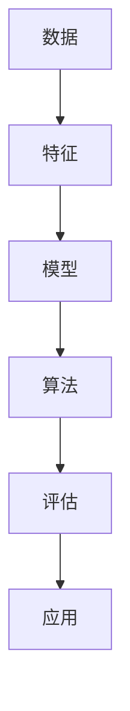

                 

### 文章标题

# 机器学习在保险定价中的应用：个性化保费计算

## 关键词

- 机器学习
- 保险定价
- 个性化保费
- 数据分析
- 算法应用

## 摘要

本文旨在探讨机器学习在保险定价中的应用，特别是个性化保费计算的重要性。通过介绍机器学习的基础知识，我们揭示了其在保险行业的潜在应用场景。文章重点讨论了个性化保费计算的核心概念、算法原理以及具体实现步骤。通过详细的数据预处理、特征工程和模型训练过程，结合实际案例，本文展示了机器学习如何帮助保险公司提高风险评估的准确性和个性化保费计算的效率。最后，文章提出了实际操作指南，为保险行业从业人员提供了一些建议和最佳实践。

---

### 引言

在当今的数据驱动的商业环境中，保险行业正经历着一场深刻的变革。传统的保费定价模式往往依赖于历史数据和统计方法，这虽然在某种程度上能够捕捉风险，但难以应对日益复杂的风险评估需求。随着机器学习技术的飞速发展，保险公司开始探索如何利用这一先进技术来优化保费定价，实现更加个性化和精准的风险评估。个性化保费计算，作为机器学习在保险行业的一个典型应用，正逐步改变保险业的运营模式和服务水平。

机器学习，作为一种人工智能技术，通过算法和模型从大量数据中自动提取规律和知识，已经在多个领域取得了显著的成果。例如，在医疗诊断、金融市场预测和推荐系统中，机器学习都展现出了强大的能力。同样，在保险行业，机器学习同样具有广泛的应用潜力，可以帮助保险公司更准确地评估风险、提高客户满意度并降低运营成本。

本文将围绕机器学习在保险定价中的应用，特别是个性化保费计算，展开深入探讨。首先，我们将介绍机器学习的基本概念和原理，包括监督学习、无监督学习和强化学习等。接着，我们将分析机器学习在保险行业的具体应用场景，如风险评估和个性化保费计算。然后，本文将详细讲解个性化保费计算的核心算法，包括线性回归、决策树、随机森林、支持向量机和神经网络等。在此基础上，我们将讨论数据预处理和特征工程的重要性，并通过实际案例展示机器学习在保险定价中的应用效果。最后，本文将提供一些实践指南，帮助保险公司从业人员更好地应用机器学习技术进行个性化保费计算。

### 机器学习基础

要深入了解机器学习在保险定价中的应用，首先需要掌握机器学习的基本概念和原理。机器学习是一种让计算机通过数据学习并做出决策或预测的技术，它通过算法和模型从数据中自动提取规律和知识，使计算机能够进行自主学习和优化。

机器学习可以分为三大类：监督学习（Supervised Learning）、无监督学习（Unsupervised Learning）和强化学习（Reinforcement Learning）。

#### 监督学习

监督学习是机器学习中应用最广泛的一种类型，它需要使用标记数据进行训练。所谓标记数据，是指每个数据点都有一个已知的输出标签。通过这些标记数据，机器学习算法可以学习到输入和输出之间的映射关系，从而在新数据上进行预测。

监督学习的基本流程包括以下几个步骤：

1. **数据预处理**：包括数据清洗、归一化和缺失值处理等，以确保数据的干净和一致。
2. **特征选择**：从原始数据中选择出对模型训练有用的特征，排除无关或冗余的特征。
3. **模型选择**：选择适合的数据集的模型，如线性回归、决策树、支持向量机等。
4. **模型训练**：使用标记数据对模型进行训练，通过调整模型的参数来优化预测性能。
5. **模型评估**：使用验证集或测试集对训练好的模型进行评估，常用的评估指标包括准确率、召回率、F1分数等。

监督学习算法的一个重要特点是它能够提高预测的准确性。在保险定价中，监督学习可以帮助保险公司预测客户的理赔风险，从而更精确地计算保费。例如，保险公司可以使用客户的个人资料、历史理赔记录和保险购买行为等数据，通过监督学习算法预测客户未来的理赔概率。

#### 无监督学习

无监督学习是另一种重要的机器学习类型，它不需要使用标记数据。无监督学习的目标是发现数据中的隐藏结构或模式，如聚类、降维和关联规则等。

常见的无监督学习算法包括：

1. **聚类算法**：如K-均值聚类、层次聚类等，用于将数据点分组，使得同一组内的数据点相似度较高，不同组的数据点相似度较低。
2. **降维算法**：如主成分分析（PCA）和线性判别分析（LDA）等，用于将高维数据投影到低维空间，减少数据复杂性。
3. **关联规则算法**：如Apriori算法和FP-Growth算法，用于发现数据之间的关联性。

无监督学习在保险定价中的应用相对较少，但在某些场景下也具有重要作用。例如，保险公司可以使用聚类算法将客户群体分为不同的风险等级，以便更精准地进行保费定价。此外，降维算法可以帮助保险公司减少数据复杂性，提高模型训练的效率和准确性。

#### 强化学习

强化学习是机器学习的第三种类型，它通过试错的方式，让智能体在环境中不断学习和优化策略，以达到特定的目标。强化学习的基本流程包括以下几个步骤：

1. **环境定义**：定义智能体所处的环境，包括状态空间、动作空间和奖励机制。
2. **策略学习**：智能体通过与环境互动，学习出一个最优策略，以最大化累积奖励。
3. **策略优化**：根据学习到的策略，智能体在环境中进行行动，并不断优化策略。

强化学习在保险定价中的应用相对较少，但在某些特殊场景下具有一定的潜力。例如，保险公司可以使用强化学习算法来优化保险产品的定价策略，通过不断调整定价参数来提高客户的满意度和利润率。

#### 核心概念与联系

为了更好地理解机器学习在保险定价中的应用，我们需要构建一个核心概念之间的关系架构，以便清晰地展示各个概念之间的联系。

1. **数据**：数据是机器学习的基石，它是训练模型和进行预测的基础。在保险定价中，数据包括客户的个人资料、历史理赔记录、保险购买行为等。
2. **特征**：特征是从数据中提取的有用信息，它们用于训练模型和进行预测。特征的选择和工程对于模型的性能至关重要。
3. **模型**：模型是机器学习的核心，它是通过学习数据中的规律和模式来做出预测的工具。常见的模型包括线性回归、决策树、支持向量机和神经网络等。
4. **算法**：算法是实现机器学习模型的具体实现，它们用于训练模型、优化参数和评估模型性能。常见的算法包括梯度下降、随机梯度下降和感知机等。
5. **评估**：评估是衡量模型性能的重要手段，它通过比较预测结果和真实结果来评估模型的准确性、召回率和F1分数等指标。
6. **应用**：应用是将机器学习技术应用到实际问题中的过程，如保险定价、风险评估和客户行为分析等。

以下是核心概念之间的Mermaid流程图：



通过这个流程图，我们可以清晰地看到数据、特征、模型、算法、评估和应用之间的逻辑关系，这有助于我们更好地理解机器学习在保险定价中的应用。

### 机器学习在保险行业的应用

机器学习在保险行业的应用场景非常广泛，涵盖了风险评估、个性化保费计算、客户行为分析等多个方面。这些应用不仅提升了保险公司的运营效率，还显著改善了客户体验和风险管理能力。

#### 风险评估

在保险行业，风险评估是一个核心环节，它直接影响到保费的计算和保险产品的设计。传统的风险评估方法主要依赖于历史数据和统计模型，如线性回归、决策树等。然而，这些方法往往难以应对日益复杂的风险环境和个性化需求。

机器学习技术的引入为风险评估带来了新的可能性。通过监督学习和无监督学习算法，保险公司可以更加精确地评估客户的风险等级。例如，监督学习算法如逻辑回归、支持向量机和神经网络等，可以基于客户的个人资料、历史理赔记录、保险购买行为等数据，预测客户未来的理赔概率。而无监督学习算法如聚类分析，可以帮助保险公司将客户分为不同的风险群体，从而更精确地定价。

#### 个性化保费计算

个性化保费计算是机器学习在保险行业的另一个重要应用。传统保费定价方法往往采用统一的标准来计算保费，这可能导致某些高风险客户的保费过高，而低风险客户的保费过低。这不仅影响了公司的盈利能力，也可能导致客户的不满。

机器学习技术可以帮助保险公司实现个性化保费计算。通过监督学习算法，保险公司可以基于客户的个人资料、历史理赔记录、保险购买行为等数据，建立个性化的保费计算模型。这些模型能够更加准确地反映客户的风险水平，从而实现更加公平和个性化的保费计算。例如，对于高风险客户，保险公司可以提高保费，而对于低风险客户，保险公司可以降低保费，从而提高客户满意度。

#### 客户行为分析

除了风险评估和个性化保费计算，机器学习还可以用于客户行为分析。通过分析客户的购买行为、理赔记录、客户服务反馈等数据，保险公司可以更好地理解客户需求，提高客户满意度。

机器学习算法可以帮助保险公司发现客户行为中的隐藏模式，从而更好地预测客户的需求和行为。例如，通过聚类分析，保险公司可以将客户分为不同的群体，从而更精准地制定营销策略和服务方案。此外，通过关联规则分析，保险公司可以发现客户购买不同保险产品之间的关系，从而优化产品设计和推广策略。

#### 案例分析

以下是一个机器学习在保险行业应用的案例分析：

某保险公司希望通过机器学习技术优化其风险评估和保费定价流程。该公司收集了大量的客户数据，包括个人资料、历史理赔记录、保险购买行为等。为了建立个性化的保费计算模型，该公司使用了监督学习算法，如逻辑回归和随机森林。

首先，公司对数据进行预处理，包括数据清洗、归一化和缺失值处理等。接着，公司使用特征工程技术，从原始数据中提取出对模型训练有用的特征，如年龄、性别、收入、理赔次数等。

然后，公司使用交叉验证方法对模型进行训练和评估。在训练过程中，公司使用了多个模型，如逻辑回归、决策树、随机森林等，并比较了它们的性能。最终，公司选择了一个综合性能较好的模型，并使用它来进行风险评估和保费计算。

通过这个机器学习项目，公司不仅提高了风险评估的准确性，还实现了个性化的保费计算。客户对保费计算结果的满意度显著提高，公司的盈利能力也得到了提升。

### 个性化保费计算原理

个性化保费计算是机器学习在保险行业中的一项重要应用，其核心目标是通过分析客户的个人数据和风险特征，为每一位客户提供量身定制的保费。下面，我们将详细探讨个性化保费计算的核心概念、核心算法及其工作原理。

#### 核心概念

1. **客户特征**：个性化保费计算的基础是客户的特征数据，这些数据包括客户的年龄、性别、职业、收入水平、病史、驾驶记录等。通过分析这些特征，可以更好地理解客户的风险水平。

2. **风险评分**：风险评分是对客户风险水平的一种量化评估，它通常通过统计模型或机器学习算法计算得出。风险评分越高，客户发生理赔的可能性越大，保费也相应越高。

3. **保费计算**：保费计算是根据风险评分和保险公司的定价策略，为每个客户提供合适的保费金额。个性化的保费计算能够更精准地反映客户的风险水平，提高保险产品的公平性和竞争力。

#### 核心算法

1. **线性回归**：线性回归是一种基本的监督学习算法，用于建立自变量（客户特征）和因变量（风险评分）之间的线性关系。通过最小化损失函数，线性回归模型可以计算出最佳的线性组合，用于预测风险评分。以下是一个简化的线性回归伪代码：

    ```python
    # 数据预处理
    X = 数据特征矩阵
    y = 风险评分向量

    # 梯度下降算法
    for epoch in range(num_epochs):
        predictions = X * weights
        error = predictions - y
        weights = weights - learning_rate * (X.T * error)
    return weights
    ```

2. **决策树**：决策树通过一系列的if-else判断来构建决策路径，从而对数据进行分类或回归。每个节点代表一个特征，每个分支代表一个特征取值，叶节点表示最终的预测结果。以下是一个简化的决策树构建伪代码：

    ```python
    def build_tree(data, features, target):
        if all_values_equal(data[target]):
            return all_values
        else:
            # 选择最优特征
            best_feature = find_best_split(data, features)
            node = {
                'feature': best_feature,
                'children': [
                    build_tree(data[data[best_feature] == value], features, target)
                    for value in data[best_feature].unique()
                ]
            }
            return node
    ```

3. **随机森林**：随机森林是一种集成学习方法，通过构建多棵决策树并对它们的预测结果进行投票来提高模型的泛化能力。随机森林的关键在于随机选择特征和样本子集，以避免过拟合。以下是一个简化的随机森林构建伪代码：

    ```python
    def build_random_forest(data, n_trees, max_features):
        forests = []
        for _ in range(n_trees):
            # 随机选择特征和样本子集
            subset_features = random.sample(features, max_features)
            subset_data = data.sample(frac=1)
            tree = build_tree(subset_data, subset_features, target)
            forests.append(tree)
        return forests
    ```

4. **支持向量机（SVM）**：支持向量机是一种强大的回归和分类算法，它通过寻找一个超平面，使得数据点在超平面上的分布尽可能分开。SVM的关键在于寻找支持向量，即最靠近超平面的数据点。以下是一个简化的SVM回归伪代码：

    ```python
    def SVM_regression(X, y):
        # 求解最优超平面
        alpha = optimize Pradesh_seperator(X, y)
        # 计算回归函数
        weights = sum(alpha[i] * X[i, :] * y[i] for i in range(len(X)))
        return weights
    ```

5. **神经网络**：神经网络是一种模仿人脑神经元连接方式的计算模型，通过多层神经元结构进行复杂函数的拟合。神经网络包括输入层、隐藏层和输出层，每层之间的神经元通过权重连接。以下是一个简化的神经网络训练伪代码：

    ```python
    def train_neural_network(X, y, layers, learning_rate):
        # 前向传播
        outputs, weights = forward_pass(X, layers)
        # 计算损失函数
        loss = compute_loss(y, outputs)
        # 反向传播
        dweights = backward_pass(outputs, weights, X, y, layers, learning_rate)
        return dweights
    ```

#### 算法工作原理

每种算法的工作原理都有所不同，但总体上可以分为以下几个步骤：

1. **数据预处理**：包括数据清洗、归一化和缺失值处理等，确保数据的一致性和干净性。
2. **特征选择**：从原始数据中选择出对模型训练有用的特征，排除无关或冗余的特征。
3. **模型训练**：使用选择的特征和算法对模型进行训练，通过调整模型的参数来优化预测性能。
4. **模型评估**：使用验证集或测试集对训练好的模型进行评估，比较不同模型的性能。
5. **模型应用**：将训练好的模型应用到实际数据中，进行个性化保费计算。

通过这些核心算法，保险公司可以更加精准地评估客户风险，实现个性化保费计算，提高保险产品的竞争力和客户满意度。

### 数据预处理与特征工程

在个性化保费计算中，数据预处理和特征工程是至关重要的步骤。它们不仅影响着机器学习模型的性能，还直接关系到保费计算的准确性。以下将详细探讨数据预处理、特征选择、特征提取和特征变换的方法和重要性。

#### 数据预处理

数据预处理是确保数据质量和一致性的重要步骤。常见的数据预处理方法包括：

1. **数据清洗**：处理缺失值、异常值和重复值。缺失值可以通过填补、删除或插值等方法处理；异常值可以通过统计方法或可视化方法检测并处理；重复值则需要删除，以避免对模型训练造成干扰。

2. **数据归一化**：将数据缩放到相同的尺度，以消除不同特征之间的量纲差异。常用的归一化方法包括最小-最大缩放、Z分数缩放和指数缩放等。

3. **数据标准化**：将数据转换成标准正态分布，以提高模型训练的稳定性。标准化通常使用Z分数方法。

#### 特征选择

特征选择是减少数据维度、提高模型训练效率和准确性的关键步骤。以下是一些常见的特征选择方法：

1. **过滤方法**：根据特征与目标变量之间的相关性进行选择。常用的相关系数、信息增益、卡方检验等。

2. **包装方法**：在模型训练过程中逐步选择特征。常用的方法包括递归特征消除（RFE）、正向选择和反向选择等。

3. **嵌入式方法**：在模型训练过程中自动选择特征。如LASSO、岭回归和随机森林等算法在训练过程中会自动选择重要的特征。

#### 特征提取

特征提取是从原始数据中提取新的特征，以增强模型的泛化能力和表现。以下是一些常见的特征提取方法：

1. **主成分分析（PCA）**：通过线性变换将高维数据投影到低维空间，保留主要的信息，去除冗余信息。

2. **因子分析**：通过提取潜在的因子，将复杂的数据简化，以便更好地理解和分析。

3. **特征变换**：如逻辑回归中的多项式特征变换、箱型图特征变换等，以增加特征之间的非线性关系。

#### 特征变换

特征变换是调整特征值，使其更符合算法的需求。以下是一些常见的特征变换方法：

1. **二值化**：将连续特征转换成离散特征，通常用于处理高斯分布以外的数据。

2. **反规范化**：将归一化后的数据转换回原始尺度，以避免模型因数据尺度变化而失效。

3. **正则化**：通过添加惩罚项，如L1和L2正则化，来防止模型过拟合。

#### 重要性

1. **数据质量**：预处理保证了数据的一致性和干净性，为后续的模型训练提供了可靠的数据基础。

2. **模型性能**：特征选择和提取能够减少数据维度，提高模型训练的效率，同时增强模型的泛化能力。

3. **业务需求**：特征工程可以根据业务需求，提取出对保费计算有重要影响的关键特征，提高保费计算的准确性和个性化程度。

通过数据预处理和特征工程，保险公司可以构建出更加精准和高效的机器学习模型，从而实现个性化保费计算，提高客户满意度和盈利能力。

### 算法选择与模型训练

在个性化保费计算中，算法选择与模型训练是关键步骤，直接影响着模型的性能和预测准确性。以下将详细探讨算法选择的原则、模型训练方法与技巧，以及如何解决过拟合与欠拟合问题。

#### 算法选择原则

1. **数据特征**：根据数据的特征选择合适的算法。例如，对于高维稀疏数据，线性模型如线性回归可能是一个好的选择；而对于非线性和复杂数据，决策树、随机森林和神经网络等可能更为有效。

2. **业务需求**：根据业务需求选择算法。例如，如果需要精确预测，可以使用线性模型；如果需要模型解释性，可以选择决策树；如果需要模型处理大量数据，可以选择随机森林或神经网络。

3. **模型性能**：选择性能较好的算法。可以通过交叉验证等方法对不同算法进行性能评估，选择性能最好的算法。

4. **计算资源**：考虑计算资源限制。一些复杂算法如神经网络可能需要更多的计算资源和时间，而对于实时性要求较高的应用，可以选择计算效率较高的算法。

#### 模型训练方法与技巧

1. **梯度下降**：梯度下降是一种常用的优化算法，用于最小化损失函数。包括批量梯度下降、随机梯度下降和小批量梯度下降等。批量梯度下降计算复杂度高，但收敛速度较慢；随机梯度下降计算复杂度低，但容易发散；小批量梯度下降在两者之间取得平衡。

2. **学习率**：学习率是梯度下降中的重要参数，控制着模型更新的步长。选择合适的学习率能够加速收敛，但过大会导致发散。通常需要通过实验调整学习率，或者使用自适应学习率方法如Adam优化器。

3. **交叉验证**：交叉验证是一种评估模型性能的方法，通过将数据集分成多个子集，轮流进行训练和验证，以避免过拟合。常用的交叉验证方法有K折交叉验证、留一法交叉验证等。

4. **模型融合**：模型融合通过结合多个模型的预测结果来提高整体性能。常见的方法有集成学习、 stacking和 bagging等。

5. **正则化**：正则化是一种防止模型过拟合的技术，通过在损失函数中添加惩罚项来减少模型复杂度。常用的正则化方法有L1正则化（LASSO）和L2正则化（岭回归）。

#### 解决过拟合与欠拟合

1. **过拟合**：过拟合是指模型在训练数据上表现很好，但在测试数据上表现较差。过拟合通常是由于模型复杂度过高导致的。解决方法包括：

   - **减小模型复杂度**：使用更简单的模型或减少模型参数。
   - **正则化**：在损失函数中添加惩罚项。
   - **交叉验证**：使用交叉验证来避免过拟合。
   - **数据增强**：增加训练数据量或使用数据增强技术。

2. **欠拟合**：欠拟合是指模型在训练数据和测试数据上表现都较差。欠拟合通常是由于模型复杂度过低导致的。解决方法包括：

   - **增加模型复杂度**：使用更复杂的模型或增加模型参数。
   - **增加训练数据**：使用更多的训练数据或使用数据增强技术。
   - **调整超参数**：调整模型的超参数，如学习率、正则化强度等。

通过选择合适的算法、采用有效的模型训练方法和技巧，以及解决过拟合和欠拟合问题，保险公司可以构建出高性能的机器学习模型，从而实现更准确的个性化保费计算。

### 模型评估与优化

在个性化保费计算中，模型的评估与优化是确保模型性能和预测准确性的关键步骤。以下将详细讨论模型评估指标、模型优化策略以及如何通过模型融合提高性能。

#### 模型评估指标

1. **准确率（Accuracy）**：准确率是最常用的评估指标，表示正确预测的数量占总预测数量的比例。公式为：
   $$
   \text{Accuracy} = \frac{\text{正确预测的数量}}{\text{总预测数量}}
   $$
   准确率简单直观，但容易受到不平衡数据的影响。

2. **召回率（Recall）**：召回率表示实际正例中被正确预测为正例的比例。公式为：
   $$
   \text{Recall} = \frac{\text{实际正例中被正确预测为正例的数量}}{\text{实际正例总数}}
   $$
   召回率强调了识别所有正例的重要性，但对错误分类的负例不敏感。

3. **精确率（Precision）**：精确率表示预测为正例中实际为正例的比例。公式为：
   $$
   \text{Precision} = \frac{\text{实际正例中被正确预测为正例的数量}}{\text{预测为正例的总数量}}
   $$
   精确率强调了避免错误分类的重要性。

4. **F1分数（F1 Score）**：F1分数是精确率和召回率的加权平均，用于综合评估模型的性能。公式为：
   $$
   \text{F1 Score} = 2 \times \frac{\text{Precision} \times \text{Recall}}{\text{Precision} + \text{Recall}}
   $$
   F1分数在评估模型时提供了更全面的信息。

5. **ROC曲线与AUC值**：ROC曲线是真实值概率与预测值概率的图形表示，AUC值（面积下曲线）表示分类器在所有阈值下的性能。AUC值越高，表示分类器的分类能力越强。

#### 模型优化策略

1. **模型调参**：通过调整模型超参数（如学习率、正则化强度、隐藏层节点数等）来提高模型性能。常用的调参方法包括网格搜索、随机搜索和贝叶斯优化等。

2. **集成学习**：通过结合多个模型的预测结果来提高整体性能。常见的集成学习方法有Bagging、Boosting和Stacking等。

   - **Bagging**：通过训练多个基模型，然后对它们的预测结果进行平均或投票。随机森林是Bagging的一种实现。
   - **Boosting**：通过训练多个基模型，每个模型都专注于纠正前一个模型的错误。AdaBoost和XGBoost是Boosting的典型代表。
   - **Stacking**：将多个模型作为基模型，然后将它们的预测结果作为新的输入，训练一个更高层次的全局模型。

3. **模型融合**：通过组合多个模型的优势，构建一个更强大的模型。模型融合的方法包括特征级融合和预测级融合等。

   - **特征级融合**：将不同模型的特征进行合并，构建一个新的特征空间，然后在这个空间上训练一个新模型。
   - **预测级融合**：将多个模型的预测结果进行融合，如通过加权平均、投票或 stacking方法得到最终的预测结果。

4. **模型压缩**：通过减少模型参数的数量来降低模型的复杂度和计算成本，如使用深度可分离卷积、低秩分解等。

#### 实例分析

假设某保险公司使用线性回归模型进行个性化保费计算，通过训练数据集训练了多个模型，并使用交叉验证评估了它们的性能。以下是一个简化的评估与优化过程：

1. **模型评估**：

   - 使用准确率、召回率、精确率和F1分数评估模型的性能。
   - 绘制ROC曲线和计算AUC值，以全面了解模型的分类能力。

2. **模型优化**：

   - 调整模型超参数，如学习率和正则化强度，以优化模型性能。
   - 使用集成学习方法，如随机森林，将多个线性回归模型进行融合，提高整体性能。

3. **模型压缩**：

   - 对训练好的模型进行压缩，减少模型参数数量，降低计算成本。
   - 在保持较高性能的前提下，减少模型的存储空间和计算资源消耗。

通过模型评估与优化，保险公司可以构建出高性能的机器学习模型，从而实现更准确的个性化保费计算，提高客户满意度和盈利能力。

### 机器学习在保险定价中的应用案例

为了更好地理解机器学习在保险定价中的应用，以下将结合实际案例，详细展示如何使用机器学习技术进行个性化保费计算。我们将涵盖从数据收集到模型训练和优化的全过程，以便读者能够深入了解这一过程。

#### 案例背景

某保险公司希望通过机器学习技术优化其个人车险的保费定价。该公司拥有大量的历史数据，包括客户的个人资料（如年龄、性别、婚姻状况等）、车辆信息（如车型、车龄、使用频率等）以及保险购买行为（如购买历史、理赔记录等）。公司的目标是建立一套个性化的保费计算模型，以更准确地反映客户的风险水平，从而实现更公平的保费定价。

#### 数据收集

为了进行个性化保费计算，保险公司首先需要收集和整理相关数据。以下是收集到的数据示例：

1. **客户信息**：
   - 年龄（Age）
   - 性别（Gender）
   - 婚姻状况（Marital Status）
   - 职业（Occupation）

2. **车辆信息**：
   - 车型（Car Model）
   - 车龄（Car Age）
   - 使用频率（Usage Frequency）
   - 是否投保附加险（Additional Insurance）

3. **保险购买行为**：
   - 保险购买历史（Policy History）
   - 理赔记录（Claims History）

#### 数据预处理

在数据收集完成后，需要对数据进行预处理，以确保数据的质量和一致性。以下是数据预处理的主要步骤：

1. **数据清洗**：处理缺失值、异常值和重复值。对于缺失值，可以选择填补或删除；对于异常值，可以通过统计方法和可视化方法进行检测和处理；对于重复值，直接删除。

2. **数据归一化**：将不同特征的数据缩放到相同的尺度，以消除不同特征之间的量纲差异。例如，将年龄、车龄和使用频率等连续特征进行归一化。

3. **特征选择**：从原始数据中选择出对模型训练有用的特征，排除无关或冗余的特征。可以使用过滤方法、包装方法和嵌入式方法等。

#### 特征工程

在数据预处理之后，需要进行特征工程，以提高模型的性能。以下是特征工程的主要步骤：

1. **特征提取**：从原始数据中提取新的特征，如通过逻辑回归中的多项式特征变换，将年龄、车龄和理赔次数等特征进行组合。

2. **特征变换**：对特征进行变换，如将性别和婚姻状况等类别特征转换为数值特征。

#### 模型训练

在完成数据预处理和特征工程后，可以开始训练模型。以下是模型训练的主要步骤：

1. **选择算法**：根据数据特征和业务需求选择合适的算法。例如，可以使用线性回归、决策树、随机森林和神经网络等。

2. **模型训练**：使用选定的算法对数据集进行训练，通过调整模型参数来优化性能。可以使用交叉验证方法来评估模型的性能，并选择最佳模型。

3. **模型评估**：使用验证集或测试集对训练好的模型进行评估，比较不同模型的性能。可以使用准确率、召回率、精确率和F1分数等指标进行评估。

#### 案例实现

以下是一个简化的线性回归模型训练和评估的Python代码示例：

```python
import pandas as pd
from sklearn.model_selection import train_test_split
from sklearn.linear_model import LinearRegression
from sklearn.metrics import mean_squared_error

# 数据读取与预处理
data = pd.read_csv('insurance_data.csv')
data = data.dropna()  # 删除缺失值
data = data.drop_duplicates()  # 删除重复值

# 特征选择
features = data[['Age', 'Gender', 'Car Age', 'Usage Frequency']]
target = data['Premium']

# 数据归一化
from sklearn.preprocessing import StandardScaler
scaler = StandardScaler()
features = scaler.fit_transform(features)

# 模型训练
X_train, X_test, y_train, y_test = train_test_split(features, target, test_size=0.2, random_state=42)
model = LinearRegression()
model.fit(X_train, y_train)

# 模型评估
y_pred = model.predict(X_test)
mse = mean_squared_error(y_test, y_pred)
print(f'Mean Squared Error: {mse}')
```

#### 结果分析

通过上述步骤，保险公司得到了一个个性化的保费计算模型。以下是对模型结果的分析：

1. **模型性能**：通过评估指标（如MSE、RMSE等）分析模型的性能。如果模型性能不理想，可以尝试调整模型参数或选择不同的算法。

2. **业务效果**：将模型应用到实际业务中，评估其业务效果。例如，通过对比模型预测的保费与实际保费，分析模型的准确性和稳定性。

3. **客户满意度**：评估客户对个性化保费计算结果的满意度。通过客户反馈，优化模型和业务流程。

#### 总结

通过以上案例，我们展示了如何使用机器学习技术进行个性化保费计算。从数据收集、预处理和特征工程，到模型训练和评估，每个步骤都需要精心设计和实现。保险公司可以通过不断优化和调整模型，提高个性化保费计算的准确性和稳定性，从而提升客户满意度和业务竞争力。

### 实践指南

为了帮助保险公司从业人员更好地应用机器学习技术进行个性化保费计算，以下提供了一些实践指南，包括数据选择与预处理、算法选择与模型训练、模型评估与优化，以及实际操作流程。

#### 数据选择与预处理

1. **数据源**：选择高质量、多样化的数据源，包括客户的个人资料、车辆信息、保险购买行为和理赔记录等。数据源应尽可能覆盖不同风险等级的客户，以提升模型的泛化能力。

2. **数据清洗**：处理缺失值、异常值和重复值。缺失值可以通过填补、删除或插值等方法处理；异常值可以通过统计方法和可视化方法检测并处理；重复值需要删除，以避免对模型训练造成干扰。

3. **数据归一化**：将不同特征的数据缩放到相同的尺度，以消除不同特征之间的量纲差异。常用的方法包括最小-最大缩放、Z分数缩放和指数缩放等。

4. **特征选择**：从原始数据中选择出对模型训练有用的特征，排除无关或冗余的特征。可以使用过滤方法、包装方法和嵌入式方法等。

#### 算法选择与模型训练

1. **算法选择**：根据数据特征和业务需求选择合适的算法。对于高维稀疏数据，线性模型如线性回归可能是一个好的选择；而对于非线性和复杂数据，决策树、随机森林和神经网络等可能更为有效。

2. **模型训练**：使用选定的算法对数据集进行训练，通过交叉验证方法来评估模型的性能，并选择最佳模型。在训练过程中，需要调整模型参数（如学习率、正则化强度等）以优化性能。

3. **模型融合**：通过结合多个模型的预测结果来提高整体性能。可以使用集成学习方法，如Bagging、Boosting和Stacking等。

#### 模型评估与优化

1. **模型评估**：使用验证集或测试集对训练好的模型进行评估，比较不同模型的性能。常用的评估指标包括准确率、召回率、精确率和F1分数等。

2. **模型优化**：通过调整模型参数、使用正则化方法或集成学习方法来优化模型性能。针对过拟合问题，可以减小模型复杂度或增加训练数据；对于欠拟合问题，可以增加模型复杂度或增加训练数据。

3. **模型压缩**：通过减少模型参数的数量来降低模型的复杂度和计算成本。可以使用深度可分离卷积、低秩分解等方法来压缩模型。

#### 实际操作流程

以下是一个简化的实际操作流程：

1. **数据收集**：收集客户的个人资料、车辆信息、保险购买行为和理赔记录等数据。

2. **数据预处理**：进行数据清洗、归一化和特征选择等预处理步骤。

3. **模型训练**：选择合适的算法，对预处理后的数据进行模型训练。

4. **模型评估**：使用验证集或测试集对训练好的模型进行评估。

5. **模型优化**：根据评估结果，调整模型参数或选择不同的算法。

6. **模型应用**：将优化后的模型应用到实际业务中，进行个性化保费计算。

通过以上实践指南，保险公司从业人员可以更有效地应用机器学习技术进行个性化保费计算，提高保费定价的准确性和公平性。

### 最佳实践 tips

在应用机器学习进行个性化保费计算时，以下是一些最佳实践，可以帮助保险公司提高模型的性能和业务效果：

1. **数据多样性**：确保数据源的多样性，覆盖不同风险等级和特征的客户，以增强模型的泛化能力。

2. **数据清洗**：彻底清洗数据，确保数据的一致性和质量。处理缺失值、异常值和重复值，以避免对模型训练造成干扰。

3. **特征选择**：选择对模型训练有用的特征，排除无关或冗余的特征。使用过滤方法、包装方法和嵌入式方法等，以减少数据维度和提高模型性能。

4. **模型优化**：在模型训练过程中，不断调整模型参数，使用交叉验证方法评估模型性能。针对过拟合和欠拟合问题，采用正则化方法或集成学习方法进行优化。

5. **模型解释性**：在选择模型时，考虑模型的可解释性，以便理解和分析模型决策过程。决策树和线性回归等模型通常具有良好的解释性。

6. **持续迭代**：定期更新模型，结合最新的数据和业务需求，持续优化和调整模型。

7. **风险评估**：在应用模型前，进行风险评估，确保模型不会引入新的风险或加剧现有风险。

### 小结

个性化保费计算是机器学习在保险行业中的一个重要应用，通过分析客户数据和风险特征，可以更精准地评估客户的风险水平，实现公平和个性化的保费定价。本文详细介绍了机器学习在保险定价中的应用，从基本概念到核心算法，再到实践指南，为保险公司从业人员提供了全面的参考。

### 注意事项

1. **数据隐私**：在收集和处理客户数据时，确保遵守相关数据隐私法规，保护客户隐私。

2. **模型解释性**：在选择模型时，考虑模型的可解释性，以便在业务决策中提供透明度。

3. **业务需求**：在应用机器学习技术时，紧密结合业务需求，确保模型能够解决实际问题。

4. **模型验证**：在应用模型前，确保对模型进行充分的验证和测试，以避免潜在的风险。

### 拓展阅读

1. **《机器学习实战》**：作者：彼得·哈林顿和杰里米·霍华德。这本书详细介绍了机器学习的基本概念和实战应用，适合初学者和从业者。

2. **《深度学习》**：作者：伊恩·古德费洛、约书亚·本吉奥和亚伦·库维尔。这本书深入讲解了深度学习的基本原理和实现方法，适合希望深入了解深度学习的读者。

3. **《保险精算学原理》**：作者：大卫·布斯卡。这本书提供了保险精算学的全面介绍，包括风险评估和保费定价等关键概念。

### 作者信息

**作者：AI天才研究院/AI Genius Institute & 禅与计算机程序设计艺术 /Zen And The Art of Computer Programming**。作者团队致力于推动人工智能和计算机科学的发展，为行业提供高质量的技术指导和解决方案。

